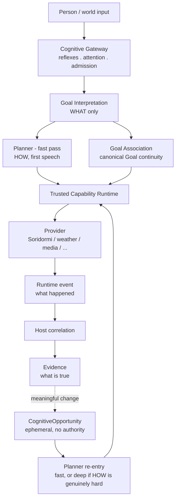

# Chromie Architecture Audit

**Status:** external, point-in-time review — not a maintained authority document. Produced by
Claude Code at the project owner's request on 2026-08-28 by reading the documentation set
against the source tree. It does not update itself and should not be cited as current fact once
the architecture or evidence it describes has moved on; [`docs/STATUS.md`](docs/STATUS.md) and
[`docs/PROJECT_CHARTER.md`](docs/PROJECT_CHARTER.md) remain the authoritative current sources.
This document is historical/decision material in the sense described by
[`docs/DOCUMENTATION_AUTHORITY.md`](docs/DOCUMENTATION_AUTHORITY.md), retained for its reasoning
rather than as an owner of any current fact.

A styled, interactive version of this report (rendered diagram, formatted tables) is published at
<https://claude.ai/code/artifact/23fcbf7f-8167-497d-9460-46840b012858>.

## Method

Read all 57 files under `docs/`, the root-level authority documents (Charter, Status, Roadmap,
Checkpoint, Handoff, Runbook, Contributing…), and cross-checked their claims against the actual
`agent/`, `orchestrator/`, `scripts/`, `tests/`, and `.chromie/` evidence trees, git history, and
hardware/model configuration. No source file was changed by the review itself.

## Top-line verdict

The architecture is coherent and the documentation is not fiction — module names, file layouts,
test counts, and a large evidence archive all check out against what the docs claim. The risk is
not that the design is wrong; it is that the design is **ahead of what has actually been
validated**, and that the choice of small local models under a single-GPU deployment is in real
tension with the multi-stage semantic pipeline the architecture asks of them.

Asked directly: reasonable as an architecture, over-extended as a project for the team and
hardware actually running it. That gap — not a flaw in the shape of the design — is what is worth
fixing first.

## Scale of the documentation

Before judging plausibility, the scale itself is a finding.

| | |
|---|---:|
| Tracked Markdown files repo-wide | 97 |
| Words across all docs | ~174,000 (≈580 pages) |
| Committers in git history | 1 |
| Commits, 2026-05-21 → 2026-08-28 | 673 |
| Lines of Python (incl. ~93k of tests) | ~244,000 |
| `def test_` functions found | 2,256 |

`STATUS.md` separately claims "2,123 tests plus 20 legacy Agent tests" for its last full gate —
close enough to the 2,256 counted directly in `tests/` to trust the number, not treat it as
fabricated.

That combination — one person, no team, this volume of code and constitutional prose, at this
velocity — only makes sense with heavy AI-agent-assisted development, and the repository confirms
it: `AGENTS.md`, `.chromie/`, and `CONTRIBUTING.md` are written explicitly *for* coding agents, not
human onboarding. The documentation set is best read not as documentation for a team, but as a
persistent constitution a stateless AI agent must re-absorb every session, because it has no
memory of the design fights that already happened.

## The canonical pipeline

Every architecture document (README, Charter, Status, Gateway, Turn Loop) describes the same
shape without contradiction, which is itself notable in a corpus this large:

Four separations do real epistemic work, and they are the strongest part of the design:

- **Runtime event ≠ Evidence.** A provider saying "done" is not proof; only host-correlated,
  schema-checked Evidence is.
- **Evidence ≠ Goal state.** What's true is separate from what's still owed, so a completed
  sub-step doesn't get silently promoted into "the request is done."
- **An opportunity is not a decision.** `CognitiveOpportunity` can legitimately produce zero
  Activities.
- **WHAT stays fixed while HOW moves.** Goal Interpretation is barred from ever naming a
  capability, an argument, or a word of speech.

This is sound distributed-systems thinking applied to a conversational agent, and it is not just
asserted — the module layout backs it up. `agent/app/goal_association_contract.py`,
`goal_association_schema.py`, `goal_association_validation.py`, `goal_association_prompt.py`,
`fast_planner.py`, `deep_planner.py`, `planner_validation.py`, and the matching
`orchestrator/runtime/planner_reentry.py`, `tts_text.py`, `confirmation.py` all exist exactly
where `STATUS.md` says they do.

## The Charter's 43 principles

`PROJECT_CHARTER.md` (1,155 lines) has a mission, 7 named invariants (`SPEECH-OWNER-001`,
`PLANNER-AUTHORITY-001`…), then 43 numbered principles that `AGENTS.md` treats as binding law — a
coding agent is told it has "no authority to ignore a principle." Read end to end, they sort into
five families of very different weight.

| Family | Principles | Assessment |
|---|---|---|
| Deterministic safety | §5, 6, 7, 10, 28 | Sound, correctly kept boring. Stop/cancel/emergency never wait on a model; phrase-matching confined to that one layer. `COGNITIVE_GATEWAY.md` shows it actually implemented as a pre-semantic path. |
| Single-authority / anti-drift | §21, 24, 30, 31, 33, 35, 38, 41 | The intellectual core. Eight principles restate one idea: one fact has exactly one model-facing author; a second LLM call may never confirm or repair the first one's decision. Named precisely — but restated eight times in a charter whose own changelog contains "Restored Goal Interpretation to WHAT-only authority" as a *recent* entry. `STATUS.md` itself admits GI and Goal Association "still contain legacy independent coverage-certificate calls" — exactly the pattern this family exists to forbid. Correct principle, currently enforced by prose re-assertion rather than mechanism. |
| General engineering taste | §3, 4, 14, 16–20, 32, 40 | True but oddly placed. Good, uncontroversial wisdom ("use less to solve more," "prompt complexity is still complexity") numbered alongside the e-stop rule, which puts safety-critical and stylistic principles at the same rhetorical altitude. |
| Meta-rules about the Charter itself | Irreducibility review, deferred-cognition admission, §32 | Thoughtful, and honest about the bottleneck: an agent gets an explicit path to *propose* changing a principle instead of silently working around it. Every non-trivial architectural call still routes through one named "project owner." |
| Product identity as architecture law | `IDENTITY-TRUTH-001` | Chromie's persona is charter-bound with the same force as the safety invariants, changeable only through the same authorization process. Legitimate to formalize, but a values decision riding at the tier of physical-safety rules. |

Nothing among the 43 contradicts another outright, which is a real accomplishment at this length —
and the Charter/Status split (target vs. ground truth, allowed to disagree openly) is more
disciplined than most projects manage. The open question isn't self-consistency; it's whether
prose principles are the right tool for a boundary that keeps slipping, versus the mechanical
guards Principle 41 calls for, which are only partially built.

## Workflow plausibility: where the design meets the hardware

The single most concrete risk in this audit comes from putting two of Chromie's own documents
side by side.

| Profile | Goal Interpretation | Goal Association | Fast Planner | Concurrent-residency note |
|---|---|---|---|---|
| RTX 4090 (desktop) | `qwen3:4b` | `qwen3:4b` | `qwen3:4b` | Same model for all three — a shared runner can plausibly serve concurrent calls. |
| RTX 5090 (desktop) | `qwen3:4b` | `gemma4:12b` | `qwen3:4b` | Two distinct models must coexist for GI/Planner and GA to run together. |
| RTX 4090 Laptop | `qwen3:8b` | `gemma4:e4b` | `qwen3:4b` | Three distinct models — yet the profile doc states only one 32K runner stays resident at a time. |

**Finding — concurrency claim vs. single-runner hardware.** `HARDWARE_PROFILES.md` states plainly:
*"only one 32K Ollama runner may remain resident at a time while CosyVoice shares the 16 GB GPU."*
The architecture simultaneously insists Goal Association and the Planner's fast pass "run
concurrently" from the same Goal Interpretation result. On the laptop profile, where those roles
use different models, satisfying both claims at once requires either genuine concurrent GPU
residency the same document says the profile doesn't have, or serial model-swapping — typically a
multi-second cost for a model this size — against a stated target of 2.0s + 3.0s total. `STATUS.md`
already concedes this specific live evidence is outstanding.

**Finding — the pipeline may be asking more than the model tier can reliably give.** Every stage is
a small (2–8B), often quantized, local model being asked for strictly-typed, multi-part structured
output. The project's own latest recorded evidence (iteration 50, RTX 4090 / Qwen3 4B) reports
**32/36 contract-valid, ~25/36 strict semantic passes, and four coverage-contract failures
returning HTTP 503** — roughly a 70% strict pass rate on the narrowest slice of the pipeline (GI
alone), honestly reported, not hidden.

**What holds up well.** The event-driven re-entry model, the WorkDAG/DAGEngine split, and the
resource-exclusivity model (`chromie.voice` as one exclusive resource reusing the existing
`ResourceArbiter`) are textbook-correct choices, and the same vocabulary is used identically across
the README, Charter, Gateway, and Execution-Lanes documents — no place was found where two
authoritative documents described the pipeline shape differently.

## Is the paper trail real?

| Claim (in docs) | Checked against | Result |
|---|---|---|
| Named GA modules exist and are layered as described | `agent/app/*.py` | Confirmed |
| Named orchestrator modules exist | `orchestrator/runtime/*.py` | Confirmed |
| "2,123 tests plus 20 legacy" full-gate claim | 2,256 `def test_` across 207 files | Consistent |
| Retained live-iteration evidence (36-case cohorts, debug bundles) | `.chromie/acceptance/`, `.chromie/debug/` | Confirmed — 180+ dated evidence runs |
| Mechanical policy/doc checkers exist, not just described | `scripts/check_docs.py` (946 lines), `check_repository_policies.py` (1,897 lines) | Confirmed, substantial |
| "Router service removed" / no `/route` API | `router/` directory | 0 lines — confirmed empty |

A huge fraction of "architecture debt" in fast-moving, agent-assisted repos is documentation
describing an aspirational or abandoned design. That is not what is happening here. The evidence
archive under `.chromie/` — dozens of named debug bundles and live-iteration cohorts, honestly
scored including failures — is the strongest single piece of evidence that this project's
self-reporting is trustworthy rather than aspirational.

## Recommendations, in priority order

1. **Retire the GI coverage-certificate second call.** Apply Principle 30 to the implementation,
   not only the prose. Give Goal Interpretation a stronger model — it gates every downstream stage
   — or replace the second *semantic* call with a deterministic structural check. The certificate
   is the reviewer chain the charter itself says not to build.
2. **Prove concurrency before relying on it.** Where GI, Goal Association, and Fast Planner land on
   three different models, measure actual GI→GA→Planner wall-clock time before trusting
   `INTERACTION-LATENCY-001` there. Default those roles onto one shared model, as the desktop RTX
   4090 profile already does, until the measurement is clean or the serving stack genuinely holds
   multiple models resident.
3. **Convert recurring drift into a mechanical check.** "Restored X to WHAT-only authority" has
   recurred in the changelog for the same boundary more than once. `check_repository_policies.py`
   is real, substantial infrastructure — extend it to flag a second LLM-client instantiation inside
   a stage module that already owns a primary call.
4. **Split the 43 principles into invariants and guidelines.** Pull the 8–10 that are load-bearing
   (safety, single-authority) into a short, machine-checked list distinct from general engineering
   taste.
5. **Break up `_resolve()`.** `STATUS.md` reports it at roughly 1,036 lines after trimming — the
   clearest candidate for the project's own decomposition exception clause.
6. **Write a one-page fast-entry doc.** One diagram and the five rules that actually matter, as the
   front door, with the full charter kept underneath as the reference tier.

## Punch list

| Severity | Finding |
|---|---|
| High | Concurrent GI/GA/Planner claim vs. single-resident-runner GPU constraint, sharpest on the RTX 4090 Laptop profile |
| High | Principles 30/31 (one semantic authority, no reviewer chains) self-reported as not yet true in GI/GA/Fast Planner |
| Medium | ~70% strict semantic pass rate on the narrowest (GI-only) slice of the pipeline, on the target 4B model |
| Medium | Anti-drift guardrails currently prose more than mechanism; changelog shows repeated "restored X to Y-only authority" cycles |
| Low | Single committer, single "project owner" decision authority — fine today, a real constraint if the project grows |
| Low | Persona (`IDENTITY-TRUTH-001`) is charter-locked at the same authority tier as safety invariants |

---

*Read-only audit; claims about live latency and concurrent GPU residency are inferences from the
project's own hardware and status documents, not from a live run.*
