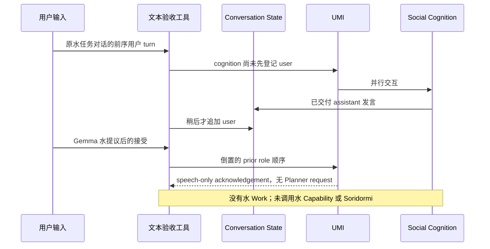
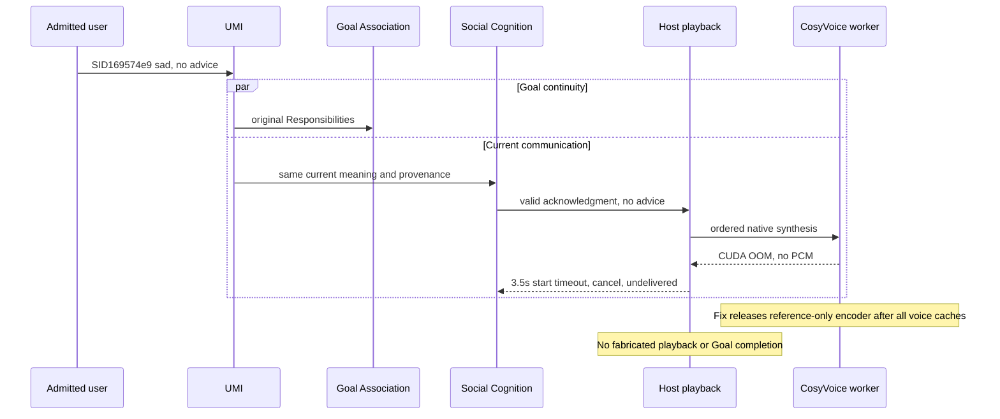
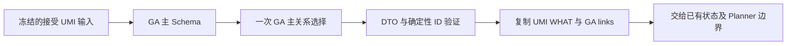
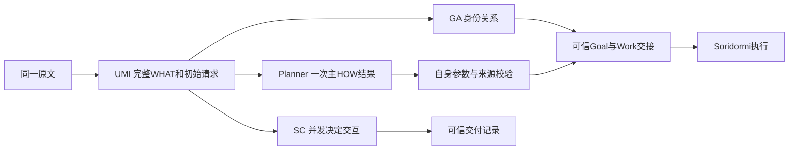
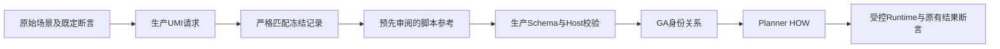

# Chromie 设计与实现审计

审计日期：2026-10-04；最后更新：2026-10-05。读者：项目负责人及维护者。本文记录发现和证据，
不替代章程、组件契约或 [当前状态](docs/STATUS.md)。

## 结论与范围

当前项目仍处于开发和资格验证阶段。本次发现实际职责冲突、过期参考数据、
测试基础设施不匹配，以及把历史通过记录写成当前状态的问题。
Goal-driven single-authority architecture 是审计依据；测试通过也不能覆盖章程冲突。

审计基线为 `main` 的 `90d0af90c9d3d2c0fe9847d140d09279dfdeff26`。
开始审计及文档编辑前已抓取远端，`HEAD` 与 `origin/main` 相同。
工作区原有 36 个变更路径，已完整备份；测试针对包含这些既有修改的工作区，
不是干净提交。初次清理的新增修改限于文档和过时图资产，没有更改模型、提示词、
DTO、运行时或测试断言，也没有提交、推送、重建或重启服务。
后续原职责修复及新实时证据见下文；章程始终未修改。

覆盖治理与恢复文档、Gateway/Attention Review、UMI、GA、Fast/Deep Planner、
SC、Host/Runtime、文本验收工具、基准数据及完整本地测试。
这里的“项目审计”不代表逐行证明所有分支正确，也不代表当前部署或实物资格验证。

## 设计与实现不一致

| 优先级 / 边界 | 应有契约与实际证据 | 处理及尚缺证据 |
| --- | --- | --- |
| P1 / UMI → Planner | 章程原则 30 禁止 UMI author `bindings`，由 Planner 提取规划参数；`CognitiveResponsibilityProposal.bindings` 及 UMI prompt 已要求提取稀疏字段。章程同一文件较早章节又允许这些字段，形成内部冲突。 | 保留并标记现有实现冲突，未修改章程或授权 UMI 参数提取。此前授权问题未解释清楚，负责人随后提出疑问；本次不据此推进职责变更。选择哪种边界仍需清楚的设计决定及验证。 |
| P1 / Attention Review | 原则 30–31 禁止同一语义权威再次调用模型改判；现有 reviewer 根据问句、问候或名字的 surface cue 触发第二次 `generate`，输出来源为 `attention_review_model_repair`。 | 已用真实 reviewer 和脚本化模型结果复现两次调用。需在原权威中解决完整主结果与不确定性处理，不应由 Host 词表或第二次语义调用修复。未修改行为。 |
| P1 / UMI Schema → DTO | 动态 Schema 的 `bindings` 允许任意键，DTO 递归拒绝 Planner-owned 字段。 | 现有 `umi-schema-binding-gap.json` 保留此问题。本次不以放宽 DTO 解决；须先确定 UMI 职责，再统一 Schema/DTO/native grammar。 |
| P1 / 文本工具 → Conversation State | 生产 admission 在 cognition 前记录用户；文本工具在并行 SC 已交付后才 `record_user_turn`。实际矩阵包出现 assistant/user/assistant/user。 | 已复用生产 `record_accepted_user_turn` 修复；受控回归和新水任务历史证实 user/assistant/user/assistant 且无重复。水任务仍失败，不能声称此修复解决了接受提议后的 Work 理解。 |
| P1 / GA 关联契约 | Schema 移除了已有 `new_goals` identity-only API，接收代码将历史/替代关系清空；完整媒体意思还被错误要求提前提供操作参数。 | 已在 GA 原契约恢复主结果关系数组、验证与原样传递；GA 和 Planner 各自移除错误的上游媒体参数前置条件。新部署两轮 79 案例已留存，但整体资格未通过。未改变 UMI WHAT/初始激活、Planner HOW、Host 状态职责或 Charter。 |
| P1 / Planner 复合动作 | Charter 允许一个 Responsibility 保留完整复合意思，由 Planner 分解 Activities。真实主调用的能力过滤却排除点头；Fast/shared validator 还强制混合动作先被 UMI 分成不同 Goal。 | 真实 Schema 与合法参考被拒证明是 Planner 契约缺陷。负责人现已授权并实现取消类别排除和强制上游拆分；冻结12对照由9/12变为12/12。可选社交表达仍归 SC，真实模型完整回归待完成。 |
| P2 / UMI 基准 | 旧 references 请求 standing `social_cognition`，850 个 body-action 结果缺现行 family。 | 已移除重复 standing request、补齐既有 family；1,496 当前 Schema/Host 通过。输入、完整意思、数量、来源、顺序和划分不变；不是模型推理或独立语义资格证明。 |
| P2 / Planner 基准 | Fast 204-case corpus 的普通发言及可选 social decoration 已退休；原 qualification adapter 另造 Schema 并调用删除的 keyword。 | 已使用生产调用的实际 Schema；204 references 机械有效。退休能力的语义覆盖仍未重新合格，Deep 全面兼容性也未建立。 |
| P2 / SC silence 决策 | 章程允许 SC 决定是否表达；fresh interpretation 且无 pending/already-spoken 时，Schema 排除 `silence`，Host 同样拒绝。 | 静态契约探针确认收窄。须复核“每次调用 SC”与“每次必须发言”的区别，结合明确确认/失败结果等强制义务设计对照案例。本次未将每次沉默都判为正确，也未改行为。 |
| P2 / Workflow replay | 大量测试在首个 UMI HTTP 请求上返回 409 exact-request mismatch。 | 当前请求与冻结捕获包不一致，模型语义输出尚未发生；不能计作模型能力失败。不得无审阅地重新捕获并把目标改成候选答案。 |
| P2 / 维护文档 | 状态、checkpoint、handoff 和 audit 叠加多个时期的“当前”说明；图资产无 SC，旧 Planner speech/PresentationCommit 描述与当前源不符。 | 本次合并恢复记录、删除退休图、修正索引和基准说明。相关接口、Gateway、生命周期和 rollout 的退休说明已一并修正；实现冲突仍保留。 |

## 实际路径与最早错误边界

### Attention Review：两次调用改判同一语义

此为受控执行：使用真实 `AttentionReviewer`，模型结果由脚本提供。
输入 voice / zh-CN `你好。`，gate enabled、inactive、无 prior dialogue；
同一 turn/session/context digest 贯穿两次调用。没有真实模型或物理音频调用。

| 模块 / 职责 | 权威输入、实际输出 | 预期及边界状态 |
| --- | --- | --- |
| Attention 主模型 / addressedness | 原始 turn；返回 addressed=false、speech_act=reply、confidence=.98。此组合在 inactive Schema 可通过。 | 应在主结果完成判断或诚实保留不确定性。脚本模拟误判，不证明部署模型错误率。 |
| Reviewer / 机械验证 | Host surface greeting cue 判定与结果矛盾，构造含 primary classification 的 repair prompt。 | 不能利用普通词表成为另一语义判断者；这是确认的架构冲突边界。 |
| Attention 第二次模型调用 | 同一输入加候选判断；返回 addressed=true、speech_act=greeting、confidence=.99。 | 禁止为同一语义改判再调用模型。实际总调用数 2。 |
| Reviewer / Gateway handoff | 输出 admit、greeting，source=`cognitive_gateway.attention_review_model_repair`，保留原 correlation。 | 身份关联正确，语义生成路径不符合单权威原则。后续 UMI、SC、Planner 未在该探针调用。 |

现有 `test_bare_chinese_greeting_primary_false_negative_is_repaired` 明确断言
两次调用。它验证现有机制，却不能证明该机制符合章程。
启动触发是模拟主模型误判；根因是 reviewer 的 surface 判定及同权威修复策略；
下游 admit 是症状。修复应发生在该边界并增加主结果/不确定性对照覆盖。

### 已留存的接受水任务：错误的历史顺序

这段工作流来自此前完整矩阵包，不是本次重新执行的部署证据。

```mermaid
sequenceDiagram
    participant U as 用户输入
    participant H as 文本验收工具
    participant M as Conversation State
    participant I as UMI
    participant S as Social Cognition
    U->>H: 原水任务对话的前序用户 turn
    H->>I: cognition 尚未先登记 user
    I->>S: 并行交互
    S->>M: 已交付 assistant 发言
    H->>M: 稍后才追加 user
    U->>H: Gemma 水提议后的接受
    H->>I: 倒置的 prior role 顺序
    I-->>H: speech-only acknowledgement，无 Planner request
    Note over H,S: 没有水 Work；未调用水 Capability 或 Soridormi
```

| 模块 / 职责 | 实际输入与输出、关联 | 预期及边界状态 |
| --- | --- | --- |
| 文本工具 / 用户 admission | 同一对话 SID，先 await Runtime 再记录 user；并行 SC 已先写 assistant。 | 应复用生产 `record_accepted_user_turn`，每个用户 turn 在 assistant 前且只有一份。已确认错误。 |
| Conversation State / 历史保留 | 按实际写入顺序提供 assistant/user/assistant/user。 | 所需顺序 user/assistant/user/assistant；存储不是另一语义修复者，不能猜测重排。 |
| Gemma UMI / WHAT | 接受 turn SID `8dc72101`、primary call `llmcall_user_meaning_interpreter_5aadcd1f18784240`；speech-only acknowledgement，仅 GA request。 | 前一 turn 为显式水提议，应保留接受的完整意义。未请求 Planner 已确认，但错误上下文的因果份额未知。 |
| GA / SC / 后续执行 | 关闭 speech interaction；Planner、水 Capability、Soridormi 未被调用。 | 正确承接还是语义遗漏须在纠正 admission 的受控完整重跑后判定；不能由 Runtime 关键词补发 Planner。 |

Qwen9 前序 turn 是饮品选择问句，4B 前序 turn 已错误声称自己口渴；
不能将三个不同 episode 视为相同模型输入。
探针、矩阵包和源位置保留在 Handoff 指定路径。

### 基准 references：未到候选模型的失败

| 边界 / 所有者 | 输入与实际输出 | 预期及边界状态 |
| --- | --- | --- |
| GA corpus author / 冻结参考 | 现存输入配旧 `new_goals` reference；validator 重建当前 association-only Schema。 | 当前目标应为 associations + unassociated refs；参考适配错误，非模型推理失败。 |
| Fast qualification adapter / 事务组装 | 旧 keyword `auxiliary_social_capabilities` 传入当前 schema helper；TypeError。 | 使用当前 Work-only projection。失败在推理前，尚未证明后续 reference 合法。 |
| Workflow replay transport / 冻结精确请求 | 当前 UMI 请求与 historical capture 不同；HTTP 409。 | 要保留真实事务与审阅过的捕获一致；本次未出现可判分的模型结果。 |
| 生产 DTO/Host / containment | 拒绝退休字段或缺少 metadata 的 fixture。 | 不降低拒绝规则；保护契约与修正失效测试是不同工作。 |

## 2026-10-04 本地验证

本节是初次文档清理前后的历史基线，最新修复结果见下文。
完整原始输出保留在 `/home/chromie/github/chromie/.chromie/acceptance/project-audit-20261004T011454Z/`。
该目录为本机忽略证据，不随 Git 传输，应在跨机器恢复前复制。

| 检查 | 本次结果 | 证据与限制 |
| --- | --- | --- |
| Canonical `./scripts/run_tests.sh` | FAIL：benchmarks 6 failed / 147 passed | `canonical.before.log`；policy、ownership、Ruff、mypy、config、docs/scenario 前置阶段通过，main/legacy 后续阶段未到达。 |
| Standalone `python -m pytest -q tests` | FAIL：124 failed / 3781 passed / 5 skipped，1013 subtests | `pytest.before.log`、`main-failures.json`；冻结请求、旧 GA shapes、mock 缺方法及 metadata 等多个簇，未逐项证明所有根因。 |
| Standalone benchmarks | FAIL：6 failed / 147 passed | `benchmarks.before.log`；三个 corpus/qualification 边界受影响。 |
| General Ability Level A | FAIL：39/45 | `level-a-before/`；六个案例缺当前 body-effect fixture metadata。仅确定性 Level A，不能视为 live robot 结果。 |
| Semantic authority audit | PASS，但范围有限 | 未检出 Attention Review 第二次语义调用；通过不代表全部架构原则已满足。 |
| 文档修改后的检查 | 文档、repository policy、test ownership PASS；canonical 仍 FAIL：6 benchmarks failed / 147 passed | `check_docs.after.log`、`policies.after.log`、`ownership.after.log`、`canonical.after.log`。清理未改变原有失败集合；main 结果来自清理前，源码/测试修改与初始备份一致。 |
| 受控 Attention / SC 探针 | 2 次同权威调用；fresh SC dispositions 为 communicate/deliberate | `attention-probe.json`、`sc-silence-schema-probe.json`；不是 native inference 或行为资格验证。 |

本次只读观察 Agent/LLM/ASR/TTS 服务健康，不验证其源码与当前工作区绑定。
没有新 live cohort、麦克风、可闻播放、相机、抓取或实物机器人证据。
既有矩阵成绩与 runtime identities 仍见 [Handoff](HANDOFF.md)，不得由健康状态升级为资格通过。

## 清理与后续工作

移除旧图的两组 SVG/PNG 及 manifest，共 5 个退休资产；README 改为链接现有
章程图和 turn lifecycle。没有新建维护文档、环境变量、兼容路径或架构术语。
保留最新矩阵及未解决 admission defect，旧累积恢复/审计叙事回归 Git 历史，
修改前的脏文档也在本机备份。维护 Markdown 103→103，docs-root 58→58，
core reading path 15→15；大小仅是测量，不是修复正确性的证明。

未清空或重写失败测试，也没有批量改写冻结 reference JSON。
[基准说明](benchmarks/datasets/fast_planner_daily_life/README.md)区分历史覆盖与当前资格。

文本 admission 的后续修复和完整重跑见下文。下一步在原职责下统一 UMI
Schema/DTO、移除 Attention Review 同语义修复路径；具体实现需遵循既有
[资格验证方法](docs/LLM_PROMPT_QUALIFICATION_METHOD.md)与
[Roadmap](ROADMAP.md#social-cognition-migration) 的当前交付顺序。
SC silence 的条件应在对照输入和明确强制沟通义务下复核，不做盲目放宽。

此次也对齐 HLIC、Turn Loop、Goal-driven architecture、API/Gateway、rollout 和
延迟证据说明中的已确认退休职责；保留历史 canary 名称及原始证据，不将其冒充
当前 SC 事务。Attention 的二次改判明确标为违规实现，未作为许可。
章程自身的 binding 冲突明确保留，
不可将其当作既有实现的自动授权。当前失败基线使交付、目标资格和模型能力排序保持开放。

## 原职责修复与第二轮实时审计 — 2026-10-04

负责人明确要求未证明必要性前不改章程。本轮未修改章程、模型、角色提示词、
Schema、DTO 或认知职责。修改为文本工具的既有 admission 调用，以及六份正向
Level A 场景中九个 body_action 参考结果的缺失 `body_effect_family`。
走路使用既有 task_physical_effect；点头/眨眼使用 social_expression。
输入、WHAT 原文、source spans、refs、请求、数量、顺序及其他原判据逐字段保持不变；
预期输出补充同一类别。冻结 native 79-case corpus 没有修改。

### 实际水任务路径与修复机制

新 focused episode 的三个 SID 为 e2cf6af1、dbad9b42、7a903c8e：
问候 → “I am a little thirsty, can you help me?” → “sure”。
SC 第二 turn 明确说 “Would you like me to get you some water?”。
这次不是原矩阵中的其他模型、其他前序提议。

| 模块 / 所有者 | 权威输入与实际输出、关联 | 预期及边界判断 |
| --- | --- | --- |
| 文本 Gateway / admission | 同一 conversation、三个独立 SID；仅在 admit 后、Core 前调用既有记录 API。 | 用户先登记；正确。不新增语义分类、Goal/Task 或 Memory 提取。 |
| Conversation State / 对话证据 | 前两次 SC 的历史从 []、[assistant,user] 变为 []、[user,assistant]；第三次从 [assistant,user,assistant,user] 变为 [user,assistant,user,assistant]。role hash 与已知角色的 SHA256-16 精确匹配。 | 正确；后续 `record_user_turn` 合并同 SID 用户记录，保留既有语义补充。 |
| UMI / 当前 WHAT 与认知请求 | 新历史下仍将 sure 输出为 speech acknowledgement，仅请求 GA，confidence .98；没有 Planner 请求。 | 应保留接受明确取水提议的完整意义并请求所需 HOW；语义边界仍有缺陷，精确 prompt/context/contract 根因未全部隔离。 |
| GA / 纵向关联；SC / 发言 | GA 承接现有 WHAT；SC 提议和确认已生成。关联 SID/refs 保留。 | 未重写 UMI，也未由 Host 补发 Planner。独立正确性不能由最终说话推定。 |
| Planner / Work；Capability Runtime / 执行 | Planner、水 Capability、Soridormi 取水未被调用。 | 整例仍失败。新 full cohort 的确认语句说会取水，也没有实际 Work，不能算完成。 |

启动触发是并行 SC 在 checker 后置登记用户前交付。确认的根因是工具遗漏生产
admission 的现有调用；Conversation State 按实际顺序存储不是根因，也不能猜测重排。
本次修复该入口，保留后置语义合并。受控测试使用真实 State、Coordinator 和 Ledger，
覆盖 SC 已交付及稍后交付；修改前 2 failed，修改后通过。Core 进入时已有用户，
但没有提前创造 Goal/Task。它证明时序机制，不能证明 UMI 接受提议的语义已经正确。

### 验证与限制

证据根：`/home/chromie/github/chromie/.chromie/acceptance/audit-repair-20261004T014950Z/`。
修改前再次 fetch，HEAD/origin/main 仍为 90d0af90；完整备份 55 个已脏路径。
Agent 容器与当前 packaged source 精确匹配，digest 为
8be8ad75cdd55dc7141ba4a031e3125dd65b70476638b6510a17740d4bb91bce。
模型为固定 Qwen3.5-4B AWQ；runtime profile、模型设置、能力清单和服务镜像相同。
Agent/LLM 未重建或重启；恢复原有 headless MuJoCo/MCP 服务后运行。

| 检查 | 结果与证据边界 |
| --- | --- |
| 首次服务预检 | 79/79 在模型入口前连接失败；0 个可判语义案例。`before-preflight-adjudication.json`；不能当模型得分。 |
| unchanged-source native baseline | 15/79 自动通过；逐案复核为 5 个有限语义通过、9 个自动误通过、1 个未决。`before-ready-adjudication.json`。 |
| 修复后 focused 水任务 | 历史顺序正确；任务仍失败，无取水 Work。`admission-workflow-proof.json`。 |
| 修复后完整 native cohort | 9/79 自动通过；逐案复核为 4 个有限通过、5 个自动误通过。`fixed-full-adjudication.json` 保留全部 79 个判断和 10 个自动增减案例。 |
| 相关本地测试 | 266 passed、6 subtests；`repair.focused.final.log`。原回归 fail-first、142 项 State/checker 检查另有完整日志。 |
| 全部 Level A | 六份陈旧 DTO fixture 补齐后 45/45；此前 39/45。`fixture-reconciliation.json` 证明其余数据未改；这不是模型/部署行为改善。 |
| Canonical gate | 仍在 benchmarks 6 failed / 147 passed 停止；main/legacy 未到达。前置 policy、ownership、static、config、docs/scenario 检查通过。`canonical.fixed.log`；最终重复检查见 Handoff。 |

两轮均尝试 79 案例、零 skipped，源/模型/corpus 未在各轮案例之间修改；
先完成整批、各收一次 bundle，再选修复。因前序失败阻塞后续 turn，
cohort_complete=false、qualification_complete=false。复核是同 agent、非独立评审。
15→9 不能作模型排名或修复收益；7 个自动 pass→fail 为语音交付失败，
另一个为 UMI 未请求 Planner。2 个 fail→pass 也保留；整体语义不退化尚未证明。
观察到后半批 UMI 约 24 秒延迟、SC 超 2 秒目标、TTS 3.5 秒播放开始超时，
不能由这些下游症状猜测全部根因。新 TTS 真实生成后丢弃播放；无麦克风、可闻
扬声器、相机、抓取或实物机器人证明，资源获取/交付仍为 mock simulator。

当前修复仅具备入口机制和 fixture 兼容性证据，仍是待审工作区变更，不是合格交付。
UMI 参数职责与内部章程冲突、Attention 二次语义改判、SC silence、基准/replay
失配、Work 激活、参数来源、服务延迟及独立语义复核继续阻塞资格关闭。
本轮不修改章程来允许现有越权，也没有删掉失败测试或以自动分数代替证据。

## 区分模型能力与其他根因 — 2026-10-04

负责人要求：模型本身能力不足则保留，不调模型；其他原因应修复。
本轮仍未修改章程、模型、语义提示词、Schema/DTO 或认知职责。
fetch 后 main/90d0af90 与 origin/main 相同，先保留全部 61 个已脏路径。
证据根为 `/home/chromie/github/chromie/.chromie/acceptance/root-cause-audit-20261004T061558Z/`。
以下结论区分根因、触发、症状和证据限制，不以自动 `model_contract` 标签代替诊断。

### 已修复的非模型边界

| 既有所有者 / 类别 | 实际输入→错误输出、最早错误边界 | 修复机制及证据 |
| --- | --- | --- |
| Fast benchmark adapter / context_or_harness | 捕获生产 Planner 调用后，streaming 分支另造 Schema，使用退休 keyword `auxiliary_social_capabilities`；TypeError 发生在候选模型前。独立 Schema 还遗漏当前 mode/family、source-token 和 lookup 约束。 | 移除该副本，所有三个事务变体都使用实际调用的 `response_format`；回归逐项核对 system/user/Schema/options/family。修改前 streaming 失败，修改后 9 tests passed；204 references 全部机械有效。reference/manifest 未改，退休 Planner speech/decoration 的语义覆盖仍不合格。 |
| CosyVoice worker / runtime_or_provider | 三个 voice 已有完整 native conditioning，但用于 reference audio 的 ONNX speech tokenizer 及 CUDA arena 一直驻留；真实 TTS 遇到 CUDA OOM，没有首 PCM。 | 缓存全部合法 voice 后、ready 前释放该 reference-only session；已登记 speaker 的 synthesis 使用原 conditioning。未改变模型、worker 并发、播放 timeout、voice prompt/wav、Capability 或 cognition。fail-first 和 cached-voice/reset 回归、隔离原生资源探针、正常服务 focused 与完整 cohort 均留存。 |
| 两个 identity scenario / scenario_or_oracle | 英/中文身份问答由 SC 交付，Host 保留 satisfied Goal，Planner 未调用；旧 `min_goal_outcome_count=1` 错报遗漏 Plan 并标为模型失败。 | 替换为既有 `expect_created_goals_satisfied=true`，其余输入/身份/语言/延迟/安全判据逐字段不变。12 fail-first；完整 acceptance unit file 136 passed。完整 79 案例的保留输出离线重新验证，两个身份场景仍因原 2s SC 延迟失败，未增加分数或伪造新 native 运行。 |

### 原始 sadness/no-advice episode：模型正确，交付失败

原 turn SID `169574e9`，输入为 “I'm sad. Please don't give me advice yet.”。
UMI 保留 sad/no-advice，GA 与 SC 并发。SC primary call
`llmcall_agent_a45b7a5180114637` 正常 stop、Schema/DTO 接受，约 2307ms 决策；
答复 “I hear you, and I'll wait.” 没有建议。原始 call、请求和事件关联在
`sad-model-calls.json`、`tts-root-cause.json` 及旧 full cohort case60 中。

| 模块 / 职责 | 权威输入及实际输出、关联 | 预期与边界判定 |
| --- | --- | --- |
| Text admission / Host | 用户原文先登记；同 SID 的完整 UMI Responsibilities；没有吞掉 no-advice。 | 完整 admission 正确；此前历史顺序修复已生效。 |
| UMI / WHAT；GA / 纵向关联 | UMI 输出悲伤和不建议的 speech 意义；GA 承接同 refs，SC 同时收到当前互动证据。 | 未观察到该 episode 的意义遗漏；GA 独立语义资格不能由 SC 回答反推。Planner/物理 Capability 不需要且未调用。 |
| SC / 当前发言 | primary call 上述原文，acknowledge、context_grounded、r1；Host 接受并排队。 | 该原始答复正确，没有 advice；不是模型不能理解悲伤造成的无声。 |
| Host TTS scheduler / ordered playback | 4787.5ms schedule、4788.2ms request、4790.3ms stream；未发生较晚才启动 TTS。 | 及时派发正确，关联原 SC activity/语音 ID。 |
| CosyVoice / native PCM | 5698ms `CUDA out of memory`，20MiB allocation、仅20.75MiB free；worker 用6.37GiB，GPU 总15.57GiB；没有 PCM。reference-only encoder 仍驻留。 | 最早已证明失败在 provider resource lifecycle；SC 模型结果已经正确。其他并驻模型/声学生成也是共享显存条件。 |
| Playback barrier / delivery containment | 第二次 TTS 尝试后仍无 PCM；8288.4ms 到 3.5s 起播上限，8289.2ms cancel-before-start，8292.4ms SC task failed。 | 保持 fail closed、不记为已交付；timeout/cancel 是资源失败的下游症状，不通过加时来掩盖。 |
| 后续 SC opportunity / 未交付沟通需要 | 不同 call `llmcall_agent_12d1b67b0c5648fe` 基于明确 TTS failure need 重试原 acknowledgment；仍未交付。 | 这是下游的新沟通需要，不是在线第二模型复判第一语义。重试不能将此 episode 算通过。 |

```mermaid
sequenceDiagram
    participant U as Admitted user
    participant I as UMI
    participant G as Goal Association
    participant S as Social Cognition
    participant H as Host playback
    participant T as CosyVoice worker
    U->>I: SID169574e9 sad, no advice
    par Goal continuity
        I->>G: original Responsibilities
    and Current communication
        I->>S: same current meaning and provenance
        S->>H: valid acknowledgment, no advice
        H->>T: ordered native synthesis
        T-->>H: CUDA OOM, no PCM
        H-->>S: 3.5s start timeout, cancel, undelivered
    end
    Note over T: Fix releases reference-only encoder after all voice caches
    Note over H: No fabricated playback or Goal completion
```

隔离原生探针中，缓存三 voice 后释放 encoder，free memory 从 1,802,240,000
增至 2,903,244,800 bytes，约释放 1.1GB；PyTorch reserved 仅降 8MiB，
allocated 不变。五个英/中/混合 cached-voice 请求均有 PCM。
该测量另运行 GC/PyTorch cache release 且禁用网络，有 normalizer fallback；
它证明资源驻留和 cached synthesis 可用，不证明正常服务 cold latency。
生产修改只释放 ONNX session，不增加 gc/empty_cache 或变更 frontend/provider 设置。

官方 Compose build 因重新拉取未固定系统依赖未完成；改用原镜像加同一
provider source 文件的 proof image。首次 provisional service env 引入错误代理，
该启动失败保留；随后恢复全部原61 env entries 和 mounts，逐项一致，再暖机、
复现原 case。普通服务英/中/混合 readiness 全有 PCM；focused SID `be8fa701`
实际 SC→PCM 877.141ms、discard 起播880.17ms，无 advice。
镜像、source digest、准确恢复命令和原镜像 tag 均见 Handoff；不将 source-only
build 当作官方依赖 rebuild 或 release。生成语音后丢弃播放，无可闻扬声器证明。

### 完整重跑、误判修正及剩余根因边界

固定4B、prompt、实际 model options、capability/corpus；TTS 部署绑定后一次运行
全部79案例，过程中不编辑源码、不重建、不重启、不改模型或场景。各 source/
container/image ID 的前后一致由 `source-verification.after-cohort.json` 验证。
结束后只收一次 `/home/chromie/Downloads/chromie_debug_bundle_20261004_161413.tar.gz`。

| 证据 | 本轮结果与范围 |
| --- | --- |
| Provider/adapter focused tests | 39 passed、21 subtests；`focused.after.log`。 |
| Fast frozen mechanical validation | 204 validated，51 contrast sets；streaming52 / primary72 / re-entry80。不是当前语义通过。 |
| Full native automatic | 17 passed / 62 failed，79 attempted、zero skipped；前序失败阻塞后续 turn，cohort_complete=false、qualification_complete=false。 |
| Same-agent full adjudication | 10 个有限结果通过、6 个自动误通过、1 个自动 pass 未决、62 个保留失败；独立评审仍未完成。 |
| TTS events | 旧批次7 tts_error、19 playback-start-timeout；本批次均0，有103首PCM事件/81个session。旧7个error不全是同类OOM，不能混算。 |
| Automatic flips | 9 gains / 1 loss，相对上一轮9/79；部分 gains仍是语言、未查询或具身真实性未决。loss为走路请求遗漏Planner；语义不退化尚未证明，不能算模型改进。 |
| Canonical local gate | 5 benchmarks failed /151 passed，四GA、一UMI；main/legacy 未到达。旧6 failures因 Fast adapter 修复少一个；更早124 main failures是历史结果。 |

自动误通过具体是三份中文输入收到英文回复（identity、tired、respectful
disagreement），能力问句被改成自我介绍，公交只答“会查”而没有查询/不确定性
交代，以及未经核实的群聊传闻变成协助传播。favorite-season/body-truth 的人格
经历与具身表述需要 exact identity/Memory/context 复核，保持未决。
点头两次的执行 args 看似 `{}`，实际 catalog default count=2；raw Planner
确有 count2，眨眼count1及顺序已完成，不误报数量丢失。中文偏好 case 仅当前
确认，不证明持久记忆和未来 turn。完整原文和边界在 `fixed-full-adjudication.json`。

此前审计将 silent-nod/come-here 归因于 Reflex，是 reviewer 漏读
`cognitive_runtime.metadata.core_interpretation`；原文确实进入 UMI，不能修复
正确 Host 来弥补认知遗漏。come-here 场景的明确契约是无可信目标时不说话、不
编造移动方向，所以其有限安全结果正确；UMI 将移动当 speech/turn 的职责判定
仍未合格。先前错误报告未删除，修正在 `reflex-adjudication-correction.json`。

纯眨眼原 case SID `100ff423` 已核对 exact primary call、完整 t0..t5 source、
无历史/active Goal、正确 sim 状态、正常 stop 和有效 Schema/DTO；输出保留
blink-once/body_action/social_expression，却只请求 GA。相关 prompt 明确所需
Planner HOW，Host 未增补请求是正确 containment。已确认的是 UMI 主输出遗漏
Planner 请求；尚未证明是模型能力上限，也未排除提示/契约等因素。此前
`model_inference` 分类过于确定，现修正为原始输出错误、内在原因未证实。
UMI 仍负责初始 Planner 激活，未修改其模型、提示、DTO 或 Charter。

以下问题仍不能忽略为模型不足：GA/UMI 冻结目标与当前契约失配、historical
workflow 请求409、UMI binding职责与章程冲突、Attention同语义二次改判，以及
compound body-family/cardinality/catalog约束、参数来源和SC provenance/context。
SC422、JSON截断和延迟需要各自的 primary事务/资源证据；当前根因未知处保留
unknown。修复不得靠改章程、Host补发Planner、第二语义审查模型、兼容退休
字段、放宽安全/来源/Goal覆盖或批量改写reference来获得绿灯。

没有新增维护文档、环境变量、运行开关、架构层或项目术语；维护Markdown
103→103、docs-root58→58、core reading path15→15。两份identity oracle改动
发生在native cohort结束后，只有保留输出的离线重判；不将其冒充新部署证据。
修复及审计仍待评审，整个项目/目标资格与交付保持未通过。

## 冻结参考与验证工具的职责修复 — 2026-10-04

本轮基于同一 main/90d0af90；fetch 再次确认与 origin/main 相同。开始时备份全部
68 个已脏路径；GA JSON 在写入前另存原始字节。UMI 原始语料入场无变更，保留在
Git 中；早先绝对路径备份未生成本地副本，最终从该 Git revision 重建并逐个核对
全部1,496 修改前摘要，原始内容完整。`umi-original-backup-finalization.json` 记录此纠正。没有调用候选模型，
没有更改 Charter、模型、角色 prompt、生产 Schema/DTO 或认知职责，没有新部署。
证据根：`.chromie/acceptance/contract-fixture-repair-20261004T084054Z/`。

| 所有者 / 最早错误边界 | 原始失败、预期契约及修复 | 当前证明与限制 |
| --- | --- | --- |
| UMI corpus / scenario_or_oracle | 1,496 参考仍请求 Runtime 已固定唤醒的 SC，850 个 body-action 缺现行 family。移除仅 SC request，保留其他请求及次序，补既有 body family 和对应审查标签。 | 1,496 Schema/Host 全通过；730 task physical、120 social expression。4 项测试通过，包括 manifest tree digest 和标签不一致拒绝。原文、WHAT、上下文、数量、来源、次序、contrast/split 不变；非 candidate inference/独立复核。 |
| GA validator / context_or_harness | 自行重建 Schema，遗漏生产 continuity scopes、uncertainty refs 和 min-confidence 参数。改为捕获实际 primary `response_format`；Host 的已知拒绝不再阻止 qualification 工具捕获其主调用。 | 主调用 Schema 逐字核对与 fail-closed capture 回归通过；没有复制另一套生产规则，没有增加模型调用。 |
| GA corpus / scenario_or_oracle | 无旧 Goal 关系的参考仅以旧 identity-only `new_goals` 表达未关联 refs。逐个证明原 related/supersedes 均空，按既有 association-only 契约迁移 1,300 个 wire references；退休 decision 和空 non-goal 集合移除。 | 全部 1,500 的原输入、WHAT、候选、原关系、置信度、路由、顺序、约束及划分保留；200 个含关系的 wire reference 未迁移。原始字节和逐文件前后摘要均保留。 |
| GA oracle / scenario_or_oracle | 旧责任映射只检查 supersedes，遗漏 related identities，可能将历史引用丢失算通过。映射现在同时检查两类关系；参考验证与 qualification 共用同一映射，并核对 Host 物化结果。 | 新回归以 Schema 接受、Host resolved 但 related IDs 丢失的输出证明 hard/strict pass 都为 false。它暴露失败，没有修改候选结果。 |
| Detached-dispatch test fixture / context_or_harness | 真实 Host 调用现行 `track_capability_dispatch`，过期 `_Sessions` 替身没有该方法，5 个测试在执行断言前抛 AttributeError。替身绑定现行 SessionTracker 跟踪逻辑。 | fail-first 5 failed/3 passed；修复后相关文件与 session trace 共14 passed。新增断言跟踪数量在派发期间为1、收尾后为0；生产执行/安全策略未变。 |

UMI tree digest 为 `d0c0cf766d23ecfb5c2fe317ca889a9bcbe5dd3586f707411c9fd34d693503e7`；
GA tree digest 为 `ca2936e946b508bca7828e52cd1ed833fe916ea53cac0b9c691de85823e744b7`。
`umi-reference-reconciliation.json` / `ga-reference-reconciliation.json` 记录可逆的逐文件
迁移证明；仅恢复退休 wire 字段、移除新增既有 family/related 审查字段即可重建原值。
所有参考仍为 training_eligible=false、independent_semantic_review=false。
冻结测试的负责人复核、target-blind inference 和当前模型资格仍未完成。

### GA 的实际反例路径与生产缺口

这三个反例是真实 resolver 加脚本化参考输出的离线重放，不是 native LLM 或机器人
episode。`ga.boundary-examples.json` 保存每案完整输入、实际 primary prompt/Schema/
options、原始返回、物化结果和来源摘要；body probe 仅在内存补齐既有 social family。

| 模块 / 职责 | 权威输入和实际输出 / 下一边界关联 | 预期、边界判定 |
| --- | --- | --- |
| UMI → GA fixture / 已接受 WHAT | r1 完整“别做原来的了，改成眨两下眼睛。”，旧开放 Goal `goal_07_05_a`；历史引用案保留完成 Goal 及“把刚才完成的目标内容再告诉我一次”。 | UMI 本身未调用；下游投影 DTO 接受。它不应写 Goal 关系或执行参数。不能据此声称真实 UMI 已理解这些 turn。 |
| GA primary decoder / 关系表达 | 当前公共 wire 只能 associations 或未关联 ref。将新任务标为未关联时，Schema 接受 r1，但没有可写位置保留原 supersedes/related identities。 | 最早缺口在可表达的关联契约；单次主结果应能表达替代或历史关联且不重写 WHAT。不能靠 prompt 让不存在的字段变合法。 |
| GA Host / 机械物化 | 从 r1 精确继承 WHAT，生成 new Goal；related/supersedes 都被固定为 []。 | WHAT 复制正确，关系丢失；新增 oracle 已拒绝该结果。该反例没有调用第二模型。 |
| Orchestrator replacement owner / 状态与取消 | 生产 `apply_goal_replacement_resolution` 从 new Goals 的 supersedes IDs 建立取消及 superseded 状态；本重放未提交状态。 | 空关系不能触发已有替代路径。实际旧 Work 是否继续、取消 receipt、safe idle 和新动作执行均未知，不能由纯 resolver 重放断言。Planner、SC、Soridormi 未调用。 |
| Media GA Host / 规划前置条件 | r1 完整“播放《晨光钢琴》”，media_playback、未关联；Schema 接受，Host 要求 UMI-owned media_operation binding，返回 fail_closed、无 Goal。 | GA 在 Planner 前要求参数，现行 Goal carrier 和 Planner projection 都有该前置条件。未往 UMI fixture 添加 binding 来通过；原意应交给 Planner 提取。相关生产契约尚未修改。 |

完整 GA 参考重放的 source/harness/corpus 摘要前后相同；结果为1,090 Host accepted、
200 原有 typed-state negatives 正确 fail closed、1,290 validated，另210 errors：
100 replacement、100 terminal reference、10 media creation。原有200 negatives 的
拒绝原因仍为 intent-only update 无法更新缺少现行 meaning-source 的历史 typed Goal；
没有状态泄漏。它们不是成功履行，也不是模型能力失败，仍保留原缺口标签。

另发现 terminal reference 的上游 fixture 错将复述历史任务继承为 body_action/
stateful_effect/media_playback，共50 案；这是 fixture 类型问题。仅在假设探针改变
该元数据，未写入当前源；即使修正，历史 Goal 关系仍会丢失。信息型/普通发言的
其他50 案不需把模式强行改成动作。

修复关联的公共输出会使当前不能表达的有效关系变得可表达；按既有资格方法的
Global change review，当时尚未修改生产 DTO/Schema。负责人后续明确要求修复 GA
自己的契约、禁止其他模块代判；该指令及原职责修复证据见下方最新记录。
提议保留 GA 的关系权威、UMI 的完整 WHAT、Planner 的 HOW 与 Host 的生成/状态权威，
不需要修改 Charter，不添加第二语义调用。Media 前置条件、Attention 二次决定、
SC silence、历史 workflow 409 和 live 参数/provenance/延迟问题继续开放。

针对性 corpus/adapter suite 为20 passed（完整 corpus 检查另跑，未将排除视为通过），
detached/session suite 为14 passed。迁移前 adapter 修复后 canonical 为3 failed/156 passed；
迁移后的完整 canonical 为1 failed/159 passed，主测试118 failed/3,801 passed/5 skipped、
1,013 passing subtests；这不是绿色 gate。Junit 保留117 个失败 testcase records（其中
behavior suite 含两条失败），以原始终端118 failure 总数为准。82 条 testcase trace
出现 workflow HTTP409；其余35 条仍需逐案 review，不能统称模型能力失败。
维护文档/环境变量/运行开关/架构层数量未增加。本轮只有离线资产与测试工具证明，
此前79-case native run 的身份和限制保持不变；没有新 voice、物理或 release 证明。

Primary provider screen 还保留负责人此前撤回的 Tianxin 拼写歧义 turn 副本，指向
已经删除的 live source scenario。现已删除该 active v2 case 和清单条目，24→23，
其他23 个输入/目标不变；未知名字一般能力断言使用仍保留的 named_lookup_en。
历史v1 及旧24-case证据保留为历史，不作当前可运行声明。这个清理不修复其余
primary 参考缺少 body family 的问题：focused provider tests 仍5 failed/21 passed/
4 subtests，最早错误从缺失来源转为 body reference Schema。未放宽加载器或添加
含混 compound family 来取得通过；完整结果须继续保留为失败。

随后复核 current DTO 与原有 compound split 回归，确认同一次 UMI 结果已有多个
source-grounded Responsibilities 的表示；原 expected dimensions 本来就列出了这些
独立请求。13 个单一动作补齐既有 family；两个 mixed 参考改用该现有 split variant，
精确来源、用户原文、目标判据、数量、先后/同时、confidence、contrast/split 均保留。
这没有扩展 DTO 表达能力、增加语义事实/模型调用或把 Activity/Capability/args
交给 UMI；只是选择既有允许的参考结果，Planner 的 HOW 权威不变。

新合法 body family 又被 provider oracle 的旧字段白名单误报为 downstream field。
修复该已有 WHAT 字段的白名单；binding/HOW 拒绝仍在。修复前5 failed/21 passed，
修复后26 tests/6 subtests 全通过；23 references 的现行 Schema、Host、原 semantic
oracle 全接受。原始23 JSON、两个 split 变体的来源证明、逐文件摘要及完整中间失败
均保留；独立复核和真实模型推理仍未完成。此阶段 full gates 为 canonical1 failed/159 passed；独立 main113 failed/3,806 passed/
5 skipped/1,015 passing subtests，另20 legacy checks 通过。`validation.final.json` 证明
测试期间 source patch 完全不变；所有失败保留，没有 delivery/target/训练资格声明。

| Primary screen 模块 / 所有者 | 本案输入、实际旧输出与 handoff | 修复后的预期 / 边界 |
| --- | --- | --- |
| 冻结 fixture author / WHAT 参考 | “把那个拿给我。”的 r1 是 body_action，来源t0..t6，但缺 family；mixed walk/nod/turn 的单一 r1 与原目标列出的3个动作不同。 | 简单动作补已有 task family；mixed 使用当前已允许的 source-grounded 多-ref结果，各句保留 then/同时及原精确 token。用户输入/目标维度不变，不指定 Activity、Capability 或 args。 |
| UMI dynamic Schema / DTO Host | 相同 request.text、language、context；原 body reference 在 schema/Host 拒绝，qualification 尚未调用 provider。 | 原语义、现行 WHAT field、同一请求覆盖全部 refs；23案通过；UMI模型本身未执行，不能据此声称模型正确。 |
| Provider-screen semantic oracle / 判分 | 新合法 body family 到达白名单，被误报“UMI authored a downstream contract field”，首案阻断整个加载。 | 承认 DTO 已有的 WHAT family，保持 bindings/执行字段禁令和原完整意思/来源/计数/关系判据；26 tests/6 subtests passed。 |
| Qualification runner / model-call boundary | 早先因缺失来源、schema或oracle失败而在真实 provider 请求前退出；后续 GA/Planner/SC、Runtime、Soridormi 均未调用。 | 仅证明参考与工具可加载；未执行真实模型资格、状态提交、Work或音频。未来完整 target-blind cohort 和独立复核仍需要保留。 |

### 进一步修复过期模拟返回与断言

主测试仍有20项在模拟返回进入现行契约时失败，未到达原来的行为断言。
`handoff-fixtures.before.log` 保留20 failed/69 passed/6 subtests 的初始三个模块结果。
逐个检查原始 wire：三个 GA 正向返回均仅选当前来源 refs，related/supersedes
原本全空；因此改为现行 unassociated refs，不添加新关系、WHAT 或模型调用。
未来任务参数、有效/无效时间、独立可执行任务、数量和错误来源等全部原断言保留。
另三个 scenario 只为5个既有 body WHAT及其预期补齐已定义 family；移除该字段
即可逐值重建原 JSON。用户输入、置信度、次序、来源和 Planner 请求不变。

| 实际路径 / 所有者 | 初始输入、错误输出和下游症状 | 修复后的 I/O 与回归 |
| --- | --- | --- |
| 测试模拟器 → GA primary DTO → Host carrier → Planner | 复合动作、未来点头与立即眨眼等完整 r1/r2；模拟器仍返回已退休 identity-only new_goals，DTO 要求 unassociated refs，Host fail_closed，后续 Planner 断言未执行。 | 同一次主调用输出现行 ref 集合；实际主调用 Schema 验证通过，Host 完整继承 WHAT，Planner 数量/次序/证据/时间断言执行。17项恢复，未增加语义 authority。 |
| 不确定性模拟器 → GA → clarification containment | 单字片段 Responsibility 已由 fixture 提供；旧 wire 被拒，测试还检查退休 decision/new_goals Schema字段。 | 保留全部已有含义，单次关联结果及 Host Goal carrier；GA没有 clarification 权限，主 Schema不暴露旧字段。原禁止问句权威的断言仍在。 |
| 行为 scenario author → UMI DTO → suite oracle | walk、blink、nod5个正向参考缺当前 body family；真实 DTO 在其他行为验证前拒绝。 | 只添加既有 family及匹配预期；两个 suite 正向场景恢复。没有真实 UMI推理、机器人或音频。 |
| Weather负向测试 author → GA primary DTO | intent_goal/create_goals helper只提取refs，错误的 output_mode被 helper丢弃，模型根本未收到待拒绝字段；原负向断言因此误报生产故障。 | 测试直接提交带非法 output_mode的公共 wire，Schema和Host都拒绝；正向继承 information及原地点/时间；错误 source_quote仍被 Planner拒绝。 |
| Host exception containment / 固定故障通知；UMI context projection / 语义上下文 | 原测试检查退休的重说文案或 Goal context标题，但当前记录分别是真实系统未完成通知与不含 canonical ID的语义上下文。 | 保留 not_authorized及单次派发断言，故障通知按当前既有确定性契约；上下文检查精确 goal_id/task_id字段不泄漏、完整人类意思仍可见。只更正测试。 |

全部六个相关模块150 passed/10 subtests；中间剩1项退休 GA prompt文字断言也
保留，再改为当前 UMI WHAT/GA association-only合同后通过。原始8个文件、逐文件
摘要、可逆 scenario差异和所有中间失败在 `handoff-fixture-reconciliation.json`
及 `handoff-fixture-before/`，未改生产行为。最终 canonical仍1 failed/159 passed；
独立主测试86 failed/3,831 passed/5 skipped/1,017 passing subtests；legacy20 passed。
`canonical.last-fixtures.log`、`main.last-fixtures.log`/XML 与 `validation.final.json`
记录同一未改变的 source patch。政策、文档和测试所有权检查另在最终文档更新后复核。

工作流 HTTP409另保留完整只读首次失败探针 `workflow-first-boundary.json`：
workflow-normal 的当前 admitted input生成真实 UMI请求，严格 replay在第一步gi
拒绝该请求；position=0、accepted model outputs=0、candidate calls=0。
冻结的Schema缺现行 body family、保留退休 SC激活枚举，system/user prompt也旧；
服务的409是正确拒绝的下游症状，不是模型或远程服务能力证据。UMI DTO、GA、
Planner、Runtime和provider均未进入。实际当前包和完整冻结包及17类差异均保留，
没有放宽严格重放、改写请求或从执行结果拟合目标。86条最终失败记录中82条含
该类409；另1条 workflow变体在进入 candidate之前被同样的旧包阻断，其余为两项
prompt literal guard和一项退休 non_goal_schema断言。它们均未执行真实模型，
不能算模型能力失败；完整6000-case参考的来源、错误注入和预期状态仍需在 GA接口
定稿后逐项复核并重新冻结，不以替换请求哈希或删除测试取得绿色结果。

## GA 原职责接口修复 — 2026-10-04

负责人明确：UMI 判断是否请求 Planner；GA 自己返回正确关联契约；禁止其他模块
代判或自行改变职责。按这条指令在 GA 原所有者修复；未修改 Charter、UMI
提示/DTO、模型、Planner 或 Host 的运行职责。此前“需要授权”的术语指 GA
Schema 无法表达已有的合法关系，不代表应该由其他模块来补判。

本次受控原始案例为 `ga_daily_v1_07_00_supersede_existing`：接受的 r1 完整
意思为“Forget the original goal; blink twice instead”，候选旧 Goal 为
`goal_07_00_a`；参考选择 source r1、supersedes old ID、related=[]。另保留
`ga_daily_v1_07_00_reference_terminal` 的历史解释关系，以及
`ga_daily_v1_04_00_create_without_candidates` 的“Play Morning Piano”完整媒体
意思。输入来自冻结 fixture，UMI/真实模型/状态提交/Planner/SC/provider 都未调用。

| 模块 / 原所有者 | 权威输入、实际输出与最早边界 | 修复后的检查和传递 |
| --- | --- | --- |
| 接受的 UMI DTO / 上游 WHAT 与初始激活 | r1 的完整意思、来源、result type 和原 cognition requests 已给定；本次未调用 UMI。fixtures 是输入，不能用 GA 修正它们。 | 原输入/WHAT/request/oracle 保留。真实 UMI 正确性在此未证明。 |
| GA primary Schema / GA 接口 | 原 Schema 删除 identity-only `new_goals`，只剩未关联 ref；合法历史/替代关系无法表达。这是最早错误，与模型能力无关。 | 主结果恢复 `associations` 与 `new_goals`；每个 identity row 只允许 source refs、related IDs、supersedes IDs。不得输出 WHAT/Capability/args。 |
| GA raw→DTO / GA 主结果 | 受控参考返回完整三个数组；原接收代码忽略它并固定清空关系。有效结果应保留 GA 主选择。 | 必须显式完整数组；缺失/未知/重复/矛盾/终结任务替代/重写 WHAT 均拒绝。有效案例只一次 GA 调用，无语义补判。 |
| GA materializer / 确定性传递 | 原媒体 case 的完整 WHAT 被要求提前有 UMI media_operation，导致 Planner 尚未收到意思就失败；这是接收契约越界。 | 复制 UMI WHAT、GA links，媒体无需执行参数前置条件；不推断播放操作、不补 Planner 请求。Planner 保留 HOW。 |
| Host 状态/取消 / Runtime | 此 corpus 中未调用，不能声称 live Work 已安全停止。 | 现有 replacement/cancellation 原子状态测试随 focused suite 通过；代码未新增取消或确认旁路。真实执行仍需当前部署证明。 |
| Planner / HOW、SC / wording、provider / 执行 | 三个受控案例中均未调用。 | 保留其职责；Schema/DTO/Host 成功不等于任务履行或机器人证据。 |

```mermaid
flowchart LR
    U[冻结的接受 UMI 输入] --> S[GA 主 Schema]
    S --> G[一次 GA 主关系选择]
    G --> V[DTO 与确定性 ID 验证]
    V --> H[复制 UMI WHAT 与 GA links]
    H --> D[交给已有状态及 Planner 边界]
```

最早机制修复是让 GA 在主结果中表达自己的关系，并要求完整、原样传递。
媒体修复仅去掉 GA 错误要求 UMI 先做 Planner 参数提取的前置条件，不增加新
语义所有者。移除退休 WHAT decoder 分支及无用 helper，Schema 文件
1,270→672 行；无新增维护文档、环境变量、运行开关、架构层或项目术语。

证据根 `.chromie/acceptance/ga-relationship-contract-20261004T111406Z/`：
原3,099 dirty paths 和角色源全部留存；完整1500 baseline 为1090接受/200已知
拒绝/210错误，关系修复后1280/200/20，媒体前置移除后1300/200/0。
所有原输入、完整 WHAT、关系、oracle、请求、顺序、contrast/split 未变；
1300 link-free rows 恢复显式空关系，200 linked rows 保留原选择；不是按模型
答案改目标。原200 typed-state 拒绝仍无状态泄漏，不计作履行成功。
50历史解释输入的旧 result type 仍需上游 fixture 审阅，GA 不替它改意思。

回归3错/5正确拒绝→8通过；媒体两个 candidate/no-candidate case 先失败。
focused256 tests/32 subtests、补充112/24及相关 Level A18/18 通过。机械参考
验证没有真实模型推理、独立语义评审、训练或 live/voice/physical 资格。
初始本次 canonical2失败/158通过；main86失败/3841通过/5跳过/1017 subtests。
其中83个工作流记录仍是旧捕获契约；两个字面提示保护及一个退休媒体前置
断言已在测试原所有者修正。UMI 通用 follow-up 示例不是确定性语义 phrase rule；
GA 的来源覆盖和不改 WHAT 由行为测试验证，未为测试字符串修改 UMI 提示。
后续 canonical、官方 Agent 构建与完整实时结果见下一节；这些初始结果保留为机制诊断历史。

眨眼分类也已更正：原 SID100ff423 UMI 输出漏 Planner 请求是已确认观察；
“内在模型能力不足”以及“已排除提示原因”均未证实。
`blink-adjudication-correction.json` 保留这一区分，未覆盖原调用证据。

## 历史 GA 与 Planner 配套诊断 — 2026-10-04

GA 移除媒体前置条件后，Planner 自己仍在提取 `media_operation` 时拒绝现有
`none`，完整“播放《晨光钢琴》”无法进入主 HOW 选择。这是确定的契约问题，
不是模型能力问题。修复只发生在原有 GA/Planner 边界，没有让 GA 选择媒体操作。

| 模块 / 职责 | 实际案例的输入与最早错误 | 修复后的输出及下一边界 |
| --- | --- | --- |
| 接受的 WHAT / UMI 上游输入 | r1=`Play Morning Piano`，media_playback；无 operation binding。受控探针没有调用 UMI。 | 原意思、来源及初始认知请求不变；不能据此证明 UMI 模型正确。 |
| GA / 关系主结果与继承 | 完整身份行正确，Host 曾因无上游 operation 拒绝。 | GA 自己输出 refs/links；Host 继承 WHAT，保留现有 `operation=none`，不推断 play。 |
| Planner context / HOW 输入 | `planner_provider_media_goal_operations` 在主推理前拒绝 none；合法 primary media Plan 在 provider validator 也被拒绝。 | 现有 none 表示操作尚未确定。已知操作继续原样传入，非法保留操作仍拒绝；不在 context 选择操作。 |
| Planner primary Schema / 模型 HOW | 无上游 operation 时合法 media Capability 不能被选择。受控参考为一次 Planner 主结果；无真实模型调用。 | 主结果可从当前声明且可用的 media catalog 选择恰好一个能力；已知操作仍约束 exact capability。媒体不可用时 execute 被排除，speech/vocal 不得替代。 |
| Host validator / 确定性检查 | 收到合法单一 media 主结果；此前错误前置使其失败。 | 保留参数、来源、Goal 范围、数量与可用性检查，不补操作、不改语义。此次未提交状态、调用媒体 provider 或实际播放。 |

`planner-media-first-boundary.json` 留存原错；编辑前冻结的八个对照
`planner-media-contrasts.frozen.json` 从3/8到8/8。
`planner-media.after.log` 为158 passed/24 subtests；Fast204完整 references
生产 Schema 检查保持有效；相关三个 Level A 类18/18通过。以上是机械证据，
默认媒体 provider 不可用，不能称为真实播放资格。

### 当前本地门禁和两轮真实模型验收

`canonical.planner-final.log`：policy、test ownership、固定 Ruff/mypy、配置、
host-service/runtime 与文档阶段通过；benchmarks160通过；main83失败/
3850通过/5跳过/1017 subtests通过。canonical legacy阶段未到达。
83个失败仍是旧工作流捕获包，在候选推理前被严格契约拒绝；没有删除测试、
放宽请求比较或改6000条参考目标来换取绿色。完整本地门禁仍失败。

官方 Agent Dockerfile 已通过原生成 build args 和 host network 构建；原
localhost proxy 失败及无代理 TLS 失败均留存，未关闭 TLS 验证。
最新 Agent source9224b11c…与运行镜像一致，原服务环境逐键不变。
两次完整目录发现79例的 live-text/simulator 主调用均已结束，每轮仅收集一次
debug bundle，source/service identity 在轮内不变：

| 轮次 | 自动结果 | 全79例同一 coding agent 复核 | 证据 |
| --- | --- | --- | --- |
| GA 修复后 | 19通过/60失败 | 3有限通过、7部分、66失败、3证据不足 | `live-adjudication.final.json`、`live-iteration-integrity.json`；bundle195926。部分 canonical CPU 重叠，不能比较延迟。 |
| GA + Planner 媒体修复后 | 18通过/61失败 | 6有限通过、5部分、65失败、3证据不足 | `live-planner-adjudication.final.json`、`live-planner-iteration-integrity.json`；bundle203439。无 canonical CPU 重叠。 |

所有79例均尝试，zero skipped；先前失败阻塞的后续 turn 仍未运行，因此
cohort_complete/qualification_complete 均为 false。自动通过中，中文回应为英文、
只承诺查询而无查询、错误建议或错误 UMI 意思均保留失败/部分判断。最新81个
GA主调用全部接受，cognitive_requests 全为 []；没有 GA/Host 补发 Planner 请求。
这些复核不是独立资格评审，也不是 current voice、可听扬声器或实物证明。

眨眼 SID100ff423 的原始遗漏已确认；最新 SID4e0a1e04 UMI 请求 Planner、
GA 不补请求、count1 的 blink 在 simulator 完成，但中文用户收到英文 Okay。
保留对照证实模型/system/Schema/options相同，时间和上下文不同。
不能把之后的正确激活归因于 GA 修复，也不能把原遗漏认定为模型能力上限。

### 修复前证据：Planner 复合动作契约缺陷（后续授权修复见下文）

原生案例 SIDd1406bd3（后一轮对应 SID9cbd5f07）：
“walk ahead at 0.2 speed for 10 seconds and then nod your head twice, then turn left”。
Charter 原则30允许一个 Responsibility 保留复合完整意思，由 Planner 分解
Activities；UMI 此例确实保留全部动作并请求 Planner。

| 模块 / 原所有者 | 权威输入 → 实际输出 | 预期、关联及边界状态 |
| --- | --- | --- |
| UMI / WHAT 与初始激活 | r1包含走十秒/0.2速度、点头两次、左转；body_action/task_physical_effect；请求 Planner。 | 完整意思和激活正确。没有需要 GA/Host 修正的遗漏。 |
| GA / Goal 身份；Host / 继承 | 接受 r1，建立绑定同一 source ref 的 canonical Goal；完整 WHO进入 Planner。 | 本例关系和继承正确；GA 不分解动作、不选择能力。 |
| Planner catalog/Schema / 可供主模型选择的 HOW | 主 Schema 只允许 acquire/deliver、sidestep、idle、turn、walk_forward、walk_velocity 六个 body Capability。因 family过滤，requested nod不在 enum。 | 最早确认错误：合法点头在推理前无法表达，不能归咎于模型能力。`planner-compound-native-schema-proof.json`。 |
| Planner primary / 分解 Work | 原输出walk_velocity→turn(count2借用了点头数量)→idle，未点头。 | 应由该次 Planner 主结果安排请求的所有动作；不能强迫 UMI 为 Planner 先拆 Goal。数量误用是另一个待资格验证的输出错误。 |
| Fast/shared validator / 权限保护 | 受控合法walk+blink同Goal参考通过DTO，却要求先有不同UMI Responsibility/Goal。 | 第二个已确认契约冲突。保护可选社交表达归SC是必要的，但当前条件把明确请求的复合动作也拒绝；不能简单删除保护。 |
| Runtime/provider / 执行及安全 | 后一轮返回计划中的walk/turn/idle，完整终结执行证据缺失；safe_idle=true，点头 observation缺失。 | 不计为动作完成。SC并行交付英文Got it并不能修复 Work。物理执行未证明。 |

拟议范围限于 Planner 的目录/主结果来源依据/验证一致性，使原请求的复合动作
可分解，同时继续拒绝没有用户请求依据的可选社交附加动作。Charter、UMI、GA、
SC及Host的语义职责均不改变。当时该额外修复尚未应用；后续负责人授权、实现及真实回归见下文。
这段是修改前诊断，不能再作为当前待批准状态；SC表达权限没有扩大。

### SC 中文语言对照：两次候选均撤回

最新 native中文 identity、疲惫、眨眼确认和完成后的感谢均可能输出英文。
八个编辑前冻结的真实主请求保留 original input、request.language 和
source_turn.language；中文输入不是在投影时丢失。基线正确语言4/8；在system
明确语言原则的候选4/8；将原则放在user输出契约尾部的候选3/8。
每例只一次主模型调用，24个结果均通过原Schema/DTO/Host；模型、选项、上下文、
Schema和目标保持不变。逐个检查后两候选均拒绝，SC原始源字节完整恢复，
其中既有外部修改未丢失。无翻译器、后处理补判或模型替换。

证据 `.chromie/acceptance/sc-language-policy-20261004T125029Z/adjudication.json`。
已确认最早问题在SC主输出的语言选择；没有证明内在能力上限，也没有证明所有
prompt/context/profile因素都正确。八例不足以覆盖显式长期语言偏好、旧act复用、
所有隐私/社交内容或实物表现。恢复后的SC相关182 tests通过、5环境跳过。

恢复文档合并为一个当前检查点和当前服务快照；历史完整内容保留在 entry backup、
`final-docs-before/`、历史根与Git中。未新增维护文档、环境变量或模块职责。
具体运行身份、两个完整bundle路径和下一步命令以 Handoff 为准。

### Planner 复合动作修复：2026-10-04 负责人明确授权

负责人确认：点头首先是可执行 Activity，social_attention 是行为用途；Charter
允许完整复合意思保留为一个 Responsibility 并由 Planner 分解。明确授权取消
验证器强制 UMI 拆多个 Goal 的规则，不修改 Charter、不移转模块职责。

证据根目录：`.chromie/acceptance/planner-compound-contract-20261004T140758Z/`。
`authorization.json`、修改前 source/test 副本与 dirty3113路径备份均已保留。
先冻结12个独立对照 JSON，tree SHA256为
`45b3b5b80322baedf388c612351a53188226fb8311f87aef134653cce0f07d15`。
既有完整79场景真实主调用基线绑定 Agent9224b11c…；本次修改前后仅对 Planner
目录、对应主提示的一致性与验证器执行一个共同根因修复，默认模型不变。

| 实际环节 / 负责人 | 权威输入、修改前输出和判定 | 修复后的 I/O 与验证 |
| --- | --- | --- |
| UMI / 完整 WHAT 和 Planner 初始激活 | 已接受 r1 走十秒、点头两次、左转；body_action/task_physical_effect；已请求 Planner。该例并非 UMI 漏激活。 | 完整 r1 和调用请求均不改，UMI 不增加参数表、不被迫拆 Goal。 |
| GA / 身份和关系 | 继承 r1 完整 WHAT；主输出只提供身份/关系。无必要把明确点头移成第二个 Goal。 | 无代码改变、无二次语义决策；canonical Fast/Deep 参考保持同一 goal-compound。 |
| Planner 目录与主 Schema / HOW | 旧类别交集排掉 social_attention 的点头/眨眼，原请求在模型前不可表达，是最早已证实错误。 | body_action 保留各身体领域能力；speech/information/media/vocal 等现行通道、可用性和提供方契约继续约束。主模型独立选择原 WHAT 所需动作。 |
| Planner 主结果 / HOW | 原生模型在错误目录下改成走、左转 count2、idle；点头缺失。不能用这次输出证明能力上限。 | 冻结合法参考允许 walk→nod→turn、walk→blink、look→walk，参数/顺序/来源不变；每例一次主结果，无第二模型纠错。后续完整原生回归见本节末尾；不能用参考通过代替真实模型证据。 |
| Planner 验证器 / 机械契约 | streaming 和 shared Fast/Deep guard 把混合领域当成可选装饰，错误要求上游先拆 Responsibility/Goal。 | 删除错误规则和死函数/调用；保留来源引用、参数/Schema、可用性、输出通道、资源冲突以及禁止模型 author auxiliary_activities。SC 可选表达权威未变。 |
| Trusted Runtime / 可信执行 | 修改前合法动作不可提交；原生案例仅有计划，没有 retained execution_status。 | 离线参考不声称执行；后续完整 live-text/simulator 回归见下文；不声称物理机器人证明。 |

`baseline.json`→`after.json`：9/12→12/12，原阻塞的3种合法跨类别组合全部
恢复，8个机械负例仍拒绝；每例一个脚本主调用，actual_model_inference=false、
independent_semantic_review=false。foreign_span 负例先触发缺 r2 终结覆盖，
不能据此声称独立证明所有词义归属。补充回归验证无效参数 token 被主 Schema
拒绝；合法 ID/token 本身也不能证明动作或数量符合用户完整意思。

`focused.current.log`：653 passed/5 skipped/445 passing subtests。
canonical Fast/Deep 测试各一次调用、同一个 Goal、walk1s→blink2；实际生产
Schema 验证完整参考，并拒绝外来 Goal。最初新增参考漏必填 reason_summary，
已在测试引用修正，并补齐提供方 social_attention metadata。
`canonical-reference-before.corrected.json` 在独立进程加载归档旧代码：Fast 主
Schema 拒绝参考并升级，Deep Schema 接受但 shared guard 拒绝，返回 clarify
且没有步骤。相同有效参考在新 resolver 测试各一次调用通过。最初 Deep 的
参考格式失败不作为语义证据；修正后的旧代码结果才证明其 guard 冲突。
`level-a/summary.json`：相关三个能力类18/18，证据限 Level A。

官方 Agent Dockerfile 构建通过，原生成 build args 和原环境逐键保留；新镜像
`sha256:2e6656e9e5877ced13650319a7e82d7997f94123c7cf529133d601ae350196e5`，
source `caedb275bd80fc4fc0bb0757562b96ecf469e84c0edcb4bdd70c1138db3dba52`
与宿主一致；healthy/restart0。这是复合目录修复的历史镜像，当前身份见下文及Handoff。
该轮canonical benchmarks160通过、main83失败/3863通过/5跳过/1019 subtests；
完整79例自动21通过/58失败，同一agent复核5有限通过/8部分/64失败/2证据不足；
单bundle223730、轮内身份未变，未完成独立/实物或整体验收。

### Planner 次数归属与原文来源：既有职责内的校验修复

负责人追问每个能力为什么共用点头的参数规则。共用框架原本已经读取每个
Capability 自己的 Schema；错误是框架之外的 count 守恒规则，把完整复合
Responsibility 的 count=2 广播给每个 Activity。修复不让 UMI 提前拆动作或
选择能力，也不让 Host 解释动作意思；次数仍须由 Planner 主结果放入所请求
效果的声明参数，完整归属是否正确还需要语义资格检查。

证据根是上述目录的 `count-scope/`。原生 SIDc9100620 是确认根因的案例：

| 实际模块 / 职责 | 权威输入 → 实际输出 | 预期、交接和判定 |
| --- | --- | --- |
| admitted UserTurn / 原文 | walk ahead at0.2 for10s → nod twice → turn left。 | 原文、token范围t0:t19和同一SID进入UMI；已保留，不是新目标改写。 |
| UMI / 完整WHAT、初始Planner激活 | r1含全部动作；body_action/task_physical_effect；legacy count2等bindings；请求Planner。 | 本例完整意思及初始请求正确；binding的Charter冲突仍另行保留，没有据此授权UMI参数提取。 |
| GA / 身份关系；Host / 继承 | identity-only结果，无额外认知请求；Host原样继承为goal_49cb0b08e95f00213bfc。 | 关联和WHAT继承正确；GA不拆动作、不补Planner请求。 |
| Fast Planner / 一次主HOW结果 | walk_velocity duration10/vx.2 → nod_yes count2/duration4/defaultsmall → turn_in_place left/count1/default2s/.12。 | 完整正确参考及原生输出保留在父根compound-primary-packet.json；提供方参数各自不同，模型client接受不等于Host接受。 |
| Fast Host / 确定性校验 | 对walk也要求count2；walk没有count参数，提交前拒绝。 | 最早错误是程序次数范围；应在同源完整Work的声明重复参数中验证，不能让duration或另一Goal见证count。 |
| shared/canonical Planner Schema和Host | 同样把count常量套给兄弟步骤或排除无count步骤；受控Fast/Deep对照复现。 | 改为完整owned Work守恒；兄弟count使用自己的原文依据或该能力默认值。单动作错数、漏数、外来来源和无count见证仍拒绝。 |
| Runtime、Soridormi；Deep | 原生失败没有Work提交、provider执行或Deep调用，safe_idle保留；SC并发仅确认。 | 不把计划或Got it当作完成。Deep只在受控回归调用；没有新模型纠错链或物理证据。 |

11个编辑前独立冻结count对照SHA256
`54b0b0f8abe891cbc2de78a17f47c6a150a9d8bbf033f422bb33eeaaad2e6a25`，
机械Schema/DTO/Host从6/11→11/11；父根12/12保持。
最初一项正例漏掉“转两次”的实际意思，及token字段/typed fixture格式问题，
都在生产编辑前更正并单独归档；不把无效参考失败当成语义证据。
真实Fast/Deep resolver脚本回归各一次调用，并覆盖兄弟提供方只支持count1的
自身格式。数值测试把旧的“每个Schema枝都有count const”断言改为类型和实际
Host守恒行为，未放宽参数类型或错误次数拒绝。
`focused.retained.log`为1090 passed/451 subtests；Level A相关三类18/18。

Count修复后的完整固定版本79例自动18通过/61失败；全79同一coding agent复核
5有限通过、12部分、61失败、1证据不足。所有例尝试但失败阻塞后续turn，
cohort/qualification不完整。原复合案例SIDe857f79b的当前UMI没有bindings，
Planner把turn-left选成sidestep-left；仅有planned观察且SC失败，没有执行，
所以这例既不证明count binding修复的原生效果，也不证明模型能力上限。
原生中文“往前走三秒，然后原地向右转一下”则暴露另一个Schema缺陷。

| 来源案例SID5d91efa5的实际边界 | 输入 → 输出及判定 |
| --- | --- |
| UMI / WHAT与激活 | 中文原文完整；r1英语WHO为move forward three seconds, then turn right in place，已请求Planner。完整意思和激活正确。 |
| Planner primary Schema / 来源格式 | 判断任意enum在WHO出现，并把enum自身当source_text；因此英文化WHO的right可免来源，尽管中文原文无right。实际Schema接受空argument_sources。已确认程序投影与Host契约不一致，不能称为全部模型错误的唯一根因。 |
| Planner primary / HOW及来源 | 一次原生输出walk3 → turnright/count1；说明文字提到右→right，却未写结构化source span。格式允许该遗漏，Host要求它；finish_reason=stop。 |
| Fast Host / 来源保护 | 正确拒绝未绑定且非原文复制的direction；无动作提交或执行。来源保护不应删除，也不应由其他模块补语义。 |
| 本次修复 / 同一Planner owner | 只把现有immutable original_user_text传给Schema生成，按选中enum值分组：literal需同时符合所属WHO和原文；映射值必须有已有argument_sources。Host不改、无翻译器、新DTO字段或第二语义调用。 |

来源13个编辑前冻结对照SHA256
`d985b2e2301dac143474d20e3a2d5de861dd1e28e7895d8bc9b3076ef1199ab0`，
机械完整主流路径从10/13→13/13；179流式回归通过，count11/11和compound12/12
保持，Level A三类18/18。case-only正例初稿用了第三种拼写，依据既有literal
契约在生产编辑前改为一面原样、另一面只改字母大小写，并保留原稿。
这些脚本参考不是native、独立语义或实物资格。

```mermaid
flowchart LR
    T[同一原文] --> U[UMI 完整WHAT和初始请求]
    U --> G[GA 身份关系]
    U --> P[Planner 一次主HOW结果]
    U --> S[SC 并发决定交互]
    G --> J[可信Goal与Work交接]
    P --> V[自身参数与来源校验]
    V --> J
    J --> X[Soridormi执行]
    S --> W[可信交付记录]
```

UMI激活、SC语言/内容、主HOW语义选择和旧workflow捕获仍需各自在原所有者
资格审查。未把已观察的模型输出遗漏认定为内在能力不足，没有用GA/Host或
二次模型修复它。维护文档、环境变量、运行开关、项目术语和DTO字段净新增均0；
源码增长只在原有Planner owner，文件/方法数量按可维护性审阅，不设机械长度门槛。

来源Schema修复后的最新完整固定版本79例：自动20通过/59失败；同一coding agent
逐项复核6有限通过、12部分、59失败、2证据不足。全部例尝试，zero skipped，
失败阻塞后续turn，所以cohort/qualification仍不完整；不是模型排名或独立评审。
SID923cce48保留count2 binding，同一个Goal顺序执行walk10/.2、nod2、left-turn1，
三项provider结果和observations均completed/sim；原错误没有要求走路携带count。
SID0b0cdc27的右转引用t11:t12，walk3→turnright1在sim完成；中文仍收到英文Okay。
两个较短的nod→blink、walk→blink也有本轮完成记录。当前直接stop场景附加idle、
只有planned记录且没有stop执行；不能借前轮取消证据声称当前停止资格。
天气SID7b14073a有实际lookup、Evidence re-entry和有据数值，但语言仍为英文。

本轮canonical policy、ownership、固定Ruff/mypy37文件、配置/runtime和docs阶段通过；
benchmarks160通过；main83失败/3885通过/5跳过/1023 subtests通过，legacy未到达。
失败IDs与count修复前后83项完全相同，没有删除6000参考或放宽严格replay。
UMI漏初始激活/错类型/错指代、Planner额外或错选Work、SC重复ID/输出预算截断、
语言/内容/延迟及旧工作流契约仍保留为未解决边界；不存在已证明的内在能力上限。

官方Agent镜像124a02f6…、source93b58310…与宿主一致，原环境逐键未变，
healthy/restart0；模型、ASR/TTS均未改变。轮内full-tree SHA256为
`00212ba188af4eec80049e5751dbcdbea4a2b44e05fb6cc9c263b8b8aa8f055b`，
前后服务/source一致；之后仅更新现有四个状态/交接文档，不把文档差异藏入该hash。
本轮只收集一次bundle：`/home/chromie/Downloads/chromie_debug_bundle_20261005_003209.tar.gz`。
293完整调用、285直接SID关联调用、82个GA主结果cognitive_requests全部为空；
后台Evidence激活另行保留，不冒充GA补UMI请求。详见`source-schema/live-adjudication.final.json`、
`live-iteration-integrity.json`及原生主packet。28个排除的外来路径字节/删除状态未变，
stage为空；源修复patch已应用且reverse-check通过，不应再次apply。

## 2026-10-05 非模型修复的后续交付审查

首批审计/Planner修复已推送为`b693467ca…`。负责人随后授权：属于非LLM能力问题
的剩余改动可以提交推送。本节审查31个此前保留的路径/共享差异；本次没有新增
源码行为，只核对已有修复、运行验证并更新现有交接文档。完整原始diff与字节备份在
`.chromie/acceptance/non-model-delivery-20261005/`，不纳入Git。

| 实际路径、模块职责 | 输入→首次错误输出与下游 | 修复、预期输出及证据界限 |
| --- | --- | --- |
| Gemma主UMI→SGLang普通JSON→Host DTO；serving负责格式约束，UMI负责WHAT | 完整primary Schema的普通JSON分派未使用已有有限空白选项；结构空白耗尽4096输出预算、finish=`length`，Host拒绝。此时没有可判定的完整语义结果。 | 客户端传16字符结构空白约束，现有XGrammar后端执行；Schema语义、字符串、模型、primary调用和Host均保留。当前运行镜像10项正反grammar检查通过；128字符字符串空白仍允许，无LLM调用。历史原生日志在`text-model-comparison-20260930/native-whitespace-{before,after}.log`。 |
| 接受的Chongqing Goal→Fast参数→天气地理编码provider | SID`c1e97c64`、Fast request`fastreq_9dbcbc11f082f770e531`保留Chongqing；provider却按回复语言zh请求中文地名，返回重庆，严格身份保护拒绝。首错是provider查询语言，不是GA或Planner。 | locale按已接受地名及显式限定选择，query/Goal地点和回复语言均不改；同ID1814906及坐标的英文返回被原有身份检查接受。历史真实provider报告`weather-native-after.json`和语言探针保留；其他复合地点仍需独立资格。 |
| 新天气Evidence→Fast re-entry→SC context→预算preflight→SC | digest核验的`llmcall_agent_b0c56de0969e4a0b`请求重复承载top-level与Session Memory相同快照；39,356输入+1,024输出+2,048余量=42,428，超40,960而未推理。首错为context重复投影，preflight正确。 | 只在拷贝视图移除逐值相等的重复项；当前事实、不同/独有Memory和原trusted request/digest保留。原生同tokenizer/Schema预算37,077；`sc-mirror-native-budget.json`有精确摘要。SC措辞、延迟及语义失败不由此宣称解决。 |
| active-stop场景→文本runner→既有interrupt harness→Soridormi receipt | 原两turn runner先等待十秒走路结束，再输入停下；随后safe idle无法证明取消运行中动作。首错为测试episode编排，不是模型或停止控制实现。 | runner转发现有interrupt参数，观察provider已开始且未完成后发送停下，必须有cancelled walking Evidence及safe idle；没有改变生产停止权威。当前固定79例仍未获得该stop执行证据，不借历史取消记录作当前通过。 |
| UMI fixture/oracle→Schema/DTO/语义审阅 | ambiguous_move_there缺必填body metadata，DTO在预期deep delegation之前拒绝；clarification/draft仅ack可误过，天气原文字面地点可误拒同一地理身份。 | 补已有fixture必填字段；要求合适的SC act并保持相关性审阅；天气身份仍为blocking semantic review，错误城市、限定、无Evidence或虚构都失败。日期、period、Capability、来源和执行检查保留；两条天气canonical-hold断言按已有safe-read契约移除。未用候选答案改写冻结目标。 |

相关focused347通过、5环境跳过、57 subtests；3能力类Level A19/19唯一案例，
均是确定性证据。当前Agent host/package摘要仍为93b58310…，与既有完整79例
原生迭代相同；未改模型、UMI/SC语义提示词、Charter、模块职责或生成环境。
未重建/重启服务，未增加第二语义调用，未收集新的cohort bundle或执行新模型cohort。
既有原生20/79自动通过与逐项6/12/59/2判断仍绑定原runtime/source身份；它们不证明
新Git修订的全体验收、物理机器人/音频、独立语义资格或模型内在能力上限。
已有canonical冻结捕获失败继续保持严格，不删除6000参考或伪称通过。
当前完整gate为benchmarks160通过、main83失败/3885通过/5跳过/1023 subtests通过，
与最新完整source-Schema run的83失败IDs相同，无新增；首批交付的fixture缺字段
失败已消失。日志`.chromie/acceptance/non-model-delivery-20261005.canonical.log`及
`canonical-comparison.json`保留；legacy未到达。模型前拒绝仍是未关闭的程序/证据边界。
维护文档/环境变量/运行开关/架构术语净新增0；新增内容由原审计/状态/交接所有者承载。

## 2026-10-05 冻结重放记录的非模型修复

负责人要求继续修复模型能力以外的问题。基线为`main/489bd639…`，已fetch并确认
包含最新上游。原83项测试失败属于`scenario_or_oracle`：完整固定语料6000例
全部在UMI首次请求匹配处HTTP409，模型和provider均未调用。不是模型推理失败，
也不是模型能力上限的证据。根因是冻结记录未随现行契约维护：提示词/Schema/上下文
已过期，旧UMI参考缺必填`body_effect_family`，旧GA参考保留已退休的`decision`
及空`non_goal_responsibility_refs`。仅重录请求仍有61/65代表例不能进入预期边界。

证据根：`.chromie/acceptance/workflow-contract-audit-20261005/`。
`baseline/summary.json`记录6000次UMI处失败、zero candidate calls及固定source；
`request-diff.json`、`capture-summary.json`保留请求及参考契约诊断。

| 顺序、所有者 | 权威输入及实际输出 | 应有结果、修复与判定 |
| --- | --- | --- |
| 语料维护者→Episode | 原始`Blink 1 times.`、既定blink/count1、参考回复及原冻结请求。 | 场景本身不变；维护者应冻结符合现行契约的请求/参考。首错为记录过期。 |
| UMI客户端→strict HTTP replay | 当前生产提示词、动态Schema和完整原文；与旧请求不同。HTTP409，position0、无原始语义输出。 | 客户端如实生成当前请求；replay严格拒绝正确，不应放宽匹配或运行在线fallback。 |
| UMI解析→GA身份→Planner HOW | 基线均未到达。仅重录请求时，UMI缺必填body分类或GA携带退休字段被自身契约拒绝。 | 在离线参考所有者补既有必填分类、移除退休空字段；保留完整WHAT、GA关系、HOW/参数和故障载荷。生产模块不补语义。 |
| 当前参考→同一客户端/Schema/Host→受控Runtime | 修复后严格匹配，真实解析器、验证器、状态和Runtime执行；正例保留原参数，反例到原定边界拒绝。 | 6000/6000严格重放通过：1400完整流程、1800状态处理、2500预期拒绝、300安全不执行。源码固定、zero外部推理、所有硬断言保留。Level A，不是原生或实物资格。 |

```mermaid
flowchart LR
    I[原始场景及既定断言] --> U[生产UMI请求]
    U --> R[严格匹配冻结记录]
    R --> M[预先审阅的脚本参考]
    M --> V[生产Schema与Host校验]
    V --> G[GA身份关系]
    G --> P[Planner HOW]
    P --> X[受控Runtime与原有结果断言]
```

修复仅在语料作者及已有恢复工具。`invariant-review.final.json`逐项比较全部6000例
及5原型：原文/上下文、历史Goal、WHAT、关系选择、Planner参数、provider契约及输出、
故障、预期拒绝/终态和split全部保留。新的body分类依据预先编写的场景动作参数，
没有依据候选模型输出拟合答案；严格replay从不导入作者转换。参考审阅是本coding
agent的非独立审阅，`training_eligible=false`和原证据上限保留。

首次严格代表集仍有5例失败，保留在`focused.log`：作者重录用原始历史Goal，
发布却额外添加非必需body分类，输入不一致。该补充已撤销；历史Goal完整原样保留，
`timer-harness-diff.json`、`migration-ledger.final.json`保留过程。随后120项相关检查通过。
没有将这次作者工具错误归因于生产Planner或通过重放器归一化掩盖它。

完整新冻结源以同一语料目录的`frozen.tar.xz`保存，1,244,372字节，绑定archive、
6000 case、50共享packet及内层manifest SHA256。恢复仅解包已审阅字节，先完整验证
再发布，拒绝篡改缓存、额外成员/路径及坏摘要；不重生成请求或答案。当前新freeze
在浅checkout无需历史fetch，原Git pin仅保留为历史恢复来源。原freeze不删除。
新增1个受维护测试资产，替代当前freeze对历史revision的依赖；现行文档、环境变量、
开关、模块/架构术语净新增0。没有新增生产架构或兼容行为。

`cold-baseline.json`本次验证原pin能完整恢复6076文件；此前隔离导出环境的
`frozen archive is incomplete`是保留的历史失败，不能继续宣称当前checkout仍阻塞。
`cold-final.json`验证新freeze完整恢复6050文件、复用缓存时恢复0文件。
模型、生产提示词、Schema/DTO/Host、Charter及模块职责均未改；没有新模型调用、
服务重建/重启、原生cohort、音频或机器人证明。完整gate结果见当前checkpoint/Handoff。

本轮完整gate exit0：benchmarks164通过、main3968通过/5环境跳过/1023 subtests通过，
legacy Agent20通过。原83个workflow失败全部关闭，没有放宽严格匹配、减少语料、
修改故障断言或改变生产模块。`canonical.log`保留所有阶段；最终文档另做policy、
ownership和docs检查。这只关闭本地程序/证据gate，当前版本voice和default-target仍未关闭。
