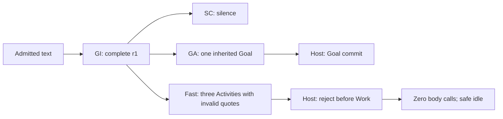

# Development Checkpoint

## UserTurnEnvelope argument-span provenance — Phase 1D — 2026-09-16 (current)

The owner approved removing model transcription work without weakening the original anti-message-loss
contract. Fast `argument_sources` therefore no longer contain model-authored quote strings. Each
intent-derived argument now cites a closed `{source_start_token_ref, source_end_token_ref}` span in
the same immutable normalized `UserTurnEnvelope` coordinate system already used by GI source
evidence. The Planner prompt receives the source token table; it chooses the semantic argument value
and its source span, never a rewritten quote.

Trusted validation resolves the span against the authoritative turn, requires it to remain inside at
least one cited Responsibility's GI-owned source span, and rejects unknown/reversed/foreign refs.
Host canonical Plan materialization dereferences the accepted span to `PlanParameterResolution.source_quote`
and binds source Goal IDs mechanically from GA's exact Responsibility mapping. Retained Goal snapshot
identity remains fail-closed. No model sees artifact hashes and no source text is removed.

The shared source tokenizer/span resolver moved to `shared/chromie_contracts/user_turn.py`; GI reuses
that same transport tokenization instead of owning a private copy. Production Fast constrained-decoder
schemas close token-ref values over the current source token set. This is a wire change for Fast model
output, not a compatibility dual-path: old string-valued `argument_sources` are invalid.

Focused proof on the supplied archive plus owner-applied prior phases: selected
Gateway/GI/GA/Fast/Runtime suites **443 passed + 232 subtests**, with **16** delayed-workflow
cases deselected only because this archive omits their benchmark scenario files; full
`test_fast_planner_pr3.py` contributes **128 passed + 68 subtests**. The supplied archive still lacks `benchmarks/`, so delayed-workflow tests
that read those files remain unavailable here. Next: SC model-facing context diet, then semantic
Capability facade work.

## Semantic artifact live-ref transport — Phase 1C — 2026-09-16 (current)

The owner approved continuing the anti-message-loss design from Phase 1A/1B into live owner
transport. This slice makes the already-defined content-bound semantic artifact refs travel with
the existing cognitive context instead of existing only when evidence is archived. It adds no
semantic owner and does not ask any model to author or copy hashes, IDs, envelopes or lineage.

Trusted Host code now builds the initial lineage immediately after an admitted
`UserTurnEnvelope` and accepted GI result: exact refs for the UserTurn, GI result and each
Responsibility. The same existing `CognitiveWorkRequest.context` carries that lineage to
concurrent GA and Fast Planner. `CognitiveWorkRequest` exposes a typed lineage accessor and,
when lineage is present, recomputes the available canonical payload digests and fails closed if
the transported UserTurn/GI/Responsibility identity no longer matches. No new frozen top-level
Work-request field is introduced.

After GA resolves, Host appends exact GA/new-Goal refs before any Goal-state-driven Planner call.
After a Canonical Plan is accepted, Host appends its content-bound Plan ref before SC or
Capability Runtime materialization. SC receives the same lineage in trusted context, validates
Responsibility identity and the presence of its canonical Plan ref when applicable, then Host
appends the accepted SC result and every Communicative Activity. Interaction and Capability
requests retain the resulting lineage so execution/outcome code can preserve the same ancestry.
`CognitiveEvidenceRecorder` cross-checks any transported final lineage against the exact packets
it archives rather than silently reconstructing a contradictory history.

The lineage is transport/integrity metadata, not cognition. SC prompt construction explicitly
removes it before inference; Planner/GA prompts already consume selected semantic projections
rather than this context key. Synthetic/unit requests that do not carry lineage remain valid, but
once a live lineage is present, same artifact identity with different content is rejected.
`argument_sources` still use model-retyped exact strings in this revision; Phase 1D remains the
planned migration to immutable `UserTurnEnvelope` token/span refs plus trusted quote
materialization.

Focused proof on the supplied archive plus Phases 0/1A/1B: semantic-envelope tests **9/9**;
`test_cognitive_runtime_pr7.py` **77 tests + 17 subtests**; the selected Gateway/GI/GA/Planner/SC
suite passes **248 tests + 147 subtests** after excluding one previously documented baseline SC
assertion whose primary/deep prompts already differ because the archive contains the later
required-output-schema decoder contract. No model/profile/provider change.


## Semantic Artifact Envelope substrate — 2026-09-16 (current)

The owner generalized the anti-message-loss requirement beyond original user input: accepted GI,
GA, Goal, Planner and Social Cognition/talk artifacts also need immutable transport identity and
lineage, and completed work should land in retained history rather than disappear with active
state. The implementation reuses existing truth owners and observability instead of adding an
Artifact Manager or second Mind store.

`shared/chromie_contracts/semantic_artifact.py` now defines a model-neutral artifact ref,
envelope and exact packet. The envelope contains only existing artifact identity, canonical payload
SHA-256, existing authority/session/turn/conversation correlation and immutable parent refs. The
packet contains the exact canonical typed payload. Trusted code constructs it after owner output;
payload mutation fails validation. `UserTurnEnvelope` is the lineage root.

`CognitiveEvidenceRecorder` now archives immutable envelopes in the existing cognitive-runtime
JSONL for the UserTurn, accepted GI result and each Responsibility, GA resolution/new Goals,
canonical Fast/terminal Plans, SC resolution/each Communicative Activity when present, and
terminal execution outcomes. Exact packets are retained only when configured text-retention policy
permits. Goal/Work/Interaction active truth remains in existing stores. Completion/failure/
cancellation/delivery is appended separately as outcome/Evidence/Interaction events; the original
semantic artifact is never rewritten. Execution outcomes are already enveloped, while exact
Plan/Goal parent refs remain part of the next live-ref transport slice. Privacy/retention remains
the existing evidence policy.
No model prompt, decoder Schema, provider contract, frozen Work-request field or semantic owner is
changed in this slice. Live cross-service artifact-ref enforcement and then Envelope-span
`argument_sources` migration remain next.

## UserTurnEnvelope semantic-source transport slice — 2026-09-16 (current)

The owner clarified the purpose of Planner argument provenance: the exact user input must
survive transport without message loss. `UserTurnEnvelope` is therefore the single immutable
source record referenced by GI, GA and Planner; downstream owners must not depend on one
another retyping the user's words. This source slice implements that transport identity before
changing `argument_sources`.

Current-turn GI now receives the admitted typed `UserTurnEnvelope` directly in its internal
request and validates normalized text, session and language against it. `CognitiveWorkRequest`
does **not** add a new wire field: it resolves the already-transported full envelope from the
existing context through one typed accessor, validates the same correlation, and uses that
envelope as the primary source for GA/Planner provenance, admitted clock and Gateway speech-act
evidence. Trusted Work provenance carries the same turn ID, exact original text and SHA-256
digest, while model-facing source projections derive from that envelope without requiring GA
to consume correlation bookkeeping. Re-entry remains distinct: it may carry a previously
validated source-turn projection without fabricating a new user turn or widening Goal scope.

This deliberately does not yet change Fast `argument_sources`. The next source slice should
move that model burden from retyping exact quotes to selecting immutable Envelope token/span
references, with trusted code materializing the exact quote/digest. Planner must still own the
semantic mapping/conversion; Host must still reject an unowned, ambiguous or mismatched span.
After that, continue the SC projection audit and semantic Capability facade work.

Focused proof on the supplied archive after the design patch: **135 tests + 147 subtests pass**
across Gateway envelope, GI prompt, GA and Planner re-entry suites. A wider selected run also
passed 133 tests before one pre-existing SC assertion about primary/deep required-output-schema
prompt identity; the current archive's SC decoder change already makes those prompts differ.
Tests that import `benchmarks/` cannot collect/run because the supplied archive omits that tree;
this remains the previously recorded archive limitation. No model/profile/provider change.

## Semantic transaction simplification design amendment — 2026-09-16 (current)

The project owner supplied `chromie_20260916_archive.zip` as the new development
baseline and explicitly authorized the next architecture line: first simplify Planner/SC
model-facing contracts, then raise provider-shaped Capability arguments to semantic
arguments, then add generalization and long-running human-like episode qualification. The
archive contains no `.git` metadata, so this checkpoint does not invent a baseline commit
SHA. Exact supplied archive SHA-256: `885226c691dcd89aa83f9c71a1981bf2b4993113e5b0832ea73f985a45dad4ad`. The extracted source includes the
latest native-decoder repairs for Planner argument-source ordering and Social Cognition
structured output.

This delivery is **design-only**. It changes no executable runtime source, prompt, model
profile, provider contract or scenario expectation. Existing authority remains GI=WHAT,
GA=Goal continuity, Planner=Work HOW, SC=communication, Runtime/Host=trusted effects and
Evidence. The design adds four explicit invariants: models author semantic decisions rather
than mechanically recoverable protocol fields; the Core plans against semantic Capability
facades rather than provider coordinate/actuator conventions; SC receives established
social/task facts rather than raw execution plumbing; and generalization claims require
metamorphic relations plus bounded stateful episodes, not only exact-case replay.

Ordered implementation after this documentation patch:

1. audit the exact native Planner and SC model-visible/model-writable field sets and label
   each field `semantic_decision`, `deterministic_projection`, `provider_realization`, or
   `duplicate_or_compat`; reproduce the retained Fast provenance and SC relevance failures
   without changing prompts/models;
2. implement the smallest Planner/SC contract diet, beginning with model-retyped source
   text/strategy and irrelevant SC task plumbing while retaining semantic source refs,
   Capability choice, arguments, timing/dependencies, wording, and all trusted validators;
3. migrate provider-shaped Capability details behind semantic facades, starting with
   left/right turn semantics versus provider yaw-sign/frame realization;
4. extend existing general-ability/scenario tooling with declared metamorphic relations and
   durable multi-turn/event episodes; and
5. requalify the current model/profile on the reduced transactions before model replacement,
   SGLang scheduling/preemption qualification, or latency optimization.

Do not combine these phases into one rewrite. The next source patch should be Phase 1
**audit plus red tests**, not a prompt tweak and not a model change. Current native/release
blockers and all historical evidence below remain valid until superseded by new exact-source
evidence.

## Project audit and mixed readiness repair — 2026-09-16 (current)

The owner authorized a full project audit, design/Charter reconciliation, repairs,
up to 18 test loops and normal commit/push. Pre-delivery base:
`f90dff450357cd49358bb49f03a4930a4d33a8d4`; resume on `main` at the newest commit
containing this checkpoint and HANDOFF.md. Upstream was fetched before development
and again before delivery; both checks found 0/0 divergence.
No new service, runtime flag, current document or semantic owner was added.

### Implemented scope and actual workflow

The [current audit](ARCHITECTURE_AUDIT.md) owns the cross-component findings,
concurrent native module I/O and failed experiments. GI intent-only, GA continuity,
Planner Work and SC communication remain the accepted authority split. This audit
repairs a narrower contract failure inside Planner; it does not restore GI fields.

| Owner / boundary | Reproduced input → failure | Implemented contract and evidence |
| --- | --- | --- |
| GI → GA | Two complete intents: nod twice at a future timestamp; blink three times now. Correct inherited Goals contain no GI-authored timer. | Existing ownership preserved in controlled accepted-GI/real-GA test path. |
| Fast decoder Schema | One ready step plus one future condition is rejected because old alternatives require either all ordinary Work or all waiting Goals. | Per-Goal waiting permits independent ready Work, preserves compiled Capability/argument/confirmation restrictions, forbids early Work and fabricated future fulfillment. |
| Deep Host adequacy | The same valid primary reply is rejected for the future Goal's honest zero satisfaction. | Only already validated source-bound future conditions receive the nonfulfilling reporting exemption. No score inflation or semantic repair call. |
| SC → adapter → Runtime | Required acknowledgement must not close the scheduled effect or block unrelated ready Work. | Controlled SC fixture, real adapter/Runtime: exactly the ready blink dispatches; completed speech leaves the future Goal open. This is controlled evidence, not native SC success. |
| Durable Goal store / wake | Scheduled effect must survive restart without early or repeated dispatch. | Restored state yields no opportunity before due time, one for the future Goal at due time, none on the next drain. |

Ten new Fast/Deep regression cases cover positive execution/restart and early Work,
false fulfillment, foreign time quotation and duplicate timer rejection. The initial
red proof had two positive failures and eight passing negative controls. Related
green proof passed 99 tests; extended Runtime proof passed all ten cases. Earlier
Runtime fixture failures were harness adapter/mock-schema defects and are retained.
This does not qualify timing of multiple Activities inside one compound Goal.

Removed a dead shared constant assigning ordinary wording to Planner and a duplicate
SC method declaration in the client Protocol. Reconciled existing Charter,
interaction, API, architecture and component documentation with implemented GI/GA
and SC ownership. Retained typed resource examples are explicitly historical.

### Rejected semantic candidate and open failures

Original compound baseline: correct GI and GA, concurrent SC silence, Fast invalid
parameter provenance and negative yaw for left. Host rejects before body execution;
safe idle is observed. Full catalog contained the correct turn-sign contract.

Frozen 12-case bilingual Fast comparison: baseline 12 Schema / 1 Host / 1 semantic;
prompt candidate 10 Schema / 2 Host / 2 semantic, with two new output truncations;
installed 9B comparison 12 Schema / 3 Host / 2 semantic. A Host-accepted 9B right turn
uses left yaw. The prompt candidate is rejected and reverted; the default model is
unchanged. Original mixed wire/cardinality instructions remain an open finding.
All raw replies, including accepted ones, were reviewed by this same task, not an
independent reviewer. No extra online critic, Host direction rule or model promotion.

### Validation and active delivery line

Evidence root **A**: `.chromie/acceptance/full-audit-20260916-f90dff450/`.
Loop 1: canonical 3,461 tests / 1,017 subtests, 145 benchmarks, 20 legacy;
strict replay 6,000/6,000; Level A 45/45. Live selected all 74 discovered cases,
stopped at the first contract failure: 0/1, 73 unrun, SID `c0c5a0b6`.
Loop 2: canonical 3,467 pass / 4 frozen-request failures; replay 5,600 pass / 400
request mismatches; Level A 45/45. Live again stopped at first case, SID `84b2e74d`.
The four affected families were explicitly refrozen after proving all scenario
inputs, reference replies, faults and behavior oracles unchanged. Strict replay
matching is unchanged. Final Git comparison proves exactly 400 changed workflow
cases and no changed prototype case; every change is request-only.

**Final loop 3:** canonical **3,471 tests / 1,017 subtests, 145 benchmarks,
20 legacy tests** pass, including policy, test ownership, Ruff, mypy, configuration
and documentation gates (two existing FastAPI deprecation warnings). Strict replay
**6,000/6,000** declared outcomes, source unchanged; Level A **45/45**. Final frozen
manifest: `6c7454a8c50ec440f2079afdd7d29ebd100bb8e6bd65372818671fdb2097ecd0`.

Rebuilt/source-verified live aggregate selected all **74** cases and stopped at
the first hard failure: **0/1, 73 unrun**, SID `9a5a54b0`. GI and GA are correct;
Fast decorates duration/count quotes, omits speed/yaw provenance and selects negative
yaw for left. Concurrent SC returns silence after misreading high-level actions as
prohibited low-level controls and inventing a capability/safety limitation. These
are separate primary semantic failures. Host rejects before body dispatch; safe
idle true. The sole speech item is an acceptance-harness error diagnostic, not SC.
All three attempted live cases and all twelve primary packets were reviewed.

Three full candidate loops were used out of the maximum eighteen. Native prompt
comparisons are separate, rejected experiments. Later edits finalize documentation
and restore unchanged prototype freeze metadata only; executable source is unchanged.
Release remains blocked by native semantics/SC relevance and
latency, incomplete current-revision live coverage, #24/#32 and remote target
qualification. Existing 200 old typed GA update references are expected rejections,
not qualified continuity. Physical microphone/speaker/robot evidence is unchanged.

Next work starts from the final retained cohort and primary packets, with the frozen
qualification method. Resolve Fast provenance/direction and SC relevance in their
own primary authorities; reject semantic/non-regression failures before promotion.
Then rerun the complete discovered live cohort on one verified revision. Do not use
the 18-loop ceiling as a reason for unsupported prompt changes or repeated identical
tests. Handoff owns current deployed identity, bundle locations and exact commands.

## Intent ownership and Fast capability library — 2026-09-16 (historical)

The owner authorized this implementation and commit/push after discussing the
GI/GA/Planner/SC boundaries. Resume on `main` at the latest commit containing this
checkpoint and HANDOFF.md; pre-delivery base is
`6fca5be2b590a4b1ca83d49fb197cdd74b50b2d0`. Upstream was fetched before source work
and again during validation, with 0/0 divergence. The preceding source-unchanged
baseline and rejected experiments below are historical, not the current contract.

### Implemented authority and contract

- GI emits complete natural-language intent, existing provider-neutral `output_mode`,
  source-token evidence, confidence and genuine unresolved meaning. It cannot author
  capability fields, typed parameters, unit conversions, execution readiness, steps
  or canonical Goal relationships. One complete compound Responsibility can own
  several Planner Activities. Preserving `output_mode` prevents a body request being
  mechanically accepted as a zero-Work answer; it is not a capability contract.
- The same GI result enters concurrent SC, GA and Fast paths. SC owns words and
  optional Social Attention, communicates each module's actual facts, and retains
  the existing highest foreground request priority. Other owners may supply SC
  communication needs. The local Ollama profile does not prove priority preemption
  or the desired response deadline; independent dispatch is not a latency guarantee.
- GA authors canonical Goal identity/continuity. New Goal results contain source,
  related and superseded refs only; Host inherits the full GI intent and result type.
  Planner owns Activities, capabilities, arguments, conversions and readiness.
- Fast receives all capability index entries plus full common contracts. It may
  request one batch of up to eight missing full contracts before its one complete
  Plan, with the original context retained. No candidate Plan is executed or
  semantically reviewed during lookup. Unknown/repeated/mixed requests and locked
  or unavailable execution fail closed. Rare capability use alone does not require Deep.
- Planner quotes exact owning intent for realized parameters/readiness. Host checks
  ownership, values against retained typed constraints, capability schemas, clock
  evidence, confirmation and execution safety. A matching quote is provenance,
  not proof that a conversion or interpretation is semantically correct. Fast's
  decoder exposes a closed source map for optional as well as required numeric
  inputs; Host still rejects missing nondefault-value provenance. Defaults remain
  provider-owned. Runtime binds quotes to exact new or retained Goal descriptions.
- Source-based future waiting keeps Goals unmet and persists exact wake times;
  current new waiting DTO covers all selected Goals. Mixed newly waiting/ready
  Goals need separate qualification. Information acquisition alone cannot declare
  the complete user outcome satisfied. Existing physical Work remains sequential.

### Reference and evidence migration

Inputs, contrast families, splits and provider/safety outcomes were retained while
GI/GA wire references were deliberately migrated to the owner-approved authority.
The 1,496 GI and 1,500 GA cases remain reference candidates, not native-model passes.
Two hundred GA cases involving old typed Goals now explicitly expect Host rejection:
an intent-only update cannot silently keep stale typed constraints. An explicitly
sourced replacement Goal is required. Do not report these as successful updates.
Five prototype episodes and 6,000 workflow packets were recaptured through the real
role/Host path, then strictly replayed with unchanged request matching. Four readiness
fault families (400 cases) now fail at Planner rather than requiring GI time fields.
Retired tests that required GI/GA parameter authorship were replaced by current
ownership/provenance regressions; retained typed conservation and execution guards
remain covered. No native observed output was promoted into the reference answers.

Native GI R5: 24/24 mechanical acceptance, 19/24 semantic acceptance; failures include
missing referent uncertainty and mixed/physical result misclassification. R6 regressed
to 14/24 and was rejected; the R5 prompt is retained. Controlled correct GI inputs
through native GA pass 24/24 new-Goal transactions; this does not qualify continuity,
old typed updates or the full 1,500-case native GA corpus. All reviews are same-task,
non-independent. No training or model-profile promotion.

### Final validation and actual deployed workflow

Evidence root **N**: `.chromie/acceptance/intent-authority-20260916/` (local, ignored).
`canonical-r19.log`: **3,461 tests / 1,017 subtests, 145 benchmark tests and
20 legacy tests pass**, including policy, ownership, Ruff, mypy (34 files),
configuration and docs; two existing FastAPI deprecation warnings.
`workflow-strict-r19/summary.json`: **6,000/6,000 declared outcomes**, aggregate
source unchanged: 1,400 pass, 1,800 observed states, 2,500 expected rejections,
300 expected nonexecuting rejections. Manifest SHA256
`9ebcef14e70dfab229441fc6a38ed7b3a793fcbe8c96efd09c581befccff6449`.
`level-a-r19/`: **45/45**, 15 ability classes. `focused-r19.log`: 246 tests and
68 subtests. Later edits only finalize documentation; docs/policy checks are rerun.

Three immutable changed-source 51-case live-text/MuJoCo aggregate invocations
(`live`, `live-r16`, `live-r19`) each stop on the first hard contract failure:
**0/1 passed, 50 unrun**. Each has exactly one retained debug bundle, listed in
HANDOFF.md. Current SID `888a52e9` uses verified Agent source
`1a59ecdb05fe8bbc9decac004e168f7f9e8f657c76b770942fb3eb910fc54894`.
All completed raw model responses and attempted cases were reviewed, including
mechanical GI/GA passes. The final run is not a successful live execution proof.

| Owner / actual boundary | Authoritative input → actual output / expected result | Verdict and next handoff |
| --- | --- | --- |
| Gateway | Exact text: walk ahead at 0.2 speed for 10 seconds, nod twice, then turn left; empty prior Goals → admitted unchanged. | Correct text ingress; microphone/ASR not invoked. |
| GI primary | Source tokens t0..t19 → one complete body_action Responsibility r1, confidence 0.98, unresolved empty; no capability fields. | Correct for this episode; primary model 4.87s. Same accepted result dispatches to SC/GA/Fast. |
| GA primary / Host Goal commit | r1 and no existing Goals → one source-only new Goal, related/supersedes empty; Host inherits full text/type. | Correct; primary 5.91s. Canonical Goal commit precedes the later Fast rejection. |
| Concurrent SC primary | GI understood; no established Work/communication needs → silence. Rationale wrongly calls Work scheduled and treats low-level-control prohibition as inability to perform high-level Work. | Desired acknowledgement not delivered; primary 12.23s. Rationale is not spoken output. No social expression. |
| Concurrent Fast primary | Complete r1, full common contracts and all-capability index → three sequential Activities, walk duration 10/speed 0.2, nod count 2, but negative yaw for left. Source values are decorated strings such as `source_quote: ... strategy=semantic_realization`, not exact excerpts; speed/yaw sources are absent. | First wrong task boundary; primary 21.95s, normal stop. The provider contract states positive yaw is left. No detail lookup was needed. |
| Host validation / Runtime | Fast's first decorated duration quote → exact-owned-intent rejection before any Activity commit. | Correct containment, Runtime error; no canonical Deep planning or body provider invocation. No automatic stripping or semantic repair. |
| Harness / Soridormi | Runtime failure → harness warning with discarded audio, zero body executions; safe idle true, empty lanes, no active task/fall/emergency. | Failure warning is not SC acknowledgement. Physical speaker/robot behavior remains unproven. |



The originating source-unchanged SID `af612ec5` is retained in the historical
baseline. Its earlier claim that merely grouping three actions was wrong is
superseded: one complete compound is now explicitly allowed. False actor ambiguity,
misplaced parameter authorship and downstream failures remain actual defects.
The first changed-source attempt `cd5ab66a` omitted all argument sources. The
required-only Schema correction still missed optional numeric inputs (`f587b6ba`).
The final closed-map correction makes the field explicit and keeps default use
valid; native output now includes the map, but its contents remain invalid.
Shared Fast/canonical provenance prose is a possible contributor to notation
confusion, not a proven sole cause. No prompt workaround was promoted from this
one episode, no Host guard was relaxed, and wrong yaw/SC remain open.

### Current claim boundary and next work

This is an implementation/development delivery. Native semantic qualification,
SC's first meaningful response, narrow supervised voice and #24/#32 target closure
remain open. The remote Gemma evidence is not present on this laptop. Existing
owner microphone/ASR acceptance is unchanged; automated text/MuJoCo and discarded
TTS do not prove physical microphone, speaker or robot behavior.

Continue from the latest retained aggregate diagnosis, keeping each owner's facts
separate. Qualify optional-argument provenance, direction/unit realization and SC
communication on frozen contrasts and one immutable complete live cohort. Do not
repair upstream meaning in GA/Planner, add a second semantic reviewer, infer
capabilities from hardcoded phrases, or call existing reference passes native proof.
No new current document or runtime variable was added: 102 Markdown files,
15 core reading-path documents and 381 configuration keys remain unchanged.


## Cross-machine resume and current-source baseline — 2026-09-15 (historical)

The owner requested an upstream update and continued development. Fetch verified
clean Chromie `main` already at `6fca5be2b590a4b1ca83d49fb197cdd74b50b2d0` and
paired Soridormi `codex/turn-count` at `fa6331f1344ce26154b197ca7d7c49badea292ad`,
both equal to upstream. Preserve local playground-submodule content. This session
changes operational/evidence state only; no executable source, prompt, Schema,
model selection, reference output, commit or push changed.

The stale local Agent was rebuilt and recreated through the maintained startup
flow. Packaged and checkout Agent source now match. This machine uses the existing
RTX 4090 Laptop / Ollama Qwen3.5 4B profile, not the other machine's Gemma cohort.
The latest private remote evidence directories are absent here; their recorded
results remain historical, not locally reproduced native evidence.

Fresh canonical gate passes **3,510 tests / 1,164 subtests, 145 benchmarks and
20 legacy tests** (two existing FastAPI warnings). Level A passes **45/45**.
All **6,000** frozen replay outcomes pass with source unchanged: 1,400 workflows,
1,800 state outcomes, 2,580 rejections and 220 nonexecuting rejections.

The complete discovered 51-case must-pass text/MuJoCo cohort stopped on its first
case, SID `af612ec5`: **0/1 passed, 50 unrun**. The source stayed fixed throughout.
Input requested walking ahead at 0.2 speed for 10 seconds, nodding twice, then
turning left. Evidence root: `.chromie/acceptance/resume-20260915-6fca5be2/`.

| Actual boundary / owner | Input → actual output / expected result | Verdict |
| --- | --- | --- |
| Gateway | Exact explicit text, empty prior Goal state → admitted unchanged | Correct transport; no microphone/ASR invocation. |
| Primary GI | Three independent effects plus explicit atomicity/uncertainty rules → one Responsibility and actor uncertainty | First wrong semantic boundary; raw Schema passes, normal stop at 217 output tokens. |
| Source-based Deep GI | Original source, no prior candidate DTO → same merged outcome, nod/turn hidden in subtype, unit/sequencing uncertainty | Semantic failure persists; normal stop at 318 tokens. No truncation explanation. |
| Concurrent GA | Accepted r1 → physical-object handover of Chromie, quantity `{"count":1}` encoded as a string | Wrong resource meaning; raw Schema accepts, existing numeric-string DTO rejects. No semantic repair call. |
| Concurrent Fast / SC | Same admitted turn → Fast stream cancelled; SC silence completes after Host cancellation | No applied Plan or delivered SC communication established. Harness warning text is not SC speech. |
| Host / provider | GA failure → Runtime error, zero body capabilities | Contained; post-case simulator safe idle, no active task/lanes, no fall/emergency. |

`native-calls.json` retains four completed packets; `adjudication.json` reviews
all four and the attempted case, including the cancelled Fast branch. Exact GI
prompts already demand independent effects and exclude execution-input uncertainty;
model-inference fault is supported for this observed GI failure, not as a blanket
explanation of all failures. GA also exposes a separate Schema/DTO quantity gap.
No prompt change or model promotion is supported by this one failed baseline.

Next: preserve these failures and begin any further semantic work at primary GI
decomposition/uncertainty under the frozen-cohort method. Keep the GA quantity
Schema/DTO discrepancy separate; fixing it cannot qualify GI or resource meaning.
Do not substitute this laptop baseline for remote Gemma nonregression. Supervised
physical evidence is unchanged; microphone/ASR remain owner-accepted. #24/#32 and
native semantic qualification remain open. See HANDOFF.md for runtime identity,
the one aggregate bundle, shutdown state and resume commands.

## Source-backed lightweight GI handoff — 2026-09-15 (historical)

**Interface support is implemented; default GI prompt simplification is not.**
The owner authorized implementation, commit and push, then requested immediate
handoff for leaving work. Stop further optimization after this delivery. Resume
from the newest commit containing this checkpoint and HANDOFF.md, on `main`;
pre-delivery base is `a1ed4b4b22ee82ee846321b67df2d088d5226599`.

Implemented: Host-projected complete original input remains alongside GI meaning;
Planner prompts retain source turn ID/digest and identify pre-GA GI authority
correctly. GA accepts empty duplicate query classifications while inheriting the
complete GI outcome. Fast required string inputs and canonical `user_supplied`
provenance can use exact non-numeric values in both the owning intent and source.
Existing bindings, numeric/measurement conservation, activation, trusted target,
Goal ownership, confirmation and execution guards remain. No semantic phrase
rules, model weights, runtime flags, new current documents or extra model calls.

| Owner / actual boundary | Observed before → delivered behavior | Evidence / limit |
| --- | --- | --- |
| Host handoff | Complete original text was already available; pre-GA Fast incorrectly labelled final Goals as WHAT authority. | Full EN/ZH/Unicode/whitespace text survives DTO serialization into Fast/Deep prompts with matching source digest; label fixed. |
| GI | Native baseline has known semantic failures. Controlled complete-query references with empty bindings pass actual GI Schema/Host. | Production GI prompt and interpreter restored byte-identically after rejecting two candidates; no default-generation or speedup claim. |
| Fast before GA | Correct literal Chongqing/重庆 inputs were rejected solely for absent duplicate location binding. | Preserved old validator reproduces both failures; new validator accepts source-and-outcome literals and rejects invented, sibling-only or contradictory values. |
| GA | Model DTO required nonempty query_scope even when the exact inherited outcome contained the query. | Empty duplicate scope accepted; dynamic declared-binding conservation remains exact. Four native queries conserve the complete query. |
| Canonical Planner | Non-numeric user_supplied provenance previously required a duplicate typed binding. | Owned literal source proof is accepted; counts and same-name contradictions retain existing checks. Controlled full path passes. |
| Native Planner / SC / Runtime | Four pre-GA Fast probes generate correct location/date/period. All eight canonical Fast/Deep probes fail semantic acceptance or contract checks. | Controlled GI and production weather-only catalog; SC, providers, audio and robot execution not invoked. Full Qualification remains open. |

Evidence root **J**: `.chromie/acceptance/gi-source-handoff-20260915/`.
Canonical validation: **3,510 tests / 1,164 subtests**, **145 benchmark tests**;
existing two FastAPI warnings. The canonical log also records legacy tests.
Full frozen workflow replay: **6,000/6,000 expected outcomes**, source unchanged;
archive read-verified (16,602 members). Level A: **45/45**, 15 ability classes.
Focused pre-final additions: 900 tests / 712 subtests; canonical covers the five
subsequent ownership/provenance negatives. Request-only refreeze: 5,205 scenarios,
10,513 requests, zero new artifact parts; reference outputs, faults, expectations
and splits unchanged. Earlier SC completion, Fast delegation/vocal safeguards,
required-context preservation and GI Schema deduplication are included in this
same delivery with their retained historical evidence below.

Two GI candidate cohorts each ran 23 transactions (21 mechanical acceptances).
They were rejected for new measurement/count/activation or atomicity failures;
`semantic-review.json` reviews all 46 responses. Neither is a resume target.
`native-downstream-review.json` records GA 4/4 and pre-GA Fast 4/4, canonical
Fast/Deep 0/8 semantic acceptance. An earlier downstream harness URL preflight
returned HTTP 404 before inference; corrected `/v1` transport was rerun separately.
No failed native inference was converted into a pass or repaired downstream.

**Deployment remains older than checkout:** host Agent digest
`eb3839ab3ac4c6b283b6c569ff691d5be3a8867724d325324ba4a99a61ca3a7a`,
running container `3e17a056a40e81dc199a5df3490ec102e47ba36e2917ce17577eed132699dd06`.
No rebuild/deployment in this delivery. Before the owner's next personal test run
`./scripts/start_voice_mujoco.sh --build`. Microphone/ASR remain closed on the
owner's prior manual acceptance. Full Qualification remains open for the retained
GI/Planner/SC semantic failures and incomplete live cohort; no new engineering or
training pass until the owner chooses next work after checking Chromie.

## GI intent handoff simplification — 2026-09-15 (previous experiment)

The owner authorized a lighter GI that preserves complete intent and hands off
quickly. **No safe production simplification was established in this iteration.**
All experimental prompt/Schema/DTO changes were rejected and restored; do not
report the requested runtime simplification as implemented. Stop unsupported prompt
optimization and let the owner inspect current Chromie before choosing further
architecture, data or training work. No model weights, extra semantic calls,
semantic phrase rules, runtime flags, deployment, commit or push were introduced.
Microphone/ASR remain closed on the owner's prior manual acceptance.

Base `a1ed4b4b22ee82ee846321b67df2d088d5226599`, dirty `main`; upstream fetched,
divergence 0/0 before work. Earlier dirty work is preserved. Evidence root:
`.chromie/acceptance/gi-intent-handoff-20260915/` (I below).

### What is retained

- Two GI contract regressions prove that a complete English/Chinese query can pass
  the current Schema/Host with only a location binding, while dropping an explicit
  numeric constraint still fails. This proves representability, not native ability.
- Two additional downstream variants feed the accepted sparse GI result into GA,
  conserve the full query and verify Planner's `date=tomorrow, period=morning`.
  These use controlled model outputs; they do not prove deployed inference.
- Corrected one stale interaction-contract sentence: SC, not Planner, owns exact
  response wording. No new communication authority was added.
- Frozen 18-case / 23-transaction contrast cohort and 106 retained native responses,
  including incomplete/rejected candidates. All are `training_eligible=false`;
  review is same-task and non-independent. No training promotion.

### Actual workflow and diagnosis

| Boundary / owner | Input and observed output | Verdict / limit |
| --- | --- | --- |
| Gateway/context projection | Immutable query and bounded clock/context enter the production GI prompt builder. Mic/ASR are not invoked by this experiment. | Correct projection; no physical-input claim. |
| GI model, primary and source-based Deep | Baseline query outcome preserves weather/place/day, sometimes under the wrong temporal key. Delayed-query baseline duplicates one request into overlapping effects. | A temporal key deviation is not proof that intent was misunderstood. Duplicate effects are a real structural/semantic failure. |
| Candidate GI contract/prompt | Relaxing redundant field classification helped some query outputs but produced newly merged independent actions, wrong measurements, or invented counts; aggressive compression also truncated a simple count response. | Earliest wrong boundary is the candidate's raw GI result. No candidate met non-regression requirements. These experiments do not prove that weights alone are the cause or cure. |
| Parser / Schema / DTO / Host | Rejects overlaps, self-relations, dropped digits or malformed output where mechanically detectable. Some merged effects/invented values remain structurally valid. | Existing containment retained. No validator was weakened or promoted as a semantic oracle. |
| GA → Planner, controlled regression | Sparse accepted query retains tomorrow morning in outcome; GA inherits it and Planner emits tomorrow/morning provider arguments. | Contract path passes without forcing duplicate query fields. Native downstream inference remains unproven for these new cases. |
| SC / Runtime execution | Not invoked by the native GI cohort; candidate services were never deployed. | No speech, execution, robot or latency improvement claim. |

Baseline: 21/23 mechanical acceptances. Complete candidate batches 3/4/5 had
21/23, 21/23 and 20/23, respectively, but all had material regressions.
Candidate 1 stopped after a 2,048-token truncation; candidate 2 was interrupted
because preflight found a contradictory old Schema description; candidate 6 stopped
after focused proof found invented count=1. They are incomplete, not passing cohorts.
I/`semantic-review.json` judges every retained response and separates meaning,
binding-protocol and source-span defects. No aggregate semantic qualification pass.

### Restoration, validation and next step

GI prompt and model interpreter are byte-identical to I/`prompt.before.txt` and
I/`model_interpreter.before.py`. Host and deployed Agent source both match
`3e17a056a40e81dc199a5df3490ec102e47ba36e2917ce17577eed132699dd06`
(I/`runtime-final.json`). No service rebuild/restart and no fixture refreeze occurred.
Previous Schema deduplication remains implemented. All rejected proposals and raw
packets remain in I; do not copy a candidate prompt back into production without
new full-cohort evidence.

Focused final validation: **102 tests / 136 subtests pass**. Level A: **45/45**.
Canonical final gate: **3,481 tests / 1,164 subtests, 145 benchmark tests and
20 legacy tests pass**; two existing FastAPI deprecation warnings. Repository
policy, test ownership, static analysis and documentation checks pass. I/`canonical-final.log`
is the final run after test strengthening; the preceding run is retained separately.
Existing broader
Qualification blockers remain open; no microphone/ASR retest is required.

Resume with the owner's personal check using `./scripts/start_voice_mujoco.sh`.
Use the retained contract tests and cohort to evaluate the next proposed GI design;
do not turn these evaluated cases into training data or silently update references.
The simplification target remains accepted but unimplemented pending a candidate
that preserves independent intentions, constraints and downstream authority.

## GI Schema deduplication — 2026-09-15 (preceding)

Owner authorized the reviewed bounded experiment. **Schema deduplication is
implemented; model Qualification remains open.** Next work remains the owner's
personal Chromie check and decision. No prompt rewrite, candidate pruning, weights,
training promotion, commit or push. Microphone/ASR stay closed by owner-reported
acceptance. Earlier sections retain their evidence and are superseded here.

Base `a1ed4b4b22ee82ee846321b67df2d088d5226599`, uncommitted on `main`;
origin fetched and divergence 0/0 before editing. Previous dirty work is preserved.
Evidence root: `.chromie/acceptance/gi-schema-dedup-20260915/` (G below).

### Implemented boundary and measured result

GI primary and source-based Deep now reuse the existing
`SourceBackedBindingString` definition for location/duration/speed. Every original
character-slice value, applicability limit, context fallback, numeric alternative,
field description and semantic owner remains unchanged. No new semantic decision
or repair call is added. Tests preserve exact-source acceptance/rejection and
numeric alternatives, and assert one serialized enum in the native request.

| Boundary / evidence | Actual result and limit |
| --- | --- |
| Immutable example → GI Schema | The 39-character weather question previously copied one 748-value list three times. It now references one identical definition. Earliest redundant boundary repaired: request serialization, not human meaning. |
| Frozen 12-case / 16-variant comparison | All 16 expanded schemas match exactly; messages/model/options unchanged. Baseline and candidate each pass Schema/DTO/Host 16/16, with byte-identical paired raw outputs. Four independent source-based Deep variant screens are not automatic repair calls. |
| All 40 native calls | 32 full-cohort calls plus 8 interleaved warm calls pass mechanical checks. Model semantic failures remain identical. Partial rubric 8/16 is not complete acceptance: full review passes 1/16 under source-span, sparse-binding and uncertainty requirements. Cross-clause `parcel` vs `A parcel` preserves the same exact referent and is accepted. |
| Actual weather request | 78,500 → 52,973 transmitted bytes (32.5% lower); compact Schema 58,409 → 32,882 bytes. Model input tokens remain 3,836. |
| Measured execution cost | Request JSON serialization median 0.490 → 0.323 ms across 20 alternating blocks per arm. Four warm calls per arm: 4.3256 → 4.3312 s median; no end-to-end speedup established. First-observed latency is not proven cold compilation; no shared cache flush or model restart. |
| Downstream scope | No GA/Planner/SC/Work/robot invocation in the role experiment. This is native GI evidence, not a whole-robot qualification or microphone proof. |

Retain this small equivalent reduction in transmitted data/serialization cost; do
not claim model-token, response-speed or accuracy gains, and stop before broader
optimization. Full per-case review: G/`semantic-review.json`; comparison and source
proof: `comparison.json`, `equivalence-proof.json`, `authority-audit.md`.
The frozen corpus and requests contain no target labels during inference and
remain training-ineligible. Review is not independent model qualification.

### Validation and retained snapshots

- Focused: **115 tests / 173 subtests** pass. Level A **45/45**.
- Complete final workflow replay: **6,000/6,000 expected outcomes**, unchanged source;
  `workflow-final-summary.json`. It does not measure model ability.
- Final canonical gate: **3,477 tests / 1,161 subtests**, **145 benchmarks**,
  **20 legacy tests** pass, including pinned static/policy/ownership/config checks;
  two existing FastAPI warnings. G/`canonical-final.log` retains the result.
  The earlier pre-refreeze gate was intentionally interrupted, not passed.
- Final replay archive read-verified: **16,602 members**; owned temporary directory
  removed. G/`workflow-archive-verification.json` retains this check.
- First replay produced 4,585 exact GI request-snapshot mismatches, retained in
  `workflow-before-refreeze-summary.json` and `workflow-before-refreeze.tar.gz`.
  Only request Schema snapshots were then refrozen in **4,587 cases / 4,802
  transactions**, with 505 artifact replacements. Expanded schemas match; all
  messages, model outputs, expected outcomes, splits and training eligibility are
  unchanged. `pre-schema-refreeze.tar.gz` retains originals;
  `schema-refreeze-review.json` records proof. This extends the prior retained
  request-only refreezes and never rewrites semantic answers to pass.

### Runtime and resume

Local Agent was rebuilt; host/container digest matches
`3e17a056a40e81dc199a5df3490ec102e47ba36e2917ce17577eed132699dd06`
in G/`agent-source-final.json`. Existing Agent/LLM/ASR/TTS remain healthy;
no microphone or simulator was started in this pass. Paired Soridormi remains
`fa6331f1344ce26154b197ca7d7c49badea292ad`. Native model stays
`chromie-gemma4-12b`; GI prompts/budgets unchanged. The old exported GI example is
an immutable pre-change snapshot; the new request is retained in
G/`candidate/weather_en_today-primary.json`.

For the owner's personal check, from the repository root:

```bash
./scripts/start_voice_mujoco.sh
```

Full Qualification is still blocked by the earlier native GI/Planner/SC failures
and incomplete 51-case live coverage. This pass additionally retains exact GI
source-span, time-field, capability-question-context and unresolved-referent
failures; no semantic repair is claimed. Further prompt/data/training direction
awaits the owner's decision. New current documents, environment variables and
runtime flags: zero; no authority or architecture amendment.

## Necessary engineering repair — 2026-09-15 (previous pass)

**Bounded engineering repair is complete; full Qualification remains open.**
The owner will personally check Chromie and decide subsequent work. Do not start
another broad engineering/prompt optimization or training pass without that next
instruction. Microphone/ASR remain **closed by owner-reported manual acceptance**.
Earlier sections retain history and are superseded by this resume point.

Uncommitted on `main`, base `a1ed4b4b22ee82ee846321b67df2d088d5226599`;
origin fetched and upstream divergence 0/0 before editing. Paired Soridormi remains
`fa6331f1344ce26154b197ca7d7c49badea292ad`. Prior dirty work, including the earlier
request-only fixture refreezes, is preserved. Evidence root:
`.chromie/acceptance/necessary-engineering-20260915/` (N below).

### Implemented scope and evidence

- Existing Fast native Schema now preserves GI-authored provider-required vocal
  mode: only the qualified vocal provider with that exact supported mode may bind
  that source. Missing/empty catalogs cannot substitute a body provider or invent
  one. Independent body sources and valid same-mode composition remain available.
- Existing Fast execution/delegation invariants are exposed as native state
  alternatives. This Fast result cannot both commit new Capability Work and request
  Deep for its unresolved decision. Complete execution and source-based delegation
  remain different results; full Schema/DTO/Host checks remain independent.
  This adds no semantic decision, retry, or authority. Already-committed other Work
  is unaffected. It does not make Deep an execution-failure-only path: consequential
  uncertainty may justify Deep before commitment; new execution Evidence can later
  reactivate Planner. Invalid Fast output is not automatically repaired by Deep.
- Seventeen mode/provider and nine execution/delegation regression cases were added.
  Final focused checks: **347 tests / 68 subtests**. Final canonical
  `canonical-decision.log`: **3,475 tests / 1,143 subtests**, **145 benchmarks**,
  **20 legacy tests**, including pinned static/policy/ownership/config gates; two
  existing FastAPI warnings. `workflow-decision-summary.json`: **6,000/6,000
  expected outcomes**, unchanged source; archive read-verified (16,602 members).
  `level-a-decision`: **45/45**. These do not establish model ability.
- Final frozen native five-packet screen: **3/5** contract and semantic passes.
  Reproduced provider substitution and execution/delegation contradictions disappear;
  two cases still fail on upstream decomposition/Planner grounding or invalid input
  questions. No prompts, model weights/profile/budget, corpus/oracles, current
  documents, environment variables or runtime flags were added/changed in this pass
  except the owned status documentation and Schema/tests described here.

### Final real workflow and known failures

Agent host/container source digest matches
`3bf6b5fe26ca3b3218fcceecf3dc76f7ba8bdaa30c17fef6226d440919fa8a73`;
`agent-source-decision.json` and `runtime-identity-decision.json` retain provenance.
One complete directory-discovered 51-case cohort was attempted on that fixed image:
**1/4 mechanical and 1/4 reviewed semantic passes; 47 unrun** after a contract failure.
`decision-live-review.json` reviews all four cases, including the mechanical pass.
All executed Work reached safe idle. All **10 SC calls** stopped normally (maximum
**678 tokens**), with no repeated-output truncation or changed-words identity collision.
This is injected-text/MuJoCo evidence with discarded playback, not physical proof.

| Actual module / handoff | Input → actual output; expected output and verdict |
| --- | --- |
| Compound GI → GA → Fast, `a235ce54` | GI correctly preserves three ordered outcomes and left direction; GA preserves three Goals. Fast selects negative yaw `-0.12` for left, despite the provider direction contract. First wrong boundary: Planner realization. Expected positive-left command. |
| Compound Runtime → Evidence → Planner/SC | Three selected commands complete, safe idle. Later cognition reports left complete; this is a downstream false outcome claim, not proof that the requested direction occurred. Ingress SC separately promised before planning. |
| Gaze/blink GI → GA → Fast → Runtime → SC, `5d426735` | Two independent parallel outcomes → gaze 3 seconds and blink count 2 with correct bindings → both complete → supported final Chinese completion. Reviewed pass. |
| Milk GI → GA → Fast, `2f4dc3ca` | Correct bring-milk outcome and available acquisition/delivery contract → Fast selects only walking at 0.15 m/s for 15 seconds as complete. Expected full resource outcome, or a grounded unresolved result. First wrong boundary: Fast selection/coverage. |
| Milk Runtime → Evidence → Fast re-entry → SC | Only walking completes; acquisition/delivery provider never runs. Fast explicitly equates that Evidence with bringing milk; SC says it has the milk. Wrong semantic satisfaction and downstream false completion, plus an independent premature ingress promise. |
| Singing GI → GA → Fast, `624a907a` | GI merges walking into one singing Responsibility; GA retains one Goal. Expected two independent outcomes. Fast invents a song-content gap tied to resource acquisition and omits required schema-inspection evidence. Full validation rejects before Work; no Deep call repairs it. |
| Concurrent singing SC → playback | Without an established Plan/input Need, SC promises both actions and asks which song. Separate semantic overreach. Harness `cognitive_text_check_failure` text is not actual speech. |

Exactly one final-aggregate debug bundle:
`/home/chromie/Downloads/chromie_debug_bundle_20260915_142752.tar.gz`.
N/`root-cause-review.md`, `decision-native-review.json`, `decision-live-review.json`
and `decision-native-llmcall_*.json` retain actual I/O and comparisons. The first
mode-only aggregate stopped at 0/2 with bundle `chromie_debug_bundle_20260915_141612.tar.gz`;
it diagnosed the native execution/delegation gap before the second repair.

The previous R aggregate was 3/4 mechanical and 2/4 semantic; this final aggregate
is worse. The frozen native milk control still passes, but stable aggregate semantic
benefit/non-regression is **not established**. These are bounded existing-contract
repairs, not evidence of general ability improvement or qualification closure.
GI decomposition, Planner direction/whole-outcome satisfaction, SC promises and
47 unrun cases remain open. Training/reference/hidden-family and #24/#32 closure
are not inferred. No examples were promoted to training, and no commit/push occurred.
Current-document/environment-variable/runtime-flag counts have no net growth.

### Exact resume point: owner checks Chromie

The owned headless simulator launcher was stopped only after retained safe-idle
observations and the final bundle. Preexisting Agent/LLM/ASR/TTS remain healthy;
Agent is rebuilt from the tested source. From the Chromie repository root, the
normal personal test entrypoint starts the viewer and voice workflow:

```bash
./scripts/start_voice_mujoco.sh
```

No further microphone qualification is requested. Wait for the owner's experience
and chosen next direction. Before any later source development, preserve this dirty
work and fetch/check upstream again. Read N's reviews before choosing a repair;
do not add phrase rules, automatic semantic repair calls or retry cases into a pass.
Documentation updates after the aggregate only record results; its earlier captured
source-tree hash does not represent those subsequent documentation edits.

## Qualification repair — 2026-09-15 (previous pass)

**Qualification remains open.** The general engineering changes pass the local
checks, but the fixed Gemma model still fails semantic requirements in the native
workflow. Microphone/ASR remain **closed by owner-reported manual acceptance**;
they are not a blocker for this work. No fine-tuning, training-data promotion,
commit or push occurred. Earlier sections are historical and superseded here.

Uncommitted on `main`, base `a1ed4b4b22ee82ee846321b67df2d088d5226599`;
upstream fetched/current before editing. Paired Soridormi remains
`fa6331f1344ce26154b197ca7d7c49badea292ad`. Existing dirty work was preserved.
Evidence root: `.chromie/acceptance/qualification-closure-20260915/` (R below).

### Implemented and verified

- SC generates reason and exact Need accounting before its Activity array, with
  compact native JSON. Required questions use native ask branches consistent with
  Host. The complete raw JSON Schema is validated before DTO/Host, including unions
  and references skipped by the former argument-only validator.
- The unchanged authoritative delivery ledger is presented before larger context.
  With prior acts present, the native Schema offers eight fresh request-scoped IDs
  and allows an old ID only with its original words. This preserves explicit
  multi-act repetition and existing playback reuse; it does not select meaning.
- Fast's aggregate disposition procedure uses distinct current per-Goal decisions.
  Native timing branches preserve GI relations and provider compatibility. Bounds
  common to every valid Work assignment are exposed before generation, preventing
  completed response-only re-entry from reissuing Work.
- Fast's selection procedure compares the whole requested terminal outcome with
  Capability scope/effects; a prerequisite alone is not complete fulfillment.
  Three stale GI/DTO descriptions now correctly name SC as the sole wording owner.
- No case/phrase rules, second semantic judge/repair call, weights, budget, new
  environment variable, runtime flag or current document were added. SC's semantic
  system prompt is unchanged. Previous context/budget/order repairs are retained.

### Current evidence and actual failure path

- `canonical-final.log`: **3,449 tests / 1,143 subtests**, **145 benchmarks** and
  **20 legacy tests** pass; pinned static, policy, ownership and config checks pass.
  Two existing FastAPI warnings remain. SC focused: 157 tests / 40 subtests.
- `workflow-final-summary.json`: **6,000/6,000 expected outcomes**, source unchanged.
  `workflow-final.tar.gz` read-verified (16,602 members); Level A **45/45**.
- SC native `sc-state-screen/identity-pool`: **10/10** structural and semantic passes;
  `sc-owner-screen/identity-pool`: **12/12**, including actual EN/ZH conversation,
  Work/Situation and direct-deep variants. These are bounded native screens.
- Rebuilt Agent source matches host digest
  `60a90b61f8067d39638f680f7e24acdcccdaf280bfd732422a5dd0299f86b935`.
  `final-runtime-identity.json` binds exact source/corpus/services. Final full
  51-case injected-text/MuJoCo aggregate: **3/4 mechanical passes**, **2/4 reviewed
  semantic passes**, **47 unrun** after a hard failure. All completed Work reached
  safe idle. No physical evidence is claimed; delivery uses a scripted provider mock.
- All **10 SC calls** in that final aggregate stop normally (maximum **654 tokens**);
  no repeated-output truncation or immutable-ID collision. Compound completion,
  parallel gaze/blink and delivery all reach their final speech. Milk's initial
  promise still exceeds its then-established planning facts.

| Actual module / handoff | Input → actual output; expected boundary and verdict |
| --- | --- |
| Original SC primary → transport | Completed Work/Evidence + fresh Needs → repeated act until 1,024-token truncation. First wrong generation; transport correctly rejects partial JSON. Native decision order/compact format repairs the reproduced mechanism. |
| Delivery SC → Host | Old acknowledgement in ledger + new terminal Evidence → reused old ID with new words, HTTP 422. Request-local ID/text branches repair this earliest mechanical gap; final delivery uses fresh ID and completes. |
| Final GI, case `580989ad` | Exact walking-plus-singing source → one singing Responsibility, walking hidden in `comparison`; expected two independent outcomes and coordination. First semantic divergence. |
| Final GA → Fast | One defective GI Responsibility → one Goal; GA preserves its authority and cannot invent the missing outcome. Fast selects walking for singing; existing typed-mode Host rejects before Work. |
| Concurrent SC ingress → playback | No established Plan or input Need → promises both actions and asks which song. Separate semantic overreach; no repair call or literal phrase guard added. |
| Final Runtime / Soridormi | Rejected Fast decision → no Work dispatch; aggregate stops incomplete. Retained source and failure evidence are not converted into a pass. |

`root-cause-review.md` and `final-live-semantic-review.json` retain the complete
module I/O review and prior iterations. Original/parallel/fetch final SIDs:
`3e520d36`, `b583d3e7`, `3a1c7129`. Exactly one final-aggregate debug bundle:
`/home/chromie/Downloads/chromie_debug_bundle_20260915_134723.tar.gz`.

### Review corrections and remaining blockers

The previous SC completion screen's **5/10** semantic score is corrected to **7/10**:
its two pending cases reused the exact existing identity/words; actual Host replay
produced zero new syntheses. The three fresh-Need failures remain historical failures.
The broad SC screen's initial **9/12** review is corrected to **12/12** because its
frozen oracle permits useful conversation/question with Need pending. Host has no
reverse covered-if-spoken invariant and pending metadata alone schedules no retry.
Neither correction changes output, corpus or runtime state. See `pending-playback-proof.json`,
`pending-review-correction.json` and `sc-owner-identity-review.json`.

Native model qualification is still blocked by combined-outcome decomposition,
exact modality/Capability preservation, premature promises/unestablished questions,
and retained directional variation in earlier full iterations. Explicit existing
contracts and complete source packets do not reliably produce the right semantics.
The last 47 cases are unqualified. Fine-tuning/reference/hidden-family and #24/#32
closure are not inferred from local passes. All retained cases remain training-ineligible.
Do not add phrase patches or weaken these gates to obtain closure.

Request-only fixture refreezes: aggregate prompt (4,605 cases), shared Work bounds
(2,805), retired wording-owner descriptions (6,005). Responses, expected outcomes,
scenario intent and training eligibility remain unchanged; originals are retained
in `pre-prompt-refreeze.tar.gz`, `pre-bounds-refreeze.tar.gz` and
`pre-owner-refreeze.tar.gz`, with per-change reviews. The large fixture diff is
intentional. Failed identity/Need prompt trials, regex constraints and expanded
Fast assignment schemas were not promoted.

### Exact resume point

Owned headless simulator launcher was stopped after retained safe-idle observations
and the final bundle; preexisting LLM/Agent/ASR/TTS services remain. Agent is rebuilt
from the tested source above. Documentation edits after the aggregate only record
its results; they are not represented as part of the earlier captured tree hash.

1. Read R/`root-cause-review.md`, `final-live-semantic-review.json` and the final
   native packets before selecting another repair. The first unresolved boundary
   is GI atomic decomposition; SC wording and Fast modality remain distinct owners.
2. Preserve dirty work and fetch/check upstream before further source development.
   Do not use a post-hoc model judge, literal utterance rules or automatic training
   promotion. Model comparison/fine-tuning is not represented as a completed repair.
3. For source changes, rerun the matching frozen native contrast cohort and the
   complete live cohort on one rebuilt identity; do not retry isolated cases into
   a revision pass. Retain one bundle at the aggregate stop and review every case.

```bash
python scripts/check_repository_policies.py
./scripts/run_tests.sh
python scripts/check_test_ownership.py
python scripts/check_docs.py
python scripts/run_workflow_replay.py --workers 8 --evidence-dir /dev/shm/chromie-workflow-next
python scripts/general_ability_acceptance.py --mode level-a --execute --evidence-dir .chromie/acceptance/level-a-next
```

Use new, unused evidence directories. To reproduce the broader native SC screen,
run `python .chromie/acceptance/qualification-closure-20260915/sc_owner_screen.py
next .chromie/acceptance/qualification-closure-20260915/sc-owner-screen/identity-pool/corpus`
from repository root, with Gemma/SGLang at loopback 30000. Its original rubrics stay
outside model packets. The ten-case script hardcodes its old output name; copy it
with a new output name before re-execution so retained evidence is not overwritten.

For full live evidence, start the paired Soridormi headless launcher from its repo,
verify/rebuild Agent using `.env.runtime`, `docker-compose.yml`,
`docker-compose.sglang.yml` and `.chromie/voice-runtime/compose.voice-mujoco.yaml`,
then capture a fresh runtime identity. Retained Host input profile:
`.chromie/acceptance/sc-completion-20260915/orchestrator.env` (text injection and
ordered discarded playback). Run `scripts/general_ability_acceptance.py --mode
live-text --stage must_pass --execute --runtime-identity <new-identity.json>
--evidence-dir <new-directory>` with that profile; collect exactly one debug bundle
after the aggregate. Do not rerun microphone/ASR as a prerequisite.

## SC completion repair — 2026-09-15

Microphone/ASR remain **closed by owner-reported manual acceptance**. This work
uses native model calls and injected text/MuJoCo; it makes no physical claim.
Uncommitted on `main`, base `a1ed4b4b22ee82ee846321b67df2d088d5226599`,
upstream fetched/current before editing. Earlier sections retain prior iterations.

Root cause of the retained failure: SC's primary result repeated an already
complete communicative act, exhausting the 1,024-token output budget before JSON
closure. Truncation was downstream containment. The original decoder permits a
complete single-act response; an unchanged replay finished in 751 tokens. Thus
neither insufficient budget nor mandatory act cardinality explains this case.

The existing native Schema now presents disposition, reason and Need accounting
before the variable-length Activity array. This changes generation order, not
semantic authority, field meanings or allowed act count. The exact originating
request reproduced duplicate-ID truncation before the repair, then completed with
one unique act in 747 tokens in both ordered and final cohorts. This supports the
field-order repair empirically; it does not prove universal model reliability.
A separate native Schema gap exposed by the contrast run is closed: Memory arrays
must be empty outside Situation ingress, matching existing Host validation.

No semantic prompt, weights, output budget, retry/judge, case rule or single-act
cap changed. Prompt-only and formatting-only trials did not qualify and were
reverted. Explicit repetition with 2 or 8 distinct act IDs remains valid; duplicate
IDs fail closed without a second model call. Situation Memory remains supported.

| Module / actual handoff | Input → output and expected boundary |
| --- | --- |
| Origin GI/GA/Fast → Runtime | Three source Responsibilities and sequential actions → three completed simulator results with safe idle; observed correct |
| Origin Fast → SC primary | Accepted return Plan, three fresh answer Needs and completion evidence → one complete act followed by identical ID/text/ref copies; first wrong boundary |
| Origin transport → Host | 1,024 tokens of unfinished JSON → `output_truncated`, no partial resolution or playback; correct containment |
| Repaired SC primary → Schema/DTO/Host | Same original packet with decision/coverage-first Schema → one act/747 tokens; valid multi-phase two-act controls retained |
| Current live Fast evidence reentry | Three completed results → top-level `mixed` but every Goal `respond`; DTO rejects the contradiction before post-completion SC is invoked |
| Current live Host → output | Retains completion evidence and safe idle; no TTS. The scenario fails; this is not evidence against or proof of post-completion SC behavior |

Final evidence, rooted at `.chromie/acceptance/sc-completion-20260915/`:

- `canonical-final.log`: **3,414 tests / 1,141 subtests**, 145 benchmarks and
  20 legacy tests pass, including pinned static, policy, ownership and config gates.
  Two existing FastAPI warnings remain. Focused SC: 120 pass.
- `workflow-final-summary.json`: **6,000/6,000** expected outcomes, unchanged
  source; `workflow-final.tar.gz` read-verified (10,601 members). Level A: **45/45**.
- Frozen native `final/`: **10/10 mechanical Schema/DTO/Host passes**, versus
  baseline 9/10. Semantic review is only **5/10**: fresh-Need silence and repetition
  of already-queued speech remain failures. Language-selector contrasts do not
  establish bilingual fidelity. No cases are training-eligible yet.
- Rebuilt Agent's exact original request returns HTTP 200 with silence/pending:
  no truncation, but required communication remains unqualified. Its packet matches
  the direct call, demonstrating residual semantic variation.
- Full 51-case native aggregate: **0/1 passed, 50 unrun**, stopped on the Fast
  contradiction above (SID `246ded32`). All three simulator actions completed,
  safe idle retained. Initial SC calls completed; post-completion SC was not called.
  `live-semantic-review.json` judges the executed case. Exactly one debug bundle:
  `/home/chromie/Downloads/chromie_debug_bundle_20260915_105607.tar.gz`.

Agent source digest (host/container match):
`cf147a18deb623c6b11fad69f91a7cc81b5b06313cb63924dbc4fd885bb8de22`.
Paired Soridormi remains `fa6331f1344ce26154b197ca7d7c49badea292ad`.
`runtime-identity.json`, `root-cause-review.json`, `semantic-review.json`, complete
native packets and `tested-implementation.patch` retain the exact evidence.
Owned simulator stopped after safe idle/bundle; preexisting services retained.
No commit or push. No new current document, environment variable or runtime flag.

Next: reproduce `live-fast-failed-native-call.json` at the Planner result boundary;
repair the general top-level/per-Goal contract without rewriting model semantics.
SC silence/queued-duplicate cases remain separate model-role qualification work.
Use `PYTHONPATH=. python .chromie/acceptance/sc-completion-20260915/probe.py NAME`
to rerun the frozen 10-case screen against the running native endpoint; review
all outputs, not just mechanical passes. After another implementation change,
rerun canonical gates and the complete live cohort with a fresh runtime identity.
Fine-tuning/release readiness is not promoted by this targeted completion repair.

## Engineering qualification — 2026-09-15

Owner acceptance update (2026-09-15): microphone and ASR validation are closed
for the current work based on the owner's report of personal testing and explicit
acceptance. Do not schedule repeat microphone/ASR qualification as a prerequisite
to continuing the engineering/fine-tuning preparation unless a new regression is
reproduced. This is owner-reported manual acceptance, not an automated test artifact.
The failed automated run below used injected text and bypassed microphone/ASR;
its remaining SC generation and model/Runtime coverage failures are separate.

Owner direction: move toward model fine-tuning by using cases to repair general
engineering boundaries, without case-specific semantic rules. This is an
uncommitted engineering pass on Chromie `main` at base
`a1ed4b4b22ee82ee846321b67df2d088d5226599`; no commit or push was made. Upstream was
fetched and current before development. Paired Soridormi was fast-forwarded to
`fa6331f1344ce26154b197ca7d7c49badea292ad` on `codex/turn-count`, preserving its
untracked submodule content. The earlier integration section is historical.

Implemented at existing owners:

- Planner required Goal, source, interaction and Evidence projections are lossless;
  the existing transport admits the whole request, including output reserve.
- Canonical Fast uses the existing request-local compact JSON format, preventing
  the reproduced syntactic whitespace tail without changing shared model settings.
- SC request construction reuses Context Assembly's current leaf projections,
  removing the duplicate Conversation aggregate and retained Host task history.
  Situation-selected relational memory is added after projection and retained.
- Planner materialization can discharge an AFTER edge to completed source Work
  only with exact source Plan/fingerprint, Goal/step and matching terminal Evidence.
  The authored relation and proof remain in Need facts. Unknown, BEFORE and current
  Work dependencies retain their checks; completion is not inferred Goal success.
- SC native Schema now realizes its existing communicate/silence/deliberate states:
  silence keeps needs pending; unresolved cognition commits no coverage or Memory.
  SC still owns whether to speak and every word. No semantic retry/judge was added.

No model weights, semantic prompt wording, global profile, case expectations,
product switch or first-class architecture owner changed. No new current document
or environment variable was introduced. A broader Fast native-assignment Schema
experiment was reverted after the actual production schema failed compilation;
its small decoder probe did not establish production validity.

Observed workflow and responsible boundaries (same three-action probe, separate
frozen revisions/iterations; all retained private artifacts under the path below):

| Owner / handoff | Material input and observed output | Expected contract / disposition |
| --- | --- | --- |
| GI → GA and Fast; SC runs independently | Ordered walk at 0.2 for 10 seconds, two nods, left turn → three Responsibilities, canonical Goals and sequential Work; initial SC silent | Source bindings conserved and requested Work executed in the observed case; no speech delivery inferred |
| Runtime / Soridormi → reentry | Three completed results, exact Plan/Goal/Evidence correlations and safe idle | Correct simulator completion; physical behavior unproven |
| Planner projection | Baseline SID `fcc265bf`: 12,803-character Interaction context rejected by a 7,000-character section quota before inference | Fixed: complete request admission at transport; frozen 30-case contrast is lossless, including 20 formerly rejected cases |
| CanonicalPlan materialization | SID `e17a70e4`: response-only Work referred to the exact completed `act_r1/r2/r3`; validation called them unknown new Work | Fixed mechanically from retained completion proof; bilingual Fast/Deep regressions also use a conditional information-acquisition episode |
| Host → SC context | SID `97aa4cff`: repeated aggregate/leaf state produced 181,655 input characters and budget rejection before generation | Fixed at Context Assembly ingress; frozen request serialization 172,556 → 99,745 characters, retaining current owners and Evidence |
| SC Schema → Host | SID `882fce75`: silence and three covered needs accepted by Schema, rejected by Host for absent verbal acts | Fixed existing decision-state invariant; 14 native contrasts pass in decoder field order. Exact frozen primary call now returns valid silence/pending, which still leaves the user update undelivered |
| SC primary generation → transport | Final SID `a17ee0ea`: Fast return accepted; SC used 39,124 prompt tokens, repeated one Activity ID three times and reached the 1,024-token output cap | Remaining failure: incomplete primary result, correctly blocked as `output_truncated`; no post-result speech. Repetition is observed; its deeper cause remains unproven |

Final automated evidence: `canonical-sc-final.log` passes 3,402 tests / 1,141
subtests, 145 benchmarks and 20 legacy tests, including policy, test ownership,
pinned static analysis, configuration and docs gates. Two existing FastAPI
warnings remain. `workflow-sc-final-summary.json` passes all 6,000 expected outcomes
with source unchanged (1,400 workflows, 1,800 states, 2,580 rejections, 220 expected
nonexecution outcomes); archive contents were read back and verified.
`level-a-sc-final/` passes 45/45. Focused SC tests pass 108; earlier context/order
focused tests pass 169. These are not physical or model-ability qualification.

Final native aggregate selected all 51 must-pass cases in one invocation and
stopped on its first hard integrity failure: 0/1 passed, 50 unrun. The three
simulator actions completed and safe idle was retained. Bundle collected exactly
once at aggregate end:
`/home/chromie/Downloads/chromie_debug_bundle_20260915_100642.tar.gz`.
Earlier failed iterations and one disk-interrupted run are retained as failures;
none were converted into passes. Bulk replay now uses temporary RAM storage and
verified compressed retention to avoid repeating that disk interruption.

Evidence root: `.chromie/acceptance/engineering-readiness-20260915/`.
`engineering-review.json`, `manual-semantic-review.json`, frozen packets/corpora,
`sc-final-truncated-native.json`, all logs and verified replay archives retain the
case workflow and limits. Final live identity is `runtime-identity-sc-final.json`,
SHA `db56da9f055ddb23af3a58a15115396142ca4050f5ad128c446600d29ad57303`, captured
before these documentation updates. Agent packaged source matched host digest
`9e777b256986bc982350ad38ef84275c8832b52bad97801b2903c681549b0c93`.
`tested-implementation.patch` SHA is
`62d293f059ede320c1ecbfb4b8dff7f3caf9fde5fb315fc780a5a2641fba2509`.
The Agent remains rebuilt with these changes; the task-owned headless simulator/MCP
launcher was gracefully stopped after observed safe idle. No operator Host was
replaced. These are local observations, not portable process identities.

Next: investigate SC primary Activity repetition and output-budget coverage from
the retained complete request and partial response, preserving multi-act
composability and independent wording authority. Do not force one act, rewrite
semantic output, add case rules, or tune frozen expected results. A broader native
cohort, independent reference review, hidden-family evaluation and #24/#32 closure
remain open; fine-tuning/release readiness is not promoted. No training was run.

Resume with fresh upstream verification and CHROMIE_RUNBOOK.md's machine-local
profile/rebuild procedure. Recheck packaged Agent source and capture a fresh
runtime identity. After any repair run `./scripts/run_tests.sh`,
`python scripts/general_ability_acceptance.py --mode level-a --evidence-dir <new-path>`,
and `python scripts/run_workflow_replay.py --workers 4 --evidence-dir <new-path>`
(use sufficient temporary storage, then verify the retained archive). Follow focused
proof with one complete `general_ability_acceptance.py --mode live-text --stage
must_pass --execute --runtime-identity <new-identity> --evidence-dir <new-path>`
invocation; keep source/services fixed through it, collect one debug bundle at its
end, and judge every executed case. Private evidence does not accompany a clone.

## Integration delivery — 2026-09-15

Owner authorization: integrate the newest remote SC design, resolve conflicts,
rerun validation, commit and push both repositories. Chromie was fast-forwarded
from `d5a7985e` to `2e18f86a` on `main`; Soridormi from `284273b` to `0af3d09`
on `codex/turn-count`. The paired provider integration is now committed and
pushed as `fa6331f1344ce26154b197ca7d7c49badea292ad`. Resume at the latest
Chromie delivery commit containing both handoffs. Original local changes remain
in recovery stashes; do not reapply them over this integration. Both repositories now require fetching/checking upstream
before development and again before push, preserving dirty work during integration.

The upstream SC design is authoritative: SC alone authors ordinary communication;
Planner authors Work and planning facts. Preserve SC > GI > GA > Fast scheduling,
separate Vocal/Activity waiting queues, prepared-start alignment and all remote
weather/evidence/catalog/argument-validation repairs. The old Planner wording
prompts were not restored. Complete catalog projection now uses the existing
transport budget at the new common Work prompt owner and layered projections.
Applicable local Schema/DTO, technical re-entry containment, typed diagnostics,
preflight/integrity collection and post-failure status regressions are integrated.
Soridormi keeps its new manifest validator and existing resource mappings,
adding only route-to-source realization and structured-input regression coverage.
Unrelated submodule content remains untouched.

Combined canonical passes 3,382 tests / 1,139 subtests, 145 benchmarks and 20
legacy tests, including policy, ownership, pinned static/configuration/docs gates.
Two existing FastAPI warnings remain. Full 6,000 SC-aware workflow replay passes
with source unchanged: 1,400 workflows, 1,800 expected states, 2,580 expected
rejections and 220 expected nonexecution outcomes. Level A passes 45/45.
Focused SC/Planner/acceptance: 785 tests / 364 subtests; rebound workflow: 104/104;
final re-entry: 15 tests / three subtests. Provider: 798 tests / two skips, body
165, task 147, governance, compile and manifest pass. The initial 68 failures were
exact Schema mismatches; only input-format snapshots and hashes were rebound on
the remote SC-aware corpus. The provider automatic merge also hid upstream mapping
keys; the existing regression caught it and all upstream declarations were restored.
Large corpus manifest: `3ba46381bf230f7a930982b05f8cebd9cb672ccd4efbfbdee14d0c4994084f04`.

Evidence: `.chromie/acceptance/sc-integration-20260915/` retains source recovery,
focused/failing/final logs, Schema rebind accounting and the aggregate replay.
The prior `.chromie/acceptance/engineering-18-20260914/` twelve-iteration Qwen
proof is historical pre-SC evidence only: 3,296 tests / 1,071 subtests and 6,000
replays passed there, but its native cohorts were incomplete. It cannot qualify
this SC integration. See the audit for original root causes and changed ownership.
No model weights, production model profile or decoding defaults are changed in
this integration; retain upstream's single-Gemma configuration. Local services
still package the pre-integration revision and are not fresh SC target evidence.
The earlier simulator/MCP were safely stopped; no new physical proof is claimed.
Fine-tuning/release readiness remains false; #24/#32, independent reference review,
hidden semantic-family evaluation and current target closure remain open.

Cross-machine resume: fetch and fast-forward both named branches, initialize
Soridormi submodules and follow CHROMIE_RUNBOOK.md for that machine's generated
profile and rebuild. Never copy another machine's PIDs or edit `.env.runtime`.
Run `./scripts/run_tests.sh`, `python scripts/general_ability_acceptance.py --mode
level-a --evidence-dir <new-path>`, and `python scripts/run_workflow_replay.py
--workers 4 --evidence-dir <new-path>`. Before native evaluation verify packaged
Agent source and capture a fresh runtime identity using the current CLI. Run a
complete discovered cohort with one revision and retain one bundle at its end;
judge every case and leave unrun coverage explicit. Private traces/scripts and
recovery archives are ignored/local and do not accompany a fresh clone.

## Delivery — 2026-09-14

Owner authorization: commit all accumulated project changes and push both paired
repositories. Chromie base is `ec4a5c268a557ac0f4281c668b1404edb96c57cc` on `main`,
remote `origin/main`; resume at the latest commit containing this checkpoint and
handoff. Paired Soridormi commit is `0af3d09` on `codex/turn-count`, containing
provider argument-realization contracts, manifest validation and tests.

This delivery includes single-Gemma priority scheduling (SC > GI > GA > Fast),
SC verbal/nonverbal Runtime handoff, separate Vocal/Activity waiting queues and
prepared-start alignment, token-budget verification and existing Schema invariants,
plus the reproduced catalog, weather, terminal-evidence and argument-serialization
repairs. The detailed module I/O and failure workflows below remain authoritative.
No case-specific semantic rules, extra model reviewer or Qwen promotion is included.

Latest unchanged-code gate: `.chromie/acceptance/qwen9b-comparison-20260914/canonical.log`
records 145 benchmarks, 3,303 tests / 886 subtests and 20 legacy tests passing,
including policy/ownership/static checks; two existing FastAPI warnings remain.
Documentation checks passed after comparison updates and are rerun for this delivery.
Earlier same-source evidence: 6,000 workflows and 45 Level A cases pass; paired
Soridormi full suite 790 passed / 2 skipped, governance and body concurrency pass.
Both executable patches were compared to their retained tested snapshots before
commit; full tests are not rerun solely for this delivery-document update.

Release readiness remains blocked: the 51-case native cohort stopped on wrong-sign
turning during its first case; focused right-turn/weather pass 2/2 does not replace
it. GI/GA/Planner semantic failures and #24/#32 remain open. The 44-request-per-model
Qwen comparison found lower latency but no qualified replacement; SC/Deep/physical
proof was not obtained. The failed and passing evidence below retains those limits.

Runtime stays on the restored single Gemma and existing operator Host (PID 854858,
launcher 852382, preserved text client 400841); details below are a local snapshot,
not a portable process identity. Commit metadata changes do not rebuild running
images. Before live validation, verify packaged source and capture a fresh identity.

Cross-machine resume: fast-forward Chromie `main` and Soridormi `codex/turn-count`,
initialize Soridormi submodules, read this delivery and the current comparison,
then follow `CHROMIE_RUNBOOK.md` to generate the machine profile and rebuild services.
Use `python scripts/capture_runtime_identity.py --verify-agent-source chromie-agent`
and `python scripts/capture_runtime_identity.py --allow-dirty --output <path>`
as separate checks before an authorized full native cohort. Preserve single Gemma,
non-thinking, Soridormi safety ownership and supervised physical-evidence limits.

Raw traces, model weights, `.env.runtime`, `.chromie/acceptance/` and debug bundles
are local/generated or ignored artifacts, not included in Git. Their exact paths and
summaries are retained below; a new clone does not itself contain raw proof. Generated
social-eyes XML inside Soridormi's Open_Duck_Playground submodule also stays local;
no third-party submodule revision is changed. No tracked project edits are excluded.

## Qwen3.5-9B comparison — retained 2026-09-14

The owner authorized model comparison after the failed-case repair. Both frozen
44-request cohorts completed: GI 30, GA 6, Fast 8. Messages, dynamic Schema,
sampling, stream mode and non-thinking were identical except served model ID.
Official Qwen3.5-9B and Gemma-4-12B-it both used online FP8 in the same pinned
SGLang image, context 65,536; architecture-specific templates/parsers/cache differ.
The comparison made no production model replacement, semantic code/prompt change
or retry/judge call. Its preceding implementation is included in the delivery above.

Evidence: `.chromie/acceptance/qwen9b-comparison-20260914/`.
`report.md` owns this experiment's readable comparison; `adjudication.json` retains
all 88 reviewed outputs, module input/output evidence, earliest divergence and
containment. `manifest.json` freezes 44 case hashes; paired request equality was
verified with only model ID excluded. `source-before.patch`, exact raw requests,
responses, engine/model identities and offline validation are retained.

Both models pass 44/44 Schema checks. Corrected DTO/Host results: Gemma GI 30/30,
GA 6/6, Fast 5/8; Qwen GI 28/30, GA 6/6, Fast 6/8. A missing GI validator constructor
argument was a harness error, corrected offline for both complete raw cohorts;
there was no repeat inference or changed criterion. Reviewed Fast plans acceptable:
Gemma 3/8, Qwen 1/8. GA stage results: 4/6 versus 5/6, including required conservation
of invalid upstream WHAT, not successful originating episodes. GI strict oracle
5/24 versus 2/24 includes lexical/span false positives; no GI semantic accuracy
claim is derived from it. Uncertain manual GI judgments remain explicitly review.

Sequential request latency medians (Gemma/Qwen): GI 4.54/2.80 s, GA 6.81/4.01 s,
Fast 5.57/3.42 s. Qwen improves latency and one acquisition/handover classification,
but retains wrong turn direction, incomplete work claimed complete, misbound values
and invented semantic uncertainty. Both candidates remain unqualified. No SC, Deep,
whole-runtime, physical voice/robot or real-time scheduling proof was obtained.
Do not promote Qwen or infer a role split from this failure-focused sample.

Production restored to single `chromie-gemma4-12b`; temporary Qwen container is
stopped. Launcher PID 852382, text Host PID 854858, PTY 39865; existing client
PID 400841 preserved. Host evidence: `.chromie/acceptance/psm-live-text/20260914T120750Z/`.
Soridormi and configured speaker remain enabled; startup synthesis discarded PCM,
and no audible or embodied test was submitted. `restored-source-verification.json`
confirms packaged Agent matches source; `restored-models.json` confirms Gemma.

Current comparison follow-up gates pass: `canonical.log` records 145 benchmarks,
3,303 tests / 886 subtests and 20 legacy tests, with two existing FastAPI warnings.
Repository policy, test ownership, documentation and incremental static gates pass.
The comparison changed only retained evidence and existing status/handoff documents;
the preceding 6,000-workflow/45-Level-A and Soridormi results were not rerun here.

Next: retain the engineering patch and compare the remaining semantic failure clusters
at their earliest owner under the frozen-cohort method. No case rules, downstream WHAT
repair, or extra semantic-review call. #24/#32 and physical evidence gaps remain open.
Before another live cohort, gracefully stop the current Host, verify/capture fresh
runtime identity, run the whole discovered cohort, adjudicate every case and retain
one debug bundle per aggregate stop; restore the operator afterward.

## Failed native cases — preceding 2026-09-14

The requested root-cause repair is implemented for reproduced engineering boundaries,
but native semantic qualification remains **failed**. No commit/push, model replacement,
case-specific semantic routing, or additional model reviewer was made. Earlier dirty
work is preserved. Current evidence root:
`.chromie/acceptance/failed-case-repair-20260914/`.

The original six-case aggregate and exact native transactions remain under
`.chromie/acceptance/lane-coordination-20260914/`. Investigation refined the earlier
triage: the milk case already loses its acquisition/handover resource shape in GA,
before Fast incorrectly offers walking as complete delivery. SC did run in the weather
case; the acceptance projection had removed its structural ownership fields.

| Actual episode / responsible owner | Authoritative input → actual wrong output | Repair and remaining boundary |
|---|---|---|
| Compound motion / Fast argument serialization | Catalog shows sorted argument keys; decoder enforces provider insertion order → later-needed keys become unreachable and numeric output repeats until truncation | Align recursive argument-property order and add one generic serialization instruction. Frozen request: about 53 s/truncated → about 10 s/complete. Full semantic correctness remains separate. |
| Concurrent SC + Fast / capability catalog | First refresh publishes TTL before awaiting provider → another reader sees only static tools | Join existing refresh lock and publish freshness after the complete result/error. Cancellation leaves it stale. Cold native rerun receives full Soridormi catalog. |
| Right turn / provider realization declaration | GI/GA retain right; Fast emits count alone → positive default turns left | Provider now declares direction→yaw and duration→seconds; existing Host checks require supplied arguments. Correct right-turn execution proven. Wrong signed values remain a native semantic blocker. |
| Weather / provider identity | Requested 重庆 → transliteration search candidate Zhongqing, Guizhou accepted as identity | Transliteration remains retrieval-only; requested locality and supplied admin/country must match. Ambiguous/unmatched candidates fail closed. |
| Weather / early safe-read handoff | Admitted zh-CN lost before provider; terminal provider failure disappears from running Work → stale-plan rejection | Preserve admitted language; completed/failed/refused/timed-out results are terminal evidence, not competing commits. Cancellation/Goal revision guards remain. |
| Weather SC / evidence projection | Asynchronous accepted SC result → owner/function removed by redaction → acceptance reports no SC | Retain structural owner/function/delivery/truth enums; private utterance text stays redacted. Native final answer and actual playback remain independently inspected. |
| Gaze+blink; walk+sing / GI and Fast | Independent obligations merged; unsupported count or vocal mode then assigned to body capability | Unresolved semantic failures. Existing Host rejection is containment, not successful interaction; no word rules or downstream WHAT repair added. |
| Milk delivery / GA then Fast | Complete bring obligation → resource_kind=none; Fast then claims complete from one short walk | Unresolved semantic classification/coverage failure. Canonical resource validation cannot check a resource contract that GA failed to author. |

Actual final aggregate flow: admitted compound turn → GI three ordered Responsibilities
→ concurrent SC / GA / Fast (all catalog readers join provider refresh) → GA preserves
left, Fast emits negative yaw → canonical mechanical checks accept bounded args →
Soridormi executes submitted right turn → Runtime marks three Goals complete.
The first wrong boundary for this direction failure is Fast's signed realization;
provider execution and safe idle do not prove the requested left effect. GI separately
still emits the unitless speed as a string. `final-native/adjudication.json` retains
per-module I/O, correlations, expected values, verdicts and downstream consequences.

Final native identity: `cb2a9d0db2b062372758bc9be97d93c009f02b58cf9041233df4b882d0d092ff`.
Agent packaged-source host/container digest both:
`2b0283a4087a081d143a7d0d8bac655808555f7b0c9c0150b60f48bbd996e593`.
The full directory-discovered 51-case cohort was invoked unchanged, then stopped for
that hard signed-direction failure after simulator completion/safe idle, during
remaining first-turn handling: no completed case summary, first interrupted, 50 unrun.
One aggregate bundle:
`/home/chromie/Downloads/chromie_debug_bundle_20260914_194741.tar.gz`.
This is an incomplete failed cohort, never a release pass. Previous intermediate
cohorts and exactly one bundle per stop are retained with their own identities.

Validation: `final-canonical.log` passes 145 benchmarks, 3,303 tests / 886 subtests,
20 legacy tests and repository policy, ownership, static and documentation checks
(two existing FastAPI warnings). `final-workflow/` passes all 6,000 cases with
source unchanged; `final-level-a/` passes 45/45. Catalog focused tests fail before
and pass after, including simultaneous readers, provider failure and cancellation.
Paired Soridormi full tests pass 790 / 2 skipped in an isolated writable container;
body-concurrency/governance checks also pass. Earlier harness attempts failed for
host dependency absence, read-only test writes, or duplicate /app search roots;
those failures remain recorded and are not product passes.

Six exact frozen Fast requests were replayed per variant. Frequency-penalty tuning
was rejected. Argument-order-only was revised after a gaze truncation; the retained
order+format candidate still has semantic omissions/wrong selections. All outputs
and manual verdicts are retained; reconstructed Host checks are explicitly weaker
than full native qualification. The unchanged 24-case GI screen passes mechanical
Schema/DTO/Host checks but includes semantic failures and overstrict oracle judgments;
its 5/24 strict-oracle result is not a reviewed semantic accuracy claim. No GI/GA
prompt changes or model substitution were made in this repair.

No new current document, environment key, semantic authority or first-class runtime
term was added. Existing scheduling work remains intact. The single Gemma 12B engine
and SC > GI > GA > Fast priority remain. #24/#32 delivery closure stays blocked by
native semantic/provenance failures and missing supervised physical evidence.

Post-aggregate focused regressions on the same runtime source pass 2/2:
`final-native/focused-live/` (right turn SID `6878f992`, weather SID `28a14ee0`).
Manual review confirms walk 3 s then negative-yaw right turn; weather uses 重庆/night,
returns matching provider data and SC reports grounded values through discarded PCM.
`final-native/focused-adjudication.json` records both. These focused passes do not
replace the failed complete-cohort attempt or establish prompt nonregression.

Operator restored: launcher PID 838087, Host PID 840376, PTY 28859;
`./scripts/start_chromie.sh --text-console --keep-services`. Existing text client
PID 400841 remains. Host evidence:
`.chromie/acceptance/psm-live-text/20260914T115053Z/`.
Capabilities and configured speaker are enabled; no automatic audible test was sent.
`restored-source-verification.json` confirms packaged Agent matches the checkout.
Documentation updates after runtime capture do not alter the tested executable source.

Next: retain the current engineering patch and review residual semantic failures before
any release claim. The subsequently authorized Qwen comparison is recorded above;
it did not qualify a production replacement. Keep Gemma 12B fixed and preserve the
global non-thinking boundary. The active #24/#32
line remains open; no scoped semantic acceptance or release acceptance is inferred.
Before any live rerun, inspect/stop the operator Host gracefully, verify packaged source
with `python scripts/capture_runtime_identity.py --verify-agent-source chromie-agent`,
then separately capture a fresh identity with `--allow-dirty --output <path>`.
Reuse directory-discovered frozen scenarios, adjudicate every result, retain one debug
bundle per aggregate stop, and restore the operator afterward. Do not use phrase rules,
new semantic judge calls, or Host reinterpretation to repair GI/GA/Planner meaning.

## Scheduler alignment — preceding 2026-09-14

The owner-authorized lane scheduling and prepared-start change is implemented.
Preserve the earlier dirty work below; no commit or push was made. Evidence root:
`.chromie/acceptance/lane-coordination-20260914/`. The preceding SC handoff section
retains baseline/history; this section owns the current validation and operator state.

The reproduced defect was execution starting as soon as each provider returned
from its own preparation: parallel submission alone left an 80 ms start gap
(`baseline.log`). Runtime now maintains separate eligible-FIFO Vocal/Activity
waiting queues under one capacity/resource arbiter. Total capacity is unchanged;
with capacity > 1, one slot is reserved for Vocal and the remainder supports
compatible Activity concurrency. Required prepared members reserve resources
atomically and await one release; optional SC decoration cannot hold ready speech.
Each member releases resources independently after completion/cancellation.

SC's exact anchored verbal/nonverbal result is materialized once before Runtime
submission, including Situation and wordless entry points. Host waits for first
PCM/output readiness, Soridormi waits for plan/monitor/confirmation or existing
trusted SC preflight, and terminal results return to the social ledger. A reproduced
old Planner-only outcome guard now recognizes SC's source/owner without granting
Goal-completion authority. Optional provider loss is retained without suppressing
speech. No new prompt/model call, service, environment key or document was added;
existing `LaneCoordinationGroup.start_policy` adds/defaults to `prepared_start`.

| Actual controlled workflow | Input → observed output | Verdict |
|---|---|---|
| SC / semantic owner | One controlled informative utterance plus one exact anchored blink → unchanged act/anchor IDs | Controlled decision; not native inference |
| Adapter / materialization | Complete SC result → one packet, one coordination ID, no Goal ownership for blink | Correct; no independent expression dispatch |
| Runtime / scheduling | Two accepted members with distinct resources → one common release at monotonic 35952.817652954 | Correct shared Host release |
| Host PCM and Soridormi preparation | Blink ready 719 ms before PCM → neither advances before release; both complete | Correct preparation/transport, no physical-onset claim |
| Ledger / evidence | Real terminal results → speech completed and social decoration completed; simulator safe idle | Correct; admission is not completion |

Validation: `final-canonical.log` passes policy, ownership, static analysis, docs,
145 benchmarks, 3,295 tests / 876 subtests and 20 legacy tests (two existing FastAPI
warnings). `final-workflow/` passes all 6,000 cases with source unchanged;
`final-level-a/` passes 45/45. Focused scheduling/playback/SC matrix passes 107 tests /
32 subtests; broader Runtime checks pass 71 tests / 15 subtests. Negative cases cover
required preparation failure/timeout, optional lateness/resource conflict/provider
loss, unsupported compound preparation, cancellation, lane fairness and resource drain.

`queue-sim-bound/` proves real Host/TTS (discarded PCM) plus deployed Soridormi
simulator execution for controlled speech+blink. Identity SHA-256:
`e5462d3261e19898aa18f2f4153e63ff409c2ca093db368adce0f8360fa13f93`.
Agent packaged-source host/container digest both:
`5c335cd307cce67c8047b11721378b857a9c39a272caf0421f8321bbb7ee4ef0`.
The full directory-discovered native cohort was invoked once on this bound source,
without edits/restarts between cases, then manually stopped for confirmed hard
Goal-coverage/provenance failures: 0/6 completed cases pass, seventh interrupted,
44 unrun. `final-live-adjudication.json` records every completed module workflow,
actual inputs/outputs, expected contract, first wrong boundary and containment.
All 33 native call records are retained in `final-live-transactions/`; separated
Docker stderr avoids two interleaved records in the combined monitoring log.
One bundle for this aggregate:
`/home/chromie/Downloads/chromie_debug_bundle_20260914_190044.tar.gz`.

Remaining native failures are outside this scheduler repair: Fast output truncation;
GI merging independent gaze/blink or walk/sing responsibilities; Fast claiming full
milk acquisition/delivery from one 10-second walk; right-turn intent lost to an
omitted direction parameter; and weather resolving 重庆 to Zhongqing, Guizhou then
SC reporting those values as Chongqing weather. Case 6's separate missing-SC check
is an evidence-projection gap: SC actually returned an utterance and three PCM
segments completed. These failures are not averaged into a passing revision.

Evidence limits: initial adapters cover Host speech and a single Soridormi plan per
prepared group. Unsupported compound body preparation fails closed (optional
members may be omitted); ordinary same-provider batches retain embodied compilation.
There is no guarantee of identical physical onset, word/gesture alignment, atomic
cross-provider rollback or physical microphone/speaker/robot behavior. Physical
WorkDAG nodes remain sequential. Current release readiness remains development-only.

Retained harness failures are not production passes: initial build raced old Host
shutdown; the first identity command verified source but did not write an identity.
`queue-sim/` and `unbound-harness-run/` therefore do not establish bound evidence.
That incomplete native attempt was stopped and has one bundle,
`/home/chromie/Downloads/chromie_debug_bundle_20260914_185559.tar.gz`.
The corrected bound proof/cohort above replaces those claims. Early full-test runs
exposed fixtures assuming two Activity slots at total capacity two; those fixtures
now request capacity three while preserving their original concurrency assertions.

Operator restored: launcher PID 719138, Host PID 721389, PTY 27611;
`./scripts/start_chromie.sh --text-console --keep-services`. Existing user client
PID 400841 remains. New Host evidence:
`.chromie/acceptance/psm-live-text/20260914T110210Z/`. Source verification passed;
one resident Gemma 12B, capabilities and configured speaker remain enabled.
No automated physical playback was performed. Final documentation edits follow
runtime evidence capture and do not alter tested runtime source.

Next resume: inspect the retained native workflows and continue the existing
canonical/target-evidence delivery line (#24/#32), repairing earliest semantic or
provider evidence boundaries under the frozen qualification method. Recheck the
running Agent with `python scripts/capture_runtime_identity.py --verify-agent-source
chromie-agent`; inspect operator state before any further acceptance run. Stop the
Host before immutable live testing; preserve its separate dialogue client and
restore `./scripts/start_chromie.sh --text-console --keep-services` afterward.
Configuration keys 381 → 381; maintained Markdown documents 102 → 102; reading-path
entries 15 → 15. Existing execution-lane prose was consolidated rather than adding
a design document; one existing start-policy enum gained a value, no new architecture
layer or semantic authority.

## SC Runtime handoff — current 2026-09-14

The owner's SC speaking/social-attention queue requirement is implemented through
existing owners. One resident Gemma 12B remains; no prompt, model, semantic DTO,
service, environment key, architecture term or current document was added. Existing
dirty work is preserved; this continuation did not commit or push.
Evidence root: `.chromie/acceptance/sc-runtime-handoff-20260914/`.

Confirmed and repaired boundaries:
- The common independent SC response discarded its resolution, so GI-triggered
  optional expressions never reached Runtime admission. It now carries the exact
  request/snapshot and complete SC result, including wordless and mixed acts.
- SC invocation identity replaced the admitted user-turn ID, hiding early completed
  speech from later Goal-scoped context. Delivery now retains the source turn;
  inference/snapshot identity stays separate. Both weather live packets confirm
  that the later SC request sees the initial completed speech.
- Independent expression execution omitted terminal ledger feedback. The adapter
  now records actual completed/failed/cancelled results through the existing owner;
  admission alone never becomes completion or Goal satisfaction.
- Deployed Soridormi preflight still recognized the retired Planner auxiliary
  source; SC's queued blink therefore failed before execution. The same old source
  check also marked grouped SC decoration mandatory. Both now recognize SC source
  and semantic owner. Low-risk/non-motion restrictions, request/definition/body
  confirmation requirements and safety monitoring remain; no consent is fabricated.
  Situation's redundant resolution assignment was removed, preserving its dedicated
  freshness/concurrent-delivery path.

Validation: `final-canonical.log` passes repository policy, ownership, documentation,
pinned static analysis, 145 benchmarks, 3,284 tests / 868 subtests and 20 legacy tests
(two existing FastAPI warnings). `final-workflow/` passes 6,000 cases with source
unchanged; `final-level-a/` passes 45/45. Earlier focused transport proof is 136 tests /
16 subtests; final provider/SC proof is 100 tests / 12 subtests. Negative preflight
cases cover retired/missing ownership, physical effects/class and all confirmation
sources. These local gates do not establish native-model ability.

`queue-sim/` retains the real queued-but-rejected blink; `provider-baseline.log`
reproduces two source-owner failures. `queue-sim-final/` binds the final runtime
identity and proves the same controlled SC nonverbal decision reaches the real
Runtime queue and deployed Soridormi simulator, then records
`social_decoration_committed` → `social_decoration_completed`, with safe idle.
The SC output is controlled, not a native semantic inference or physical proof.
`queue-sim-provider-focused/` retains the earlier successful focused replay.
Retained harness errors are not production failures: initial empty Responsibility
fixtures, first queue probe's wrong ledger accessor, and a final-cohort CLI typo
that started no case. Corrected failures/proofs have separate artifacts.

Final native/live identity SHA-256:
`b7ceb2c4973bf76e6716a04b4a256fb0021321597075222181c2a222a8ab1043`.
The complete directory-discovered cohort was invoked on each evaluated source,
without changes between cases. Each stopped incomplete at the fourth case's GI
HTTP503; three completed cases failed and 47 were unrun. One bundle per aggregate:
- Before provider-source repair: `live/`, `live-adjudication.json`, bundle
  `/home/chromie/Downloads/chromie_debug_bundle_20260914_173851.tar.gz`.
- Final source: `final-live/`, `final-live-adjudication.json`, 15 retained native
  transactions in `final-live-transactions/`, bundle
  `/home/chromie/Downloads/chromie_debug_bundle_20260914_174407.tar.gz`.

The final failures remain substantive: Fast Planner truncates the compound motion
output; another plan has a singleton parallel member; the milk request falsely
claims complete coverage with only a 10-second walk. Host admits that incomplete
milk Plan and the simulator executes the walk, without acquisition/delivery.
Fast/Deep evidence reentry then rejects required catalog projections (22,097 >
9,000 / 28,410 > 12,000 chars), while SC silence relies on an overbroad completed-task
projection. GI's singing/walking Responsibilities reuse overlapping source spans;
its HTTP503 is validation containment, not an engine outage. The supported
`coordination` wire field is not the defect. SC/GA/Planner were not invoked in that
interrupted fourth case. Do not report overall SC/Planner/robot qualification.

Both original weather probes complete native lookup and final grounded result
speech with discarded audio: 83.89 s / 83.05 s total, first simulated playback ends
at 15.93 s / 14.85 s. `weather-adjudication.json` and `weather-transactions/` retain
all results. Later SC context now contains initial speech, but both cases still
repeat the greeting under a newly created Planner communication Need. Current
Need coverage requires a new explicit verbal act; interpretation-triggered unbound
acts cannot respond/ask. Qualify that early-act/Need linkage as a complete semantic
transaction before changing it. Do not substitute a wording filter, invent Goal
completion, or let acknowledgement discharge an unresolved answer/action Need.
Repetition, latency, prior SC model truncation and #24/#32 release closure remain open.

Operator state restored: text Host PID 654715, launcher PID 652481, PTY session
2104, Host evidence `.chromie/acceptance/psm-live-text/20260914T094729Z/`.
Existing interaction client PID 400841 remains. Startup verified packaged Agent
source digest `62d104f162af5d3bd29046160e46098b60f19d3a4889f46c30cfb02e5fbdbd68`
and the single Gemma profile; capabilities and normal operator speaker are enabled.
Automated dialogue used discarded audio only; no physical microphone/speaker/robot
claim. The app terminal-open request is queued, not confirmed visibly opened.

Resume from `weather-adjudication.json`, the original weather packets and the
active SC exception: audit complete Need/early-act authority with the semantic
qualification skill, freeze the contrast cohort before semantic edits, then run
focused and full qualification. Preserve the current failed aggregate and prior
single-engine evidence below. For operator interaction use
`python scripts/chromie_psm_live_text_console.py`; logs stay with
`./scripts/start_chromie.sh --text-console --keep-services`.
Surface inventory remains 381 configuration keys, 102 Markdown files and a
15-document core reading path; no new current document/configuration surface.

## Single resident Gemma 12B — preceding evidence 2026-09-14

The owner explicitly superseded the dual-instance request with one resident
Gemma 12B SGLang engine. SC/GI/GA/Planner keep independent context and authority:
SC=500 > GI=400 > GA=300 > Fast Planner=200; Deep Work=100, background=0.
Both SC and GI preserve their priority in their permitted deeper pass. No new
model/service/environment key/current document or semantic authority. Existing
uncommitted startup, SC/GA and terminal-dispatch repairs remain intact. Dual
configuration and Qwen prompt experiments were withdrawn. No new commit/push.

Evidence root: `.chromie/acceptance/dual-inference-20260914/`; the historical root
name does not imply the selected topology. Dual Qwen AWQ/Gemma FP8 probes failed
at 18 GiB CPU offload (lazy NCCL CUDA allocation) and at 24 GiB (Deep exceeded its
unchanged 120 s deadline). Probe containers are stopped. The selected engine is
the original pinned Gemma FP8 profile without CPU offload; ASR/TTS and Soridormi
remain enabled. Generated `.env.runtime` is single Gemma again.

`priority-single-gemma/` proves both running priority-200 requests retracted once
for SC/GI and then resumed/completed. Foreground first tokens arrived 77–78 ms
after submission. This is synthetic native scheduling evidence, not whole-turn
response latency or semantic qualification. `single-budget-proof-margin2048/`
replays the complete original SC packet with the production 2,048-token margin:
50,060 input + 1,024 output + 2,048 margin = 53,132 < 65,536; native primary output
passes Schema/DTO/Host in 15.18 s. The provider now confirms estimated overflow
using its own tokenizer, retains full failure packets and returns typed failure.
No content pruning, second semantic call or increased timeout is involved.

Whole-turn evidence remains mixed. The original baseline completed 12/51 cases,
then stopped incomplete on an SC false budget rejection; bundle
`/home/chromie/Downloads/chromie_debug_bundle_20260914_162109.tar.gz`.
The rebuilt single-engine aggregate completed three cases, all failed, and stopped
at case four's GI source-provenance rejection; 47 not run. Its one bundle is
`/home/chromie/Downloads/chromie_debug_bundle_20260914_165712.tar.gz`.
Every completed/interrupted result is adjudicated in `single-live-adjudication.json`.
Independent Planner numeric/coverage/schema failures and GI overlapping source
spans remain unqualified; the GI 503 is validation containment, not engine outage.

The two reported weather episodes were retained separately: `weather-today/`
completed lookup and result speech in 75.93 s headlessly; `weather-rain/` failed
an SC pre-action ordering invariant. Native frozen SC comparisons retain every
iteration, including failed output binding, missing expression and one truncated
output. The bounded decoder repair preserves upstream delivery-phase choices,
authors Need bindings before timing/wording, and requires a real expression for
wordless acts. Prompt, model, Host authority and generation budget are unchanged.
A focused native retry with recording passes, but does not erase the truncation.

Current-source canonical gate `expression-canonical.log` passes 3,274 tests /
860 subtests, 145 benchmarks and 20 legacy tests (two existing FastAPI warnings).
`expression-workflow/` passes all 6,000 cases with source unchanged;
`expression-level-a/` passes 45/45 cases. The earlier interrupted
`final-canonical.log` is not a passing gate. Native `sc-order-expression/` retains
12/13 passes; the weather case repeats acts until truncation. The original phase
and empty-expression shapes are now excluded, but the transaction remains
unqualified. Agent rebuild/source verification completed (digest
`62d104f162af5d3bd29046160e46098b60f19d3a4889f46c30cfb02e5fbdbd68`).
Current diagnostic runtime identity is
`7ac0718629eed501840a27d4f68564f7fb1049dd23af3fa6493cedf85411f79a`
(`expression-runtime-identity.json`, dirty/non-release evidence).
Native/physical stability, rapid interaction and #24/#32 release closure remain open.

The current-source live aggregate (`expression-live/`) again completed three of
51 cases, zero passes, then stopped at case four's GI validation failure (whole
admitted turn copied into `comparison`, not the prior run's overlapping spans).
One bundle: `/home/chromie/Downloads/chromie_debug_bundle_20260914_171846.tar.gz`.
All 15 native calls and all completed/interrupted cases were inspected; see
`expression-live-adjudication.json`. In the milk case, unlike the prior rejection,
Fast claimed complete coverage with only a 10-second walk. Host admitted it and
the simulator completed locomotion, without acquisition/delivery. Later Fast/Deep
reentry hit required Capability-catalog projection limits (22,097>9,000 and
28,410>12,000 chars). Safe idle was observed afterward; the user goal was not met.
This is a real Goal-coverage failure and cannot be averaged into a pass.

Both original weather episodes subsequently completed lookup and grounded final
SC replies on the same revision: `weather-rain-expression/` 83.08 s and
`weather-today-expression/` 77.83 s; first virtual playback 14.79 / 14.04 s.
Both repeated the initial greeting in the later required response. Thus their
mechanical passes do not establish natural interaction or rapid response.
`weather-expression-adjudication.json` binds replies to provider data and retains
the duplication. The old packet has completed early SC speech in
`conversation.history` but no `interaction_context.already_spoken`; projection
and request/user-turn correlation remain an unresolved provenance audit, not a
claimed repair. No semantic same-stage repair call or latency budget increase.

Text Host is restored with `./scripts/start_chromie.sh --text-console --keep-services`;
ASR is bypassed, Soridormi remains enabled, and launcher logs stay separate from
the interaction client. Host PID 584502; retained Host evidence directory
`.chromie/acceptance/psm-live-text/20260914T092337Z`; launcher terminal session 49319.
The original client PID 400841 was left intact. The app terminal open request was
queued. Earlier pause/no-restart statements below are historical. Physical
microphone/speaker proof remains unclaimed; the restored operator Host uses the
normal speaker, while all automated scenarios above used no speaker.

Next resume: audit early SC delivery identity/projection and duplicate need
fulfillment at the existing authority; qualify complete Planner Goal coverage and
required Capability catalog projection, and the GI atomic-binding failure. Keep
one immutable aggregate per deployed revision, retain one bundle per stopped/full
cohort, and never promote focused passes over these failed whole-turn results.
To interact from repository root: `python scripts/chromie_psm_live_text_console.py`.
Do not start a second Host. No new commit or push; branch/base remains
`main` / `ec4a5c268a557ac0f4281c668b1404edb96c57cc` plus the preserved dirty patch.

## GA source status and terminal failure repair — 2026-09-14

Latest user SID `f1c26dc9` (`hello, what's the weather today in chongqing?`)
ran the preceding SC/GA patch: Agent and checkout source digests matched before
this repair. SC resolved and played an acknowledgement; GA then authored
`source.status=unknown, source_name=none` (a literal name), failing its DTO.
Host suppressed the failure response because SC had spoken, also skipping the
dispatch that marks the session complete. The CLI eventually timed out.

Local source now compiles the existing GA source-status/name/referent invariant
into complete decoder alternatives and always dispatches the existing bounded
operational failure response, preserving earlier audio order and speech prohibition.
No prompt, model, semantic authority, retry or execution authorization changed.
No new current document, environment variable, service or architectural term.

Evidence: `.chromie/acceptance/sc-ga-terminal-failure-20260914/`. Original episode,
four model transactions and one debug bundle retained. Four frozen native requests
reproduce the new GA failure before repair and all pass Schema/DTO/Host after;
122 focused tests / 155 subtests and 104 strict workflow tests pass. Full canonical
gate exits 0: 3,262 tests / 849 subtests, 145 benchmarks, 20 legacy tests and two
existing FastAPI warnings. All 6,000 frozen workflows pass with unchanged source
and fixtures; all 45 Level A scenarios pass.
The regression uses real terminal dispatch/session tracking with controlled
delivery for queued/playing/completed SC and explicit silence; no live audio claim.

The operator Host still holds its exclusive lock. Previously requested permission
to pause/rebuild for headless validation remains unanswered; no services were
interrupted or rebuilt by this task. New source is not loaded into that Host/Agent.
Next: after the pending pause authorization, rebuild/verify the current revision,
run/adjudicate the safe aggregate live cohort under one identity, retain one bundle,
and replay both reported weather episodes. Latency and #24/#32 closure remain open.
All follow-up repairs remain uncommitted. [HANDOFF](HANDOFF.md#ga-source-status-and-terminal-failure-repair--2026-09-14)
retains module I/O, exact evidence scope and resume details.

Latest discussion proposes separate resident Fast/Deep inference instances and
SC > GI > GA > Fast scheduling. No topology or priority change was implemented.
Current runtime is one SGLang instance, two running-request slots, with
SC=400, GI/Fast=300 and GA=200. Host stage arrows do not establish serial GPU
execution. Retain the existing measured-evidence gate before topology expansion.

## SC / GA decoder and workflow repair — 2026-09-14

Baseline `ec4a5c26` plus the uncommitted startup verification repair. The user's
SID `1d3e19dc` (`hi, will it rain today in Chongqing?`) did trigger SC concurrently
with GA/Fast. SC omitted a required progress kind and GA mistyped the location;
both outputs crossed permissive decoder schemas and failed stricter downstream
validation. Missing SC failure telemetry and an obsolete owner log obscured this.

The source repair compiles the existing SC truth/progress relation into explicit
decoder alternatives, directly constrains GA location types, preserves Host
validation, reports SC contract errors explicitly and retains failed/cancelled SC
stages. No semantic authority, model, prompt, retry policy or execution permission
changed. No new document, configuration variable, service or architectural term.

Evidence: `.chromie/acceptance/sc-ga-live-failure-20260914/` (local/Git-ignored).
The frozen two-request native baseline reproduces both errors; explicit branches
pass both real primary transactions plus DTO/Host materialization. Conditional-only
schemas failed native decoding and are retained as failed iterations. The frozen
12-case SC corpus passes before/after with bounded semantic review; all 45 Level A
ability scenarios and the unchanged 6,000-case offline workflow aggregate pass. Final canonical gate exits 0:
3,255 tests / 835 subtests, 145 benchmarks and 20 legacy tests; two existing
FastAPI deprecation warnings. [HANDOFF](HANDOFF.md#sc--ga-decoder-and-workflow-repair--2026-09-14)
records exact workflow, evidence scope and remaining validation.

No Agent rebuild or Host interruption was performed. The operator Host holds the
exclusive lock; an async request to pause it for rebuild/headless validation is
pending. Until that permission arrives, do not treat source/native-role checks as
a deployed whole-turn fix. Next: rebuild the Agent with saved operator overrides,
verify source/runtime identity, replay the originating request headlessly, then
run/adjudicate the safe directory-discovered live cohort. Existing #24/#32 closure
and rapid-response latency remain open. This patch remains uncommitted.

## Agent source verification repair — 2026-09-14

Baseline `ec4a5c268a557ac0f4281c668b1404edb96c57cc` on `main` is already pushed;
this follow-up remains local/uncommitted. The user's SID `037d1216` failed because
a reused old Agent image lacked `/social-cognition` and emitted retired
`presentation_commit` frames to the current Host. Startup checked environment
and health but omitted packaged-source agreement.

Startup now shares the existing closed-loop Agent content digest through
`scripts/capture_runtime_identity.py`, rejecting mismatch or unavailability
before Host launch. No semantic behavior, new configuration surface or legacy
compatibility was introduced. The user independently rebuilt while diagnosis
was underway; current Agent/Host source matches, and profile/API checks pass.
The agent did not restart services or interrupt the active Host.

Evidence root: `.chromie/acceptance/agent-source-startup-20260914/` (local and
Git-ignored). Canonical gate passed: 3,248 tests / 832 subtests, 145 benchmarks,
20 legacy tests; two existing FastAPI deprecation warnings. Focused checks:
24 tests / 12 subtests. All 45 Level A ability scenarios passed.
[HANDOFF](HANDOFF.md#agent-source-verification-repair--2026-09-14) records actual
module I/O, image/source identity, artifact paths and resume instructions.

The user's follow-up `hello` completed through SC without the deployment errors,
but first playback was 32.04 s and total time 34.84 s. Rapid response remains
open; this is observed runtime-log evidence, not an automated exact replay or
physical-audio qualification. The active Host lock prevented an independent
headless run. Once that Host is stopped, verify current runtime identity,
replay the originating input and run the safe aggregate live cohort before any
semantic or latency repair. Existing #24/#32 target closure stays open.

## Social Cognition implementation — 2026-09-14

Owner-authorized SC ownership transfer is implemented on `main`, base
`d5a7985ec74b02cd01c11b0d538fca7ae13a3498` as the pre-delivery baseline.
The owner authorized commit and push to `origin/main`. Resume from the latest
commit containing this checkpoint and HANDOFF; no future commit hash is assumed.
SC plans interaction across shared GI/Goal/Work/Evidence/Situation state; Work
Planner plans actions and communication needs. No additional approval is needed
for this agreed implementation. This delivery preserves the validated source;
no service restart or deployment was performed. [STATUS](docs/STATUS.md#social-cognition-migration) owns the four axes.

Implemented: independent GI fan-out; complete word-free Fast/Deep Work results;
exact Need-to-SC joins; confirmation and before/after-step barriers; independent
trusted Situation initiative; shared history/Memory/Mind/Goal/task context;
delivery-qualified dialogue; cancellation/freshness checks; qualified optional
expression; SGLang foreground priority 400 versus ordinary Planner 300. Required
communication remains auditable; optional SC cannot hold independent Work.
The former presentation DTO/schema/stream and executable Planner-wording builders
are removed. SC replaces the former Situation endpoint. Quiet text-console work
is preserved with Soridormi enabled and ASR bypassed.

Evidence root: `.chromie/acceptance/social-cognition-mainline-20260914/`.
These raw artifacts are local and Git-ignored; a clone receives source, frozen
fixtures and the evidence summary in HANDOFF, not the raw runtime records.
Pre-commit comparison against `final-worktree-identity.json` found no intervening
source changes. Only delivery documentation was subsequently refreshed.
The discussion about generalization did not introduce another implementation
change or establish new generalization evidence.

- `canonical-sc-closed.log`: exit 0; 3,245 tests / 820 subtests, 145 benchmarks
  and 20 legacy Agent tests pass, including pinned static, policy, ownership,
  configuration and docs gates. Two existing FastAPI deprecation warnings.
- `workflow-sc-closed/`: final 6,000-case strict aggregate after explicit fixture
  migration: all 6,000 pass and source hashes remain unchanged. Original expected
  outcomes are preserved. This is controlled architecture evidence only.
- `general-ability-sc-complete/`: all 45 Level A scenarios pass.
- `native-final-sc/`: 12/12 Schema/DTO/Host and semantic cases;
  `native-work-roles-complete-order/`: 8/8, including exact causal ordering.
  `recorded-sc-final/` and `recorded-work-final/`: current production packets
  match those native packets exactly; recorded replies pass current resolvers.
- `workflow-adjudication-current.json`: actual owner I/O, earliest wrong boundary,
  repairs, native/frozen-fixture provenance and limits.

Target evidence remains separate from implementation completion. A subsequent
native attempt (`native-sc-retired/`) produced only connection errors; no Docker
services were running on inspection. No stop cause is inferred. Earlier native
role proofs use controlled upstream state/catalog. No deployed-current Agent,
end-to-end native GI→SC/Work cohort, latency/contention improvement, physical
microphone/speaker or robot proof is claimed. Existing #24/#32 target closure
remains open; do not resume with another architecture migration.

Next target-validation work: follow the existing service profile in HANDOFF,
verify deployed source/runtime identity after a deliberate rebuild, then run the
complete safe automated live cohort and retain/adjudicate one debug bundle.
Paired contention and physical evidence require their existing declared profile
and supervision. Do not treat the offline packet replay as fresh inference.

## Previous documentation stage — Social Cognition, 2026-09-14

Repository `main`, base `d5a7985ec74b02cd01c11b0d538fca7ae13a3498`; local changes
remain uncommitted. The owner agreed to Social Cognition as an independently
valuable communication responsibility and requested the related documents.
The [Charter amendment](docs/PROJECT_CHARTER.md#social-cognition--accepted-target-2026-09-14)
now transfers target speech authority from Planner; GI/GA and Planner Work,
Memory, Host and Soridormi responsibilities remain distinct. The canonical
diagrams/principles, lifecycle, acceptance, status and migration order are updated.
This is the authorized documentation exception to the surface freeze, not a
claim that new runtime behavior exists or #24/#32 closed.

| Implementation | Automated verification | Target validation | Release readiness |
|---|---|---|---|
| Target documentation only; current source retains combined Fast speech/Work and Goal-free Planner communication. Earlier text-console transport edits are preserved. | Canonical gate passes 3,223 tests / 818 subtests, 145 benchmarks, 20 legacy; policy/static/config/docs/ownership pass. No Social Cognition implementation or model cohort is tested. | Not run for this amendment; no runtime/provider/model promotion or restart. | Development only; migration and prior #24/#32 evidence blockers remain open. |

Next work follows [Social Cognition migration](ROADMAP.md#social-cognition-migration):
settle exact request/result, coverage, depth, confirmation and auxiliary-anchor
contracts; migrate initial/result/control/Goal-free communication as one coherent
owner transfer; remove Planner's writable reply fields; then qualify both owners
and their combined timing/behavior. Use the
[source inventory](docs/COGNITIVE_TURN_LOOP.md#source-migration-inventory) and
[acceptance matrix](docs/ACCEPTANCE.md#social-cognition-acceptance). Do not add a
new microservice, separate state store, same-authority reviewer or permanent
two-writer switch. Performance benefit remains a hypothesis requiring paired
first-response and task-completion measurements under actual SGLang/TTS contention.

The prior checkpoint below is retained evidence for its revision. Its Planner
speech ownership is the old implementation, not the amended target. Exact
local validation paths and preserved dirty scope are in [HANDOFF](HANDOFF.md).

## Previous delivery boundary — native continuation and #67, 2026-09-14

Current focus: Goal-driven single-authority architecture and current-revision
evidence closure. Repository `main`; pre-delivery base
`d7c7f27767d8e137edbf2aa165a11b81d6282527`.
Resume from the latest main commit containing this checkpoint and [HANDOFF](HANDOFF.md).
The owner authorized continued unfinished work, bounded fixes, project decisions,
GitHub reports/Issue closure, commit and push. No additional permission is needed
for that existing scope. Physical microphone/speaker/robot evidence remains supervised.

#67 closes with this delivery: GI Host now applies the existing duration scalar
provenance boundary to distance. Unsupported strings, nested values, arrays and
booleans reject before downstream admission. It neither invents replacement values
nor invokes another model. GI still owns complete WHAT, GA continuity, Planner
HOW/speech and Runtime execution. No production prompt/Schema order change, new
runtime switch, profile, document or semantic authority. Document counts stay
102 current Markdown / 15 core-path. The [audit](ARCHITECTURE_AUDIT.md#native-gi-continuation-and-distance-containment--243267)
owns actual per-module I/O, triggering failure, containment mechanism and limits.

| Implementation | Automated verification | Target validation | Release readiness |
| --- | --- | --- | --- |
| #67 rejects distance copied from a prompt example absent from admitted text/context; duration behavior preserved. | 91 focused GI tests / 115 subtests. Canonical 3,217 tests / 818 subtests, 145 benchmarks, 20 legacy; pinned checks pass. Level A 45/45; unchanged 6,000 replay passes. | Four 44-case native GI cohorts / 313 calls remain semantically unqualified. Rebuilt Agent matches all 113 source files. One 51-case native text/MuJoCo aggregate stopped: 2 failures, 1 interrupted, 48 unrun. | Development only. #24/#32 remain open. No model/streaming target/LoRA or physical promotion. |

Three pre-fix native cohorts used unchanged qwen3.5:4b on Ollama 0.33.2,
`think:false`: baseline 71 calls, source-first 87, source-only 84. Complete transaction
review: baseline 3 pass / 2 meaning-correct with provenance extent unqualified / 39
fail; candidates 0 and 1 passes. Both order candidates are rejected; neither is
adopted. All 242 original replies passed old Schema/Host. The patch rejects exactly
six unsupported distance strings while the other 236 admission results remain.
The final production-order cohort has the same 71 parsed raw replies as baseline;
one invalid distance now rejects, 43 final decisions remain. Mechanical containment
is proven; general meaning and numeric normalization are not certified.

The native live aggregate uses current generated **interactive** budgets and
stdin/discard transport with execution enabled only against headless MuJoCo. The
first old qualification-env/current-profile identity capture correctly failed;
a fresh diagnostic transport snapshot uses the existing budget synchronizer.
Runtime identity `b078a0b56709653f160d5c6bb805281cb4cac59a4ab0cddd11db17ea76d9c190`
is dirty-source diagnostic evidence, not clean-revision target qualification.
Both source trees stayed unchanged throughout the cohort.

The first primary GI fused walk/nod/turn and invented actor uncertainty; deeper GI
split them, but Fast changed 0.2 to 0.02 and Host rejected numeric provenance. The
second primary GI fused gaze/blink; Fast emitted an invalid auxiliary anchor and
Host rejected it. The third case was interrupted; two late GI replies were retained.
Nine native Agent calls were reviewed. The old private watcher missed model_contract;
reviewer stopped it, retained one bundle and corrected only the next-run watcher.
Post-stop simulator status: safe_idle=true, active_task=null, active_lanes={},
fallen=false, emergency_stop=false. Owned simulator/MCP were stopped. Agent/TTS/LLM
remain healthy; ASR absent. No audible output or physical action was tested.

Evidence: `.chromie/acceptance/issue24-source-order-20260914/`, including all frozen
packets/raw replies/reviews, red/green regression, full gates, 6,000 replay,
iteration-01 identity/source hashes/native calls, the single live-stop bundle and
post-stop status. Transfer archive: `/home/chromie/Downloads/chromie_issue67_native_continuation_20260914.tar.gz` (265,500,309 bytes), SHA256 `22eab7ac1445fbb9f0df183586a9df82d77f0f7ca852f4139e8b74237b027f53`; 11,249 indexed members verified.
Previous immutable 6,000 evidence remains in
`/home/chromie/Downloads/chromie_workflow_6000_20260913.tar.gz`; SHA256
`18295607616d0bef24c484726f4f0b75cf957ca9181e1384cf49f9de26f21e1a`.
Its corpus manifest remains
`1d9f5d3d35cf8b993ea2fe6703ac30adac2838514d8e7a27a9bd5431775a0773`.
All authored simulator references are training-ineligible and not independently
reviewed; 60 families expanded to 6,000 cases are not 6,000 independent inferences.

Next work:

1. Keep #24 native semantic/model-role qualification and #32 stream/target evidence
   open. Use the frozen full-transaction method; do not repeat rejected ordering
   controls or treat deeper repair of false uncertainty as primary correctness.
2. Diagnose the first native boundary for complete atomic meaning, exact typed
   parameters and correct uncertainty; do not weaken conservation/anchor checks,
   add a phrase router, or add a same-authority critic/repair invocation.
3. For new live evidence, regenerate/verify matching current budgets, rebuild and
   verify source, bind one identity and run the full discovered cohort unchanged.
   Stop on hard model_contract/provenance/integrity faults; one bundle; review all
   retained cases. Follow canonical gate → supervised narrow voice → default target
   evidence closure before release claims. HANDOFF owns exact commands.
4. Before LoRA, independently review positive references, exclude injected faults,
   add hidden semantic-family holdouts and qualify isolated then combined real roles.

No follow-up is scheduled. Preserve Soridormi's untracked upstream workspace.
