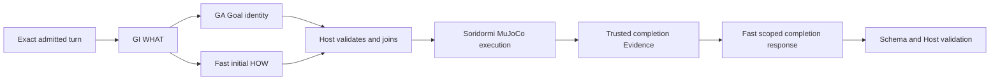

# Chromie Development Checkpoint

## Explicit argument coverage and Fast decoder repair

The Goal-driven single-authority architecture remains binding. Active Issue #35.
Chromie branch `codex/ga-request-format`, pre-delivery base
`46bafad15567ac74ff59e7f1c22108d067c208fa`; resume from the latest commit containing
both checkpoint and handoff. Commit/push remain authorized; main promotion is not
established. Paired Soridormi branch `codex/turn-count`, base
`578198ad1d52f4b5d2f9b63cacf87a23c3b5b224`; paired delivery: `284273bc344cc94012347c75ab270a9f4ac8ffdb` (pushed to origin).

### Actual workflows and repairs

| Owner / handoff | Observed input -> wrong output | Expected boundary and implemented change |
| --- | --- | --- |
| GI -> GA and Fast in parallel | Exact “Look at me for two seconds, then blink twice.” -> r1 duration="two seconds", r2 count=2, ordered r1 then r2 | Correct WHAT; GA preserves two separate body Goals. GI still receives no Capability catalog; prompts/semantic ownership unchanged |
| Soridormi catalog -> Fast | Gaze duration_s had default4 but only target realization metadata; Fast omitted duration_s | Provider declares duration -> duration_s, minimum1. Planner alone converts the bound value and units |
| Fast/Deep -> Host validation | Defaulted optional inputs and body Goals bypassed declared minimum_arguments | One shared mechanical presence check applies every matching provider declaration to each owned Responsibility/Goal before admission. No fill, translation, new parameter value, or model retry |
| Runtime -> observation/Evidence | Repaired gaze2 then blink2 and gaze3 completed in MuJoCo; safe_idle=true | Exact requested arguments retained, no physical hardware claim; original headless speech failure remains recorded |
| Runtime result -> canonical Fast reentry -> SGLang | Two actual completion-evidence requests supplied single/multiple Goal DTO schemas, but native XGrammar allowed internal CanonicalPlan-shaped replies | Existing intersection-shape exposure was missing for FastPlannerModelOutput/FastPlannerMultiGoalPlanOutput; both now use the same semantics-preserving decoder shaping as Deep/Skill |
| Fast parser/Host -> downstream | Previously rejected Fast shape then called Deep; repaired reentry yields valid primary Fast DTOs and truthful completed-outcome responses, with no new motion | Two focused reentries now pass original Schema/DTO/Host, with zero Deep calls; no semantic repair stage added |

The repaired focused path is:

In the two-Goal episode, the first motion event is retained while result reentry
is deferred until batch closure after the blink. One scoped Fast invocation then
consumes both results. The single-gaze episode reenters after its sole terminal
event; neither repaired path invokes Skill Selection or Deep.

The first defect combines an omitted provider declaration and an unimplemented
existing Host invariant; the model's omitted argument is its initiating trigger.
The second is a reproduced native decoder deficiency plus incomplete application
of an existing client adaptation. Neither change alters GI/GA WHAT authority,
Planner HOW authority, source wording, model/profile, physical lifecycle, or the
canonical valid-outcome set. No new document, environment variable, layer,
Capability or architecture term was added. Presence does not prove correctness of
arbitrary natural-language unit conversion; semantic review remains necessary.

### Retained evidence

Initial unchanged baseline: `.chromie/acceptance/turn-count-final-20260910/`,
51 cases /26 mechanical /16 acceptable previews, 155 linked calls.

Argument repair: `.chromie/acceptance/argument-coverage-20260910/`.
`origin-replay.json` replays the exact original primary output unchanged: admitted
with the old declaration, rejected with the repaired declaration. Eight missing
argument test contrasts fail before the repair; relevant tests pass after it.
The stable whole cohort completed51 /27 mechanical /17 reviewed acceptable initial
previews, 156 linked calls, zero request/output digest mismatches. Exactly one
bundle: `/home/chromie/Downloads/chromie_debug_bundle_20260910_220038.tar.gz`.
All cases reviewed in `behavior-review.json`; four recoveries and three regressions
are retained. Quick versus fast_limited speed presets differ (0.16 vs0.18m/s), so
that mechanical regression needs an explicit semantic/oracle decision rather than
silently changing its target. All other model semantics remain visible.

Fast decoder repair: `.chromie/acceptance/fast-reentry-format-20260910/`.
The exact running inference image's XGrammar0.2.1 accepted10 malformed frozen
structures before and rejects all10 after; both valid structures remain accepted.
Original/candidate JSON Schema validity agrees on all12 contrasts; actual production
wire schemas equal the frozen candidates. `native/summary.json` and
`production-wire-proof.json` retain the proof, with no additional model inference.
Two focused live-text/MuJoCo episodes retain8 calls, all raw schemas and digests
valid, no Deep invocation. Exact gaze2/blink2 and gaze3 motions completed and
returned safe idle. Two-goal episode remains a whole-run failure because1 required
TTS item was skipped in headless mode; this is not physical speaker evidence.
Final aggregate: 51 cases /27 mechanical /19 reviewed acceptable initial previews,
154 linked calls, all request/output digests valid; source stable in both repos.
Exactly one bundle: `/home/chromie/Downloads/chromie_debug_bundle_20260910_221659.tar.gz`.
Three reviewed recoveries (joke, continuation, quick preset); one regression
(walk_then_turn_right: GI again rewrites 三秒 as3秒, rejected before GA/Fast).
Gaze2 and gaze3 stay correct. These preview variations are not proven effects of
the canonical Fast decoder repair; `behavior-review.json` retains every verdict.

Canonical Chromie gate:2331 tests /437 subtests,140 benchmarks,20 legacy Agent tests;
repository policies, test ownership, pinned static analysis and docs pass. Relevant
Level A:19 distinct scenarios pass (composition5, multi-Goal10, grounding7 overlap).
Soridormi: governance/compile pass, body suite156 passed, full suite789 passed /2
skipped. Own-only provider snapshot excluding unrelated dirty metadata passes31
skill execution tests. The initial provider test omitted required target_ref and
failed; its fixture was corrected, and the final full gate passed. See the retained
before/final logs; no failure is hidden or converted into hardware qualification.

### Runtime identity and next work

RTX5090, fixed Gemma4-12B FP8/SGLang, model revision
`707f0a3b8a3c7ad586ed01e27eafbad8a27dd0f7`, 65536 context and existing role budgets.
Agent tag `chromie-agent:fast-reentry-format-20260910`; image `sha256:7238076e254ce71e0a87445d951c3694a1d4a56e4ea8d026d768c477aa655507`,
container `02de20612d0a3ee6faa3ab71e92c0ff0551bb8caabe3b304a831cc6ff81378f7`.
All112 deployed Agent/shared Python files match source. Soridormi source/config
remain live-mounted; `containers.json`, `provider-source.patch` and runtime identity
retain the evaluated tree. Its old advertised source_revision alone is not that
identity. Pre-existing Soridormi metadata/taxonomy/manifest/tests and Open Duck
submodule edits are preserved, excluded from this delivery, and retained separately.

Do not merge main or claim all remaining defects are model-only. Continue with
remaining tagged Fast reason contamination, GI provenance/ambiguity/prohibition and
Goal coverage, GA continuity/typed-binding conservation, and unresolved oracle
scope. Supervised physical voice/target evidence remains open. Preserve the whole
cohort before another broad change; no pass-count threshold overrides hard failures.

Resume validation: `./scripts/run_tests.sh`, `python scripts/check_repository_policies.py`,
`python scripts/check_test_ownership.py`, `python scripts/check_docs.py`.
Capture a new identity with `python scripts/capture_runtime_identity.py --allow-dirty --orchestrator-env .chromie/voice-runtime/orchestrator.env --compose-override docker-compose.sglang.yml --compose-override .chromie/voice-runtime/compose.voice-mujoco.yaml --output NEW/runtime-identity.json`.
Wait for capture completion before running the evidence root's `run-cohort.py`;
it runs the directory-discovered51-case preview and collects exactly one bundle.
`review_inputs.py`, `field-diff.py`, per-case raw records and `behavior-review.json`
support all-case review; independently judge new output rather than copying old
verdicts. Artifacts are local/private and must be transferred separately across
machines. Never edit `.env.runtime` directly.

Paired provider gate command: `docker run --rm --gpus all -v /home/chromie/github/soridormi:/app -w /app -e PYTHONPATH=/app/src soridormi-runtime-mcp:cuda13.1-cudnn-dev bash -c 'python scripts/validate_repository_governance.py && ./scripts/validate_body_concurrency.sh && python -m pytest -q && python -m compileall -q src'`.
Both repair roots retain `focused-command.json`; the final root also retains
`containers.json`, `source-verification.json` and the original/candidate decoder
corpus. The source-stable aggregate snapshots precede delivery-only doc edits.

For the evaluated provider's remaining tracked edits, the final evidence root also
retains `provider-uncommitted-after-delivery.patch` against the paired delivery
commit. Review/apply it only to that matching base when reconstructing the exact
local tree; the untracked Open Duck submodule content needs separate transfer.
