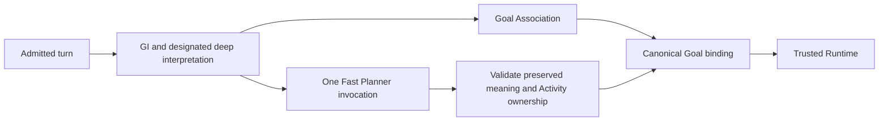

# Chromie Development Checkpoint

## Current delivery — GA decoding and unresolved-meaning containment

Active Issue #35. This main-branch delivery integrates implementation commit
`857e8000` from `codex/ga-array-contract`. Resume on `main` in
`/home/chromie/github/chromie`; the separate evaluation worktree and its ignored
artifacts remain at `/home/chromie/github/chromie-ga-array-contract`. The merge changes
only delivery documentation relative to the tested implementation.

Active Issue #35. The Goal-driven single-authority architecture remains binding.
The owner authorized completing the continuation, committing, pushing and merging to
`main` on 2026-09-10. Delivery branch `codex/ga-array-contract` starts at
`4dd7685d93d1bb530f7e186994497c8c7c7adc5c`; pre-delivery maintained main is
`01145332288857c415cff3d0a4a1fe7ffd9d0ccd` (source `08890f84`). Expected resume
revision is the latest delivery commit containing this checkpoint and HANDOFF.md.
Worktree: `/home/chromie/github/chromie-ga-array-contract`.
Source integration is authorized; live behavior and release readiness remain unqualified.

### Implemented scope

1. GA's existing intersection-shape helper now exposes array `type`, `items` and
   length constraints through one redundant `anyOf` branch. Original `allOf`
   conservation remains authoritative. This includes the parent's object-shape
   and request-scoped SGLang whitespace repairs; no backend/model default changes.
2. Fast Host validation now rejects a terminal result that drops any explicit GI
   unresolved meaning instead of citing it in clarification provenance. It also
   rejects completion/execution for the same Responsibility blocked by a clarification.
   Independent resolved Responsibilities may still execute in a mixed result.
   The request Schema excludes pure execute/respond when GI meaning is unresolved
   and permits the supplied gap count within the existing eight-gap DTO bound.
   One primary Planner invocation, the tagged streaming protocol, GI WHAT authority,
   GA continuity authority, and sequential physical Work remain unchanged.

No environment variable, architecture term, current document or compatibility path
was added. The existing Schema, validator, tests and API reference own the repair.
The patch does not make the model understand ambiguous utterances correctly, add a
semantic critic, or establish truthfulness of arbitrary Deep Planner response prose.

### Evidence actually retained

- GA frozen CPU decoder comparison: 1710 cases / 74 schemas, 184 valid outputs
  retained; invalid acceptance 118 -> 34, 84 newly rejected, zero newly admitted.
  Full Schema/DTO/Host verdicts are unchanged for all cases. Ten duplicate-ownership
  and 24 candidate-aware cross-collection failures remain decoder limitations; all
  fail existing Host conservation. They are not complete decoder soundness.
- GA evidence: `.chromie/acceptance/ga-array-contract-20260909/`, including
  `repair-report.md`, `comparison.json`, `remaining-review.json`, `schema-diff.json`
  and `after-adjudication.json`. Corpus SHA-256
  `e001ab341fc490b76c5c7033772acf2c71084f1dba4149d0e687c003a3f28367`.
  Cached SGLang 0.5.19 / XGrammar 0.2.1 CPU byte-token matching, not model inference.
- Fresh laptop baseline: all 51 must-pass live-text preview cases completed on one
  fixed deployed identity, Qwen3.5:4B / Ollama. Mechanical 5/51; post-hoc reviewed
  **3/51**, all planned blink/nod outputs. One purported pass fabricated a visual
  observation; another ignored unresolved actor meaning. Neither is qualified.
  152 model-call records retained, zero log decode errors, exactly one debug bundle.
- Baseline and new repair evidence: `.chromie/acceptance/ga-delivery-20260910/`.
  Start with `baseline/behavior-review.md` and `.json`, `baseline-identity.json`,
  `baseline/call-case-index.json`, and `meaning-gap-replay/comparison.json`.
- Meaning-gap replay: six originating contrast fixtures reproduced three wrong
  Host acceptances before implementation. Four supplemental mixed-work regressions
  were added after diagnosis. Exact retained pre-fix source replay: six invalid
  Host acceptances -> zero, four valid cases retained, 10/10 expected verdicts.
  Corpus digest `6482090737dfaef4c21aeaee79e4662bae75a4d765a6dd36189f92de4040afc6`.
  This is deterministic Schema/DTO/Host evidence, not new model inference.
- Prior GA-only canonical gate: 2313 tests / 366 subtests, 140 benchmark checks,
  20 legacy tests passed. Focused GA 85 tests / 86 subtests, Level A multi-Goal 10/10.
  Current containment change: focused replay 10/10; Level A natural uncertainty
  6/6 and capability grounding 7/7 passed. Final canonical gate passed **2323 tests /
  366 subtests**, 140 benchmark checks and 20 legacy tests, plus all policy, static,
  configuration, ownership and docs checks. Two existing FastAPI warnings remain.
- Revised full simulator cohort: **51/51 completed, mechanical 4/51, reviewed 1/51**.
  Only the silence/no-invented-motion control case fully qualifies. Blink twice,
  nod twice and blink once execute correctly and return safely idle, but their
  evidence-triggered Fast/Deep re-entry calls fail prompt-budget preflight. These
  hard failures invalidate the otherwise passing cases. Every case was reviewed.
  179 call-evidence records retained, 174 belonging to the aggregate (one startup
  and four focused records excluded), zero decode errors; one post-cohort bundle.
  See `after-simulator/behavior-review.md` / `.json`, `call-case-index.json`,
  `after-identity.json` and `final-simulator-status.json` in the delivery evidence root.
- Focused live and full-cohort actor cases both reproduce the corrected Host
  rejection: zero Capability dispatch, no semantic retry. They remain failed user
  behavior cases because no usable clarification is delivered. Final read-only
  simulator status confirms safe idle, no active tasks/lanes, emergency or fall.
  Baseline was preview and the revised aggregate executes the simulator: these
  counts are not a controlled estimate of behavioral improvement.

### Actual workflow and repaired boundary

| Owner / handoff | Observed input and output | Verdict / change |
|---|---|---|
| Frozen GI-shaped input -> GA Schema | Two speech Responsibilities r1/r2, no existing Goals; typed array length two plus conservation | Meaning unchanged; redundant array shape added |
| XGrammar -> permitted GA JSON | Before permits objects, null members and missing Goals; after rejects those shapes | Earliest reproduced decoder representation defect repaired |
| GA DTO -> Host | Duplicate r1/r1 can still decode/parse; Host requires exact r1/r2 | Fails closed before/after, no semantic repair or Goal commitment |
| Admitted laptop turn -> GI/deep | “摇两下头。” -> r1 body_action, count=2, unresolved=[actor] | Unnecessary model uncertainty remains; no claim of GI repair |
| GI -> concurrent GA and Fast | GA creates the r1 Goal; Fast prompt contains exact [actor] | Authoritative handoff preserved |
| Fast -> terminal Host | Silent presentation; execute shake_no count=2, unresolved=[] | Previously accepted despite missing GI meaning; now rejected once, without retry |
| Host -> Runtime / user outcome | Baseline emits a planned shake capability; no simulator dispatch in preview | Repaired replay emits failure, no terminal Work; legitimate clarification and independent work remain valid |

The initiating condition is explicit unresolved WHAT combined with a terminal HOW
claim. The model discarded the uncertainty; the missing Host conservation check
allowed that contradiction. The repair enforces the existing authority boundary
without selecting the missing meaning. It does not fix the separate GI inference
error, Deep hallucinated observation, or malformed Planner output clusters.

### Open qualification blockers and next work

The 4090 Laptop and RTX 5090 share architecture, but memory, backend, precision,
context/cache capacity, concurrency and runtime configuration differ. Evidence is
not interchangeable. The historical 5090 candidate had 12/51 reviewed preview
passes and ungrounded ambiguous-destination/unrelated-movement failures. Those raw
artifacts are absent locally; the laptop baseline is separate evidence.

The changed-revision aggregate and every mechanical pass have been reviewed.
Use that retained diagnosis before selecting another repair. GI provenance/meaning, Fast malformed tagged output and capability
realization, evidence-triggered Fast/Deep prompt budgets, speech playback not starting,
and unsupported observation/monitoring claims remain open. The Fast fix does not
prevent a downstream Deep result from dropping GI uncertainty after escalation.
GI allows up to twelve unresolved strings while a clarification Act allows eight
records: a single-Responsibility result with more than eight distinct gaps cannot
fit the current terminal Schema and must not be counted as qualified. That capacity
boundary is retained; this patch does not enlarge the canonical DTO.
Containment is not successful robot behavior. Physical microphone/speaker/robot
proof and default target-evidence closure remain open. Keep release readiness
withheld; use HANDOFF.md for exact identities, retained paths and resume commands.

## Retained baseline and claim boundary

Migration baseline `9df52609` selected shared Gemma4-12B on SGLang; laptop configuration
is unchanged. The previous Ollama Gemma Q4 full preview also had 0/51 qualified cases.
Earlier Qwen/SGLang versus Ollama latency trials used different model/precision/topology
and are not a controlled backend comparison. See HANDOFF.md and retained comparison
reports under `.chromie/acceptance/gemma12b-fair-rtx5090-20260909/` and
`.chromie/acceptance/sglang-switch-rtx5090-20260909/` for exact inputs and results.

GI binding-schema ordering, frozen primary-screen corpus, raw-output/termination retention
and the 1496-reference audit remain preserved. The current candidate milestone is defined
above; rejected field-layout/global-format experiments remain evidence only. Keep source
and deployed identity distinct. Never count containment as successful behavior or reuse an
old cohort as proof for a changed revision. Current-revision physical voice and default
target-evidence closure remain open. The one-authority architecture remains binding.
