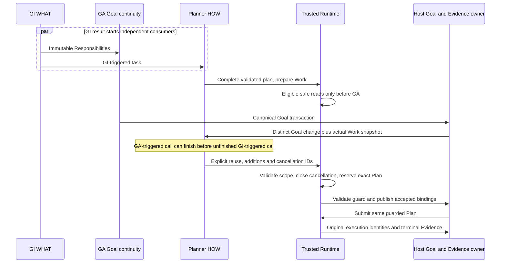
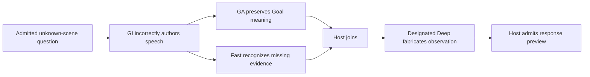
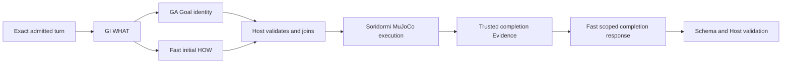

# Chromie Latest Handoff

## Issue #41 Planner speech authority and actual delivery, 2026-09-11

The owner approved the discussed correction and asked to continue. Scope: remove
Host semantic speech suppression; give Planner related delivery facts without
expanding its mutation scope; enforce exact Activity identity and truthful playback
completion. Continue the standing commit/push instruction. Remaining #40 decisions
and #42–#48, model optimization, provider changes and deployment remain excluded.
All entries below this section are historical delivery snapshots.

Repository `/home/chromie/github/chromie`, branch/upstream `main` / `origin/main`.
Clean pre-delivery base `4a1364028d6e59b09ac83ca470733f792a771f62`; the fetched
remote matched. Resume from the latest commit containing this checkpoint/HANDOFF
pair; verify the actual post-delivery commit rather than predicting its hash.
Evidence root R: `.chromie/acceptance/issue41-speech-authority-20260911/`.
This is an authorized Host/contract correction, not model prompt optimization.

| Actual local boundary / owner | Material input, observed output and verdict | Repaired handoff / evidence limit |
| --- | --- | --- |
| Admitted request -> GI/GA/Planner fixtures | `Blink twice and tell a joke.`, `goal-body`/`goal-chat`, retained Responsibility `r1`, completed `blink-result`, and sibling Activity text `A joke.`. GI/GA/model/provider calls are scripted or absent; this does not establish live intent understanding or robot completion. | Real Host re-entry validates the retained request, exact Goal scope and Evidence. Scripted Planner returns a new result, correction, or intentional same-word Activity. |
| Ledger -> bounded Planner input | The old Goal filter hid sibling-Goal speech; scoped Planner lacked the communication context used by the later Host suppression rule. This input boundary was incomplete. | Same-turn sibling speech becomes read-only context. Goal IDs remain exactly `goal-body`; sibling Work is excluded. Exact Activity IDs, wording, delivery attempt and delivery states remain available. Existing Fast/Deep projection and adapter consume this context; no second LLM decision is added. |
| Valid Planner result -> Host response | The old body-success/sibling-speech helper deleted all three scripted replies. Its separate text filter also deleted equal words. This is the earliest wrong decision boundary: Host judged communication necessity after Planner. | Remove both helpers and their live re-entry/Situation calls. Preserve valid Planner speech, including new information, correction and intentional repetition. Existing safety, source, stale-output and completed-Work guards remain. |
| Exact Activity -> speech scheduling | Two concurrent calls for one Activity previously scheduled twice; changed wording reused an earlier event. Different Activities/turns with equal words already had distinct identities. | Atomic lookup/schedule/register prevents duplicate scheduling. Changed wording rejects before synthesis even after a failed attempt. Same Activity after interruption reuses the interrupted receipt without automatic replay; Planner can author a new Activity. |
| Audio transport -> delivery lifecycle | `playback_completed` was projected as started, and started speech counted as delivered. Callbacks could precede Activity registration. Chunk completion, failure and interruption were not reliable whole-utterance proof. | Actual transport publishes terminal results; per-order facts survive early callbacks and aggregate only after all chunks finish. Exact registration replay is idempotent; stale attempt callbacks cannot finish a newer attempt. Failure after partial playback remains interrupted. Audio writes are mocked in these tests. |
| Complete speech -> history / Fast Goal observer | A scheduling/start receipt could previously populate conversation history and complete a bound Fast speech Goal. Resource release was not proof of full speech. | Both observers wait for the exact playback attempt's completion. Started/failed/interrupted/missing proof cannot become full history or speech-Goal completion. Existing action-start barriers continue using playback start. |
| Deferred result -> detached playback -> original history | Existing deferred delivery uses a physical session of `None` after a newer turn; registration had no original owner for completion proof. This became a reproduced correlation gap under the stricter contract. | Retain Host-authored original session separately from physical playback session, generation and orders. Exact callbacks close the original event/history without changing Goal identity or replaying audio. |

Ordered/concurrent local path:
```text
completed body Evidence + sibling speech facts -> scoped Planner request
  -> scripted valid Plan/Activity -> Host validation -> unchanged speech
concurrent submission A + submission A -> atomic identity lookup -> one TTS schedule
  -> chunk start/terminal callbacks (possibly before registration)
  -> exact Activity + delivery attempt -> all-chunk completion
  -> completed history and Fast speech-Goal observer
```

The primary cause is Host policy overriding the Planner's semantic decision.
Missing sibling context contributed; conflating started/completed delivery and
non-atomic scheduling were independent mechanical defects exposed in the same
approved boundary. The correction changes these existing owners; it does not make
Host infer semantic equivalence or promote generation/scheduling to user-heard truth.
Charter DELIVERED-CLAIM-001, interaction contract, turn-loop, Orchestrator README,
Status and Roadmap now describe the same rule. No primary model prompt was tuned.

Retained baseline: `baseline.log` passed 105 tests/13 subtests. `red-reentry.log`
reproduces three actual discarded Planner responses; `red-submission.log` reproduces
two identity failures and one passing different-identity contrast.
`red-early-receipt.log` reproduces lost pre-registration completion.
`red-delivery-context.log`, `fixture-phase-error.log`, `core-first.log` also include
fixture errors (missing event ID, invalid phase, tuple/list expectation); those are
not product root-cause evidence. `focused-fourth.log` is incomplete: a new test
fixture lacked `trace_context` and hung before its output event, then was stopped.
The corrected transport test bounds its wait and passes (`completion-proof.log`).
First canonical (`canonical-first.log`) passed static/policy/config/docs and 140
benchmarks but failed seven tests plus one suite subtest: old fixtures expected
complete delivery from only a start receipt. First Level A was 28/30, with the two
corresponding recovery cases failing (`level-a-first.log`, `level-a-first/`).
These fixtures now register explicit scripted completed transport facts; scenarios
and expected successful behavior are unchanged. The first expanded run retained
one overly broad interrupted-event lookup expectation; the final exact scheduler
checks interruption explicitly while the default deliverable lookup stays bounded.

Final focused `focused-expanded-final.log`: 301 tests/44 subtests passed.
Selected Level A (`level-a.log`, `level-a/`): 30/30 distinct cases passed; class
memberships overlap. Final canonical (`canonical.log`) passed 2,442 tests/723 subtests,
140 benchmarks, 20 legacy Agent tests, policy/ownership, pinned Ruff/MyPy, config
and docs. No final gate failure remains. A trailing blank line was removed during
the runner; `formatting-note.json` proves identical Python AST before/after. Final
source hashes match `source-before.json`; final docs/patch checks are retained
separately. Two pre-existing FastAPI deprecation warnings remain.

Commands from repository root, with pinned `requirements-test.txt` dependencies:
```bash
python -m pytest -q tests/test_planner_reentry_policy.py tests/test_playback_delivery_lifecycle.py tests/test_interaction_ledger.py tests/test_orchestrator_tts_alignment.py tests/test_capability_result_evidence_reentry.py tests/test_situational_cognition.py tests/test_playback_transport_extraction.py tests/test_interaction_coordinator.py tests/test_cognitive_turn_loop_closure.py tests/test_cognitive_runtime_pr7.py tests/test_behavior_scenario_runner.py tests/test_general_ability_acceptance.py
python scripts/check_repository_policies.py
python scripts/check_test_ownership.py
./scripts/run_tests.sh
python scripts/check_docs.py
python scripts/general_ability_acceptance.py --mode level-a --ability-class robust_intent_understanding --ability-class planner_goal_semantic_quality --ability-class human_like_cognitive_continuity --ability-class continuous_cognition_recovery --ability-class deterministic_safety_controls --ability-class multi_goal_daily_life --ability-class stable_capability_grounding --evidence-dir .chromie/acceptance/issue41-speech-authority-20260911/level-a
```

Maintained Markdown remains 102 -> 102; configuration keys 381, public booleans 1,
aliases 0. No new document, architectural owner/layer, model call, compatibility
path or runtime switch was introduced. All 1,500 GA corpus inputs/references are
unchanged. Deleted Host suppression and its obsolete helper tests are replaced by
behavior assertions at actual re-entry and scheduling boundaries.
Ignored artifacts need separate transfer. A new checkout can create/activate `.venv`,
install `requirements-test.txt`, and run the tracked commands above. No microphone,
audible speaker, physical body, simulator, live model or deployed-provider evidence
was collected. Existing exhausted qualification budget and target-evidence gaps remain.
Next: deliver the verified patch through the authorized normal main update, record
actual commit/remote identity in #41/#36 and keep #41 open for owner acceptance.
Do not infer authorization for other Issues or deployment from this delivery.

## Issue #40 GA structural repair preservation, 2026-09-11

The owner approved the reported GA conflict and its correction: retain complete
primary meaning, permit only one provably lossless container repair, compare before
acceptance, and apply that same preservation rule to preprocessing. Continue the
standing authorized Git delivery; no new model/live run or deployment is included.
Other GI normalizers, the numeric punctuation limitation, #41–#48 and full merge/split
remain pending. All entries below this section are historical delivery snapshots.

Repository `/home/chromie/github/chromie`, branch/upstream `main` / `origin/main`.
Pre-delivery base `15f2a45c73a38e63a7274639d07b2ad544025e92`; initial tree was clean
and synced. Resume from the latest commit containing this checkpoint/handoff pair;
verify the actual commit and remote ref after delivery rather than predicting a hash.
Evidence root R: `.chromie/acceptance/issue40-ga-semantic-preservation-20260911/`.
This is an approved global Host/contract correction, not model prompt optimization.

| Actual local boundary / owner | Observed input/output and correctness | Change and downstream handoff |
| --- | --- | --- |
| Accepted request -> GA primary | Scripted `Continue the existing task.`, GI ref `r1`, retained `goal-a`; primary says `continue`, with an unknown extra key. No live model supplied this result. Correct retained input; malformed output. | Preserve original parsed response before preprocessing. Correlate through existing request/turn IDs. |
| GA DTO failure -> repair admission | Extra-key error previously admitted a second output; `cancel` passed its own DTO and source checks. Earliest wrong boundary: shape-error classification plus independent revalidation could not prove unchanged claims. | Unknown fields now reject after one call. Only an existing object/singleton-object-array mismatch at a concrete field can qualify. The unchanged projection must pass DTO and pure materialization/source/conservation checks before another call. |
| Repair response -> GA acceptance | The former result accepted `cancel` for `goal-a` from the repair despite primary `continue`. No actual Goal mutation was performed in the original probe. | Compare every authored field/value after lossless resource normalization, ignoring object-key order only. Relation, refs, targets, replacement indices, values, array order/cardinality and optional content remain fixed. Reject any difference; never call a third time. |
| Preprocessing -> DTO | Invalid optional referent updates/quantities and explicit decision conflicts could be dropped/overwritten; unknown nested fields were ignored; malformed new-Goal reference containers became empty lists. Resource bindings could be deleted for unknown sources or lost when a destination was malformed/missing. | Reject those inputs without modifying the original. Retain only exact binding relocation/duplicate-copy consolidation with an unambiguous active owner. Explicit null/malformed destinations reject; no semantic replacement is invented. |
| Rejected GA -> canonical Goal owner | Focused state fixture supplies the rejected cancellation to real ConversationStateManager. | No operation applies and the complete Goal snapshot remains unchanged. Planner, Runtime dispatch, providers, audio and physical devices are not invoked in this fixture. Their live behavior is unproven. |

The repair prompt contains the complete original result plus mechanical errors;
budget overflow rejects before a second invocation instead of truncating evidence.
It supplies neither another writable interpretation nor a semantic reviewer.
Existing diagnostic output references now distinguish initial/repaired/accepted
results, shape-error paths and preservation outcome. The existing broad exception
handler remains `fail_closed_boundary`: logs the cause, returns no Goal operations,
and marks validation failures nonretryable. Only its reviewed body hash changes in
the exception inventory; no classification or checker exception was added.

`before.json`, `original-scripted-probe.json`, and `replayed-probes.json` retain the
baseline and identical replay: two old acceptances become two one-call rejections.
`baseline-tests.log` passed 101 tests/113 subtests. `red-regression.log` exposes
17 failing contrasts before the main fix; `resource-destination-red.log` exposes
four additional lossy-destination paths before correction. New preservation tests
passed 13 tests/23 subtests (`preservation-final.log`). Pure shape repairs pass;
changed relation/target/confidence/refs/scope/values/count/order fail. Intermediate
logs retain the obsolete requires_replan-extra acceptance assertion and reviewed
handler-hash failure; neither is hidden or used as passing evidence.
`related-id-baseline.json`/`related-id-red.log` also reproduce dropped malformed
related/superseded Goal references. The new guard rejects these rather than replacing
them with empty lists. The first canonical run was stopped before source edits;
`canonical-interrupted-before-id-guard.log` is incomplete, not a pass.
Final `focused-final.log` passed 167 tests/142 subtests. `canonical.log` passed
2,428 tests/715 subtests, 140 benchmarks and 20 legacy Agent tests, including
repository/test-ownership policies, pinned Ruff/MyPy, configuration and docs.
The 140 benchmarks include all nine GA corpus checks on the final source and all
1,500 reference outputs through Schema/DTO/Host. `corpus-final.log` is an earlier
nine-test pass before the final malformed-reference guard, not the final identity.
Selected Level A passed 30/30 distinct cases (`level-a.log`, `level-a/`); class
memberships overlap. Two existing FastAPI deprecation warnings remain. Source
hashes are unchanged since the final full gate began (`source-before.json`); final
documents/patch identity and docs recheck are retained separately. No local gate
failure remains on the final source.

Commands from repository root (pinned dependencies in `requirements-test.txt`):
```bash
python -m pytest -q tests/test_goal_association_pr2.py tests/test_goal_association_contract_module.py tests/test_conversation_state.py
python -m pytest -q benchmarks/tests/test_goal_association_daily_life_dataset.py
python scripts/check_repository_policies.py
python scripts/check_test_ownership.py
./scripts/run_tests.sh
python scripts/check_docs.py
python scripts/general_ability_acceptance.py --mode level-a --ability-class robust_intent_understanding --ability-class planner_goal_semantic_quality --ability-class human_like_cognitive_continuity --ability-class continuous_cognition_recovery --ability-class deterministic_safety_controls --ability-class multi_goal_daily_life --ability-class stable_capability_grounding --evidence-dir .chromie/acceptance/issue40-ga-semantic-preservation-20260911/level-a
```

The 1,500 corpus inputs/reference outputs are unchanged. Its repair-capture fixture
now uses an association object instead of its singleton array, since unknown-key
removal is no longer permitted. Schema/DTO/Host corpus checks are mechanical proof,
not model inference. No primary prompt or serving profile changed; only the existing
repair prompt explains the stricter Host contract. Maintained Markdown remains
102 -> 102; config keys 381, public booleans 1, aliases 0. Existing owners hold all
changes, with no new architecture term, compatibility path or runtime switch.

Retain source-before/final identities, final patch, focused/corpus/canonical/Level A
logs and Issue readbacks under R. Ignored artifacts need separate transfer. A fresh
checkout can create/activate `.venv`, install `requirements-test.txt`, then rerun the
tracked commands above. Fetch origin and read this checkpoint before resuming.
Next: deliver the verified patch through the authorized normal main update and
record the actual commit/remote identity in #40/#36. Keep #40 open for remaining
GI/normalization decisions; resume from the delivered checkpoint/handoff pair.
Do not infer exhausted-budget model qualification, supervised voice or target-evidence
closure from these local tests; those existing gaps remain.

## Issue #40 GI speed rejection and authorized delivery, 2026-09-11

The owner approved the GI speed example/rule and requested commit/push of the
agreed work. Deliver the existing #37 independent Planner/Runtime/Memory patch,
#38 WHAT/context clarification, #39 source-bound Goal inheritance, and this narrow
#40 fix together. Other GA/GI normalizers, GA repair equality, #41–#48, full
merge/split, model optimization, provider changes and deployment remain excluded.
The earlier entries below are historical pre-delivery snapshots, not current Git claims.

Repository `/home/chromie/github/chromie`, branch/upstream `main` / `origin/main`.
Pre-delivery base `a0c5d09fbb18fca8660aa43abb55bccca18924cc`; remote matched at
initial fetch. Resume at the latest commit containing this checkpoint/handoff pair.
The commit hash and push result must be verified after delivery, not predicted here.
Evidence root R: `.chromie/acceptance/issue40-gi-speed-rejection-20260911/`.
`before.patch` has SHA-256
`4d6a2017c83d938e39896e94e14b652cb7985741db3cc459d15967d66c63ec37`,
matching #39's final patch exactly; no intervening/unrelated changes were found.

| Actual scripted boundary / owner | Material I/O before correction | After correction and evidence limit |
| --- | --- | --- |
| Admitted request -> GI primary | Inputs are `Nod twice.`, `点两次头。`, `往前走。`, with exact source-token refs. The scripted GI response adds speed `1`, `正常速度`, or the same `往前` location value. No live model made these outputs. | The same retained requests and raw results are replayed; upstream identity and meaning are unchanged. |
| Primary DTO/source checks -> speed processing | DTO and source-ref checks pass. The speed stripping helper deletes the value; the speed validator then sees no value. This is the first wrong boundary: an invalid semantic field becomes an accepted omission. | The stripping helper and call are removed. The existing typed source/dimension validator rejects the original result without modifying it. No prompt, schema, classifier, retry, or provider change is needed. |
| GI public transaction -> caller | The old public transaction accepted the modified result. Tests reproduce four primary forms and one Deep failure path. Downstream GA, Planner, Runtime, audio and providers are not invoked in these fixtures. | Primary returns the existing typed `invalid_primary_goal_interpretation_semantics` failure after exactly one call. A valid unresolved primary may still call Deep once; invalid Deep speed then returns `invalid_deep_goal_interpretation`, with no third call or fallback to primary. |
| Valid GI -> accepted Responsibility | Speed may be absent, explicitly stated, or present in bounded history; defaults belong to Planner. | Five positive contrasts preserve absent speed, English/Chinese wording, a supported numeric surface and context-derived wording without changing binding values. Existing Goal/Work state is not mutated by these GI-only tests. |

Baseline `baseline-tests.log`: 80 tests/67 subtests passed. Three
`baseline-probes.json` records show deletion/acceptance; `replayed-probes.json`
shows rejection on those identical inputs. `red-regression.log` reproduces the
five incorrect acceptance paths before the fix. It also exposed a separate numeric
source limitation: `Nod at speed 0.35.` excludes the decimal from the existing
numeric extractor because a period immediately follows it. Before the fix speed
was removed; after the fix it rejects. `focused-first.log` retains that finding.
The supported numeric positive contrast uses `Nod at speed 0.35` without the
period; the limitation is not fixed or hidden by weakening its validation.

Focused command: `python -m pytest -q tests/test_goal_interpreter_llm_prompt.py`.
`focused.log`: 83 tests/76 subtests passed. The original removal test now asserts
rejection and input immutability. No compatibility helper or new runtime flag remains.
Maintained Markdown remains 102; no service, config key or architectural owner added.
Final canonical passed 2,415 tests/692 subtests, 140 benchmarks and 20 legacy
Agent tests, including repository/test-ownership policies, pinned static gates,
configuration and documentation checks. Two existing FastAPI deprecation warnings
remain. Selected Level A passed 30/30 distinct cases; class memberships overlap.
Final source identity is unchanged from the start of the complete canonical gate.

Final commands from repository root:
```bash
python scripts/check_repository_policies.py
python scripts/check_test_ownership.py
./scripts/run_tests.sh
python scripts/check_docs.py
python scripts/general_ability_acceptance.py --mode level-a --ability-class robust_intent_understanding --ability-class planner_goal_semantic_quality --ability-class human_like_cognitive_continuity --ability-class continuous_cognition_recovery --ability-class deterministic_safety_controls --ability-class multi_goal_daily_life --ability-class stable_capability_grounding --evidence-dir .chromie/acceptance/issue40-gi-speed-rejection-20260911/level-a
```

Retain `canonical.log`, `level-a.log`, `docs-final.log`, source-before/final identity,
final patch and remote issue readbacks under R. These ignored artifacts do not travel
with Git. A new checkout can reproduce the tracked tests with the documented pinned
setup (`python -m venv .venv`, activate it, install `requirements-test.txt`). Fetch
`origin`, inspect branch/status and this checkpoint before resuming; do not recreate
old output from chat or infer deployment qualification. The 1,500 GA corpus edits
remain the earlier reference-format-only migration; inputs/semantic expectations
are unchanged. Local scripted/Level A evidence does not qualify live model behavior.
The exhausted model-optimization budget and outstanding voice/target evidence remain.

Next: keep #40 open for remaining normalization/repair decisions and the numeric
source limitation. #41 remains a proposal. Verify the delivery commit includes both
handoff owners, push only the authorized normal main update, and report the actual
commit/upstream/cleanliness result. No new model/live run or deployment is authorized.

## Issue #39 — authorized semantic inheritance, 2026-09-11

The owner explicitly approved #39 after reviewing the GI-to-Goal ownership gap.
Scope: new Goal WHAT inheritance; sourced partial Goal changes; preservation of
prior meaning, provenance, resource identity and Work/Evidence. Full merge/split
execution and #40–#48 remain excluded. No model/provider/configuration-default,
service deployment, commit or push was performed; the exhausted model-optimization
budget is unchanged. This is an authorized global-contract correction, not a
prompt-tuning or live-behavior qualification run.

Baseline: local main over `a0c5d09fbb18fca8660aa43abb55bccca18924cc`, with the prior
#37/#38 patch preserved before editing. Evidence root R:
`.chromie/acceptance/issue39-semantic-inheritance-20260911/`.
`before.patch`, `before.json`, `baseline-tests.log` (149 tests/107 subtests) and
`baseline-probes.json` retain the exact starting point. Baseline scripted probes
show a changed proposition accepted as new Goal meaning, a description update
retaining old criteria, and dropped Responsibility/related-Goal refs.

| Boundary and owner | Observed failure and repaired workflow |
| --- | --- |
| GI -> GA primary contract | GI asks whether a result is correct; a scripted GA description asserts correctness and was accepted. GA no longer emits that description. Host copies exact referenced GI outcome into canonical description and criteria, retaining the complete accepted source record. Six bilingual contrasts cover polarity, new observation and historical result. This is representation proof, not inference. |
| Candidate-aware GA -> source-bound update | Free updated_description could replace meaning without attributed requirement changes. GA now selects target Goal, zero-based retained criteria indices and exact current GI refs. Empty indices append; omitted criteria remain. Binding changes select a semantic path and accepted GI binding, without authoring values. Unknown refs, overlapping paths, conflicting named fields, unavailable criteria and changed modality reject. |
| Agent materialization -> actual Goal owner | Materialization binds each target to its complete supplied Goal fingerprint. Host revalidates actual state and copies sourced values atomically. A changed snapshot produces a typed rejected update and transaction rollback; no semantic retry is introduced. |
| Goal revision -> retained state | Reconstructing only selected SemanticGoal fields lost source/related/resource fields. Revisions retain the whole prior Goal, update selected meaning together, and append prior snapshot plus source update to goal_revision_history. Requirement provenance distinguishes current GI from older retained Goal/version facts. |
| Goal state -> Planner and persistence | Effective criteria/fields and accepted source metadata reach typed/dictionary Planner projections. Scoped revision tests preserve existing Plan version and Evidence, reject stale submissions, and reload unchanged Goal/history from the existing task store. Actual Runtime dispatch and physical effects are not invoked by these fixtures. #37 regressions retain execution/Work compatibility ownership. |

New-Goal and candidate-aware GA remain one primary call each, with the existing
mechanical DTO-repair policy. The obsolete missing-description recovery helper and
unreachable duplicate prompt body were removed with their redundant output fields.
Other #40 normalization/retry rules were not redesigned. The existing reviewed
GoalAssociationResolver failure boundary still logs and returns formal fail_closed;
its reviewed body fingerprint is refreshed only because obsolete recovery metadata
was removed. No exception classification or checker was relaxed.

The model contract adds requirement/field-reference structures in its existing
owner; the Goal-state helper lives in the existing shared semantic contract. No
service, store, runtime switch, maintained document or independent authority was
added. Existing success_criteria carries complete effective requirements; its
source metadata and revision history are retained under ordinary Goal privacy,
retention and deletion rules. The original Goal source_text is preserved.

All 1,500 corpus reference files were mechanically migrated, including removal of
empty retired fields. Inputs and semantic expectations remain unchanged; modified
originals and input hashes are retained under R/original-corpus and
R/reference-contract-migration.json. The migrated full corpus passes its nine
checks; this does not upgrade historical inference or merge/split execution claims.
Exact duplicate candidate text was removed so complete indexed requirements fit
the existing 2,600-character projection budget; overflow now rejects explicitly.
Focused coverage passed 181 tests/119 subtests; the final commit/source guard set
passed 144/119. Structured GI binding coverage then passed 5 tests/13 subtests,
including exact object/list value copying through Schema and Resolver; its log is
`structured-source.log`. Final canonical passed 2,412 tests/683 subtests, 140 benchmarks and
20 legacy Agent tests, including policy, test ownership, pinned Ruff/MyPy,
configuration, runtime structure and docs. Selected Level A passed 21/21 distinct
cases across continuity/recovery, safety, multiple Goals and capability grounding.
`canonical.log`, `level-a-final.log`, `level-a-final/` and `docs-final.log` retain
current evidence. `canonical-before-final-commit-guard.log` and
`canonical-before-structured-source.log` retain prior passing states; intermediate
failures are retained separately. `scope.json` and
`qualified-source-before.json` bind the unchanged source used by the final full gate.
`final.patch` and `final-identity.json` bind the final documentation-only closeout.
Maintained Markdown count remains 102; config keys 381, public booleans 1, aliases 0.
The public state entry rejects old-form payloads inside by_goal_id and source turns
or refs outside the exact association before any state mutation.

Resume: #39 is locally implemented and verified, awaiting owner acceptance. #39/#36
record actual results; leave separate audit matters for owner discussion. No additional
model-optimization budget or Git/deployment authorization is implied.

## Issue #38 — authorized WHAT/context clarification, 2026-09-11

The owner approved the #38 proposal and clarified the role inputs. GI interprets
the current utterance using recent context and activated relevant history; GA
relates accepted GI meaning to canonical Goals/continuity using necessary permitted
personal/relational context; Planner decides action from intent, available Goals,
actual Work, Evidence, communication records and applicable preferences. These
are differing questions, not exclusive short-memory/long-memory partitions.

The earliest confirmed wrong boundary was principle 34's requirement for GI to
report whether Work/fresh Evidence remains, contradicting the main architecture.
The existing production GI DTO, primary/Deep schemas/prompts and Planner handoff
already preserve the intended division. The authorized repair changes existing
Charter, Memory and turn-loop docs, with truthful status/Issue/resume updates.
No production source, prompt, model, runtime setting or provider was changed.
No commit, push or deployment occurred; #39–#48 remain unapproved proposals.

| Observed local boundary | Actual input/output and claim |
| --- | --- |
| GI primary/Deep decoder -> Host | Six frozen English/Chinese current-temperature, new-measurement and historical-result fixtures pass both exact schemas and Host acceptance. Complete outcome and temporal bindings remain unchanged; unresolved=[] is legal without an answer. Work-required, fresh-Evidence-required and execution-ready fields reject at root, Responsibility and binding levels. Correct mechanical contract; no inferred model output. |
| Accepted GI -> GA and GI-triggered Planner prompt | The exact outcome survives both actual prompt builders; no new semantic author or source change is introduced. |
| Supplied canonical Goal -> Fast/Deep Planner prompt | Exact goal description survives both builders. The Goal is a fixture: this does not prove GA semantically inherits it, which remains #39. |
| Activated Memory -> six role/depth inputs | Recent correction, durable consent-bound preference and public relational entry remain visible through GI primary/Deep, GA, streaming Planner and canonical Fast/Deep input builders. Existing privacy/activation tests also pass. This does not add retrieval, persistence or complete-history guarantees. |

Evidence root: `.chromie/acceptance/issue38-what-context-20260911/`.
`before.patch`/`before.json` retain the prior dirty tree; `probe.py`, six separate
input files, per-case packets and `probe-results.json` retain the mechanical
workflow. Inputs were frozen before assertions. No external model/service or
Runtime dispatch was invoked. Focused current checks passed 375 tests and
341 subtests (`focused.log`). Canonical verification passed 2,407 tests,
671 subtests, 140 benchmarks and 20 legacy Agent tests, including repository
policy, test ownership, pinned static, configuration and docs checks
(`canonical.log`); final docs validation is retained in `docs-final.log`.
The first canonical attempt stopped at the existing STATUS line limit; shortening
status prose corrected that failure before the full passing rerun. Its log is
retained as `canonical-first-docs-limit.log`; no gate or limit was changed.
The prior #37 implementation/test patch identity below is unchanged.

Resume at #38 acceptance; each other audit Issue needs its own
discussion and authorization. No new model-optimization budget is implied.

## Historical audit discussion index — 2026-09-11

The owner authorized splitting the original top-level architecture audit into
independent GitHub Issues, each discussed and approved separately. The completed
[index #36](https://github.com/TimeTreker/chromie/issues/36) links #37–#48. #37
records the already-authorized local Planner/Runtime/Memory amendment below;
#38–#48 remain discussion proposals with evidence, options and acceptance bounds.
No new implementation, model change, scenario audit or deployment was performed
while creating these Issues. Existing Issue states and budgets remain unchanged.
ROADMAP owns the index link; each Issue records its own future decision.
Local draft and creation/verification records are retained under
`.chromie/acceptance/architecture-audit-issues-20260911/`.

## Current local amendment — independent Planner tasks, 2026-09-11

Issue #35; current resume authority is DEVELOPMENT_CHECKPOINT.md. The owner
explicitly authorized only the discussed Charter/implementation amendments and
confirmed pre-GA execution for existing contract-declared safe reads. Other Work
is prepared pending canonical Goal binding. GI and GA trigger distinct Planner
calls; the wording does not mean GI or GA plans. No commit, push, deployment,
provider/default/model change, optimization iteration or Soridormi edit occurred.
The historical consolidation and laptop records below retain their original scope.

Current checkout `/home/chromie/github/chromie`, `main`, uncommitted patch over
`a0c5d09fbb18fca8660aa43abb55bccca18924cc`. Evidence root R:
`/home/chromie/github/chromie/.chromie/acceptance/independent-planning-memory-20260911/`.
`implementation.patch` excludes docs and includes every changed implementation,
model-facing contract/prompt, test and Level A harness file. SHA-256:
`16354fd4b0e52c96a30b7077675c2a344a99340b9fa86fe3f9b7f070409efcc6`.
`source-identity.json` records base, branch, scope and verified counts.
These artifacts are local/ignored and must be transferred separately from Git.

### Actual local proof workflow and authority

The originating problem was the top-level contradiction between principle 25
and the pre-GA safe-read exception, followed by owner-approved independent
planning and partial Work revisions. This was not a live utterance diagnosis or
model optimization. The following episodes are production-owner local regressions
with scripted model results/providers; model inference itself is unproven.

| Episode / module owner | Authoritative input -> observed output, expected boundary and correlation |
| --- | --- |
| Independent calls: GI -> GA + Planner | Immutable GI r1; first Planner stream is deliberately held. GA returns a modify association for goal-1. The old task lifecycle waited for the first stream; the new GA-triggered call returns independent-goal-plan and closes while the GI-triggered task is cancelled. Distinct planning_task_id, preserved GA result and no reviewer call are asserted. Correct scheduling after amendment; model meaning unproven. |
| Safe read: Planner -> coordinator -> Runtime | Complete read-weather Activity, immutable weather Responsibility, available side-effect-free safe_read contract, no confirmation. GA waits until provider start. Runtime calls provider before GA, then binds source_goal_ids=[goal-weather]. Earlier mismatched response identities lost seeded reuse and invoked twice; canonical interaction identity now consumes the original result exactly once. Correct local dispatch/identity; no external weather service invoked. |
| Partial revision: Planner -> Runtime | Original requests keep/cancel/untouched share original Plan identity. New Plan explicitly reuses keep, cancels cancel and adds a new step. Runtime cancels only the named request, preserves untouched, marks reused Work for no redispatch. Completed keep is reusable Evidence with provider count one. Exact Capability/args/timing/Goal ownership validation precedes mutation. |
| Stale result: Runtime -> Host publication -> dispatch | Two snapshots intersect goal-a; accepting the newer reservation rejects the older, while goal-b proceeds. Changed Goal truth, wrong Plan fingerprint and reused guards reject before publication/dispatch. The accepted Plan's own synchronous Goal bookkeeping does not invalidate its guard. Correct exact identity/version boundary. |
| Shared Work: Runtime ownership | One request owns goal-a and goal-b. A cancellation naming only goal-a reports shared-owner conflict, selects no requests, and leaves one provider execution. No duplicate per-Goal execution identity is introduced. |
| Retained progress: Host Goal owner -> Evidence | Original Plan Work is preserved while new Plan Work finishes first. Goal remains running with the old request pending; exact old outcome is accepted into retained_execution_outcomes, with the newest Plan evidence unchanged. Earlier latest-only bookkeeping dropped that continuity. Unbound stale outcomes still reject. |
| Goal stop: Goal owner -> named cancellation -> Runtime | Goal holds current and preserved original Plan bindings. Goal cancellation expands both exact scopes and waits for both closure receipts before marking the Goal cancelled. Real local Runtime proves both requests stop; provider-global cancel cannot widen a partial Planner selection. |
| Memory -> GI/GA/Planner prompts | Only activated, audience-filtered extracted entries enter role_memory_context. Source/subject/audience/consent/persistence fields survive. GI projects up to 4 complete entries/2400 chars; GA/Planner up to 8/4800. Oversized entries are skipped whole; raw stores and aggregate summaries cannot bypass activation. Existing extraction/retention and consent remain owners. |



The diagram shows one possible ordering; completion order does not grant semantic
priority. Identity-only GA association can join the unchanged GI-derived plan
without a second call. Early read binding still awaits that read's closure under
the existing provider lifecycle. Only model invocation independence is claimed.
No new layer, service, current document or runtime switch was introduced.
Maintained Markdown remains 102 -> 102; configuration 381 keys, 1 public boolean,
0 aliases. Existing Runtime, Goal-state and Memory owners carry the change.

### Final evidence and resume commands

R`canonical.log`: `./scripts/run_tests.sh` passed **2,407 tests, 671 subtests,
140 benchmark tests and 20 legacy Agent tests**; policy, ownership, pinned static,
configuration, runtime structure and docs passed. Two pre-existing FastAPI
startup deprecation warnings remain. The earlier
R`canonical-before-retained-evidence.log` (2,405) predates the final retained
progress/Evidence and Goal-stop repairs; use the final log for this patch.
R`baseline.log`: before-change focused baseline 150 tests/11 subtests.
Focused retained logs: `publication.log`, `task-delta.log`,
`retained-evidence.log`, `goal-stop.log`. The final full gate includes all of them.
R`level-a.log` and R`level-a/`: **21/21 distinct cases** passed across continuous
recovery 4/4, deterministic safety 3/3, human-like continuity 4/4, multi-Goal 10/10
and capability grounding 7/7 (overlapping memberships).
R`docs-final.log` records the final documentation-only refresh check.

From repository root, inspect current state and retained identities before work:

```bash
git status --short --branch
git rev-parse HEAD
cat .chromie/acceptance/independent-planning-memory-20260911/source-identity.json
python scripts/check_docs.py
```

After a further authorized source change, run `./scripts/run_tests.sh` and the
relevant focused classes. The selected Level A command for this amendment was:

```bash
python scripts/general_ability_acceptance.py --mode level-a --ability-class continuous_cognition_recovery --ability-class multi_goal_daily_life --ability-class deterministic_safety_controls --ability-class stable_capability_grounding --ability-class human_like_cognitive_continuity --evidence-dir .chromie/acceptance/independent-planning-memory-20260911/level-a
```

The agreed local implementation is complete; current-model semantic quality,
real service concurrency/latency, supervised voice and default target evidence
remain unqualified. No deployment identity was rebound here. Historical runtime
identities below do not establish the running source for this patch. A future
model/live qualification must use a newly authorized frozen cohort and fresh
source/runtime identities. Prior iteration budgets and the unrelated Fast wire
proposal remain unchanged. Release remains development only.

## Historical main consolidation — 2026-09-11

The owner explicitly requested merging all Chromie branches to main. This authorizes
source integration and supersedes earlier branch-only/no-main delivery instructions;
it does not qualify a model/provider, authorize the pending Fast wire amendment, or
close supervised voice, physical robot, or default target-evidence gates. Issue #35
remains active. No additional optimization iteration or deployment was performed.

Pre-merge main: `ab5caeab49e46be9c77bd87c488e693c156c2eca`.
Incoming branch: `origin/codex/ga-request-format` at
`c2dc2e5c` (includes the newer `9e3d3971` and `c2dc2e5c` laptop repairs).
All other fetched Chromie branch tips are already ancestors of pre-merge main;
this one merge therefore includes every discovered local and origin branch.
Expected resume is `main` at the latest commit containing both handoff owners.
Soridormi is a separate repository and was not merged or edited by this request.

Conflict resolution retains the shared object/array intersection helper (the same
mechanism previously local to GA), uses the newer primary response-language contract
in both canonical Fast prompt branches, and preserves main's runtime/TTS/quiet-input
repairs. Both prior evidence histories remain available below or in Git. No new
semantic authority, provider default, runtime setting, document or term was added.

Validation for the combined tree is in
`.chromie/acceptance/main-consolidation-20260911/`: `canonical.log` and
`refs-before.txt`. `./scripts/run_tests.sh` passed: 2,392 tests, 671 subtests,
140 benchmark tests and 20 legacy Agent tests; repository policy, ownership,
pinned static analysis, configuration and documentation gates passed. Two existing
FastAPI startup deprecation warnings remain. The selected Level A suite passed
26/26 distinct scenarios across robust intent, continuous recovery, deterministic
safety, multiple Goals and capability grounding (class memberships overlap);
`level-a.log` and `level-a/` retain results. Documentation was checked after the
merge-record update as well (`docs-integration.log` and `docs-final.log`).
The first final-doc check rejected a 161-line checkpoint against its existing
160-line limit; compacting the historical heading resolved it without changing facts.
Historical test counts below apply only to their recorded revisions. No
merged-revision live cohort or hardware proof was run.

SGLang is already selected by the RTX 5090 profile; the RTX 4090 Laptop profile
still selects Ollama. SGLang is a reasonable development direction, but the retained
5090 Gemma FP8 and laptop Qwen GGUF results are not a controlled backend comparison.
The earlier 5090 preview had 27 mechanical/19 reviewed acceptable initial previews
out of 51; the latest laptop preview was incomplete and unqualified. Neither
establishes a generally qualified replacement. Decoder, semantic and target-evidence
blockers remain; schema validity alone is insufficient. No default was changed.

Resume by checking `git status --short --branch`, then reading the retained failures
and original identities below before any newly authorized live work. The combined
source requires a freshly bound runtime identity and full cohort before any new
runtime-level claim. The pending Fast wire proposal remains unimplemented.

## Historical pre-merge branch record

The following record retains its original revision, runtime and authorization scope.
Current resume and merge authorization are defined above.

## Active RTX 4090 Laptop boundary — all 18 iterations 29–46 complete

Updated 2026-09-11; Issue #35. First requested delivery 9e3d3971 was committed,
pushed and verified before this new batch. All 18 further iterations 29–46 are
complete; zero remain. Source repairs are retained, **target qualification fails**.
This is the owner-authorized final commit/push, with no main merge or model change.

Chromie `/home/chromie/github/chromie`, branch `codex/ga-request-format`,
pre-delivery HEAD/upstream `9e3d3971e48ce4ffff53723dc99cd4db7279888c`.
Main remains `ab5caeab49e46be9c77bd87c488e693c156c2eca`.
Expected resume revision: latest commit containing both handoff owners on this
same pushed branch. Final implementation/test patch SHA-256: `b9c3c7bffedbd22cf8fa8e1babb4c7cafdf349ccc33c3b1f1c71669bc691fafb`.
Remote must still equal the base before push; no force-push/history rewrite.

Private root R throughout this section is
`/home/chromie/github/chromie/.chromie/acceptance/laptop-more18-20260911/`.
Original root OLD is sibling `laptop-iterations-20260910/`.
All artifacts/bundles below are local and ignored; transfer separately.
The previous 11–28 delivery and its exact workflow remain inspectable with
`git show 9e3d3971:HANDOFF.md`, R`iteration-budget.json`, and its retained raw suites.
Do not overwrite those records or the completed R`iteration-budget-29-46.json`.

### Retained implementation and reconstructed failure workflow

| Owner / actual handoff | Material input, actual wrong output, expected result and repair |
| --- | --- |
| Orchestrator -> GI ambient context | `Blink twice.` plus root conversation_id=ga-live-user_probe_unknown_people_outside. Iteration 30 primary explicitly calls it a probe and invents missing purpose/coordination. Existing projection is the first input-authority error. Iteration 31 removes only four root correlation labels from primary/Deep prompt context; request/log/Goal identities remain. Exact primary raw is in gi-inference-candidate-30/engagement_blink_en_absent.json. Eight label substitutions now leave both payloads identical. |
| Mind owner -> GI identity projection | config/mind/chromie_default.json -> MindProfile.prompt_context already states robotic embodiment. Twenty actual-Mind inputs lose that field before primary/Deep. Iteration 32 includes existing model_identity_boundary; required JSON fails above 1,200 characters rather than silently dropping facts. The 24 absent-Mind controls stay absent. The absent-Mind disembodiment response is an audit trigger, not causal proof. |
| Live 42 Gateway/GI -> GA and Fast concurrently | sid=e6b4eae2, `边走边唱歌。`. GI primary e12925e8b70346a5 and designated Deep 22fe8ca737f34841 merge walking/singing and invent speed=走边. This is the first semantic error in that episode. Downstream owners may not repair WHAT. |
| GA primary -> semantic DTO validation | llmcall_agent_5aa3f5a399f24db3 preserves speed=走边. Binding validator correctly raises value_error at new_goals[0].bindings[1]: qualitative speed requires slow/normal/quick. Broad ValidationError handler nevertheless calls llmcall_agent_cb12e2315acf428d as contract_repair. Retry reorders bindings, preserves the wrong value, and fails again. This is the independent control-flow authority defect. |
| Repaired GA gate -> terminal result | Iteration 43 recognizes only extra_forbidden/list_type/dict_type as eligible shape errors. Semantic/missing/range/literal/mixed/unknown failures stop after one invocation, retryable=false, zero Goals/associations and no semantic repair. Existing shape-only extra-key/container controls still permit one regeneration. Seven public-resolver subtests fail before/pass after; frozen 11 checks 3/11 before, 11/11 after and 11/11 in the final replay. |
| Concurrent Fast -> Host | Iteration 42 Fast 779853dc87d14610 substitutes spoken request text for singing and has invalid speech/auxiliary fields. Host rejects terminal Work. GA's extra call is not the cause of these separate Planner defects. The 43/46 fixes do not claim otherwise. |

```mermaid
sequenceDiagram
    participant GI as Goal Interpretation WHAT
    participant GA as Goal Association identity
    participant FP as Fast Planner HOW
    participant H as Host
    GI->>GI: Primary; one designated Deep only for unresolved meaning
    par Same immutable GI result
        GI->>GA: Responsibilities and source evidence
        GA->>GA: Reject semantic DTO error without another call
        GA->>H: Fail closed, no Goal mutation
    and Concurrent Planner invocation
        GI->>FP: Same Responsibilities and source evidence
        FP->>H: Typed presentation and terminal or failure
    end
    H->>H: Invalid result cannot admit Work
```

GA replay's captured DTO is exact; its CWR is synthetic. This proves the failing
validation/retry boundary in Level A, not the full live 42 request. Retained
`ga-repair-43-corpus/` has 11 separate cases and a frozen manifest. It covers valid,
extra-key, container shape, bilingual invalid speed, missing meaning, output mode,
source-ref cardinality, confidence range, mixed failure, and the captured DTO.
No second semantic author, new identity truth or execution permission is introduced.
The existing independent speech amendment is already in 9e3 and remains unchanged.

### Final evidence and limits

Canonical 43 gate:2366 tests/601 subtests,140 benchmarks,20 legacy tests; pinned
static/policy/docs/test-ownership checks passed. Focused 43:165/120; LevelA
robust_intent_understanding8/8; frozen GA final 46:11/11.
`batch-29-46-restoration-proof.json` proves the final pre-doc tracked tree equals
43 exactly (source SHA256 29ff9e94d6f7fa58e16dd4eb54454da7fddef4279cd220b7d8f996113316e6ab,
4447 files). Its existing canonical gate therefore covers this final code.
`batch-29-46-final-checks.log` records the post-doc delivery checks separately.
No current document/environment variable/architectural term added: 102 Markdown
files before/after, environment additions 0, term additions 0. Existing historical
handoff prose remains a consolidation opportunity; it is not current authority.

GI 46: **44 cases / 61 calls; 61 complete Schema-valid / 60 Host-admitted; 5 mechanical / 3 reviewed qualified**. All 88 primary/Deep packets byte-exact 32;
source stable; raw variation persists. Iteration 32 had 5 reviewed qualified. Full raw reviews
and rejected candidates are retained; no scalar pass rate qualifies hard failures.
Unchanged earlier primary-role results: Fast 24=2/8, Deep 26 speech=7/16,
Deep 26 history=4/12. Those role diagnostics and current full pipeline are unqualified.

Final 51-case live 46: **1 complete failure, 1 partial case with one retained GI response and unproven Host/terminal outcome, 49 unrun; 2 retained calls reviewed, 2 Schema-valid, zero qualified**. Source/provider trees stable;
113 deployed Agent/shared files verified. Synthetic text/discarded audio/no execute.
One bundle: `/home/chromie/Downloads/chromie_debug_bundle_20260911_051238.tar.gz`.
The final completed episode is the three-effect walk at 0.2 for 10 seconds, nod twice,
turn-left request (sid=4aabac77). Primary llmcall_goal_interpreter_2e4193e49c02457c
returns one merged body Responsibility and copies the whole admitted turn into
subtype, identical to 43. Expected: three atomic Responsibilities with count and
sequence. GI Host correctly rejects the envelope copy; Core returns 503 and the
Orchestrator reports unavailable. Deep GI, GA, Fast Planner and execution are not
invoked for that completed case. The final live run therefore does not exercise
the repaired GA gate. Partial gaze/blink sid=68e5b00b has retained GI response
llmcall_goal_interpreter_668b53a754b340a9: one merged effect, missing count/parallel,
translated duplicate time_scope. Its request/output digests and raw Schema pass;
Host and terminal outcomes remain unknown. No second bundle was collected.

Exact final workflow: R`iteration-46/manual-behavior-review.json`,
`call-case-index.json`, `reviewed-calls/`, runtime/source/provider identities and
`cohort/`. Completed cases admit no Work; partial-case outcome unknown. No audible
speaker, physical microphone, executed-motion or physical-robot evidence follows.

### Iteration ledger 29–46

| Iteration | Change or check | Observed evidence | Disposition |
| --- | --- | --- | --- |
| 29 | Unchanged pushed baseline | 68 GI calls; 4/44 qualified | Unqualified baseline |
| 30 | GI presence penalty zero | 48 GI calls; 3/44 qualified | Rejected |
| 31 | Omit root correlation labels | 62 GI calls; 5/44 qualified; eight projection regressions fixed | Retained source repair; unqualified |
| 32 | Preserve existing Mind boundary | 59 GI calls; 5/44 qualified; four projection regressions fixed | Retained source repair; unqualified |
| 33 | Fast presence penalty zero | 8 Fast calls; 2/8 qualified; captured physical streams still invalid | Rejected |
| 34 | Extend source spelling constraints | 69 GI calls; 4/44 qualified | Unselected; restored before 37 |
| 35 | Use token-aligned source spelling | 70 GI calls; 4/44 qualified | Unselected; restored before 37 |
| 36 | Generate confidence last | 48 GI calls; 5/44 qualified; genuine deictic uncertainty regressed | Rejected |
| 37 | Atomic composition examples | 56 GI calls; 6/44 qualified; mixed nod and genuine uncertainty regressed | Rejected |
| 38 | Omit playback generation | 64 GI calls; 3/44 qualified | Unselected; restored before 40 |
| 39 | Predicate-scoped context guidance | 59 GI calls; 3/44 qualified; one retained truncation | Rejected; not deployed |
| 40 | Question/ask/quote examples | 59 GI calls; 5/44 qualified; one retained truncation | Rejected; not deployed |
| 41 | Clarify source citation boundaries | 62 GI calls; 4/44 qualified; truncation and one local test failure | Rejected; not deployed |
| 42 | Clarify implicit performer | 51 GI calls; 4/44 qualified; live run exposed GA retry defect | Rejected |
| 43 | Restrict mechanical retry eligibility | Frozen checks 3/11 before, 11/11 after; seven public-resolver regressions fixed | Retained source repair; live unqualified |
| 44 | Generate source citation first | 76 GI calls; 3/44 qualified | Rejected |
| 45 | Place source after context | 67 GI calls; 2/44 qualified | Rejected |
| 46 | Final restored-source repeat | 61 GI calls; 3/44 qualified; frozen GA 11/11; live incomplete | Complete, unqualified; budget exhausted |

All full-code gates run in this batch passed except rejected 41: one existing literal
prompt assertion failed (2364 other tests/594 subtests;140 benchmarks passed earlier;
legacy not run after failure). The test was not weakened. 39–41 were not deployed
after frozen hard failures; no bundle was collected for an unrun deployment.
All failed 39–41 provider partial outputs are retained. The old 28 partial-response
loss remains an explicitly unrecoverable historical harness gap, never replaced.

Bundle filenames under /home/chromie/Downloads, prefix
chromie_debug_bundle_20260911_ (suffix.tar.gz):
29=031258; 31=032908; 32=033620; 33=034208; 34=035031; 35=040028; 36=040705; 37=041657; 38=042137; 42=044339; 43=045358; 44=050033; 45=050732; 46=051238.

38's playback-generation omission,34/35's broader spelling constraints, and all
prompt/order/profile experiments were unselected and restored. In particular,
current_generation remains an open ambient-context contamination gap. Do not
claim correlation-label removal cleans all runtime metadata. Unchanged packets
sometimes yield different answers; e.g.38's English-distance regression cannot
be attributed to its projection edit because that case's packet did not change.

### Runtime identities and exact resume commands

Soridormi /home/chromie/github/soridormi, codex/turn-count,
284273bc344cc94012347c75ab270a9f4ac8ffdb; preserve pre-existing
` ? workspace/Open_Duck_Playground`. No provider source edit. MCP container
soridormi-runtime-mcp (1764ad880547), image soridormi-runtime-mcp:cuda13.1-cudnn-dev,
host 8000; simulator soridormi-sim-run-c0093fc6570a, headless MuJoCo/open_duck_forward,
TCP 5555. Stale d03c7e3 image metadata is not live-mounted source proof; original
mount verification and before/after source trees bind the actual provider.
Start simulator before MCP if needed. Agent/Ollama/TTS run; ASR is stopped/unused.

RTX 4090 Laptop16376 MiB, driver 595.84. qwen3.5:4b, 4.7B, Q4_K_M digest
2a654d98e6fba55d452b7043684e9b57a947e393bbffa62485a7aac05ee4eefd;
Ollama 0.33.2, llama-server0.3.0-dev build 1d222767c7.
GI ctx 16384/output 512; GA 32768/2048; canonical Fast/Deep 40960/4096;
tagged Fast output 2048. Model, options, budgets and thinking policy were not changed
in the retained patch. Native decoder enforcement is incomplete; Schema/DTO/Host
remain authoritative. TaggedFast sends no native Ollama format.

Read-only checks from Chromie root:

```bash
git status --short --branch
git log -1 --oneline
git -C /home/chromie/github/soridormi status --short --branch
python scripts/check_repository_policies.py
python scripts/check_docs.py
python scripts/check_test_ownership.py
```

For a newly authorized change, canonical command is `./scripts/run_tests.sh`.
Do not rerun completed labels 46/earlier or overwrite their files. A fresh label
and explicitly authorized further iteration are required before candidate work.
The existing private infer-gi.py prepare/run freezes and checks exact production
packets before target-blind inference; inspect every primary/deep/failed output.
The final deployment used the following commands, already completed:

```bash
docker compose --env-file .env.runtime -f docker-compose.yml -f .chromie/voice-runtime/compose.voice-mujoco.yaml build chromie-agent
python .chromie/acceptance/laptop-more18-20260911/deploy-and-cohort.py 46
```

The helper starts only Agent, verifies 113 files, captures explicit Agent/Ollama/TTS
identity/readiness and runs OLD/frozen-scenarios as one directory-discovered51-case
must-pass invocation. It uses OLD/orchestrator.env (private), generated `.env.runtime`
and the existing compose override. Never edit generated `.env.runtime`. Inside
containers use service names; host loopback ports are Agent 8092/Ollama 11434/MCP 8000.
Run Orchestrator from repo root with `python -m orchestrator.orchestrator`.
No source edits/restarts between cohort cases; exactly one debug bundle at the stop.
The retained monitor stops budget/service/HTTP503 faults; Schema-invalid cases may
be retained before that stop. They are all judged failures, never averaged to pass.

The separate R/native-stream-contract-proposal.md remains pending its existing
owner question. Principle23 forbids wrapping the two tags in one JSON object;
speech-outcome approval does not authorize that wire change. Do not repeat the
question or silently implement it. Even native wire enforcement would not by
itself repair GI/Planner meaning. Further model comparison/budget needs explicit
owner direction. Release stays development-only until current semantic/live
voice/default target-evidence closure is retained and reviewed.

## Historical completed original 10-iteration run

## RTX 4090 Laptop — bounded 10-iteration run complete (2026-09-11)

Active Issue #35. Read the Project Charter, interaction contract, status and
checkpoint before implementation. The owner requested continuation on this laptop
with a maximum of 10 iterations; all 10 are consumed. Preserve this reviewable
patch and stop candidate work at this boundary. No commit/push/main merge was
performed. Historical delivery authorization below describes those earlier runs.

### Branch, implemented scope and workflow

Chromie repository `/home/chromie/github/chromie`, branch `codex/ga-request-format`,
base/HEAD/upstream `c2128a5166bde7fdb071d8dbeb9ef5e7efa2fcbd`. Main remains
`ab5caeab49e46be9c77bd87c488e693c156c2eca`. Source was initially clean. Kept edits:
`planner_grounding.py`, `planner_validation.py`, `planner_schema.py`, Fast/Deep
call sites, `orchestrator.py`, two regression files, API/status and both resume
owners. All GI prompt experiments are restored to HEAD and never deployed.

Soridormi repository `/home/chromie/github/soridormi` now uses `codex/turn-count`
at `284273bc344cc94012347c75ab270a9f4ac8ffdb`, including bounded count and gaze
duration declarations. It was initially old main `d03c7e3`; switching to the
recorded pair required no implementation edits. Preserve pre-existing
` ? workspace/Open_Duck_Playground`. Do not import the other machine's unrelated
dirty provider metadata as though it were in this commit. In particular the exact
paired walk catalog lacks its historical uncommitted realization metadata.

| Owner / ordered handoff | Material input -> actual failure | Expected output and implemented mechanism |
| --- | --- | --- |
| Controlled fixture -> canonical Fast/Deep primary | Typed non-resource Goal count=2; catalog duration/yaw only; primary step duration_s=2, no count | Fixture isolates canonical HOW; GI/GA and physical provider are not invoked. Planner must author a representable repetition or nonexecution result |
| Raw Schema -> shared provenance normalizer | Shape accepted; equal count/duration magnitude creates user_supplied duration provenance | First wrong Host boundary. Filter count matches by provider names, typed count input or declared mapping; equal magnitude does not establish quantity identity |
| Canonical Host / dynamic Schema -> Runtime admission | Old canonical validation accepts execution, unlike existing streamed Fast no-count containment | Reject absent count applicability/realization and false cross-count provenance. Schema removes unsupported Goal ownership while retaining compatible sibling ownership and valid nonexecution. No argument filling, phrase parsing, inferred repetition from node count or new call |
| Provider status -> Host build_context | Observed standing/safe_idle=true; Host separately maps dry-run=true to robot available=false, or dry-run=false to true | Execution configuration cannot establish availability. Delete the four-line synthetic state object; do not replace it with another guessed value |
| Live harness -> Gateway ContextAssembly -> GI | Harness adds true mode/emergency facts but preserves the false availability; Gateway copies it into attributed context | Actual status projection remains; repaired base context omits unsupported availability. Case4 GI previously cited it to assign “边走边唱歌。” to the user. Independent decomposition/identity contamination persists |
| GI -> GA and Fast concurrently -> Host | One merged singing Responsibility with ambiguity; GA preserves it, Fast authors unrelated/invalid proposals | Wrong GI WHAT and separate Fast errors. Host rejected invalid auxiliary target; no provider Work. Host-context fix removes a contributing input defect, not these semantic errors |

The count regression reconstructs the exact common-normalization failure through
both production resolvers with a scripted primary, never a candidate-model oracle.
It covers typed aliases, declared mappings, omitted/default/conflicting count,
duration/yaw decoys, no-count controls, equal valid count/duration and explicit
false provenance. The context regression calls production build_context for both
dry-run settings; both fail before/pass after, retaining dialogue and flags.
Resource quantities retain their existing nested grounding. No broad claim about
all unit conversions or arbitrary multi-step repetition totals is made.

No new current document, runtime flag, architectural term, authority, Capability
or model was added (each surface has delta 0). Existing 102 Markdown documents
remain the documentation set. The consolidation opportunity is the dated status
and handoff history; it is preserved as evidence, not used as current authority.

### Iteration ledger and observed checks

Private root: `/home/chromie/github/chromie/.chromie/acceptance/laptop-iterations-20260910/`.
The directory name reflects UTC start; local work continued on September 11.

| Iteration | Candidate / result |
| --- | --- |
| 1 | Unchanged laptop baseline failed provider preflight before any inference: 51 cases, zero calls. Startup order corrected afterward |
| 2 | Unchanged source live preview hard-stopped on fabricated observation: 27 complete, one partial, 23 unrun; one mechanical, zero qualified; 84 retained calls (82 complete-linked + two partial) |
| 3 | Frozen32 GI question-direction wording: six mechanical / four reviewed qualified; quoted speech regressed. Rejected. Tests 74 passed, one literal prompt test failed |
| 4 | Narrower GI speech-predicate wording: two mechanical / two reviewed qualified; named-party/gaze regressions. Rejected; tests75 /51subtests pass. Original restored |
| 5 | Count identity repair in existing common Host owner: frozen32/32 decisions, zero false provenance; gate2333 /445subtests /140benchmarks /20legacy. Decoder applicability still open |
| 6 | Dynamic Schema exposes the same count applicability: frozen32/32, focused210 /49subtests, gate2335 /445subtests. Deployed; live37 complete /14unrun, four mechanical /one reviewed acceptable preview,111 calls; hard fake-observation stop |
| 7 | Restore recorded Soridormi pair, no new code: provider785 /2skipped,152body. Live14 complete /one partial /36unrun, zero mechanical/qualified,30 calls (29 + one partial). Stop for Host context provenance |
| 8 | Remove unsupported Host availability: focused48 /2subtests; gate2336 /447subtests /140benchmarks /20legacy; LevelA32 distinct. Live27 complete /one partial /23unrun, one mechanical /zero qualified,85 calls (83 + two partial). Same hard fabricated observation |
| 9 | Frozen44 GI baseline after Host correction: five mechanical /three reviewed qualified;64 calls. All12 engagement-state contrasts fail, including absent metadata. No source change |
| 10 | One adjacent actor-binding clarification, context/Schema/options/model/oracles fixed: three mechanical /one reviewed qualified;48 calls; all44 reviewed. Genuine ambiguity suppressed and previously correct distance gains invented Chromie entity. Rejected; prompt restored byte-for-byte, never deployed; tests75 /51subtests passed |

`iteration-budget.json` records 10/10 and completion. Iteration9/10 do not run the
proposed metadata-removal candidate: absent-context baseline controls already
failed, so iteration10 instead tested the evidenced actor-omission confusion.
Frozen oracles were not changed after inference. Mechanical rubrics sometimes
miss sparse-binding errors and reject acceptable paraphrases; every raw primary
and designated Deep output was reviewed. Reviews are Codex-authored, not an
independent human review; target Qwen never sees oracle outputs. No prompt
candidate qualified the entire transaction or the 12 engagement controls.

Full implementation gate is in `candidate-08-canonical.log`: repository policies,
test ownership, pinned static analysis, docs, **2,336 tests /447 subtests,
140 benchmarks and20 legacy tests pass**, with two existing FastAPI warnings.
Afterward the only source experiment was reverted exactly; final tracked changes
are documentation. `context-before.log`, `context-focused.log`,
`candidate-06-focused.log`, `repetition-before/`, `repetition-candidate-05/`,
`repetition-candidate-06/`, the frozen manifest and both no-execution Schema
controls retain before/after proof. `level-a-context.log`:32 distinct LevelA
passes (composition5, safety3, multi-Goal10, uncertainty6, intent8, grounding7;
memberships overlap). Provider gate: `provider-paired-gates.log` (785/2skipped,
152body, governance/compile); other-machine789 is a different dirty tree.

Final repository-policy, test-ownership, documentation and whitespace checks pass.
The documentation gate initially rejected the expanded status history; historical
provider diagnostics were consolidated into this existing handoff owner and the
gate passed with the same102-document set. The initial failed check and final
result are retained separately; no policy exception or limit change was added.

Each stopped runtime cohort retains exactly one debug bundle, respectively:

- 1: `/home/chromie/Downloads/chromie_debug_bundle_20260910_232136.tar.gz`
- 2: `/home/chromie/Downloads/chromie_debug_bundle_20260910_233452.tar.gz`
- 6: `/home/chromie/Downloads/chromie_debug_bundle_20260911_001250.tar.gz`
- 7: `/home/chromie/Downloads/chromie_debug_bundle_20260911_001900.tar.gz`
- 8: `/home/chromie/Downloads/chromie_debug_bundle_20260911_003331.tar.gz`

All retained call digests match for2/6/7/8, including partial next-case calls.
Both source trees were stable within each cohort. `behavior-review.json` judges
every completed case and `partial-case-review.json` retains interrupted output.
The loop was stopped after reviewer detection; cases finishing while inspection
was in progress are retained rather than removed. These cohorts are incomplete,
not successful revision-level qualification. Private artifacts must transfer
separately across machines; an absent artifact is unknown, not reproduced.

### Remaining hard episode and claim boundary



Actual iteration8 turn: `你觉得外面有人吗？`; Goal
`goal_9e980dad1ff3a4422c80`. The expected WHAT is determining an unknown scene
fact for the user. GI authors asking the user in speech mode; the primary and
designated Deep-GI outputs remain wrong. GA preserves this upstream meaning;
Fast escalates because observation Evidence is absent (its raw output separately
omits required auxiliary fields). Scoped Deep HOW receives the canonical speech
Goal and empty Evidence, then claims `我刚才看了一眼，外面好像没有人哦。`,
steps=[], complete/exact satisfaction. Host admits it; the mechanical scenario
oracle says pass, semantic review says hard failure. No perception, Skill
Selection, provider Work, microphone or audible playback was invoked.

The original unchanged occurrence is session `721c3dc3`: GI call
`llmcall_goal_interpreter_2bd75f6efd5a4b9c`, GA
`llmcall_agent_c6074f91d5584fb0`, Fast `llmcall_agent_8802a1d36bac48fa`,
Deep `llmcall_agent_8046db8ddee244b6`, Goal `goal_2961bd23e14870b1b9bb`.
`provenance-audit.md` records each material input/output and verdict. Iteration8
raw copies, correlations, Schema/Host checks and exact response are in
`iteration-08/reviewed-calls/` and its case26 cognitive resolution.

Wrong GI role/mode is the first semantic divergence; Deep independently violates
truth rules already present in its primary prompt. The Host admission gap is
separate. The count and Host-context fixes do not repair this path. Other open
clusters include source/dimension fidelity, merged effects, unresolved meaning
reaching Deep, GA conservation/continuity, unrelated/malformed Fast output and
raw Schema/default acceptance. The earliest owner of scoped unresolved-state
loss is still unproven; do not invent that diagnosis. No model-only, physical
audio/robot, complete target-evidence or main-promotion claim is established.

### Laptop runtime and resume commands

RTX4090 Laptop16GB, driver595.84; fixed `qwen3.5:4b`,4.7B Q4_K_M/Ollama,
model digest `2a654d98e6fba55d452b7043684e9b57a947e393bbffa62485a7aac05ee4eefd`.
GI16,384/512, GA32,768/2,048, canonical Fast/Deep40,960/4,096;
streamed Fast applies its existing2,048 output clamp. Do not raise budgets to
hide unrelated loops. Generated `.env.runtime` was produced with qualification
operator mode, not directly edited. Private `orchestrator.env` retains the run.

Agent image `sha256:0054c9d4ee9cc47a10bad6f9670f46480bdb9a8410acc16f6cc3bb936005438e`,
container `5d08f6da45f8b0a1767125e2ef2d3101ec4b5574854aaed2859d5d0f69553362`,
tag `chromie-agent:latest`. All113 Agent/shared source and prompt files match
after restoration (`final-source-verification.json`). Host runs from repository
root. Ollama and unchanged TTS remain available; ASR stopped, synthetic input and
discard output. This run provides no physical microphone/speaker evidence.

Soridormi MCP `soridormi-runtime-mcp`, container prefix1764ad880547, image
`soridormi-runtime-mcp:cuda13.1-cudnn-dev`, live-mounted source/config, port8000.
MuJoCo headless `open_duck_forward` simulator container
`soridormi-sim-run-c0093fc6570a`, TCP5555. Start simulator before MCP, or the
status preflight fails. `iteration-07/provider-source-verification.json`
proves221 live files match the pair; iteration8 explicitly reuses that proof.
The advertised d03 source_revision is stale image metadata and is insufficient
identity. Final read-only status: mode=sim, standing/safe_idle=true,
fallen/emergency=false, no task/active lanes (`final-provider-status.json`).
No physical motion proof was added.

Last aggregate identity SHA256:
`4aae4eb6564b89fc4a2011c45035e69dd437e24aa62dc888814aa728e0afeb60`.
Its pre-doc source tree hash:
`ba47b104cb3297a1ee9dac08e13fe23888ed9c19c2c7663a8791f684d192c582`.
Docs changed afterward, so a future cohort needs a fresh identity. Compose files:
`docker-compose.yml` and `.chromie/voice-runtime/compose.voice-mujoco.yaml`.

Read-only resume and local gate commands (from Chromie root):

```bash
git status --short
git log -1 --oneline
python .chromie/acceptance/laptop-iterations-20260910/verify-final.py
python scripts/check_repository_policies.py
python scripts/check_test_ownership.py
./scripts/run_tests.sh
python scripts/check_docs.py
```

Only after a new owner instruction for more candidates, use a new evidence
directory and capture a completed identity before running a cohort:

```bash
CHROMIE_OPERATOR_MODE=qualification python scripts/generate_runtime_env.py
python scripts/capture_runtime_identity.py --allow-dirty --orchestrator-env .chromie/acceptance/laptop-iterations-20260910/orchestrator.env --compose-override .chromie/voice-runtime/compose.voice-mujoco.yaml --output NEW/runtime-identity.json
python scripts/general_ability_acceptance.py --mode live-text --stage must_pass --scenario-root .chromie/acceptance/laptop-iterations-20260910/frozen-scenarios --soridormi-repo /home/chromie/github/soridormi --runtime-identity NEW/runtime-identity.json --evidence-dir NEW/cohort
```

Replace NEW with a fresh path; never overwrite frozen evidence. The retained
`run-cohort.py` shows one-invocation discovery, before/after source identity,
partial-call retention and exactly-one-bundle finalization, but its1–10 artifacts
are closed. Do not re-run that wrapper on an existing iteration. After a newly
authorized aggregate ends/stops, collect `./scripts/collect_debug_bundle.sh`
exactly once, then review every case before another broad edit. Rebuild/verify
deployed source before the cohort, never between cases. Keep physical profiles
supervised. The next candidate should address the earliest reproduced boundary
of the retained scene-query/uncertainty failures; do not expand architecture or
change semantic authority without the required owner amendment.

## Previous RTX 5090 delivery — explicit argument coverage and Fast decoder repair

The Goal-driven single-authority architecture remains binding. Active Issue #35.
Chromie branch `codex/ga-request-format`, pre-delivery base
`46bafad15567ac74ff59e7f1c22108d067c208fa`; resume from the latest commit containing
both checkpoint and handoff. Commit/push remain authorized; main promotion is not
established. Paired Soridormi branch `codex/turn-count`, base
`578198ad1d52f4b5d2f9b63cacf87a23c3b5b224`; paired delivery: `284273bc344cc94012347c75ab270a9f4ac8ffdb` (pushed to origin).

### Actual workflows and repairs

| Owner / handoff | Observed input -> wrong output | Expected boundary and implemented change |
| --- | --- | --- |
| GI -> GA and Fast in parallel | Exact “Look at me for two seconds, then blink twice.” -> r1 duration="two seconds", r2 count=2, ordered r1 then r2 | Correct WHAT; GA preserves two separate body Goals. GI still receives no Capability catalog; prompts/semantic ownership unchanged |
| Soridormi catalog -> Fast | Gaze duration_s had default4 but only target realization metadata; Fast omitted duration_s | Provider declares duration -> duration_s, minimum1. Planner alone converts the bound value and units |
| Fast/Deep -> Host validation | Defaulted optional inputs and body Goals bypassed declared minimum_arguments | One shared mechanical presence check applies every matching provider declaration to each owned Responsibility/Goal before admission. No fill, translation, new parameter value, or model retry |
| Runtime -> observation/Evidence | Repaired gaze2 then blink2 and gaze3 completed in MuJoCo; safe_idle=true | Exact requested arguments retained, no physical hardware claim; original headless speech failure remains recorded |
| Runtime result -> canonical Fast reentry -> SGLang | Two actual completion-evidence requests supplied single/multiple Goal DTO schemas, but native XGrammar allowed internal CanonicalPlan-shaped replies | Existing intersection-shape exposure was missing for FastPlannerModelOutput/FastPlannerMultiGoalPlanOutput; both now use the same semantics-preserving decoder shaping as Deep/Skill |
| Fast parser/Host -> downstream | Previously rejected Fast shape then called Deep; repaired reentry yields valid primary Fast DTOs and truthful completed-outcome responses, with no new motion | Two focused reentries now pass original Schema/DTO/Host, with zero Deep calls; no semantic repair stage added |

The repaired focused path is:



In the two-Goal episode, the first motion event is retained while result reentry
is deferred until batch closure after the blink. One scoped Fast invocation then
consumes both results. The single-gaze episode reenters after its sole terminal
event; neither repaired path invokes Skill Selection or Deep.

The first defect combines an omitted provider declaration and an unimplemented
existing Host invariant; the model's omitted argument is its initiating trigger.
The second is a reproduced native decoder deficiency plus incomplete application
of an existing client adaptation. Neither change alters GI/GA WHAT authority,
Planner HOW authority, source wording, model/profile, physical lifecycle, or the
canonical valid-outcome set. No new document, environment variable, layer,
Capability or architecture term was added. Presence does not prove correctness of
arbitrary natural-language unit conversion; semantic review remains necessary.

### Retained evidence

Initial unchanged baseline: `.chromie/acceptance/turn-count-final-20260910/`,
51 cases /26 mechanical /16 acceptable previews, 155 linked calls.

Argument repair: `.chromie/acceptance/argument-coverage-20260910/`.
`origin-replay.json` replays the exact original primary output unchanged: admitted
with the old declaration, rejected with the repaired declaration. Eight missing
argument test contrasts fail before the repair; relevant tests pass after it.
The stable whole cohort completed51 /27 mechanical /17 reviewed acceptable initial
previews, 156 linked calls, zero request/output digest mismatches. Exactly one
bundle: `/home/chromie/Downloads/chromie_debug_bundle_20260910_220038.tar.gz`.
All cases reviewed in `behavior-review.json`; four recoveries and three regressions
are retained. Quick versus fast_limited speed presets differ (0.16 vs0.18m/s), so
that mechanical regression needs an explicit semantic/oracle decision rather than
silently changing its target. All other model semantics remain visible.

Fast decoder repair: `.chromie/acceptance/fast-reentry-format-20260910/`.
The exact running inference image's XGrammar0.2.1 accepted10 malformed frozen
structures before and rejects all10 after; both valid structures remain accepted.
Original/candidate JSON Schema validity agrees on all12 contrasts; actual production
wire schemas equal the frozen candidates. `native/summary.json` and
`production-wire-proof.json` retain the proof, with no additional model inference.
Two focused live-text/MuJoCo episodes retain8 calls, all raw schemas and digests
valid, no Deep invocation. Exact gaze2/blink2 and gaze3 motions completed and
returned safe idle. Two-goal episode remains a whole-run failure because1 required
TTS item was skipped in headless mode; this is not physical speaker evidence.
Final aggregate: 51 cases /27 mechanical /19 reviewed acceptable initial previews,
154 linked calls, all request/output digests valid; source stable in both repos.
Exactly one bundle: `/home/chromie/Downloads/chromie_debug_bundle_20260910_221659.tar.gz`.
Three reviewed recoveries (joke, continuation, quick preset); one regression
(walk_then_turn_right: GI again rewrites 三秒 as3秒, rejected before GA/Fast).
Gaze2 and gaze3 stay correct. These preview variations are not proven effects of
the canonical Fast decoder repair; `behavior-review.json` retains every verdict.

Canonical Chromie gate:2331 tests /437 subtests,140 benchmarks,20 legacy Agent tests;
repository policies, test ownership, pinned static analysis and docs pass. Relevant
Level A:19 distinct scenarios pass (composition5, multi-Goal10, grounding7 overlap).
Soridormi: governance/compile pass, body suite156 passed, full suite789 passed /2
skipped. Own-only provider snapshot excluding unrelated dirty metadata passes31
skill execution tests. The initial provider test omitted required target_ref and
failed; its fixture was corrected, and the final full gate passed. See the retained
before/final logs; no failure is hidden or converted into hardware qualification.

### Runtime identity and next work

RTX5090, fixed Gemma4-12B FP8/SGLang, model revision
`707f0a3b8a3c7ad586ed01e27eafbad8a27dd0f7`, 65536 context and existing role budgets.
Agent tag `chromie-agent:fast-reentry-format-20260910`; image `sha256:7238076e254ce71e0a87445d951c3694a1d4a56e4ea8d026d768c477aa655507`,
container `02de20612d0a3ee6faa3ab71e92c0ff0551bb8caabe3b304a831cc6ff81378f7`.
All112 deployed Agent/shared Python files match source. Soridormi source/config
remain live-mounted; `containers.json`, `provider-source.patch` and runtime identity
retain the evaluated tree. Its old advertised source_revision alone is not that
identity. Pre-existing Soridormi metadata/taxonomy/manifest/tests and Open Duck
submodule edits are preserved, excluded from this delivery, and retained separately.

Do not merge main or claim all remaining defects are model-only. Continue with
remaining tagged Fast reason contamination, GI provenance/ambiguity/prohibition and
Goal coverage, GA continuity/typed-binding conservation, and unresolved oracle
scope. Supervised physical voice/target evidence remains open. Preserve the whole
cohort before another broad change; no pass-count threshold overrides hard failures.

Resume validation: `./scripts/run_tests.sh`, `python scripts/check_repository_policies.py`,
`python scripts/check_test_ownership.py`, `python scripts/check_docs.py`.
Capture a new identity with `python scripts/capture_runtime_identity.py --allow-dirty --orchestrator-env .chromie/voice-runtime/orchestrator.env --compose-override docker-compose.sglang.yml --compose-override .chromie/voice-runtime/compose.voice-mujoco.yaml --output NEW/runtime-identity.json`.
Wait for capture completion before running the evidence root's `run-cohort.py`;
it runs the directory-discovered51-case preview and collects exactly one bundle.
`review_inputs.py`, `field-diff.py`, per-case raw records and `behavior-review.json`
support all-case review; independently judge new output rather than copying old
verdicts. Artifacts are local/private and must be transferred separately across
machines. Never edit `.env.runtime` directly.

Paired provider gate command: `docker run --rm --gpus all -v /home/chromie/github/soridormi:/app -w /app -e PYTHONPATH=/app/src soridormi-runtime-mcp:cuda13.1-cudnn-dev bash -c 'python scripts/validate_repository_governance.py && ./scripts/validate_body_concurrency.sh && python -m pytest -q && python -m compileall -q src'`.
Both repair roots retain `focused-command.json`; the final root also retains
`containers.json`, `source-verification.json` and the original/candidate decoder
corpus. The source-stable aggregate snapshots precede delivery-only doc edits.

For the evaluated provider's remaining tracked edits, the final evidence root also
retains `provider-uncommitted-after-delivery.patch` against the paired delivery
commit. Review/apply it only to that matching base when reconstructing the exact
local tree; the untracked Open Duck submodule content needs separate transfer.

## Historical audit and delivery records

### Previous bounded-turn and evidence delivery

## Authorized repair — bounded turn count and lossless evidence

The Goal-driven single-authority architecture remains binding.
Active Issue #35; Chromie branch `codex/ga-request-format`, pre-delivery base
`156720b543644f6b448272fa3cb231799da1cb82`. The owner explicitly authorized the
previously proposed turn-count contract expansion ("you have my authorization
now, please go on"). Commit/push remain authorized. Resume from the latest commit
containing both checkpoint and handoff; this is not a main-promotion approval.
The paired Soridormi base is `d03c7e3b7da73b777b1e923044340fa9c8d66fa7`;
its delivered branch is `codex/turn-count`, commit
`578198ad1d52f4b5d2f9b63cacf87a23c3b5b224`, pushed to origin. Its unrelated dirty
work is preserved and excluded from that commit.

### Reconstructed workflow and implemented repair

| Boundary / owner | Actual evidence and expected contract | Result |
| --- | --- | --- |
| GI -> Planner | Originating right-turn episode had count=1, but the provider exposed only yaw/duration. GI must own WHAT without a Capability catalog | GI prompt/context unchanged; no catalog or second semantic call added |
| GI -> GA and Fast (parallel) | GI Responsibility supplies continuity and planning independently; results join at Host | Focused turns used no Deep Planner or Skill Selection; GA retains Goal ownership |
| Soridormi catalog -> Planner | Count could not be represented and yaw direction lacked explicit guidance | Add integer count 1-8/default1; duration is per repetition; total count × duration <=20 seconds. Positive yaw is left, negative is right |
| Planner -> Host | A matching duration formerly masqueraded as count | Keep same-name count validation and legacy no-count rejection. Planner authors count once; Host does not infer repetitions from node count |
| Provider -> body runtime | Count must be realized, not merely admitted by schema | Validate finite integer/bounds, expand sequential segments, retain existing locomotion lock, stop, cancellation, timeout and safe hold. No implied pause, heading reset or full revolution |
| Runtime -> acceptance observations | All three focused MuJoCo requests completed, but the observation map discarded count and falsely failed matching | Preserve count beside yaw/duration; re-adjudicate retained executions without changing the expected counts or original failed reports |
| Model client -> container logs -> reviewer | Three raw-copy digests disagreed; intact provider copies matched. Corruption starts at byte98303, crossing a16KiB frame | Emit ASCII JSON escapes only at the log boundary. Parsing recovers original Unicode and hashes; model packets and responses are unchanged |

The source logger supplied identical original text to both evidence copies; the
framed transport corrupted one occurrence. A deterministic replay produced24
replacement characters before the fix and zero afterwards. This is a project
logging defect, not a model-generation error. No new architecture layer, runtime
flag, document, Capability or model call was added. The existing turn Capability
has one additional argument (2 ->3); the existing observation map is extended.
Soridormi's single-segment shell export still rejects repeated multi-segment plans;
the maintained runtime MCP path realizes them. `turn_to_heading` forwards count.

### Observed evidence and limits

First repaired-provider aggregate: `.chromie/acceptance/turn-count-20260910/`.
All51 scenarios completed on stable Chromie/provider source:27 mechanical passes,
18 reviewed acceptable initial previews; all154 linked calls reviewed. Three
raw-output digest mismatches exposed the logging defect. Exactly one debug bundle:
`/home/chromie/Downloads/chromie_debug_bundle_20260910_190114.tar.gz`.
The original walk-then-right-turn case still failed upstream at GI (`三秒` -> `3秒`),
while the compound left-turn primary Planner packet used the new count=1 contract.

Implementation, local gates and focused evidence root:
`.chromie/acceptance/turn-count-evidence-20260910/`.
Canonical gates pass2329 tests /420 subtests,140 benchmarks and20 legacy Agent tests;
repository policy, test ownership, static analysis and documentation checks pass.
Soridormi governance/body-concurrency/compile pass; full suite788 passed /2 skipped,
body-focused155 passed. An isolated delivery snapshot excluding pre-existing
Soridormi changes passes80 focused tests. Relevant Level A:13 distinct scenarios
pass across grounding, composition and deterministic safety (memberships overlap).

Three frozen direction/count contrasts executed through GI -> GA/Fast -> Host ->
Soridormi in MuJoCo: left2, right1, right2, each segment1 second; all completed and
returned safe_idle=true. Nine model-call request/output digests match. The original
runner0/3 was an observation-map omission; corrected replay is3/3 for bounded
motion realization (`focused/motion-review.json`), preserving original reports.
Right-turn reason strings contain markup/channel fragments: these are not erased
and this motion proof is not whole-transaction qualification or measured physical
hardware/voice proof. A separate direct MCP count2/0.5-second smoke also completed.

A later aggregate in that root was stopped after 4 completed cases because
its identity capture finished one second after the first case initialized; the
documentation focus check also failed. It is incomplete, not a qualification run.
One bundle was collected at that stop:
`/home/chromie/Downloads/chromie_debug_bundle_20260910_191129.tar.gz`.
Both defects in collection setup are corrected before the final run.

The final lossless51-case aggregate root is
`.chromie/acceptance/turn-count-final-20260910/`. All 51 cases and 155 linked
calls were reviewed: 26 mechanical passes and 16 acceptable initial previews.
All request/output digests match; both repositories remained stable throughout.
Exactly one bundle: `/home/chromie/Downloads/chromie_debug_bundle_20260910_192333.tar.gz`.
Compared with the first aggregate, joke composition recovered; look-then-blink,
tired-social and three-second gaze regressed. These are observed run-to-run
differences, not proven effects of the logging/observation repair.

The look-then-blink case exposes an unresolved provider/Host grounding gap: GI
preserved `duration: two seconds`, Fast omitted `duration_s`, and Host admitted the
provider default of four seconds. Provider-owned argument-realization metadata
and deterministic validation need further audit; do not introduce Host semantic
inference or claim this is exclusively a model defect. Tianxin used one explicitly
designated deep GI delegation from source after unresolved meaning, not a
same-stage semantic retry. See `behavior-review.json` for every case and exact
raw-transaction references.

### Runtime, delivery and next boundary

Fixed RTX5090 / Gemma4-12B FP8/SGLang model and role budgets remain unchanged.
Agent tag `chromie-agent:turn-count-evidence-20260910`; image `sha256:2a514a24145165fe8d0b279457567f36462fbd20641d059ce73a56740185433f`,
container `517df9a934b0eb1715743d97fd2462ec6a402bd3dd5c28c54f9caa80b7d9393d`. All112 deployed Agent/shared Python files match source.
Soridormi source is live-mounted and was restarted before the aggregate; its
advertised source revision remains the pre-delivery base plus the retained dirty
patch. Do not equate that base string alone with the evaluated source tree.

Evidence is private and retained locally; transfer it separately across machines.
Provider pre-existing edits to manifest argument-realization metadata, taxonomy,
manifest validation/tests and the Open Duck submodule are outside this patch.
The own-only staged patch must leave those edits intact. Do not merge main: GI
ambiguity/prohibition/segmentation, GA continuity/source preservation, Planner
progress/grounding/reason quality and supervised target-evidence closure remain
unqualified. Remaining failures have not all been proven model-only.

Commands: `./scripts/run_tests.sh`; `python scripts/check_repository_policies.py`;
`python scripts/check_test_ownership.py`; `python scripts/check_docs.py`.
Capture with `python scripts/capture_runtime_identity.py --allow-dirty --orchestrator-env .chromie/voice-runtime/orchestrator.env --compose-override docker-compose.sglang.yml --compose-override .chromie/voice-runtime/compose.voice-mujoco.yaml --output NEW/runtime-identity.json`.
The final evidence root's `run-cohort.py` runs the whole directory-discovered
must-pass preview cohort and collects exactly one debug bundle afterwards.
Review every linked raw request/output, recompute its recorded digests, and inspect
semantic failures before any next broad source change. Never edit `.env.runtime`.


## Root-cause audit — 2026-09-10, after 3c70093e

Owner requested continued root-cause finding. This iteration is Audit mode: no
production source, prompt, model, Schema, runtime or scenario changes. Baseline
`3c70093e9ff7460b1f20af7cf0cbf0f71b6dd56d` remains deployed as recorded below.
Active Issue #35 and branch `codex/ga-request-format` are unchanged. Root-cause
findings below supersede provisional attribution in the previous evidence ledger.

Evidence: `.chromie/acceptance/root-cause-audit-20260910/probe.py`, per-variant JSON
packets, `results.json`, `probe.log`, and `existing-tests.log`. Replays use retained
real transaction inputs from `skill-single-call-20260910/reviewed-cases/`, current
production validators and Runtime adapter; there are no model/provider calls or
physical dispatches. Prompt catalog `args_schema` is restored to Host `input_schema`
without changing the schema. Three existing regressions / seven subtests pass;
they do not cover the newly reproduced cross-boundary gaps. Earlier full canonical
2324 / 399 results remain the unchanged-code baseline, not a new run this iteration.

| Actual episode boundary | Input -> actual output | Verdict / expected contract |
| --- | --- | --- |
| Turn GI -> Fast, walk_then_turn_right | Retained Chinese walk-three-seconds then turn-right-once; GI r2 count=1, direction=向右, location=原地 | Supplied repetition reaches Fast; it is not lost at handoff |
| Fast -> Host numeric check | One turn Activity, duration_s=2, yaw_radps=.12; turn input schema has duration/yaw but no count | Host rejects because number 1 is absent from all args; changing only duration to 1 makes it pass |
| Host numeric implementation | All numeric binding values compared against a set of numbers from all matching Activity args | Confirmed field/quantity identity loss: seconds can witness a repetition count. Negative yaw alone does not change rejection. Acceptance in this probe is only Host validation, never proof of correct direction/execution |
| Object GI -> concurrent GA/Fast | 那个 has no resolved referent; GI unresolved=[]; GA retains unknown physical source; Fast escalates without Work | Earliest semantic omission remains GI; no Skill model call occurs because discovery has zero candidates |
| Deep -> plan validation, ambiguous_object_bring_that | Two duplicate delivery steps marked parallel, same Goal and exclusive body/carried-object resources | Host correctly rejects parallel_exclusive_group_conflict and parallel_resource_claim_conflict; no delivery is authorized |
| Deep fallback -> Runtime response adapter | materialize_deep_clarify produces clarify, empty steps/text, but no execution_allowed=False | Confirmed failure-contract omission: adapter requires that marker for safe silent failure, then raises missing exact text instead |
| Counterfactual adapter replay | Same retained rejected plan, only execution_allowed=False supplied | Zero speech and zero capabilities, no secondary exception; original rejection feedback retained |

The numeric defect is in `planner_fast_validation.py`'s value-set conservation,
not proof that repetition semantics should be deleted or arbitrary arguments added.
The later field-name equality check protects count only when the chosen Capability
has a numeric count field; it cannot repair this case where that field is absent.
A future repair must preserve quantity identity and explicitly justify representation
of repetition through Activity structure; do not weaken the gate or add Host semantic
inference. The supplied model catalog also lacks a documented yaw sign convention;
previous claims that the sign failure is solely model inference remain unproven.

The failure-path defect is in the Deep fallback producer, not a requirement for the
Runtime to invent a clarification sentence. The existing adapter already supports
marked silent non-executable failures. Next minimal repair should enforce that
existing producer contract and test producer-to-adapter integration, retaining the
original failure and no second model invocation. Audit both Deep rejection and
exception paths. Do not broaden silent acceptance for unmarked successful plans.
This requires no change to semantic ownership; if subsequent work changes canonical
repetition meaning or authority, obtain owner authorization before that change.

Attribution correction: the raw Deep output also fails the retained dynamic Schema
(`user_confirmation_required=False`, schema permits True), but the observed runtime
rejection feedback is parallel-resource validation, not that Schema error. Schema,
DTO and runtime verdicts must remain separate. The model's bad proposal initiated the
episode; the missing failure marker caused the secondary exception. These confirmed
project defects rule out an all-model-only explanation. Main promotion remains blocked.
No fix or new live/robot qualification is claimed by this audit delivery.

## Current resume point — owner-authorized single-call Skill selection

The Goal-driven single-authority architecture remains binding. Active Issue #35;
branch `codex/ga-request-format`; pre-delivery baseline
`c829ff29bf8be2519a8aaf672eb913e2b76bf3ed`. On 2026-09-10 the owner explicitly
authorized the necessary removal of semantic Skill reselection after the workflow
and impact explanation. This supersedes the earlier pending-authorization state.
Commit/push remain authorized; main merge still requires unresolved behavior and
current target-evidence closure. Resume at the latest commit containing both handoff
owners. Preserve unrelated Soridormi work.

## Implemented workflow and authority

`AgentSkillSelectionService.select` makes zero model calls for no candidates,
otherwise exactly one primary call. Its primary prompt, candidate discovery, model,
Schema, token budget and valid-result validation remain unchanged from c829ff29.
Any malformed output, semantic/identity/Goal/confidence rejection returns
`model_contract_failed` with the original error and an empty selected list.
Provider failures remain `model_unavailable`. No rejected result becomes a new
semantic selection. Existing deterministic JSON parsing remains unchanged.

| Owner / handoff | Reproduced old output -> new behavior | Why this fixes the boundary |
| --- | --- | --- |
| Candidate discovery -> model | Approved weather Skill, exact version/projection/Goal -> one primary selection | Discovery remains typed and model-independent; no Host choice of method |
| Model -> Skill Host | Primary selects an unlisted ID; a queued second result selects the listed ID | Old code accepted the replacement after two calls; new code rejects the first result and never consumes the queued result |
| Host -> disclosure | Failed selection with original error, no selected Skills -> zero loaded projections/characters | No invented method provenance, no content loaded from an invalid selection |
| Disclosure -> downstream Planner | Optional method omitted -> normal existing Planner input/authority | No new Capability, permission, Plan or execution authority; this boundary does not repair upstream meaning |

The general failure matrix covers wrong Skill/version/projection/Goal IDs, low item
or aggregate confidence, empty rationale, inconsistent decision/list, malformed list,
missing list, non-object result and JSON parse error. Every case retains exactly one
call and the original failure; the valid second result remains unused. The second
model repair prompt and call were removed. No model-based format regeneration remains:
the previous flow could not guarantee preservation of every authored semantic claim.
Public repair-history fields remain false. Charter principle 30 is enforced, not
weakened; the canonical Skill architecture and API/configuration documents now agree.

Repository policy rejects extra model-call sites, second selection helpers and retry
loops. The broad-handler inventory was re-audited: the removed repair handler is
removed from the inventory; the remaining provider-failure handler still logs and
returns typed failure. No blanket ignore or exception was added. No new runtime flag,
public contract field, architecture layer or current document was introduced.

## Evidence and current claim boundary

Local evidence root: `.chromie/acceptance/skill-single-call-20260910/` (private,
not committed; transfer separately across machines). New regression assertions against
the old code failed as expected: 14 failures / 15 passes, including 12 invalid-result
contrasts and the retained unlisted-to-listed episode. After repair, focused selection,
disclosure, runtime-surface, provenance and repository-policy tests pass:
53 tests / 15 subtests. Level A passes 19/19 distinct cases in natural uncertainty,
stable capability grounding and evidence coverage. These are not live model or robot
claims. Full canonical checks passed: 2324 tests / 399 subtests, 20 legacy tests,
140 benchmarks and the included policy, static-analysis, ownership and docs gates.
The repaired semantic revision completed all 51 preview cases with unchanged source
and runtime: 28 mechanical passes / 17 reviewed acceptable initial previews. All 159
linked calls were inspected: GI 53 Schema passes, Fast 51 wire-Schema passes, GA 50
passes / 1 failure, Skill 1 pass, Deep 2 passes / 1 failure. Transport acceptance is
not Schema/Host/semantic acceptance. Skill selected once in 4139.127 ms with valid
identity/Goal references; its rationale incorrectly interpreted Tianxin as weather.
Deep asked a referent clarification with no actions; upstream ambiguity remains.
`behavior-review.json` contains every case and raw transaction path. Exactly one
bundle followed the aggregate:
`/home/chromie/Downloads/chromie_debug_bundle_20260910_160447.tar.gz`.
`cohort-exits.json` records cohort exit 1, bundle exit 0, source_stable true.

Compared with the previous 19 reviewed previews, blink-plus-joke and gaze-then-blink
recovered; capability inventory, current date, recent-walk continuation and tired
social response regressed. The first now asks/answers intended future actions;
date and walk reasons contain channel/frame markup inside otherwise valid JSON;
tired response uses an incompatible auxiliary anchor. These are observed changes,
not causal evidence that the Skill retry removal changed the unchanged GI/Fast calls.
The newly reachable ambiguous-object Deep result invents duplicate parallel delivery
steps; Schema rejection is followed by missing exact communicative text in Runtime.
The walking-completion case now passes mechanics but preauthors a completion claim
without execution evidence. Neither is counted acceptable. Other known failures below
remain blockers, regardless of overall count.

`host-proof.json` retains 11 frozen invalid-primary/valid-second fixture pairs replayed
against c829ff29 and repaired Host: identical first packets, old two-call selection
versus new one-call rejection, zero invalid disclosures. These are mock Host proofs,
not 11 successful live model decisions.

After the immutable aggregate, a diagnostic-only shared-client defect was corrected:
inside a caller's already-handled exception, successful `OllamaClient.generate`
(inherited by SGLang) read the outer `sys.exc_info()` and marked its prefix probe failed.
`wrapper-probe-before.json` reproduces successful output with a false ValueError;
`wrapper-probe-after.json` records completed. A local completion marker now distinguishes
this invocation's result from its caller's exception. Model requests/results and
exception propagation are unchanged; public-call tests cover success, actual failure
and cancellation, each with one underlying invocation. Focused client/probe tests pass
30 / 3 subtests; final canonical results above include this correction. No second model
call or semantic repair was introduced. The full aggregate belongs to the preceding
semantic source; final deployed diagnostic correction receives separate narrow proof.

The previous complete 51-case aggregate at
`skill-prompt-field-20260910/behavior-review.json` is the unchanged semantic baseline:
27 mechanical / 19 reviewed acceptable initial previews, all 157 linked calls reviewed.
Its subsequent final diagnostic-only Tianxin probe retained five complete calls and
still failed semantic review. The prior decoder/format and failed-call evidence fixes
remain implemented. Rejected GI prohibition candidate remains reverted; neither GI
nor its input contract is changed by this single-call Skill repair.

Known semantic, provenance, omitted-Goal, unsupported-motion, false-reminder, continuity,
rationale-integrity and progress/latency failures remain. Do not claim they are all
model-only, raise a numeric promotion threshold, or convert preview containment into
successful behavior. Four deterministic-reflex cases require execution evidence;
physical voice/robot and default target-evidence closure remain unproven. Main is not
merged. Scope of this change is removal of an unauthorized same-authority retry.

## Runtime and next commands

Fixed RTX 5090 / Gemma4-12B FP8/SGLang, served as `chromie-gemma4-12b`, model revision
`707f0a3b8a3c7ad586ed01e27eafbad8a27dd0f7`; 65536 context/cache and two requests.
Aggregate Agent image: `sha256:351209df29ed2c666df161f1ba218a0609a8db8d984286b5c8072491073aed8b`,
container `ce3371bb6a79dc07f776df14f9f83aab386b038bbbb643bd6f37a6a4ffdd9c2d`.
Final diagnostic correction image tag: `chromie-agent:single-skill-call-final-20260910`,
image `sha256:6791ac7283f2bd781c03cf80664c6c52b3033261e1f83431b5915d019bffd857`,
container `69ac8e6b3d49e1fb2a4e131cf7c58541eb7bff8e3b96c8220eda8854fbe0aeb9`.
ASR/TTS/Soridormi and SGLang are unchanged. Both `source-verification.json` and
`final-source-verification.json` verify all 112 deployed Python files against source;
`runtime-identity.json` and `final-runtime-identity.json` retain their separate identities.
Final narrow proof under `final-focused/` mechanically passes 1/1 but fails semantic
review: GI leaves ambiguity empty, GA invents person type, Skill rationale guesses
weather. Its one primary call completes in 3812.630 ms; Deep asks clarification and
emits zero actions. All five linked calls are retained, Schema-valid and transport
accepted with no call error. This proves final deployed path operation, not semantic
qualification or physical voice/robot behavior. `final-focused/behavior-review.json`
retains the adjudication. Resume with the numeric-binding and invalid-Deep failure
presentation audits before assigning residual failures exclusively to the model.

Canonical: `./scripts/run_tests.sh`; explicit checks:
`python scripts/check_repository_policies.py`, `python scripts/check_test_ownership.py`,
`python scripts/check_docs.py`. Read focused and all-case evidence before continuing
any semantic optimization. Investigate earliest responsible boundaries, including
numeric repetition validation, without Host meaning repair or a second semantic judge.
Update both handoff owners before delivery. A new aggregate uses a fresh evidence
root, complete directory-discovered cohort, unchanged source/runtime throughout,
exactly one debug bundle after completion, then review of every case/raw output.
Compose prefix: `docker compose --env-file .env.runtime -f docker-compose.yml -f docker-compose.sglang.yml -f .chromie/voice-runtime/compose.voice-mujoco.yaml`.
Never edit generated `.env.runtime`. Identity capture:
`python scripts/capture_runtime_identity.py --allow-dirty --orchestrator-env .chromie/voice-runtime/orchestrator.env --compose-override docker-compose.sglang.yml --compose-override .chromie/voice-runtime/compose.voice-mujoco.yaml --output NEW/runtime-identity.json`.

## Historical iterations — superseded by the current resume point above


## Current resume point — Deep/Skill decoder repairs; semantic qualification still blocked

The Goal-driven single-authority architecture remains binding.
Active Issue #35; delivery branch `codex/ga-request-format`; pre-delivery baseline
`849f31230fcb1101c18553c0b481bd9654e8deeb`. The owner authorized repairs and commit/push,
but requires explicit authorization for architecture changes and evidence that remaining
failures are solely model limitations before merging main. That condition is NOT met.
No main merge, model replacement, semantic Host fallback, or acceptance-threshold change.
Resume at the latest commit containing both checkpoint and handoff. Preserve unrelated
Soridormi changes. Earlier scoped Fast-whitespace acceptance remains historical and scoped.

## Implemented repairs and responsible boundaries

- `sglang_protocol.py` exposes existing Deep/Skill object/array shapes beside native
  intersections. Original Schema/DTO/Host constraints remain authoritative.
- Deep and Skill requests now use the existing request-local compact JSON annotation.
  Both roles reproduced outside-string whitespace loops; no token/timeout increase,
  new configuration switch, provider rebuild, or change to string content is required.
- Skill selection's primary prompt now names `selected_agent_skills`, matching the actual
  output contract, instead of the conflicting `selected_items` instruction.
- Non-stream SGLang calls retain their exact request and available response on failure,
  timeout, truncation, parse failure, or cancellation. An absent response is not invented.
  Final diagnostic corrections retain non-object provider bodies and prevent an outer
  handled exception from contaminating successful stream/non-stream call evidence.
- A GI prohibition prompt candidate was tested and rejected. GI source is unchanged;
  no Capability catalog is added to GI. All 53 GI requests in the intermediate aggregate
  lacked the known catalog keys and concrete namespaced capability IDs.

| Actual episode / owner | Input -> actual output and downstream handoff | Contract and result |
| --- | --- | --- |
| Native decoder -> original validators | Frozen Deep/Skill schemas with intersections admitted invalid object/array shapes | Redundant existing shapes close reproduced decoding gaps; validators retain authority |
| Skill client -> SGLang | Exact retained primary packet, 512-token budget -> list followed by 517 trailing whitespace characters, length finish after 12.5 s | Compact annotation rejects this prefix; corrected prompt alone also exhausted the budget |
| Compact Skill -> Host | Same retained identity/Goal contract -> completed JSON in 4.33 s | Original Schema and Skill Host identity validation pass; rationale still guesses an external platform and is not semantically qualified |
| Latest full-cohort GI -> Deep GI | Tianxin primary output guesses platform and marks ambiguity; Deep GI removes uncertainty without new referent evidence | First semantic boundary remains wrong; GI owns WHAT, never Capability selection |
| Concurrent GA/Fast -> Skill -> Deep | GA creates an external-information Goal; Fast escalates; Skill selects a listed method in 4478.99 ms; Deep returns unavailable | Skill IDs/version/Goal binding and Deep output shape valid; platform/permission assumptions remain ungrounded |
| Host -> Runtime/provider | Complete unavailable Plan with no steps -> initial response only | No Capability execution, physical sensor/voice proof, or successful request fulfillment is claimed |

The previously unretained Skill timeout `llmcall_agent_909fb4e1c6664e6c` lasted
10020 ms. A later exact retained request reproduces a whitespace loop lasting more than
10 seconds, but the missing original timeout packet prevents identifying that earlier
call's cause conclusively. This gap is not converted into a model-only finding.

## Evidence actually observed

All evidence roots below are private local artifacts under `.chromie/acceptance/` and
are not included in Git. Transfer them separately when changing machines.

`deep-skill-shape-20260910/`: 344 native contrasts (293 invalid Deep / 38 invalid
Skill rejected; 9 valid Deep / 4 valid Skill preserved). Four frozen old packets initially
fail original Schema. Shape-only fixes complete both Skill packets but both Deep calls
reach 4096 tokens on whitespace. Compact Deep completes all four packets with valid
original Schema (Deep about 14 seconds). Intermediate immutable 51-case preview:
26 mechanical / 18 reviewed acceptable initial previews, 155 linked raw calls plus
one unretained Skill timeout. All cases reviewed. Exactly one bundle:
`/home/chromie/Downloads/chromie_debug_bundle_20260910_150231.tar.gz`.

`gi-constraint-20260910/`: 16 frozen bilingual positive/negative primary-GI contrasts;
all references were Schema/Host-valid before inference. Baseline and candidate each
have 16/16 Schema and 14/16 Host passes, but only 2/8 negative cases preserve the limiting
prohibition in the owning outcome; those two still have binding defects. Candidate
rejected, original prompt restored. No full-GI or model-only qualification.

`skill-prompt-field-20260910/`: field-name-only before/after replays both exhaust 512
tokens (12.50/12.40 s); adding compact formatting completes in 4.33 s. All 344 native
contrasts preserve expected verdicts; captured loop rejected and 100 spaces inside a
string preserved. Latest immutable 51-case preview: **27 mechanical / 19 reviewed
acceptable initial previews**. All cases and 157 linked calls reviewed: GI 54 valid
(including Deep GI), Fast 50 complete valid frames, GA 49 valid / 1 invalid, Deep 2
valid, Skill 1 valid. One warm-up call is outside linkage. Exactly one bundle:
`/home/chromie/Downloads/chromie_debug_bundle_20260910_152934.tar.gz`.
Read `behavior-review.json`, `reviewed-cases/`, `raw-calls.jsonl`, `source.patch`,
`runtime-identity.json`, `cohort-exits.json`, `native/compact-summary.json` and
`compact/host-review.json`. Native/wire shape validity is not semantic correctness.

Latest full-cohort changes: single blink, polite walk, and date preview recover;
two-second gaze is omitted again, and short-joke length becomes a spurious time_scope.
Incorrect prohibited/unrelated motion, lost Goal meaning, false reminder promises,
GI provenance/continuity, GA duplicate ownership, and Fast rationale markup remain.
Four reflex cases require actual execution evidence and remain preview-limited.
The full aggregate ended before two final diagnostic-only corrections; those changes
modify evidence status/serialization only, not packets, model outputs or validators.
Final focused live proof is retained separately and never replaces the aggregate.
The final Tianxin preview is mechanically 1/1 with five complete call records and
Skill completion in 4300.177 ms, but semantic review fails: GA guesses person and
Deep invents a personal-data permission premise. No Capability executes.

Local canonical before those final diagnostic corrections: 2321 tests / 379 subtests,
20 legacy tests and 140 benchmarks passed. Final canonical validation also passed:
2321 tests / 381 subtests, 20 legacy tests, 140 benchmarks and all included policy,
static-analysis, ownership and documentation checks. The first final gate stopped
on missing architecture-focus wording in two updated documents; wording was corrected
and the full gate rerun successfully. Log: `skill-prompt-field-20260910/canonical-final-corrected.log`.
Two existing FastAPI deprecation warnings remain. Remote delivery branch matched
the pre-delivery baseline; remote main remains `ab5caeab` and is not merged.
Final focused client/Skill tests: 30 tests / 23 subtests passed. Level A: 19/19 distinct
cases across evidence coverage, natural uncertainty and stable capability grounding.
Physical microphone/speaker/robot, complete provider execution, current-revision live
voice and default target-evidence closure remain unproven. Main promotion stays blocked.

## Runtime identity and next work

RTX 5090 profile; fixed Gemma4-12B FP8/SGLang served as `chromie-gemma4-12b`, model
revision `707f0a3b8a3c7ad586ed01e27eafbad8a27dd0f7`, 65536 context/cache and two requests.
ASR/TTS/Soridormi were not replaced. Final Agent image
`sha256:cffbc8c7e1ca56f3adb4b5b5f56b2421d37ff21e669849f448d64bc694b0aea5`, container
`8fdb47be59e0a63693585b67c63e7cd4f718a0becd513e8471998a6df0af1635`;
all 112 Python files in the checked Agent/shared image scope match local source.
SGLang remains image `sha256:41fbd910662483a125184a00611029225ee102a928421eaeaec70ab27a844edf`,
container `a67606112fd19eb895a6be6d3e1a057d6771b9255bb6bb2bf60072a7863fbfdc`.
Final diagnostic revision identity/source proof: `final-runtime-identity.json` and
`final-source-verification.json` in the latest evidence root. These do not relabel the
full cohort as having run after the final diagnostic-only corrections.

Pending owner authorization: Skill selection currently retries semantic/identity/Goal
validation errors through a second model selection. The maintained unknown-selection
unit test demonstrates unlisted -> listed reselection; this conflicts with Charter 30.
The owner requested workflow/impact explanation, which was provided, but has not yet
explicitly authorized changing that architecture flow. Proposed behavior: reject
semantic/identity errors without reselection; only demonstrably meaning-preserving
mechanical format repair could remain. Do not silently change this pending boundary.
Other semantic clusters remain unresolved/mixed; do not certify them all as LLM-only.

Continue with the pending architecture decision and earliest-boundary semantic audits,
including the generic numeric-binding guard's handling of a single turn Activity.
Do not increase a pass count with keyword meaning repair, an extra judge, weakened
assertions or omission of failed cases. Keep unsafe candidates in preview.
Canonical command: `./scripts/run_tests.sh`; explicit checks:
`python scripts/check_repository_policies.py`, `python scripts/check_test_ownership.py`,
`python scripts/check_docs.py`. Update both handoff owners before every delivery.
For another aggregate, copy the latest `run-cohort.py` into a fresh evidence directory,
capture identity there, run all discovered cases unchanged, then retain exactly one
bundle and review every case before editing behavior again.
Compose prefix: `docker compose --env-file .env.runtime -f docker-compose.yml -f docker-compose.sglang.yml -f .chromie/voice-runtime/compose.voice-mujoco.yaml`.
Never edit generated `.env.runtime`. Capture with
`python scripts/capture_runtime_identity.py --allow-dirty --orchestrator-env .chromie/voice-runtime/orchestrator.env --compose-override docker-compose.sglang.yml --compose-override .chromie/voice-runtime/compose.voice-mujoco.yaml --output NEW/runtime-identity.json`.

## Historical iterations — superseded by the current resume point above


## Current resume point — scoped whitespace repair accepted; release qualification open

Active Issue #35; delivery branch `codex/ga-request-format`; pre-delivery baseline
`9a4b73a160e2ef1337026b5149cf039f8257145a`. On 2026-09-10 the owner approved
accepting the scoped code repair separately from whole-runtime qualification,
with documented model limitations where established. Commit and push remain authorized.
Resume at the latest commit containing both checkpoint and handoff.
The bounded-whitespace implementation is accepted for its demonstrated mechanical
scope on this delivery branch. This decision does not merge main or qualify a release.
Preserve unrelated Soridormi edits. The Goal-driven single-authority architecture
and fixed candidate model remain binding; no Host meaning repair or extra judge.

## Implemented scope and actual failure workflow

Retained prior repairs cover GA/GI decoder shapes, GI visible-dialogue provenance,
complete Fast Goal context, two-frame decoding and exact failed-stream evidence.
The new change bounds only Fast structural-decoder whitespace. It changes no prompt,
model, token budget, semantic fields, original schemas, retry or Host acceptance.

| Owner / handoff | Actual observed input and output | Assessment |
| --- | --- | --- |
| GI -> concurrent GA/Fast | Chongqing tonight rain question -> weather Responsibility; GA preserves weather Goal | Question retained; invented polarity/duplicated temporal bindings are separate semantic failures |
| Fast -> SGLang | Exact two-frame request at 2048 tokens -> weather action plus markup inside reason_summary, then whitespace after its closing quote | Native grammar permits unlimited whitespace, enabling budget exhaustion |
| Client -> parser/Host | length finish, exact 3474-character partial output -> output_truncated | Correct containment and evidence retention; no complete terminal Plan/provider dispatch |
| Bounded decoder | Same schema meaning; maximum eight whitespace characters at each JSON boundary and frame separator | Captured loop rejected at character 641; strings untouched |

Fast sends `x-guidance.max_whitespace_cnt=8`. The existing pinned SGLang bridge uses
XGrammar's bounded JSON-to-grammar conversion only for annotated structural nodes;
unannotated requests keep their existing formatting. Runs over eight whitespace
characters outside strings are intentionally excluded. The bridge is necessary for
this reproduced integrity blocker because the pinned structural API lacks the option;
remove it when that API supports the option. No new source/current document, environment
variable, ordinary behavior flag or semantic authority is introduced.

## Evidence and qualification limits

Automated verification: canonical gate passes 2319 tests / 368 subtests, 20 legacy
tests and 140 benchmarks, including policies, static analysis, docs and test ownership.
Focused production tests: 40 / 10 subtests; applicable Level A: 11 distinct cases.
All 198 frozen native framing contrasts pass. Built-image tests preserve 100 spaces
and quoted frame markers inside strings, reject nine boundary spaces and invalid
limits, and leave unannotated input unchanged. Twelve frozen model packets complete
with original-Schema-valid frames. One date replay still contains markup in its
rationale but closes, proving completion only; semantic content remains defective.

Target validation before change: complete immutable 51-case preview on 26fe1cee,
25 mechanical / 20 reviewed acceptable initial previews. All raw cases reviewed.
158 linked calls include 49 completed valid Fast streams and one logged truncation.
Exactly one bundle: `/home/chromie/Downloads/chromie_debug_bundle_20260910_134729.tar.gz`.
Three separate unchanged contextless-request probes complete with incorrect stand_idle
choices; valid escalation is representable. The older unlogged truncation remains unknown.

Target validation after change: complete immutable 51-case preview, 25 mechanical /
19 reviewed acceptable initial previews. Every case/raw transaction reviewed; 160
linked calls: GI 54 valid (one Deep GI), GA 50 valid / 1 invalid, Fast 51 complete valid,
Deep Planner 2 invalid, skill selection 2 invalid. One warm-up record is outside linkage.
No Fast truncation in this cohort; local-time rationale still contains markup/frame
markers. Exactly one bundle: `/home/chromie/Downloads/chromie_debug_bundle_20260910_140820.tar.gz`.
Both walk-continuation cases pass. Four reflex cases remain preview-limited.

Full-cohort regressions are retained: look-then-blink omits two-second gaze duration;
compound motion uses wrong left-turn yaw. Both exact origin packets per case replay
correctly with bounded and unbounded formatting (eight replays). Causes remain unproven;
isolated replay success does not erase the full-cohort regression. No complete
transaction/nonregression or LLM-integrity closure is claimed. The owner-approved
scoped acceptance retains this regression uncertainty explicitly; it is not a
retrospective semantic pass or a finding that the model alone caused the failures.

Release readiness remains blocked by GI prohibition/ambiguity/provenance, invented
motions, resource meaning, false reminder/completion promises, omitted Goals, GI/GA
continuity, Deep/skill contracts, progress and latency. Physical voice/provider/robot
and default target-evidence closure are missing. Preview is not execution evidence.

## Scoped acceptance decision and remaining attribution

Accepted scope: the request-local bound excludes the captured outside-string whitespace
loop while preserving string content, semantic ownership and original Host validation.
Evidence: captured-prefix rejection at character 641, 198 native contrasts, 12 frozen
completed packets, all 51 Fast streams complete in the full candidate preview, and the
retained canonical gate. No scene expectation, test result or safety gate is waived.
The 20-to-19 preview change is a retained diagnostic, not a numeric code-acceptance
threshold. This decision accepts the limited repair with unresolved regression risk;
it does not establish general behavioral nonregression or qualify the complete model role.

| Remaining observation / earliest visible boundary | Attribution supported now | Disposition |
| --- | --- | --- |
| Captured weather stream stalls on grammar-valid whitespace after a closed string | runtime_or_provider: reproduced decoder mechanism | Scoped repair accepted; rationale markup and all other truncation causes remain outside the claim |
| Gaze duration omitted / left yaw negative in candidate Fast output | unresolved: eight exact bounded/unbounded replays are correct | Preserve both cohort failures; investigate aggregate variability before whole-runtime qualification |
| GI guesses ambiguous meaning, creates a separate prohibition Responsibility, or changes provenance; GA duplicates ownership | unresolved at GI/GA primary transaction; wrong outputs observed, exact prompt/context/contract soundness not fully established | Freeze contrasts at the earliest owner; do not label all of these model_inference |
| Fast substitutes unrelated motion or promises unperformed/future work | unresolved or mixed: wrong model decisions observed; upstream meaning and supplied contracts also require audit | Deployment blockers remain; preview containment is not successful behavior |
| Deep/skill malformed results | contract_or_schema candidate plus unresolved inference; native intersection-shape evidence exists, qualification/implementation incomplete | Repair and prove the decoder/DTO boundary before attributing remaining failures solely to the model |
| Missing progress, latency, four reflex preview limits and physical evidence | Mixed behavioral/performance gaps and missing execution evidence | Keep required target profiles open; no inference from preview to execution |

A confirmed model_inference limitation may be retained without more prompt changes
when exact prompt, context, representability, provider and oracle are shown sound.
Only safely contained limitations within the declared acceptance scope can be accepted;
unsafe movement, provenance, Goal omission, fabricated success and service-integrity
failures still block the affected deployment. No residual cluster here is newly certified
as exclusively a model limitation. Original reports and scores remain historical evidence;
this owner-approved decision supersedes their blanket rejection of the scoped repair.

This delivery changes acceptance/status documentation only; runtime source, prompts,
model and deployed images are unchanged from 9a4b73a1. No new GPU or live cohort was run
for this decision. The documentation revision passed `./scripts/run_tests.sh`:
2319 tests / 368 subtests, 140 benchmark tests, 20 legacy tests, and all included
policy, static-analysis, ownership and documentation checks. Two existing FastAPI
deprecation warnings remain. Retained log:
`.chromie/acceptance/scoped-acceptance-20260910/canonical.log`.
Remote delivery branch matched the pre-delivery baseline at preflight.

## Current runtime and artifact locations

RTX 5090, 32607 MiB, driver 595.84 (CUDA 13.2 support reported by driver). Fixed
Gemma4-12B FP8/SGLang, served `chromie-gemma4-12b`, model revision
`707f0a3b8a3c7ad586ed01e27eafbad8a27dd0f7`, 65536 context/cache and two requests.
ASR/TTS retain their models. Agent, SGLang, speech and headless Soridormi are running;
maintained-main restoration has NOT occurred. Verify health before resuming.
Agent `chromie-agent:bounded-stream-20260910`, image
`sha256:fd462a11e9f95617eaa10eb7ab79fc334888c89ee9721fffc013a76d54ad7be9`,
container `f3dec9267a3df211af9099ec80a766909d726c348f0030c31983d4662514b568`.
SGLang `chromie-sglang:bounded-stream-20260910`, image
`sha256:41fbd910662483a125184a00611029225ee102a928421eaeaec70ab27a844edf`,
container `a67606112fd19eb895a6be6d3e1a057d6771b9255bb6bb2bf60072a7863fbfdc`.
All 113 Agent/shared source files match the image. Runtime identity and source patch
bind the cohort; later documentation updates do not imply a rerun on a clean commit.

Evidence is local, not included in Git; transfer it separately across machines.
Under `.chromie/acceptance/`, read `stream-length-20260910/report.md`, its all-case
behavior-review.json, regression-replay/, source.patch, runtime-identity.json and
source-verification.json. Pre-change full baseline: `stream-baseline-20260910/`;
natural repeatability probes: `stream-natural-20260910/`. Earlier GA, GI provenance,
GI shape, Fast context/framing and stream diagnostics roots remain retained:
`ga-array-20260910/`, `gi-referents-20260910/`, `gi-followup-shape-20260910/`,
`fast-continuity-20260910/`, `fast-tagged-20260910/`, `stream-evidence-20260910/`.
Deep/skill native preparation in `decoder-shapes-20260910/` is not implemented.

## Next work and exact operational commands

The scoped repair is accepted; do not reopen it solely to increase an aggregate pass
count. Continue Issue #35 evidence closure. First read the full-cohort regressions
and prohibition-audit.md in the pre-change baseline. Freeze bilingual primary GI
positive/negative constraint contrasts and establish representability before any semantic edit. Investigate full-cohort variability;
do not infer that formatting fixes unsupported meaning. Keep the fixed model and
primary semantic ownership. No keyword semantic routing or second same-authority judge.

Canonical: `./scripts/run_tests.sh`, `python scripts/check_repository_policies.py`,
`python scripts/check_test_ownership.py`, `python scripts/check_docs.py`.
For a new immutable preview, copy the retained run-cohort.py into a fresh directory,
capture fresh identity, run the complete directory-discovered cohort, then collect
exactly one debug bundle and judge every case. Do not edit/rebuild/restart between cases.
Keep unsafe candidates in preview. Retain all failures, including mechanical passes
that fail semantic review, and update both delivery owners before commit/push.

Compose prefix: `docker compose --env-file .env.runtime -f docker-compose.yml -f docker-compose.sglang.yml -f .chromie/voice-runtime/compose.voice-mujoco.yaml`.
Use service names `chromie-llm`, `chromie-agent`, `chromie-asr`, `chromie-tts`.
Stop speech before replacing SGLang; restart it after model health. Never edit generated
`.env.runtime`. Capture with `python scripts/capture_runtime_identity.py --allow-dirty --orchestrator-env .chromie/voice-runtime/orchestrator.env --compose-override docker-compose.sglang.yml --compose-override .chromie/voice-runtime/compose.voice-mujoco.yaml --output NEW/runtime-identity.json`.
Historical recovery images/commands in HANDOFF.md are context, not current runtime claims.

## Historical iterations — superseded by the current resume point above

Earlier pending, runtime, HEAD and release statements below belong to their historical
iteration. The current section above is authoritative.


## Current resume point — promotion blocked by retained evidence

Active Issue #35; delivery branch `codex/ga-request-format`; pre-delivery baseline
`4dd7685d93d1bb530f7e186994497c8c7c7adc5c`. Owner authorized commit and push of
the completed repairs. Resume at the latest commit containing this checkpoint and
handoff. This is a development delivery; promotion remains blocked.
Remote delivery branch matched the baseline at preflight. Remote main advanced to
`ab5caeab`; this delivery neither merges into main nor qualifies that revision.
The Goal-driven single-authority architecture remains binding. Preserve unrelated
Soridormi edits. No model replacement, extra semantic judge or Host meaning repair.

Implementation: retained repairs cover GA decoder object shapes, GI visible-dialogue
location provenance and continuity shapes, complete required Fast Goal context,
SGLang two-frame decoding, and failed-stream evidence with schema property order.
The Fast context defect dropped a 1322+ character Goal snapshot through a 600-character
optional projection; the repair preserves semantic fields and fails explicitly on
required-context overflow. Decoder projection leaves original acceptance schemas
unchanged; omitted string-pattern/fractional-range hints address demonstrated native
grammar defects. This is mechanical repair, not full semantic qualification.

Automated verification: latest canonical gate passes 2319 tests / 368 subtests,
20 legacy tests and 140 benchmarks, including repository policies, static analysis,
documentation and test ownership. Latest focused diagnostics tests: 41 / 10 subtests.
Fast framing frozen exact packets improve 5/11 to 11/11 original-Schema-valid;
198/198 native framing contrasts pass. Fast context contrasts improve 4/12 to 12/12.
GI production-order replays improve 8/12 to 12/12; all 98 valid and 724 invalid
mechanical contrasts receive the intended decoder verdict. These counts are scoped.

Target validation: latest immutable full 51-case preview (framing Agent) has
28 mechanical passes and 19 reviewed acceptable initial previews; every case and
available raw call reviewed. Both continuation cases pass. Fifty completed Fast
streams are original-Schema-valid, but the 51st truncates and old success-only
logging omitted its request and partial output. Thus full stream integrity remains
open. GI: 53 valid; GA: 50 valid / 1 invalid; Deep: 3 invalid; skill: 2 invalid.
160 retained calls / 159 linked. Exactly one post-cohort bundle:
`/home/chromie/Downloads/chromie_debug_bundle_20260910_122434.tar.gz`.
Four deterministic reflex cases need execution evidence beyond preview.

The diagnostic candidate is deployed; 113 Agent/shared files matched at verification.
Final cleanup removes one extra EOF blank line in shared json_schema.py only;
the deployed code is behaviorally identical, with this byte-level difference recorded.
Its focused `contextless_turn_it_up` replay completes, but wrongly selects walking
for an ambiguous increase request; it does not reproduce or explain the original
2048-token truncation. A separate exact-request fault test changes only max_tokens
to 16 and proves one failed record retains exact partial output, request order,
length finish reason and output_truncated classification. No dispatch occurs in
that fault test. No full 51-case rerun of this diagnostics-only image is claimed.

Release readiness: blocked by semantic/safety errors (negative blink admitted,
ungrounded destination/velocity, wrong capabilities, omitted Goals, false promises,
resource meaning and continuity), Deep/skill contracts, the historical truncation,
and missing current-revision physical voice/default target-evidence closure.
Preview and schema validity do not establish provider execution or robot behavior.

## Current runtime and retained artifacts

RTX 5090, 32607 MiB, driver 595.84 / CUDA 13.2. Fixed Gemma4-12B FP8/SGLang,
served `chromie-gemma4-12b`, revision `707f0a3b8a3c7ad586ed01e27eafbad8a27dd0f7`,
65536 context/cache and two requests. Specialized ASR/TTS unchanged.
Agent tag `chromie-agent:stream-evidence-20260910`, image
`sha256:93a76fbf9c172c98ba098aedec300450629875273733cb53bcb510a3ac2196a4`,
container `e253f0e784d23e1763c3cccc7288ef97185495913bac8a61bcea7a4f91e1afa4`.
SGLang image `sha256:6f449f469487fe9f5d4565c2dfb14f62a08ed4f8b581681d3e3fd0bda6df7303`.
Agent, SGLang, ASR/TTS and headless Soridormi remain running; maintained-main
restoration has NOT occurred in this continuation. Verify health before resuming.

Raw evidence is retained locally and is not included in this Git delivery; transfer
these artifacts separately when resuming on another machine. The summary below
remains available from Git. Evidence roots beneath `.chromie/acceptance/`:
- `stream-evidence-20260910/`: latest gate, identity, source verification, natural
  focused replay and controlled failed-stream proof; read report.md first.
- `fast-tagged-20260910/`: latest full cohort, all-case review, ordered frozen
  packets, native grammar experiments, implementation equality and source patch.
- `fast-continuity-20260910/`: dropped-Goal diagnosis, focused proof and prior cohort.
- `gi-followup-shape-20260910/`: corrected production-order GI packets and cohort.
- `gi-referents-20260910/`: retained provenance repair; rejected ambiguity wording.
- `ga-array-20260910/`: GA decoder contrasts and primary-role qualification.
- `decoder-shapes-20260910/`: mechanical Deep/skill preparation, not implemented.

## Next work and commands

Read latest all-case review before selecting another semantic change. Reproduce the
natural failed-stream class with current exact logging; do not infer its historical
cause from the deliberate 16-token test. Use fresh artifact directories and runtime
identity. Freeze contrasts at the earliest responsible boundary; keep the fixed model.
Before another broad change or revision-level claim, run and judge one complete
immutable directory-discovered cohort, then collect exactly one debug bundle. Do not
edit source, rebuild or restart between cases. Keep unsafe candidates in preview.

Canonical checks: `./scripts/run_tests.sh`, `python scripts/check_repository_policies.py`,
`python scripts/check_test_ownership.py`, `python scripts/check_docs.py`.
Use `scripts/capture_runtime_identity.py --help` and the retained latest identity
capture/cohort commands to bind the next fresh directory. Compose uses generated
`.env.runtime`, `docker-compose.yml`, `docker-compose.sglang.yml` and
`.chromie/voice-runtime/compose.voice-mujoco.yaml`; never edit generated env directly.
Stop ASR/TTS before replacing SGLang, then restart speech after model health.
HANDOFF.md retains historical recovery commands; its current section overrides them.

## Historical iterations — not current runtime or resume instructions

The entries below retain earlier evidence and recovery commands. Pending statements
and current-service claims below apply only to their historical iteration; the current
resume section above and DEVELOPMENT_CHECKPOINT.md are authoritative.


## Latest continuation — GI decoder repair retained; Fast continuity under qualification

This section supersedes the earlier runtime-restoration and resume statements below.
Active Issue #35; branch `codex/ga-request-format`, HEAD `4dd7685d93d1bb530f7e186994497c8c7c7adc5c`, dirty candidate. No commit, push or promotion.
Fixed Gemma4-12B FP8/SGLang on RTX 5090 (32607 MiB), 65536 context/cache, two requests.

The retained GI continuity schema exposes the existing required object shape alongside
unchanged allOf constraints. Installed XGrammar preserved all 98 valid contrasts and
rejected all 724 invalid contrasts (previously accepted). Twelve production-order
packet replays improved 8/12 to 12/12 Schema-valid; this is not semantic qualification.
Initial logged-schema replays lost property order in the existing diagnostics and are
retained only as diagnostics; corrected builder-reconstructed packets are authoritative.
No GI prompt, formatting, model or semantic authority changed. Stable canonical gate:
2314 tests / 363 subtests, 20 legacy tests, 140 benchmarks; focused 159 / 97 subtests;
Level A 11 distinct cases. Evidence: `.chromie/acceptance/gi-followup-shape-20260910/`.

The immutable full 51-case preview completed: 23 mechanical, 17 reviewed acceptable
initial previews (previously 19 / 13). Every raw case reviewed; 159 calls retained,
158 linked, no decode errors. GI 52 Schema-valid raw calls, no Deep GI; GA 50 valid
and one invalid, no repair; both skill-selection calls and both Deep Planner calls
invalid. Fast contract and semantic failures remain. Exactly one bundle retained:
`/home/chromie/Downloads/chromie_debug_bundle_20260910_113254.tar.gz`.
Source stable throughout cohort. Four reflex cases remain preview-limited. These
counts do not establish complete semantic, execution, provider, voice or robot evidence.

Next reproduced boundary: in `user_probe_continue_recent_walk`, GI and GA preserve
`goal_dbc54fecb002ea74f55e`, but Fast receives `Active Goal continuity summary only: []`.
The actual snapshot is at least 1322 serialized characters; the optional 600-character
list projection drops it completely. Fast then asks which action to continue and its
wrong disposition fails Host validation. Context assembly and transport retain the
snapshot; planner prompt projection is the first wrong boundary.
The current repair projects complete Goal meaning, status, open gaps and update text
from active and recent snapshots, excluding snapshot diagnostics/task implementation
identity. It preserves entries and versions without interpreting them. A required 16K
character budget fails explicitly rather than deleting Goals or shortening meaning.
Frozen 12 mechanical contrasts improve 4/12 to 12/12; focused tests 152 / 7 subtests.
Full stable canonical gate now passes 2316 tests / 363 subtests, 20 legacy tests and
140 benchmark checks; Level A 11 distinct cases passes. All 70 Agent files match.
Complete immutable 51-case preview: 21 mechanical, 13 reviewed acceptable initial
previews (prior 23 / 17). All raw cases reviewed: 158 calls, 157 linked; GI 52
Schema-valid, GA 49 valid + 1 invalid, 50 Fast calls, three invalid Deep Planner
calls and two invalid skill calls. No Deep GI. Exactly one bundle:
`/home/chromie/Downloads/chromie_debug_bundle_20260910_115712.tar.gz`.
The continue probe now receives full Goal context and selects a ten-second walk,
but forbidden presentation_activity_id still fails Fast DTO. GI also supplies a
more specific outcome in this run, so model-output changes are not isolated causal
proof of the context patch. The duplicate continuation case passes both turns.
Repetition now has exact Fast wording but still fails GI/GA relationship. Thanks
second turn was not reached. Lost prior positives include inventory, three-second
gaze, quick/polite walk, heavy-rain query and joke binding; nod+hello and ten-second
walk recover. Forbidden blink is again admitted in preview; no physical execution.
Retain the projection repair as mechanically verified, not a whole-role promotion.

Next output-format investigation: Fast sends unconstrained text despite retaining
exact two-frame schemas in its prompt. Frozen 11 original streamed packets and
198 native framing/field contrasts are under `.chromie/acceptance/fast-tagged-20260910/`.
No production framing change yet. Candidate model/settings remain fixed. Read its
actual results before selecting implementation; grammar compliance cannot repair
invented motion, false promises, resource meaning or upstream ambiguity.


Current services run the Fast-continuity candidate: Agent image
`sha256:21204fbc06c253d10c25b598c4e63a5fe426d22032bc2d4415559825592f2154`,
SGLang image `sha256:6f449f469487fe9f5d4565c2dfb14f62a08ed4f8b581681d3e3fd0bda6df7303`.
Agent replacement for the new Fast projection completed. ASR/TTS and headless Soridormi
are running. Maintained-main restoration has NOT occurred in this continuation.
Preserve unrelated Soridormi edits. Follow the new iteration artifacts for exact
replacement identity and cohort results before using earlier restoration commands.


## Current continuation — GI location provenance repair; ambiguity still open

The Goal-driven single-authority architecture remains the target. Active Issue #35.
Existing candidate `codex/ga-request-format` at
`4dd7685d93d1bb530f7e186994497c8c7c7adc5c` retains the earlier uncommitted GA array
repair plus a new uncommitted GI location-provenance fix. No commit, push or promotion.
Maintained main is `01145332288857c415cff3d0a4a1fe7ffd9d0ccd`; running services are
restored to that line after testing, not to the dirty candidate. Fixed shared
Gemma4-12B FP8/SGLang on RTX 5090 (32607 MiB), 65536 context/cache, two requests;
ASR/TTS retain their own models. No final prompt, model or canonical DTO change.

Completed 2026-09-10 continuation has two distinct outcomes:

1. **Rejected wording experiment.** A frozen 24-case bilingual referent cohort misses
   all seven materially ambiguous cases before and after proposed wording. Two
   candidate primary calls identify missing referents, then the permitted fresh
   source-based Deep GI removes uncertainty without new grounding. The patch was
   removed, not retained as a claimed improvement. Nonempty unresolved is supported
   by the installed decoder; exact reference outputs also pass Schema and Host.
   The schema annotation was a hypothesis, not a confirmed inference cause: it
   travels in response_format rather than ordinary model messages. Broader GI
   primary/deep interpretation remains unqualified.
2. **Retained mechanical fix.** Location provenance incorrectly compared model values
   against whole raw context strings. It rejected a copied location substring from
   visible dialogue, while accepting exact values found only in metadata, suppressed
   or invisible history. It now reuses the same compact/bounded accepted dialogue
   projection shown to GI. Current-turn surface and typed non-history context checks
   remain; Host does not resolve or rewrite meaning.

| Actual owner / handoff | Material input / expected | Observed before → after |
|---|---|---|
| Admitted turn + dialogue projection | 去那边等我。; prior 这里说的那边是门口。 | Exact accepted dialogue appears in packet; correct |
| GI primary → Host | Model chooses location=门口 from supplied text | Same retained raw response; location choice is grounded |
| Location provenance validator | Accept copied contiguous visible surface | Whole-string comparison rejects → projected-dialogue substring check accepts; earliest defect repaired |
| Inverse history contrasts | 门口 only in hidden metadata/suppressed/old/truncated history | Raw-history acceptance → rejection; no new semantic author |
| Downstream | Role probe only | Planner/physical dispatch not invoked; whole-role meaning separately reviewed |

Fourteen frozen mechanical contrasts improve 5/14 → 14/14. They cover visible
user/assistant text, exact values, typed context, absent context, suppressed turns,
metadata, wrong wire field/role, last-six history, 260-character turn truncation,
1800-character aggregate projection, and translated surfaces. The exact originally
rejected raw response now passes the complete Host path with no further model call.
A first oracle wrongly assumed a six-entry projection overflow; inspection corrected
it to a fitting positive plus an actual omitted-entry negative, and both versions
were rerun. Original evidence is retained, not overwritten.

The restored-prompt 24-case model rerun has identical primary packets in all 24.
The specific location rejection is fixed; another run emits whole-turn intensity
and fails a different validator. Enumerated dimension checks remain 16/24, **not**
16 full semantic passes. Binding roles, source-language conservation, prohibition
representation and ambiguity remain wrong in some outputs. Do not claim the model's
meaning became correct because the validator accepted one grounded location.

Complete fixed-source 51-case live-text preview: 19 mechanical passes, **13 reviewed
initial-preview passes**, versus prior 24 / 16. All 51 raw cases reviewed. Four prior
reviewed positives are lost: capability inventory (GI changes can-do to will-do),
blink+joke and nod+hello (wrong communication roles/source language), continuous
weather (missing pending communication). Colloquial five-second walk is positive
again. GA raw Schema remains clean: 47/47 primary, zero repairs; one fewer invocation
because another GI duration-provenance failure prevents downstream work. 154 raw
calls retained, 153 linked, no JSON-log decode errors. GI Deep ran once in the
full cohort for Tianxin; skill selection primary/repair and all three Deep Planner
calls fail Schema. Do not infer causation from changed model outputs; the mechanical
location patch does not alter primary packets. Whole candidate promotion is rejected.

Hard blockers remain: unknown 那边 → GI unresolved=[] → Fast invents two-second
normal walk_forward → Host admits preview; contextless volume → unrelated velocity.
Current prohibited-blink case types 不要 as intensity and Fast emits count=0, rejected
by argument validation; prior negative-polarity/forbidden-blink admission remains
retained as a distinct unsafe workflow. Reminder promises, wrong capability meaning,
GI second-turn DTO/source provenance, resource classification, and Fast/Deep contracts
remain open. No physical action, speaker output, live microphone or completed provider
Evidence was run. Four reflex cases are limited by preview. Level C here means
initial live-model preview only, not voice/target closure or release readiness.

Validation: focused 77 tests / 25 subtests; canonical gate 2313 tests / 337 subtests,
20 legacy tests, 140 benchmark checks, policies/docs/ownership/pinned static analysis
passed. Level A natural_uncertainty_handling 6/6 and robust_intent_understanding 8/8
(13 distinct) passed. Final document checks also pass. No new document, environment
variable or architecture term; the existing validator and interaction contract own
the change. Do not claim all prompt/semantic requirements passed.

Evidence root `.chromie/acceptance/gi-referents-20260910/` (local, not uploaded).
Start with `report.md`, `behavior-review.json`, `location-before.json`,
`location-after.json`, `same-output-host-replay.json`, `location-packet-comparison.json`,
and `before-semantic-review.json` / `after-semantic-review.json` /
`location-after-semantic-review.json`. Exact role packets live in `before/`, `after/`
(rejected wording), and `location-after/`; full transactions in `reviewed-cases/`.
Semantic corpus digest `3a13f6f523b99ec7f9228cc2cfa2665a292c26851beecf6d02aac0ac9ad521c3`;
mechanical digest `a4cbfa8ed64143deded119b6610b056a2cf9eb81de20d9977dbd2f0e3e4161fd`.
Setup failures (wrong service URLs, history content/text mismatch, invalid Level A
mode) and stopped preliminary runs are preserved and excluded from qualification.

Exactly one bundle after the complete cohort:
`/home/chromie/Downloads/chromie_debug_bundle_20260910_105727.tar.gz`.
Cohort exit 1, bundle exit 0, source stable; command and patch are retained in
`cohort-command.json`, `cohort-exits.json`, `source.patch`, `runtime-identity.json`.
Tested source-tree SHA256 `4c8db07f7f2e1608f5025a0418f824ae3fba8ad32a481706bf1cdadac46ff88e`
precedes final documentation updates. All 70 packaged Agent source/prompt files match.
Candidate Agent image `sha256:a72c71c573c2534c2d8ee86b6ee6bcafa69a1dcffdc2f04580f4fe4830e62a94`
is retained as `chromie-agent:gi-location-provenance-20260910`; candidate SGLang remains
`chromie-sglang:ga-request-format` (`6f449f469487fe9f5d4565c2dfb14f62a08ed4f8b581681d3e3fd0bda6df7303`).
Restoration uses main Agent `chromie-agent:fast-numeric-guard-20260909`
(`63cabb1e5e863b204aa97e86acbb2f11eb2568dcaa18db2e9fffef4382d4cac7`) and SGLang
`chromie-sglang:guard-baseline-20260909`
(`2f425788c02f2502fd5541455f4917819759352b68e8b8b987bee750204c11ac`). Final observed
health/source verification is in `restoration-verification.json`. Temporary headless
Soridormi services are stopped; unrelated Soridormi edits remain intact. `.env.runtime`
was not edited. No controlled performance comparison is claimed.

Next: diagnose the still-failing primary/deep GI ambiguity transaction using the frozen
referent contrasts, with explicit source/Context evidence and independent validation
of WHAT versus missing execution information. Preserve the two primary→Deep uncertainty
loss traces. Do not retry the rejected wording as a success, add a semantic judge,
copy primary uncertainty into Deep by Host policy, or introduce phrase routing. Keep
Fast negative-polarity and complete positive-Goal coverage blockers visible. A new
repair needs focused proof and a new complete cohort before revision-level claims.

Resume: inspect `git status --short`, this handoff and evidence; then use required
`python scripts/check_repository_policies.py`, `./scripts/run_tests.sh`,
`python scripts/check_docs.py`, `python scripts/check_test_ownership.py` after changes.
For live preview, rebuild intended source, verify packaged files, capture a fresh
runtime identity, and reuse the retained command with a new identity/evidence directory.
Never reuse identity across image changes. Stop ASR/TTS before SGLang replacement,
then restart speech after model health. Compose order remains `.env.runtime`,
`docker-compose.yml`, `docker-compose.sglang.yml`,
`.chromie/voice-runtime/compose.voice-mujoco.yaml`.

Earlier GA proof remains in `.chromie/acceptance/ga-array-20260910/`: 2447 grammar
cases, valid acceptance 229/229 preserved, invalid acceptance 196→13; 18/18 role
primary passes and the earlier complete 51-case review. Do not repeat that diagnosis.


## Delivered migration baseline — SGLang/Gemma, before numeric guard

Active Issue #35; pre-delivery base `67d2b2f867064d59c21c075a8ad0108abc3250da` on `main`.
Expected resume revision: the latest delivery commit containing this checkpoint and handoff.
RTX 5090 auto-detection now selects shared Google Gemma4-12B online FP8 on SGLang,
served as `chromie-gemma4-12b`: 65536 context/shared cache tokens, two request slots,
priority preemption, 0.125 sliding/full cache ratio, and Host speech leases.
ASR SenseVoice int8 and TTS CosyVoice3 0.5B remain specialized. Laptop unchanged.
Normal launcher startup passed, including unplayed zh/en/mixed TTS warmups. All four
services remain healthy; no host Orchestrator/microphone or physical effects were run.

Build owner `llm/sglang/Dockerfile` pins the upstream image and repairs the reproduced
missing `lm_head_is_tied` constructor field. `docker-compose.sglang.yml` overrides the
existing `chromie-llm` owner; the obsolete Qwen validation overlay was removed. SGLang
rejects colons in served aliases, so the profile uses the new alias for the same weights.
Provider-aware startup, health, diagnostics and provenance validation are implemented.
No prompt/Schema/semantic-authority changes. Inventory remains 381 environment keys.

Evidence root `.chromie/acceptance/sglang-gemma12b-migration-20260909/`.
Read `migration-report.md`, then `behavior-review.json` and `reviewed-cases/`.
The real 23,919,549,408-byte checkpoint SHA256 was verified (`model-verified.json`).
Real weights occupy 13.68 GiB; KV allocation is 3.50 GiB. No dummy-weight timing claim.
Provider protocol passed. Saturated two-slot preemption passed 3/3 (foreground first
output 74.69–77.90 ms). Speech pause/resume/revocation/recovery passed 3/3 with generated,
unplayed audio. Actual GI median was 4.35 s; short canaries are not full-workflow latency.

The immutable 51-case preview completed: four mechanical passes, zero fully qualified
transactions. Terminal buckets: 37 GA Schema/DTO, seven Fast contract, one GI duration,
two preview-reflex limitations, four mechanical passes rejected by review. Nod2/blink1
planned correct actions but GA lost count bindings; B. merely echoed; capability inventory
was not answered. No Fast input-budget failures. Earlier shared-Gemma 0/51 was Ollama Q4,
not SGLang; FP8/64K versus Q4/32K is not a controlled backend-only comparison.
All 49 raw GI results passed Schema; all 96 raw GA results violated submitted Schema.
Offline proof: pinned XGrammar permits the exact invalid GA output through unsupported
multi-option allOf; installed LLGuidance rejects contains constraints. These are retained
integration gaps, not proof of intrinsic Gemma incapacity. Host binding conservation after
GA repair also remains open. Preserve SGLang selection; do not silently weaken contracts.

Canonical gate passed 2303 tests/268 subtests, 140 benchmark and 20 legacy tests; Level A
45/45. Later final logs bind diagnostic/documentation consistency checks separately.
Runtime identity: `runtime-identity.json`; complete raw calls: `raw-calls.jsonl` (194).
Exactly one post-cohort bundle:
`/home/chromie/Downloads/chromie_debug_bundle_20260909_141505.tar.gz`.
Owner authorized commit/push of this migration, followed by GA root-cause repair.
Physical voice and default target closure remain open.

### Exact runtime and resume

Google revision `707f0a3b8a3c7ad586ed01e27eafbad8a27dd0f7`; source weight SHA256
`5a84cb313260ac447237b890387116dfa8682e49a6b44bc585ae8353abbff18d`.
Deployed image ID `sha256:2f425788c02f2502fd5541455f4917819759352b68e8b8b987bee750204c11ac`.
Normal startup log `startup-alias-fixed.log`; rejected-name log `served-name-failure.log`.
The complete model is cached in `hf_cache/hub/models--google--gemma-4-12B-it/`.
Use the existing cache; no background downloader remains. Historical paused partial
Ollama/BF16 download files are not active and are not the deployed artifact.

```bash
./scripts/start_chromie.sh --build --no-orchestrator --keep-services
./scripts/verify_runtime_profile.sh
```

`cohort-command.json`, `protocol-command.json`, `contention-command.json`, and
`preemption_probe.py` retain exact probes. Use new evidence directories for a rerun;
never overwrite this frozen baseline. Capture a new runtime identity after implementation
changes. The existing 51-case run was bound to `runtime-identity.json`; subsequent changes
only correct launcher diagnostic text and documentation. No service rebuild was needed.

Historical sections below describe earlier deployments, not the current selection.

## Latest 2026-09-09 — shared Gemma RTX 5090 worktree

No new commit. Source remains `67d2b2f867064d59c21c075a8ad0108abc3250da` with owner-requested
profile/test/configuration/status edits. Every RTX 5090 reasoning role now uses `gemma4:12b`;
one resident runner, 32768 context. ASR SenseVoice and TTS CosyVoice3 models are unchanged.
This topology is implemented, not behavior-qualified: all 51 preview cases failed (see report).
Canonical gate passed 2302 tests/268 subtests + 140 benchmark + 20 legacy; Level A 45/45.

Evidence root `.chromie/acceptance/gemma12b-fair-rtx5090-20260909/`.
Read `comparison-report.md` first, then `shared-gemma-review.json` and `reviewed-cases/`.
One bundle: `/home/chromie/Downloads/chromie_debug_bundle_20260909_121448.tar.gz`.
`ollama-q4-runtime-identity.json` binds the frozen baseline worktree before later docs edits.
`recovered-llm-calls.jsonl` has 62 calls; one interleaved Uvicorn fragment removed; original
bundle unchanged. `tests-final.log` is the successful canonical gate (earlier attempts failed).

Fair timing is blocked in the tested setup: native SGLang GGUF loader has no
`gemma4_unified` mapping; BF16 placeholder-weight allocation with ASR/TTS resident failed
at fraction 0.80 and yielded only 2017/32768 cache tokens at 0.99. These are allocation
preflights, never model quality or throughput tests. No matched BF16 inference was run.
Both probes stopped; Ollama shared Q4 model is warmed and all four normal services healthy.
Downloads paused; partial cache files retained. Google artifact revision is
`707f0a3b8a3c7ad586ed01e27eafbad8a27dd0f7`; expected safetensors SHA256
`5a84cb313260ac447237b890387116dfa8682e49a6b44bc585ae8353abbff18d`.
Ollama BF16 blob is `a01bdd1527e5daebb520cbb570d32e4074bb94df263743ae733a8ef75bc4778d`.
Only one full norm tensor has been compared (3840 exact matches), not all weights.

Resume downloads only after choosing a viable matched configuration:
`docker exec chromie-llm ollama pull gemma4:12b-it-bf16`.
HF: use cached image `59e11312666e` with `/home/chromie/github/chromie/hf_cache` mounted
to `/root/.cache/huggingface`, and `huggingface_hub.snapshot_download` for the exact Google
revision above (allow JSON/Jinja/model/safetensors/README files). The prior ephemeral
`chromie-gemma-download` container was stopped and removed.
`replay_gi.py` and `gi-freeze.json` retain 24 identical primary GI packets; invoke with
`--provider ollama|sglang --model <verified-id> --url <loopback-base> --output <fresh-dir>`.
Do not claim complete GI qualification from that primary-only probe; permitted depth
delegation/repair and downstream all-role behavior require their own complete transactions.
No performance claim while downloads or unrelated GPU workloads run. Rebind source/runtime
identity after final docs edits and before any new aggregate. Keep one bundle per aggregate.

## 2026-09-09 active handoff — RTX 5090 provider comparison

Owner asked whether to switch to SGLang. Recommendation: pursue its demonstrated scheduling
benefit, but do not promote the current all-role 9B profile. Maintained Ollama is restored;
SGLang is stopped/cached. No source/prompt/model-file changes, commit or push. Source main
`67d2b2f867064d59c21c075a8ad0108abc3250da` with existing documentation-only changes;
comparison timing worktree hash `d95d8948f347f83f3b73fa9b46d62706311846669cd1133a403c0bf70dcb22be`.

Evidence root: `/home/chromie/github/chromie/.chromie/acceptance/sglang-switch-rtx5090-20260909/`.
Read `switch-decision.md` and `comparison-review.json` for all 51 case decisions, exact
module I/O and the rejected mechanical pass. Three trials/provider: median GI first output
19403 ms Ollama vs 37 ms SGLang; foreground window 19882 vs 209 ms; speech first audio
3504 vs 2180 ms. SGLang finished foreground before Deep and resumed after both speech
leases in 3/3 trials. Maximum observed VRAM 25314 vs 31403 MiB (32607 MiB device).
These are synthetic canaries/unplayed TTS, not physical voice or release percentiles.

Frozen 51-case planning preview: runner 1/51 SGLang vs 0/51 earlier Ollama. Review accepts
zero complete transactions. Candidate terminal buckets: GI duration provenance ten,
Fast input budget eight, output truncation eleven, contract six, GA contract thirteen,
preview-only reflex restrictions two, mechanical pass one rejected on review. Correct
validation rejection is not successful behavior. Original runner summaries remain unchanged.
All scenario files match the Ollama baseline; `cohort-match.json` records each hash check.

Critical case: `shake_head_twice_plain_request`, turn c70cf61a. GI primary and source-only
Deep invent actor ambiguity; Deep also confuses robot self-identity with the human. GA
primary emits malformed count/entity bindings; its repair drops them to bindings=[] and
Host accepts the Goal. Concurrent Fast emits execute/complete shake_no with unresolved=[].
Host constructs an executable interaction despite retained upstream unresolved meaning.
Preview prevents dispatch; the mechanical oracle checks capability/count and misses this
conservation/authority failure. This is a reproduced gap to fix before execution, not a pass.
Look-then-blink also loses duration on SGLang where Ollama retained it (with other errors).
Common model errors and new downstream reachability must remain separate from regressions.

Exact candidate: SGLang 0.5.19/CUDA 12.9.2; Qwen/Qwen3.5-9B BF16 safetensors revision
c202236235762e1c871ad0ccb60c8ee5ba337b9a, served chromie-qwen35-9b-sglang. 32768 context/
shared cache, two requests, ten Mamba slots, .80 memory fraction, breakable prefill graphs.
Candidate fingerprint 5298cb5d35f866eeb5f7ff1a3d52696ee16b3fe4f4d2d384ee232d6fbe28e545.
Ollama 0.32.14 used maintained Gemma4-12B GI/GA/Deep and Qwen3.5-9B Fast, Q4_K_M weights,
32768 context, q8_0 KV. Different artifacts/topologies prevent scheduler-only attribution.
See `*-series-command.json`, `*-contention-summary.json`, `sglang.env`,
`sglang-runtime-command.json`, `sglang-runtime-identity.json`, `ollama-models.json` and
`ollama-cuda-maps.txt`. CUDA was initially unknown in Ollama commands; maps supplement it.

Initial identity capture rejected dirty documentation; the shell nevertheless started a
cohort. It was interrupted/excluded and bundled once:
`/home/chromie/Downloads/chromie_debug_bundle_20260909_114037.tar.gz`.
Then capture used --allow-dirty and explicit candidate services/Compose files. The unchanged
replacement completed and was bundled once:
`/home/chromie/Downloads/chromie_debug_bundle_20260909_115034.tar.gz`.
`sglang-must-pass-preview-bound/` is the complete run; `sglang-must-pass-preview/` is excluded.
`recovered-sglang-calls.jsonl` reconstructs interleaved records from that retained Agent log.
GA/Fast raw content lives in provider_response.choices[0].message.content, despite the generic
raw_model_output field being null. Truncated Fast calls lack a complete retained raw result.

The unchanged source passed the earlier full gate (2302 tests/268 subtests, 140 benchmark,
20 legacy Agent) and 45 Level A cases. This comparison passed 14 focused SGLang tests.
Soridormi remains running headless at port 8000/mcp on pre-existing dirty revision
 d03c7e3b7da73b777b1e923044340fa9c8d66fa7; do not overwrite its skill/config/test edits.
Earlier same-host Ollama baseline: `.chromie/acceptance/resume-67d2b2f8-rtx5090-20260909/`.
Prior laptop comparison directories below are absent on this host.

Next: reproduce c70cf61a conservation/unresolved admission, then shared full Fast payload
preflight. Validate a role-compatible model/profile and actual Host voice continuity before
promotion. No semantic host rewriting or global-authority change is proposed here.
Reproduction commands are retained as structured arrays in `*-series-command.json`;
use fresh output paths. Start candidate from the recorded SGLang Compose env only after
unloading Ollama. Generate the opt-in validation profile, warm services, capture with the
actual service list and --allow-dirty only when truthful, then run general abilities with
--mode live-text --stage must_pass and that identity. Collect once after each full cohort.
Do not reuse old identities or run physical effects from this preview evidence.

## Earlier 2026-09-09 handoff — engineering repairs and paired runtime evidence

Repository `TimeTreker/chromie`, `main`; pre-delivery baseline
`759b5e062cd43ac2cb919e4ca587a682ca673eee`. Resume from the delivery commit containing
this handoff and checkpoint. The owner authorized commit/push to remote main. No runtime
promotion is included: the current candidate shows additional behavior differences, while
existing common LLM deficiencies remain separate future model/LoRA work.

### Delivered changes and causal boundary

GI schema order contradicted its prompt: an ordered decoder could not emit duration after
direction. Sorting the existing property set after context additions fixes that mechanical
contract without changing authority, meaning or model. The v2 primary screen fixes oracle
unit/ambiguity rules, source-span coverage, reference validation, raw retention and completion
integrity. The 32K shared-cache limit is now a supported qualification Compose input instead
of an ignored private override. Earlier checkpoint history was consolidated to restore its
reviewed documentation limit. Detailed actual module I/O, root causes, containment and
remaining inference differences are in
[accelerator evidence](docs/ACCELERATOR_LATENCY_EVIDENCE.md#2026-09-09-contract-repair-and-responsiveness-comparison).

Full gate passed **2302 tests, 268 subtests, 20 legacy Agent tests**, two warnings, plus
140 benchmark tests. Focused set before the final completion-integrity test: 115 tests and
18 subtests. General-ability Level A: robust intent 8/8, composable actions 5/5. All 1496
existing daily-life references still validate. Final documentation/policy/diff checks follow
these documentation updates; no live voice or release closure is implied by local tests.

### Paired evidence

Root: `/home/chromie/github/chromie/.chromie/acceptance/sglang-contract-comparison-20260909/`.
Both complete 24-case GI runs and both three-trial contention series used one source digest:
`fc0d5a0b425f759af72c34fa2bfda0eb1555dbc38e5e1992940331eb63227cb9`.
Later changes add the already-tested cache cap to Compose, defensive grader checks/tests,
and documented post-batch accepted-variation review; original inference reports are intact.
The primary message, ordered schema, temperature and budget match per case. Production
`interpret_goal` made 24 SGLang and 32 Ollama calls: eight Ollama cases invoked source-only
Deep because unresolved was present. Confidence alone never triggers Deep.

Key artifacts:

- `decoder-order-proof.json`, `order-fixed/`: compiled grammar proof and full old-screen rerun.
- `complete-sglang/`, `complete-ollama/`: frozen manifest, raw requests/responses, Schema/Host
  outcomes, per-case decisions, latency, runtime identity and stable-source summaries.
- `paired-packet-audit.json`, `post-batch-rubric-review.json`: matching inputs and explicit
  post-batch review. Mechanical counts remain 2/24 SGLang and 4/24 Ollama; nominal passes
  still require semantic review. No candidate response was repaired.
- `fast-sglang/`, `fast-ollama/`, their `*-summary.json` and `*-command.json`: three trials
  each. Fast GI median 91.294 ms vs 27473.888 ms; complete foreground window 279.363 ms vs
  27686.594 ms. These are synthetic workload timings, not full voice-turn measurements.
- `ollama-identity.json`, `ollama-loaded-cuda.txt`: exact Ollama identity; its command recorded
  CUDA unknown, and supplemental process maps prove loaded runtime 13.0.96.
- `maintained-compose-command.json`, `full-gate.log`, `focused.log`, `abilities.log`,
  `daily-life-reference-validation.log`: rendered resource command and source validation.

The current checked-in v2 scenario tree is
`7b233a6647f20c7c453e6606f70cfeae47f6a592067e8c5c93735d17f2b156b5`;
the inference snapshot tree was
`b434ce62a0b7a55eb08c1a7b1af0d9da1090c6691cccc2d29af31bc264c80c67`.
The difference accepts valid transfer wording/direction translation and is explicitly reviewed
without rewriting or silently rescoring old reports. Historical v1 is unchanged.

```text
SGLang: 0.5.19 / CUDA 12.9.2
image digest: sha256:59e11312666e1c5c155210ea335589b91daa0d70848521b390b93b1b1e8fb0ef
model: cyankiwi/Qwen3.5-4B-AWQ-4bit
revision: ef85d23bebaba87b3c4672ba11c449c79dbdb23e
upstream Qwen revision: unpublished/unknown
weights SHA256: 902477edf53bc6768bd1f212dd1866856fd5a0627def06887780c95900ffb013
format: compressed-tensors AWQ W4A16 group32, BF16 activation/KV
served name: chromie-qwen35-4b-awq-sglang
context/shared cache: 32768/32768; requests: 2; Mamba: 10; fraction: .80
prefill graphs: disabled; decode graphs retained
Ollama: 0.33.2; qwen3.5:4b; GGUF Q4_K_M; one request; q8_0 KV
image digest: sha256:020e4134285e2ef4d8fd801234176de3b4faadc992a3eb06c8e66a2f9d4c4ba2
model digest: 2a654d98e6fba55d452b7043684e9b57a947e393bbffa62485a7aac05ee4eefd
TTS: ws://127.0.0.1:5000, chromie_mixed, generated audio not played
```

### Operational state and resume

Ollama and TTS are healthy/running; SGLang is stopped to avoid concurrent model residency.
Agent was not started/promoted. SGLang's stopped container/cache and all private raw evidence
remain local. Different quantized artifacts mean this is a deployment comparison, not isolated
scheduler-versus-model causality. Do not hide concrete modality/sequence regressions, and do
not require all common model errors to disappear before further engineering work.

For resource reproduction, use the existing `docker-compose.sglang-qualification.yml` with
the pinned image/model/revision above, warmed resident TTS, prefill disabled, .80 fraction,
32K context, two requests, ten Mamba slots and `SGLANG_MAX_TOTAL_TOKENS=32768`.
Stop/unload Ollama first; do not run both full model pools on this laptop. The rendered
`maintained-compose-command.json` records the exact argument set. No `.env.runtime` edit
was made. `AGENT_LLM_PROVIDER` remains Ollama; the existing validation bridge is opt-in.

The local `compare_gi.py` and `run_series.py` reproduce the retained comparison; they are
private instrumentation, not new maintained APIs. Use fresh output directories and capture
new runtime identities; do not overwrite this run. The maintained primary screen is
`scripts/qualify_inference_provider.py --goal-interpreter-probe`, defaulting to the v2 manifest.
It is primary-only; the full comparison used the production GI entrypoint separately.

Bundles (local, not uploaded by Git):
`/home/chromie/Downloads/chromie_debug_bundle_20260909_060924.tar.gz`,
`/home/chromie/Downloads/chromie_debug_bundle_20260909_061242.tar.gz`,
`/home/chromie/Downloads/chromie_debug_bundle_20260909_061915.tar.gz`,
`/home/chromie/Downloads/chromie_debug_bundle_20260909_062218.tar.gz`.
Earlier resource/OOM artifacts remain under
`.chromie/acceptance/sglang-laptop-quantized-20260909/`; its bundle paths are retained in
accelerator evidence. Copy private artifacts explicitly when changing machines.

Next is owner-directed model/artifact work, followed by matched no-degradation checks and
actual Agent/Host foreground, speech and interruption continuity before changing defaults.
Keep all canonical validation and supervised physical-evidence boundaries intact.

## Historical 2026-09-09 BF16 laptop resource boundary

This historical section is superseded by the active quantized handoff above. Its original base was
repository `TimeTreker/chromie`, branch `main`, base
`7f9d1c019b5be97c664a3a26d88ae00f1376b459` plus the checkpoint patch that contains this text.

### What is already settled

- Keep the Goal-driven single-authority architecture. GI owns WHAT; Planner owns HOW; GA owns Goal
  continuity; runtime/provider owns effect truth; provider scheduling owns only operational compute.
- Keep Ollama as the maintained production/control path. SGLang is still a candidate provider.
- RTX 5090 provider evidence already proved priority/preemption, presentation lease, interruption
  revocation, reacquisition for replacement TTS, and Deep continuity with protocol 5.
- The RTX 5090 SGLang Qwen3.5-9B production-shaped GI semantic cohort passed only 1/16. Treat that
  model-role promotion as rejected; the correct Host fail-closed validators must not be weakened.
- Do not infer semantic quality from the RTX 4090 Laptop Qwen3.5-4B run described below. It is a
  resource canary only.

### RTX 4090 Laptop measured state

The operator switched to the 16 GB RTX 4090 Laptop and kept CosyVoice on the same GPU. The first
TTS restart loop was a container-network proxy error, not CUDA: the host shell exported
`127.0.0.1:7897`, which addresses the container itself. Using
`host.docker.internal:7897` made CosyVoice healthy with zero restarts. The qualification compose in
this patch now exposes the same proxy/offline contract permanently.

With TTS resident, exact SGLang canary identity:

```text
image: lmsysorg/sglang:v0.5.19-cu129
model: Qwen/Qwen3.5-4B
revision: 851bf6e806efd8d0a36b00ddf55e13ccb7b8cd0a
served name: chromie-qwen35-4b-sglang
weights: HF safetensors, BF16, unquantized
context_length: 32768
max_running_requests: 2
max_mamba_cache_size: 10
```

Measured sequence:

```text
mem_fraction_static=.70
  weight load: 8.62 GB
  result: fail before KV pool; SGLang minimum viable fraction > .826

mem_fraction_static=.90, default prefill graph
  Mamba ~= .53 GB
  KV = 5,091 tokens
  result: fail during prefill CUDA-graph capture OOM

mem_fraction_static=.90, prefill graph disabled
  decode graphs remain for bs=1,2
  SGLang healthy + TTS healthy
  KV = 5,091 tokens
  total GPU ~= 15.9 / 16.4 GiB

same run + --language-only
  multimodal loading still initialized
  0.10 GB multimodal sizing reservation remained
  weights stayed 8.62 GB
  KV stayed exactly 5,091 tokens
  result: no useful memory gain; do not retain this flag
```

The Numba `inkling` warning (`Numba needs NumPy 2.4 or less; got 2.5`) is an ignored optional
multimodal-processor import warning, not the current blocker. Do not downgrade NumPy merely to
silence it.

### Current decision / do-not-do list

The laptop proves **physical co-residency, not a deployable cognitive topology**. 5,091 tokens is
below the maintained GI 16K request and far below other 32K roles.

Do not:

- run protocol-5 and call it product evidence with this 5K pool;
- reduce `max_running_requests` to 1 and thereby remove the foreground-vs-Deep objective;
- shrink semantic contracts, source provenance, or Host validators to fit VRAM;
- add model-specific semantic repair;
- promote Qwen3.5-4B or Qwen3.5-9B in model lock / Agent profiles from these results;
- keep `--language-only` as a supposed memory optimization;
- copy `.90` or disabled prefill graphs blindly to a future quantized model—the new artifact must
  be resized from its own measured pre-load/weight/pool facts.

### Exact next work

The next comparison target is a **quantized SGLang-served model/artifact** appropriate to the
16 GB shared-GPU laptop. Hold these requirements fixed:

```text
CosyVoice resident and healthy
two simultaneous model requests
priority/preemption enabled
32K target context topology (GI must at least clear 16K)
typed non-thinking / structured-output transport
exact source model + revision + quantization + runtime identity retained
```

First prove resource fit only. Do not run or optimize semantic prompts while the engine cannot
retain the required context. Once a quantized candidate retains a production-sized pool:

1. run one foreground-under-Deep provider canary;
2. run one protocol-5 presentation lease/revocation round-trip with TTS;
3. run the frozen production-shaped 16-case GI semantic cohort with the prompt/Schema/Host
   transaction unchanged;
4. only if semantic failures cluster narrowly at an evidenced prompt/profile boundary, optimize
   that owner and rerun focused + full cohorts;
5. only after GI qualification proceed to Fast/Deep Planner and real Agent/Host end-to-end work.

### Patch/application gate

This patch intentionally does **not** add a laptop SGLang Agent overlay. It only makes
qualification infrastructure reproducible and records the checkpoint.

After apply:

```bash
python3 scripts/runtime_configuration_inventory.py
python3 scripts/runtime_configuration_inventory.py --check

python3 -m pytest -q   tests/test_sglang_qualification_compose.py   tests/test_sglang_runtime_integration.py   tests/test_runtime_configuration_inventory.py

python3 scripts/check_repository_policies.py
python3 scripts/check_docs.py
git diff --check
```

Commit the regenerated `config/runtime_configuration_inventory.json` together with the patch
changes if the inventory generator modifies it.

## Historical handoff retained for provenance

Audience: the project owner or coding agent resuming the current Goal-driven
single-authority focus, deployed Planner qualification, and current-revision
evidence closure for Issue #35.

Owner: project owner. Current source, tests, retained artifacts, this handoff,
and `DEVELOPMENT_CHECKPOINT.md` override chat history.

## Repository and working state

- Repository: `https://github.com/TimeTreker/chromie.git`
- Branch: `main`
- Pre-delivery base: `46b6fe90a36179e63da36f086ac2b04ed8e7b3c1`
  (`main == origin/main` before this continuation).
- Expected resume revision: the latest normal `main` commit containing this
  handoff and `DEVELOPMENT_CHECKPOINT.md` after the authorized fast-forward push.
- Delivery target: fast-forward `main` to `origin/main`, then verify the remote ref.
- Active Issue: [#35](https://github.com/TimeTreker/chromie/issues/35).
- 2026-09-06 transaction-fidelity continuation: A01–A06 are source-closed in the current worktree. The next evidence gate is a clean checkout with pinned dependencies running `./scripts/run_tests.sh` and recording the full pytest collection/pass counts before any model/profile promotion.
- Scope: deliver the transport, warm-up, scenario, test, status, checkpoint,
  and handoff changes listed below in one revision.

Changed paths:

```text
agent/app/clients/ollama_client.py
config/runtime_exception_boundaries.json
docs/CONFIGURATION.md
docs/STATUS.md
scripts/warm_ollama.sh
scenarios/general_ability/must_pass/speech_identity_latency/standalone_greeting_one_natural_reply.json
tests/test_general_ability_acceptance.py
tests/test_ollama_client.py
tests/test_runtime_reliability_stage4.py
DEVELOPMENT_CHECKPOINT.md
HANDOFF.md
```

## 2026-09-06 transaction-fidelity continuation

The archive audit found six implementation mismatches without changing the target authority architecture. The current worktree removes live GA semantic repair, makes terminal Fast limitations/refusals final unless canonical state materially changes, validates request-specific early speech before release, switches the main test tree to pytest collection and migrates stale hidden tests/scenarios, makes authoritative GI Responsibility projection lossless in both GA prompt paths, and reconciles completed GA commit truth into downstream error results.

Focused evidence retained in this work session: PR7 71 passed plus 2 subtests; A05/A06 focused 153 passed plus 2 subtests; migrated hidden-test focused set 94 passed plus 2 subtests; Level-A `multi_goal_daily_life` 10/10; one broad pytest partition 475 passed plus 50 subtests. Another broad partition exceeded this execution environment's command timeout, so this handoff does **not** claim a complete canonical gate. Run the pinned full gate on the destination checkout before delivery/promotion.

Next commands after applying the patch:

```bash
python -m pip install -r requirements-test.txt
./scripts/run_tests.sh
python scripts/general_ability_acceptance.py --mode level-a --ability-class multi_goal_daily_life --no-write
git diff --check
```

## What was reproduced

The exact live greeting did not fail because Goal Interpretation misunderstood
it. On the current RTX 4090 all-Qwen profile, the observed workflow changed as
successive earlier boundaries were repaired:

1. Exact microphone session `fe7a5819`: ASR produced `你好。`; GI returned a
   correct greeting speech Responsibility in about 1.94 s; GA and Fast both
   timed out near 60 s with no output. The session ended before playback.
2. Direct probes showed current Ollama 0.33.2 `/api/generate` with
   `think:false` emitted no bytes before timeout, even for a tiny request.
   `/api/chat` completed immediately, including structured JSON and streaming,
   with no thinking field. GI already used `/api/chat`; generic Agent semantic
   roles used `/api/generate`.
3. After the Agent `/api/chat` repair, a focused greeting still timed out because
   the resident Qwen runner was 16K while GA/Fast requested 32K. An identical
   direct 16K chat completed immediately. The old warm-up had used the broken
   endpoint and had not established production context residency.
4. After restarting Ollama and running the repaired `/api/chat` warm-up, the
   runner reported context length 32768 and direct 32K chat completed. The exact
   greeting then reached GI, GA, and Fast, exposing a repeatable Fast semantic
   failure.

```text
`你好。` -> GI: correct speech Responsibility (~5.50 s)
        -> GA: correct speech Goal (~6.08 s)          [concurrent]
        -> Fast: empty commit (~8.246 s), then        [concurrent]
                 clock Capability + `现在的时间是。`
        -> Host rejects invalid speech-to-clock Plan
        -> no natural greeting response
```

| Module/boundary | Authoritative input and actual output | Expected output | Judgment |
|---|---|---|---|
| Gateway | Exact explicit text; admitted | Admit usable addressed turn | Correct |
| GI | `你好。`; one greeting speech Responsibility | WHAT-only greeting meaning | Correct, slow |
| GA | Immutable GI result; one speech Goal | Exact Goal coverage | Correct, slow |
| Fast commit | Same GI/context; empty commit at ~8.246 s | Natural immediate greeting within 2 s | Late/incomplete |
| Fast terminal | Speech ref `r1`; clock Capability and time-preface text | Speech-only `complete_response`, no Capability | **Earliest remaining wrong semantic boundary** |
| Host validator | Invalid Plan rejected before execution | Validate without semantic rewrite | Correct containment |
| Capability/playback | Not launched as successful work | Launch only from a valid canonical Plan | Correctly absent |

The Fast transaction's printed schema already forbids Capability mapping for a
speech-only source Responsibility. This isolated case therefore does not show a
missing prompt rule and does not justify a greeting-specific patch.

## Unchanged deployed aggregate

The complete directory-discovered must-pass stage then ran once without source,
service, model, or warm-state changes:

```text
.chromie/acceptance/general-ability/qwen-chat-transport-must-pass-aggregate-valid-20260904/
Result: 5/51 hard-passed; 46 hard-failed
Evidence: Level C-preview, dirty source, incomplete runtime identity
Semantic review: pending
```

| Non-overlapping primary result bucket | Cases | Representative evidence |
|---|---:|---|
| Passed | 5 | Three simple body requests, one filler request, one social response |
| Goal Interpretation | 5 | Binding/provenance or relationship/unresolved contract rejection |
| Goal Association | 2 | Structured-output validation failure |
| Fast Planner | 35 | Invalid JSON/DTO, invented fields/Capabilities, timing/resource conflicts, truncation, or missing communication |
| Deep Planner | 1 | Invalid Goal-outcome coverage |
| Preview evidence limitation | 3 | Deterministic reflex requires non-preview execution evidence |

This classification assigns each case once by its primary user-visible failure;
some concurrently running roles also failed. Of 39 retained Fast timings, zero
met the two-second GI-handoff-to-commit target: minimum 9.795 seconds, median
12.228 seconds, maximum 14.586 seconds. The aggregate greeting repeated the
clock-Capability error with GI at 2.676 seconds and Fast commit at 10.685
seconds. This broad distribution rejects the hypothesis that only the greeting
wording is defective.

## Latest supervised voice diagnosis

After that aggregate, the operator ran the dirty source through device
microphone and speaker mode. The latest bundle retains two current-session
turns and their raw model transactions:

```text
SID 97957fa9: `你好。`
  ASR 126.5 ms -> Gateway greeting/admit 2.416 s
  -> GI accepted one greeting speech Responsibility 8.552 s total
  -> GA created one greeting Goal 7.308 s [concurrent with Fast]
  -> Fast empty commit at 9.547 s; terminal result at 10.645 s
  -> raw Plan invented chromie.clock.local + `现在的时间是。`
  -> Host rejection -> fixed failure speech; session total 27.33 s

SID 17c7c47a: Chongqing rain request
  ASR 199.3 ms -> Gateway request/admit 626.1 ms
  -> raw GI output translated exact source `重庆` to `Chongqing`
  -> provenance rejection at 11.572 s; GA/Planner/weather not invoked
  -> same fixed failure speech; session total 18.16 s
```

Both model calls completed with `done_reason=stop`; neither was a timeout,
truncation, HTTP failure, or TTS failure. The GI prompt explicitly requires the
source-language location surface, and the Fast contract requires ordinary
speech to use `complete_response`; the raw Qwen outputs violated those existing
rules. The earliest wrong boundaries are therefore deployed-model inference in
GI and Fast. Deterministic Host validation correctly contained each invalid
result. Its shared failure utterance makes distinct upstream faults sound
identical but is not their cause.

The same model slot alternated 16K GI and 32K Fast requests. Provider records
showed load durations of 3.80 s for greeting GI, 3.87 s for greeting Fast, and
7.81 s for weather GI. This is a measured latency contributor; the exact
internal Ollama eviction/reload mechanism was not independently proven. The
failed greeting Goal also remained active when the weather turn began; whether
failed planning should retain that Goal is an open recovery-state question,
not an authorized change in this delivery.

## Implemented repair

- `OllamaClient.generate_complete()` and `generate_stream()` use `/api/chat`,
  send system/user messages separately, consume `message.content`, and enforce
  non-thinking output. Existing test-fixture response shapes remain accepted at
  the decoder boundary.
- `scripts/warm_ollama.sh` uses the same `/api/chat` path as production.
- `docs/CONFIGURATION.md` owns the updated transport/warm-up statement.
- A discovered must-pass `speech_identity_latency` case now covers exact
  `你好。`, no Capability, one speech Goal/outcome, a Fast communicative act, no
  Fast contract failure, and the existing warm latency budgets.
- The runtime-exception-boundary body hash changed; its reviewed classification
  remains `narrow_reraise`.
- No prompt, Schema, DTO, model, profile, semantic authority, retry, execution
  policy, configuration key, architecture term, or current document was added.

## Why the previous optimization did not fix hello

The Fast v33 and Deep v15 work fixed Codex `gpt-5.6-sol` as the candidate and
measured the prompt + schema + decoder + Host transaction offline. It never used
the local/deployed Qwen model as a Planner proxy. Those strong mechanical and
non-independent same-model results are useful contract evidence, but they are
not evidence that the RTX 4090 `qwen3.5:4b` can follow the transaction.

The target profile uses one Qwen model for every semantic role and
`OLLAMA_NUM_PARALLEL=1`. That serializes the GA/Fast work the architecture starts
concurrently, while the new case proves this Qwen Fast result is also
semantically invalid. The new current run hard-passed only 5/51 must-pass cases;
prior all-Qwen evidence had retained 0/50. The root project gap is qualification of the real
deployable model/resource profile, not absence of a hardcoded greeting rule.

Verdict after the frozen aggregate: **NO PROMPT CHANGE RECOMMENDED**. The next
comparison target is the complete deployable model/resource transaction.

## Retained evidence

Pre-change voice workflow:

```text
.chromie/evidence/cognitive-runtime/session-workflows/20260904T12270788017-fe7a5819.json
.chromie/evidence/cognitive-runtime/session-workflows/20260904T12270788017-fe7a5819.md
```

Pre-change bundle:

```text
/home/chromie/Downloads/chromie_debug_bundle_20260904_212025.tar.gz
SHA-256: 390186fa3f9ffd22d87b429b0454289bd4ebe9a88eeb2b2c0a1dc1edce40145b
```

Post-repair formal greeting:

```text
.chromie/acceptance/general-ability/greeting-chat-transport-postwarm-rerun-20260904/
Result: 0/1, score 40, hard failure
Evidence level: C-preview, private, live text
Workflow SID: 65f84c93
.chromie/acceptance/general-ability/greeting-chat-transport-postwarm-rerun-20260904/01-must_pass-speech_identity_latency-standalone_greeting_one_natural_reply/session-workflows/20260904T14094030079-65f84c93.json
```

Post-change bundle, collected once after the formal case:

```text
/home/chromie/Downloads/chromie_debug_bundle_20260904_221033.tar.gz
SHA-256: 386c50d9bd1844dead9a2e12da71705535c8da74054ea12c5d37dc8841c2660b
```

Unchanged must-pass aggregate and its one post-run bundle:

```text
.chromie/acceptance/general-ability/qwen-chat-transport-must-pass-aggregate-valid-20260904/
/home/chromie/Downloads/chromie_debug_bundle_20260904_230315.tar.gz
SHA-256: e26db4bbaee0bfa9de7374d7ec81564e78a72e77993963e59b5150fde4907f4a
```

Latest supervised device-mode diagnosis (supersedes the preliminary `231903`
collection for these two turns):

```text
/home/chromie/Downloads/chromie_debug_bundle_20260904_232045.tar.gz
SHA-256: 4c8644003dad8f013999f98133bd2493aca52ae5af3a28e6d7cb0515cef3e959
Workflow: session-workflows/20260904T15174264392-97957fa9.json
Workflow: session-workflows/20260904T15191722733-17c7c47a.json
Source: 46b6fe90a36179e63da36f086ac2b04ed8e7b3c1 plus the listed dirty patch
Runtime: Ollama 0.33.2; all roles qwen3.5:4b; GI num_ctx=16384;
Fast num_ctx=32768; think=false; chat/chat_stream transport
```

Do not treat two earlier invocation-error directories as model evidence:
`qwen-chat-transport-must-pass-aggregate-20260904` rejected an unsupported
runtime-identity schema before inference, and
`qwen-chat-transport-must-pass-aggregate-rerun-20260904` used the MCP server
root rather than `/mcp` and received HTTP 404 preflight failures. No debug
bundle was collected for either invalid attempt.

The formal run used a dirty source tree and recorded incomplete runtime identity.
The latest device-mode trace is supervised diagnostic microphone/speaker
evidence, not a formal acceptance run. Neither artifact is clean
committed-revision, simulator, robot, safety, or release evidence.

## Validation

- Focused transport/runtime/scenario suite: 65 passed.
- Repository policy: 15 rule families, zero exceptions.
- Test ownership: passed.
- Canonical `./scripts/run_tests.sh`: passed, including 140 pytest, 2058
  unittest, and 20 legacy Agent tests.
- Unchanged current deployed must-pass aggregate: 5/51 hard-passed; 46
  hard-failed; semantic review pending.
- Latest device-mode diagnosis: two admitted turns, two distinct model-semantic
  failures, both correctly contained and rendered as the same fixed failure
  speech. No post-diagnosis source repair or acceptance rerun was performed.

## Runtime state and exact resume commands

At delivery review, the Host launcher and `python -m orchestrator.orchestrator`
were still running. The four main Compose services (`chromie-agent`,
`chromie-llm`, ASR, and TTS) were healthy, but Ollama `/api/ps` reported no
resident model. The latest retained voice run had also reached
`soridormi-runtime-mcp` and MuJoCo startup checks. Do not infer warm model state
or other service health from the still-running Host process.

Inspect first:

```bash
git status --short --branch
git diff --check
docker compose ps
curl -fsS http://127.0.0.1:11434/api/ps
```

If the Agent image or Ollama process has changed, restore the tested transport
and context state before evidence collection:

```bash
docker compose build chromie-agent
docker compose up -d chromie-agent
docker compose restart chromie-llm
./scripts/warm_ollama.sh qwen3.5:4b
```

Start the Host in the repository root when supervised voice use is intended:

```bash
CHROMIE_OPERATOR_MODE=voice_mujoco ./scripts/start_orchestrator.sh
```

Do not tune the single greeting next. Use the retained 5/51 aggregate to compare
the smallest deployable model/resource-profile change while keeping the frozen
cases and one-authority contracts fixed. Reproduce the dominant Fast failures,
then check the GI, GA, and Deep buckets. Rerun the complete cohort after the
chosen change before broader claims.

Repository-only revalidation:

```bash
python scripts/check_repository_policies.py
python scripts/check_test_ownership.py
./scripts/run_tests.sh
python scripts/check_docs.py
```

## Claim boundary

This delivery repairs the observed Agent endpoint mismatch and the warm-up
context mismatch. Tests verify those source contracts. The formal and later
device-mode cases prove the greeting reaches GI, GA, and Fast and that Host
validation rejects the invalid Plan; the weather turn proves GI can separately
violate explicit source-language provenance. The aggregate proves the current
all-Qwen profile is broadly unqualified—5/51 hard passes, with no retained Fast
timing meeting target—but does not qualify a replacement or normal physical
voice behavior. Clean committed-revision provenance, semantic review,
robot/sim behavior, safety, and release readiness remain open.

## Latest framing continuation — runtime rerun pending

After the completed Fast-continuity aggregate, the next repair constrains the existing
Fast two-frame stream through SGLang. Eleven frozen exact requests improve 5/11 to
11/11 complete, original-Schema-valid streams. The first direct decoder experiment
was rejected: 196/198 mechanical contrasts and a repeated-frame token-limit failure.
Native grammar inspection proves unsafe JSON-string pattern translation and incorrect
fractional bounds. Decoder-only omission of those hints plus existing shape exposure
passes all 198 contrasts. Original schemas and parser/DTO/Host remain unchanged;
not every schema keyword is asserted to be Host-enforced. Semantic blockers persist.
Evidence: `.chromie/acceptance/fast-tagged-20260910/`, including before/after/compatible,
manual report, native contrasts and exact final format equality. No prompt/model change.
Production transport integration is implemented; focused tests 262 / 58 subtests pass.
The GA shape helper was moved unchanged into shared schema utilities for reuse. No
new files, documents, environment settings, runtime switches or semantic authority.
Full canonical gate and complete cohort are pending. Framing Agent is deployed:
`sha256:bad2666cf5a4c123cd3d7f786d1c96fa723dba24def6d702c8dd29d8ce98d16c`,
container `6b2e7dcd14e063ec370d5a1871cc2de4ddfdb5adf0498d09952ecffc947fa370`.
Agent and shared contract files match the worktree; see source-verification.json.
SGLang is unchanged. These latest identities supersede earlier running-image prose.

## Latest evidence closure — failed-stream investigation pending

Framing full gate passes 2317 tests / 363 subtests; full 51-case preview is 28
mechanical / 19 reviewed acceptable initial previews. All cases and available raw
calls reviewed. Both continuation scenarios pass. Of 51 Fast invocations, 50
completed streams pass original schemas; contextless_turn_it_up hits the token
limit and its failed request/partial output was not retained. This is an integrity
and provenance blocker, not a clean 50/50 pass. GI 53 valid; GA 50 valid + 1 invalid;
Deep 3 invalid; skill 2 invalid. 160 retained calls / 159 linked. Exactly one bundle:
`/home/chromie/Downloads/chromie_debug_bundle_20260910_122434.tar.gz`.

The current diagnostic repair logs each SGLang stream once in finally, including
truncation, EOF, timeout and cancellation, with exact request and partial output.
Evidence JSON preserves property order; existing canonical reference hashing is
unchanged. OpenAI single-choice output is now exposed as raw text in the record.
No model input, retry or acceptance behavior changes. Focused tests 41 / 10 subtests
pass. Full gate, deployment and focused reproduction are pending under
`.chromie/acceptance/stream-evidence-20260910/`. The framed Agent image above still
runs until the next identity is recorded. Do not infer the truncation root cause
without the missing stream evidence or promote while semantic/safety failures remain.

## Bounded-whitespace continuation — qualification pending

The next complete immutable preview on source 26fe1ceec19b0c6ffbe7560db0a5b390c75c8bf7
finished with 25 mechanical / 20 reviewed acceptable initial previews. All 51 cases
and available raw calls were reviewed; 158 linked calls include 49 completed valid
Fast streams and one retained failed stream. Both continuation probes still pass.
Exactly one bundle: `/home/chromie/Downloads/chromie_debug_bundle_20260910_134729.tar.gz`.
Evidence: `.chromie/acceptance/stream-baseline-20260910/`; semantic failures remain.
Three unchanged contextless-request probes completed with wrong stand_idle choices;
valid escalation is representable. These do not explain the old missing truncation.

The newly retained weather truncation contains markup inside reason_summary followed
by an unbounded whitespace run after the string closes. Installed grammar accepts
all 3474 characters as an incomplete prefix. Limiting whitespace regions to eight
rejects that captured loop at character 641; 198 existing framing contrasts pass.
This is the selected runtime/decoder boundary, not a semantic prompt change. The
original and bounded exact-request replays both complete; no reproduced model-level
improvement is claimed. New request-local annotation and pinned SGLang bridge are
implemented, with 40 focused tests / 10 subtests passing. Build and canonical gate pass (2319 tests / 368 subtests, 20 legacy tests).
Both candidate services are deployed; 113 Agent/shared files match.
Agent image fd462a11e9f95617eaa10eb7ab79fc334888c89ee9721fffc013a76d54ad7be9;
SGLang image 41fbd910662483a125184a00611029225ee102a928421eaeaec70ab27a844edf.
Frozen replays and the complete changed-revision cohort remain pending. Evidence:
`.chromie/acceptance/stream-length-20260910/`. These running images supersede earlier runtime identities. No Deep/skill, model,
prompt, semantic authority or token-budget change.

## Historical provider diagnostics consolidated from status (2026-09-11)

The following preserves earlier experiments verbatim; present-tense wording and
prompt hashes describe those earlier snapshots, not the current laptop run.

The historical 2026-08-29 aggregate is retained at
`.chromie/acceptance/general-ability/qwen35-all-roles-current-20260829T133621Z/live-text`,
bound to runtime identity
`2ab46a7cb42053391fe9fc0acbef77bc8d562bc3e9f6fd30c70f7f9becbeee91` and dirty
source-tree SHA-256
`428c51bb87cffe96d42f3f20f324eccfa0ec44a64c3f99e8cfbb7d50d4186c42`.
It hard-passed 0/50 must-pass cases; core/challenge were gated off. Mutually exclusive
earliest failures were 18 GI `ReadTimeout`s, eight invalid location-provenance outputs,
five dropped/rewritten numeric bindings, two overlapping independent source spans, one
invented duration, 14 typed Fast-stream timeouts after accepted GI, and two preview-only
reflex limitations. All 14 accepted GI outputs were low confidence and ten retained
unresolved meaning. The exactly one post-cohort bundle is
`/home/chromie/Downloads/chromie_debug_bundle_20260829_214253.tar.gz`. This is diagnostic
C-preview evidence only; no Capability was dispatched and no simulator, audio, or physical
behavior is qualified.

An isolated RTX 4090 Laptop vLLM 0.24.0 qualification now proves the candidate transport
can enforce strict JSON, stream SSE, overlap two short sequences, isolate cancellation,
and remain healthy. It does not yet qualify a production model. The unchanged five-case
primary GI screen scored Qwen3.5-4B 1/5, Qwen3.5-9B 2/5, Gemma-3-12B 0/5, and Qwen3-8B
1/5. Short fresh-turn location spelling is now decoder-constrained to exact source
surfaces, source provenance identifies user -> Chromie, and the Deep mechanical constraint
uses wire `binding_items`; the remaining failures are model-authored semantic omissions,
misclassification, invented ambiguity/location, or duplicate outcomes. Qwen3.5-4B plus
TTS peaked at 14,953 MiB, while two long decode streams slowed generated-but-unplayed TTS
first audio by 2.37x. Production remains on Ollama and the current profile.

A no-HTTP-deadline Ollama follow-up used the same five-case current-checkout GI screen.
Ministral-3-14B scored 2/5, Ministral-3-8B 1/5, Gemma4-e4B 1/5, and Gemma4-12B 2/5.
GPT-OSS-20B returned empty content for all five required non-thinking requests; the
provider documents that its reasoning cannot be disabled. A diagnostic `think: low` run
scored 3/5 but still misbound the weather time scope and dropped an explicit duration.
It used 12,951/16,376 MiB with TTS stopped, so it also lacks the measured resident budget
to coexist with TTS. This is isolated provider/GI evidence, not authority approval or
workflow qualification, and production remains unchanged.

The primary GI prompt/schema now exposes decoder-visible `unresolved[]` and overlapping-binding
contracts, then preflights atomic decomposition, typed modifier coverage, and uncertainty. That
change added no Host semantic owner, but an older reachable source-based repair remains. On the
unchanged screen, Qwen3.5-4B reached 3/5 once and 2/5 on a fresh rerun; the discarded typed-wire
Ministral-3-14B prototype reached 5/5 mechanically but failed manual review and reached 6/8
mechanically/about 4/8 manually on holdout. All other candidates were at most 3/5; none was promoted.

An RTX 5090 dirty-checkout diagnostic separates raw GI model potential from production-contract
compatibility through six dimensions. Under one simplified V2 prompt/schema, Ministral-3-14B
retained 28/28 evaluable decomposition and output-mode passes over two repeats, 26/28 outcome
and unresolved passes, 24/28 coordination passes, and 16/28 binding passes. Granite4.2-8B
preserved all 15 outcomes and modes but passed only 3/15 binding cases and invented or mis-typed
values. Its diagnostic-only Ollama digest is `f586c02fdecdf151b656207c339aa003997345774a41768bac1fd6d2fb85913b`.

The selected GI base prompt is a 15,212-character provider-neutral decision procedure over
all 25 binding dimensions, cross-clause outcomes, sparse grounded values, source perspective,
decoder-safe order, and minimal predicate evidence. Context-only rules add no call. Digest:
`73729710f5baef12ba690ff13ef949aeef00017643fb188e143ed3cc76626df6`.


## Historical main delivery before consolidation (ab5caeab)

The following snapshot retains the independent laptop runtime repair evidence.
Its deployment identities and resume instructions are historical.


## Current delivery — bounded repair complete; live readiness blocked

Active Issue #35. Repository `/home/chromie/github/chromie`. Delivery branch
`codex/live-readiness`, pre-delivery base
`41bd7dcbdb99320147f08e3c799f48003e632e62`; expected resume branch is `main` at
the latest commit containing this handoff and checkpoint. The owner authorized
commit, push and merge. All 30 candidate slots are exhausted. No further
candidate was started and no main-architecture change was made.

**Implemented:** context capacity, TTS conditioning/chunk/cancellation,
completion ordering, quiet residual admission/idle/history, harness evidence and
completion-language repairs. **Automatically verified:** the local, provider
and simulator evidence below. **Target validated:** no. **Release ready:** no.
The desired live readiness was not achieved within the authorized limit.
[DEVELOPMENT_CHECKPOINT.md](DEVELOPMENT_CHECKPOINT.md) records the actual module
workflow, earliest failures and repair mechanisms.

### Final evidence and remaining failures

Evidence root: `.chromie/acceptance/live-readiness-20260910/` (local, ignored).
Raw prompts, model outputs, WAVs and debug bundles have not been published.

- `iteration-06/cohort/review.json`: all **51 cases reviewed**, **five mechanical
  passes, zero fully qualified**, 167 retained calls and no log decode errors.
  The complete directory-discovered cohort ran once on fixed source/services.
  `source-identity-after-cohort.json` confirms the source digest did not change.
  The cohort failed (exit 1); its single automatic bundle succeeded (exit 0):
  `/home/chromie/Downloads/chromie_debug_bundle_20260910_080006.tar.gz`.
- Mechanical passes were date/weekday, filler blink twice, mixed-language nod
  twice, plain blink once and a 15-second English walking request. These outcomes
  still violate upstream source-span, binding or raw Schema contracts. The nod
  case's remaining defect is narrowly a trailing punctuation span; it is not
  reported as wrong motion. No qualification condition was weakened.
- All **seven scheduled TTS outputs reached the discard playback sink**;
  none skipped or failed. Six summaries expose schedule-to-first-PCM anchors
  of 1.148–1.712s; the multi-turn setup lacks that derived anchor. Final Soridormi
  status is safe idle with no active tasks/lanes (`final-safe-idle.json`). No
  physical microphone, audible speaker or physical robot evidence was produced.
- GI still corrupts roles, decomposition, binding surfaces/types and uncertainty.
  GA raw Schema failures and Fast malformed plans, unsupported arguments,
  unrelated Work and 2048-token truncation remain. Pending-work speech and
  interaction latency also fail. Read every case's earliest-boundary review.
- The severe iteration-5 fabricated outside observation remains unresolved:
  SID `d0ef81f7`, case 26, Deep claimed to have looked outside with no perception
  evidence, and Host/TTS admitted and played it. In iteration 6 the same case
  stops earlier at Fast, with no Deep call or speech. Case 51 Deep claims a
  lookup never performed, but its invalid DTO is rejected before playback.
  Neither outcome proves the prior provenance defect repaired. See
  `iteration-05/provenance-failure-workflow.md`.
- Case 47's harness message about Work crossing validation overstates the
  retained trace: status is `not_started`, zero executable steps, no execution.
  The review records a failed prerequisite, not an observed execution breach.
- `iteration-06/canonical-with-language.log`: combined source checks passed
  **2,337 tests, 388 subtests, 140 benchmark and 20 legacy checks**, including
  policy, static analysis, ownership, configuration and docs gates. Two existing
  FastAPI warnings remain. `iteration-06/level-a.log`: six of six recovery/safety
  passes. All four final delivery commands also passed; exact commands and
  results are in `iteration-06/final-gates/results.json`, with the same canonical
  counts in `final-gates/canonical.log`.
- `iteration-06/after/summary.json`: all 12 frozen GPU TTS trials completed.
  Ten ordinary first-PCM latencies were 0.8207–1.3075s. Long-cancellation recovery
  improved from 68.6584/62.2316 to 1.0311/1.1863s, with 0.1031/0.1036s queue wait,
  two cooperative drains and no worker restart. This is provider evidence.
- `fast-reentry-language-screen/`: ten frozen Chinese/English completion
  contrasts improved from 5/10 to 10/10 for language, Schema/DTO, grounded
  completion and zero repeated Work. Four source regression contrasts failed
  before the repair; 136 focused tests and 11 subtests passed afterward.

`iteration-budget.json` counts all 30 candidate changes, including rejected
screens. `iterations.json` separately records six implementation/cohort rounds.
Candidate 29 stopped incomplete after two 4096-token truncations. Candidate 30
completed both 39-call SGLang/AWQ cohorts: baseline 11 versus constrained 6
frame-Schema passes. Its compiler accepts canonical-Schema-invalid output;
multiple-option allOf support is incomplete (`fast-structural-screen/paired-review.json`).
No production GI/GA/Deep prompt, Schema, model, backend or sampling change was
promoted from these screens. Partial gains and regressions remain in their
reviews. Earlier iteration-1/2 quiet passes were explicitly corrected to zero
because the Host dropped residual work (`qualification-review-correction.json`).

### Evaluated identity and current runtime

The laptop rebooted at 06:59:25 local on 2026-09-10; cause unknown. Source and
frozen packets survived. The interrupted candidate was rerun under its existing
slot, preserving failed artifacts (`interruption-20260910-0659.json`).

RTX 4090 Laptop, 16,376 MiB VRAM, driver 595.84. Production Qwen3.5:4B Q4_K_M on
Ollama 0.33.2, model digest
`2a654d98e6fba55d452b7043684e9b57a947e393bbffa62485a7aac05ee4eefd`.
GI uses 16K/512/60s; GA 32K/2048/60s; Fast 48K/4096/60s (stream cap 2048);
Deep 48K/4096/120s. Profile fingerprint:
`dd2ab4f5c6e3eda351f1bb232bdf19daeec6d6467bc6306317308c6705228c85`.

`iteration-06/combined-identity.json` binds the evaluated dirty source at the
pre-delivery base, SHA256
`645cadf2b4c33b60008846762141d4d471d856db2be85f6a9757c7cc5da17835`.
Final reporting updates follow that cohort; runtime source is unchanged.
Agent image: `sha256:bfe45acf1b940ef274dd843003aa3eef164110a9faf9dd5ba7842132c78babd0`.
TTS image: `sha256:bea2d1954794c64eafd4c2f9bb4cce9df7168efeda27e793ec58460378f1c2dd`.
`combined-preflight.json` verifies deployed source hashes and standard unplayed
voice warmups. Agent, TTS and Ollama are running; ASR remains stopped, so captured
full-deployment identity is explicitly incomplete. This was live text only.

Headless MuJoCo and `soridormi-runtime-mcp` are running. Soridormi is
`d03c7e3b7da73b777b1e923044340fa9c8d66fa7` at
`/home/chromie/github/soridormi`; its pre-existing dirty
`workspace/Open_Duck_Playground` was not edited. Host endpoints: Agent 8092,
TTS WebSocket 5000, Ollama 11434, MCP 8000, simulator 5555. Use service names
inside containers. The isolated SGLang experiment is stopped. Rollback tags:
`chromie-tts:before-voice-cache-20260910` and
`chromie-tts:before-chunk-reset-20260910`.

### Resume boundary

Read `iteration-06/cohort/review.json`, `iteration-budget.json` and
`investigation.md` first. Do not restart the completed `iteration-06/run-cohort.py`
or collect another bundle for it. Its exact executed command is retained in
`iteration-06/cohort-command.json`. Further changed-candidate evaluation requires
an owner decision on a new budget. Existing evidence does not establish that a
main-architecture amendment is necessary. If one is proposed, report the
conflicting invariant, evidence, amendment, module I/O impact and regression
boundary for approval before implementation. No semantic critic, repair chain,
phrase-specific patch or weakened acceptance is authorized by this handoff.

For an operational inspection on this machine:

```bash
cd /home/chromie/github/chromie
git status --short --branch
set -a
source .env.runtime
set +a
docker compose -f docker-compose.yml -f .chromie/voice-runtime/compose.voice-mujoco.yaml ps
```

Never edit generated `.env.runtime`. Inherited host proxies can break provider
startup; source the generated environment before Compose. If restoring the
simulator after a future reboot, use Soridormi's documented launcher:

```bash
cd /home/chromie/github/soridormi
./scripts/run_sim_server.sh --backend mujoco --profile open_duck_forward --no-viewer
```

Start the existing MCP container only after simulator port 5555 is ready.
Supervised microphone/speaker and default target-evidence closure remain open;
Git integration of these fixes is not a live-readiness or release declaration.

## Delivered migration baseline — SGLang/Gemma, before numeric guard

Active Issue #35; pre-delivery base `67d2b2f867064d59c21c075a8ad0108abc3250da` on `main`.
Expected resume revision: the latest delivery commit containing this checkpoint and handoff.
RTX 5090 auto-detection now selects shared Google Gemma4-12B online FP8 on SGLang,
served as `chromie-gemma4-12b`: 65536 context/shared cache tokens, two request slots,
priority preemption, 0.125 sliding/full cache ratio, and Host speech leases.
ASR SenseVoice int8 and TTS CosyVoice3 0.5B remain specialized. Laptop unchanged.
Normal launcher startup passed, including unplayed zh/en/mixed TTS warmups. All four
services remain healthy; no host Orchestrator/microphone or physical effects were run.

Build owner `llm/sglang/Dockerfile` pins the upstream image and repairs the reproduced
missing `lm_head_is_tied` constructor field. `docker-compose.sglang.yml` overrides the
existing `chromie-llm` owner; the obsolete Qwen validation overlay was removed. SGLang
rejects colons in served aliases, so the profile uses the new alias for the same weights.
Provider-aware startup, health, diagnostics and provenance validation are implemented.
No prompt/Schema/semantic-authority changes. Inventory remains 381 environment keys.

Evidence root `.chromie/acceptance/sglang-gemma12b-migration-20260909/`.
Read `migration-report.md`, then `behavior-review.json` and `reviewed-cases/`.
The real 23,919,549,408-byte checkpoint SHA256 was verified (`model-verified.json`).
Real weights occupy 13.68 GiB; KV allocation is 3.50 GiB. No dummy-weight timing claim.
Provider protocol passed. Saturated two-slot preemption passed 3/3 (foreground first
output 74.69–77.90 ms). Speech pause/resume/revocation/recovery passed 3/3 with generated,
unplayed audio. Actual GI median was 4.35 s; short canaries are not full-workflow latency.

The immutable 51-case preview completed: four mechanical passes, zero fully qualified
transactions. Terminal buckets: 37 GA Schema/DTO, seven Fast contract, one GI duration,
two preview-reflex limitations, four mechanical passes rejected by review. Nod2/blink1
planned correct actions but GA lost count bindings; B. merely echoed; capability inventory
was not answered. No Fast input-budget failures. Earlier shared-Gemma 0/51 was Ollama Q4,
not SGLang; FP8/64K versus Q4/32K is not a controlled backend-only comparison.
All 49 raw GI results passed Schema; all 96 raw GA results violated submitted Schema.
Offline proof: pinned XGrammar permits the exact invalid GA output through unsupported
multi-option allOf; installed LLGuidance rejects contains constraints. These are retained
integration gaps, not proof of intrinsic Gemma incapacity. Host binding conservation after
GA repair also remains open. Preserve SGLang selection; do not silently weaken contracts.

Canonical gate passed 2303 tests/268 subtests, 140 benchmark and 20 legacy tests; Level A
45/45. Later final logs bind diagnostic/documentation consistency checks separately.
Runtime identity: `runtime-identity.json`; complete raw calls: `raw-calls.jsonl` (194).
Exactly one post-cohort bundle:
`/home/chromie/Downloads/chromie_debug_bundle_20260909_141505.tar.gz`.
Owner authorized commit/push of this migration, followed by GA root-cause repair.
Physical voice and default target closure remain open.

### Exact runtime and resume

Google revision `707f0a3b8a3c7ad586ed01e27eafbad8a27dd0f7`; source weight SHA256
`5a84cb313260ac447237b890387116dfa8682e49a6b44bc585ae8353abbff18d`.
Deployed image ID `sha256:2f425788c02f2502fd5541455f4917819759352b68e8b8b987bee750204c11ac`.
Normal startup log `startup-alias-fixed.log`; rejected-name log `served-name-failure.log`.
The complete model is cached in `hf_cache/hub/models--google--gemma-4-12B-it/`.
Use the existing cache; no background downloader remains. Historical paused partial
Ollama/BF16 download files are not active and are not the deployed artifact.

```bash
./scripts/start_chromie.sh --build --no-orchestrator --keep-services
./scripts/verify_runtime_profile.sh
```

`cohort-command.json`, `protocol-command.json`, `contention-command.json`, and
`preemption_probe.py` retain exact probes. Use new evidence directories for a rerun;
never overwrite this frozen baseline. Capture a new runtime identity after implementation
changes. The existing 51-case run was bound to `runtime-identity.json`; subsequent changes
only correct launcher diagnostic text and documentation. No service rebuild was needed.

Historical sections below describe earlier deployments, not the current selection.

## Historical 2026-09-09 — shared Gemma RTX 5090 worktree

No new commit. Source remains `67d2b2f867064d59c21c075a8ad0108abc3250da` with owner-requested
profile/test/configuration/status edits. Every RTX 5090 reasoning role now uses `gemma4:12b`;
one resident runner, 32768 context. ASR SenseVoice and TTS CosyVoice3 models are unchanged.
This topology is implemented, not behavior-qualified: all 51 preview cases failed (see report).
Canonical gate passed 2302 tests/268 subtests + 140 benchmark + 20 legacy; Level A 45/45.

Evidence root `.chromie/acceptance/gemma12b-fair-rtx5090-20260909/`.
Read `comparison-report.md` first, then `shared-gemma-review.json` and `reviewed-cases/`.
One bundle: `/home/chromie/Downloads/chromie_debug_bundle_20260909_121448.tar.gz`.
`ollama-q4-runtime-identity.json` binds the frozen baseline worktree before later docs edits.
`recovered-llm-calls.jsonl` has 62 calls; one interleaved Uvicorn fragment removed; original
bundle unchanged. `tests-final.log` is the successful canonical gate (earlier attempts failed).

Fair timing is blocked in the tested setup: native SGLang GGUF loader has no
`gemma4_unified` mapping; BF16 placeholder-weight allocation with ASR/TTS resident failed
at fraction 0.80 and yielded only 2017/32768 cache tokens at 0.99. These are allocation
preflights, never model quality or throughput tests. No matched BF16 inference was run.
Both probes stopped; Ollama shared Q4 model is warmed and all four normal services healthy.
Downloads paused; partial cache files retained. Google artifact revision is
`707f0a3b8a3c7ad586ed01e27eafbad8a27dd0f7`; expected safetensors SHA256
`5a84cb313260ac447237b890387116dfa8682e49a6b44bc585ae8353abbff18d`.
Ollama BF16 blob is `a01bdd1527e5daebb520cbb570d32e4074bb94df263743ae733a8ef75bc4778d`.
Only one full norm tensor has been compared (3840 exact matches), not all weights.

Resume downloads only after choosing a viable matched configuration:
`docker exec chromie-llm ollama pull gemma4:12b-it-bf16`.
HF: use cached image `59e11312666e` with `/home/chromie/github/chromie/hf_cache` mounted
to `/root/.cache/huggingface`, and `huggingface_hub.snapshot_download` for the exact Google
revision above (allow JSON/Jinja/model/safetensors/README files). The prior ephemeral
`chromie-gemma-download` container was stopped and removed.
`replay_gi.py` and `gi-freeze.json` retain 24 identical primary GI packets; invoke with
`--provider ollama|sglang --model <verified-id> --url <loopback-base> --output <fresh-dir>`.
Do not claim complete GI qualification from that primary-only probe; permitted depth
delegation/repair and downstream all-role behavior require their own complete transactions.
No performance claim while downloads or unrelated GPU workloads run. Rebind source/runtime
identity after final docs edits and before any new aggregate. Keep one bundle per aggregate.

## Historical 2026-09-09 — RTX 5090 provider comparison

Owner asked whether to switch to SGLang. Recommendation: pursue its demonstrated scheduling
benefit, but do not promote the current all-role 9B profile. Maintained Ollama is restored;
SGLang is stopped/cached. No source/prompt/model-file changes, commit or push. Source main
`67d2b2f867064d59c21c075a8ad0108abc3250da` with existing documentation-only changes;
comparison timing worktree hash `d95d8948f347f83f3b73fa9b46d62706311846669cd1133a403c0bf70dcb22be`.

Evidence root: `/home/chromie/github/chromie/.chromie/acceptance/sglang-switch-rtx5090-20260909/`.
Read `switch-decision.md` and `comparison-review.json` for all 51 case decisions, exact
module I/O and the rejected mechanical pass. Three trials/provider: median GI first output
19403 ms Ollama vs 37 ms SGLang; foreground window 19882 vs 209 ms; speech first audio
3504 vs 2180 ms. SGLang finished foreground before Deep and resumed after both speech
leases in 3/3 trials. Maximum observed VRAM 25314 vs 31403 MiB (32607 MiB device).
These are synthetic canaries/unplayed TTS, not physical voice or release percentiles.

Frozen 51-case planning preview: runner 1/51 SGLang vs 0/51 earlier Ollama. Review accepts
zero complete transactions. Candidate terminal buckets: GI duration provenance ten,
Fast input budget eight, output truncation eleven, contract six, GA contract thirteen,
preview-only reflex restrictions two, mechanical pass one rejected on review. Correct
validation rejection is not successful behavior. Original runner summaries remain unchanged.
All scenario files match the Ollama baseline; `cohort-match.json` records each hash check.

Critical case: `shake_head_twice_plain_request`, turn c70cf61a. GI primary and source-only
Deep invent actor ambiguity; Deep also confuses robot self-identity with the human. GA
primary emits malformed count/entity bindings; its repair drops them to bindings=[] and
Host accepts the Goal. Concurrent Fast emits execute/complete shake_no with unresolved=[].
Host constructs an executable interaction despite retained upstream unresolved meaning.
Preview prevents dispatch; the mechanical oracle checks capability/count and misses this
conservation/authority failure. This is a reproduced gap to fix before execution, not a pass.
Look-then-blink also loses duration on SGLang where Ollama retained it (with other errors).
Common model errors and new downstream reachability must remain separate from regressions.

Exact candidate: SGLang 0.5.19/CUDA 12.9.2; Qwen/Qwen3.5-9B BF16 safetensors revision
c202236235762e1c871ad0ccb60c8ee5ba337b9a, served chromie-qwen35-9b-sglang. 32768 context/
shared cache, two requests, ten Mamba slots, .80 memory fraction, breakable prefill graphs.
Candidate fingerprint 5298cb5d35f866eeb5f7ff1a3d52696ee16b3fe4f4d2d384ee232d6fbe28e545.
Ollama 0.32.14 used maintained Gemma4-12B GI/GA/Deep and Qwen3.5-9B Fast, Q4_K_M weights,
32768 context, q8_0 KV. Different artifacts/topologies prevent scheduler-only attribution.
See `*-series-command.json`, `*-contention-summary.json`, `sglang.env`,
`sglang-runtime-command.json`, `sglang-runtime-identity.json`, `ollama-models.json` and
`ollama-cuda-maps.txt`. CUDA was initially unknown in Ollama commands; maps supplement it.

Initial identity capture rejected dirty documentation; the shell nevertheless started a
cohort. It was interrupted/excluded and bundled once:
`/home/chromie/Downloads/chromie_debug_bundle_20260909_114037.tar.gz`.
Then capture used --allow-dirty and explicit candidate services/Compose files. The unchanged
replacement completed and was bundled once:
`/home/chromie/Downloads/chromie_debug_bundle_20260909_115034.tar.gz`.
`sglang-must-pass-preview-bound/` is the complete run; `sglang-must-pass-preview/` is excluded.
`recovered-sglang-calls.jsonl` reconstructs interleaved records from that retained Agent log.
GA/Fast raw content lives in provider_response.choices[0].message.content, despite the generic
raw_model_output field being null. Truncated Fast calls lack a complete retained raw result.

The unchanged source passed the earlier full gate (2302 tests/268 subtests, 140 benchmark,
20 legacy Agent) and 45 Level A cases. This comparison passed 14 focused SGLang tests.
Soridormi remains running headless at port 8000/mcp on pre-existing dirty revision
 d03c7e3b7da73b777b1e923044340fa9c8d66fa7; do not overwrite its skill/config/test edits.
Earlier same-host Ollama baseline: `.chromie/acceptance/resume-67d2b2f8-rtx5090-20260909/`.
Prior laptop comparison directories below are absent on this host.

Next: reproduce c70cf61a conservation/unresolved admission, then shared full Fast payload
preflight. Validate a role-compatible model/profile and actual Host voice continuity before
promotion. No semantic host rewriting or global-authority change is proposed here.
Reproduction commands are retained as structured arrays in `*-series-command.json`;
use fresh output paths. Start candidate from the recorded SGLang Compose env only after
unloading Ollama. Generate the opt-in validation profile, warm services, capture with the
actual service list and --allow-dirty only when truthful, then run general abilities with
--mode live-text --stage must_pass and that identity. Collect once after each full cohort.
Do not reuse old identities or run physical effects from this preview evidence.

## Earlier 2026-09-09 handoff — engineering repairs and paired runtime evidence

Repository `TimeTreker/chromie`, `main`; pre-delivery baseline
`759b5e062cd43ac2cb919e4ca587a682ca673eee`. Resume from the delivery commit containing
this handoff and checkpoint. The owner authorized commit/push to remote main. No runtime
promotion is included: the current candidate shows additional behavior differences, while
existing common LLM deficiencies remain separate future model/LoRA work.

### Delivered changes and causal boundary

GI schema order contradicted its prompt: an ordered decoder could not emit duration after
direction. Sorting the existing property set after context additions fixes that mechanical
contract without changing authority, meaning or model. The v2 primary screen fixes oracle
unit/ambiguity rules, source-span coverage, reference validation, raw retention and completion
integrity. The 32K shared-cache limit is now a supported qualification Compose input instead
of an ignored private override. Earlier checkpoint history was consolidated to restore its
reviewed documentation limit. Detailed actual module I/O, root causes, containment and
remaining inference differences are in
[accelerator evidence](docs/ACCELERATOR_LATENCY_EVIDENCE.md#2026-09-09-contract-repair-and-responsiveness-comparison).

Full gate passed **2302 tests, 268 subtests, 20 legacy Agent tests**, two warnings, plus
140 benchmark tests. Focused set before the final completion-integrity test: 115 tests and
18 subtests. General-ability Level A: robust intent 8/8, composable actions 5/5. All 1496
existing daily-life references still validate. Final documentation/policy/diff checks follow
these documentation updates; no live voice or release closure is implied by local tests.

### Paired evidence

Root: `/home/chromie/github/chromie/.chromie/acceptance/sglang-contract-comparison-20260909/`.
Both complete 24-case GI runs and both three-trial contention series used one source digest:
`fc0d5a0b425f759af72c34fa2bfda0eb1555dbc38e5e1992940331eb63227cb9`.
Later changes add the already-tested cache cap to Compose, defensive grader checks/tests,
and documented post-batch accepted-variation review; original inference reports are intact.
The primary message, ordered schema, temperature and budget match per case. Production
`interpret_goal` made 24 SGLang and 32 Ollama calls: eight Ollama cases invoked source-only
Deep because unresolved was present. Confidence alone never triggers Deep.

Key artifacts:

- `decoder-order-proof.json`, `order-fixed/`: compiled grammar proof and full old-screen rerun.
- `complete-sglang/`, `complete-ollama/`: frozen manifest, raw requests/responses, Schema/Host
  outcomes, per-case decisions, latency, runtime identity and stable-source summaries.
- `paired-packet-audit.json`, `post-batch-rubric-review.json`: matching inputs and explicit
  post-batch review. Mechanical counts remain 2/24 SGLang and 4/24 Ollama; nominal passes
  still require semantic review. No candidate response was repaired.
- `fast-sglang/`, `fast-ollama/`, their `*-summary.json` and `*-command.json`: three trials
  each. Fast GI median 91.294 ms vs 27473.888 ms; complete foreground window 279.363 ms vs
  27686.594 ms. These are synthetic workload timings, not full voice-turn measurements.
- `ollama-identity.json`, `ollama-loaded-cuda.txt`: exact Ollama identity; its command recorded
  CUDA unknown, and supplemental process maps prove loaded runtime 13.0.96.
- `maintained-compose-command.json`, `full-gate.log`, `focused.log`, `abilities.log`,
  `daily-life-reference-validation.log`: rendered resource command and source validation.

The current checked-in v2 scenario tree is
`7b233a6647f20c7c453e6606f70cfeae47f6a592067e8c5c93735d17f2b156b5`;
the inference snapshot tree was
`b434ce62a0b7a55eb08c1a7b1af0d9da1090c6691cccc2d29af31bc264c80c67`.
The difference accepts valid transfer wording/direction translation and is explicitly reviewed
without rewriting or silently rescoring old reports. Historical v1 is unchanged.

```text
SGLang: 0.5.19 / CUDA 12.9.2
image digest: sha256:59e11312666e1c5c155210ea335589b91daa0d70848521b390b93b1b1e8fb0ef
model: cyankiwi/Qwen3.5-4B-AWQ-4bit
revision: ef85d23bebaba87b3c4672ba11c449c79dbdb23e
upstream Qwen revision: unpublished/unknown
weights SHA256: 902477edf53bc6768bd1f212dd1866856fd5a0627def06887780c95900ffb013
format: compressed-tensors AWQ W4A16 group32, BF16 activation/KV
served name: chromie-qwen35-4b-awq-sglang
context/shared cache: 32768/32768; requests: 2; Mamba: 10; fraction: .80
prefill graphs: disabled; decode graphs retained
Ollama: 0.33.2; qwen3.5:4b; GGUF Q4_K_M; one request; q8_0 KV
image digest: sha256:020e4134285e2ef4d8fd801234176de3b4faadc992a3eb06c8e66a2f9d4c4ba2
model digest: 2a654d98e6fba55d452b7043684e9b57a947e393bbffa62485a7aac05ee4eefd
TTS: ws://127.0.0.1:5000, chromie_mixed, generated audio not played
```

### Operational state and resume

Ollama and TTS are healthy/running; SGLang is stopped to avoid concurrent model residency.
Agent was not started/promoted. SGLang's stopped container/cache and all private raw evidence
remain local. Different quantized artifacts mean this is a deployment comparison, not isolated
scheduler-versus-model causality. Do not hide concrete modality/sequence regressions, and do
not require all common model errors to disappear before further engineering work.

For resource reproduction, use the existing `docker-compose.sglang-qualification.yml` with
the pinned image/model/revision above, warmed resident TTS, prefill disabled, .80 fraction,
32K context, two requests, ten Mamba slots and `SGLANG_MAX_TOTAL_TOKENS=32768`.
Stop/unload Ollama first; do not run both full model pools on this laptop. The rendered
`maintained-compose-command.json` records the exact argument set. No `.env.runtime` edit
was made. `AGENT_LLM_PROVIDER` remains Ollama; the existing validation bridge is opt-in.

The local `compare_gi.py` and `run_series.py` reproduce the retained comparison; they are
private instrumentation, not new maintained APIs. Use fresh output directories and capture
new runtime identities; do not overwrite this run. The maintained primary screen is
`scripts/qualify_inference_provider.py --goal-interpreter-probe`, defaulting to the v2 manifest.
It is primary-only; the full comparison used the production GI entrypoint separately.

Bundles (local, not uploaded by Git):
`/home/chromie/Downloads/chromie_debug_bundle_20260909_060924.tar.gz`,
`/home/chromie/Downloads/chromie_debug_bundle_20260909_061242.tar.gz`,
`/home/chromie/Downloads/chromie_debug_bundle_20260909_061915.tar.gz`,
`/home/chromie/Downloads/chromie_debug_bundle_20260909_062218.tar.gz`.
Earlier resource/OOM artifacts remain under
`.chromie/acceptance/sglang-laptop-quantized-20260909/`; its bundle paths are retained in
accelerator evidence. Copy private artifacts explicitly when changing machines.

Next is owner-directed model/artifact work, followed by matched no-degradation checks and
actual Agent/Host foreground, speech and interruption continuity before changing defaults.
Keep all canonical validation and supervised physical-evidence boundaries intact.

## Historical 2026-09-09 BF16 laptop resource boundary

This historical section is superseded by the active quantized handoff above. Its original base was
repository `TimeTreker/chromie`, branch `main`, base
`7f9d1c019b5be97c664a3a26d88ae00f1376b459` plus the checkpoint patch that contains this text.

### What is already settled

- Keep the Goal-driven single-authority architecture. GI owns WHAT; Planner owns HOW; GA owns Goal
  continuity; runtime/provider owns effect truth; provider scheduling owns only operational compute.
- Keep Ollama as the maintained production/control path. SGLang is still a candidate provider.
- RTX 5090 provider evidence already proved priority/preemption, presentation lease, interruption
  revocation, reacquisition for replacement TTS, and Deep continuity with protocol 5.
- The RTX 5090 SGLang Qwen3.5-9B production-shaped GI semantic cohort passed only 1/16. Treat that
  model-role promotion as rejected; the correct Host fail-closed validators must not be weakened.
- Do not infer semantic quality from the RTX 4090 Laptop Qwen3.5-4B run described below. It is a
  resource canary only.

### RTX 4090 Laptop measured state

The operator switched to the 16 GB RTX 4090 Laptop and kept CosyVoice on the same GPU. The first
TTS restart loop was a container-network proxy error, not CUDA: the host shell exported
`127.0.0.1:7897`, which addresses the container itself. Using
`host.docker.internal:7897` made CosyVoice healthy with zero restarts. The qualification compose in
this patch now exposes the same proxy/offline contract permanently.

With TTS resident, exact SGLang canary identity:

```text
image: lmsysorg/sglang:v0.5.19-cu129
model: Qwen/Qwen3.5-4B
revision: 851bf6e806efd8d0a36b00ddf55e13ccb7b8cd0a
served name: chromie-qwen35-4b-sglang
weights: HF safetensors, BF16, unquantized
context_length: 32768
max_running_requests: 2
max_mamba_cache_size: 10
```

Measured sequence:

```text
mem_fraction_static=.70
  weight load: 8.62 GB
  result: fail before KV pool; SGLang minimum viable fraction > .826

mem_fraction_static=.90, default prefill graph
  Mamba ~= .53 GB
  KV = 5,091 tokens
  result: fail during prefill CUDA-graph capture OOM

mem_fraction_static=.90, prefill graph disabled
  decode graphs remain for bs=1,2
  SGLang healthy + TTS healthy
  KV = 5,091 tokens
  total GPU ~= 15.9 / 16.4 GiB

same run + --language-only
  multimodal loading still initialized
  0.10 GB multimodal sizing reservation remained
  weights stayed 8.62 GB
  KV stayed exactly 5,091 tokens
  result: no useful memory gain; do not retain this flag
```

The Numba `inkling` warning (`Numba needs NumPy 2.4 or less; got 2.5`) is an ignored optional
multimodal-processor import warning, not the current blocker. Do not downgrade NumPy merely to
silence it.

### Current decision / do-not-do list

The laptop proves **physical co-residency, not a deployable cognitive topology**. 5,091 tokens is
below the maintained GI 16K request and far below other 32K roles.

Do not:

- run protocol-5 and call it product evidence with this 5K pool;
- reduce `max_running_requests` to 1 and thereby remove the foreground-vs-Deep objective;
- shrink semantic contracts, source provenance, or Host validators to fit VRAM;
- add model-specific semantic repair;
- promote Qwen3.5-4B or Qwen3.5-9B in model lock / Agent profiles from these results;
- keep `--language-only` as a supposed memory optimization;
- copy `.90` or disabled prefill graphs blindly to a future quantized model—the new artifact must
  be resized from its own measured pre-load/weight/pool facts.

### Exact next work

The next comparison target is a **quantized SGLang-served model/artifact** appropriate to the
16 GB shared-GPU laptop. Hold these requirements fixed:

```text
CosyVoice resident and healthy
two simultaneous model requests
priority/preemption enabled
32K target context topology (GI must at least clear 16K)
typed non-thinking / structured-output transport
exact source model + revision + quantization + runtime identity retained
```

First prove resource fit only. Do not run or optimize semantic prompts while the engine cannot
retain the required context. Once a quantized candidate retains a production-sized pool:

1. run one foreground-under-Deep provider canary;
2. run one protocol-5 presentation lease/revocation round-trip with TTS;
3. run the frozen production-shaped 16-case GI semantic cohort with the prompt/Schema/Host
   transaction unchanged;
4. only if semantic failures cluster narrowly at an evidenced prompt/profile boundary, optimize
   that owner and rerun focused + full cohorts;
5. only after GI qualification proceed to Fast/Deep Planner and real Agent/Host end-to-end work.

### Patch/application gate

This patch intentionally does **not** add a laptop SGLang Agent overlay. It only makes
qualification infrastructure reproducible and records the checkpoint.

After apply:

```bash
python3 scripts/runtime_configuration_inventory.py
python3 scripts/runtime_configuration_inventory.py --check

python3 -m pytest -q   tests/test_sglang_qualification_compose.py   tests/test_sglang_runtime_integration.py   tests/test_runtime_configuration_inventory.py

python3 scripts/check_repository_policies.py
python3 scripts/check_docs.py
git diff --check
```

Commit the regenerated `config/runtime_configuration_inventory.json` together with the patch
changes if the inventory generator modifies it.

## Historical handoff retained for provenance

Audience: the project owner or coding agent resuming the current Goal-driven
single-authority focus, deployed Planner qualification, and current-revision
evidence closure for Issue #35.

Owner: project owner. Current source, tests, retained artifacts, this handoff,
and `DEVELOPMENT_CHECKPOINT.md` override chat history.

## Repository and working state

- Repository: `https://github.com/TimeTreker/chromie.git`
- Branch: `main`
- Pre-delivery base: `46b6fe90a36179e63da36f086ac2b04ed8e7b3c1`
  (`main == origin/main` before this continuation).
- Expected resume revision: the latest normal `main` commit containing this
  handoff and `DEVELOPMENT_CHECKPOINT.md` after the authorized fast-forward push.
- Delivery target: fast-forward `main` to `origin/main`, then verify the remote ref.
- Active Issue: [#35](https://github.com/TimeTreker/chromie/issues/35).
- 2026-09-06 transaction-fidelity continuation: A01–A06 are source-closed in the current worktree. The next evidence gate is a clean checkout with pinned dependencies running `./scripts/run_tests.sh` and recording the full pytest collection/pass counts before any model/profile promotion.
- Scope: deliver the transport, warm-up, scenario, test, status, checkpoint,
  and handoff changes listed below in one revision.

Changed paths:

```text
agent/app/clients/ollama_client.py
config/runtime_exception_boundaries.json
docs/CONFIGURATION.md
docs/STATUS.md
scripts/warm_ollama.sh
scenarios/general_ability/must_pass/speech_identity_latency/standalone_greeting_one_natural_reply.json
tests/test_general_ability_acceptance.py
tests/test_ollama_client.py
tests/test_runtime_reliability_stage4.py
DEVELOPMENT_CHECKPOINT.md
HANDOFF.md
```

## 2026-09-06 transaction-fidelity continuation

The archive audit found six implementation mismatches without changing the target authority architecture. The current worktree removes live GA semantic repair, makes terminal Fast limitations/refusals final unless canonical state materially changes, validates request-specific early speech before release, switches the main test tree to pytest collection and migrates stale hidden tests/scenarios, makes authoritative GI Responsibility projection lossless in both GA prompt paths, and reconciles completed GA commit truth into downstream error results.

Focused evidence retained in this work session: PR7 71 passed plus 2 subtests; A05/A06 focused 153 passed plus 2 subtests; migrated hidden-test focused set 94 passed plus 2 subtests; Level-A `multi_goal_daily_life` 10/10; one broad pytest partition 475 passed plus 50 subtests. Another broad partition exceeded this execution environment's command timeout, so this handoff does **not** claim a complete canonical gate. Run the pinned full gate on the destination checkout before delivery/promotion.

Next commands after applying the patch:

```bash
python -m pip install -r requirements-test.txt
./scripts/run_tests.sh
python scripts/general_ability_acceptance.py --mode level-a --ability-class multi_goal_daily_life --no-write
git diff --check
```

## What was reproduced

The exact live greeting did not fail because Goal Interpretation misunderstood
it. On the current RTX 4090 all-Qwen profile, the observed workflow changed as
successive earlier boundaries were repaired:

1. Exact microphone session `fe7a5819`: ASR produced `你好。`; GI returned a
   correct greeting speech Responsibility in about 1.94 s; GA and Fast both
   timed out near 60 s with no output. The session ended before playback.
2. Direct probes showed current Ollama 0.33.2 `/api/generate` with
   `think:false` emitted no bytes before timeout, even for a tiny request.
   `/api/chat` completed immediately, including structured JSON and streaming,
   with no thinking field. GI already used `/api/chat`; generic Agent semantic
   roles used `/api/generate`.
3. After the Agent `/api/chat` repair, a focused greeting still timed out because
   the resident Qwen runner was 16K while GA/Fast requested 32K. An identical
   direct 16K chat completed immediately. The old warm-up had used the broken
   endpoint and had not established production context residency.
4. After restarting Ollama and running the repaired `/api/chat` warm-up, the
   runner reported context length 32768 and direct 32K chat completed. The exact
   greeting then reached GI, GA, and Fast, exposing a repeatable Fast semantic
   failure.

```text
`你好。` -> GI: correct speech Responsibility (~5.50 s)
        -> GA: correct speech Goal (~6.08 s)          [concurrent]
        -> Fast: empty commit (~8.246 s), then        [concurrent]
                 clock Capability + `现在的时间是。`
        -> Host rejects invalid speech-to-clock Plan
        -> no natural greeting response
```

| Module/boundary | Authoritative input and actual output | Expected output | Judgment |
|---|---|---|---|
| Gateway | Exact explicit text; admitted | Admit usable addressed turn | Correct |
| GI | `你好。`; one greeting speech Responsibility | WHAT-only greeting meaning | Correct, slow |
| GA | Immutable GI result; one speech Goal | Exact Goal coverage | Correct, slow |
| Fast commit | Same GI/context; empty commit at ~8.246 s | Natural immediate greeting within 2 s | Late/incomplete |
| Fast terminal | Speech ref `r1`; clock Capability and time-preface text | Speech-only `complete_response`, no Capability | **Earliest remaining wrong semantic boundary** |
| Host validator | Invalid Plan rejected before execution | Validate without semantic rewrite | Correct containment |
| Capability/playback | Not launched as successful work | Launch only from a valid canonical Plan | Correctly absent |

The Fast transaction's printed schema already forbids Capability mapping for a
speech-only source Responsibility. This isolated case therefore does not show a
missing prompt rule and does not justify a greeting-specific patch.

## Unchanged deployed aggregate

The complete directory-discovered must-pass stage then ran once without source,
service, model, or warm-state changes:

```text
.chromie/acceptance/general-ability/qwen-chat-transport-must-pass-aggregate-valid-20260904/
Result: 5/51 hard-passed; 46 hard-failed
Evidence: Level C-preview, dirty source, incomplete runtime identity
Semantic review: pending
```

| Non-overlapping primary result bucket | Cases | Representative evidence |
|---|---:|---|
| Passed | 5 | Three simple body requests, one filler request, one social response |
| Goal Interpretation | 5 | Binding/provenance or relationship/unresolved contract rejection |
| Goal Association | 2 | Structured-output validation failure |
| Fast Planner | 35 | Invalid JSON/DTO, invented fields/Capabilities, timing/resource conflicts, truncation, or missing communication |
| Deep Planner | 1 | Invalid Goal-outcome coverage |
| Preview evidence limitation | 3 | Deterministic reflex requires non-preview execution evidence |

This classification assigns each case once by its primary user-visible failure;
some concurrently running roles also failed. Of 39 retained Fast timings, zero
met the two-second GI-handoff-to-commit target: minimum 9.795 seconds, median
12.228 seconds, maximum 14.586 seconds. The aggregate greeting repeated the
clock-Capability error with GI at 2.676 seconds and Fast commit at 10.685
seconds. This broad distribution rejects the hypothesis that only the greeting
wording is defective.

## Latest supervised voice diagnosis

After that aggregate, the operator ran the dirty source through device
microphone and speaker mode. The latest bundle retains two current-session
turns and their raw model transactions:

```text
SID 97957fa9: `你好。`
  ASR 126.5 ms -> Gateway greeting/admit 2.416 s
  -> GI accepted one greeting speech Responsibility 8.552 s total
  -> GA created one greeting Goal 7.308 s [concurrent with Fast]
  -> Fast empty commit at 9.547 s; terminal result at 10.645 s
  -> raw Plan invented chromie.clock.local + `现在的时间是。`
  -> Host rejection -> fixed failure speech; session total 27.33 s

SID 17c7c47a: Chongqing rain request
  ASR 199.3 ms -> Gateway request/admit 626.1 ms
  -> raw GI output translated exact source `重庆` to `Chongqing`
  -> provenance rejection at 11.572 s; GA/Planner/weather not invoked
  -> same fixed failure speech; session total 18.16 s
```

Both model calls completed with `done_reason=stop`; neither was a timeout,
truncation, HTTP failure, or TTS failure. The GI prompt explicitly requires the
source-language location surface, and the Fast contract requires ordinary
speech to use `complete_response`; the raw Qwen outputs violated those existing
rules. The earliest wrong boundaries are therefore deployed-model inference in
GI and Fast. Deterministic Host validation correctly contained each invalid
result. Its shared failure utterance makes distinct upstream faults sound
identical but is not their cause.

The same model slot alternated 16K GI and 32K Fast requests. Provider records
showed load durations of 3.80 s for greeting GI, 3.87 s for greeting Fast, and
7.81 s for weather GI. This is a measured latency contributor; the exact
internal Ollama eviction/reload mechanism was not independently proven. The
failed greeting Goal also remained active when the weather turn began; whether
failed planning should retain that Goal is an open recovery-state question,
not an authorized change in this delivery.

## Implemented repair

- `OllamaClient.generate_complete()` and `generate_stream()` use `/api/chat`,
  send system/user messages separately, consume `message.content`, and enforce
  non-thinking output. Existing test-fixture response shapes remain accepted at
  the decoder boundary.
- `scripts/warm_ollama.sh` uses the same `/api/chat` path as production.
- `docs/CONFIGURATION.md` owns the updated transport/warm-up statement.
- A discovered must-pass `speech_identity_latency` case now covers exact
  `你好。`, no Capability, one speech Goal/outcome, a Fast communicative act, no
  Fast contract failure, and the existing warm latency budgets.
- The runtime-exception-boundary body hash changed; its reviewed classification
  remains `narrow_reraise`.
- No prompt, Schema, DTO, model, profile, semantic authority, retry, execution
  policy, configuration key, architecture term, or current document was added.

## Why the previous optimization did not fix hello

The Fast v33 and Deep v15 work fixed Codex `gpt-5.6-sol` as the candidate and
measured the prompt + schema + decoder + Host transaction offline. It never used
the local/deployed Qwen model as a Planner proxy. Those strong mechanical and
non-independent same-model results are useful contract evidence, but they are
not evidence that the RTX 4090 `qwen3.5:4b` can follow the transaction.

The target profile uses one Qwen model for every semantic role and
`OLLAMA_NUM_PARALLEL=1`. That serializes the GA/Fast work the architecture starts
concurrently, while the new case proves this Qwen Fast result is also
semantically invalid. The new current run hard-passed only 5/51 must-pass cases;
prior all-Qwen evidence had retained 0/50. The root project gap is qualification of the real
deployable model/resource profile, not absence of a hardcoded greeting rule.

Verdict after the frozen aggregate: **NO PROMPT CHANGE RECOMMENDED**. The next
comparison target is the complete deployable model/resource transaction.

## Retained evidence

Pre-change voice workflow:

```text
.chromie/evidence/cognitive-runtime/session-workflows/20260904T12270788017-fe7a5819.json
.chromie/evidence/cognitive-runtime/session-workflows/20260904T12270788017-fe7a5819.md
```

Pre-change bundle:

```text
/home/chromie/Downloads/chromie_debug_bundle_20260904_212025.tar.gz
SHA-256: 390186fa3f9ffd22d87b429b0454289bd4ebe9a88eeb2b2c0a1dc1edce40145b
```

Post-repair formal greeting:

```text
.chromie/acceptance/general-ability/greeting-chat-transport-postwarm-rerun-20260904/
Result: 0/1, score 40, hard failure
Evidence level: C-preview, private, live text
Workflow SID: 65f84c93
.chromie/acceptance/general-ability/greeting-chat-transport-postwarm-rerun-20260904/01-must_pass-speech_identity_latency-standalone_greeting_one_natural_reply/session-workflows/20260904T14094030079-65f84c93.json
```

Post-change bundle, collected once after the formal case:

```text
/home/chromie/Downloads/chromie_debug_bundle_20260904_221033.tar.gz
SHA-256: 386c50d9bd1844dead9a2e12da71705535c8da74054ea12c5d37dc8841c2660b
```

Unchanged must-pass aggregate and its one post-run bundle:

```text
.chromie/acceptance/general-ability/qwen-chat-transport-must-pass-aggregate-valid-20260904/
/home/chromie/Downloads/chromie_debug_bundle_20260904_230315.tar.gz
SHA-256: e26db4bbaee0bfa9de7374d7ec81564e78a72e77993963e59b5150fde4907f4a
```

Latest supervised device-mode diagnosis (supersedes the preliminary `231903`
collection for these two turns):

```text
/home/chromie/Downloads/chromie_debug_bundle_20260904_232045.tar.gz
SHA-256: 4c8644003dad8f013999f98133bd2493aca52ae5af3a28e6d7cb0515cef3e959
Workflow: session-workflows/20260904T15174264392-97957fa9.json
Workflow: session-workflows/20260904T15191722733-17c7c47a.json
Source: 46b6fe90a36179e63da36f086ac2b04ed8e7b3c1 plus the listed dirty patch
Runtime: Ollama 0.33.2; all roles qwen3.5:4b; GI num_ctx=16384;
Fast num_ctx=32768; think=false; chat/chat_stream transport
```

Do not treat two earlier invocation-error directories as model evidence:
`qwen-chat-transport-must-pass-aggregate-20260904` rejected an unsupported
runtime-identity schema before inference, and
`qwen-chat-transport-must-pass-aggregate-rerun-20260904` used the MCP server
root rather than `/mcp` and received HTTP 404 preflight failures. No debug
bundle was collected for either invalid attempt.

The formal run used a dirty source tree and recorded incomplete runtime identity.
The latest device-mode trace is supervised diagnostic microphone/speaker
evidence, not a formal acceptance run. Neither artifact is clean
committed-revision, simulator, robot, safety, or release evidence.

## Validation

- Focused transport/runtime/scenario suite: 65 passed.
- Repository policy: 15 rule families, zero exceptions.
- Test ownership: passed.
- Canonical `./scripts/run_tests.sh`: passed, including 140 pytest, 2058
  unittest, and 20 legacy Agent tests.
- Unchanged current deployed must-pass aggregate: 5/51 hard-passed; 46
  hard-failed; semantic review pending.
- Latest device-mode diagnosis: two admitted turns, two distinct model-semantic
  failures, both correctly contained and rendered as the same fixed failure
  speech. No post-diagnosis source repair or acceptance rerun was performed.

## Runtime state and exact resume commands

At delivery review, the Host launcher and `python -m orchestrator.orchestrator`
were still running. The four main Compose services (`chromie-agent`,
`chromie-llm`, ASR, and TTS) were healthy, but Ollama `/api/ps` reported no
resident model. The latest retained voice run had also reached
`soridormi-runtime-mcp` and MuJoCo startup checks. Do not infer warm model state
or other service health from the still-running Host process.

Inspect first:

```bash
git status --short --branch
git diff --check
docker compose ps
curl -fsS http://127.0.0.1:11434/api/ps
```

If the Agent image or Ollama process has changed, restore the tested transport
and context state before evidence collection:

```bash
docker compose build chromie-agent
docker compose up -d chromie-agent
docker compose restart chromie-llm
./scripts/warm_ollama.sh qwen3.5:4b
```

Start the Host in the repository root when supervised voice use is intended:

```bash
CHROMIE_OPERATOR_MODE=voice_mujoco ./scripts/start_orchestrator.sh
```

Do not tune the single greeting next. Use the retained 5/51 aggregate to compare
the smallest deployable model/resource-profile change while keeping the frozen
cases and one-authority contracts fixed. Reproduce the dominant Fast failures,
then check the GI, GA, and Deep buckets. Rerun the complete cohort after the
chosen change before broader claims.

Repository-only revalidation:

```bash
python scripts/check_repository_policies.py
python scripts/check_test_ownership.py
./scripts/run_tests.sh
python scripts/check_docs.py
```

## Claim boundary

This delivery repairs the observed Agent endpoint mismatch and the warm-up
context mismatch. Tests verify those source contracts. The formal and later
device-mode cases prove the greeting reaches GI, GA, and Fast and that Host
validation rejects the invalid Plan; the weather turn proves GI can separately
violate explicit source-language provenance. The aggregate proves the current
all-Qwen profile is broadly unqualified—5/51 hard passes, with no retained Fast
timing meeting target—but does not qualify a replacement or normal physical
voice behavior. Clean committed-revision provenance, semantic review,
robot/sim behavior, safety, and release readiness remain open.
