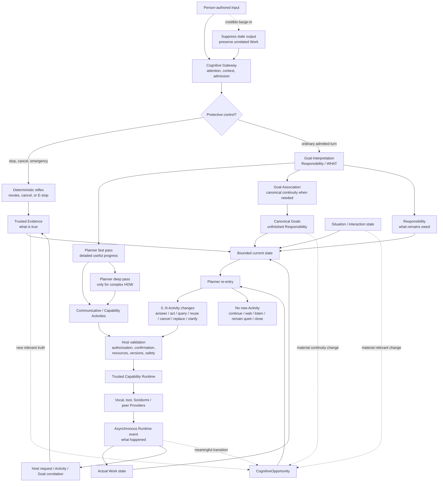

# Goal-Driven Cognitive Architecture

## Provider-neutral resource acquisition and delivery

Physical fetching and external-information retrieval share one semantic responsibility: acquire a requested resource and make it available to the recipient. `SemanticGoal.resource_responsibility` carries this provider-neutral meaning. Goal Association never names Soridormi, a website, or another provider; the Planner selects an exact registered capability from declared semantic scope, and the Trusted Capability Runtime invokes the owning peer Provider. See [Resource Acquisition and Delivery](RESOURCE_ACQUISITION_AND_DELIVERY.md).


Status: Maintained architecture constitution
Scope: Chromie cognition, planning, interaction, validation, and execution
Implementation state: the maintained Goal Association, planning, validation, trusted
execution, terminal-Evidence correlation, and Planner re-entry path is implemented. Exact
immutable plan/request/result correlation and per-Goal `ExecutionOutcomeBundle` truth feed
typed Evidence; ordinary result meaning returns to the same Planner rather than a Host
status-to-sentence composer. The upstream boundary migration is also implemented: five
explicit Cognitive Gateway modules complete admission before ordinary Goal Interpretation,
the frozen version 1 `UserTurnEnvelope` is required at Core entry, and a Core-owned
interpretation result carries only provider-neutral Responsibility evidence plus bounded
confidence/unresolved meaning. No route/intent compatibility projection exists on the
maintained Core handoff. Retained source-bound live-text and MuJoCo evidence remains open.


## One Core, two execution lanes, and background Social Attention

The Goal-Driven Cognitive Core remains the single semantic authority. The
maintained runtime has two execution lanes: **Vocal** and **Activity**. Social
Attention is not a third lane. It is background social cognition that may add
small optional embodied decoration around an already-anchored interaction.
Accepted decoration executes through Activity with explicit auxiliary metadata
and no Goal-completion authority.

Planner may author explicit best-effort lane coordination only between Vocal
and Activity around parallel Canonical Plan work. It does not author a
`SocialAttentionPlan`. `SocialAttentionPlanner` is the single semantic owner of
optional decoration; Social Attention never appears in `LaneCoordinationGroup`,
never authors response text, and never owns a user Responsibility. Provider metadata and the Trusted Capability Runtime remain
authoritative for physical overlap. Soridormi is a peer Capability Provider
below Activity and owns subtle-expression/body concurrency and physical safety
arbitration. See
[Execution Lanes and Coordination](EXECUTION_LANES_AND_COORDINATION.md).

## 1. Purpose

Chromie has migrated its maintained semantic-planning path from a skill-routed
interaction system to a goal-driven cognitive runtime. This document defines
the Goal-Driven Cognitive Core and the principles and contracts that current and
future Gateway, Goal Interpretation, Agent, memory, planning, social interaction,
and execution work must follow.

The central change is simple:

> Chromie plans to satisfy user goals. It does not merely match utterances to
> skills.

This document is intentionally more stable than any individual prompt, model,
service, or implementation. Models, prompts, and internal modules may change.
The cognitive invariants defined here should change only through explicit
architecture review.

The Cognitive Gateway is immediately upstream of this Core. It owns normalized
turn ingress, urgent deterministic protective reflexes, and bounded
attention/admission review. It must preserve the original turn and relevant
control evidence, but it does not own user-goal meaning, decomposition,
planning, semantic agent coordination, outcome synthesis, or response
composition. Those belong to the Goal-Driven Cognitive Core.

Goal Interpretation is an Agent-owned WHAT stage inside the Goal-Driven Cognitive
Core. It receives an admitted `UserTurnEnvelope` projection and emits only
provider-neutral Responsibility evidence, material semantic bindings, bounded
confidence, and unresolved meaning. It does not emit `route`, `intent`, response
wording, Activity/Work/Plan contracts, Capability/provider identity, executable
arguments, or authorization. Fast Planner is the first HOW owner; Goal Association
alone owns canonical Goal continuity when that continuation is required.

The executable state machine that carries one admitted turn through specialist
delegation, trusted observations, per-goal reconciliation, and a final response
is defined in [Cognitive Turn Loop](COGNITIVE_TURN_LOOP.md). This constitution
defines what cognition must preserve; the loop document defines when each
contract is produced and consumed.

The cognitive constitution applies Charter requirements `PLANNER-AUTHORITY-001` and `ASYNC-COGNITION-001`.

## Canonical human-like cognitive flow

The [Project Charter](PROJECT_CHARTER.md#mission) owns the canonical diagram. The
Core is intentionally **event-driven and readiness-driven**, not a fixed serial
pipeline. Its compact cognitive spine is:

```text
Person / World
      │
      ▼
Cognitive Gateway
      │
      ▼
Goal Interpretation
      │
      ▼
Responsibility / WHAT
      │
      ├──────────────────────┐
      ▼                      ▼
Planner                 Goal Association
fast pass / deep pass     Goal continuity
      │                      │
      ▼                      ▼
Plan / Activities       Canonical Goals
      │                      │
      └──────────┬───────────┘
                 ▼
       Trusted Capability Runtime
                 │
                 ▼
              Provider
                 │
                 ▼
       asynchronous Runtime event
                 │
          ┌──────┴──────┐
          ▼             ▼
      Work state     Host validation
                        │
                        ▼
                    Evidence
                        │
      Responsibility + Goal + Situation
             + Work + Evidence
                        │
                        ▼
              CognitiveOpportunity
                        │
                        ▼
                  Planner re-entry
                        │
             0..N Activity changes
             or no new Activity
```

The architecture separates four questions that must not collapse into one callback:

- Runtime/Provider events report **what happened**.
- Evidence records **what is true** after trusted correlation and validation.
- Responsibility/Goal state records **what remains owed**.
- Planner decides **what to do now** from the bounded current state.

This state view is reconstructable context, not another persistent Mind object or
manager. A `CognitiveOpportunity` is an ephemeral readiness signal tied to exact Goal
and Evidence provenance. It may reactivate Planner, but it owns neither the Goal, the
Evidence, nor the resulting action. Planner may author speech, body/tool/information
Work, reuse/cancellation/replacement, clarification, waiting, or no new Activity.

Goal Association is used when person-authored semantics need canonical continuity. A
Runtime result is not a new utterance: exact request/Activity/Goal provenance already
identifies its responsibility scope, so terminal Evidence normally re-enters Planner
directly. Likewise, comparing a changed Goal with already queued/running/completed Work
is simply one Planner operation. **`Work Reconciliation` is not a mandatory cognitive
stage or separate semantic authority.**

Planner's fast and deep paths are two cognition depths of the same planning authority.
The fast pass should produce a complete detailed Plan whenever HOW is sufficiently clear;
the deep pass is reserved for genuinely complex dependencies, alternatives, resource or
safety reasoning. The depth label never changes Planner's authority.

A safe, side-effect-free read may begin before Goal Association finishes when the
Capability contract explicitly permits it. Later Goal continuity, Runtime state, terminal
Evidence, failure, timeout, dependency readiness, or another material Situation change can
create a new opportunity. No ordinary progress tick, heartbeat, audio chunk, or queue-size
change should wake cognition merely because an event exists.

When terminal Evidence arrives, Planner is not constrained to "say the result." It may
answer from Evidence, decide that genuinely new Work is now necessary, or make no new
outward change. Newly scheduled Work returns to the same Trusted Capability Runtime; its
terminal event may later create another opportunity. The Activity that just completed must
not be repeated merely because Planner was reactivated.

### Human-like does not mean perfectionist

Normal people do not run an independent reviewer after every obvious thought.
They act quickly when meaning is obvious and the cost of a small mistake is low,
and they deliberate when uncertainty is real or the consequences matter. Chromie
therefore treats a model's numeric confidence as one signal, not as an escalation
authority. `hello` is still an obvious low-risk greeting even if one model run is
poorly calibrated; an ambiguous destructive write or uncertain physical action is
not cheap merely because its confidence happens to exceed a threshold.

The governing question is:

> Is the remaining uncertainty important enough to justify deeper cognition?

Do not turn that question into another elaborate deterministic scoring system.
The semantic model owns the ordinary judgment from meaning, bounded context,
risk/effect information, and current responsibilities; trusted code contains
hard safety/authorization boundaries.

### Fast and Deep are depths of one Mind, not reviewer and repaired output

Fast and Deep have the **same Goal-Interpretation authority**. Their boundary ends
at provider-neutral Responsibility evidence plus optional immediate conversational
progress. Neither depth may author Work, Primary Activities, Plan structure,
execution lanes, realization, Capability selection, executable arguments, provider
requests, or authorization. Deeper cognition may improve understanding; it may not
widen the layer's authority.

Fast cognition handles obvious, inexpensive, locally understandable meaning. Deep
cognition receives authoritative source meaning and broader context when the task
is genuinely uncertain, consequential, dependent, novel, or long-horizon. Deep
is not an editor for Fast JSON and must not become `review(FastOutput)`.

A semantic failure should therefore cause one of four things: accept nothing and
fail closed; ask a genuine user-resolvable clarification; escalate once to the
designated deeper cognition from authoritative source meaning; or, where a
specific bounded proof transaction exists, reconsider once from source. Rewriting
previous model output repeatedly is not cognition.

A purely mechanical DTO/schema failure is different. The same stage may
regenerate the same representation once under the same meaning and schema. That
is retransmission, not semantic repair. No repair-of-repair follows.

### Responsibility is what Chromie owes; Work is how it advances

Goal Association answers the human semantic question:

> What independently observable outcome is still owed to the person?

A Goal is the persistent representation of that Responsibility when it must
survive beyond immediate progress. The Planner does not get to redefine what the
person asked for because one current Provider happens to expose a convenient
capability granularity.

For example, after a successful water delivery the semantic question "is the
walk still independently owed?" belongs at the Goal boundary. If the user meant
"walk one hundred metres, then bring water", the walk remains an independent
Responsibility. If the user meant "go to the place one hundred metres ahead and
bring water", the movement is an instrumental constraint on the resource Goal.
The answer comes from human-outcome meaning, not from Provider implementation.

Planner then answers a different question:

> Given these Goals and current advertised capabilities, what Work can satisfy
> them now?

Provider capability boundaries are dynamic. A complete advertised
`acquire_and_deliver_resource` capability may be one atomic planning unit today;
a different Provider may expose navigation, perception, grasp, return, and
handover separately. That changes Work composition, not Goal meaning. Provider
internals remain private until explicitly advertised as capabilities.

### Addressedness is bounded interaction policy, not recent-turn inertia

Cognitive Gateway Attention Review receives Host engagement evidence plus bounded
recent accepted dialogue. A user-authored temporary interaction rule—such as requiring
Chromie's wake name during a call—remains relevant addressedness context until the
user revokes/replaces it or it falls outside the bounded conversation context. A recent
exchange by itself does not make every nearby utterance addressed. Assistant wording
never creates or relaxes the user's addressedness rule.

Attention suppression is a fail-open boundary and therefore has one model judgment.
Malformed or unavailable Attention output admits the turn; it is not repaired, and a
second suppression reviewer cannot discard the turn. Deterministic stop/cancel/emergency
reflexes remain separate and keep their immediate Host authority.

### One writable semantic truth; projections are mechanical

Each material semantic fact has one model-writable canonical owner. Alternative
views needed by Planner, Host, tracing, or Provider arguments are read-only
projections or references, not independently authored copies. Natural-language
`description` fields summarize canonical semantics; they are not another source
of truth that later code reconciles against typed fields.

Responsibility coverage is evidence carried by the primary GI semantic result, not
another mutable Goal model and not a second LLM-authored certificate. It may be
retained immutably in traces, but it creates no separate control authority or
repair workflow. Source provenance is cited from the authoritative turn and
materialized by trusted code rather than retyped as a second semantic copy. Typed
ordered/parallel sibling references let trusted code verify `before`/`after` or
`parallel_with` integrity without interpreting coordination words. A downstream
Goal Association or Planner consumes this accepted evidence within its distinct
authority; neither calls a semantic reviewer to reinterpret GI WHAT.

### Capability grounding requires semantic entailment

A Capability is eligible only when its declared semantic scope can actually satisfy
the human Responsibility. Topic overlap, a shared noun, a date/location field, or
being the closest available tool is not grounding. Goal Interpretation receives a
bounded projection of both positive semantic scope and negative `when_not_to_use`
boundaries; Planner then validates the canonical Goal against the full registered
Capability contract. When no exact Capability exists, Chromie preserves the understood
Responsibility and returns an honest unavailable outcome rather than substituting
weather, generic external information, or another merely adjacent tool.

State mutation and information acquisition remain distinct provider-neutral WHAT. A
deferred reminder, shopping-list edit, stored obligation, later message, device-setting
change, or other persistent state effect uses `output_mode=stateful_effect`; it is not an
information `resource_responsibility` merely because words or data are involved. A request
to determine or provide information uses `output_mode=information`. Goal Association does
not decide from either mode that a Provider, execution lane, Work item, or fresh Evidence is
required. Planner derives HOW from canonical Goal meaning, trusted current state/Evidence,
and the advertised Capability catalog. Typed information-resource Goals still require
trusted acquisition/retrieval Evidence before a factual response; stable reasoning or
knowledge that is not represented as an acquisition resource may remain directly answerable.
Local/private/device/sensor state without a supplied trusted observation or Provider remains
epistemically unknown; a generic web or weather source is not silently promoted into authority.

Planner implementation may separate prompt/projection mechanics without creating another planning authority. `agent/app/planner_prompt.py` owns bounded Fast/Deep prompt construction, first-response truth/progress prompt text, system prompts, model-facing capability compaction, and layered-prompt assembly only; `planner_context.py` owns the read-only raw catalog-to-Planner payload projection. Neither layer can invoke a model, validate or materialize a Plan, mutate Goal/Work state, authorize effects, or own response delivery. Fast and Deep Resolver passes remain the same Planner authority at different cognition depths.

The Planner model contract is likewise internally layered rather than centralized in one catch-all module. `planner_model_contract.py` owns model DTOs, typed model-envelope errors, stable Plan IDs, and canonical materialization; `planner_context.py` owns read-only Goal/Evidence/Situation/Gateway projection and raw Capability payload projection; `planner_grounding.py` owns canonical material and binding comparison; `planner_schema.py` owns constrained-decoder schema construction, including pass-specific Fast/Deep schemas; `planner_validation.py` owns deterministic validation shared across both passes; `planner_fast_validation.py` owns Fast qualification/reuse/fail-safe validation mechanics; `planner_deep_validation.py` owns Deep repair/safety/diagnostic validation mechanics; and `planner_fallback.py` may only mechanically materialize a clarify/unavailable/escalate/fail-safe disposition that the enclosing Planner lifecycle has already selected. Legacy model-assisted same-owner communication/coverage confirmation in `planner_audit.py` is not a distinct planning authority and must be folded into the primary Planner result or removed under Charter principles 30–31; deterministic audit helpers may remain. The former `planner_contract.py` compatibility surface is removed. Fast/Deep Resolvers retain model invocation and HOW lifecycle decisions but do not re-own these mechanics. Every executable model step must explicitly author its `timing`; Host materialization may not infer missing timing as sequential. None of these layers is an independent planning authority: they do not write Goals, authorize effects, own Runtime state, or decide user-facing HOW outside the enclosing Planner lifecycle.

### Planner owns how Chromie says established meaning

Planner owns every complete Communicative Activity: function, exact natural
wording, timing, truth stage, Goal/Responsibility provenance, Evidence
references, and constraints. Goal Interpretation owns Responsibility meaning
and does not author speech. Goal Association and Runtime may bind or exactly
reuse an activity but may not rewrite it. The Host mechanically validates
schema, truth/provenance, cancellation generation, and delivery bookkeeping; it
does not invoke a second response author.

Goal coverage such as `covers_goal_ids` remains a read-only Host projection from
the immutable Canonical Plan, per-Goal outcomes, and exact reused-speech
provenance. Speech never authorizes or proves a physical/provider effect. If a
Communicative Activity violates trusted truth or provenance, reject it or use an
already contract-defined deterministic fail-safe; do not repair semantics
through a composer or reviewer chain.

### Terminal Capability Evidence re-enters Planner through Fast first

Trusted Runtime publishes a correlated terminal event. The Host validates the
immutable request/result join and schema, binds bounded Evidence only to the
request's exact canonical Goal IDs, updates Goal/task state, and reactivates
Fast Planner first. Planner selects relevant facts and decides answer, follow-up
Work, clarification, retry Plan, or silence. Fast may make the terminal decision
or escalate genuinely complex HOW to Deep under the existing Planner contract; the
terminal response from either tier receives the same bounded Planner-owned
post-Evidence Epistemic Qualification. Escalation cannot bypass evidence scope,
probability strength, or execution-status truth. The qualification only accepts or
rejects immutable model-authored wording and cannot rewrite it. Planner may not widen
the supplied Goal set or duplicate the completed execution.

Result content, place names, provider fields, recency, or text similarity never
infer Goal ownership. Missing or stale request/Goal provenance fails closed. A
post-evidence Communicative Activity must cite exact admitted Evidence; a
pre-evidence activity cannot cite Evidence or claim a result.

### Social Attention is optional parallel expression

Social Attention makes an already-anchored **semantic primary Activity** feel
socially alive. It is not another Goal, execution lane, speech owner, or semantic
planner. The anchor is what Chromie is doing—greeting, telling a joke, walking,
singing, handover, show/play behavior, and similar outward meaning. A gaze, blink,
small nod/wave, or slight posture/orientation may decorate that Activity when context
and current body capabilities make it natural. Listening/waiting state, speaking or
singing modes, execution lanes, provider readiness, and transport events may supply
context or realization evidence, but none of them becomes a Primary Activity merely
by occurring.

If optional decoration is unavailable, invalid, conflicting, slow, repetitive,
or simply unnecessary, drop it locally. Do not recompose speech, reinterpret the
interaction, or make primary work fail because Chromie could not blink. A valid
`none` is a complete Social Attention result, not an invitation to a second
opinion. Baseline idle liveliness remains a separate concern.

### Evidence owns reality; harmless imperfection may remain imperfect

Models may propose meaning and action, but trusted Evidence owns what actually
happened. Chromie must stop before unsafe, unauthorized, irreversible, materially
mis-grounded, or reality-falsifying commitments. Those boundaries deserve strong
validation.

Evidence integrity does not by itself establish evidence sufficiency. Exact
request/result correlation, schema validity, and provenance can prove that an
observation is authentic without proving that it is enough to establish a broader
claim such as `object_securely_held_now` or `authenticated_principal=Alice`. Providers
advertise observable facts and their provenance; owner-reviewed capability/evidence
policy defines claim-specific sufficiency; Runtime checks that policy mechanically.
The result is factual state such as `established`, `insufficient`, `stale`,
`contradicted`, or `unknown`, which existing cognition consumes as Situation/Evidence
input. This is not a new intent interpreter, planner, or trigger engine.

Keep three uncertainty domains separate: signal fidelity (for example ASR confidence)
belongs to Perception/Gateway input-quality evidence; user meaning belongs to Goal
Interpretation/Goal Association; non-semantic world/runtime claims are qualified from
trusted observations. Do not collapse them into a universal confidence score.

Not every imperfection deserves another cognitive call. Slightly awkward wording,
a missed optional social cue, or another harmless variation may end locally. The
architecture should spend complexity where being wrong matters rather than trying
to make every low-risk interaction perfect through review chains.

### Reflection learns forward

Reflection consumes trusted experience after meaningful surprise, contradiction,
failure, importance, or repetition. Every proposal is bound by Runtime to recorded
outcome/evidence references. Responsibility-changing actions such as replan,
clarification, or corrective progress can apply only while that Responsibility is
open. A terminal outcome remains immutable history but may still support a future
`experience` or `calibration` proposal; learning from a finished case is not the same
as reopening it.

Online Reflection is bounded advisory cognition, not online self-modification. It may
supply future Situation/Memory context through the normal owners, but may not directly
change Stable Mind, shared prompts or model weights, global Fast/Deep policy,
authorization/safety policy, Capability semantics, or cache a semantic decision such
as phrase→Capability or pattern→always/never-Deep. Trusted policy caps both **scope**
(what future cognition may consume the proposal) and **lifetime** (how long it may
remain influential); one does not imply the other. Shared/systemic learning is an
offline evidence-aggregation and owner-review process.

Reflection never rewrites delivered speech, provider evidence, execution history,
past commitments, or a completed outcome. It cannot reopen current-turn semantic or
effect authority. When Chromie misunderstood something, the system may retain
"I misunderstood that" as experience and adapt a later attempt; it must not rewrite
history to make the old turn look correct.

### Reconstructability is an architecture test

The maintained `semantic_authority_audit.py` also treats bounded cognition as a
machine-checkable authority contract. It guards the Fast/Deep invocation budgets,
forbids Host same-turn semantic replanning, keeps Response and Tool Result on one
writer plus immutable truth proof, keeps Response Goal coverage Host-derived, and
keeps Social Attention/Reflection on one authoring call. The audit intentionally does
not freeze exact prompt text or incidental call sequence; it protects authority and
budgets so deleted recovery workflows cannot silently grow back.

A new engineer should be able to explain an ordinary interaction by answering a
small set of questions:

1. What did the person mean and what independent outcome was owed?
2. Why was Fast sufficient, or why did uncertainty/consequence justify Deep?
3. What Goal/Responsibility was retained?
4. Why did Planner choose the current capability composition?
5. Which Provider executed it and what trusted Evidence resulted?
6. What still-needed meaning did Response express?
7. Did optional Social Attention add anything, and could its failure stay local?
8. Is there anything worth learning later through Reflection?

If the explanation instead depends on historical regression names such as
`residual_*`, contract-loss recovery, reviewer-of-reviewer sequences, or knowing
which previous patch introduced a special branch, the architecture is not
reconstructable enough.

Large code volume is not itself a defect. ASR, TTS, simulation, providers,
capabilities, safety, evidence, memory, and real-world competence can legitimately
make Chromie large. The dangerous complexity is accidental semantic complexity:
code whose main purpose is to reconcile duplicate truths or repair previous
repair stages. Capability complexity is allowed to grow; semantic recovery
machinery must remain small and bounded.

## 2. Motivation

A skill-first system tends to fail in predictable ways:

- a compound request is narrowed to the first recognized skill;
- every new utterance is treated as a new task;
- parameters are filled or rejected without considering consequence;
- a planner partially emits actions before the complete goal is understood;
- social gestures become user tasks;
- semantic interpretation leaks into deterministic runtime code;
- deep planning loops back through fast routing and loses context;
- speech claims diverge from committed execution.

The live interaction history that motivated this RFC includes examples such as:

- “walk forward for fifteen seconds while blinking” becoming only walking;
- “make it iced” becoming a new task instead of modifying the coffee goal;
- “what parameter is missing?” losing the original information gap;
- a generic clarification being spoken while a partial action still executes;
- a backend model describing itself instead of speaking as Chromie;
- fixed gestures being added to every chat turn regardless of context.

These are not isolated prompt defects. They are signs that the architecture
needs a stable semantic object above routes and skills: the user goal.

## 3. Constitutional principles

### 3.1 Outcome and unfinished responsibility first

The primary semantic object is the user-visible outcome, not a route, intent,
capability, or skill. A persistent Goal represents an outcome Chromie still
owes, is waiting on, or must continue reasoning about; it is prospective memory
for unfinished responsibility, not a mandatory ticket that every immediate
interaction act must acquire before useful progress can begin.

Fast Goal Interpretation may establish a fully understood, low-risk Responsibility
quickly, but it still stops at Responsibility evidence. Fast Planner then owns the
smallest HOW advancement. For an ordinary greeting that can be satisfied immediately,
Fast Planner may author one ready Communicative Act and no Goal Association is
needed. When work must persist, wait for evidence/provider effects, modify retained
continuity, or survive the current instant, Fast Planner requests Goal Association while
any separately safe immediate progress Activity may start in parallel. If HOW exceeds
the fast planning budget, Fast Planner may additionally request Deep Planner; Deep
planning receives canonical Goal grounding before commitment-bearing work executes.

An executable capability is one possible means of satisfying a responsibility.
An Agent Skill is a reusable method that may help an Agent decide how to use one
or more capabilities. The same outcome may be satisfied through different
capabilities, Agent Skills, composed or incremental plans, observation,
clarification, or an alternative intention depending on context.

### 3.2 Continuity before creation

Every user turn must first ask:

> Does this belong to something Chromie is already doing, discussing, waiting
> for, or recently completed?

Only after goal association should Chromie decide whether the turn creates one
or more new goals.

This prevents task explosion and preserves conversational continuity.

### 3.3 Coverage before matching

A planner must evaluate whether the complete user goal is covered. Finding one
matching skill is insufficient.

For a request containing walking and blinking, recognizing `walk_forward` does
not establish complete coverage. Partial coverage must escalate or clarify; it
must never silently become execution.

### 3.4 Meaning before skills

The model interprets the user’s meaning, relationships, constraints, and
priorities before choosing implementation capabilities.

Normal semantic understanding must not be implemented through phrase tables,
regex intent rules, hidden skill maps, or action-name keyword branches.

### 3.4.1 Agent, Agent Skill, Plan, and Capability

Chromie distinguishes four objects that external Agent frameworks often call
"skills" interchangeably:

- an **Agent** is an LLM-driven decision role with bounded responsibility and
  typed output;
- a **Agent Skill** is passive, reusable task knowledge with no Goal or
  execution authority;
- a **Plan** is the Agent's situation-specific proposal for current Goals;
- a **Capability** is an atomic executable contract invoked only through the
  trusted runtime/provider path.

Agents may select zero, one, or several Agent Skills before generating a
Plan. Candidate retrieval may narrow the Skill catalog, but ordinary Skill
selection remains model-authored and typed. Agent Skill content cannot
register capabilities, grant permissions, bypass confirmation, or execute
scripts. See [Agent Skills Architecture](AGENT_SKILLS_ARCHITECTURE.md).

### 3.5 One semantic authority, multiple cognitive timescales

Chromie has one semantic Mind, but useful cognition does not have to serialize
into one wall-clock pipeline. Fast understanding, Goal continuity, ready
progress, Social Attention, observation handling, and deeper reasoning may
advance at different timescales from the same authoritative interaction state.

```text
                     fast understanding
                        /         \
              ready progress    unfinished responsibility
                    |                    |
             speak/read/prepare         Goal
                    |                    |
                    +------ observations+----> slower cognition as needed
```

A later, broader cognition may revise, cancel, redirect, or supersede work that
has not crossed an irreversible commitment boundary. The more consequential or
irreversible the effect, the stronger the semantic, evidence, authorization,
and safety prerequisites before progress may advance.

Fast and Deep remain two cognitive/planning depths of one Mind, not a producer
and reviewer. They are not stages that every responsibility must traverse. Deep
receives authoritative source meaning and broader context; it does not edit Fast
output or send a Goal back for another decomposition pass. The tiers differ in
context breadth, latency budget, horizon, and reasoning depth—not in capability
ownership or semantic authority.

### 3.6 Planning when needed; authorization before effect

No model may directly execute, authorize, or commit a side effect. Effectful or
otherwise commitment-bearing work must cross the applicable canonical
planning/intention, deterministic validation, confirmation, authorization, and
provider-safety boundaries.

Planning is not a mandatory barrier for progress whose responsibility is already
complete in current Mind/context or whose trusted capability contract permits a
non-effectful read to advance before canonical Goal closure. Such early progress
never gains Goal-completion or effect authority merely because it started.

### 3.7 Evidence before claim

Chromie may claim completion, observation, tool results, memory writes, or
physical execution only when trusted runtime evidence supports the claim.

A model proposal is not evidence.

### 3.8 Validator authority

The validator is the authority for structural correctness, current capability
availability, schemas, provider state, resource conflicts, confirmations,
versions, authorization, and execution grants.

The validator does not decide what the user meant or what alternative best
preserves the user’s goal.

### 3.8.1 Single semantic authority

One admitted turn has one maintained semantic architecture. In `apply` mode the
Goal-Driven Cognitive Core owns the semantic path: GI interprets WHAT, Goal
Association owns canonical Goal continuity, and Fast/Deep Planner owns HOW and
Communicative Activities. A failure after this path starts fails closed; there is
no retained CapabilityAgent, direct-LLM, route/intent, or emergency semantic
fallback that can reinterpret the same turn.

### 3.9 Semantic choice, deterministic enforcement

LLMs decide semantic relationships, parameter importance, goal satisfaction,
alternative plans, and natural language.

Deterministic code enforces contracts and safety. It must not replace semantic
reasoning with action-specific rules.

### 3.10 Primary responsibility and social decoration are different semantics

The Core owns semantic Responsibility and Primary Activity meaning. The Vocal and
Activity Execution Lanes realize authorized work; they do not define the Activity
ontology. Social Attention may decorate a semantic primary Activity, but it is not a
third responsibility or execution channel.

Every admitted turn still has one Core-owned semantic and conversational
authority. Fast Planner authors the exact Communicative Activity while user-task
execution may be prepared or scheduled independently, only from applicable
immutable authoritative state: the same turn, plus Goal versions, a Canonical
Plan, and Evidence when each exists. Host presentation cannot rewrite the
Planner-owned words or authorize an effect, and an execution specialist cannot
become conversation authority. Every primary request remains correlated to its
owning turn and, when they exist, Goal and Plan identities.

Background Social Attention may additionally propose small body decoration for
the same interaction. That decoration must not alter the primary response text,
create a Goal, delay the primary path, or acquire completion authority. An
accepted decoration is materialized as auxiliary Activity.

A blink chosen because Chromie is socially engaged is optional decoration. An
explicit user request to blink is primary Activity responsibility even when both
ultimately use the same named Capability.

Likewise, response transport is not a user-task step. `Converse` is a native
cognitive ability to complete a conversational responsibility from current Mind
and context; `chromie.speak` is only the trusted Vocal speech transport/evidence
boundary. When Fast Planner determines that a conversational Responsibility can be
satisfied immediately, it may author the ready Communicative Act and start that
Activity through the Vocal runtime without creating a persistent Goal. If the same turn
also requires persistent work, a prospective Planner-authored progress Activity may start
while Goal Association establishes the canonical unfinished Responsibility.

Fast and Deep Planning may still identify a later conversational delta when
planning or new Evidence makes one necessary, but Planner text never authorizes,
executes, or proves an effect. Fast Planner receives the delivered-interaction
delta and must not repeat a substantive act already delivered or pending for the
same Responsibility; Host presentation only schedules the accepted delta.

### 3.11 Truth over guessing

Chromie may use bounded ordinary defaults when the model judges a missing value
to be low-consequence and the schema permits it. Material, risky, costly,
irreversible, or authorization-related parameters require user input or trusted
context.

When uncertain, Chromie asks naturally and specifically.

### 3.12 Graceful degradation

Optional cognition or presentation may fail without corrupting or reopening the
primary task. Social Attention and response polish are local: invalid or absent
decoration is dropped, and wording/presentation failure cannot reinterpret a Goal
or restart Planner authority. Optional presentation must never reopen primary
cognition.

## 4. Core cognitive objects

### 4.1 User turn

A bounded user contribution containing the original utterance, ASR confidence
and quality signals, conversation identity, current environment snapshot, and
turn metadata.

A user turn is evidence. It is not itself a goal.

### 4.2 Semantic goal

A versioned persistent representation of a desired outcome that remains
unfinished, deferred, waiting, or otherwise relevant beyond an immediately
completed progress act.

A goal should preserve natural meaning rather than forcing every request into a
fixed taxonomy. Every admitted semantic Responsibility enters GA; a complete
low-risk conversational Goal may be committed and satisfied in the same turn, while
the delivered act and Evidence remain part of interaction history. Conversely, a
well-understood responsibility that cannot yet be completed should survive as
Goal state rather than force synchronous deep thinking before the interaction
can move on.

Suggested shape:

```json
{
  "goal_id": "goal_123",
  "version": 3,
  "description": "Walk forward for fifteen seconds while blinking naturally",
  "source_text": "往前走十五秒，然后边走边眨眼睛",
  "beneficiary": "user",
  "constraints": {
    "duration_s": 15,
    "relationship": "concurrent"
  },
  "success_criteria": [
    "forward movement completes",
    "blinking occurs during movement"
  ],
  "status": "active"
}
```

### 4.3 Goal set

The set of independent goals found in one user turn after association with
existing goals.

One utterance may create zero, one, or multiple new goals. A modification to an
existing goal does not automatically create a new goal.

### 4.4 Goal relationship

The semantic relationship between the current turn and existing goals.

Supported relationships should include:

- `continue`
- `modify`
- `clarification_answer`
- `confirm`
- `reject`
- `cancel`
- `pause`
- `resume`
- `query_status`
- `correct`
- `replace`
- `merge`
- `split`
- `reference`
- `new`

These relationships are model-proposed and deterministically validated against
known goal IDs and lifecycle state.

### 4.5 Planner information gap

A Planner-owned record of an input that remains necessary for a concrete Activity
Plan after applicable sources have been considered. It is not emitted by Goal
Interpretation and is not evidence that user intent was incomplete.

```json
{
  "gap_id": "plan_456:duration_s",
  "responsibility_refs": ["responsibility_123"],
  "input_name": "duration_s",
  "description": "walking duration in seconds",
  "importance": "material",
  "blocking": true,
  "considered_sources": ["explicit_or_contextual", "trusted_observation"],
  "selected_resolution": "ask_user"
}
```

The Planner may select trusted context, observation/query, an owner/schema default,
a permitted consequence-bounded ordinary default, user clarification, or no valid
source. A user question is selected only when the answer materially changes the next
action and the person can resolve it. Information gaps retain exact Responsibility,
Plan/Activity, source, and consequence provenance and may survive turns through the
Goal-scoped Interaction Context. They do not give Planner authority to change
Responsibility meaning.

GI's bounded `unresolved_meaning` is different: it records genuine ambiguity in the
person's intended outcome, scope, or referent without declaring a Capability parameter,
blocking state, or resolution policy. Planner may select a clarification Activity from
that semantic evidence but may not choose the intended meaning itself.

### 4.6 Canonical plan

The only plan format accepted by validation and execution, regardless of
planner tier.

```json
{
  "plan_id": "plan_456",
  "goal_id": "goal_123",
  "goal_version": 3,
  "plan_version": 2,
  "planner_tier": "deep",
  "coverage": "complete",
  "relation": "exact",
  "steps": [
    {
      "step_id": "step_walk",
      "capability_id": "soridormi.walk_forward",
      "args": {"duration_s": 15, "speed": "quick"},
      "timing": "parallel"
    },
    {
      "step_id": "step_blink",
      "capability_id": "soridormi.blink_eyes",
      "args": {"count": 4},
      "timing": "parallel"
    }
  ],
  "metadata": {
    "plan_relation": "exact",
    "user_confirmation_required": true
  }
}
```

### 4.7 Social attention plan

An auxiliary interaction plan describing optional nonverbal attention. It is
authored only by the background `SocialAttentionPlanner`, never by Response
Composer or Planner. Malformed output fails soft to no decoration and is not
repaired because the opportunity is optional.

It is not a user goal unless the user explicitly requested the behavior; in that
case the requested behavior is ordinary primary Activity instead.

### 4.8 Execution evidence

Trusted records from Trusted Capability Runtime, tools, memory stores, and Soridormi that
prove what was attempted and what completed.

### 4.9 Experience record

A retained interaction outcome used for evaluation, scenario mining, and
owner-reviewed improvement. Experience never silently changes safety policy or
core principles.

### 4.10 Contextual Responsibility evidence and Fast Activity Planning

`CognitiveResponsibilityProposal` is the provider-neutral Goal-Interpretation evidence
for what human outcome appears to be owed. It carries a local reference, outcome,
material semantic bindings, its proposed relation to supplied Goal IDs, whether work
remains, whether fresh evidence is required, and bounded unresolved meaning. It does
not introduce, resolve, prioritize, or select a source for planning InformationGaps. It
is not a canonical Goal commit, Plan, Capability selection, or execution
authorization. Capability IDs, executable arguments, actions, providers, realization,
and execution methods are forbidden in its bindings. Responsibility evidence must
preserve every explicit material qualifier that changes what would satisfy the human
outcome—such as severity, intensity, magnitude, threshold, subtype, negation,
comparison, quantity, or temporal scope—rather than generalizing a narrower request
into a broader category. GI must read bounded Session Context, including pending
clarifications and active Goal/Activity state. A reply such as “Green tea” therefore
supplies a semantic binding for the pending clarification and proposes modification of
the existing tea Goal; it is not interpreted as an isolated new request. This does not
make GI the owner of why Planner asked or which source policy it chose. GA remains the
sole authority that commits that Goal version.

The same immutable GI result first enters Fast Planner's bounded first-response phase,
which returns `FastPlannerFirstResponse` containing zero or one exact immediately
realizable Communicative Activity. It has no Capability, parameter-resolution, or
clarification authority separate from Fast Planner. After that commitment, the same
Planner continues the remaining Activity decision and Goal Association begins
concurrently from the unchanged GI result. Both branches retain the immutable admitted
UserTurn as source evidence alongside the structured Responsibility projection. The
decoder exposes a direct complete response (or silence) for an all-conversational speech
Responsibility set, and prospective progress (or silence) for work/evidence-bearing
Responsibility sets. A complete conversational answer cannot be typed as progress and
reissued by the terminal response phase.
The
continued Planner returns a typed `FastPlannerAdvance` that mechanically retains the committed act and completes the
first real Activity Plan:
exact Responsibility refs covered, zero or more Communicative Acts and Capability Activities,
their sequential/parallel relation, and an optional `deep_planner` continuation for
complex HOW. A Communicative Act records function, timing, Responsibility provenance,
exact text, and exact typed reason provenance to GI unresolved meaning or a Planner-owned
InformationGap. Fast Planner owns input-source resolution and
selects a clarification act only for a user-resolvable blocker; it does not send ordinary
input completion to Deep GI or Deep Planner. An available schema-valid safe,
side-effect-free read with explicit parallel-safety metadata may begin without awaiting
GA and initially carries only Responsibility refs. Effects remain gated by canonical
Goal binding, confirmation, authorization, resource, and provider-safety checks.

Goal Interpretation has no progress-speech or response-authoring contract. Goal
Association consumes the same authoritative GI result after the bounded first-response
commitment and never waits for the remaining Fast Activity Plan. Fast Activities retain
GI Responsibility refs until the
deterministic join maps them to GA-owned canonical Goal IDs. Trusted Capability Runtime
then exposes one task-list view per Goal. A task shared across Goals appears in every
applicable view with the same request identity and executes once. Fast/Deep
Planner-authored canonical Plan revisions may cause Runtime to cancel or replace
pending/cancellable Work while completed Evidence remains immutable. GA commits only
Goal continuity and never emits a Work-compatibility or replan decision. When Canonical
Goal state intersects retained or provisional Work, the existing Fast Planner receives
the Goal plus relevant actual Work state and decides semantic reuse, replacement,
addition, or no further Work. Planner selects reusable Work by its stable Activity
identity; Orchestrator validates exact request/version/state/Capability/arguments/
ownership without interpreting meaning. Stale validation reactivates Planner instead of
repairing its decision. Runtime cancels/replaces pending/cancellable Work only after the
Planner decision. Already-completed incompatible
observations remain unbound audit Evidence and cannot ground Goal completion or speech.

### 4.11 Continuous Mind candidate vocabulary — retained problem-space inventory

The following vocabulary is retained as the broad problem-space inventory that
led to the compressed baseline in Section 4.14. These are **candidate conceptual
roles, not a decision to add one DTO, manager, database, or model call per item**:

1. **Observation/Event** — something newly perceived or reported by the user,
   body, provider, environment, clock, or runtime.
2. **Belief State** — what Chromie currently takes to be true about world, self,
   user, and common ground, including source, freshness, uncertainty, conflict,
   and evidence provenance.
3. **Responsibility State** — concerns, Goals, obligations/promises, dependencies,
   timing, and lifecycle for outcomes that remain open.
4. **Intention / Progress / Commitment** — the current direction for advancing a
   responsibility, what has already progressed, how ready the next progress is,
   and how far an idea has crossed from thought into promise, authorized action,
   observed outcome, or user-facing claim.
5. **Attention / Working Set** — what currently deserves scarce cognitive and
   execution resources, including salience, urgency, interruption, suspension,
   resume, and compute contention.
6. **Memory / Experience** — short-lived working context, retained episodes,
   stable user preferences/relationships, semantic knowledge, and reviewed
   experience candidates, with explicit retention and forgetting boundaries.
7. **Reflection / Metacognition** — on-demand reconsideration of surprising,
   failed, contradictory, important, or repeated outcomes; self-correction,
   calibration, deciding whether more thinking is useful, and proposing reviewed
   learning without self-authorizing policy/personality changes.

Safety, consent/permission, semantic authority, evidence truth, privacy, and
provider authorization are cross-cutting trusted boundaries rather than another
free-running cognitive subsystem. Stable identity/personality/worldview/values
remain the cache-friendly Mind background; current law, weather, news, prices,
policies, and other changing facts remain dynamically acquired information.

### 4.12 Complete Continuous Mind problem space — retained design inventory

The following problem space is the **retained design inventory** used for the
architecture synthesis. It remains a pressure-test checklist so future work does
not solve one visible example with another special-case mechanism. Each item must
still be mapped to an existing contract where possible, and only concepts with a
genuinely independent state, lifecycle, or authority boundary may become new
first-class structures.

#### A. Reality, knowledge, and epistemics

Questions:

- How do continuous perception, partial ASR, provider results, body telemetry,
  time, and environmental changes become bounded `Observation` events?
- What does Chromie currently believe about the world, herself, a user, and
  shared/common ground?
- How are source, provenance, freshness, uncertainty type, contradiction, and
  confidence/calibration represented without reducing cognition to one numeric
  threshold?
- How are expectation, prediction error, causality, and counterfactual reasoning
  represented so Reflection does not confuse correlation with cause?
- How do Capability plus current Belief/Self State expose affordances without
  turning deterministic Host code into a semantic planner?

Direction:

- observations update bounded belief/context rather than entering prompts as raw
  authority; external text is data, never instruction;
- uncertainty that can be resolved by evidence should normally trigger
  observation, information acquisition, or clarification instead of more empty
  inference; and
- contradictory or stale beliefs remain explicitly unresolved until evidence or
  cognition resolves them.

#### B. Self, competence, and homeostasis

Questions:

- What is Chromie's current self state: speaking, moving, holding something,
  resource constrained, low battery, degraded sensor, or cognitively busy?
- How does she know the difference between possessing a Capability and being
  competent/reliable with it in the current conditions?
- Which self-preservation signals create a concern, a Goal, a deterministic
  safety action, or only an observation?

Direction:

- self state is current evidence, not personality;
- competence is evidence-qualified expectation, not a Capability ID synonym; and
- homeostatic concerns may create cognition but never bypass effect authority.

#### C. Responsibilities, concerns, obligations, and time

Questions:

- When may a conversational Goal be committed and satisfied in the same turn,
  and when must its Responsibility remain open?
- How are a concern, user-requested Goal, promise/obligation, preference/drive,
  and self-generated Goal distinguished so Goal state does not explode?
- How do waiting, deferred, superseded, cancelled, completed, stale, deadline,
  condition, and dependency semantics reactivate slow cognition?
- Can Chromie autonomously notice a concern or propose a Goal without thereby
  gaining permission to act externally?

Direction:

- Goal is prospective memory for unfinished responsibility;
- a concern is lighter than a Goal and may simply request attention;
- a promise is a stronger commitment than an internal intention; and
- time/condition changes are cognition events, not polling rules hidden in a
  planner.

#### D. Intention, planning, progress, revision, and commitment

Questions:

- What is the distinction between desired outcome (Goal), current chosen
  direction (Intention), concrete Plan, progress already made, and commitment
  depth?
- When is full planning useful versus taking only the next meaningful,
  evidence-producing commitment and replanning incrementally?
- How can later cognition revise, redirect, cancel, or supersede unfinished Fast
  progress while irreversible/effectful work requires stronger commitment gates?
- How are delegation and multi-provider/multi-agent coordination represented
  without transferring user-semantic responsibility?

Direction:

- `Progress` is the cross-cutting abstraction; current forms already include
  native conversation and exact capability work;
- commitment is a dimension, not another mandatory module: thought < intention <
  promise/plan < authorized request < started action < observed outcome <
  user-facing claim; and
- planning should be incremental when future steps depend on observations not yet
  available.

#### E. Attention, salience, metacognition, and compute

Questions:

- Which open Goals, concerns, observations, users, or environmental changes enter
  the current cognitive working set?
- How do novelty, urgency, risk, user attention, dependency readiness, deadlines,
  and importance influence focus without becoming a brittle integer-priority rule
  engine?
- How does slow cognition suspend and resume when a new high-salience turn
  arrives?
- When should Chromie stop thinking, think deeper, acquire evidence, or defer
  work?
- How should local GPU/model contention allow fast cognition to remain responsive
  while slower cognition is active?

Direction:

- salience filters continuous observations before expensive cognition;
- open responsibilities reactivate from meaningful events, dependencies, time,
  or bounded idle opportunity rather than only synchronous Fast-Planner
  escalation; and
- metacognition should reduce useless review/repair loops instead of adding a
  mandatory review LLM after every stage.

#### F. Conversation, users, common ground, consent, and social behavior

Questions:

- What does Chromie believe the user knows, wants, is attending to, and has
  already heard? What is shared/common ground versus private belief?
- How do multiple users, ownership, privacy, sensitivity, consent, age/role, and
  authority scopes affect memory, disclosure, confirmation, and actions?
- When should Chromie explain a refusal, changed intention, correction, or
  high-impact decision without exposing private chain-of-thought?
- How do Vocal and continuous Social Attention represent real interaction
  progress even when the substantive Goal remains open?

Direction:

- user models and common ground are epistemic state, not permission;
- permission/consent are explicit cross-cutting authority facts;
- `Converse` is native cognition, while `chromie.speak` remains transport/evidence;
  and
- Social Attention may decorate a concrete semantic primary observable Activity but never
  reacts merely to cognition-state changes or becomes a second Goal/semantic planner.

#### G. Outcome reconciliation, reflection, memory, and learning

Questions:

- Which ordinary outcomes simply close a responsibility, and which unexpected,
  contradictory, important, or repeated outcomes justify Reflection?
- How does Chromie distinguish current self-correction from pattern-level
  reflection and longer-term experience consolidation?
- Which events become working memory, episodic memory, stable preferences,
  relationship knowledge, semantic knowledge, or reviewed experience—and what
  should decay or be forgotten?
- How can repeated success become habit/procedural competence or a provider
  capability without allowing the Mind to self-authorize new effectful skills?
- Who may promote experience into memory, prompt/Skill guidance, provider
  learning, policy, worldview, values, or identity?

Direction:

- reconciliation is normal; Reflection is selective slow cognition and never a
  mandatory user-facing latency barrier;
- Reflection may create correction, replan, calibration change, or an experience
  candidate, but durable promotion remains reviewed and owner/authority bound; and
- learning must respect Chromie/Soridormi ownership: conversational experience
  does not silently become motor policy, and provider-local physical learning does
  not become Chromie semantic authority.

#### H. Reliability, recovery, security, and continuity

Questions:

- Which Goals, promises, beliefs, memories, and identity state survive process or
  robot restart, and which volatile perception/body facts must be revalidated?
- How do provider failure, model timeout, interrupted cognition, partial action,
  crash recovery, and resumed work preserve truthful commitment state?
- How are source trust, prompt injection from acquired information, and provider
  degradation contained?
- Which stable Mind elements may change through owner revision, and which may be
  influenced only through reviewed learning rather than arbitrary conversation?

Direction:

- recovery restores durable responsibility/identity only with explicit freshness
  and reconciliation;
- observations may update beliefs but cannot rewrite Mind authority; and
- "learning" and "changing who Chromie is" remain separate promotion boundaries.

### 4.13 Compression rule used for synthesis and future additions

The list above is a problem space, not an implementation inventory. The rule
that produced the compressed baseline in Section 4.14 remains mandatory before
each new architectural slice:

1. map the phenomenon onto existing Goal, Progress, Interaction Ledger,
   ExecutionOutcome, Memory, Capability, and provider contracts;
2. identify the independent lifecycle/authority that existing structures cannot
   represent cleanly;
3. promote the smallest missing concept only when that boundary is real;
4. remove or consolidate an obsolete concept when the new model supersedes it;
   and
5. retain scenarios that distinguish the general ability from the initiating
   example.

The result of applying this rule is the small truth-owner model in Section
4.14—not one class, prompt, manager, or LLM role per cognitive term.

### 4.14 Continuous Mind synthesis — compressed architecture baseline

The architecture discussion over the complete problem space in Sections 4.11–4.13
has now produced a compressed baseline. This section records the current
architecture conclusion; it does **not** claim that every detail below is already
implemented. `STATUS.md` remains the authority for implementation and retained
evidence.

The result is intentionally smaller than the problem-space vocabulary. Terms such
as Belief, Concern, Intention, Commitment, Attention, Reflection, Homeostasis,
Common Ground, Experience, Learning, Recovery, and Autonomy remain useful for
reasoning about behavior, but they do not each earn a DTO, manager, database,
prompt role, or LLM call.

A concept becomes first-class only when removing it would collapse two states
that require different future behavior and that distinction cannot already be
owned by an existing contract. Semantic importance alone is not sufficient.
Likewise, a concept may be architecturally first-class without requiring a new
class or service.

#### 4.14.1 Small truth-owner model

The current target separates **Mind state** from the grounding/action substrate
that keeps the Mind honest.

Durable Mind state:

1. **Stable Mind** — owner-controlled identity, personality, worldview, values,
   interaction/expression style, and compact hard-boundary principles.
2. **Goal** — the canonical representation of an unfinished Responsibility that
   must retain semantic continuity.
3. **Memory** — selectively retained meaning that may matter again after it is no
   longer part of the current live context.

Live Mind state:

4. **Situation** — Chromie's bounded, revisable, currently relevant
   interpretation of reality. Situation is soft cognitive state: semantically
   first-class, runtime-live, mostly reconstructable, and not historical or
   external authority.

Existing grounding/action substrate:

5. **Evidence / Interaction Ledger** — what was actually observed, reported,
   delivered, requested, or otherwise authoritatively recorded by its source.
6. **Progress / CanonicalPlan / request / execution / outcome artifacts** — the
   existing contracts that represent what may advance, what course was selected,
   what effect was requested, and what actually happened. `Work` is useful
   architecture vocabulary for this family; it is not a new required contract.
7. **Capability/provider contracts and runtime state** — provider-owned truth
   about executable ability, schemas, current availability, and provider-side
   safety/control boundaries.

This is a truth-ownership model, not a seven-manager architecture. Before adding
anything new, implementation must attempt to express the behavior through these
owners and remove redundant state rather than mirror the same truth twice.

#### 4.14.2 Situation is soft, bounded, and mostly reconstructable

Situation answers one question that Evidence, Goal, Plan, and Memory do not:

> What does Chromie currently think is relevantly true, given the available
> grounding and current responsibilities?

Situation must not become a second database for facts already owned elsewhere.
Provider availability remains provider/runtime truth; execution results remain
`ExecutionOutcome` truth; Goal meaning remains Goal truth; durable learned meaning
remains Memory. Situation may contain the **current cognitive implication** of
those facts when that implication is needed for behavior.

Examples of Situation-like meaning include an unresolved or likely referent, a
current interpretation that a route is blocked for the active responsibility, a
judgment that an old observation is too stale for the present question, or the
current common-ground implication that the user probably has not received a
needed answer. Copying `goal.status`, `execution.success`, or a provider's
capability availability into a competing mutable Situation truth is prohibited.

Situation should be aggressively bounded to what current or near-future cognition
needs. Memory, history, the full capability catalog, and unrelated world facts are
retrieved or projected only when relevant. Role-specific prompt projections may
select different bounded views of the same live Situation; the architecture does
not require one giant global `SituationManager` or a complete world/Belief graph.

Losing Situation should cause re-interpretation cost, not semantic catastrophe.
After restart, Chromie should restore durable Mind state and required historical
artifacts, refresh provider/runtime truth and current observations, then
reconstruct Situation. Volatile body, scene, user-location, freshness, and
provider-availability assumptions must be revalidated rather than blindly
restored as current truth.

When a provisional interpretation becomes too important to lose, the question is
*why*. Promote only the meaning that needs continuity into the existing owner
whose semantics require it:

- an unfinished owed outcome -> Goal;
- a selected course or resumable cognitive/work product -> Plan/Progress or
  another existing continuation artifact;
- an authorized or dispatched effect -> trusted request/execution artifact;
- reusable future meaning -> Memory; and
- a delivered user-facing claim -> Vocal/Interaction evidence.

Otherwise the interpretation may remain in Situation and expire when irrelevant.
This "promotion escape hatch" keeps Situation soft rather than turning it into a
durable Belief database.

#### 4.14.3 Goal is unfinished Responsibility, not an execution ticket

`Responsibility` is architecture vocabulary; `Goal` is its canonical persistent
representation. Do not create a parallel Responsibility object whose truth must
be synchronized with Goal.

A Goal materializes only when Chromie owns an outcome that remains unfinished
after currently available progress and therefore needs stable semantic continuity
across future cognition, evidence, dependency, interruption, authorization, or
time. Understanding a request does not automatically create a Goal; acceptance
does not automatically create a Goal; and effectful work is not required to wait
for a Goal merely so the Goal can act as a work permit.

A complete native conversational responsibility may be understood, spoken
through the trusted Vocal path, and completed without durable Goal state. A
safe exact information read may begin while Goal Association continues; if an
owed outcome remains while the provider result is pending, that unfinished
responsibility is then represented/bound as Goal state. Effectful work still
requires the applicable planning, confirmation, authorization, resource, and
provider-safety boundaries regardless of how early its meaning is understood.

Goal identity follows **responsibility continuity**. The current meaning of the
same responsibility may be refined as referents, constraints, or intent become
clearer without creating a new Goal for every clarification. A genuinely new or
replacement responsibility receives a new Goal; the old Goal is cancelled or
superseded as appropriate. Current Goal meaning may therefore be canonical and
revisable at the same time: `canonical` means one current semantic owner, not
`immutable forever`.

Goal completion is also a reconciliation judgment, not an immutable historical
event. Later evidence may show that a previously closed Goal was never actually
satisfied and justify reopening/revising it. The underlying execution outcome or
past completion claim remains historical evidence and is never rewritten.

The canonical Goal lifecycle must therefore stay responsibility-level and small.
`planning`, `needs_context`, `waiting_for_user`, `awaiting_confirmation`,
`scheduled`, `running`, `recoverable`, provider `failed`, and request `timed_out`
are Work/runtime conditions, not Goal lifecycle states. They may explain why an
open Goal cannot progress, but they must not become competing answers to whether
the Responsibility is still owed. Likewise, a trusted `ExecutionOutcome` owns
what execution actually did; it may supply evidence to Goal reconciliation but
must not directly redefine the Responsibility as satisfied or abandoned.

#### 4.14.4 Decomposition belongs to Work unless responsibility becomes independent

Goals are a set of unfinished responsibilities, not a mandatory parent/child
workflow tree. `Task`, `SubGoal`, `Concern`, and intermediate planning steps do
not automatically become Mind-level responsibility objects.

Plan decomposition is normal and may change as provider granularity changes.
Today a provider may expose `walk`, `look`, `grasp`, and `fill`; tomorrow it may
expose one qualified `bring_water` capability. The Goal remains the same while
Work decomposition changes.

Promote a work item into another Goal only when an independently owned
responsibility has actually emerged. A useful semantic test is whether Chromie
would still owe that outcome if the originating Goal disappeared. Mere duration,
waiting, delegation, or planner decomposition is insufficient.

Likewise, most "dependencies" are conditions on current reality rather than
Goal-to-Goal edges. A package arrival, user clarification, time threshold,
provider result, permission, resource availability, or changed environment
should normally enter as Evidence/Situation and make progress newly possible.
Responsibilities usually depend on outcomes/world conditions, not another Goal
object's lifecycle. Do not introduce a generic Goal dependency graph until a
behaviorally necessary relation cannot be represented by Goal constraints,
Situation, evidence, and existing Work bindings.

Work and Evidence may advance more than one Goal. A read-only weather request may
both complete an information responsibility and advance an existing outdoor-plan
responsibility. Shared Work must therefore be bindable to the responsibilities it
actually advances; cancelling one Goal does not automatically cancel useful Work
still serving another open Goal.

#### 4.14.5 Commitment is expressed by artifact boundaries

Do not add a global `CommitmentState` or numeric commitment level. Commitment is
cross-cutting semantics expressed by the authoritative artifact that another
actor, future cognition, or external reality is now allowed or required to rely
on:

```text
Situation interpretation
    -> Goal responsibility commitment
    -> Plan/current-work commitment
    -> authorized/dispatched effect commitment
    -> observed execution/outcome history
    -> delivered communicative commitment
```

These are different kinds of commitment with different owners; collapsing them
into one mutable number loses information and creates another truth that must be
reconciled.

Meaning should remain provisional in Situation until continuity or external
reliance requires promotion. Once meaning has crossed into external action or
speech, correction happens forward through cancellation, compensation, new Work,
or corrective communication rather than by pretending the old commitment never
occurred.

#### 4.14.6 Truth and revision semantics

Core artifacts have different truth semantics:

- **Historical fact** — Evidence, trusted execution/outcome records, and delivered
  speech record what occurred. Later cognition may append new evidence or a
  correction but must not silently rewrite them. Immutability governs mutation while
  retained; privacy/retention policy separately governs lifetime. Authorized deletion
  does not rewrite the content of a retained record, but it can make later historical
  queries epistemically incomplete.
- **Current canonical meaning** — Goal, current Plan/Work choice, and durable
  Memory each have one current semantic owner and may be revised with retained
  provenance when better evidence or intent requires it.
- **Soft interpretation** — Situation is cheap to revise, expire, or reconstruct.
- **Normative/external authority** — Stable Mind, provider contracts, explicit
  authorization/consent, privacy authority, and trusted safety boundaries can be
  consumed by ordinary cognition but cannot be rewritten merely because a model
  infers something different.

The general revision invariant is:

> **Revise the present; preserve the past.**

Equivalently, current meaning is revisable while committed history is monotonic.
When upstream meaning changes, downstream Work is not blindly invalidated by a
version mismatch. Re-evaluate whether existing Work remains semantically
compatible with the current Goal and Situation; retain compatible Work and
revise, supersede, cancel, or replan only the part that no longer advances the
current responsibility.

`Goal changed -> invalidate every plan` is therefore too coarse. A deadline
relaxation may leave all Work valid, while a small referent correction may make a
specific manipulation step invalid. Existing Goal/Plan/Progress/request/result
bindings should be reused before introducing a general semantic dependency or
invalidation graph.

Execution success and Goal satisfaction remain distinct. A provider may
successfully perform the wrong action; the execution record remains successful
while reconciliation leaves/reopens the responsibility as unfinished. Likewise,
a presentation/interpreter failure cannot rewrite trusted execution truth.

#### 4.14.7 Grounding must not be polluted by intention

Reality enters cognition through Evidence and authority-owned current state, not
through Chromie's own desired outcome or selected Plan. In particular:

```text
Goal != Evidence
Plan != Evidence
model inference != Evidence
Memory != fresh Evidence
```

A Goal that names `cup_17` does not prove that `cup_17` is the correct physical
referent. A Plan that chooses route A does not prove route A remains open. Memory
may provide priors and relevant history, but current high-commitment action may
require fresh grounding. Committed intent must not feed back as evidence and
create a self-confirming world model.

Source trust and authority are proposition/domain scoped rather than one global
numeric ranking. The user may be authoritative about an explicit current
preference; a provider is authoritative about its capability contract/runtime
state; trusted execution owns what request completed; perception supplies scene
evidence; Situation owns only Chromie's current interpretation. Avoid a universal
confidence score or giant conflict resolver unless concrete requirements prove it
necessary.

Epistemic qualification is therefore **claim-specific**. A capability/provider may
advertise the observation classes it can produce, but an owner-reviewed registration
contract decides which observations are mandatory, which alternatives may substitute,
which are merely corroborating, what provenance/trust domains must be independent,
and what validity/freshness semantics apply. Runtime evaluates that declared contract;
it does not semantically improvise sufficiency. Historical events, snapshot state, and
continuously maintained state have different validity semantics and must not share one
TTL/decay rule.

Principal identity uses the same Capability/Provider/Evidence path when needed: a
recognition claim and an authentication claim are different factual claims with
different evidence requirements. Gateway still owns addressedness, while Host policy
owns authorization and consent for a specific effect. Identity evidence does not gain
those authorities merely by being strong.

Negative historical claims require closed-world coverage. `no retained record` means
only that no retained record is available unless collection, capture, and retention are
known complete for the relevant claim. Sampling, capture failure, expiry, redaction, or
privacy deletion therefore normally produce `unknown`, not `false`; no universal
privacy tombstone is required. Response must be able to express that ordinary unknown
state without rounding it into a confident denial.

Qualified current claims are revisable Situation derived from immutable observations,
not a new permanent belief database. New evidence may move a current claim from
`established` to `stale`, `contradicted`, or `unknown` without rewriting the original
observation.

When uncertainty can be resolved cheaply by reality, prefer acquiring evidence
through perception, a provider/tool read, or clarification over spending longer
LLM inference guessing. Planner may express that as ordinary Work with
`step_purpose=acquire_information` and a bounded `expected_outcome` describing the
observation that would enable progress. Gaze/body/perception remains an ordinary
Capability choice and still obeys its normal safety/provider contract. The expected outcome
is prospective and falsifiable, never Evidence: terminal re-entry presents the retained
Planner expectation beside fresh trusted Evidence, and the same Planner owns any semantic
revision when reality disagrees. No prediction engine or Active-Perception agent is needed.
Deeper commitment requires stronger evidence, authorization, and provenance.

#### 4.14.8 Event-driven cognition without a Mind-level scheduler

Continuous Mind does not mean continuous LLM inference. Raw sensor frames and
runtime churn should be filtered near their source into meaningful observations.
Even a meaningful observation should wake cognition only when its state delta is
relevant to an open responsibility, current interaction, current Work,
authority/safety boundary, or another material concern.

`Attention`, `Salience`, `Readiness`, `Affordance`, and `Working Set` therefore do
not currently justify independent persistent Mind state:

- salience is a relation between what changed and what currently matters;
- readiness is a derived decision over current meaning, evidence, dependencies,
  risk, authority, and capability state;
- affordance is derived from provider capability plus current Situation and
  constraints;
- working set is a bounded projection of relevant Situation, Goals, Work, Memory,
  and interaction evidence; and
- compute preemption/scheduling belongs to runtime, while valuable resumable
  cognition belongs in existing Work/continuation artifacts.

A relevant state change may produce no cognition, a deterministic/local reaction,
fast cognition, slow cognition, or overlapping fast progress plus slower
reasoning. Fast and Slow cognition are different cognitive timescales/resources,
not mandatory sequential stages. The first production policy is deliberately small:
no semantic Situation delta emits no opportunity; benign waiting/recovering/running
or phase-only Runtime revisions are `local`; ordinary material revisions are `fast`;
blocked/degraded/failed/unsafe revisions are `slow`. `local` preserves the changed
Situation without a model call, while `slow` may enter Deep Planner directly instead
of paying for a mandatory Fast pass. This is a bounded readiness judgment, not a new
semantic authority or universal numeric priority score.

Open responsibilities wait passively until reality makes new progress possible.
Provider results, user clarification, timer events, scene/body changes, memory
retrieval, or other relevant state changes may reactivate cognition. Not every
reactivation trigger is itself Evidence. A structured wall-clock condition may be a
trusted mechanical readiness transition with zero `evidence_refs`, but it must remain
bound to the exact Goal/current Plan and retained original Responsibility provenance.
Situation revisions likewise preserve the provenance of their admitted trusted
observation/Evidence instead of manufacturing new truth in Host. In every case the
trigger says only that cognition may be useful now; it never chooses response or Work.

A bounded sleeper/checker over already-structured due conditions is Runtime scheduling,
not ambient cognition: it performs no semantic interpretation or model call until a
condition is actually due. The Host must not infer timers from free-form Goal text. Do
not implement a background `while true: think()` loop or a giant numeric priority
engine. Implementation structure follows the same rule: extracting a large orchestration
subphase is valid only when the helper stays on the existing authority owner, returns typed
mechanical state, and preserves cancellation/Evidence semantics. File-size reduction alone
is not authority for another service or manager.

#### 4.14.9 Memory, learning, and recovery

Evidence history is not Memory. Evidence answers what happened; Memory is the
selective retention of meaning worth making available to future cognition.
Situation answers what matters now; Memory answers what may matter again later.
The default should be not to promote ordinary transient facts into durable
Memory. Prompt availability is context-conditioned rather than a recent-N query: the
existing owner derives bounded lexical/entity cues from the current user turn, open
Goal/task context, and discourse focus, ranks matching retained Memory ahead of unrelated
recent entries, then uses recency only as fallback/fill. This deterministic activation is
not semantic authority, does not rewrite Memory, and does not justify a vector database or
a second retrieval model by itself.

`Experience` does not currently require a separate first-class store. Important or
repeated outcomes may produce an experience candidate; selective Reflection may
turn a supported reusable interpretation into bounded Memory. A completed Goal may
be evidence for learning even though it may not be reopened. Provider-internal
procedural learning remains provider-owned, and ordinary cognition cannot promote
experience directly into Stable Mind identity/values or invent a new provider
capability.

Online adaptation is deliberately weaker than shared learning. Reflection proposes the
semantic lesson; trusted policy limits the maximum scope and lifetime; the existing
Memory owner materializes an ephemeral entry and role-appropriate projections expose
it to future cognition. `scope` answers what may consume the lesson; `lifetime`
answers how long it remains valid. A conversation/Goal that never naturally closes
must not make a local calibration de facto permanent. Existing expiry/retention
mechanics should be reused before inventing a new adaptation lifecycle subsystem.

Learning is therefore a promotion process with explicit authority boundaries,
not a `LearningState`. Forgetting/decay is retention policy, not another cognitive
subsystem. Online Reflection cannot replace future reasoning with cached semantic
decisions, directly tune global escalation propensity, or mutate shared cognitive
policy. Cross-episode claims such as "Fast systematically under-escalates" require
offline aggregation/evaluation and owner-governed promotion. Reflection cannot rewrite
historical Evidence, trusted outcome records, prior speech, provider authority, or
Stable Mind.

Across restart, durable unfinished Goals, Memory, Stable Mind, and the minimum
trusted Work/Evidence required for continuity may survive according to their
owners' durability rules. Volatile Situation and provider/environment state are
revalidated/reconstructed. `Recovery` and `Identity Continuity` emerge from those
persistence/revalidation boundaries rather than requiring another Mind-state
object.

#### 4.14.10 Mutation authority

Cognitive roles are distinguished not only by model/prompt but by which semantic
owner they may establish or revise:

- qualified cognition may revise soft/reconstructable Situation interpretation but does
  not rewrite trusted Evidence;
- Goal Association owns canonical Goal identity, association, versioning, and continuity;
- Planner owns chosen Work/Plan semantics, communication, and current-state Work changes
  without rewriting user Responsibility meaning or execution history;
- trusted validation/runtime owns authorization, request correlation, execution,
  and outcome records but does not reinterpret user meaning;
- Reflection may challenge current Situation/Goal/Plan/Memory within those
  owners' rules but cannot become a second authority for Evidence, provider
  contracts, effects, or Stable Mind; and
- external text enters as data/Evidence and cannot acquire authority over Stable
  Mind, safety, privacy, or capability contracts through prompt content.

Cross-cutting information does not gain an `owns` relationship merely because several
stages consume it. Evidence qualification, retention/privacy policy, and bounded
adaptation refine inputs to existing owners and cannot inherit those owners' downstream
authority. Implementation should encode these boundaries using existing contracts
where possible rather than creating a universal `AuthorityManager`, `BeliefManager`, or
`AdaptationManager`.

#### 4.14.11 Continuous Mind constitution

The synthesis above reduces to a small set of invariants:

1. **Reality enters through Evidence, not through intention.**
2. **Situation is revisable interpretation, not historical authority.**
3. **Persist an unfinished owned responsibility as Goal only when continuity is
   needed.**
4. **Progress whenever meaning, dependencies, readiness, authorization, and
   safety are sufficient; Goal or Planner is not a universal barrier.**
5. **Planning is Work formation when direct progress is insufficient, not a
   mandatory stage.**
6. **Promote meaning only when another canonical artifact needs continuity,
   authority, or durable reuse.**
7. **Current canonical meaning may be revised with provenance; committed history
   is never silently rewritten.**
8. **After upstream meaning changes, revalidate downstream semantic compatibility
   and preserve compatible Work.**
9. **Once an error has crossed into external action or speech, repair forward.**
10. **Memory provides reusable past meaning; it does not replace fresh grounding.**
11. **Stable Mind and external/trusted authority boundaries cannot be rewritten by
    ordinary cognition.**
12. **When reality can cheaply resolve material uncertainty, acquire evidence
    instead of thinking harder.**
13. **Evidence integrity is not evidence sufficiency; factual claims are established
    only by claim-specific qualified evidence.**
14. **Online learning may refine bounded future context, but it cannot replace future
    reasoning or mutate shared cognitive policy.**

The architectural shape is therefore not a new `ContinuousMind` manager. It is
the continuous evidence-driven evolution of a few truth owners:

```text
                    Stable Mind
                         |
                         | constrains
                         v
Evidence ----------> Situation <---------- Memory
   ^                     |
   |                     | understand / revise
   |                     v
   |              ready Progress OR Goal
   |                     |
   |               Work / Plan if needed
   |                     |
   |              trusted externalization
   |                     v
   +------------------ Reality
```

Capability/provider truth constrains which Work is actually possible. New
Evidence continuously revises Situation and may make open responsibilities ready,
invalidates assumptions, close/reopen Goals, or make selective deeper cognition
worthwhile.

This synthesis is now the architecture baseline for the next implementation
slices. `SituationProjection` v3 is implemented as bounded live current
interpretation: working-set identity may be accompanied by small revisable
interpretation tuples and exact authority-owned source references, while source
payloads remain outside Situation. Meaningful provider Runtime-state transitions
are the first production trusted ingress and are explicitly not promoted to
Evidence; broader scene/body/environment adapters remain source-specific future
work. Structured future readiness is likewise Planner-owned HOW: a canonical Plan may
carry bounded Goal/time conditions for executable Work, while ConversationState adds
only Plan identity and immutable Responsibility provenance before durable registration.
Host may wake a due condition mechanically but may not infer a deadline from Goal prose.
Remaining detail questions—exact Goal revision provenance, resumable
cognitive artifacts, durable scoped consent/privacy, and multi-user identity—must
be solved against these invariants without reopening the whole ontology or
pre-creating one manager per concept.

#### 4.14.12 Human-like behavior emerges across time

Chromie should not imitate human biology or claim consciousness. The useful target is
observable temporal coherence: one stable self remains attentive to a changing
situation, makes proportionate progress, notices what actually happened, and continues
only the part of a responsibility that is still owed. This behavior must emerge from
the existing truth owners and execution boundaries rather than from a `HumanManager`,
emotion simulator, or another response author.

The following episode-centered view complements the Charter's canonical ownership
graph. It shows how the same owners cooperate over time; it is not another runtime
pipeline or a replacement architecture.



Fast communication, Goal continuity, Work, and Evidence may mature at different rates.
That overlap should feel like ordinary attentive behavior rather than a visible module
pipeline:

- a simple complete answer should not create durable Goal state or wait for unrelated
  cognition;
- an acknowledgement should add useful common ground, not fill silence while nothing
  has been committed;
- ready safe Work may advance while speech, Goal Association, or unrelated slower
  cognition continues within existing resource and authority rules;
- result arrival should update cognition immediately but should enter speech at a
  natural opening unless safety or an explicit delivery obligation requires pre-emption;
- a follow-up should use retained Goal and Interaction Ledger state and communicate
  only the still-needed delta instead of replaying the whole prior turn;
- a correction should revise current meaning, preserve compatible Work, and repair
  already-spoken or already-executed commitments forward;
- Stable Mind should keep identity, values, and expression coherent while Situation,
  Goals, Plans, and Memory remain appropriately revisable; and
- harmless awkwardness or missed optional expression may remain imperfect, while
  unsupported claims, unsafe effects, and material misunderstanding still fail closed.

This temporal behavior does not add a new runtime state called `rhythm`. It is assessed
through existing episode evidence: Planner commitment, first PCM and playback timing,
barge-in and cancellation, Goal/Work continuity, Evidence re-entry, response-delta
delivery, repetition, unsupported claims, and safe-idle outcomes. Improvements should
remove avoidable serial waits and duplicate cognition before weakening any truth,
authorization, or safety boundary.

## 5. Continuous cognitive loop

The maintained architecture is a state-driven loop with multiple cognitive
timescales, not a mandatory module pipeline:

```text
Admitted Observation / User Turn + bounded Session Context
  -> Goal Interpretation (GI)
       Responsibility + Goal relation + bounded unresolved meaning
  -> Fast Planner -> author first Communicative Activity
       -> one same-owner Epistemic Qualification -> accept or reject only
       -> accepted Activity or silence
  -> concurrent continuation from the same GI result
       |-> same Fast Planner -> remaining Activity Plan + input resolution
       |     |-> ready Capability and still-needed speaking Activities
       |     |-> user-resolvable clarification only when needed
       |     `-> Deep Planner only when HOW is complex
       `-> Goal Association -> sole canonical Goal commit/version authority
  -> bind each Activity to the applicable per-Goal Runtime task-list views
  -> deterministic validation/authorization/resource scheduling
  -> trusted execution -> observation/Evidence
  -> reconcile current Responsibility and each Goal
  -> close, correct, replan, clarify, reactivate, or continue
```

The loop preserves one semantic authority even when work overlaps in time.
Responsibility evidence alone does not authorize provider work. Fast Planner may author
safe side-effect-free reads that Runtime validates and starts while GA completes; all
effectful/commitment-bearing Capability work still crosses canonical Goal grounding,
confirmation, authorization, resource, and provider-safety boundaries.

Goal Association is therefore always the sole canonical Responsibility/continuity commit
boundary. It runs concurrently rather than acting as a wall-clock gate. Fast
Planner is the
exclusive intention-forming owner of Capability selection and executable arguments.
Fast Planner owns each still-needed communicative delta. Background
`SocialAttentionPlanner` is the single
place that may decide optional decoration for a concrete primary observable
Activity; cognition milestones do not create anchors. Social Attention still never
owns response wording. Provider observations are cognition events, not merely
terminal inputs to a speech formatter.

The implemented Fast substrate covers provider-neutral Responsibility evidence,
immediate native conversation, explicit Goal binding, Planner-owned Capability
selection, and primary-Activity-anchored Social Attention decoration. Sections 4.11–4.13 retain the broader
problem-space inventory and the compression discipline that produced Section
4.14. They are no longer an instruction to pre-create the candidate concepts as
persistent state; future implementation starts from the compressed baseline and
adds a new owner only when a concrete lifecycle or authority gap proves it
necessary.

### 5.1 Model-facing Goal Association boundary

The source implementation may separate representation and prompt mechanics without creating another authority. `agent/app/goal_association_contract.py` contains Pydantic model-facing DTO/typed representation; `agent/app/goal_association_schema.py` contains constrained-decoder schema construction; `agent/app/goal_association_validation.py` contains deterministic normalization, grounding/conflict, and coverage checks; `agent/app/goal_association_prompt.py` contains bounded prompt projections and system-prompt text. `GoalAssociationResolver` remains the single model-invocation/continuity transaction and canonical Goal writer. None of these extracted mechanical modules may acquire a model client, runtime state, Goal commit, tracing, or an independent repair/decision lifecycle.

Goal Association must not expose Chromie's persistence and lifecycle objects
directly to the language model. Its model-facing output is intentionally small
and explicitly discriminated:

- `associate` for relationships to exact active goal IDs;
- `create_goals` for one natural-language description per independent new goal;
- `clarify` for one concise user-facing question.

Goal Association has one bounded semantic transaction. Its primary model result
conserves the accepted GI Responsibilities while deciding only canonical Goal
identity and continuity, and may receive one mechanical DTO repair. There is no
second coverage reviewer, fresh interpretation, or final semantic audit. A
semantic, grounding, or Responsibility-conservation rejection fails closed. No
later stage may restore fields from an earlier candidate, reinterpret GI meaning,
or hand Goal meaning to Planner. The complete logical invocation DAG is:

```text
primary interpretation
  -> optional one DTO repair
  -> deterministic provenance and Responsibility-conservation validation
  -> commit or fail closed
```

Transport retry of the exact same model request is provider/client reliability,
not another semantic invocation. Goal Association records both separately. A
terminal semantic-contract failure commits no partial Goal, starts no effect, and
does not become capability-unavailable, execution-failed, empty-result, or
user-ambiguity truth. Clarification is valid only when the user can actually
resolve ambiguous or missing semantic information.

The declared decision selects the active branch. Harmless content emitted in an
inactive branch is ignored structurally; it does not trigger semantic repair.
`clarification` never carries reasoning, translations, route labels, model
failures, or validator diagnostics. Goal Association also does not receive prior
routing or validation failures as semantic evidence; the admitted user turn,
bounded Goal/dialogue state, and trusted evidence remain authoritative.

The host owns all transport and persistence mechanics, including turn IDs,
association IDs, goal IDs, versions, source text, default object/constraint
containers, metadata, and construction of the canonical
`GoalAssociationResolution`. Model-authored copies of those Host-owned Goal
fields are rejected rather than ignored or merged into canonical state; the
bounded model may revise one invalid schema result, but the Host never treats
transport noise as semantic input.

A new Goal preserves exactly one model-authored human-facing modality: `output_mode`
(plus `media_operation` only for media lifecycle meaning). It is WHAT, not an execution
truth. `responsibility_kind`, `execution_lane`, and `provider_required` are not Goal fields,
not Host projections, and not compatibility inputs. Goal Association commits only the
provider-neutral modality and semantic bindings. Planner later decides whether current
trusted state already satisfies the Goal or whether Capability-backed Work is needed; the
selected Capability/Activity then carries its own Runtime execution-lane facts. There is no
legacy responsibility/lane tuple to reverse-map and no `capability_work` bridge.

Typed entity provenance begins at Goal Interpretation and remains binding at Goal
Association. A directly named entity is preserved in the user's own surface form
rather than translated, transliterated, or provider-canonicalized inside WHAT.
For locations, Goal Interpretation rejects a model-authored spelling that has
neither a current-turn surface nor bounded semantic-context provenance; the one
canonical semantic binding name is `location`, so renaming that dimension cannot
bypass the same provenance contract. The one existing same-stage DTO repair may
regenerate from the authoritative turn. When
Goal Association declares a new directly named location binding without a
supplied referent, its value must likewise remain a contiguous verbatim span of
the authoritative current user turn in the user's language. An ungrounded value
is rejected and may receive the same single schema-constrained model repair as
other invalid Goal Association output. Indirect references instead retain the
canonical value and referent ID selected from supplied bounded discourse state.
Deterministic code checks provenance shape; it does not extract a place name,
choose a referent, translate an entity, or decide the user's meaning.

Goal semantic information and Planner execution information are distinct. A
material entity or parameter that determines what Chromie owes the user must be
resolved at the Goal boundary from the authoritative turn, discourse/referent
state, retained Goal bindings, or other authoritative references exposed through
Situation. Planner owns only how to realize an already-defined outcome. A
material-binding provenance contradiction is not repaired by copying values from
an earlier candidate or by narrowing the Host schema to a guessed clarification.
The primary Goal Association DTO may receive its one mechanical repair. A semantic,
grounding, or Responsibility-conservation rejection is terminal at that authority;
GA does not launch a reviewer or fresh interpretation to rewrite GI meaning. A
genuine unresolved meaning returns through the designated GI/user-clarification
path. Invalid or incomplete output fails closed with no Goal commit or effect.

Fast/Deep Goal Interpretation are depths of the same WHAT authority. Their maintained
model-facing contract is provider-neutral Responsibility evidence only: intended outcome,
material semantic bindings, Goal relation, bounded unresolved meaning, and confidence.
There are no `chat`, `tool`, `memory`, `robot_action`, `deep_thought`, route, intent,
Capability, Activity, or provider-selection branches in the current GI contract.

The maintained GI transaction is deliberately bounded:

```text
primary Fast Goal Interpretation from the authoritative admitted turn
  -> optional one same-stage mechanical DTO repair when schema shape is malformed
  -> deterministic validation of primary-result source/coverage evidence
  -> accept when WHAT is sufficiently resolved
  -> otherwise at most one source-based Deep Goal Interpretation when consequential
     ambiguity remains in intended outcome, scope, Goal relation, or referent
  -> accept or fail closed
```

Deep Goal Interpretation receives authoritative source context rather than the Fast DTO and
uses the same WHAT-only authority. It is not a repair reviewer and receives no additional
Capability/planning authority. Fast Planner—not GI—owns execution-input completeness,
input-source/default policy, clarification selection for HOW, exact Capability identity,
arguments, Work, timing, and communication. Deterministic validation may reject malformed
or authority-violating GI output, but it must not manufacture user meaning. Rejected typed
dimensions are removed from the one constrained recovery surface so Deep GI cannot preserve
the invalid field by moving an unrelated duration, direction, or action into it. Malformed
serialization fragments inside binding values are DTO corruption, not semantic facts.
Conversational grounding follows the same rule: a vocative does not become a second effect;
a repeat request binds the exact most recently accepted assistant utterance; and a standalone
low-information symbol without resolving context retains unresolved intended meaning rather
than being treated as an echo request or nearby body action. A question about whether a
person, object, or event is currently present in the surroundings remains observed
information even when phrased conversationally as what Chromie thinks.

A semantic interpretation failure is retained as `interpretation_unavailable`; it must not
be rounded into capability inability, execution failure, an empty result, or a user-facing
pipeline diagnosis. Transport retry of the exact same immutable model request remains
provider reliability rather than another semantic invocation.

### 5.2 Stable-to-volatile model prompt ordering

Issue [#17](https://github.com/TimeTreker/chromie/issues/17) owns the architecture
and documentation contract; dependent Issue
[#18](https://github.com/TimeTreker/chromie/issues/18) owns the runtime boundary
and evidence. Prompt layering is an inference-efficiency contract inside the
Cognitive Core; it does not create another semantic authority or cache a model
decision.

Every Agent request through the maintained Ollama boundary must be designed in
this order:

| Layer | Content owner | Mutability and invalidation |
|---|---|---|
| 0. Constitutional foundation | Cognitive constitution | Stable Chromie identity, proposal/evidence rules, and authority invariants only; any contract revision invalidates the prefix. |
| 1. Exact identity/world projection | Identity and world-context owners | Owner-approved identity, personality, relationship, and genuine world assumptions only while their exact rendered version is unchanged. Age, relationship, locale, policy, or world updates invalidate the projection. |
| 2. Agent operating contract | Exact prompt family | Goal Association, Fast Planner, Deep Planner, safety, truthfulness, commitment, and output responsibilities. A role or schema-contract change invalidates the prefix. |
| 3. Exact capability contract | Capability/Agent Skill/schema owners | Bounded catalog, schema, and Agent Skill projections only while exact availability, content, ordering, and version remain unchanged. Any difference invalidates the projection. |
| 4. Session context | Core context assembly | Conversation, active and retained Goals, the Goal-scoped Interaction Context projection, discourse state, memory indexes, scene observations, runtime state, and evidence. Always volatile. |
| 5. Current turn | Admitted turn and current attempt | Authoritative user input, current time, temporary observations, validation feedback, and attempt-local repair state. Always last and volatile. |

Layers 0 through 3 are a stable-prefix candidate only when the same model and
prompt family receive an identical final rendering. “Stable” is a property of
exact content, not of a field name. Capability availability, owner-approved
identity/personality data, relationship facts, locale, and world assumptions
may change and must change the stable-prefix digest when they do.

Layer 0 may say that Chromie is the single user-facing identity, that model
output is a proposal until validated, and that effects require trusted
evidence. It must not contain a scene description, current time, owner
observation, relationship state, active Goal, capability availability, or
execution result. Layers 4 and 5 never move ahead of a supposedly stable block.
The current action intent belongs to the authoritative Goal/turn suffix; making
it explicit can improve inspectability, but prefix ordering does not itself fix
an incorrect Goal Association decision.

Ollama owns the provider KV/prompt cache. Chromie supplies an identical leading
request sequence to make reuse possible; it does not invent a cache-key API,
retain KV tensors, or infer a cache hit from matching source characters.
Different models cannot share that state, and unloading a runner can discard
it. Prompt layering therefore cannot remove a Qwen-to-Gemma model reload and
must be evaluated separately from model residency.

The final assembled request is still subject to the complete existing context
budget, schema decoder, repair, validation, confirmation, and fail-closed
contracts. Each layer is counted exactly once. A local version or SHA-256 digest
is invalidation and observability evidence only, not an Ollama cache key. Stable
placement never upgrades prompt text into policy or execution authority.

The Agent implements this contract with `LayeredPrompt`. The existing Ollama
`system` text is layer 0; exact identity/personality projections, fixed role
contracts, and exact Skill/catalog fragments are promoted ahead of one volatile
suffix. `OllamaClient` is the only final renderer. JSON Schema and generation
options remain out-of-band Ollama request fields: their digest participates in
the stable request-contract comparison, but their bytes are not falsely counted
as a model prompt prefix.

## 6. Goal continuity

### 6.1 Association precedes segmentation

The system must not begin by asking how many goals the current sentence
contains. It must first determine whether the sentence continues existing work.

Example:

```text
User: 给我拿杯咖啡。
Later: 冰的。
```

The second turn modifies the existing coffee goal. It does not create a new
“iced” goal.

Example:

```text
User: 给我拿杯咖啡。
Later: 顺便查一下天气。
```

The second turn creates a new weather goal while leaving the coffee goal
active.

When a user materially corrects an entity on an external-read Goal, Goal
Association creates a fully bound replacement Goal while retaining the old Goal
as history. If the corrected answer still depends on external facts, planning
must perform a new exact read. It may not relabel evidence produced for the old
entity as evidence for the replacement Goal. A direct response without a new
Capability is valid only when delivered evidence-bound dialogue names the same
Goal being answered.

### 6.2 Bounded candidate context

Goal association should consider a bounded projection of:

- recent Gateway-admitted dialogue turns, even when an earlier turn has not yet
  finished Goal Association;
- active goals;
- goals waiting for user input;
- goals awaiting confirmation;
- recently completed or cancelled goals when reference is plausible.

It also receives the bounded task/progress projection for those Goals. Dialogue
history answers *what was just said*; Goal snapshots answer *what semantic work
has already been validated*; task/progress snapshots answer *what is currently
planning, waiting, committed, running, recoverable, or terminal*. These are
different evidence classes and must not be collapsed into one recency heuristic.

It must not load unlimited history.

Candidate retrieval may narrow the context, but retrieval scores, recency,
entity overlap, and keyword matches are advisory only. They cannot decide the
relationship.

### 6.2.1 Accepted dialogue versus canonical Goal state

Conversation continuity has two publication boundaries.

1. After Cognitive Gateway admission, the exact normalized user turn is appended
   immediately to bounded conversation history as **accepted dialogue evidence**.
   This record carries no Goal ID, semantic binding, Task commitment, or execution
   authority.
2. After Goal Association validates, its model-owned Goal/association result is
   committed to canonical Goal/Task/discourse state. That semantic state may then
   guide later turns and planning.

Goal Interpretation therefore sees recent accepted dialogue plus whatever
canonical Goal/Task state already exists. Goal Association uses the same dialogue
evidence but is the only stage that decides how the current turn relates to the
bounded Goal set. Within one conversation, Goal Association is serialized at this
semantic-state boundary: a later association refreshes continuity after any association
already occupying that boundary commits, then reasons over the newest validated Goal
and Task state. Fast acknowledgement and Gateway admission remain outside that
serialization, so conversational responsiveness does not require semantic races.

The Host never manufactures a provisional Goal from the early dialogue record.
If a prior association is unavailable or fails, the later model may still reason
from accepted dialogue, but it must not pretend that an uncommitted Goal exists.

A failed or superseded-before-commit turn is annotated as such on its accepted dialogue
record. This is causal/transport evidence for later semantic reasoning, not a Host judgment about
what the failed turn meant. Consequently, a newer failed turn can remain the current conversational
subject even while an older Goal is the newest canonical Goal.

### 6.3 Ambiguity handling

When more than one active goal plausibly matches, Chromie asks a natural
question.

Bad:

> Select task ID goal_123 or goal_456.

Good:

> 你是说咖啡不用了，还是天气也不用查了？

The clarification wording is model-generated from goal summaries. Runtime code
only validates that referenced goal IDs exist.

### 6.4 Goal versioning

Every material goal modification increments the goal version.

A new goal version may invalidate:

- the previous plan;
- request-bound confirmation;
- queued work;
- an execution grant;
- stale response commitments;
- information gaps no longer relevant.

Old versions remain auditable and become superseded.

### 6.5 Goal continuity versus task lifecycle

Goal continuity is cognitive. Task lifecycle is operational.

- Goal continuity decides what the user is referring to.
- Runtime tasks record planning, waiting, confirmation, execution, completion,
  failure, or cancellation.

The two must be linked but not conflated.

The link is explicit and scoped. A model-facing semantic `goal_id` is not the
same identifier as the host `task_id`; the host resolves the semantic goal to
its owning task context and binds each canonical speech or skill request by
`source_goal_ids`. Provider completion, refusal, failure, timeout, or
cancellation updates every bound goal independently. A conversational
`respond` goal likewise remains active until its scoped speech request has
runtime delivery evidence; producing Planner text is not completion.
This prevents a completed compound action from remaining in the active-goal
projection and being accidentally associated with a later turn.

Goal Association also receives a separate bounded projection of recently
terminal Goals. A semantic `continue` or `reference` relationship may point to
one of them, but the Host records only a continuity marker and preserves the
terminal state. This permits questions about a just-completed result without
reopening work or treating recency as semantic authority.

### 6.6 Active goals protect conversational continuity

A goal remains conversationally active while it is planning, waiting for user
input, awaiting confirmation, executing, paused, or recoverably blocked. It does
not become disposable merely because no provider request is currently running.

Soft-topic and idle-boundary heuristics must not clear active goals. A short
answer after a long pause may still resolve an existing information gap.
Candidate history remains bounded, but goal lifecycle is the authority for
whether continuity is still possible.

For a completed external-read Goal, a conversational follow-up may use only the
Host-marked evidence-bound dialogue that was already delivered for that Goal.
A verified-result index without that dialogue is provenance, not factual answer
evidence, and requires explicit retrieval, a fresh read, or escalation.

### 6.7 Conversation reset is a semantic control

Natural-language whole-conversation reset is a semantic decision and must reach
the Cognitive Core. The Host may apply a validated typed reset decision, but it
must not infer reset from a whole-utterance phrase table. Ambiguous cancellation
or reset language reaches Goal Association so the model can determine whether
one goal, several goals, a proposal, or the conversation is being changed.

## 7. Multi-goal segmentation

### 7.1 Independent responsibility test

A turn contains multiple goals when it creates independent user outcomes that
may be planned, completed, cancelled, or reported separately.

Example:

> 记住我只喝美式，然后帮我拿杯咖啡，再查一下天气。

Possible goals:

1. remember a coffee preference;
2. obtain coffee;
3. retrieve weather.

#### 7.1.1 Responsibility coverage is primary-result evidence

The GI semantic model owns the judgment about what is an independent human
outcome. The Host must not reproduce that judgment with verbs, regexes, action
lists, provider names, or a second LLM reviewer. The primary GI result therefore
contains the complete Responsibility inventory and the minimum source-grounding
evidence needed to validate each item. The same item owns its provider-neutral
mode, material bindings, relationship, and sibling references; no parallel
`audit_ref`/candidate-mapping representation rewrites those facts.

Trusted validation checks only mechanics:

- Responsibility identities and sibling references are closed and unique;
- source references belong to the authoritative admitted turn;
- explicit material numbers and directly named entities retain valid provenance;
- modes and relationship tokens belong to the closed provider-neutral contract;
- ordered and parallel bindings reference actual sibling Responsibilities;
- unavailable provider support does not remove the semantic Responsibility.

Completeness and independence remain one model-authored semantic decision in the
primary result. If that decision is unreliable, development improves the primary
prompt, schema, model choice, or deterministic representation and reruns the
aggregate semantic cohort. Production does not add a critic, coverage auditor,
resegmentation reviewer, or semantic repair call. A mechanically malformed DTO may
receive the one same-stage shape regeneration allowed by the Charter without
changing semantic claims. Genuine unresolved meaning follows the single Deep-GI,
user-clarification, or fail-closed path.

Goal Association consumes the accepted GI inventory and must conserve it while
deciding canonical Goal identity and continuity. Its primary result may be checked
mechanically for one-to-one Responsibility conservation, source provenance, and
typed binding preservation, but GA does not invoke another model to decide whether
GI understood the user correctly. Planner likewise consumes canonical WHAT and
cannot reinterpret it from Capability availability. This keeps the earliest
semantic boundary responsible without paying for a live confirmation chain.

### 7.2 Plan steps are not goals

Example:

> 先看看有没有咖啡，没有就做一杯。

This is one goal with a conditional plan, not two user goals.

### 7.3 Segmentation output

```json
{
  "associations": [],
  "new_goals": [
    {
      "description": "remember that the user drinks only Americano",
      "independent": true
    },
    {
      "description": "obtain a coffee for the user",
      "independent": true
    },
    {
      "description": "report the current weather",
      "independent": true
    }
  ]
}
```

### 7.4 Planner communication across multiple Goals

Multiple Goals do not require multiple awkward acknowledgements. Fast or Deep
Planner may author one Communicative Activity that naturally consolidates the
still-needed user-facing delta while preserving each Goal's independent lifecycle
and Evidence provenance.

Semantic communication belongs to Planner. The Orchestrator validates references,
commitments, versions, and Evidence; it does not concatenate strings or author a
second response to imitate understanding.

### 7.5 Independent goals may end the same turn differently

A multi-goal turn does not require one global terminal outcome. One independent
goal may be executable while another needs clarification, is unavailable, is
refused, or can be answered immediately. The canonical plan therefore records a
per-goal outcome and associates every executable step and information gap with
the goals it serves.

Example:

```text
User: 点一下头，再往前走。
Goal A: nod once          -> execute
Goal B: walk forward      -> clarify duration
```

The valid result may execute Goal A while keeping Goal B in
`waiting_for_user`. It must not execute an incomplete step for Goal B, and Goal
B must not prevent a fully independent, safe Goal A from completing.

A `mixed` canonical-plan disposition means complete accounting of all goals,
not complete satisfaction of every goal. Each goal retains its own disposition,
coverage, satisfaction, response, information gaps, and execution evidence.

## 8. Hierarchical planning

### 8.1 Fast Planner

The Fast Planner is the low-latency first HOW owner once Goal Interpretation has
produced contextual Responsibility evidence. It authors one Activity Plan while GA
independently establishes canonical Goal identity. Its first-response phase includes
one bounded same-owner Epistemic Qualification before speech commitment. That check
may only accept or reject the immutable act against available truth/Evidence; it cannot
rewrite, repair, retry, plan Work, or become another response owner. This remains one
planner role with phased readiness, not a second planner or response-composition module.
Fast Planner may use:

- the complete current canonical Goal;
- bounded summaries or projections of model-selected Agent Skills;
- a compact self model;
- bounded active-goal context;
- common capabilities;
- essential provider and safety state.

A pre-Association Fast Capability Activity is not terminal merely because Host can
join its Responsibility reference to a newly created canonical resource Goal. The
same Fast Planner performs the existing canonical revision after Goal Association so
the resource shape, information domain, and qualified Capability semantics participate
in HOW selection. Host performs only the typed join and revision trigger; it does not
choose or substitute a Capability.

The primary GI Responsibility evidence cites authoritative source tokens. Trusted
validation may materialize those references and check their provenance, but it
cannot change ownership, output mode, relation, or split an overmerged candidate.
Semantic incompleteness therefore remains a failure of the primary semantic owner,
not an invitation for Planner to run another interpretation.

It may:

- complete a simple conversational Responsibility with a speaking Activity;
- combine prospective conversational progress with independent Capability Activities;
- derive execution-input needs only from the immutable Responsibility and applicable
  Plan/Agent-Skill/Capability/safety contracts, then resolve them from an authoritative
  source or ask a user-resolvable clarification;
- select exact safe/read-only Capability Activities before GA finishes, subject to
  trusted Runtime validation and later canonical Goal binding;
- request Deep Planner when HOW exceeds the fast planning budget;
- produce a complete direct common-skill Activity Plan without a second Fast pass;
- propose a low-consequence bounded default in canonical planning;
- escalate.

When GI binds `prior_assistant_utterance` for an exact repeat request, the
Fast first-response decoder constrains the complete response to that immutable
already-delivered text. This is dialogue provenance projection, not new
Host-authored wording; prefixes, the current question, and planner prose cannot
replace what the user asked Chromie to repeat.

It must report coverage:

```text
complete | partial | uncertain
```

Only complete, high-confidence, structurally valid coverage may proceed to
validation.

A complete Fast Plan is a commit candidate, not a draft waiting for Deep approval.
When the GI-to-GA Goal mapping, exact Capability availability, parameter schema,
safety/authorization, and confirmation policy all pass deterministic validation, the
runtime may dispatch that Responsibility immediately. Deep Planner is not a second
approval gate. Conversely, a Fast contract/provenance failure stops before execution;
it does not gain semantic legitimacy by asking Deep to repair the same malformed Plan.

For confirmation-free `safe_read` work, Fast Planner may select the exact Capability
and executable arguments from the bounded common catalog. Trusted Runtime may start it
before GA finishes only after validating availability, schema, side-effect-free safety,
parallel metadata, and absence of confirmation. The request initially retains GI
Responsibility refs; GA later binds the same request identity into each applicable
canonical Goal task-list view. It is never restarted merely to acquire Goal identity.

The planner model emits a flat semantic DTO, not the canonical transport
envelope. Plan identity, schema version, planner tier, and authoritative
top-level Goal IDs are host-owned. Model-authored steps must name the exact
Goal IDs they serve through `source_goal_ids`.

For an explicit numeric parameter, the planner also authors the step ID,
argument key, resolved value, strategy, and `source_goal_ids`. Deterministic
validation checks that the value equals the claimed step argument and that
every explicit numeric value in an executable Goal is accounted for by a
resolution owned by that Goal. Provenance does not require the model to copy a
second free-text excerpt: the immutable Goal ID is the stable reference. The
Host neither infers the argument mapping nor substitutes a default. At the
pre-Association Fast Activity boundary, when a selected capability has an
identically named input and every cited Responsibility supplies one agreeing
exact value, deterministic materialization restores an omitted direct argument
even if the provider schema marks that input optional with a default. This is
provenance preservation after model-owned capability selection; conflicting,
transformed, or differently named inputs remain Planner-owned and fail closed.

For a Fast Planner request containing multiple authoritative goals, the model
emits one required decision record per Goal ID rather than a CanonicalPlan-shaped
step/outcome graph. Each decision selects exactly one common-catalog skill, a
direct conversational response, or semantic escalation. The host generates
step IDs and compiles ownership mechanically from the keyed decisions before
shared CanonicalPlan validation. Simple common-catalog `execute + respond`
combinations may terminate as `mixed`; goals requiring more than one skill,
clarification, unavailable or refused judgment, material alternatives, rare
capabilities, or broader context escalate. Contract failure is not semantic
escalation. The implemented contract and qualification matrix are defined in
[Agent Skills Architecture](AGENT_SKILLS_ARCHITECTURE.md).

### 8.2 Deep Planner

The Deep Planner receives:

- the original user turn;
- bounded projections of model-selected Agent Skills and their provenance;
- complete associated goal state;
- any advisory fast-planner draft;
- the full capability registry;
- schemas and affordances;
- provider, environment, resource, and safety context;
- memory and trusted services;
- current information gaps and confirmations.

Deep Planner is exceptional. It is invoked when incomplete or compound Plan coverage,
nontrivial dependencies, material alternatives, novelty or broader planning context,
or safety/resource reasoning requires the wider planning boundary. Fast-Planner-to-
Deep-Planner is one **HOW** escalation, not repair of a Fast contract/provenance
failure, already committed Goal, or execution result. Genuine ambiguity in the
person's intended outcome, scope, or referent belongs to Deep Goal Interpretation
before planning; Deep Planner cannot reinterpret it. A Responsibility that is already
completely and safely resolved by Fast does not enter Deep in parallel for reassurance.
Deep Planner receives the original Goal truth, the Fast planning-escalation evidence,
and the full planning boundary. When Deep becomes the terminal response author for a
post-Evidence re-entry, its immutable response is subject to the same bounded
Planner-owned truth qualification as a terminal Fast response; a rejection fails
closed rather than falling through to Host wording.
It may regenerate once only when its structured DTO is mechanically malformed;
semantic grounding, coverage, confidence/satisfaction, capability, or safety
rejection is terminal and fails closed. Model confidence alone neither grants a direct/Fast
bypass nor replaces deterministic effect and safety validation.

It may produce:

- exact plan;
- safe adjustment;
- alternative plan;
- partial plan requiring approval;
- context acquisition;
- specific clarification;
- unavailable;
- refused.

Deep Planner and single-goal Fast Planner use the shared flat
`PlannerModelOutput` boundary. Multi-goal Fast Planner uses the decoder-tight
`FastPlannerMultiGoalPlanOutput` boundary. In every case, the planner model owns
all semantic plan fields: capability choice, arguments, ordering, the
`steps[].source_goal_ids` ownership judgment, per-goal disposition and response
content, coverage, and satisfaction judgments.

For complete multi-goal planning, per-goal outcomes form an exact object keyed
by every authoritative Goal Association ID. The key is the identity; an outcome
value cannot repeat or replace it. `goal_outcomes.*.step_ids` and the top-level
aggregate disposition are redundant transport projections of the model-authored
step ownership and per-goal dispositions. The Host may mechanically normalize
those cross-references so nonexistent or stale IDs cannot discard an otherwise
coherent plan. It cannot create a step, choose a capability, or assign an
unowned Goal: an `execute` outcome with no model-authored owned step remains
semantically invalid. Fast may escalate once to Deep when wider cognition is
warranted; terminal Deep semantic invalidity fails closed. After validation, the
Host adds the canonical identity envelope and converts the goal-keyed object to
the ordered canonical outcome list; it does not infer semantic plan content from
the user utterance.

A typed effectful Goal cannot be declared satisfied merely because a planner
returns complete coverage or response text. Before canonical planning, each
`executable_action`, `capability_dependent`, or otherwise provider-required Goal
must own an executable step, have delivered evidence-bound dialogue for that
same Goal, or carry an explicit `clarify`, `escalate`, `unavailable`, or
`refused` outcome. An unresolved effectful Goal with zero owned steps and no
such evidence is a semantic/grounding failure: Fast may escalate once to Deep
when wider cognition is warranted; Deep then either returns a valid plan or an
explicit model-authored clarification/unavailable/refused outcome, otherwise it
fails closed. Only a purely mechanical DTO/schema defect may be regenerated once
within the same tier. The Host validates typed Goal metadata and ownership only;
it does not infer effect from phrases and never invokes a third semantic planning
pass after rejecting the terminal plan.

`plan_relation` and `user_confirmation_required` are typed semantic decisions
at the model boundary. A safe adjustment or alternative must be executable and
must require confirmation. They are validated before being transferred to the
host-owned canonical envelope.

### 8.3 No planner loop

The Deep Planner does not send simple steps back to the Fast Planner.

Executable capabilities are leaf nodes in either planner's canonical plan and
use canonical `capability_id`. Agent Skills are reusable planning methods and do
not belong to a planner tier. Maintained Chromie executable contracts have no
`skill_id` identity; provider-local wire fields are translated at their adapters
and Agent Skill `agent_skill_id` remains a separate cognitive namespace.

### 8.4 Shared planner primitives

Both planners may use shared deterministic or retrieval primitives:

- project active goals;
- retrieve capability candidates;
- inspect schemas;
- fetch provider state;
- obtain environment observations;
- validate a canonical plan;
- compare goal and plan versions.

Shared primitives must not introduce a second semantic authority.

### 8.5 Bounded replan loop

A limited loop between a planner and the validator is allowed when validation
returns a structured rejection.

Example:

```text
plan v1: walk and blink concurrently
validator: concurrency not supported
plan v2: walk, then blink
result: material alternative requiring confirmation
```

Requirements:

- maximum mechanical DTO regeneration count;
- explicit rejection reason;
- monotonically increasing plan version;
- no identical retry;
- same goal version unless the goal itself changes;
- clarification or unavailable result when the budget is exhausted.

## 9. Goal satisfaction and coverage

The planner’s objective is not “find a skill.” It is:

> Find a verifiable plan that maximizes satisfaction of the user’s goal within
> current safety, capability, authorization, and environment constraints.

Suggested output:

```json
{
  "coverage": "complete",
  "satisfaction": {
    "requested_outcomes": 2,
    "covered_outcomes": 2,
    "material_changes": [],
    "unresolved_constraints": []
  }
}
```

A numeric score may be useful diagnostically but must not replace semantic
explanation of what is covered, changed, or unresolved.

Planner satisfaction is prospective plan adequacy: it evaluates what the
proposed response and steps would satisfy if they complete successfully. It is
not execution progress. A fully covering plan may therefore be `exact` before
execution, while pending execution by itself is not an unmet planning
requirement. Completion speech and terminal Goal state still require trusted
runtime evidence.

Partial satisfaction is not authorization to execute a degraded plan.

Responsibility type also constrains the outcome. A `vocal_output` Goal is
satisfied by authored conversational output and cannot own a generic response-transport
executable step. A
`capability_dependent` Goal cannot use `respond` as a shortcut around execution
unless delivered evidence-bound dialogue names that exact Goal. This validation
uses typed Goal and evidence provenance; it does not classify user wording.

For a mixed multi-goal plan, satisfaction thresholds apply to each executable
or directly answered goal. An unavailable, refused, or waiting goal may lower
the aggregate diagnostic score without invalidating a fully satisfied,
independent executable goal. Aggregate satisfaction remains useful for audit,
but it must not silently turn all-or-nothing behavior back on.

## 10. Parameter resolution

### 10.1 Planning ownership

Goal Interpretation supplies only understood Responsibility meaning, explicit/contextual
semantic bindings, and bounded unresolved meaning. It does not decide whether a
Capability parameter is missing. The Planner owns that comparison and decides whether
a required execution input can be supplied by:

- explicit user language;
- schema default;
- owner-approved preference;
- low-consequence ordinary default;
- current observation;
- trusted service;
- user clarification;
- or no valid source.

The need must be grounded in the selected Plan/Agent-Skill/Capability/safety contract.
Planner cannot use a schema to redefine, widen, narrow, or invent the person's intended
outcome. A default is recorded as a Planner execution choice, never as a user preference.

### 10.2 Consequence-aware choice

Low-consequence, reversible, bounded parameters may receive a model-selected
ordinary value when allowed by schema and policy.

Material examples that normally require stronger evidence include:

- duration or destination for movement;
- safety-sensitive speed;
- external cost;
- authorization;
- irreversible changes;
- privacy-sensitive disclosure;
- physical interaction with a person.

This is not a fixed field-name table. The model reasons from field description,
effects, bounds, provider constraints, and current context.

### 10.3 Specific clarification

Chromie should ask for the actual missing fact.

Bad:

> I need more parameters.

Good:

> 你希望我往前走多久？

When useful, the model may offer bounded choices naturally.

### 10.4 Persistence

A Planner-selected blocking information gap keeps the original Responsibility/Goal
active in `waiting_for_user` and remains in Goal-scoped Interaction Context with its
exact Activity and source provenance. A later answer is interpreted by GI against that
pending clarification, committed by GA as the applicable Goal update, and triggers
replanning. GI understands the answer; it does not retroactively own the gap or its
resolution policy.

## 11. Alternative planning

### 11.1 Plan relations

Canonical plans should declare one of:

- `exact`
- `safe_adjustment`
- `alternative`
- `partial`
- `none`

### 11.2 Material alternatives require confirmation

If the requested goal cannot be satisfied exactly but a meaningful alternative
exists, Chromie proposes it naturally and executes nothing until the user
confirms.

Example:

> 我还不能确认边走边眨眼是否安全，但可以先走十五秒，再眨眼。可以吗？

### 11.3 Safe autonomous adjustment

A safe adjustment may proceed without an additional confirmation only when:

- it preserves the user’s material outcome;
- policy explicitly allows that class of adjustment;
- it does not add cost, risk, or irreversible effects;
- the adjustment is recorded and explained when relevant.

Reducing speed for stability may qualify. Dropping an explicitly requested
blink action usually does not.

### 11.4 Atomic commitment

All steps in a complete or alternative plan are validated before any effectful
step is committed. An invalid second step must not leak a valid first step into
execution.

Goal-state mutation also follows a two-phase boundary:

```text
associate and plan
-> compose response
-> trusted host prepares and validates the InteractionResponse
-> atomically commit all goal operations
-> confirm / execute
```

If host preparation, capability validation, or any goal operation fails, none of
the staged goal mutations from that turn become durable. Execution request IDs
and terminal provider evidence are then recorded against every source goal they
serve; optional social-attention requests never enter the primary user-goal
lifecycle.

Effect authority is also monotonic within one turn. Goal Interpretation cannot authorize
an effect: it supplies Responsibility meaning only. Planner may propose Capability Work
only from the current catalog and only in service of that Responsibility/Goal; Runtime then
enforces schema, confirmation, authorization, resource, availability, and provider-safety
boundaries. No later stage may invent a broader user Responsibility merely because an
effectful Capability happens to be available.

For an accepted effectful plan, executable wording from the Planner
is not treated as execution evidence. The trusted adapter preserves that
model-authored wording while validating the immutable plan fingerprint, goal
coverage, structured speech act, commitment state, actual confirmation
requirement, and absence of premature completion authority. It excludes
pre-execution progress/final stages and requires playback to start before a
dependent physical request may begin. If that delivery barrier fails or times
out, all queued chunks from the response are invalidated so delayed synthesis
cannot announce an action after the runtime has stopped it. The Host never
reconstructs action meaning from capability-specific phrase templates.

## 12. Social interaction layer

### 12.1 Social Attention is a behavior domain

A turn may have an immutable user task plan, independent response language, and
zero or more optional Social Attention opportunities, one for each concrete
**semantic** primary human-observable Activity. Primary Activity answers what
Chromie is doing; response speech, Vocal modes, execution lanes, provider requests,
and Capability IDs are realization facts beneath that meaning. These are not
authored as one compound object. `SocialAttentionPlanner` alone authors each
decoration plan. Social Attention is not one skill and not a deterministic
utterance-to-gesture mapping; it is optional body expression or deliberate
stillness attached to a primary Activity.

The related shapes are:

```text
Canonical User Task Plan          -> primary responsibility
Response Plan                     -> Vocal/user-facing meaning
SocialAttentionPlan               -> optional body decoration only
```

### 12.2 Explicit Activity and auxiliary social decoration

A concrete user request such as "blink twice" or "look at me" remains an
explicit CanonicalPlan Activity responsibility. It is non-droppable and cannot
be replaced with a more convenient gesture.

`SocialAttentionPlan` is different. It exists only for optional decoration
around one concrete `primary_activity` anchor. Its `interaction_role=auxiliary_expression`
means auxiliary embodied expression; it does not represent another speech
channel. Decoration may support acknowledgement, listening, engagement, empathy,
turn taking, deference, or neutral presence, but cannot satisfy, replace,
authorize, delay, or claim completion of a user Goal.

### 12.3 Model authority

The Social Attention model receives the exact `primary_activity` anchor, bounded
interaction context, target evidence, owner-approved Social Interaction Style,
recent decoration evidence, and exact catalog candidates tagged with the
`social_attention` behavior domain. It owns:

- whether small embodied decoration is useful now;
- the social purpose;
- exact eligible body Capability IDs, arguments, timing, social function, and
  target; and
- the choice between a body decoration and `decision=none`.

It does **not** own speech text, speech style, response semantics, Goal meaning,
provider identity, or motor implementation. Planner retains language authority
independently of Social Attention.
No other model stage may author a competing Social Attention decision.

The Host does not map purposes or user phrases to gestures. It validates catalog
membership, schemas, target evidence, resource conflicts, confirmation and
safety policy, low-level-field exclusion, auxiliary limits, and execution
evidence. Provider/backend/calibration identity is stripped from the model-facing
candidate projection. A malformed Social Attention DTO fails soft to no
decoration with no repair or second model call.

### 12.4 Capability taxonomy is not planning

Capabilities may declare multiple behavior domains. Gaze, blink, nod, head
orientation, posture, and other qualified subtle body behaviors can be Social
Attention candidates, but the same Capability can be primary Activity when it
is explicitly requested. The owning semantic reason, not the actuator, decides
whether work is primary or decorative.

`capabilities/behavior_domains.json` supplies semantic taxonomy; simulator or
hardware provider metadata never participates in candidate discovery or social
policy. Soridormi backends preserve named-skill and semantic-argument contracts.
Backend selection, controller adaptation, calibration, motion limits, collision
safety, stop, and recovery remain provider responsibilities.

### 12.5 Primary Activity anchor, target evidence, and conflict policy

Social Attention requires a concrete **semantic** primary human-observable
Activity anchor: greet Alice, tell a joke, walk toward someone, sing a song, hand
over water, show/play something, and similar outward behavior. The anchor answers
**what Chromie is doing**. Its `realization` answers **how** that same Activity is
currently expressed: `Vocal`/`Activity` execution lanes, execution-item IDs, exact
Capability IDs, and any Vocal Expression modes. Speaking (`mode=speech`),
expressive speech, recitation, singing, humming, and nonverbal vocalization are
modes of one Vocal Expression; they are not peer Primary-Activity kinds.

Responsibility/Goal meaning is **above** Activity identity. After Goal Association,
concrete Primary Activities follow canonical Work/Plan granularity: a Communicative
Act is one semantic Activity, and executable provider work is projected at canonical
Plan-step granularity. One Goal may therefore own several Activities—for example a
`bring water` Responsibility may require walking, acquiring, returning, and handover
Activities when only low-level providers are available. If a qualified provider later
exposes one atomic `bring water` capability/workflow, the Planner may instead keep
that behavior as one Activity. This is the same dynamic capability boundary used by
the rest of Chromie.

Before Goal Association, a concrete scheduled Communicative Act such as an
acknowledgement may temporarily anchor Social Attention from its semantic function
and independently realized wording,
while its realization records only `Vocal Expression(mode=speech)`. After planning,
Plan-step `reason_summary`/ownership provide Activity meaning; request IDs and exact
Capability IDs remain realization evidence. `InteractionResponse` is a coordination
envelope, not an Activity ontology, and execution items must never be promoted into
Primary Activity identity.

`understanding_ready`, Goal Association, planning, waiting, evidence arrival, lane
transitions, and similar internal cognitive/runtime milestones cannot provide
Activity meaning. Pure unanchored idle animation is a separate embodiment/liveliness
concern. Each distinct semantic primary Activity in one turn is an independent
optional decoration opportunity; multiple execution items realizing that Activity
do not multiply opportunities.

Target priority is:

1. live perceived user;
2. structured conversational target;
3. no targeted behavior.

Chromie never accepts installation calibration or body coordinates as target
evidence. Soridormi resolves the semantic target for its active embodiment.

Invalid, sequential, unavailable, repetitive, unnecessary, or conflicting
auxiliary body decoration is dropped. There is no Social-Attention speech
fallback: dropping decoration leaves ResponsePlan/Vocal output unchanged.
Decoration never delays speech, emergency handling, or primary task execution.
The Social Interaction Style controls frequency/restraint, and recent accepted or terminal decoration evidence supports repetition control for
the same primary Activity without becoming Goal completion evidence. Decoration
on one primary Activity does not globally suppress a later distinct Activity in
the same turn.

Accepted decoration executes through Activity with
`auxiliary_social_attention=true` and `execution_role=social_decoration`.
`LaneCoordinationGroup` remains Vocal/Activity only; Social Attention decoration
does not carry `coordination_id`. Same-provider body overlap is compiled and
validated from the actual runtime batch and provider concurrency/safety
contracts.

See [Social Attention Behavior Domain](SOCIAL_ATTENTION_BEHAVIOR_DOMAIN.md).

## 13. Deterministic validation and commitment

The validator checks:

- goal and plan versions;
- plan structure;
- exact Capability IDs;
- argument schemas and bounds;
- capability availability;
- provider registration and state;
- resource claims and conflicts;
- timing declarations;
- confirmation requirements;
- policy and authorization;
- stale or superseded grants;
- forbidden low-level controls;
- claim/evidence consistency.

The validator must not:

- decide whether “ice it” modifies coffee;
- infer that blinking four times is natural;
- choose which active goal “cancel that” references;
- create an alternative plan;
- write user-facing clarification language.

## 14. Execution and evidence

Execution is owned by trusted runtimes:

- Trusted Capability Runtime;
- tools and trusted services;
- memory providers;
- Soridormi for embodied planning and execution.

Execution never rewrites the user goal. Runtime observations may trigger a new
plan version, but only the cognitive layer proposes a semantic goal change.

Every committed step records or binds:

- request, plan ID, and immutable plan fingerprint;
- exact step Capability/version, arguments, and execution timing;
- goal and plan versions;
- provider;
- the full committed output-schema SHA-256 identity;
- start and end state;
- cancellation state;
- result evidence;
- failure reason;
- resource and safety events.

The host joins terminal records into an immutable `ExecutionOutcomeBundle` by
canonical plan fingerprint, exact step Capability/arguments/timing, request ID,
source goal ID, result, and trace. `ExecutionOutcomeBundle` is terminal execution
truth, not a live scheduler snapshot: an absent result is `not_run` only when the
relevant execution scope has actually closed without that request running. An
accepted, queued, or running request remains live Runtime state and must never be
converted into `not_run` merely because a sibling result arrived first. `partial`
requires completed and unresolved terminal work; heterogeneous all-uncompleted
states aggregate conservatively while exact per-goal and per-step statuses remain
present. Pre-action speech and auxiliary social attention cannot satisfy an
effectful goal.

Provider output may enter model-facing final composition only through a bounded
projection that passes the declared non-empty output schema and low-level-field
filter. Retained evidence keeps provenance and an output digest even when the
model-facing projection is unavailable. Provider postcondition evidence such
as Soridormi safe idle is recorded separately; it supports only the claims its
contract proves.

### 14.1 Asynchronous Capability Runtime lifecycle

`CapabilityRuntime` is the canonical source/runtime name for the Trusted Capability
Runtime. It is not a second planner and not a new Work authority. `CapabilityRuntime`,
`CapabilityRequest`, `CapabilityResult`, and the rest of the executable `Capability*`
vocabulary are now the maintained Chromie contracts; the retired executable `Skill*`
aliases are removed rather than preserved. Agent Skills remain a separate passive
cognitive concept and therefore keep the word *Skill*.

Capability execution uses a non-blocking lifecycle:

```text
Canonical Plan / immediate authorized Activity
        ↓
CapabilityRequest
        ↓
CapabilityRuntime.submit(...)
        ↓
CapabilityDispatchReceipt   # accepted/rejected/scheduled, never completion
        ↓
originating interaction may continue or finish

        ...later / independently...

Provider progress/result
        ↓
CapabilityRuntime validates + correlates against Host-owned request state
        ↓
CapabilityRuntimeEvent
        ↓
trusted Evidence / execution closure when terminal
        ↓
CognitiveOpportunity / Planner re-entry / replanning / response or silence as needed
```

One committed request has one canonical `request_id`. Canonical Goal identity, Plan
identity, provider/backend identity, and request identity remain separate layers. A
Provider result may echo `request_id`, `capability_id`, or provider metadata, but the Host
registry created at dispatch is authoritative for correlation; a result cannot self-assign
itself to another Goal, Plan, Capability, or interaction. Backend-local IDs are opaque
implementation references only.

`CapabilityRuntimeEvent` is a mechanical lifecycle envelope around existing trusted
request/result/trace truth. It may represent accepted, running/progress, completed,
failed, cancelled, refused, or timed-out state. It does not decide whether the user
should be interrupted, whether a Goal is satisfied, whether retry is appropriate, or how
to phrase a result. Host correlation records qualified terminal truth as Evidence and a
meaningful state transition may create `CognitiveOpportunity`; the same Planner owns the
next semantic decision. Late results from cancelled or superseded Work remain historical
execution observations but cannot resurrect obsolete Goal authority or force speech.

Plan ordering still matters in an asynchronous runtime. `parallel` work may start
independently when resources/provider contracts permit it; sequential dependencies are
accepted by the Runtime but become provider-runnable only when their trusted predecessor
conditions are satisfied. The Runtime therefore separates **dispatch acceptance** from
**provider start** and both from **terminal completion**.

The Runtime is transport- and durability-backend independent. MCP, HTTP, gRPC, ROS 2
Action, local Python, and future provider protocols sit behind provider adapters. Submission
liveness is isolated behind the small `CapabilityRuntimeBackend` SPI; the maintained default is
`InProcessAsyncioBackend`. Backend handles are opaque Runtime-internal references and are never
projected into dispatch receipts, lifecycle events, provider contracts, Goal/Plan/request identity,
or cognitive context. The DBOS qualification boundary now accepts only a serializable durable
submission and only when the canonical Capability explicitly opts in while remaining idempotent,
side-effect-free, and safe-read. Weather is the first such qualification target. The DBOS workflow
ID remains backend-local and never becomes a Goal, Plan, request, or Capability identity. Source
qualification deliberately does **not** enable DBOS as the production Runtime backend yet: process
restart also requires Host startup to rehydrate Runtime request ownership and restart terminal-event
consumers before recovered results may re-enter cognition. Temporal remains a useful durable-execution
reference, not a required Chromie dependency. Durable retry never grants physical-effect authority: effectful or
non-idempotent work must revalidate current Goal/Plan/provider state and trusted evidence
before any redispatch.

Interaction lifetime and Capability lifetime are intentionally different. Every maintained
foreground interaction path calls `submit_response(...)` and ends the foreground interaction
task after Runtime acceptance; a separately tracked, Runtime-correlated result
consumer observes lifecycle events until terminal closure. That consumer is not a second
execution manager: it owns no request identity, scheduling, semantic routing, or completion
truth. It converts an exact terminal Runtime result through the existing deterministic closure
into `ExecutionEvidence`, creates an internal `CognitiveOpportunity`, and may reactivate
Fast Planner when current Goal responsibility is still relevant. Result
arrival is never encoded as a synthetic user message and never resumes the original Python
call stack. The legacy aggregate entry points `CapabilityRuntime.execute(...)`,
`InteractionRuntimeCoordinator.execute(...)`, and `VoiceAssistant.execute_interaction_response(...)`
are intentionally absent. Terminal joins remain explicit implementation details of result consumers
or bounded internal flows that require terminal truth; they are not a foreground interaction contract.
Repository governance rejects reintroduction of those old aggregate APIs.

Soridormi's embodiment boundary follows the same generic lifecycle without becoming a second Runtime.
For provider-compiled body activities, `soridormi.activity.execute` may return a non-terminal running
acknowledgement. The adapter then polls the provider's read-only `soridormi.activity.status` surface and
projects those snapshots through `CapabilityExecutionContext.publish_progress(...)`; CapabilityRuntime
publishes the corresponding correlated progress events. Only Soridormi terminal activity/member state can
become terminal Capability results. Runtime cancellation continues to invoke provider-local activity cancel
using the provider activity ID, while canonical request/capability/Goal identity remains Host-owned. The
current named-skill wire protocol has no status/event surface, so Chromie does not invent one.

Planner-authored speech timed `after_capabilities` is not dispatched before terminal
Evidence on detached execution paths. Before terminal Evidence exists it is only prospective
wording and therefore cannot own a completion claim. Terminal Evidence re-enters the same
Planner, which may author a new trustworthy communicative delta, new Work, or silence. When
an originating interaction contains multiple Capability requests, each per-request Runtime
event can re-enter Planner immediately, but its transaction contains only that result's
bound GI Responsibilities, Goals, source-Plan steps, and Evidence. The retained original
whole-turn envelope is not replayed into a subset transaction, so one result cannot narrate
a sibling that is still running. When
every completed fact has already been delivered, aggregate closure still records whole-scope
terminal truth without forcing speech. A newer overlapping turn suppresses early result speech rather than allowing
an old result to interrupt it. Runtime open-interaction ownership remains visible to scoped
cancellation even after the foreground interaction task has been cleaned up. Late-result re-entry
then applies a stricter Host-owned relevance gate: every source Goal must still have open
Responsibility, the Goal's current canonical Plan ID/fingerprint must exactly match the dispatch
binding, and the exact request ID must still belong to that Goal binding. A cancelled or superseded
Goal, replacement Plan, or rebound request can retain the terminal result as historical Evidence but
cannot authorize obsolete speech or action. Provider completion never reopens terminal Goal state.

This is the execution foundation for many simultaneous Capabilities without turning
concurrency mechanics into semantic intelligence.

## 15. Response architecture

### 15.1 Pre-execution response

Before effectful execution, a response plan may contain:

- immediate low-commitment acknowledgement;
- pre-action confirmation;
- progress update;
- clarification;
- refusal or unavailable explanation.

Prospective planning output cannot contain a final completion claim.

A clear request whose required Capability is absent has an earlier terminal path. Goal
Interpretation may acknowledge the understood outcome and return
`missing_or_unsupported_ability`; Cognitive Runtime then emits one capability-limitation
interaction with no Goal Association, Plan, or provider request. The interaction records
`capability_state=unavailable`, `execution_state=not_attempted`, and
`result_state=not_observed`. This state is categorically different from an executed query
whose trusted result is empty. Speech delivery can express the distinction but cannot
change it, and `chromie.speak` cannot stand in for the missing substantive Capability.

The Host may schedule a complete, schema-valid, Planner-worded Communicative
Activity only after mechanical validation authorizes it against
the applicable turn correlation, commitment/evidence state, claim guards, and
cancellation generation; it need not wait for unrelated later response fields. Raw
model-token deltas, partial JSON, private reasoning, and incomplete sentences are not
response contracts. Goal Interpretation owns Responsibility meaning, not dynamic reply
wording. Fast Planner owns the semantic role, exact wording, timing, truth stage,
and provenance of every Communicative Activity it authors. The Host derives transport/claim-envelope facts and
may reject malformed or authority-violating output, but it does not become a second
semantic writer. Progress speech carries no Capability/Goal completion claim.
Goal Interpretation has no speech fields. Tool progress communication uses the typed
`acknowledge_and_check`/
`checking_only` contract before result evidence; a memory acknowledgement is
likewise purely prospective and cannot claim that the commit already happened.
The Host does not classify ordinary wording by keywords. An immediate
acknowledgement may claim only understanding/evaluation and prospective intent;
a proposal or confirmation requires a validated plan, starting speech requires
committed execution, progress requires correlated runtime evidence, and final
speech requires reconciled terminal evidence.

Response stages reuse earlier current-turn speech by exact speech-event ID and
structured act fields, not text comparison. The playback event preserves turn,
source Goal IDs, canonical Plan identity/fingerprint, delivery role, claims,
and the completion-claim restriction emitted by the Core. A Fast Planner Communicative Activity scheduled
before GA finishes retains GI Responsibility refs until canonical binding;
Goal-bound speech cannot later be reassigned to an
unrelated Goal or Plan. Only playback-started or completed events satisfy an
audible act. A scheduled event remains pending; if it never becomes audible,
Runtime may fulfill the referenced act once. This does not suppress independent
result, failure, limitation, clarification, confirmation, progress, or
completion responsibilities.

### 15.1.1 Interaction Ledger and Interaction Context

`Interaction Ledger` is the bounded, append-only journal through which Chromie
reports her own already-performed interaction history to later cognition. Its
model-facing audience includes Goal Interpretation, Goal Association, Fast
Planner, Deep Planner, and any
later cognitive stage that can otherwise repeat a Goal-scoped conversational or
effectful responsibility. Runtime owners append the qualified facts. This
architecture document is the authoritative owner of the term because the
contract spans Vocal, Activity, Social Attention decoration, and cognition; no
component-only document can own that cross-domain boundary.

Every entry is immutable, replay-safe, typed by owner, event domain, event type, state,
Goal IDs, turn, Plan provenance, subject, time, and evidence references. Existing
owners append only facts they are qualified to observe:

| Owner | Ledger facts | What those facts do not prove |
|---|---|---|
| Cognitive Runtime | Goal association and validated Plan resolution | That a planned effect started or completed |
| Playback Delivery | speech scheduled, playback started, or not delivered | Activity execution or completion |
| Trusted Capability Runtime (`CapabilityRuntime`) | Capability dispatch/lifecycle facts and correlated terminal results for Activity, provider-backed Vocal, or Social Attention decoration | Completion of an unrelated Goal or semantic meaning of a result |
| Execution closure | Goal-scoped Activity or provider-backed Vocal terminal outcome with `ExecutionOutcomeBundle` evidence references | A stronger result than the referenced bundle proves |

The Ledger neither edits nor replaces playback evidence, recent auxiliary-behavior
evidence, Goal state, the canonical Plan, static preflight diagnostics, or
`ExecutionOutcomeBundle`. A repeated event identity must reproduce the same
immutable content. A proposal, Plan, scheduled utterance, committed request, or
provider postcondition never becomes completion merely because it appears in
the Ledger. Terminal Activity entries require trusted execution evidence.
Runtime may append a validated terminal bundle even when the separate Goal-state
commit later fails; that event reports only the bundle's execution fact and
does not claim that Goal state was updated.

`Interaction Context` is the deterministic, model-facing projection of that
journal, not another store. Runtime selects a bounded chronology for the
relevant Goal IDs and includes same-turn unbound Fast Planner Communicative Activities without inventing
Goal ownership. It exposes already audible speech, pending speech, Activity and
provider-backed Vocal work, Social Attention decorations, Goal/Plan history, and
unresolved waits. Ledger `domain=social_attention` is an observation domain, not
an execution lane; accepted decoration physically executes through Activity. Before canonical Goal IDs exist, Goal Interpretation and Goal
Association receive bounded recent session context; after association, later
cognition receives the Goal-scoped projection.

Every model stage applies the same continuity rule: combine the current Goal,
what Chromie actually delivered, what trusted evidence says actually completed
or failed, and any new observation, then produce only the still-needed semantic
or effectful delta. Scheduled speech is pending rather than heard, and a Plan or
committed request is pending rather than complete. A later stage may repeat an
act only when the current meaning justifies it, for example an explicit repeat,
retry, correction, changed state, new evidence, or clarification. The Ledger is
therefore shared state, not a source of pairwise rules such as “Deep Planner must
not repeat Fast Planner.”

The current runtime retains at most 160 in-memory events per session and
projects at most 48 recent relevant events into volatile Prompt Layer 4. This
is current interaction context, not durable Global Memory. Retention eviction
does not rewrite a retained event, and no source claim is made for continuity
across process restart. A future persistence requirement must preserve the same
owner, replay, evidence, and bounded-projection contracts rather than silently
promoting the Ledger into long-term memory.

### 15.1.2 Goal Progress Communication

Goal Progress Communication is a user-facing responsibility across the lifetime
of Work, but its first maintained owner is **Fast Planner**, not Goal
Interpretation. Goal Interpretation ends at provider-neutral Responsibility:
WHAT the user wants, material bindings, uncertainty, and whether fresh work or
Evidence remains. It has no speech/progress Activity contract.

After Responsibility meaning is sufficient, Fast Planner may select one tiny
immediately-ready Communicative Act while downstream work continues. A
pre-evidence progress act is structurally bounded: Planner chooses a `progress_kind` such
as `check_information`, `perform_action`, `think`, or `acknowledge_work` **and authors the
exact bounded prospective wording**. The Host validates truth stage and provenance but does
not rewrite that sentence. The progress contract cannot make an unverified result admissible
merely by labelling it `role=progress`. A substantive immediate answer
or clarification uses its own typed Activity and truth requirements instead.

Later planning or Planner Evidence re-entry may communicate a genuinely new trustworthy
user-relevant delta: a material
limitation, meaningful wait state, achieved milestone, failure/retry, correction,
or completion. Interaction Context and playback Evidence prevent duplicate
communication. Generated, scheduled, or planned speech is not delivery Evidence;
only the maintained delivery lifecycle proves that the user was actually told.
Internal modules, schemas, provider plumbing, planning mechanics, and ordinary
low-level steps are not milestones merely because they occurred.

Every ready human-observable Communicative Act is also an eligible Social
Attention anchor, whether it is the first Goal Progress Communication act or a
post-Evidence, failure, correction, or completion response. Social Attention remains
an optional peer decoration lane and may choose `none`; speech never requires a
gesture. Conversely, a tool lookup or an internal cognition milestone is not promoted
into a Social Attention anchor merely because it happened.

Each Communicative Act has one Planner wording owner and one downstream delivery owner,
with deterministic authority, evidence, cancellation, and delivery validation. The architecture does not add a
second LLM to repair ordinary progress wording, and Goal Interpretation has no
maintained response-authoring path.

### 15.2 Post-execution response

After execution, deterministic closure correlates every executable canonical Goal with
the `ExecutionOutcomeBundle`, updates trusted Goal/Work state, and reactivates the same
Planner with immutable Goal/Evidence/Situation/current-Work context. Planner owns the new
human-relevant answer/follow-up/silence decision and exact wording and may author genuinely
new follow-up, retry, alternative, cancellation, replacement, or clarification Work when
the still-open Responsibility and trusted Evidence justify it. Any new effect still crosses
ordinary Runtime validation, confirmation, authorization, and provider-safety boundaries.

Before Runtime commits a post-Evidence answer, one bounded same-owner Epistemic
Qualification accepts or rejects its immutable wording. It cannot rewrite or replace
the answer. Rejection or qualification unavailability uses the existing single
Deep-Planner escalation or fails closed; it does not introduce a final composer,
reviewer chain, or semantic retry. A probability below 100% remains uncertain, and the
typed qualification certificate must report epistemic-strength contradiction explicitly
rather than folding it into a generic world-claim flag.

The host validates that:

- every relevant goal is covered exactly once;
- every claimed outcome matches the reconciled goal status;
- every evidence reference exists and belongs to that goal;
- completion language is unavailable for partial, failed, timed-out, refused,
  cancelled, or `not_run` outcomes;
- a stale or preempted interaction cannot emit final speech.

If outcome-response validation or qualification fails, the Host retains the trusted
outcome bundle and emits no unvalidated completion claim from that candidate.

### 15.3 Recoverable body failure

A recoverable Soridormi failure remains terminal execution Evidence; Host does
not turn it into a child Plan. Bounded provider-declared retryability facts may
be projected with the Evidence, but they do not authorize or recommend a retry.
Goal/Work/Situation re-enter the same Planner, which owns whether the next delta
is retry Work, alternative Work, clarification, waiting, or no new Activity.
Any newly authored physical Activity receives ordinary fresh identity and passes
normal confirmation, Runtime validation, and Soridormi preflight/safety checks.
Completed Work remains completed and is not replayed solely because a sibling
failed.

### 15.4 Claim validation

Speech claims must be structurally tied to task and evidence state.

Examples:

- “I’m checking” may be valid before a tool result.
- “I found…” requires tool evidence.
- “I’m walking” requires committed execution state.
- “Done” requires completion evidence.

### 15.5 Natural multi-goal communication

Fast Planner may author one natural Communicative Activity that covers several
Goal updates:

> 我已经记住你只喝美式。咖啡我先看看怎么拿，天气也在查。

The individual goals remain separately tracked even when speech is consolidated.

The model-facing Fast-Planner contract carries exact wording, truth stage,
Evidence references, Vocal/Activity timing, and Goal coverage constrained to the
immutable Goal/Plan snapshot. Social Attention is absent and is authored
independently by `SocialAttentionPlanner` for that same Main Activity. On terminal
Capability Evidence the Host reactivates Fast Planner with the exact Goal/Evidence
snapshot; there is no post-execution wording model. The Host retains the Planner,
canonical Plan, and execution-outcome fingerprints. A mechanically malformed Plan
DTO may be regenerated once with the same meaning; semantic/truth rejection is
terminal and cannot trigger another semantic planner or response author.

## 16. Scenario-driven development

Every meaningful behavior change follows:

```text
real interaction or explicit requirement
→ retained scenario
→ scenario fails
→ design review if needed
→ implementation
→ scenario passes
→ full regression
→ merge
```

The companion document
[Scenario-Driven Development](SCENARIO_DRIVEN_DEVELOPMENT.md) defines the
required fixture structure, evidence boundaries, and review process.

## 17. Design invariants

The following are merge-blocking invariants for the current and next Continuous
Mind architecture:

1. One Cognitive Core owns ordinary semantic meaning even when cognition runs at
   multiple timescales. Parallel progress does not create a second semantic
   authority.
2. A persistent Goal represents unfinished responsibility; an immediately
   completed low-risk act need not wait for persistent Goal materialization
   before useful progress begins.
3. Goal Association owns continuity and explicit progress-to-Goal binding; Host
   code does not infer ownership from route labels, recency, text similarity, or
   capability resemblance.
4. A typed progress candidate is meaning, not authorization or completion.
5. Planning is required when an intention needs decomposition, alternatives,
   dependencies, or stronger commitment; it is not a mandatory transport stage
   for complete native conversation or trusted ready non-effectful acquisition.
6. Effectful work never bypasses deterministic validation, confirmation when
   required, authorization, resource policy, or provider safety.
7. Partial coverage never becomes implicit execution, and no material alternative
   silently replaces the user's responsibility.
8. Later cognition may revise, redirect, cancel, or supersede progress that has
   not crossed an irreversible commitment boundary; already observed reality is
   preserved as evidence rather than rewritten.
9. Observation/evidence may reactivate cognition and update current state, but
   external data cannot rewrite Mind authority or instructions.
10. Claims about execution, observation, memory, or completion require trusted
    evidence; presentation failure cannot rewrite a trusted outcome into user
    misunderstanding or capability failure.
11. Social Attention and Vocal are genuine interaction progress but do not
    independently own user Goals or effect authorization.
12. Fast and Deep planning share canonical execution contracts when planning is
    needed; Deep does not route semantic decomposition back to Fast.
13. Uncertainty is resolved by the cheapest trustworthy means appropriate to the
    responsibility—observation, information acquisition, clarification, waiting,
    or deeper reasoning—not by a confidence threshold alone.
14. Reflection is selective slow cognition, not a required synchronous stage of
    every interaction; it cannot self-authorize policy, identity, values, or
    effectful learned behavior.
15. Stable Mind identity/personality/worldview/values and hard-boundary principles
    remain distinct from dynamic externally acquired facts.
16. New cognitive concepts must justify an independent lifecycle or authority and
    should replace/consolidate obsolete concepts rather than only increase the
    permanent architecture surface.

The implemented General Progress substrate is intentionally narrower than the
full problem space in Sections 4.11–4.13. Those sections define immediate design
work, not implementation claims.

## 18. Prohibited anti-patterns

The following patterns violate this architecture:

- regex or phrase-table planning for normal language;
- hidden keyword-to-skill mapping or `route == chat/tool` as a semantic readiness
  rule;
- a mandatory `Gateway → Goal Association → Planner → Composer → Execute`
  wall-clock pipeline when no true dependency requires it;
- one new persistent Goal per utterance or per implementation step;
- treating Goal as an execution ticket rather than unfinished responsibility;
- Host-inferred progress ownership from recency, text similarity, or capability
  resemblance;
- Fast Understanding output being treated as authorization for an effect;
- partial action leakage from an invalid compound responsibility;
- model output directly authorizing execution;
- deterministic code choosing ordinary conversational meaning;
- a numerical confidence threshold acting as the sole readiness, truth, or
  authorization decision;
- thinking longer when a blocking uncertainty can be resolved by available
  evidence, observation, or clarification;
- an unlimited background-thought or Reflection loop;
- a Reflection/review LLM after every normal action regardless of surprise, risk,
  or learning value;
- creating one manager/class/model role for every term in the Continuous Mind
  problem-space list;
- self-generated concern automatically becoming external execution authority;
- automatic promotion of experience into policy, personality, values, motor
  skills, or provider capabilities without the owning review/authority boundary;
- fixed gesture after every response or Social Attention made dependent on
  speech;
- social gestures recorded as user-requested tasks when they were auxiliary;
- speech claiming results before evidence;
- external/provider text treated as instruction authority;
- implementation-component identity replacing Chromie's speaking identity; and
- unlimited active-goal, belief, observation, or conversation context.

## 19. Implementation record

This constitution was implemented through staged PR1-PR9 work. The stage
descriptions below are an implementation record, not a statement that the
maintained runtime still runs those components as independent report-only
observers. Each stage began with retained scenarios and did not claim
later-stage behavior.

PR1-PR9 established the Goal-Driven Cognitive Core and closed one admitted
effectful turn through evidence-bound final response. The subsequent Gateway
work completed the five-module admission boundary and removed the independent
Goal Interpreter service. Target live behavior remains a separate evidence
claim tracked by the current status and qualification documents.

### PR1 — Goal contracts and continuity projection

Deliver:

- shared `SemanticGoal`, `GoalSet`, `GoalRelationship`, and version contracts;
- bounded active-goal projection;
- compatibility mapping from current semantic-task contracts;
- replay-safe operation IDs;
- no runtime behavior change by default.

Exit criteria:

- contract tests;
- active-goal projection tests;
- compatibility fixtures;
- documentation and dependency-light suite pass.

### PR2 — Goal association and segmentation

Deliver:

- model endpoint that associates a turn with existing goals;
- independent new-goal segmentation;
- natural ambiguity clarification proposal;
- report-only comparison against current routing/task proposals.

Exit criteria:

- coffee modification scenario;
- “cancel that” ambiguity scenario;
- multi-goal memory/coffee/weather scenario;
- no phrase/recency decision rules.

### PR3 — Canonical plan and Fast Planner

Deliver:

- shared canonical-plan schema;
- fast coverage decision: complete, partial, uncertain;
- direct simple chat and common-skill planning;
- partial coverage always escalates;
- common catalog remains an accelerator, not a boundary.

Exit criteria:

- simple blink direct plan;
- simple chat response;
- walk-and-blink cannot narrow to walking;
- identical validator path for fast plans.

### PR4 — Terminal Deep Planner and bounded DTO regeneration

Deliver:

- full-registry deep planning;
- exact, safe-adjustment, alternative, clarification, unavailable, refused;
- structured validator rejection feedback;
- mechanical DTO regeneration only;
- explicit no-return-to-fast invariant.

Exit criteria:

- conditional and composed plans;
- resource conflict alternative;
- mechanical DTO-regeneration exhaustion behavior;
- no planner recursion.

### PR5 — Parameter resolution and goal satisfaction

Deliver:

- consequence-aware parameter-source decisions;
- structured information gaps;
- goal satisfaction/coverage report;
- natural specific clarification;
- resume original goal after a later answer.

Exit criteria:

- low-consequence blink default scenario;
- material movement-duration clarification scenario;
- observation-derived parameter scenario;
- no internal schema wording reaches users.

### PR6 — Response and social interaction plans

Deliver:

- multi-Goal Planner communication;
- validated response commitments;
- independent social attention plan;
- target-evidence and resource-conflict validation;
- latency-bounded optional behavior.

Exit criteria:

- attention and no-attention scenarios;
- live-target override scenario;
- long task acknowledgement without false completion;
- social behavior excluded from user tasks.

### PR7 — Runtime migration and retained evidence

Implementation status: the unified runtime, lane-gated rollout, rollback,
operational evidence recorder, classified acceptance tooling, and cognitive
text-to-MuJoCo entry point are implemented and automatically verified. Retained
live-text and MuJoCo target evidence remain open and must be collected on the
intended deployment.

Deliver:

- staged `off`, `report_only`, and `apply` rollout;
- lane-gated application with compatibility and fail-closed fallback policy;
- migration from task continuity to atomic Goal continuity application;
- trusted host terminal validation after Fast-to-Deep planning, with no Host-owned semantic replan;
- complete dependency-light cognitive runtime scenarios;
- operational evidence classification and rollback;
- live-text and MuJoCo evidence collection entry points.

Exit criteria:

- all dependency-light tests pass;
- cognitive scenario library passes;
- apply records are written only after trusted preparation and atomic Goal
  state application;
- retained live-text and simulator evidence are reviewed before target behavior
  is claimed;
- no release claim exceeds collected evidence.

Operational details are maintained in
[Goal-Driven Cognitive Runtime Rollout](COGNITIVE_RUNTIME_ROLLOUT.md).

### PR8 — Single semantic authority and model-facing contract hardening

Implementation status: the unified Goal-driven runtime is the only maintained
semantic architecture. Retired Agent `/run`/`/interaction`, CapabilityAgent,
route/intent, and emergency semantic fallback surfaces have been removed. Goal
Association uses the exact model-facing schema while the Host constructs canonical
persistence objects.

Exit criteria:

- authoritative turns do not fall through to a second semantic planner;
- GI owns WHAT without route/intent/Capability/Activity leakage;
- Planner owns HOW and exact Communicative Activities;
- model-facing Goal Association values are schema constrained and receive at
  most one mechanical DTO repair before the bounded coverage transaction;
- contract exhaustion fails closed;
- automated authority and schema-boundary checks pass;
- retained live-text and MuJoCo evidence is reviewed before target behavior is claimed.

### PR9 — Cognitive turn closure

Implementation status: integrated in the host manager path with focused
automated contract and host-integration coverage. Retained provider-backed
live-text, simulator, microphone, dedicated E-stop/safe-idle, and physical
robot evidence remains open.

This stage closes the two contract gaps around PR1-PR8 without redesigning its
semantic planners:

- a versioned `UserTurnEnvelope` is the preserved Gateway-to-Core input;
- a compatibility adapter preserves bounded Goal Interpreter and Agent data
  contracts inside the Core without restoring a service or fallback authority;
- a deterministic `ExecutionOutcomeBundle` joins exact canonical
  step/skill/arguments/timing, committed requests/schema identity, and trusted
  runtime results/traces to exact goal IDs;
- outcome reconciliation updates goal state from evidence rather than
  prospective planner output;
- terminal execution truth is correlated into Evidence and re-enters the same Planner,
  which owns response, follow-up Work, revision, clarification, wait, or silence;
- cancellation and newer-turn preemption preserve trusted outcome evidence while stale
  Planner communication/effects remain suppressed; and
- recoverable body failures expose only bounded provider-declared retryability facts; Host
  does not synthesize retry child Plans or recovery prompts.

Exit criteria:

- original input, reflex, attention, admission, and context provenance survive
  the Gateway/Core boundary;
- success, partial failure, refusal, timeout, cancellation, and missing results
  are distinct per-goal outcomes;
- unknown plan, goal, step, request, or evidence references fail closed;
- provider output is model-visible only after declared-schema validation and
  bounded low-level-field filtering;
- effectful interactions produce at most one post-execution final response;
- response-composition failure retains evidence and emits no unvalidated
  completion claim;
- no automated test is reported as live provider, simulator, microphone, or
  physical-robot evidence.

## 20. Architecture evolution rules

The maintained Goal-driven Runtime has no Goal-Interpretation route/intent compatibility
projection and no fallback into a second legacy semantic pipeline. Historical APIs or
retained evidence may exist outside the maintained turn path, but they cannot be adapter
inputs to current Goal Interpretation, Goal Association, or planning.

Evolution rules:

- preserve deterministic safety, authorization, cancellation, and evidence boundaries;
- keep Cognitive Gateway normalization, protective reflex, attention, context, and
  admission distinct from Core semantics;
- keep Goal Interpretation WHAT-only: Responsibility meaning, material bindings,
  confidence, provider-neutral output modality, and unresolved meaning;
- make `CognitiveWorkRequest` the typed WHAT-to-HOW handoff; do not tunnel semantic
  authority through anonymous context dictionaries;
- keep Fast Planner as the first HOW owner, including execution-input completeness,
  source/default policy, and clarification selection; Capability schemas constrain
  realization but cannot turn Planner into a second Goal Interpreter;
- keep Goal Association as the sole canonical Goal-continuity owner;
- expose exact Capability identity only after applicable canonical Goal grounding;
- after Core authority is acquired, fail closed rather than falling through to an older
  route/intent or Agent semantic path;
- remove obsolete compatibility surfaces rather than preserving dual authorities when a
  maintained caller has migrated.

## 21. Observability

The cognitive loop should record, without exposing private model reasoning:

- normalized observation/input identity, protective-reflex result, and admission;
- Fast-Understanding progress candidates and their typed kind;
- readiness decisions and the trusted facts that allowed or blocked progress;
- explicit progress-to-Goal bindings and Goal relationship/lifecycle changes;
- native Vocal, capability, and Social-Attention progress start/terminal state;
- planner invocation only when planning was actually needed, including escalation
  reason and duration;
- canonical plan/commitment identity when one exists;
- information gaps, uncertainty source, and resolution method;
- validation/authorization rejection codes and confirmation binding;
- observations/evidence and the responsibilities they reconcile;
- corrections, cancellation/supersession, and bounded reactivation events; and
- Reflection/experience-promotion events if later implemented, with the trigger
  that justified them.

Current traces may still preserve direct/Fast/Deep compatibility classifications,
but observability must report the readiness-driven reality rather than imply that
all roles ran serially. Exact warm/cold, compute contention, shared-resource
latency, cognitive reactivation, and future Reflection cost remain target-evidence
claims and must come from retained runs.

Logs show state transitions, decisions, authority, and evidence—not hidden
chain-of-thought.

## 22. Non-goals

This architecture does not claim:

- human-equivalent consciousness or a literal neuroscience model;
- general autonomous operation or unattended physical-robot authority;
- unrestricted self-generated external Goals or self-modifying prompts/policy;
- one persistent DTO, manager, database, or model call for every cognitive
  phenomenon named in the problem space;
- an always-running background LLM or mandatory Reflection after every turn;
- unbounded long-term memory or permanent retention of every observation;
- automatic approval of learned behavior, habits, values, identity changes, or
  provider skills;
- removal of deterministic safety, consent, permission, authorization, or
  evidence controls;
- that every responsibility needs a Goal, Planner, Deep reasoning, or Response
  Composer;
- that a numerical confidence/satisfaction score alone can authorize progress; or
- production physical-robot readiness.

## 23. Review checklist

Every cognition-related change should answer:

1. What general cognitive responsibility or invariant is being improved, beyond
   the initiating example?
2. Is the input an Observation, existing state update, new/continued unfinished
   Responsibility, progress candidate, or trusted effect-control event?
3. Can the responsibility be completed immediately, or what makes persistent Goal
   state necessary?
4. If progress may start now, which typed meaning, dependency, risk, permission,
   and evidence facts make it ready?
5. If progress cannot start, should Chromie wait, acquire evidence, clarify, plan,
   defer, or use slower cognition?
6. Does Goal Association explicitly preserve continuity and bind progress without
   Host semantic guessing?
7. If planning is used, is it forming the smallest useful intention/commitment,
   and can later observation revise unfinished work safely?
8. What is the commitment depth, and which trusted boundary authorizes the next
   step?
9. What observation/evidence is expected, and what happens if reality contradicts
   that expectation?
10. Does the change affect attention/working set, user/common ground, privacy,
    consent, memory, or restart continuity?
11. Is Reflection truly warranted, or would another review call only add latency?
12. Is a proposed new concept already representable by Goal, General Progress,
    Interaction Ledger, Plan, ExecutionOutcome, Memory, Capability/provider state,
    or existing authority?
13. What obsolete concept/path can be removed or consolidated if a new one is
    introduced?
14. Which retained general-ability scenario fails before the change, and what
    evidence supports the resulting source/target claim?

## 24. Definition of architectural success

Chromie satisfies this architecture when:

- simple, fully understood responsibilities can progress at human-useful latency
  without waiting for unrelated cognition;
- unfinished responsibilities survive as coherent Goal/prospective-memory state
  and reactivate from meaningful observations, dependencies, time, or user input;
- the same turn may contain progress at different maturity levels without
  collapsing them into one synchronous workflow;
- later cognition can correct or supersede unfinished progress while irreversible
  commitments remain strongly gated;
- observation, current belief/context, Goal, intention/progress, commitment, and
  evidence are not silently conflated;
- uncertainty is resolved through trustworthy evidence acquisition when possible
  rather than hallucination or unnecessary deeper inference;
- attention and compute remain responsive while slow cognition continues;
- Vocal and Social Attention feel continuous without becoming separate semantic
  authorities;
- Reflection improves correction/calibration/experience selectively without
  becoming a latency tax or self-modification loophole;
- multi-user privacy, consent, promises, recovery, and learning promotion remain
  authority-bound as those capabilities are introduced;
- the final architecture uses a small number of clear state concepts that explain
  the complete problem space rather than one subsystem per cognitive term; and
- every material behavior and architectural widening is protected by retained
  general scenarios and evidence proportional to its claim.
