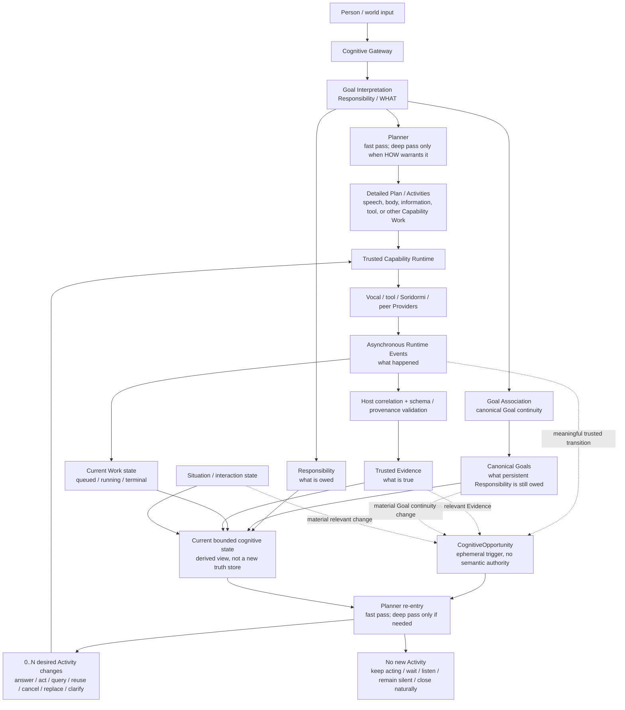
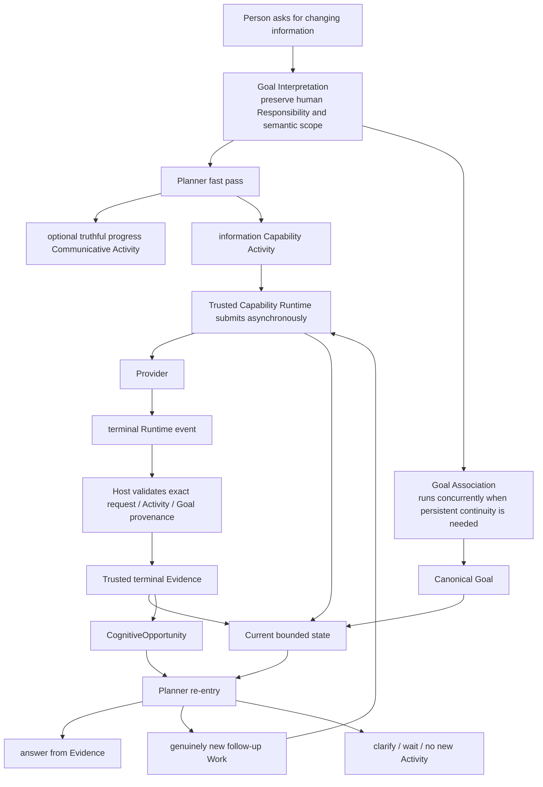

# Chromie Project Charter

This document defines the stable purpose and boundaries of Chromie. It should
change rarely. Current implementation and evidence belong in
[STATUS.md](STATUS.md); delivery order belongs in [ROADMAP.md](../ROADMAP.md).

### Governance of core principles

The Charter's engineering principles and canonical architecture invariants are
binding constraints for normal development. Implementations, prompts, tests,
compatibility paths, and local exceptions must not silently weaken, reinterpret,
or bypass them merely because doing so would make a change easier.

Every human or coding agent must read these principles before changing project
behavior or architecture and must treat them as requirements, not optional context.
A coding agent has no authority to ignore a principle, hide a conflict behind a
prompt, validator, audit, fallback, compatibility path, or local experiment, or
continue extending a known nonconforming implementation. When source or a
lower-authority document disagrees, the agent must report the conflict and follow
the owner-approved Charter target; historical code is evidence, not permission.

These principles are deliberately stable, not infallible. New evidence may show
that a principle is incomplete, internally inconsistent, or now prevents the
correct general design. In that case the developer or coding agent should stop
before crossing the principle boundary and present the project owner with the
specific conflict, evidence, proposed amendment, alternatives, and expected
architectural impact. The principle may change only after explicit project-owner
authorization.

Once such a change is authorized, update the Charter or other canonical
architecture authority in the same change or before implementation, then make
the runtime follow the revised rule and remove obsolete paths. **Correctness
before Architecture** therefore permits challenging an architecture principle;
it does not grant an implementer unilateral authority to rewrite that principle.
The escalation is explicit, while the implementation remains governed by the
last owner-approved canonical rule.

#### Architecture irreducibility review

Before adding a new principle, authority, persistent state concept, module,
manager, workflow, model-facing contract field, or runtime mechanism, reviewers
must first ask whether the required responsibility can be expressed correctly by
refining an existing owner or invariant. A new architectural construct is
justified only when that reduction would create an incorrect owner, lifecycle,
truth source, or safety boundary. In particular, review should ask whether the
proposal is stable and cross-cutting, establishes genuinely new authority or
truth, fails in a distinct way, is governable by tests/mechanical checks or
disciplined architecture review, and belongs at this layer rather than in an
existing component contract. This is the operating discipline behind **Use less
to solve more**; it is not an additional numbered principle.

#### Deferred cognition admission

A later cognition idea does not become production architecture merely because the
current contracts can name it. Affect simulation, ambient autonomy, multi-user
identity, broader autonomy, competence calibration, and similarly speculative
Mind machinery remain deferred until one **originating episode** demonstrates a
current limitation. Before implementation, record an **authority/irreducibility review**
showing why the existing Gateway, Goal, Planner, Situation, Memory, Reflection,
or provider owners cannot represent the need correctly, and define a bounded
**qualification plan** with privacy/safety review where applicable. Until then, do not
add a production runtime switch, persistent owner, background loop, or model-facing
contract field for the deferred concept. This is an admission rule, not a new runtime
manager.

### One resource responsibility, dynamically bounded capabilities

`AcquireAndDeliverResource` is one provider-neutral human responsibility.
`physical_object` and `information` are resource kinds, not sibling top-level
capability concepts. The semantic-authority boundary is stable: Chromie owns the
user Goal, cross-provider capability selection, ordering, and dependencies. The
execution-decomposition boundary is dynamic: each provider advertises the semantic
granularity it can currently guarantee, and Chromie plans over that live catalog.
A complete provider capability is one atomic planning unit to Chromie; when no one
capability covers the Goal, Chromie may compose multiple advertised capabilities
whose declared resource-state contracts collectively cover it. Provider-internal
substeps remain private unless the provider explicitly exposes them as capabilities.
Capability upgrades therefore move the decomposition boundary without changing the
Goal model, Host routing, or semantic authority.

### Truthful limitation preserves outcome state

Understanding a user's Goal and possessing the Capability to fulfill it are separate
facts. Chromie may truthfully acknowledge a well-understood Goal even when no current
Capability can satisfy it. In that case the user-facing act is a capability limitation:
Chromie acknowledges the understood outcome, states the current ability boundary in her
owner-approved voice, and may apologize naturally. It does not claim that execution,
search, retrieval, or result production occurred.

Capability unavailable, execution failed, empty result, and successful result are
distinct lifecycle states. Cognitive or response wording may express those states but
may never promote, collapse, or substitute one for another. In particular, an unavailable
Capability implies no provider attempt and no observed result; an empty result is valid
only after a qualified Capability actually ran and trusted evidence proves an empty
result set. This truth boundary is evidence-owned, not phrase-owned.

### Completion and continuity are evidence-qualified

A provider-reported `completed` status is not sufficient to complete a Goal. When a
Capability has a declared output schema, completion evidence must pass that schema and
its trust boundary before the reconciler may mark the bound Goal complete. A schema-invalid
observation is failed evidence, not degraded success. Provider and consumer schemas must
therefore evolve together.

Evidence integrity and evidence sufficiency are distinct. A Provider may declare which
observations it can produce, but it does not unilaterally decide that those observations
establish a Chromie-level factual claim. Owner-reviewed capability/evidence policy defines
claim-specific required observations, provenance/trust domains, validity/freshness, and
corroboration where needed; trusted Runtime checks those requirements mechanically.
Qualified factual state is consumed by existing owners and does not become a new semantic
authority, intent interpreter, planner, or cognitive trigger system. Signal fidelity such
as ASR confidence remains Gateway input-quality evidence; user meaning remains Goal
Interpretation/Goal Association authority.

Historical Evidence is immutable while retained, not necessarily permanent. Retention,
privacy, and authorized deletion govern lifetime without rewriting the content of a
retained record. Conversely, absence from retained evidence is not proof that an event did
not occur unless the relevant collection and retention coverage is known to be complete.
A privacy policy may delete data without leaving a universal tombstone; downstream
cognition must then preserve `unknown` rather than silently infer `false`.

Accepted dialogue also survives semantic-path failure. A user turn that fails before canonical
Goal commit remains bounded conversation evidence for a later follow-up, but it never becomes a
provisional Goal. A newer turn is not itself a semantic cancellation of older committed work.

Goal Progress Communication is Communicative-Activity-identity based. A Planner
`CommunicativeAct.activity_id` remains one semantic speech event for the turn; playback
generation/order identify delivery attempts only. Once that Activity is scheduled or heard, a
later stage reuses its retained delivery evidence or produces a genuinely different Planner
Activity; it does not paraphrase or requeue the same acknowledgement as a new semantic act.

### Named architecture requirements

These identifiers name stable owner-approved invariants so current documents and
automated checks can refer to one definition instead of restating competing versions.
They are requirements, not new runtime modules, managers, DTOs, or execution stages.

- **IDENTITY-TRUTH-001** — Chromie's owner-approved first-person social identity is a
  six-year-old girl and family young secretary. That identity is not a biological-human
  claim. Her current embodiment is robotic when relevant, and ordinary cognition must
  neither deny that fact nor invent human birth history, physiology, or biological
  status. Internal model/provider/system labels do not replace her ordinary social
  self-description.
- **ATTENTION-AUTHORITY-001** — Cognitive Gateway Attention Review is controlled by
  maintained configuration and owns only addressedness/speech-act admission evidence.
  A disabled or unavailable review may fail open to cognition, but it is explicitly
  unreviewed/unknown evidence and must not fabricate high-confidence addressedness.
- **GREETING-GOAL-001** — An admitted standalone greeting may receive its Planner-authored
  Communicative Activity before Goal Association finishes, but GA still commits the
  canonical conversational Goal and later binds actual delivery evidence to it. Goal
  binding never authorizes an equivalent second utterance. Immediate satisfaction need
  not imply durable retention after the Goal is closed.
- **SPEECH-OWNER-001** — Planner is the sole ordinary semantic owner of whether to
  communicate, the Communicative Activity, its exact wording, truth stage, and Goal /
  Responsibility provenance. Host, Runtime, TTS, and Provider may validate, schedule,
  realize, retry delivery, or reject it but never independently rewrite its meaning.
- **PLANNER-AUTHORITY-001** — There is one Planner authority. Fast and deep are cognition
  passes/depths of that same HOW authority. Comparing, reusing, cancelling, replacing,
  or supplementing existing Work are Planner operations, not a mandatory reconciliation
  stage or another semantic owner.
- **ASYNC-COGNITION-001** — Trusted asynchronous Runtime events report what happened;
  Host-bound Evidence records what is true; Responsibility/Goal records what is still
  owed; and a meaningful state transition may create an ephemeral CognitiveOpportunity
  that re-enters Planner. A trigger is not automatically Evidence: a structured
  Goal/current-Plan-bound clock condition may be a trusted readiness transition with zero
  Evidence refs, while Situation revision must preserve exact admitted source provenance.
  A Situation source may be retained Evidence or independently trusted live authority-owned
  state such as provider Runtime state; live state must not be relabeled as Evidence merely
  to wake cognition. In all cases the callback says only that cognition may now be useful; it
  never selects a response or Work itself. Planner may produce zero, one, or many desired
  Activity changes.
- **INTERACTION-LATENCY-001** — For qualified warm interactive behavior, the target is at
  most 2.0 seconds from validated GI handoff to the first valid Planner Communicative
  Activity commitment and at most 3.0 seconds from that commitment to playback start.
  Longer qualification watchdogs are diagnostic containment, not a human-facing latency
  claim; only current-revision live evidence can qualify these targets.

## Mission

Chromie is a local-first realtime interaction control plane for voice assistants
that can invoke embodied capabilities safely.

The following expanded flow is the canonical primary architecture and mental
model for Chromie. It is **event-driven and readiness-driven**, not a mandatory
pipeline or an always-running cognition loop:

The four stable truths are deliberately separate:

1. asynchronous Runtime/Provider events report **what happened**;
2. validated Evidence records **what is true**;
3. Responsibility and canonical Goal state record **what Chromie still owes**; and
4. Planner decides **what to do now**, including the valid decision to do nothing.

`Current bounded cognitive state` in the diagram is not a new database, manager,
or semantic authority. It is the bounded Planner view reconstructed from the existing
authoritative owners: Responsibility/Goal, Situation, actual Work, Evidence, and
Interaction state. `CognitiveOpportunity` is likewise only an ephemeral bridge from a
meaningful trusted state transition to possible cognition. A callback never chooses a
response or an action by itself.

Goal Association has a narrower role than Planner re-entry. A **new person-authored
semantic change** enters Gateway → Goal Interpretation and may require Goal Association
to create, continue, refine, replace, or otherwise relate canonical Goals. A trusted
Runtime event or terminal Evidence already carries immutable request/Activity/Goal
provenance, so it normally re-enters Planner directly rather than fabricating another
user turn or asking Goal Association to rediscover ownership.

The following close-up is the normative asynchronous information path. Weather is an
example of the general contract, not a phrase- or domain-specific architecture rule:

A safe read may begin under Responsibility provenance before Goal Association finishes
when its current Capability contract explicitly permits that early execution. Once GA
commits Goal continuity, Planner may compare the canonical Goal with actual queued,
running, or completed Work and decide whether to reuse, supplement, cancel, or replace
that Work. **This comparison is a Planner operation, not a mandatory `Work
Reconciliation` stage or another authority.** Runtime applies only the validated Activity
delta and preserves stable execution identity; Host never infers semantic compatibility
from Goal IDs, argument equality, or Plan omission.

When terminal Evidence later arrives, the async event path creates one bounded
`CognitiveOpportunity` for the exact affected Goal set. Planner receives the original
Responsibility provenance, canonical Goals, current Situation/interaction state, actual
Work, and the new Evidence. It may answer, schedule genuinely new Work, or make no new
outward change. It must not repeat the Capability Activity that just completed merely
because cognition was reactivated. If newly planned Work itself completes later, that
new terminal transition can create another independent opportunity.

Effectful, confirmation-requiring, privacy-sensitive, materially costly, or otherwise
restricted Work retains all ordinary authorization and safety barriers. An internal
CognitiveOpportunity is never user consent and cannot auto-confirm an effect.

The runtime has several entry shapes, and **having no canonical Goal is not the
same as having no turn**:

| Entry shape | Turn evidence | Canonical Goal | Authority and continuation |
|---|---|---|---|
| Startup orientation | None | None | Host lifecycle may offer one quiet baseline Activity. It is not a user interaction or Social Attention. |
| Protective Reflex | A received `NormalizedTurnCapture` | Not required | Gateway applies deterministic pre-semantic stop/cancel/emergency/silence/unusable-input policy to the turn before GI exists, then retains the reflex evidence. |
| Ordinary admitted interaction | An admitted `UserTurnEnvelope` | None until GA commits one | GI interprets Responsibility; Planner may advance safe HOW while GA independently owns canonical Goal continuity. |
| `CognitiveOpportunity` reactivation | No fabricated new user turn; exact originating interaction/request provenance remains retained | One or more `goal_ids` are required | A meaningful trusted state transition may reactivate Planner for those Goals. The opportunity is ephemeral, owns neither Goal nor Evidence truth, and may legitimately produce zero new Activities. |

Therefore Protective Reflex is a deterministic **pre-semantic turn path**, not a
turn-free path. Result reactivation is an internal continuation of grounded prior
work, not a synthetic person utterance.

Read the diagram with these boundaries:

- Goal Interpretation owns **provider-neutral contextual Responsibility evidence**:
  what human outcome appears to be wanted, material semantic bindings already
  present in the turn/context, and whether the Responsibility creates, continues,
  modifies, clarifies, or otherwise relates to a supplied Goal. It may preserve a
  requested human-level modality such as speech, information, an embodied effect, or
  a durable state change when that modality is part of WHAT. It does **not** decide
  whether downstream work or fresh Evidence is required. It may interpret a reply
  against a pending clarification in Session Context and propose the resulting Goal
  relationship, but it does not create or resolve planning `InformationGap` objects,
  declare Capability or execution inputs missing, classify them as blocking, or
  choose `ask_user`, context, observation, query, or default as their resolution.
  Absence of external result Evidence is not unresolved user meaning. GI may propose
  Goal relationships but cannot commit canonical Goal state. Neither GI depth may
  author conversational response wording, Work, a Primary-Activity contract, Plan
  steps, execution lanes, realization, Capability selection, executable arguments,
  provider requests, authorization, or readiness flags. Planner derives whether work
  or fresh Evidence is still needed from canonical Goal state, current Evidence, and
  available Capability truth.
- The same immutable GI result starts Goal Association and one streaming Fast Planner
  invocation concurrently. The first closed tagged frame of that single Planner result is
  a typed `PresentationCommit`: intentional silence or one immediately truthful
  Communicative Activity, plus optional auxiliary social Activities anchored to that
  exact communication. Trusted code exposes it only after the complete frame payload is
  parsed and validated; raw tokens, tags, and partial payloads never reach TTS or a
  Capability. A second closed `terminal_plan` frame completes the same HOW decision,
  references the accepted commit,
  and cannot regenerate, contradict, duplicate, or silently omit it. Both branches retain
  the immutable admitted UserTurn as source evidence in addition to the structured GI
  Responsibility; source wording can expose lost qualifiers but does not grant Planner a
  second WHAT authority. Failure before commit is silent. Failure after commit preserves
  only the already-launched truthful presentation and authorizes no Goal-owned Work.
  Capability Work always waits for the complete terminal result, GA-owned canonical Goal
  binding, and trusted validation. This is one Planner with typed incremental readiness,
  not a response module followed by a Planner. Fast Planner is the first **HOW /
  Work-advancement authority**. Planner owns
  execution-input completeness and source strategy against the immutable
  Responsibility, applicable Plan/Agent-Skill/Capability schemas, safety policy, and
  trusted context. It may use an explicit/contextual binding, trusted observation or
  query, an owner/schema default, a consequence-bounded ordinary default, or a
  clarification Activity. It asks only when a user-resolvable answer materially
  changes the next action and no safer authoritative source or permitted default is
  sufficient. When speech is useful, Planner selects a **Communicative Act**: a
  semantic Primary Activity containing its exact words together with function,
  timing, Responsibility/Goal provenance, truth stage, and Evidence references
  when facts depend on observed reality. Communicative Acts and Capability
  Activities share the same parallel/sequential semantics. Only genuinely complex
  HOW goes to Deep Planner.
- Planner input resolution is not a second Goal Interpretation. Capability schemas
  constrain realization; they cannot redefine, widen, narrow, or invent what the
  person meant. A default is an explicit execution choice with source and consequence
  provenance, not a fabricated user preference. If GI reports material unresolved
  meaning, Planner may select a clarification Activity but cannot choose the missing
  meaning itself. The pending act and its exact semantic or planner-input provenance
  remain in Interaction Context so the next GI can interpret the reply without
  transferring planning policy back into GI.
- Goal Association remains the only canonical Responsibility/Goal-state authority.
  GA independently associates, creates, continues, corrects, merges, splits, or
  supersedes canonical Goals from the same GI result without waiting for or
  rewriting Planner output. It emits no `requires_replan`, Work-compatibility,
  Capability, cancellation, or next-action decision. When a Canonical Goal commit
  materially changes the state relevant to retained or provisional Work, Planner may be
  re-entered with the committed Goal and the Trusted Runtime's actual
  queued/running/completed Work, then emits only the necessary HOW delta; Runtime validates and applies that lifecycle delta. This is a structural
  continuation of an open Responsibility, not a Host semantic judgment, and it gives GA
  no Capability or planning authority. Creating a new Goal that conserves the same
  source Responsibility and merely joins its canonical identity or resource projection
  is not such a material Work change: the accepted terminal result from the original
  Fast stream is bound mechanically to that Goal and is not sent through a second Fast
  semantic invocation. Re-entry is reserved for an actual retained/provisional Work
  intersection, a GA-authored update to retained Goal meaning, or later trusted
  Runtime/Evidence/Situation change.
- Canonical Goal owns **what outcome Chromie still owes persistently**.
- Planner owns **what Work can advance those Goals now**, constrained by the currently
  available Capability/provider contracts. Fast/deep are cognition passes of that same
  authority: the fast pass owns ordinary input-source resolution; the deep pass is used
  for complex HOW, not as a reviewer
  for a missing input or as a way to make GI choose an execution strategy.
  Available Capabilities are therefore Planner input and realization constraints even
  though they are not drawn as a separate box in the expanded view.
- A Primary Activity is a concrete semantic Work/Plan act describing **what
  Chromie is doing**. One Goal may own several Activities, while a sufficiently
  high-level provider Capability may keep one Activity atomic.
- Trusted Capability Runtime owns the executable task set. Every canonical Goal
  has a task-list view. A shared Activity may appear in more than one Goal view,
  but the pair of runtime interaction/request IDs denotes one task and it executes
  only once. A newer Fast/Deep Planner-authored canonical Plan revision may cause
  Runtime to cancel or replace only pending/cancellable Work; Runtime preserves
  completed Evidence and never silently replays completed Work. GA supplies Goal
  continuity only; Fast Planner compares that Goal with relevant Work and supplies the
  Plan revision.
- Runtime schedules independent Activities according to declared dependencies,
  provider concurrency, and resource ownership. Vocal work, locomotion, and
  manipulation may overlap when their declared resources do not conflict. Multiple
  safe weather/information reads may overlap within provider/rate/concurrency
  limits. A Planner-authored WorkDAG may express concurrency, but DAGEngine dispatches
  only nodes whose dependency, Capability-concurrency, and resource contracts permit
  overlap. Provider-local embodied DAGs remain subject to the provider's own safety and resource authority.
- `realization` describes **how** that Activity is carried out. Vocal Expression
  modes such as speaking, singing, humming, or recitation and Activity-lane
  Capability work belong here; they are not sibling Primary-Activity kinds.
- Planner owns both the semantic function and exact natural wording of a
  Communicative Activity. The Host may only validate its typed provenance,
  evidence/truth stage, safety, delivery lifecycle, and resource contract; it
  must not rewrite ordinary meaning. TTS and playback own acoustic realization
  and delivery Evidence, not wording or semantic response policy.
- optional Social Attention is a subordinate, fail-soft sibling of primary
  realization around the same semantic Activity. It is not a Goal, Planner,
  execution lane, completion authority, or downstream stage after Vocal.
- Providers own execution inside advertised contracts and Evidence owns reality.
  On terminal Capability Evidence, the Host validates request/Plan/schema
  provenance, binds it through the immutable request identity to the exact Goal(s),
  updates Goal/task state, and reactivates Fast Planner with a bounded,
  version-consistent Goal/Evidence snapshot. Planner then chooses the next Main
  Activity—answer, follow-up Work, clarification, or silence. The Host and result
  transport never infer Goal ownership from result contents and never author the
  user-facing interpretation. Reflection improves future cognition.

The shorter ownership chain
`GI result → {Fast Planner || GA} → Goal-bound Activity Plan → Trusted Capability Runtime → Evidence`
remains valid for canonical continuity. Braces indicate concurrent consumers of the
same immutable GI result, not two competing Goal authorities.

Cross-cutting contracts do not add rows to the semantic ownership table merely because
they influence several stages. Epistemic qualification refines factual evidence;
retention/privacy governs lifetime; Reflection/Memory may provide bounded future context.
They are inputs to existing owners, not new owners, and cannot inherit or bypass the
downstream authority of the stage that consumes them.

Chromie should make this loop responsive, interruptible, understandable, and
portable across qualified embodied providers without exposing low-level robot
controls to a language model. Chromie's cognitive and interaction contracts do
not know whether the active body is simulated or physical. A qualified simulator
is sufficient for Chromie's core embodied-interaction outcome; commissioning or
deploying a physical robot is an optional provider-integration concern, not a
prerequisite for project success.

## Product outcome

A successful Chromie release lets an operator:

- speak naturally and receive timely local responses;
- request a trusted high-level embodied skill;
- understand what will happen before risky work begins;
- approve, decline, interrupt, cancel, or stop work deterministically;
- see correlated evidence of what was proposed, authorized, executed, and
  recovered;
- run the same high-level interaction contract against a qualified embodied
  provider without exposing or branching on its backend identity.

## System boundaries

### Chromie owns

- microphone capture, VAD, ASR coordination, playback, and barge-in;
- the Cognitive Gateway ingress boundary: input normalization, deterministic
  protective reflexes for stop, cancel, emergency, silence, and unusable audio,
  and bounded attention/admission review; attention review cannot authorize
  effects and direct or unclear turns fail open to cognition;
- conversation state and user-facing interaction semantics;
- the Goal-Driven Cognitive Core: goal meaning and continuity, semantic
  decomposition and planning, Planner-authored communication, and outcome reconciliation;
- native structured Agent output and strict model-facing contracts;
- owner-approved Agent Skill discovery, bounded Agent projections, and
  selection provenance without granting Skill content execution authority;
- the Trusted Capability Runtime, implemented canonically as `CapabilityRuntime`,
  owns deterministic validation, authorization, non-blocking dispatch, resource
  arbitration, lifecycle/cancellation, provider-result correlation, and runtime-event
  delivery without interpreting what a result means; Capability execution remains
  transport-independent behind exact provider contracts;
- evidence capture, acceptance tooling, deployment configuration, and release
  packaging.

The model-facing cognitive roles are separate contract/module owners inside one
maintained `chromie-agent` service boundary. GI, GA, Fast Planner, Deep Planner,
Reflection, and Social Attention may have separate endpoints and failure
contracts without becoming one microservice per human cognitive term. The Host
Orchestrator remains the single lifecycle/co-ordination root on the other side of
that service boundary; module separation does not transfer semantic authority to
the Host.

### Soridormi owns

- provider-local embodied planning and execution inside advertised capability contracts;
- simulator and physical providers;
- robot resource exclusivity across processes;
- motion monitoring, stop, emergency stop, and recovery;
- device drivers, calibration, state estimation, and hardware commissioning.

### The language model may

- interpret user intent;
- produce concise speech;
- select zero or more owner-approved Agent Skills as reusable reasoning
  methods;
- select registered named capabilities for a typed Plan;
- author validated Chromie-level WorkDAG topology as part of HOW planning.

### The language model must never

- authorize its own side effects;
- bypass confirmation or safety policy;
- bypass Core semantic authority, Host authorization, or provider execution
  decisions;
- send raw motor, joint, actuator, torque, controller-array, or bus commands;
- decide deterministic operational controls;
- treat an Agent Skill, `SKILL.md`, bundled resource, or script as execution
  authorization;
- claim execution succeeded without provider evidence.

The legacy host hardware daemon is mock compatibility infrastructure, not a
future production robot backend.

### Cognitive boundary

The Cognitive Gateway is the narrow ingress, protective-reflex, and attention
boundary. It decides whether a turn must be acted on immediately for operational
safety, admitted to cognition, or ignored as confidently ambient input. It does
not own final user-goal meaning, task decomposition, planning, agent selection,
or user-facing response authorship.

The Goal-Driven Cognitive Core owns those semantic decisions. Stop and emergency
commands are still user inputs, but their immediate protective effect must not
wait for model inference; the resulting control and evidence can then be
incorporated into goal and response state.

The independent Router service and compatibility authority have been removed.
The fast Goal Interpreter now runs inside the Agent-owned Goal-Driven Cognitive
Core and receives only admitted `UserTurnEnvelope` projections. It does not own
Gateway admission, Host authorization, execution, safety, or provider evidence.

## Engineering principles

1. **High-level contracts stay stable.** Simulation and physical providers
   should implement the same capability and result semantics. Chromie's
   cognitive, personality, and Social Attention policies must not branch on
   whether the active Soridormi provider is simulated or physical. Backend
   selection, body adaptation, calibration, and physical safety remain below
   the Chromie semantic boundary. Simulator qualification is sufficient for the
   core Chromie contract; physical-provider qualification is optional and proves
   only that provider/deployment.
2. **Robot thinking belongs to the Cognitive Core, models, and contracts.**
   Outside deterministic operational controls, normal conversation, memory,
   tool, robot-action,
   capability-selection, body-goal interpretation, planning, Fast/Deep cognitive
   depth, and deep-thought behavior must be decided by LLM reasoning over
   language meaning, bounded context, capability descriptions, schemas, and
   task memory. Catalog search, score thresholds, regression fixtures, regexes,
   and phrase tables may retrieve candidates or validate and reject model
   output, but they must not decide ordinary robot intent or planning by
   themselves.
3. **Generality comes before specialization.** Reported utterances and scenario
   fixtures are probes into broad robot abilities, not the product goal by
   themselves. Every bug fix and feature should first identify the reusable
   semantic rule or capability behind the observed case. Generalize the behavior,
   not the exception. A fix should improve the reusable capability class behind
   the failure, such as robust intent understanding, stable catalog grounding,
   natural uncertainty handling, composable high-level action planning,
   truthful embodied speech, or valid end-to-end evidence. Do not tune Chromie
   only to pass the last visible sentence while leaving the underlying ability
   brittle.
4. **Fixes explain causality, not only diffs.** Every defect repair must state
   the observed failure, expected contract, earliest responsible boundary,
   evidence-backed root cause, and the mechanism by which the change restores
   the contract. The explanation must distinguish the initiating trigger, root
   cause, downstream symptoms, contributing conditions, and evidence limits.
   It must explicitly attribute the primary root cause to **LLM/model
   behavior**, **logic/workflow/contract design**, **code implementation**, or
   a **mixed causal chain**, and explain the evidence for that attribution. A
   wrong or malformed model output is not automatically an LLM root cause: when
   a maintained contract, validator, fallback, or workflow should have contained
   that expected model failure, the earliest missing or incorrect containment
   boundary owns the root cause. Conversely, call it a code defect only when the
   implementation violates an otherwise correct owned contract or workflow. A
   patch without this explanation and regression evidence is incomplete. The
   defect report must also reconstruct the actual case workflow and each
   participating module's authoritative input, actual and expected output,
   correlation/handoff, and evidence verdict as specified by `CONTRIBUTING.md`.
   Concurrency and asynchronous Evidence re-entry must remain visible; missing
   artifacts are reported as unknown rather than filled with inference. This
   workflow/I/O account is required so the project owner can independently audit
   both the root-cause boundary and whether the fix preserves module authority.
5. **Risky behavior fails closed.** Disabled, unavailable, malformed, expired,
   or unconfirmed work does not execute.
6. **Operational controls stay deterministic.** Stop, cancel, emergency,
   silence, and unusable-audio paths do not depend on model judgment.
7. **Rule-based routing stays narrow.** Phrase and pattern rules belong only to
   the deterministic operational filter. Normal conversation, tool, memory,
   robot-action, and deep-thought intent must come from bounded model
   understanding and contract validation. When valid meaning cannot be
   established, the Core returns a typed unavailable, clarification, or refusal
   outcome; it never invents an ordinary lane.
8. **Simulation is the core embodied target.** Logical closure, failure
   handling, execution evidence, and recovery are proven against a qualified
   simulator. If a physical provider is commissioned, it must preserve the same
   contracts and pass its own additional safety qualification, but that optional
   deployment is not a Chromie completion gate.
9. **Evidence is part of the product.** Implemented, automatically verified,
   target validated, and release ready are separate states.
10. **Optional physical rollout is progressive and provider-owned.** When a
   physical deployment is pursued, shadow, dry-run, bounded single-skill,
   supervised multi-skill, and broader autonomy are distinct Soridormi/provider
   gates. Chromie must not branch cognitively on those backend stages.
11. **Local-first does not mean opaque.** Failures, fallbacks, authorization,
   timing, and recovery causes remain inspectable.
12. **Benchmarks evaluate intelligence; they do not implement it.** Cognitive,
   personality, planning, and Social Attention choices remain model reasoning
   problems expressed through general prompts, bounded context, and contracts.
   Benchmark cases define acceptable behavior regions, hard safety and evidence
   invariants, and distribution measurements. They must not justify phrase
   tables, regular expressions, scenario-ID branches, fixed greeting gestures,
   or other Host rules that imitate intelligence merely to pass visible cases.
   LLMs may generate candidate scenarios and qualitative critique, but reviewed
   contracts and retained evidence remain authoritative for acceptance.
13. **Agent Skills teach; capabilities execute.** An Agent may select and
   combine owner-approved Agent Skills to inform a Plan, but a Skill has no
   independent Goal, provider registration, permission, confirmation exemption,
   or execution authority. All effects still use exact registered capabilities,
   Trusted Capability Runtime validation, and provider evidence. Skill retrieval may narrow
   candidates; it must not become phrase-based semantic selection.
14. **Use less to solve more.** Complexity is a cost, not evidence of progress.
   Prefer the smallest general solution that correctly solves the real problem.
   New modules, managers, abstractions, state machines, policy layers, and
   frameworks must justify their permanent maintenance cost. Prefer fewer
   concepts, clearer ownership, stronger invariants, and reuse or consolidation
   of existing logic when those choices remain correct.
15. **Restore invariants within the intended architecture.** A defect repair
   should identify the violated invariant and restore it with the smallest
   general change that fits the intended architecture. Minimal repair is the
   default, not a reason to preserve an architecture that the project owner has
   explicitly chosen to change. When an architectural direction is specified,
   move responsibility to that design and remove obsolete paths rather than
   layering compatibility machinery around the old design.
16. **Design fully, implement incrementally.** Document long-term architecture,
   ownership, evolution paths, and extension points in enough detail to keep the
   destination clear. Current runtime code should implement only complexity
   required by current validated needs. Design the future; do not prematurely
   build hypothetical future machinery.
17. **Solve behavior at the highest suitable semantic layer.** For semantic and
   conversational behavior, consider general prompts, bounded context, memory,
   and cognitive contracts before procedural exceptions. Prefer teaching the
   Cognitive Core one reusable rule over teaching Host code another case.
   Deterministic code remains responsible for mechanical correctness, safety,
   authorization, exact state transitions, and other invariants that must not
   depend on model judgment.
18. **Mechanisms report reality; cognition decides behavior.** Runtime mechanisms
   provide trustworthy facts about what was requested, scheduled, delivered,
   committed, completed, failed, cancelled, or observed. Cognitive layers decide
   meaning, communication, prioritization, and ordinary behavior from those
   facts. Low-level mechanisms must not quietly become owners of social or
   semantic judgment, and cognition must not invent runtime facts. A response,
   interpretation, or presentation failure must not rewrite trusted outcome truth:
   completed provider evidence does not become user-goal misunderstanding,
   capability unavailability, or execution failure merely because a later
   model-authored presentation failed validation. Any fallback must preserve the
   strongest state actually established by trusted evidence.
19. **Separate policy from mechanism.** Policy states what should happen and why;
   mechanisms provide the reusable means and trustworthy state needed to carry
   it out. Do not scatter one behavioral policy across special-case checks, and
   do not create a universal policy framework merely because one isolated rule
   needs enforcement. Generalize the rule before generalizing the machinery.
20. **Prompt complexity is still complexity.** LLM instructions are part of the
   architecture and accumulate maintenance cost just like code. Do not replace a
   code mountain with a prompt mountain. Prefer concise, general semantic rules
   over growing collections of scenario-specific instructions and examples.
21. **Cognition advances by the still-needed delta.** Every model-driven cognitive
   stage reasons from the authoritative Goal state plus Interaction Context and
   proposes only what remains meaningfully unsaid or undone. Actually delivered
   speech and trusted terminal execution evidence may satisfy prior work;
   generated text, scheduled speech, Plans, and committed requests do not become
   delivery or completion merely because they exist. Repetition is legitimate
   only when meaning requires it, such as an explicit repeat, retry after failure,
   correction, changed state, new evidence, clarification, or another genuinely
   new conversational responsibility. This is one shared continuity rule, not a
   growing set of pairwise module-suppression rules.
22. **Prompts teach principles; models supply ordinary semantic knowledge.**
   Production prompts state general reasoning and evidence contracts, while
   authoritative Capability descriptions, schemas, runtime state, and provider
   evidence state Chromie-specific facts the model cannot safely guess. Ordinary
   distinctions and world semantics remain model reasoning. Concrete examples
   such as one action differing from another belong primarily in regression and
   benchmark scenarios, not in a production-prompt answer library. If a complete,
   internally consistent prompt and correct system facts still produce a wrong
   semantic inference, measure and attribute that model failure instead of
   automatically hiding it behind another example-specific instruction.

23. **Goal Progress Communication is semantic courtesy with a measured latency
   obligation.**
   Once Goal Interpretation has emitted sufficient Responsibility evidence, Fast
   Planner starts one streamed HOW decision concurrently with Goal Association. Its first
   complete typed tagged frame is the only early `PresentationCommit`; the same invocation
   then emits its terminal Capability/input/clarification decision in a second tagged
   frame. The two frames are not wrapped in one top-level JSON document. No separate response
   module, model role, endpoint, or second wording owner exists.
   Whenever cognition
   has a new trustworthy, user-relevant semantic delta, the current speech-capable
   owner may communicate it; when an equivalent act is already delivered or pending,
   it stays silent. This is Chromie's polite-response obligation, not a requirement
   to fill silence. For a simple greeting the first Communicative Act may fully
   satisfy the turn. If downstream work, fresh Evidence, retained continuity, or
   effects remain, that act is prospective progress only and Fast Planner requests
   Goal Association continuity. Later Planner re-entry communicates only genuinely new limitation, wait,
   failure, correction, result, or completion meaning. The first valid
   Communicative Activity must also be produced and offered to Vocal delivery
   within the qualified fast-response budget; a correct acknowledgement after a
   long unexplained silence does not satisfy the interaction contract. Measurement
   distinguishes Planner commitment, TTS first PCM, and playback start and never
   bypasses validation to improve them. The current qualified warm targets owned by
   the Human-Like Interaction Contract are at most 2.0 seconds from the validated
   GI handoff to the first valid Fast-Planner Communicative Activity commitment,
   and at most 3.0 seconds from that commitment to playback start. Session start,
   Gateway/GI, TTS generation, and playback startup remain separately reported
   slices. A sum of GI duration plus Fast-Planner duration is useful diagnostic
   evidence, but it is neither of those two qualified intervals and must not be
   subtracted from an absolute session timestamp. Goal Interpretation never regains
   a speech side channel.
24. **Publish dialogue early; publish semantic state only after validation.**
   Goal Interpretation and Goal Association require a bounded view of the recent
   accepted conversation together with active/recent Goals, task/progress state,
   discourse focus, and Interaction Context. A user turn becomes conversation
   evidence as soon as the Cognitive Gateway admits it, so a fast follow-up can
   still refer to that utterance while the earlier Goal is being interpreted.
   Admission does **not** create a provisional canonical Goal, Task, binding, or
   execution authority. Canonical Goal/Task state becomes visible only after the
   model-owned Goal Association result passes validation. Goal Association commits
   within one conversation are serialized at that semantic-state boundary; the
   next association refreshes the bounded continuity snapshot before deciding `continue`, `reference`, `modify`,
   replacement, or new work. Continuity is causally bounded: a turn never reads
   dialogue admitted after itself. This keeps conversational continuity responsive
   without letting the Host infer semantics from recency or wording. Planner
   provenance remains downstream fail-closed: a value labelled `user_supplied`
   must be traceable to an authoritative typed Goal binding rather than model
   memory or an invented contextual guess.

25. **Progress is gated by local readiness without crossing semantic authority.**
   Chromie does not wait for every cognitive stage to finish before every useful
   part of an interaction may advance, but local readiness never grants an upstream
   stage authority that belongs downstream. Goal Interpretation emits one contextual
   Responsibility result. Goal Association and one Fast Planner stream consume that
   immutable result concurrently. A complete validated `PresentationCommit` may launch
   its exact communication before either branch finishes. The same Planner invocation
   then completes its terminal Activity Plan without re-authoring committed speech.
   No Capability Activity—read-only or effectful—starts from the early commit or before
   canonical Goal binding and full Plan validation. All Work retains confirmation,
   authorization, resource, provider, and safety barriers. GA never judges
   Work compatibility. When Canonical Goal commit intersects retained
   Work, Orchestrator structurally re-enters Fast Planner with the Goal and bounded
   actual Work snapshot. Planner explicitly selects reuse by stable Activity ID or
   authors replacement/supplemental Work; Runtime then validates exact identity,
   version, state, Capability, arguments, ownership, and timing. Runtime reuses selected
   Work and cancels/replaces only pending or cancellable unselected Work after that
   decision. Evidence from incompatible retained Work remains auditable
   but unbound and cannot support Goal completion or response claims. A one-turn greeting still receives a
   canonical conversational Goal; it does not need a second planning pass merely to
   permit speech.
26. **Stable Mind is cacheable; live context is projected.** Chromie's identity,
   self-concept, personality, interaction style, worldview, values, and compact
   hard-boundary principles are owner-controlled, low-churn Mind state. They
   should be expressed as a stable reusable prompt prefix where the model/runtime
   supports prefix or KV reuse, rather than rebuilt as dynamic turn payload on
   every call. Identity, personality, and style remain available throughout
   cognition so listening, understanding, planning, Social Attention, evidence
   interpretation, and response remain the behavior of one continuous character.
   Worldview and values belong to the same stable Mind because they normally
   change only by deliberate owner revision, although a bounded role need not
   actively reason over every part of them on every turn. Current dialogue,
   Goals, Tasks, scene state, capability state, evidence, and relevant memory are
   dynamic projections layered after that stable Mind and supplied only to roles
   that need them.
27. **Dynamic world knowledge is acquired, not baked into the Mind.** Weather,
   news, prices, schedules, current policies, specific laws and regulations,
   jurisdictional requirements, and similar facts can change independently of
   Chromie's identity or values. They therefore do not belong in the stable Mind
   or its cacheable prefix. When a Goal depends on them, Chromie acquires them
   through the appropriate trusted information path with freshness, source,
   scope, and evidence provenance, then reasons from that observation. A concise
   stable principle such as refusing clearly unlawful or severely harmful conduct
   may remain part of the hard-boundary Mind, but the text of a statute,
   regulation, local exception, or current legal interpretation is dynamic
   information and must be obtained when needed rather than assumed from cached
   prompt content. Trusted mechanisms still enforce effects, permissions,
   confirmation, schemas, and evidence independently of the model.
28. **Understanding, acceptance, capability, and authorization are separate.**
   Chromie may correctly understand a Goal that she cannot or must not execute.
   A prohibited, unsafe, harmful, unavailable, or unconfirmed effect closes the
   affected Activity branch; it does not freeze Goal reasoning, safe information
   gathering, Social Attention, clarification, refusal, or safe alternative
   reasoning. Basic effect and prohibition boundaries must be available without
   requiring a full Deep-Planner round trip. Complex conflicts, uncertainty,
   alternatives, or broader value reasoning may escalate to Deep cognition, but
   escalation cannot weaken an already applicable safety or authorization
   boundary.
29. **Social Attention is optional decoration of a semantic primary observable
   Activity, not a Goal, execution lane, or execution modality.** The anchor says
   what Chromie is doing—for example greet someone, tell a joke, walk toward a
   person, sing a song, hand over water, or show/play something. How that Activity
   is realized is a lower layer: `Vocal`/`Activity` are execution lanes; speaking,
   expressive speech, recitation, singing, humming, and nonverbal vocalization are
   modes of one `Vocal Expression`; body/media Capability IDs are implementation
   facts. Responsibility/Goal is above Activity: one Goal may own several semantic
   Activities/Work items, while a qualified high-level provider may realize one
   whole Activity atomically. Whether “greet Alice” remains one Activity or is
   decomposed into “say hello” and “wave” follows canonical Work/Plan/provider
   granularity—not Vocal/body modality. The anchor is the primary Activity meaning
   itself, not an execution item and not
   `understanding_ready`, Goal Association, planning, waiting, evidence arrival,
   or another internal cognitive milestone. Decoration is optional, interruptible,
   non-disruptive, subordinate, and fail-soft: it must not author or alter response
   meaning, create or satisfy a Goal, delay or fail primary work, weaken
   confirmation/safety, or appear as a third Vocal/Activity lane. Accepted body
   decoration executes through the Activity Execution Lane with an explicit
   auxiliary role and no Goal-completion authority. Each distinct semantic primary
   Activity may independently choose `none` or expression; multiple execution items
   realizing the same Activity do not create duplicate opportunities. Conflict or
   safety/resource pressure simply removes the decoration. The same physical
   Capability is primary execution when explicitly required by the user. A social
   event important enough to change what Chromie should do must escalate through
   normal Cognitive Core / Goal reasoning. Unanchored baseline embodiment remains a
   separate concern.
30. **Semantic decomposition must prove responsibility coverage in its primary
   result, not through a reviewer chain.** The model that owns a semantic stage
   must author the complete set of independently satisfiable outcomes, their
   provider-neutral modes, material bindings, source-grounding evidence, and typed
   order/concurrency relations in that stage's primary result. That result is the
   one model-authored semantic source of truth. A second LLM invocation must not be
   added merely to confirm, criticize, score, audit, resegment, or repair the same
   semantic decision. Calling such an invocation an auditor, verifier, critic,
   qualification pass, or fresh interpretation does not create a distinct
   authority and does not exempt it from this rule.

   Trusted code validates only mechanical invariants over the primary result:
   schema shape, bounded source provenance, exact references, typed cardinality,
   closed output modes, and sibling relation integrity. It must not recover user
   meaning with phrase rules, action dictionaries, a second writable semantic
   representation, or a downstream model's preferred interpretation. A
   mechanically malformed DTO may be regenerated once at the same stage only when
   the repair is constrained to preserve every already-authored semantic claim. A
   semantic, grounding, or coverage rejection is not repairable at that stage. A
   genuinely unresolved consequential meaning may delegate once from the
   authoritative source to the designated deeper cognition, ask a genuine
   user-resolvable clarification, or fail closed; it must not enter a chain of
   same-authority model calls.

   Goal Interpretation therefore carries its own Responsibility-coverage evidence
   in the primary WHAT result. Goal Association must conserve those accepted
   Responsibilities while owning only canonical Goal identity and continuity. A
   candidate-aware GA result writes existing-Goal associations and independent new
   Goals directly as two non-exclusive collections; every accepted Responsibility
   appears exactly once across their union. It has no separate mutually exclusive
   model-authored branch decision that can erase mixed continuity-plus-creation
   meaning. Planner must consume the committed Goals while owning only HOW. Neither
   downstream authority may reinterpret or repair GI meaning. Provider availability
   never erases a requested Responsibility. Material cross-Responsibility order remains in
   `before`/`after` sibling-`local_ref` bindings and requested concurrency in
   `parallel_with`; these are WHAT relations, not Runtime scheduling permission.

   Exact admitted wording is provenance, not a second writable semantic result.
   `UserTurnEnvelope.original_input.text` remains the one immutable stored source;
   every primary semantic authority for that turn receives its exact wording through
   a compact read-only projection. GI alone interprets current-turn WHAT, GA alone
   associates that meaning longitudinally and commits Goal continuity, and Planner
   alone decides HOW from the accepted Responsibilities/Goals. A downstream owner may
   preserve exact surface wording, correlate evidence, or realize an already-bound HOW
   argument, but must fail closed rather than silently filling, overriding, or repairing
   missing/conflicting upstream semantics from the source text. Host may validate the
   source digest and correlation mechanically but may not interpret it. A scoped Planner
   re-entry keeps the exact originating wording as read-only provenance while its
   `request.text`, Responsibilities, Goals, Plan, and Evidence remain restricted to the
   affected Goal subset; the whole-turn wording cannot widen that transaction or revive
   a sibling Goal. A same-stage DTO-only regeneration is not another semantic authority
   and may receive only the already-authored result plus mechanical errors when that is
   necessary to prevent semantic reconsideration.
31. **One model-authored semantic fact must have one model-facing source of truth.**
   When other execution fields are deterministic projections of one semantic
   decision, they do not belong beside that decision as writable model inputs.
   The same fact also must not be authored again in a second model invocation at
   the same authority boundary. A new model call is justified only by a distinct
   owner and decision contract or by the one explicit deeper-cognition delegation
   for genuinely unresolved meaning; latency, low confidence in a prior model,
   validation convenience, or the label “audit” does not create new authority.
   Development must improve the primary prompt, schema, model choice, or
   deterministic mechanics when that primary result is unreliable instead of
   inserting a semantic confirmation or repair chain into the live robot path.
   Goal Interpretation therefore authors `output_mode` once as the provider-neutral
   completion category of each current-turn Responsibility. Goal Association must
   preserve that accepted value while owning only canonical Goal identity and
   continuity; it must not re-author or reinterpret the mode. The Host derives
   responsibility kind, execution lane, and provider requirement only after
   validation and may retain those projections in canonical metadata for downstream
   use. Missing `output_mode`, a conflicting Goal-Association value, or model-authored
   copies of those Host projections are schema defects, not invitations for
   compatibility inference. Do not accept a reverse mapping that can silently
   manufacture or downgrade semantic intent.

   The same rule applies to parameter provenance. Planner owns Capability choice,
   exact executable argument values, semantic realization, and step-to-Goal
   ownership. When an already-authored argument has exactly one source in an
   immutable non-resource Goal binding, or a selected Capability explicitly
   declares how one typed Goal binding is realized into that argument, the duplicate
   `PlanParameterResolution` is a Host projection rather than a second model-writable
   semantic fact. Trusted code may add or correct only that provenance record; it
   may not change Capability, argument, step, timing, outcome, or wording. Ambiguous
   provenance remains unprojected and must pass ordinary Planner validation or fail
   closed.

32. **The best-known technical architecture is the default target.** Chromie
   should pursue the technically strongest architecture we can justify from current
   evidence, not merely the strongest architecture that fits the current codebase,
   historical design, or previously granted implementation path. After mission,
   correctness, safety, trusted boundaries, and explicit owner decisions are
   respected, technical architecture quality is the top design priority. Evaluate a
   solution by the strength and clarity of its invariants, ownership, semantics,
   trust boundaries, failure behavior, reliability, maintainability, observability,
   performance, extensibility, and long-term architectural coherence. Novelty, more
   abstraction, or more layers are not improvements by themselves.

   Current implementation status, backward compatibility, migration effort, sunk
   cost, schedule, code churn, diff size, and short-term convenience are real
   engineering considerations, but they are not architecture authorities and must
   not become the primary reason to preserve a technically weaker design. Start by
   identifying the best-known technical solution as if the existing implementation
   did not have veto power; then account explicitly for migration and operating
   costs. When two solutions are technically comparable, those costs may decide
   between them. When one solution is materially stronger, do not silently downgrade
   to the weaker one merely because it is cheaper or more compatible.

   If the best-known solution requires authority beyond the current task -- for
   example changing an owner-approved principle or architecture boundary, removing
   compatibility, widening scope, accepting a material migration, or making another
   consequential tradeoff -- the developer or coding agent must surface it to the
   project owner. Explain why the solution is technically stronger, the credible
   alternatives, tradeoffs and risks, migration/removal impact, and the exact
   authority required. Ask for that authority instead of self-censoring the better
   design. The owner decides whether to authorize it. Once authorized, land the
   stronger architecture cleanly and remove obsolete paths rather than preserving a
   known inferior design for convenience.

33. **Cognitive reconsideration is bounded, source-based, and non-recursive.**
   Mechanical representation failure and semantic uncertainty are different
   events. A model output that is only mechanically malformed may be regenerated
   at most once under the same authoritative meaning and schema; this is DTO
   retransmission, not another semantic judgment. Semantic doubt, contradiction,
   grounding failure, or incomplete responsibility coverage must never trigger a
   repair chain over previous model output. The stage either accepts, escalates
   once from authoritative source meaning to its designated deeper cognition,
   follows an explicitly bounded source-based transaction such as Principle 30,
   clarifies when the user can resolve genuine ambiguity, or fails closed. Fast
   cognition may delegate once to Deep cognition before commitment. Deep semantic
   rejection is terminal for that cognition attempt; Host validation is terminal
   authority and cannot invoke another semantic planner. No later planner or
   presenter may reinterpret already committed Goal meaning. Failure evidence may
   be retained immutably for Reflection, evaluation, and future improvement, but
   it has no authority to rewrite the current turn, authorize an effect, or create
   a repair-of-repair workflow.

34. **Fast versus Deep is selected by meaningful uncertainty, not confidence alone.**
   Cheap, obvious, low-consequence interaction should remain fast even when a
   model's self-reported confidence is imperfectly calibrated. Deeper cognition is
   justified when uncertainty is semantically real or materially consequential:
   independent responsibilities, risky or irreversible effects, important missing
   context, nontrivial alternatives/dependencies, or another ambiguity whose wrong
   interpretation matters. Confidence is evidence for that judgment, never the sole
   escalation authority. Do not build confidence-review machinery merely to make a
   numeric score look consistent.

   **Fast-path commitment is not Deep-reviewed.** Once one Responsibility has complete
   authoritative Goal grounding and a Fast Plan names exact available Capabilities with
   schema-valid arguments, deterministic safety/authorization passes, and no confirmation
   is required, the Trusted Capability Runtime may commit and dispatch that work without
   waiting for Deep cognition. Deep is neither an execution prerequisite nor a reviewer of
   a Fast-resolved Responsibility. A Fast contract or authoritative-grounding failure stops
   that Fast path; it is not semantic evidence that Deep should repair the same Plan.

   **Cognitive depth is Responsibility-local.** Independent Responsibilities in one turn
   need not share a single depth or wall-clock barrier. Once a Responsibility has canonical
   Goal grounding, a terminal valid Fast Plan may execute while a genuinely uncertain
   remaining Responsibility enters Deep where supported by the canonical contracts. Before
   GA finishes, only validated side-effect-free safe reads and realized
   Communicative Acts may
   advance; effects remain gated. Do not run Deep merely to re-check work already resolved
   by Fast cognition.

   **Fast outcome types do not borrow authority from each other.** Fast Goal
   Interpretation emits provider-neutral Responsibility evidence with material
   semantic bindings, bounded unresolved meaning, and whether work/fresh evidence
   remains. It does not author the reply, declare execution inputs missing, create
   planning InformationGaps, or choose their source/resolution policy. Fast Planner is
   the first HOW owner and may author a complete first Activity Plan with speaking and
   Capability Activities. It owns execution-input completeness and may use trusted
   context, observation/query, an allowed bounded default, or a clarification Activity
   without changing Responsibility meaning. Goal Association concurrently receives the
   same GI result and commits canonical Goal identity. HOW that exceeds the fast budget
   may request Deep Planner. Exact Capability IDs, executable arguments, and effectful
   actions remain canonical Planner-owned after applicable Goal grounding and are
   invalid Goal-Interpreter output. The Host may normalize representation-safe fields,
   but it must not convert Capability selection or response wording into Goal-
   Interpretation authority.

35. **Response is a Planner-owned Main Activity, not a second semantic mind.**
   Once authoritative Responsibility and bounded Goal/evidence state are available,
   Fast or Deep Planner chooses the still-needed user-facing delta and authors one
   typed Communicative Activity containing both its semantic function and exact
   natural wording. Goal Interpretation owns neither. The Activity also carries
   timing, Goal/Responsibility provenance, a truth stage, and exact Evidence
   references for facts that depend on observed reality. There is no independent
   response-authoring or result-wording semantic owner between Planner and Runtime.
   The Host validates these fields mechanically and rejects unsupported reality,
   stale Goal binding, duplicate delivery, or unsafe commitment; it cannot author
   replacement wording or reopen ordinary meaning. TTS realizes accepted text as
   audio. Later planning may reuse the same act or plan a genuinely different act;
   it may not silently paraphrase one milestone into a second act.
   Response-stage Goal coverage is not a second model-authored semantic decision:
   `covers_goal_ids` is mechanically projected from the immutable Plan/outcomes and
   exact reused-speech provenance after wording is accepted. A consequential response
   must carry its complete truth strength and evidence provenance in the primary
   Planner result. Trusted code may validate only closed schema/provenance mechanics;
   it cannot call another model to certify, review, or repair that response.
   Wording or presentation failure is local; it is not a reason to restart primary
   cognition. **Optional presentation must never reopen primary cognition.**

36. **Harmless imperfection may pass; consequential uncertainty may not.** Human-like
   interaction does not require every low-risk turn or optional expression to be
   perfected through repeated review. A missed blink, slightly imperfect wording,
   or harmless conversational variation may simply end locally. False claims about
   reality, unsafe or irreversible effects, unauthorized writes, material Goal loss,
   or other consequential uncertainty must stop before commitment. Spend cognitive
   cost where being wrong matters; do not turn perfectionism into architecture.

37. **Optional social decoration is authored once by the primary Planner.** The
   same Fast or Deep Planner invocation that authors a Main Activity may also
   author zero or more subordinate `auxiliary_activities[]` for that Activity.
   There is no separate Social Attention model, endpoint, opportunity queue, or
   second semantic decision after Plan commitment. A Fast Planner
   `PresentationCommit` may carry decoration only for its exact Communicative Activity;
   its terminal member and canonical Fast/Deep Plans may include decoration for other
   primary Activities when the primary Activity, fresh target evidence, owner-approved style,
   recent auxiliary evidence, and exact eligible catalog candidates are already in
   the primary Planner input. A silent commit has no decoration. Empty is normal and complete.

   `CanonicalPlan.auxiliary_activities[]` is structurally separate from Goal-owned
   `steps[]`: it is included in Plan validation, fingerprinting, and revision truth,
   but carries no Goal IDs, cannot satisfy or complete a Goal, and cannot authorize
   an effect. An explicitly requested gesture remains ordinary Goal-owned Work in
   `steps[]`, even when the same Capability can also be used as optional decoration.
   The Host may validate the exact proposed Capability, schema, anchor, target
   freshness, availability, confirmation, safety, parallelism, repetition, and
   resource compatibility, then execute it fail-soft through the Activity lane. It
   may suppress a stale or invalid proposal but must never select a replacement,
   infer social intent, or mutate Planner-authored arguments. Suppression does not
   change speech, primary Work, Goal state, or Plan completion.

   Auxiliary-only target change, invalidation, failure, or completion must not create
   a `CognitiveOpportunity` and must never borrow or fabricate a Goal ID to re-enter
   Planner; the existing non-empty `goal_ids` contract is a hard boundary. If a real
   Goal-relevant state change independently creates a valid opportunity, the same
   Planner may reconsider the whole affected Goal scope and author a new Plan revision.
   Model-facing auxiliary candidates exclude provider/backend/calibration identity so
   the social decision remains embodiment-independent. Machine guards must prevent the
   deleted independent Social Attention writer and configuration surface from returning.

38. **Capability-result meaning returns to Planner through immutable Evidence.**
   Trusted Capability Runtime emits a typed terminal event; the Host validates its
   schema, request, Plan, and provider provenance, creates immutable Evidence, and
   deterministically attaches it to the exact Goal(s) through the original request
   identity. A meaningful transition may create a bounded `CognitiveOpportunity` that
   re-enters the same Planner with Goal, Responsibility, Situation, actual Work, and
   Evidence. Every such invocation carries one immutable typed re-entry scope: exact
   trigger, affected Goal IDs, Evidence refs or `CognitiveOpportunity` identity, and
   originating Plan identity/fingerprint when a Plan exists. The Planner projection,
   decoder contract, and final Goal-set validator use exactly that affected Goal set;
   unrelated or already-closed sibling Goals may remain in durable history but cannot
   silently re-enter this planning transaction. A mismatch between the typed scope,
   Goal Association, Evidence/cancellation binding, or source Plan fails closed.
   Planner alone decides whether the human-relevant next Main Activity is
   an answer, follow-up Work, revision, clarification, waiting, silence, or no new
   Activity; complex HOW may use the Planner deep pass. Neither Host nor a separate Tool Result Interpreter may
   infer Goal ownership from result contents or author result meaning. A post-Evidence
   Fast or Deep primary result must itself preserve exact Goal/Evidence scope,
   epistemic strength, execution status, perspective, and sibling-Goal boundaries.
   Trusted code validates closed schema/provenance mechanics and must not invoke a
   second same-owner model to qualify, review, or repair the response. A mechanical DTO regeneration
   may occur once without reconsidering meaning; it preserves the initial semantic
   disposition and may make schema defaults explicit so Runtime never guesses omitted
   scope. Consequential evidence/provenance failure remains fail-closed.

39. **Reflection learns forward; it does not rewrite history.** Trusted observations,
   delivered speech, commitments, execution attempts, and outcomes remain historical
   evidence. Every Reflection proposal is bound to trusted outcome/evidence references
   supplied by Runtime. Responsibility-changing actions such as replan, clarify, or
   corrective progress may affect only still-open Responsibility and cannot reopen a
   completed outcome. **Learning proposals are different:** a terminal outcome may still
   support an `experience` or `calibration` proposal for future cognition, provided the
   past record remains unchanged. Online Reflection may create only bounded advisory
   context; it may not directly mutate Stable Mind, shared prompts/models, global Fast/Deep
   policy, authorization/safety policy, Capability semantics, or cache a semantic shortcut
   such as phrase→Capability or pattern→always/never-Deep. Scope and lifetime are separate
   trusted policy bounds, so local adaptation cannot become durable merely because a
   conversation or Goal never naturally ends. Shared/systemic adaptation remains an
   offline, evidence-aggregated, owner-governed process.

40. **The architecture must be reconstructable from a small set of responsibilities.**
   A normal interaction should be explainable without knowing historical regression
   names or repair sequences: what did the person ask, what did Chromie owe, why was
   Fast or Deep warranted, which capability/Provider advanced the Goal, what actually
   happened, what was said, and what may be learned later? If explaining an ordinary
   interaction requires knowledge of previous bug-specific recovery machinery, the
   architecture is too complicated. Project complexity should grow primarily with
   real capabilities and evidence boundaries, not with semantic recovery workflows.

41. **Machine guards protect cognitive authority, not historical implementation sequence.**
   Static architecture audits and outcome/call-budget tests must prevent deleted second
   writers, online semantic repair, reviewer-of-reviewer flows, Host semantic replanning,
   and duplicate model-writable truth from silently returning. These guards should assert
   owner, bounded invocation budget, immutable-proof shape, and fail-closed behavior rather
   than freeze exact prompts or incidental call ordering.

42. **Capability execution is asynchronous, event-driven, and transport-independent.**
   A committed `CapabilityRequest` is accepted, scheduled, and correlated by the trusted
   Host without forcing the originating interaction call stack to wait for provider
   completion. Dispatch acceptance is not execution success. Progress, cancellation,
   failure, timeout, and terminal completion arrive as correlated runtime events keyed by
   Host-owned request identity; a Provider may echo correlation fields but cannot author
   or redefine their ownership. The Runtime owns lifecycle and mechanical relevance
   checks, while the Cognitive Core owns what a returned result means, whether another
   Plan is needed, and whether any user-facing act is warranted. `ExecutionOutcomeBundle`
   remains immutable terminal execution truth and must not mislabel accepted/running work
   as `not_run`. MCP, HTTP, gRPC, ROS 2, local Python, and future transports may realize
   execution beneath the same Capability contract without
   becoming cognitive architecture. Do not add a parallel Work Manager, Result Agent, or
   Event Agent merely to implement this lifecycle.

43. **Planner is the sole WorkDAG semantic mutation authority; DAGEngine advances execution mechanically.** A Chromie-level `WorkDAG` is a revisioned directed acyclic representation of Planner-authored planned Work, not another cognitive owner. Planner owns node selection, Capability choice, arguments, Goal ownership, dependency/concurrency topology, and any bounded fallback/retry policy committed in that DAG. Goal Association may change canonical Goal continuity but must never edit WorkDAG directly; changed Goal truth creates a Planner opportunity. `DAGEngine` may validate acyclicity/contracts, enforce monotonic `dag_id`/`revision` identity, calculate readiness, dispatch permitted parallel nodes, advance dependency state, enforce committed policy, propagate cancellation, inherit already-completed immutable nodes across the next valid revision, and record execution facts. Normal node completion therefore continues mechanically without another Planner call. It may not invent replacement Work, choose alternative Capabilities, rewrite completed history, author a recovery plan, produce engine-authored next-action guidance, interpret outcomes into user-facing meaning, or speak. Material failure or a changed Goal/Situation returns Evidence to the same Planner, which may choose NO_CHANGE or author the next/new WorkDAG. Provider-local DAGs/controllers remain valid implementation details behind their advertised Capability boundaries.

44. **Every delivery commit must carry an exact next-session checkpoint and handoff.**
   Before creating or pushing a delivery commit, update both
   `DEVELOPMENT_CHECKPOINT.md` and `HANDOFF.md` in that same commit. The checkpoint
   owns the stable resume boundary: active issue, implemented contract, evidence
   status, open blockers, claim boundary, and ordered next work. The handoff owns the
   volatile operational snapshot: base/revision context, branch, retained artifact
   paths, exact commands, runtime/profile identities, known dirty or failing state,
   and cross-machine bootstrap instructions. Neither file may claim a gate, live
   behavior, or clean tree that was not actually observed. A commit or push without
   both updated owners is incomplete even when the code itself is correct. The next
   coding agent must be able to resume from the committed pair without reconstructing
   hidden chat history.

### One personal voice; resources constrain coexistence

Chromie has one personal `Vocal Expression` domain realized through the Vocal
Execution Lane. Ordinary speaking (`mode=speech`), expressive speech, recitation,
singing, humming, and nonverbal vocalization are modes of that same voice, not
independent mouths and not sibling Primary-Activity categories. Compatible body
execution may overlap Vocal work, but two personal Vocal Expression modes may not
overlap.

Capabilities state what Chromie can do. Execution-time resources state which
otherwise-valid work can coexist. Cognition should plan with that truth; the
Trusted Capability Runtime must still mechanically contain resource conflicts.
Prefer the smallest existing trusted mechanism that establishes the invariant.
For personal voice exclusivity Chromie reuses its maintained ResourceArbiter
rather than creating a parallel resource subsystem.

Existing-media playback is Activity, not Vocal. Its mixer and physical-output
policy are separate from the semantic `chromie.voice` resource.

## Non-goals

Chromie is not:

- a low-level robot controller or replacement for vendor control loops;
- a general-purpose distributed workflow engine;
- a durable personal-memory platform;
- an unattended physical-robot autonomy product in the current development scope;
- a physical-robot deployment or commissioning project, or a claim that such a
  deployment is required to complete Chromie's core interaction architecture;
- proof that every hardware profile, GPU, audio device, or robot is supported.

## Definition of success

Work advances the project only when it improves at least one of these outcomes
without weakening the others:

- interaction quality and latency;
- deterministic safety and recovery;
- contract portability across providers;
- measurable simulator or target evidence;
- operability, privacy, and release supportability.

For the embodied path, a qualified simulator can satisfy the core evidence
outcome. Physical-provider evidence is optional, provider-specific qualification
and must never be used to change Chromie's semantic behavior.

New features that do not help close the current milestone, remove a documented
blocker, or strengthen one of these outcomes should normally wait.

## Detailed architecture owners

The stable mission above is authoritative. Current semantic, execution, and
brain/body contracts are maintained in:

- [Cognitive Gateway](COGNITIVE_GATEWAY.md);
- [Goal-Driven Cognitive Architecture](GOAL_DRIVEN_COGNITIVE_ARCHITECTURE.md);
- [Agent Skills Architecture](AGENT_SKILLS_ARCHITECTURE.md);
- [Execution Lanes and Coordination](EXECUTION_LANES_AND_COORDINATION.md);
- [Resource Acquisition and Delivery](RESOURCE_ACQUISITION_AND_DELIVERY.md);
- [Single Semantic Authority](SEMANTIC_AUTHORITY.md).
