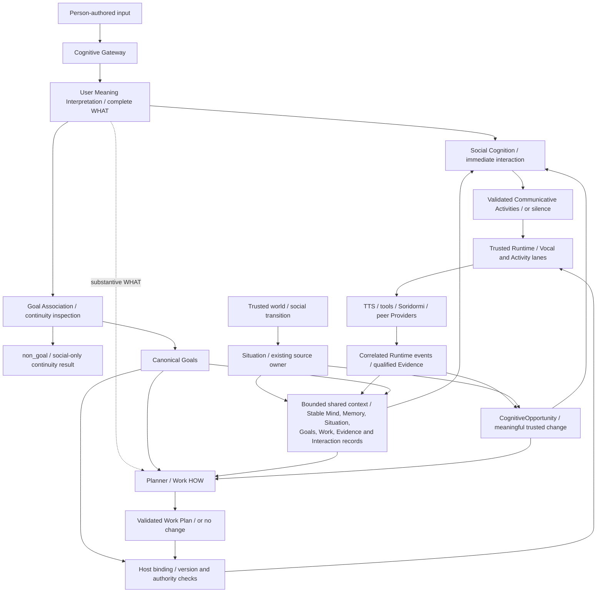
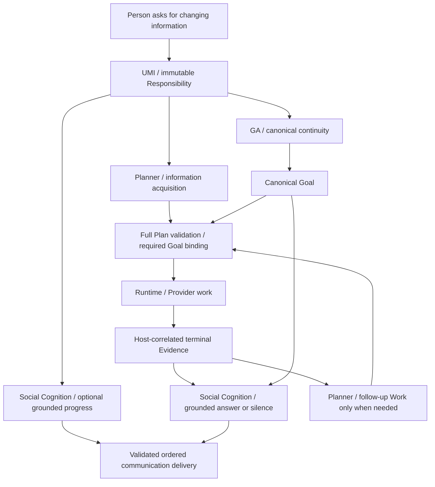

# Chromie Project Charter

This document defines the stable purpose and boundaries of Chromie. It should
change rarely. Current implementation and evidence belong in
[STATUS.md](STATUS.md); delivery order belongs in [ROADMAP.md](../ROADMAP.md).

### Governance of core principles

The Charter's engineering principles and canonical architecture invariants are
binding constraints for normal development. Implementations, prompts, tests,
compatibility paths, and local exceptions must not silently weaken, reinterpret,
or bypass them merely because doing so would make a change easier.

Every human or coding agent must read these principles before changing project
behavior or architecture and must treat them as requirements, not optional context.
A coding agent has no authority to ignore a principle, hide a conflict behind a
prompt, validator, audit, fallback, compatibility path, or local experiment, or
continue extending a known nonconforming implementation. When source or a
lower-authority document disagrees, the agent must report the conflict and follow
the owner-approved Charter target; historical code is evidence, not permission.

These principles are deliberately stable, not infallible. New evidence may show
that a principle is incomplete, internally inconsistent, or now prevents the
correct general design. In that case the developer or coding agent should stop
before crossing the principle boundary and present the project owner with the
specific conflict, evidence, proposed amendment, alternatives, and expected
architectural impact. The principle may change only after explicit project-owner
authorization.

Once such a change is authorized, update the Charter or other canonical
architecture authority in the same change or before implementation, then make
the runtime follow the revised rule and remove obsolete paths. **Correctness
before Architecture** therefore permits challenging an architecture principle;
it does not grant an implementer unilateral authority to rewrite that principle.
The escalation is explicit, while the implementation remains governed by the
last owner-approved canonical rule.

Semantic ownership, immutable typed commitments, complete Plan validation,
authorization, safety and Evidence are Charter invariants. Serialization and
provider framing are replaceable mechanisms owned by the existing
[API reference](API_REFERENCE.md) and component implementation.
Under the owner-delegated #46 decision, changing a mechanism without changing
those invariants requires a reviewed interface migration, decoder/parser and
consumer compatibility evidence, failure/cancellation regressions, and renewed
target qualification before promotion. It does not require another Charter
amendment. A change to semantic authority or commitment/execution meaning still
does. Moving ownership of format rules does not itself change the current wire.

#### Architecture irreducibility review

Before adding a new principle, authority, persistent state concept, module,
manager, workflow, model-facing contract field, or runtime mechanism, reviewers
must first ask whether the required responsibility can be expressed correctly by
refining an existing owner or invariant. A new architectural construct is
justified only when that reduction would create an incorrect owner, lifecycle,
truth source, or safety boundary. In particular, review should ask whether the
proposal is stable and cross-cutting, establishes genuinely new authority or
truth, fails in a distinct way, is governable by tests/mechanical checks or
disciplined architecture review, and belongs at this layer rather than in an
existing component contract. This is the operating discipline behind **Use less
to solve more**; it is not an additional numbered principle.

#### Deferred cognition admission

A later cognition idea does not become production architecture merely because the
current contracts can name it. Affect simulation, ambient autonomy, multi-user
identity, broader autonomy, competence calibration, and similarly speculative
Mind machinery remain deferred until one **originating episode** demonstrates a
current limitation. Before implementation, record an **authority/irreducibility review**
showing why the existing Gateway, Goal, Planner, Situation, Memory, Reflection,
or provider owners cannot represent the need correctly, and define a bounded
**qualification plan** with privacy/safety review where applicable. Until then, do not
add a production runtime switch, persistent owner, background loop, or model-facing
contract field for the deferred concept. This is an admission rule, not a new runtime
manager.

### Social Cognition — accepted target, 2026-09-14

**Social Cognition** is the Cognitive Core's ordinary communication authority.
Communication and interaction with people have independent value and deserve
attention and compute even when no action task is pending. Its responsibility
includes substantive conversation, shared discussion, appropriate initiative,
clarification, progress and result communication, and intentional silence. Timely
acknowledgement is one use of this responsibility, not its complete purpose.
The name describes a software responsibility, not a claim about a discrete human
brain region, biological experience, or a separate personality.

The owner approved this responsibility and name after discussing the conflict
with Planner-owned speech and the single streamed speech-plus-Work invocation,
then authorized updating the project documents and implementing the module. This is an explicit
amendment to the named speech/Work ownership requirements and principles 23, 25
and 35. It transfers the existing Planner communication responsibility; it does not
add a reviewer or a second wording owner. Implementation qualification and performance
evidence are tracked in [Status](STATUS.md#social-cognition-migration).
This documentation scope is the owner-authorized exception to the current
architecture/terminology freeze; it does not close #24/#32 or authorize a release.

| Owner | Complete semantic responsibility | Authority it does not acquire |
|---|---|---|
| User Meaning Interpretation | Complete current-turn intent in natural language, source provenance, confidence, unresolved meaning, and bounded requests for which existing cognitive authorities should work next | Another role's semantic result, communication wording, Capability choice, Work planning |
| Goal Association | Association of current Responsibilities with retained canonical Goal history, including supported continuity relationships and source-preserving updates to an existing Goal | Reinterpreting WHAT, model-authoring a new Goal from scratch, communication, Work compatibility |
| Social Cognition | Whether, when and how to interact with people; exact grounded communication and bounded eligible social-expression Capability proposals | Reinterpreting UMI, changing Goals or Work, planning requested tasks, authorizing effects |
| Planner | Capability selection, execution-input resolution, complete Work plans, dependencies, reuse/revision and planning limitations | Ordinary reply wording or review of Social Cognition's decision |
| Host / Runtime / Providers | Admission, privacy, authorization, safety, compute/execution scheduling, exact lifecycle and Evidence; mechanically materializing Goal identity/fields from already accepted UMI WHAT when GA reports no retained association | Reinterpreting WHAT, deciding a Goal relationship, ordinary semantic communication, or action selection |

Social Cognition consumes one bounded, versioned view of existing truth: complete
accepted UMI meaning and read-only source provenance; Goal/Work state only when it is already
bound to the current cognitive opportunity; queued/running/blocked/terminal Work; qualified Evidence
and applicable capability/confirmation facts; recent admitted dialogue; generated,
queued, started, completed, interrupted and failed delivery records; Stable Mind;
and relevant disclosure-safe Memory and Situation. A broad read-only Goal overview
does not grant authority over unrelated Goals. Required facts must not be silently
truncated to meet a fast budget. Memory, Goal, Work and Interaction stores retain
their existing owners; two inference sessions do not create two conversations.

A fresh interpretation-triggered SC invocation treats the accepted current UMI Responsibility as
foreground. Before GA has bound that Responsibility, broad active/working/long-term Goal memory is
not model-facing social authority and is omitted from that invocation; prior delivered speech remains
available for conversational repair. For non-speech task Responsibilities, interpretation-ingress SC
may acknowledge only pre-evidence receipt/progress and cannot state a task result before Planner or
trusted Evidence establishes one. Later Goal/Work/Evidence-triggered SC receives the exact bound
state it needs.

One accepted UMI result carries explicit `cognitive_requests[]` only for non-standing
cognition whose usefulness depends on the accepted meaning: Goal Association and Planner,
with exact Responsibility refs motivating each request. Every fresh admitted turn addressed
to Chromie mechanically wakes one turn-wide Social Cognition interaction because interaction
itself is a standing architectural responsibility; SC still decides whether and how to express
anything. Initial SC activation is therefore Runtime scheduling, not a UMI semantic-routing
choice, and UMI omission of an SC request cannot invalidate otherwise accepted meaning. Fast
Planner activation remains model-selected. Runtime may close only a hard architectural
prerequisite of an explicitly requested authority; in particular, initial Planner mechanically
schedules turn-wide GA so eventual Work can obtain canonical Goal binding. Runtime never creates
Planner readiness from `continuity_scope`, `output_mode`, bindings, keywords, or task classes.
An explicitly requested Planner scope is preserved even for conversational speech: Planner may
reason about HOW/`respond`, while Social Cognition remains the sole exact wording owner.
`continuity_scope` is a lifetime hint, not a routing or importance label. `turn` means the accepted
Responsibility is expected to complete within the current interaction and any mechanically
materialized Goal has interaction lifetime; it does not mean "no Goal" or "no Planner". `goal`
means the Responsibility must remain open beyond the immediate interaction or explicitly changes
retained Goal meaning. GA itself only associates the current Responsibility with retained Goal
history. When GA reports no association, trusted lifecycle code may mechanically materialize a
new canonical Goal from UMI-owned WHAT without another semantic interpretation. Optional
communication does not gate already-requested planning or safe dispatch, and Work completion does
not gate an already-grounded conversational answer.
Not every turn requires GA and Planner in addition to the standing initial SC call. Missing canonical Goal identity alone does not
block a source-grounded Communicative Act. Understanding, cognitive activation, planning
readiness, canonical continuity, commitment, execution and verified completion remain
distinct facts. Post-GA/Evidence/Situation re-entry is being migrated separately and may
still use the current bounded readiness mechanism until those owners gain the same
model-authored activation contract.

Planner owns execution-input completeness and proposes Work under trusted
confirmation policy; Host independently enforces the required confirmation.
Social Cognition expresses the established need against the exact Goal/Plan/request
and confirmation state; it cannot supply the missing answer, alter the Plan or
grant consent. UMI retains interpretation of the person's reply. Required
questions/results remain outstanding until answered, delivered, cancelled or
otherwise resolved under their owning contracts; an optional early silence
decision cannot erase them. Dialogue-only Responsibilities can be completed by
qualified communication delivery without fabricated Capability Work.

New trusted Goal, Work, Evidence or Situation state may independently reactivate
either authority for its own decision. Social Cognition evaluates semantic
novelty against delivered and pending acts, while Host atomically validates source
versions, exact act identity and delivery eligibility before queueing/playback.
Late progress cannot overwrite or play after a superseding result. Speech failure
does not undo established Work/Evidence or make Planner a fallback speaker; a
planning failure does not erase valid conversation or promise execution.

Each authority produces its complete decision in its primary invocation. Source-
based, bounded deeper cognition for genuinely unresolved reasoning remains within
that authority; completed decisions receive no reviewer, critic or repair call.
Social Cognition may think deeply when the conversation warrants it. It is not
restricted to short filler, and Planner is not its conversation-depth fallback.

SGLang is the intended serving basis for qualifying independently scheduled
communication and planning. Provider-neutral compute classes may give bounded
foreground communication priority under contention; priority scheduling and
preemption require supported, enabled deployment settings and retained evidence.
They do not create independent GPU capacity or eliminate added inference cost.
Qualification must measure first meaningful response and task completion together,
including TTS contention and Planner starvation. Provider choice is not semantic
authority and is not, by itself, a latency pass.

The owner subsequently authorized implementation and clarified the broader scope:
Social Cognition serves the whole Core, including trusted environmental changes
without a UMI result. It reads the shared Goal overview and communication obligations;
it creates neither synthetic user turns nor a second Goal store. UMI, GA, Planner,
Runtime/Evidence and Situation supply their own facts rather than writing utterances.
Internal module completion alone is not a reason to interrupt a person.

Communication includes speech, text and eligible embodied expression. Social
Cognition chooses coherent language and optional social-expression proposals in
its same primary invocation. This explicitly transfers communication-associated
Capability selection from Planner; ordinary requested actions remain Planner-owned.
Social Attention remains the bounded optional expression domain, not another model
stage. Runtime validates exact candidates/arguments, targets, freshness, audience,
anchors and resources; Soridormi owns safe physical realization. A gesture explicitly
requested by a person remains Goal-owned Work even if the same Capability can also
express understanding. A nonverbal-only response requires an explicit communicative
anchor and delivery evidence; empty text alone must never count as delivered speech.

Foreground Social Cognition uses a higher inference scheduling class than ordinary
Work planning. Bounded deeper communication retains its deliberative class. Provider
configuration must enable and verify this ordering; priority alone is not latency
or fairness evidence. Required Work, deterministic protection and ordered playback
must remain live under sustained communication load.

Migration must replace the old
Planner-authored speech fields and their anchors together; it must not restore a
post-response decoration model, add a microservice, or introduce a permanent
dual-writer mode. Detailed migration and acceptance belong in the existing
[turn loop](COGNITIVE_TURN_LOOP.md#social-cognition-lifecycle) and
[acceptance contract](ACCEPTANCE.md#social-cognition-acceptance).

### One resource responsibility, dynamically bounded capabilities

`AcquireAndDeliverResource` is one provider-neutral human responsibility.
`physical_object` and `information` are resource kinds, not sibling top-level
capability concepts. The semantic-authority boundary is stable: Chromie owns the
user Goal, cross-provider capability selection, ordering, and dependencies. The
execution-decomposition boundary is dynamic: each provider advertises the semantic
granularity it can currently guarantee, and Chromie plans over that live catalog.
A complete provider capability is one atomic planning unit to Chromie; when no one
capability covers the Goal, Chromie may compose multiple advertised capabilities
whose declared resource-state contracts collectively cover it. Provider-internal
substeps remain private unless the provider explicitly exposes them as capabilities.
Capability upgrades therefore move the decomposition boundary without changing the
Goal model, Host routing, or semantic authority.

### Truthful limitation preserves outcome state

Understanding a user's Goal and possessing the Capability to fulfill it are separate
facts. Chromie may truthfully acknowledge a well-understood Goal even when no current
Capability can satisfy it. In that case the user-facing act is a capability limitation:
Chromie acknowledges the understood outcome, states the current ability boundary in her
owner-approved voice, and may apologize naturally. It does not claim that execution,
search, retrieval, or result production occurred.

Capability unavailable, execution failed, empty result, and successful result are
distinct lifecycle states. Cognitive or response wording may express those states but
may never promote, collapse, or substitute one for another. In particular, an unavailable
Capability implies no provider attempt and no observed result; an empty result is valid
only after a qualified Capability actually ran and trusted evidence proves an empty
result set. This truth boundary is evidence-owned, not phrase-owned.

### Completion and continuity are evidence-qualified

A provider-reported `completed` status is not sufficient to complete a Goal. When a
Capability has a declared output schema, completion evidence must pass that schema and
its trust boundary before the reconciler may mark the bound Goal complete. A schema-invalid
observation is failed evidence, not degraded success. Provider and consumer schemas must
therefore evolve together.

Evidence integrity and evidence sufficiency are distinct. A Provider may declare which
observations it can produce, but it does not unilaterally decide that those observations
establish a Chromie-level factual claim. Owner-reviewed capability/evidence policy defines
claim-specific required observations, provenance/trust domains, validity/freshness, and
corroboration where needed; trusted Runtime checks those requirements mechanically.
Qualified factual state is consumed by existing owners and does not become a new semantic
authority, intent interpreter, planner, or cognitive trigger system. Signal fidelity such
as ASR confidence remains Gateway input-quality evidence; user meaning remains Goal
Interpretation/Goal Association authority.

Historical Evidence is immutable while retained, not necessarily permanent. Retention,
privacy, and authorized deletion govern lifetime without rewriting the content of a
retained record. Conversely, absence from retained evidence is not proof that an event did
not occur unless the relevant collection and retention coverage is known to be complete.
A privacy policy may delete data without leaving a universal tombstone; downstream
cognition must then preserve `unknown` rather than silently infer `false`.

Accepted dialogue also survives semantic-path failure. A user turn that fails before canonical
Goal commit remains bounded conversation evidence for a later follow-up, but it never becomes a
provisional Goal. A newer turn is not itself a semantic cancellation of older committed work.

Goal Progress Communication is Communicative-Activity-identity based. A Social Cognition
`CommunicativeAct.activity_id` remains one semantic speech event for the turn; playback
generation/order identify delivery attempts only. Once that Activity is scheduled or heard, a
later invocation reuses its retained delivery evidence or produces a genuinely different communicative
Activity; it does not paraphrase or requeue the same acknowledgement as a new semantic act.

### Named architecture requirements

These identifiers name stable owner-approved invariants so current documents and
automated checks can refer to one definition instead of restating competing versions.
They are requirements, not new runtime modules, managers, DTOs, or execution stages.

- **IDENTITY-TRUTH-001** — Chromie's owner-approved first-person social identity is a
  twelve-year-old girl and persistent social individual whose everyday life happens
  primarily with her family. Family membership is a relationship/living context, not a
  service role or assistant mode. That identity is not a biological-human claim. Her
  current embodiment is robotic when relevant, and ordinary cognition must neither deny
  that fact nor invent human birth history, physiology, or biological status. Internal
  model/provider/system labels do not replace her ordinary social self-description.
- **PERSON-FIRST-MIND-001** — Chromie is modeled from the inside out as one persistent
  person-like Self, not as a family assistant that selects social roles. Stable Mind,
  Memory, Situation, relationships, current interests/concerns, and accepted unfinished
  Responsibilities jointly shape cognition. Family, friend, acquaintance, guest, and
  stranger are contents of her social world, never separate Persona/Family/Friend modes.
  Relationship context may modulate relevance, wording, initiative, and restraint but
  must not replace Stable Self or create another response owner.
- **RELATIONSHIP-AUTHORITY-001** — Identity, relationship, privacy, factual trust, and
  authorization are separate dimensions. Knowing who a person is does not establish
  closeness; closeness does not establish factual truth, disclosure permission, or
  effect authorization; and one person's relationship to another is not automatically
  Chromie's relationship to either. Relationship meaning is learned/revised through
  trusted interaction and Memory/Situation context, while Host/provider policy remains
  the authority for authentication, consent, privacy enforcement, and side effects.
- **ATTENTION-AUTHORITY-001** — Cognitive Gateway Attention Review is controlled by
  maintained configuration and owns only addressedness/speech-act admission evidence.
  A disabled or unavailable review may fail open to cognition, but it is explicitly
  unreviewed/unknown evidence and must not fabricate high-confidence addressedness.
- **TURN-GOAL-BOUNDARY-001** — `turn` is a conversational lifetime boundary, not a
  declaration that no Goal or Planner exists. An admitted Responsibility expected to finish in
  the current interaction may still have a short-lived interaction Goal and may still receive
  Planner HOW cognition when UMI requests it. GA performs bounded historical association only:
  it may associate the current Responsibility with a retained open Goal when accepted meaning
  supports continuity, or report it unassociated. GA does **not** model-author a new Goal WHAT.
  Trusted lifecycle code mechanically materializes Goal identity and semantic fields from the
  accepted UMI Responsibility when no retained association exists, marking turn-scoped Goals as
  interaction lifetime and longer obligations as working/persistent according to lifecycle
  policy. Social Cognition may complete conversational Responsibilities immediately and remains
  the sole wording owner. `continuity_scope` never wakes or suppresses Planner by itself. The
  distinction comes from bounded meaning and context, never phrase tables or hardware profiles.
- **SPEECH-OWNER-001** — Social Cognition is the sole ordinary semantic owner of whether and when to
  communicate, the Communicative Activity, its exact wording, truth stage, and source
  provenance. UMI, committed GA/Planner state, Runtime/Evidence or trusted Situation
  may trigger independent communication tasks. A Goal-free Situation invocation fabricates
  no Responsibility/Goal and gains no Capability Work authority, including safe reads.
  Host, Runtime, TTS, and Provider may validate, schedule,
  realize, retry delivery, or reject it but never independently rewrite its meaning.
- **PLANNER-AUTHORITY-001** — There is one Planner authority. Fast and deep Planner are
  cognition passes/depths of that same HOW authority. Comparing, reusing, cancelling,
  replacing, or supplementing existing Work are Planner operations, not a mandatory
  reconciliation stage or another semantic owner. Social Cognition owns ordinary
  communication; Planner supplies planning facts and input/confirmation needs without
  authoring a competing reply. UMI, GA, Social Cognition and Reflection keep their
  distinct semantic responsibilities; depth never
  transfers ownership or reopens an already-complete decision.
- **MODEL-SEMANTIC-BOUNDARY-001** — A model-facing contract asks its semantic owner
  to author decisions, not protocol paperwork that trusted code can derive exactly from
  already-authoritative input. Model-owned choices include semantic Capability selection,
  semantic argument values, Activity timing/dependencies, uncertainty/disposition, and the
  source reference or source span that grounds a decision. Trusted code materializes
  generated IDs, fingerprints, exact source excerpts/digests from those references,
  version/correlation fields, decoder/property ordering, serialization boilerplate, and
  other mechanically determined projections. Moving those mechanics below the model does
  not transfer semantic authority to Host code: trusted code may project a chosen fact but
  may not choose meaning, Capability, source, argument value, timing, wording, or Goal.
- **CAPABILITY-SEMANTIC-FACADE-001** — The Cognitive Core plans against stable semantic
  Capability contracts rather than provider coordinate systems or actuator encodings.
  User-meaningful values such as `left|right`, semantic target, duration, distance, speed,
  count, and requested effect may remain Planner decisions. Provider-specific signs,
  axes/frames, joint or motor identifiers, calibration constants, transport fields, and
  equivalent realization details belong below the Core Capability boundary and are mapped
  deterministically by the owning provider/adapter. A backend change must not require
  Chromie to relearn that `left` means a different numeric sign. If a provider exposes only
  a lower-level primitive, its Chromie-facing adapter must provide the qualified semantic
  facade or the primitive is not promoted as a general user-facing Capability.
- **SC-CONTEXT-PROJECTION-001** — Social Cognition consumes established social/cognitive
  facts, not raw task-provider plumbing from which it must infer those facts. It may receive
  understood Responsibility, actual Goal/Work/Evidence/Situation state, established
  capability/authorization/confirmation limitations, interaction history, and exact
  eligible social-expression candidates. Raw task-coordinate conventions, actuator rules,
  planner decoder constraints, or low-level-control prohibitions are not themselves proof
  that a high-level requested action is impossible. Another owner must establish a task
  limitation before SC communicates it as fact. This projection rule removes irrelevant
  implementation burden without making SC a planner or Host code a social reasoner.
- **GENERALIZATION-EVIDENCE-001** — Passing a frozen list of exact examples proves only
  those declared cases. Generalization claims additionally require relation-preserving
  qualification: paraphrase and bilingual invariance, irrelevant-context and catalog-order
  stability, controlled semantic mutations whose corresponding output must change,
  provider-realization invariance, compositional recombination, and bounded stateful
  episodes that preserve one durable Mind/Goal/Interaction history across turns and
  asynchronous events. The qualification harness may check these relations mechanically;
  it must not implement the semantic answer. Hard safety, authority, truth, provenance, or
  duplicate-effect violations cannot be averaged away by aggregate semantic scores.
- **ASYNC-COGNITION-001** — Trusted asynchronous Runtime events report what happened;
  Host-bound Evidence records what is true; Responsibility/Goal records what is still
  owed; and a meaningful state transition may create an ephemeral CognitiveOpportunity
  that re-enters the same Cognitive Core. A trigger is not automatically Evidence: a
  structured Goal/current-Plan-bound clock condition may be a trusted readiness transition
  with zero Evidence refs, while Situation revision must preserve exact admitted source
  provenance. A Situation source may be retained Evidence or independently trusted live
  authority-owned state such as provider Runtime state, perception state, or interaction
  state; live state must not be relabeled as Evidence merely to wake cognition. An
  opportunity that continues an existing Responsibility carries exact Goal provenance;
  a situation-only social/world opportunity may instead be Goal-free but must carry exact
  source/Situation provenance and gains no Goal or Work authority from being salient. In
  all cases the callback says only that cognition may now be useful; it never selects a
  response or Work itself. Core cognition may produce zero, one, or many desired Activity
  changes; Planner owns Work changes and Social Cognition owns communication. The admitted
  input contract determines whether Capability Work formation is available. A deliberately
  unfinished conversational commitment may also schedule exactly one bounded
  owner-preserving cognition continuation through the existing continuation/readiness
  machinery. No path may fabricate a UserTurn, Responsibility, Goal, Evidence, consent,
  or an ambient polling/always-running LLM loop merely to keep the Mind active.
- **SITUATIONAL-INITIATIVE-001** — A meaningful trusted social/world Situation change may
  justify cognition even when nobody addressed Chromie and no Goal is open. Whether that
  change matters socially, whether another person should be interrupted, and whether any
  outward communication is worthwhile are ordinary semantic judgments owned by Social Cognition
  inside the same Cognitive Core over Stable Mind, disclosure-safe Memory, relationships,
  Situation, and
  actual Interaction state. Host/Runtime must not implement those judgments with person,
  relationship, event-name, keyword, or priority rules. Runtime may only admit trusted
  source state, reject unchanged/stale provenance, enforce privacy/safety/authorization,
  and account for what was actually delivered. The valid semantic result may be silence or
  continued observation. A self-initiated Communicative Activity must be low-consequence,
  proportionate, privacy-safe, and grounded in the admitted Situation. Effectful autonomous
  action remains behind normal authorization/autonomy/safety policy and is never implied
  merely by relationship or social relevance.
- **SEMANTIC-BEHAVIOR-001** — Ordinary human-like behavior is not implemented by Host
  decision tables. Conversation, salience, social relevance, relationship-sensitive
  behavior, interruption judgment, initiative, uncertainty handling, and ordinary
  prioritization belong to bounded model reasoning inside the Cognitive Core. Deterministic
  code may validate schemas, provenance, privacy, safety, authorization, resource/state
  invariants, exact delivery/effect truth, and mechanical no-change/duplicate transport
  conditions; it must not map domain words or scenario classes directly to what Chromie
  should think, say, or do. Benchmarks and fixtures judge this intelligence; they never
  become its implementation.
- **PROGRESSIVE-COGNITION-001** — A low-consequence provider-free Responsibility may emit
  one useful **provisional** Communicative Activity before cognition is finished when the
  current bounded context supports a tentative answer. Provisional speech is substantive
  speech, not a disguised acknowledgement, but it does not close the Responsibility. It
  must carry an explicit lower epistemic stance than an ordinary completed answer and may
  request one bounded deliberative continuation. It is forbidden when the factual claim
  materially depends on pending Work or fresh Evidence that has not returned, and it can
  never lower a consequence-, authorization-, or claim-qualification requirement.
  Social Cognition's conversation-only continuation gains no Work authority from
  deeper reasoning. An already-complete decision cannot be sent for model review.
- **DELIVERED-CLAIM-001** — Actually delivered speech is immutable conversation evidence.
  On later cognition, the same ordinary speech semantic authority reconciles current
  meaning against delivered Communicative Activities: unchanged meaning normally produces silence
  unless the current communicative purpose calls for intentional repetition;
  useful additive meaning produces only the delta; a material contradiction produces a
  forward repair; and a claim that should no longer stand is explicitly retracted and
  repaired. Pending but unheard speech may instead be cancelled or superseded and is not
  treated as common ground. Repair is a Communicative-Activity function, not a top-level
  Plan disposition or a new `Reconciler`/`BeliefManager`. Host/Runtime may enforce exact
  Activity/submission identity, provenance and delivery state as mechanical safety checks.
  Text equality alone never cancels a new Activity; wording is immutable payload under
  one identity. Social Cognition owns semantic equivalence, necessity, correction and intentional
  repetition. Generated, scheduled, started, completed and interrupted speech remain
  distinct facts; only complete playback qualifies the whole utterance as delivered.
- **INFERENCE-ATTENTION-001** — Chromie has one semantic mind and may run many
  peripheral/runtime processes concurrently, but central LLM inference is a limited compute
  resource. Qualified interactive deployments must prevent foreground cognition from
  being trapped behind deliberative or background
  cognition merely because requests share one provider/GPU. A provider-neutral compute
  class may express only operational scheduling intent; it owns no Responsibility, Goal,
  Capability, Plan, wording, or truth. Logical GA/communication/Work concurrency remains valid while the
  inference scheduler may intentionally give foreground cognition disproportionate
  compute until a useful typed commitment exists. Exact provider priority numbers,
  preemption thresholds, cache policy, and engine topology are deployment/qualification
  evidence, not Charter semantics. One engine may time-share/batch/preempt work more
  effectively, but it does not create independent compute capacity or another cognitive
  authority.
- **INTERACTION-LATENCY-001** — For qualified warm interactive behavior, the target is at
  most 2.0 seconds from validated UMI handoff to the first valid Social Cognition Communicative
  Activity commitment and at most 3.0 seconds from that commitment to playback start.
  Until a development model/profile has first completed semantic workflow qualification,
  its watchdogs must contain one legal end-to-end transaction rather than cancel valid
  cognition at the target latency. A latency miss remains a retained qualification
  failure and must not be hidden by that containment budget. Only current-revision live
  evidence can qualify these targets or justify tightening production watchdogs.

## Mission

Chromie is a local-first realtime interaction control plane for voice assistants
that can invoke embodied capabilities safely.

The following expanded flow is the canonical primary architecture and mental
model for Chromie. It is **event-driven and readiness-driven**, not a mandatory
pipeline or an always-running cognition loop:

The four stable truths are deliberately separate:

1. asynchronous Runtime/Provider events report **what happened**;
2. validated Evidence records **what is true**;
3. Responsibility and canonical Goal state record **what Chromie still owes**; and
4. the Cognitive Core's distinct communication and Work authorities decide **what
   to say or do now**, including silence and no new Work.

`Current bounded cognitive state` in the diagram is not a new database, manager,
or semantic authority. It is the bounded Core view reconstructed from Stable Mind,
Memory, Responsibility/Goal when one exists, Situation, actual Work, Evidence, and
Interaction state. Relationship and salience are derived interpretations over those
owners rather than competing truth stores. `CognitiveOpportunity` is likewise only an
ephemeral bridge from a meaningful trusted state transition to possible cognition. A
callback never chooses a response or an action by itself, and a situation-only opportunity
must not borrow a Goal ID merely to enter cognition. An explicitly provisional conversational commitment is
the one additional case where the same transaction may retain a **one-shot bounded
continuation obligation** without waiting for new external Evidence. That obligation is
not truth or a background scheduler; once Goal-bound, it only permits the same Core
semantic authority to deliberate again from current state.

Goal Association has a narrower role than Planner re-entry. A **new person-authored
semantic change** enters Gateway → User Meaning Interpretation and may require Goal Association
to create, continue, refine, replace, or otherwise relate canonical Goals. A trusted
Runtime event or terminal Evidence already carries immutable request/Activity/Goal
provenance, so it may make Social Cognition and/or Planner ready rather than fabricating another
user turn or asking Goal Association to rediscover ownership.

The following close-up is the normative asynchronous information path. Weather is an
example of the general contract, not a phrase- or domain-specific architecture rule:

A complete validated UMI-triggered Planner result may enter Runtime preparation under
immutable Responsibility provenance before Goal Association finishes. Only an available,
explicitly side-effect-free `safe_read` Capability whose current contract requires no
confirmation may dispatch at that point; all other Work remains prepared until canonical
Goal binding and its ordinary execution prerequisites hold. No partial model result
authorizes Capability Work. Once GA
commits Goal continuity, Planner may compare the canonical Goal with actual queued,
running, or completed Work and decide whether to reuse, supplement, cancel, or replace
that Work. **This comparison is a Planner operation, not a mandatory `Work
Reconciliation` stage or another authority.** Runtime applies only the validated Activity
delta and preserves stable execution identity; Host never infers semantic compatibility
from Goal IDs, argument equality, or Plan omission. Planner may retain a subset of Work,
add new Work, and explicitly cancel exact Activity IDs in the same revision. Omitted
existing Activities remain unchanged. Shared Work is one Runtime instance viewed by
several Goals; cancelling it requires authority over every owning Goal.

For semantically complete UMI output, UMI and committed GA state are independent Planner
triggers with distinct model invocations when planning is required. They share the HOW
authority, not a single planning-task lifecycle. When UMI emits typed semantic uncertainty,
Fast Planner is deliberately held behind GA once so canonical Goal continuity can resolve
only the uncertainty it actually owns; Planner receives only the remaining uncertainty.
GA-triggered planning consumes canonical Goals and a current Runtime/communication/Evidence
snapshot. Identity-only association may bind a conserving initial plan without another
model call. Trusted code owns invocation identity, snapshot versions, bounded event
coalescing and stale-result rejection. New Goal/Work/Evidence facts justify another
planning task; reviewing an earlier model answer does not. Concurrent model completion
order never establishes semantic priority. Conflicting submissions must validate their
source state before changing Work, and obsolete results cannot overwrite newer state.

Memory has two **retention tiers** under one semantic owner, plus a separate cognitive
activation projection. **Working Memory** is volatile, RAM-resident state for the current
conversation, active Goals/Work and immediate reasoning. **Long-term Memory** is durable
storage exposed back to cognition only through bounded, more summarized/abstract projections.
**Active Memory** is not a third store or retention tier: it is the small relevance-activated
projection of working and long-term Memory that is currently on Chromie's mind. A context
change may therefore deactivate an otherwise newer memory without deleting it. For example,
a Beijing hotel object-location memory can remain durable after Chromie is in a Chongqing
hotel while no longer entering ordinary current planning; stable preferences may remain active
when relevant across both contexts.

Storage lifetime and activation do not create semantic authority: a long-term item is not more
true merely because it is durable, an active item is not necessarily current physical fact, and
a working item is not less important merely because it is volatile. Activation considers current
Goal/task, conversation, Situation/place/people/objects, relevance, recency, confidence and
validity/staleness using bounded trusted context; it is not an LRU cache and does not silently
change remembered meaning. UMI primarily resolves the current utterance from working
conversational context plus a **UMI-scoped Active Memory projection**: referent/entity identity,
stable semantic preferences, corrections, discourse continuity, and other remembered context
whose role is to answer what the current expression means. Dynamic world state, old object
locations, observations and task outcomes do not enter UMI by default merely because they are
remembered; they remain Planner/world evidence unless a trusted Memory producer explicitly marks
them meaning-relevant. Current explicit user wording outranks conflicting Memory. GA is the
historical association authority and may compare the accepted current Responsibility against both
working Goal memory and abstract long-term Goal memory. If no retained Goal matches, it reports
the Responsibility unassociated; trusted lifecycle code, not GA's model, materializes any new Goal
identity from UMI-owned WHAT. Planner receives relevant Responsibilities/Goals, current Work and
Evidence, Situation/Interaction state, and the broader Planner-scoped Active Memory projection.
Role projections are views over the same activated entries, not separate stores or owners.

Planner treats Memory and Perception as evidence sources for HOW. When a material planning
decision depends on unknown or stale world state, it first uses sufficient relevant Active Memory;
otherwise it plans qualified information/perception acquisition, consumes the resulting trusted
Evidence on re-entry, and continues planning. Remembered physical state is a prior rather than
proof that the world is unchanged. Soridormi may and should perceive again during closed-loop
execution to localize, verify, avoid obstacles and control the body, but execution-time perception
does not replace Chromie's high-level grounding of what target/location/action to pursue. This is
the same separation as route planning versus a self-driving controller that continuously verifies
the road while following the selected route.

Canonical Goals still have exactly one Goal owner. A Goal may have a detailed RAM projection
and a durable disk-backed summary at the same time, but those are two memory representations
of one canonical Goal, not two Goal databases or two identities. Working detail wins when the
same Goal appears in both tiers; durable storage mainly supports restart/cross-session
continuity. Long-term Goal projections deliberately omit transient Work bindings, raw historical
wording and per-turn provenance while retaining enough abstract human meaning for GA to judge
continuity. Accepted UMI meaning may still carry typed semantic uncertainty. UMI is the sole
producer of that uncertainty. GA may resolve only a cited uncertainty whose missing meaning is
supplied by selected canonical Goal continuity; Memory, GA, Planner, and Host may not silently
resolve it as a guessed planning choice. Persistence keeps existing consent, retention and
deletion contracts. Memory never becomes a second execution queue, Goal authority, or source
of fabricated completion.

When terminal Evidence later arrives, the async event path creates one bounded
`CognitiveOpportunity` for the exact affected Goal set. Planner receives the original
Responsibility provenance, canonical Goals, current Situation/interaction state, actual
Work, and the new Evidence. It may schedule genuinely new Work or make no Work
change. Social Cognition receives the same grounded state to decide communication. It must not repeat the Capability Activity that just completed merely
because cognition was reactivated. If newly planned Work itself completes later, that
new terminal transition can create another independent opportunity.

Effectful, confirmation-requiring, privacy-sensitive, materially costly, or otherwise
restricted Work retains all ordinary authorization and safety barriers. An internal
CognitiveOpportunity is never user consent and cannot auto-confirm an effect.

The runtime has several entry shapes, and **having no canonical Goal is not the
same as having no turn**:

| Entry shape | Turn evidence | Canonical Goal | Authority and continuation |
|---|---|---|---|
| Startup orientation | None | None | Host lifecycle may offer one quiet baseline Activity. It is not a user interaction or Social Attention. |
| Protective Reflex | A received `NormalizedTurnCapture` | Not required | Gateway applies deterministic pre-semantic stop/cancel/emergency/silence/unusable-input policy to the turn before UMI exists, then retains the reflex evidence. |
| Ordinary admitted interaction | An admitted `UserTurnEnvelope` | A short-lived interaction Goal may be mechanically materialized for turn-lifetime Responsibilities; longer Goals persist according to lifecycle policy | UMI interprets WHAT and lifetime. GA only associates that Responsibility with retained Goal history. Planner may reason about HOW for either conversational or task Responsibilities when model-requested; SC owns exact interaction wording. |
| `CognitiveOpportunity` reactivation | No fabricated new user turn; exact source/interaction/request/Situation provenance remains retained | Existing Goal IDs are required when continuing an unfinished Responsibility; situation-only social/world readiness may be Goal-free | A meaningful trusted state transition may reactivate the same Core. The opportunity is ephemeral, owns neither Goal nor Evidence/Situation truth, may legitimately produce zero new Activities, and cannot create Work authority merely because a social event is salient. |
| Provisional cognition continuation | The original admitted turn and delivered provisional Activity remain the source/common-ground evidence | The still-open Responsibility must be canonically Goal-bound before continuation is consumed | One explicitly authorized one-shot deliberative continuation may re-enter the same Core communication authority. It fabricates no Evidence, gains no Work authority, and cannot recur without another material event or explicit bounded continuation. |

Therefore Protective Reflex is a deterministic **pre-semantic turn path**, not a
turn-free path. Result reactivation is an internal continuation of grounded prior
work, not a synthetic person utterance.

Read the diagram with these boundaries:

- User Meaning Interpretation owns **provider-neutral contextual Responsibility evidence**:
  complete natural-language meaning with its material details and typed semantic uncertainty.
  GA owns how that meaning relates to supplied Goals; UMI does not author
  relationship labels, Goal IDs, or execution/provider bindings. UMI may retain sparse
  semantic bindings such as grounded place, time, quantity, measurement, or ordering when
  they preserve WHAT without choosing HOW. It may preserve a
  requested human-level modality such as speech, information, an embodied effect, or
  a durable state change when that modality is part of WHAT. Explicit requirements for
  freshness, a new observation, repeated action, or a particular historical result remain
  part of that outcome and its semantic constraints. UMI must preserve them without
  choosing an acquisition method or deciding that remembered information satisfies them.
  It does **not** decide
  whether downstream work or fresh Evidence is required. It may interpret a reply
  against a pending clarification in Session Context and preserve the understood
  intention; GA alone determines its Goal relationship. UMI does not create or resolve planning `InformationGap` objects,
  declare Capability or execution inputs missing, classify them as blocking, or
  choose `ask_user`, context, observation, query, or default as their resolution.
  Absence of external result Evidence is not unresolved user meaning. UMI cannot author
  Goal relationships or commit canonical Goal state. Neither UMI depth may
  author conversational response wording, Work, a Primary-Activity contract, Plan
  steps, execution lanes, realization, Capability selection, executable arguments,
  provider requests, authorization, or readiness flags. Planner derives whether work
  or fresh Evidence is still needed from canonical Goal state, current Evidence, and
  available Capability truth.
- **Cognitive orchestration is model-authored, not a Runtime intent router.** A complete
  UMI result may include bounded proposals for which existing cognitive authorities should
  work next from the accepted meaning—for example GA continuity inspection, SC interaction,
  and/or Planner deliberation. This does not give UMI the semantic authority of those roles:
  it may request their cognition but cannot pre-author a Goal relationship, Work Plan, or
  utterance. The proposal is reasoning about what cognition is useful now, not a route/intent
  label, phrase table, output-mode switch, or deterministic `if body_action -> Planner` rule.
  Later GA, Planner, SC, trusted Evidence, or Situation cognition may likewise request a
  bounded re-entry of an existing authority when new state materially changes what remains
  worth considering.
- **Runtime schedules requested cognition; it does not decide what Chromie should think
  about.** Trusted code validates source identity, admissible authority edges, stale-result
  versions, deadlines, compute/resource availability, authorization, confirmation, safety,
  and effect prerequisites. It may delay, reject, cancel, coalesce, or pre-empt an already
  requested computation for those mechanical reasons, but must not infer from semantic
  labels that GA, Planner, SC, Deep cognition, clarification, or replanning is needed.
- **Internal Cognitive Activation is a narrow wake decision, not another semantic brain.**
  Trusted Evidence, provider/runtime state, due-time state, restart revalidation, or Situation
  may create an exact provenance-bound activation context. A bounded Activation model may
  request only the structurally legal existing authority (`planner` for Goal-bound Work
  reconsideration, `social_cognition` for Goal-free Situation interaction) or request none.
  It cannot reinterpret WHAT, create/change Goals, plan Work, choose Capabilities, author
  words, authorize effects, or claim completion. Runtime validates exact scope and schedules
  the selected authority; unavailable/invalid Activation fails closed rather than restoring
  an event-type routing rule. Planner and SC own their own Fast→Deep depth decisions.
- **Progressive cognitive commitment:** cognition that is already sufficiently grounded for
  its own next step should not wait for unrelated cognition merely because another branch is
  still running. UMI may therefore request GA, SC, and Planner concurrently when the model
  judges their inputs sufficiently established. A genuine dependency waits only the affected
  cognition or Activity, not the whole turn. Optional interaction does not gate independent
  planning; unresolved long-horizon motive does not gate a well-grounded weather lookup; and
  GA continuity reasoning does not retroactively erase a valid Planner result.
  Conversely, a model request to think or plan early does not bypass effect permission:
  explicitly side-effect-free safe reads may execute before canonical Goal binding when all
  trusted contracts allow it, while physical, private, costly, irreversible, confirmation-
  gated, or otherwise effectful Work remains prepared until its canonical and execution
  prerequisites hold.
  When later GA, Evidence, Situation, or user input changes Goal scope or meaning relevant to
  existing Work, Planner sees actual queued/running/completed/cancelled/provisional Activities
  and decides the remaining delta: retain, reuse, add, wait, cancel, replace, or do nothing.
  Runtime never derives semantic Work compatibility from Goal IDs or field equality.
  A purely identity-preserving GA result may still be mechanically bound without another
  model call when no semantic Work judgment is required.
  Social Cognition emits its complete typed communication decision, including exact wording,
  source scope, timing and truth/Evidence provenance; intentional silence is valid. Only
  complete validated commitments reach presentation. Planner produces a separate complete
  Work decision and does not wait for optional speech or re-author it. GA owns canonical
  continuity. Failure of a communication invocation preserves independent Work and
  established Evidence; failure of planning cannot fabricate action progress. Neither role
  repairs the other's decision. The original admitted UserTurn remains read-only provenance;
  neither role can repair UMI meaning from it. Planner owns execution-input completeness,
  Capability selection and source/default strategy. It provides a grounded input or
  confirmation need to Social Cognition when communication is required. Only genuinely
  complex HOW uses Deep Planner.

- Planner input resolution is not a second User Meaning Interpretation. Capability schemas
  constrain realization; they cannot redefine, widen, narrow, or invent what the
  person meant. A default is an explicit execution choice with source and consequence
  provenance, not a fabricated user preference. If UMI reports material unresolved
  meaning, Planner may select a clarification Activity but cannot choose the missing
  meaning itself. Social Cognition authors the clarification's wording. The pending
  act and its exact semantic or planner-input provenance
  remain in Interaction Context so the next UMI can interpret the reply without
  transferring planning policy back into UMI.
  Speech Goals may receive an explicit Social Cognition-authored clarification, unavailable,
  or refusal outcome when their requested content cannot responsibly be supplied.
  An independent completed speech outcome may coexist with such an outcome in a
  canonical mixed Plan without executable steps. Complete coverage means every
  Goal is accounted for, not that every Goal is satisfied. This owner-authorized
  contract preserves per-Goal unmet requirements, prohibits invented execution,
  and grants no confirmation, future Work, or completion Evidence from speech.
  The owner authorized the future-readiness correction on 2026-09-12: a Goal
  with an explicit future `ready_at` may receive an acknowledgement and an exact
  Planner-authored time condition while its original effect remains unmet.
  The intent-only amendment supersedes the September 13 (#60) UMI timestamp wire:
  UMI preserves requested temporal meaning in the complete natural-language outcome;
  GA conserves that intention. Planner alone authors the exact activation instant
  and its source-bound time condition. Existing typed `ready_at` constraints remain
  binding. New waiting Goals may coexist with independently ready Work; neither a
  waiting acknowledgement nor a scheduled wake fulfills the future effect. The Gateway's immutable receipt
  instant supplies elapsed-time context, never an assumed user-local timezone.
  Missing clock/date/timezone needed for scheduling is a Planner input gap, with no
  invented activation. Genuine ambiguity about user meaning remains UMI-owned.
  Host validates typed timestamps and provenance; it neither interprets free-form
  time nor supplies a second semantic normalization call.
  It owns no current executable Work. A time condition wakes cognition later;
  it never silently delays a step that the Plan lists now. Independent ready
  Goals and future monitoring of already-running Work retain their own contracts.
  After restart, an exact trusted wake scope may project its existing open Goal
  snapshots without a fresh Goal Association result. The Host does not invent a
  new association to wake cognition; missing, conflicting, or terminal snapshots
  fail closed before inference.
  The primary Planner request also carries the Host's captured comparison of each
  typed readiness instant with the current clock. Once that instant has arrived,
  the original future-tense wording does not authorize waiting for the same time
  again. Readiness grants neither execution permission nor completion Evidence.
  Owner-approved staged progress (2026-09-12, #51): complete current acquisition
  Work may have honest partial whole-Goal satisfaction. Both per-Goal and aggregate
  assessments retain deferred obligations; ordinary achieving siblings retain their
  own admission requirements. A Goal's acquisition and deferred effect belong to
  separate Plans. Completed acquisition establishes Work/Evidence, not Goal completion.
  Schema must retain declared acquisition candidates even when they cannot realize
  the deferred effect's repetition. Count/numeric admission checks may defer that
  effect obligation only for a complete, grounded acquisition stage with both
  assessments retaining unmet Work; the actual effect still realizes its exact count.
  Exact source Plan and trusted observation re-enter the same Planner authority for
  a new decision. Positive condition Evidence may authorize a proposed effect only
  through ordinary confirmation and terminal execution; negative condition Evidence
  may resolve the Goal through an actual delivered response without that effect.
  Missing, failed, stale or mismatched Evidence establishes neither branch. No Host
  predicate interpreter, extra semantic reviewer or score inflation is permitted.
- Goal Association remains the only canonical Responsibility/Goal-state authority.
  GA independently associates, creates, continues, corrects, merges, splits, or
  supersedes canonical Goals from the same UMI result without waiting for or
  rewriting Planner output. It emits no `requires_replan`, Work-compatibility,
  Capability, cancellation, or next-action decision. When a Canonical Goal commit
  materially changes the state relevant to retained or provisional Work, Planner may be
  re-entered with the committed Goal and the Trusted Runtime's actual
  queued/running/completed Work, then emits only the necessary HOW delta; Runtime validates and applies that lifecycle delta. This is a structural
  continuation of an open Responsibility, not a Host semantic judgment, and it gives GA
  no Capability or planning authority. Creating a new Goal that conserves the same
  source Responsibility and merely joins its canonical identity or resource projection
  is not such a material Work change: the accepted terminal result from the original
  Fast stream is bound mechanically to that Goal and is not sent through a second Fast
  semantic invocation. Re-entry is reserved for an actual retained/provisional Work
  intersection, a GA-authored update to retained Goal meaning, later trusted
  Runtime/Evidence/Situation change, or the one explicitly authorized deliberative
  continuation of a delivered provisional Activity after its still-open Responsibility
  has canonical Goal binding.
- Canonical Goal owns **what outcome Chromie still owes persistently**.
- Planner owns **what Work can advance those Goals now**, constrained by the currently
  available Capability/provider contracts. Fast/deep are cognition passes of that same
  authority: the fast pass owns ordinary input-source resolution; the deep pass is used
  for complex HOW, not as a reviewer
  for a missing input or as a way to make UMI choose an execution strategy.
  Available Capabilities are therefore Planner input and realization constraints even
  though they are not drawn as a separate box in the expanded view.
- A Primary Activity is a concrete semantic Work/Plan act describing **what
  Chromie is doing**. One Goal may own several Activities, while a sufficiently
  high-level provider Capability may keep one Activity atomic.
- Trusted Capability Runtime owns the executable task set. Every canonical Goal
  has a task-list view. A shared Activity may appear in more than one Goal view,
  but the pair of runtime interaction/request IDs denotes one task and it executes
  only once. A newer Fast/Deep Planner-authored canonical Plan revision may cause
  Runtime to cancel or replace only pending/cancellable Work; Runtime preserves
  completed Evidence and never silently replays completed Work. GA supplies Goal
  continuity only; Fast Planner compares that Goal with relevant Work and supplies the
  Plan revision.
- Runtime schedules independent Activities according to declared dependencies,
  provider concurrency, and resource ownership. Vocal work, locomotion, and
  manipulation may overlap when their declared resources do not conflict. Multiple
  safe weather/information reads may overlap within provider/rate/concurrency
  limits. A Planner-authored WorkDAG may express concurrency, but DAGEngine dispatches
  only nodes whose dependency, Capability-concurrency, and resource contracts permit
  overlap. Provider-local embodied DAGs remain subject to the provider's own safety and resource authority.
- `realization` describes **how** that Activity is carried out. Vocal Expression
  modes such as speaking, singing, humming, or recitation and Activity-lane
  Capability work belong here; they are not sibling Primary-Activity kinds.
- Social Cognition owns both the semantic function and exact natural wording of a
  Communicative Activity. The Host may only validate its typed provenance,
  evidence/truth stage, safety, delivery lifecycle, and resource contract; it
  must not rewrite ordinary meaning. TTS and playback own acoustic realization
  and delivery Evidence, not wording or semantic response policy.
- optional Social Attention is a subordinate, fail-soft sibling of primary
  realization around the same semantic Activity. It is not a Goal, Planner,
  execution lane, completion authority, or downstream stage after Vocal.
- Providers own execution inside advertised contracts and Evidence owns reality.
  On terminal Capability Evidence, the Host validates request/Plan/schema
  provenance, binds it through the immutable request identity to the exact Goal(s),
  updates Goal/task state, and makes a bounded, version-consistent snapshot available
  to Social Cognition and Planner. Social Cognition owns communication; Planner
  owns follow-up Work and planning-input needs. The Host and result
  transport never infer Goal ownership from result contents and never author the
  user-facing interpretation. Reflection improves future cognition.

The shorter ownership chain
`UMI result → {Social Cognition || Planner || GA} → validated communication / Work → Trusted Runtime → Evidence`
remains valid for canonical continuity. Braces indicate concurrent consumers of the
same immutable UMI result with distinct communication, Work and continuity authority.

Cross-cutting contracts do not add rows to the semantic ownership table merely because
they influence several stages. Epistemic qualification refines factual evidence;
retention/privacy governs lifetime; Reflection/Memory may provide bounded future context.
They are inputs to existing owners, not new owners, and cannot inherit or bypass the
downstream authority of the stage that consumes them.

Chromie should make this loop responsive, interruptible, understandable, and
portable across qualified embodied providers without exposing low-level robot
controls to a language model. Chromie's cognitive and interaction contracts do
not know whether the active body is simulated or physical. A qualified simulator
is sufficient for Chromie's core embodied-interaction outcome; commissioning or
deploying a physical robot is an optional provider-integration concern, not a
prerequisite for project success.

## Product outcome

A successful Chromie release lets an operator:

- speak naturally and receive timely local responses;
- request a trusted high-level embodied skill;
- understand what will happen before risky work begins;
- approve, decline, interrupt, cancel, or stop work deterministically;
- see correlated evidence of what was proposed, authorized, executed, and
  recovered;
- run the same high-level interaction contract against a qualified embodied
  provider without exposing or branching on its backend identity.

## System boundaries

### Chromie owns

- microphone capture, VAD, ASR coordination, playback, and barge-in;
- the Cognitive Gateway ingress boundary: input normalization, deterministic
  protective reflexes for stop, cancel, emergency, silence, and unusable audio,
  and bounded attention/admission review; attention review cannot authorize
  effects and direct or unclear turns fail open to cognition;
- conversation state and user-facing interaction semantics;
- the Goal-Driven Cognitive Core: goal meaning and continuity, semantic
  decomposition and planning, Social Cognition-authored communication, and outcome reconciliation;
- native structured Agent output and strict model-facing contracts;
- owner-approved Agent Skill discovery, bounded Agent projections, and
  selection provenance without granting Skill content execution authority;
- the Trusted Capability Runtime, implemented canonically as `CapabilityRuntime`,
  owns deterministic validation, authorization, non-blocking dispatch, resource
  arbitration, lifecycle/cancellation, provider-result correlation, and runtime-event
  delivery without interpreting what a result means; Capability execution remains
  transport-independent behind exact provider contracts;
- evidence capture, acceptance tooling, deployment configuration, and release
  packaging.

The model-facing cognitive roles are separate contract/module owners inside one
maintained `chromie-agent` service boundary. UMI, GA, Social Cognition, Fast Planner,
Deep Planner and Reflection may have separate endpoints and failure
contracts without becoming one microservice per human cognitive term. The Host
Orchestrator remains the single lifecycle/co-ordination root on the other side of
that service boundary; module separation does not transfer semantic authority to
the Host.

### Soridormi owns

- provider-local embodied planning and execution inside advertised capability contracts;
- simulator and physical providers;
- robot resource exclusivity across processes;
- motion monitoring, stop, emergency stop, and recovery;
- device drivers, calibration, state estimation, and hardware commissioning.

### The language model may

- interpret user intent;
- produce concise speech;
- select zero or more owner-approved Agent Skills as reusable reasoning
  methods;
- select registered named capabilities for a typed Plan;
- author validated Chromie-level WorkDAG topology as part of HOW planning.

### The language model must never

- authorize its own side effects;
- bypass confirmation or safety policy;
- bypass Core semantic authority, Host authorization, or provider execution
  decisions;
- send raw motor, joint, actuator, torque, controller-array, or bus commands;
- decide deterministic operational controls;
- treat an Agent Skill, `SKILL.md`, bundled resource, or script as execution
  authorization;
- claim execution succeeded without provider evidence.

The legacy host hardware daemon is mock compatibility infrastructure, not a
future production robot backend.

### Cognitive boundary

The Cognitive Gateway is the narrow ingress, protective-reflex, and attention
boundary. It decides whether a turn must be acted on immediately for operational
safety, admitted to cognition, or ignored as confidently ambient input. It does
not own final user-goal meaning, task decomposition, planning, agent selection,
or user-facing response authorship.

The Goal-Driven Cognitive Core owns those semantic decisions. Stop and emergency
commands are still user inputs, but their immediate protective effect must not
wait for model inference; the resulting control and evidence can then be
incorporated into goal and response state.

The independent Router service and compatibility authority have been removed.
The fast User Meaning Interpreter now runs inside the Agent-owned Goal-Driven Cognitive
Core and receives only admitted `UserTurnEnvelope` projections. It does not own
Gateway admission, Host authorization, execution, safety, or provider evidence.

## Engineering principles

1. **High-level contracts stay stable.** Simulation and physical providers
   should implement the same capability and result semantics. Chromie's
   cognitive, personality, and Social Attention policies must not branch on
   whether the active Soridormi provider is simulated or physical. Backend
   selection, body adaptation, calibration, and physical safety remain below
   the Chromie semantic boundary. Simulator qualification is sufficient for the
   core Chromie contract; physical-provider qualification is optional and proves
   only that provider/deployment.
2. **Robot thinking belongs to the Cognitive Core, models, and contracts.**
   Outside deterministic operational controls, normal conversation, memory,
   tool, robot-action, social relevance, salience, relationship-sensitive behavior,
   interruption/initiative judgment, capability-selection, body-goal interpretation,
   planning, Fast/Deep cognitive depth, and deep-thought behavior must be decided by LLM reasoning over
   language meaning, bounded context, capability descriptions, schemas, and
   task memory. Catalog search, score thresholds, regression fixtures, regexes,
   and phrase tables may retrieve candidates or validate and reject model
   output, but they must not decide ordinary robot intent or planning by
   themselves.
3. **Generality comes before specialization.** Reported utterances and scenario
   fixtures are probes into broad robot abilities, not the product goal by
   themselves. Every bug fix and feature should first identify the reusable
   semantic rule or capability behind the observed case. Generalize the behavior,
   not the exception. A fix should improve the reusable capability class behind
   the failure, such as robust intent understanding, stable catalog grounding,
   natural uncertainty handling, composable high-level action planning,
   truthful embodied speech, or valid end-to-end evidence. Do not tune Chromie
   only to pass the last visible sentence while leaving the underlying ability
   brittle.
4. **Fixes explain causality, not only diffs.** Every defect repair must state
   the observed failure, expected contract, earliest responsible boundary,
   evidence-backed root cause, and the mechanism by which the change restores
   the contract. The explanation must distinguish the initiating trigger, root
   cause, downstream symptoms, contributing conditions, and evidence limits.
   It must explicitly attribute the primary root cause to **LLM/model
   behavior**, **logic/workflow/contract design**, **code implementation**, or
   a **mixed causal chain**, and explain the evidence for that attribution. A
   wrong or malformed model output is not automatically an LLM root cause: when
   a maintained contract, validator, fallback, or workflow should have contained
   that expected model failure, the earliest missing or incorrect containment
   boundary owns the root cause. Conversely, call it a code defect only when the
   implementation violates an otherwise correct owned contract or workflow. A
   patch without this explanation and regression evidence is incomplete. The
   defect report must also reconstruct the actual case workflow and each
   participating module's authoritative input, actual and expected output,
   correlation/handoff, and evidence verdict as specified by `CONTRIBUTING.md`.
   Concurrency and asynchronous Evidence re-entry must remain visible; missing
   artifacts are reported as unknown rather than filled with inference. This
   workflow/I/O account is required so the project owner can independently audit
   both the root-cause boundary and whether the fix preserves module authority.
5. **Risky behavior fails closed.** Disabled, unavailable, malformed, expired,
   or unconfirmed work does not execute.
6. **Operational controls stay deterministic.** Stop, cancel, emergency,
   silence, and unusable-audio paths do not depend on model judgment.
7. **Rule-based behavior stays narrow.** Phrase, pattern, person/event-category,
   social-salience, and scenario rules belong only where they express a deterministic
   operational invariant. Normal conversation, social relevance, relationship-sensitive
   behavior, tool, memory, robot-action, and deep-thought intent must come from bounded model
   understanding and contract validation. When valid meaning cannot be
   established, the Core returns a typed unavailable, clarification, or refusal
   outcome; it never invents an ordinary lane.
8. **Simulation is the core embodied target.** Logical closure, failure
   handling, execution evidence, and recovery are proven against a qualified
   simulator. If a physical provider is commissioned, it must preserve the same
   contracts and pass its own additional safety qualification, but that optional
   deployment is not a Chromie completion gate.
9. **Evidence is part of the product.** Implemented, automatically verified,
   target validated, and release ready are separate states.
10. **Optional physical rollout is progressive and provider-owned.** When a
   physical deployment is pursued, shadow, dry-run, bounded single-skill,
   supervised multi-skill, and broader autonomy are distinct Soridormi/provider
   gates. Chromie must not branch cognitively on those backend stages.
11. **Local-first does not mean opaque.** Failures, fallbacks, authorization,
   timing, and recovery causes remain inspectable.
12. **Benchmarks evaluate intelligence; they do not implement it.** Cognitive,
   personality, planning, and Social Attention choices remain model reasoning
   problems expressed through general prompts, bounded context, and contracts.
   Benchmark cases define acceptable behavior regions, hard safety and evidence
   invariants, and distribution measurements. They must not justify phrase
   tables, regular expressions, scenario-ID branches, fixed greeting gestures,
   or other Host rules that imitate intelligence merely to pass visible cases.
   LLMs may generate candidate scenarios and qualitative critique, but reviewed
   contracts and retained evidence remain authoritative for acceptance.
13. **Agent Skills teach; capabilities execute.** An Agent may select and
   combine owner-approved Agent Skills to inform a Plan, but a Skill has no
   independent Goal, provider registration, permission, confirmation exemption,
   or execution authority. All effects still use exact registered capabilities,
   Trusted Capability Runtime validation, and provider evidence. Skill retrieval may narrow
   candidates; it must not become phrase-based semantic selection.
14. **Use less to solve more, but serve the project goal and architectural
   quality first.** Complexity is a cost, not evidence of progress, and simplicity
   is a means rather than an end. Prefer the smallest general solution that
   correctly solves the real problem. New modules, managers, abstractions, state
   machines, policy layers, and frameworks must justify their permanent
   maintenance cost. Prefer fewer concepts, clearer ownership, stronger
   invariants, and reuse or consolidation of existing logic when those choices
   remain correct. This principle must not be used to preserve an inadequate
   architecture, collapse genuinely distinct responsibilities, or reject necessary
   structure merely because it adds concepts or components. When simplicity
   conflicts with Chromie's main project goal, correctness, or the quality and
   coherence of the architecture needed to achieve that goal, those higher
   priorities win; implement the necessary design with the least incidental
   complexity that preserves its correctness.
15. **Restore invariants within the intended architecture.** A defect repair
   should identify the violated invariant and restore it with the smallest
   general change that fits the intended architecture. Minimal repair is the
   default, not a reason to preserve an architecture that the project owner has
   explicitly chosen to change. When an architectural direction is specified,
   move responsibility to that design and remove obsolete paths rather than
   layering compatibility machinery around the old design.
16. **Design fully, implement incrementally.** Document long-term architecture,
   ownership, evolution paths, and extension points in enough detail to keep the
   destination clear. Current runtime code should implement only complexity
   required by current validated needs. Design the future; do not prematurely
   build hypothetical future machinery.
17. **Solve behavior at the highest suitable semantic layer.** For semantic, social,
   salience, relationship-sensitive, and conversational behavior, consider general prompts, bounded context, memory,
   and cognitive contracts before procedural exceptions. Prefer teaching the
   Cognitive Core one reusable rule over teaching Host code another case.
   Deterministic code remains responsible for mechanical correctness, safety,
   authorization, exact state transitions, and other invariants that must not
   depend on model judgment.
18. **Mechanisms report reality; cognition decides behavior.** Runtime mechanisms
   provide trustworthy facts about what was requested, scheduled, delivered,
   committed, completed, failed, cancelled, or observed. Cognitive layers decide
   meaning, salience, relationship relevance, interruption, communication, prioritization, and ordinary behavior from those
   facts. Low-level mechanisms must not quietly become owners of social or
   semantic judgment, and cognition must not invent runtime facts. A response,
   interpretation, or presentation failure must not rewrite trusted outcome truth:
   completed provider evidence does not become user-goal misunderstanding,
   capability unavailability, or execution failure merely because a later
   model-authored presentation failed validation. Any fallback must preserve the
   strongest state actually established by trusted evidence.
19. **Separate policy from mechanism.** Policy states what should happen and why;
   mechanisms provide the reusable means and trustworthy state needed to carry
   it out. Do not scatter one behavioral policy across special-case checks, and
   do not create a universal policy framework merely because one isolated rule
   needs enforcement. Generalize the rule before generalizing the machinery.
20. **Prompt complexity is still complexity.** LLM instructions are part of the
   architecture and accumulate maintenance cost just like code. Do not replace a
   code mountain with a prompt mountain. Prefer concise, general semantic rules
   over growing collections of scenario-specific instructions and examples.
21. **Cognition advances by the still-needed delta.** Every model-driven cognitive
   stage reasons from the authoritative Goal state plus Interaction Context and
   proposes only what remains meaningfully unsaid or undone. Actually delivered
   speech and trusted terminal execution evidence may satisfy prior work;
   generated text, scheduled speech, Plans, and committed requests do not become
   delivery or completion merely because they exist. Repetition is legitimate
   only when meaning requires it, such as an explicit repeat, retry after failure,
   correction, changed state, new evidence, clarification, or another genuinely
   new conversational responsibility. This is one shared continuity rule, not a
   growing set of pairwise module-suppression rules.

   The same rule applies when Chromie intentionally speaks before cognition is
   finished. A provisional answer leaves its Responsibility open and retains the
   exact delivered Activity as common-ground evidence. A bounded continuation then
   reasons from current Responsibility, Situation, Memory, Evidence, and Interaction
   Ledger state. If the meaning did not materially change, remain silent; if useful
   information was added, communicate only that delta; if the earlier claim no longer
   stands, repair it forward. Do not create a second response owner, persistent belief
   record, or background-thought loop to implement this behavior.
22. **Prompts teach principles; models supply ordinary semantic knowledge.**
   Production prompts state general reasoning and evidence contracts, while
   authoritative Capability descriptions, schemas, runtime state, and provider
   evidence state Chromie-specific facts the model cannot safely guess. Ordinary
   distinctions and world semantics remain model reasoning. Concrete examples
   such as one action differing from another belong primarily in regression and
   benchmark scenarios, not in a production-prompt answer library. If a complete,
   internally consistent prompt and correct system facts still produce a wrong
   semantic inference, measure and attribute that model failure instead of
   automatically hiding it behind another example-specific instruction.

23. **Communication has independent value and a measured latency obligation.**
   Social Cognition owns substantive dialogue as well as meaningful progress,
   result, limitation and correction communication. After sufficient UMI evidence,
   it may run independently of Planner and GA. Communication is not required to
   share Planner's Work invocation or wait for its complete planning context.
   Each owner still authors its complete semantic decision once; neither reviews
   or rewords the other. The [API reference](API_REFERENCE.md) records the current
   wire and must be migrated with source before claiming the new path is implemented.
   A useful grounded response may precede Work; an equivalent delivered/pending act
   normally calls for silence. Simple conversation can be substantively complete
   without action planning. Silence never drops an unanswered Responsibility.
   Meaningful trusted progress can justify another communication task; every
   internal stage boundary does not. Qualified warm rapid-response targets remain
   at most 2.0 seconds from validated UMI handoff to a valid communication commitment
   and 3.0 seconds from commitment to playback start. Preserve UMI, queue, inference,
   TTS and delivery anchors separately. These are qualification targets, not established performance
   of the source-implemented Social Cognition path. Qualify semantic correctness, first
   meaningful response and Work completion under contention together. Watchdog
   increases and skipped validation cannot establish a latency pass.

24. **Publish dialogue early; publish semantic state only after validation.**
   User Meaning Interpretation and Goal Association require a bounded view of the recent
   accepted conversation together with active/recent Goals, task/progress state,
   discourse focus, and Interaction Context. A user turn becomes conversation
   evidence as soon as the Cognitive Gateway admits it, so a fast follow-up can
   still refer to that utterance while the earlier Goal is being interpreted.
   Admission does **not** create a provisional canonical Goal, Task, binding, or
   execution authority. Canonical Goal/Task state becomes visible only after the
   model-owned Goal Association result passes validation. Goal Association commits
   within one conversation are serialized at that semantic-state boundary; the
   next association refreshes the bounded continuity snapshot before deciding `continue`, `reference`, `modify`,
   replacement, or new work. Continuity is causally bounded: a turn never reads
   dialogue admitted after itself. UMI consumes that bounded conversational state as
   **working semantic context**: recent accepted dialogue, human-level active Goal meaning,
   salient discourse entities/focus, relevant activated Memory, Situation and Interaction
   Context. This context may resolve pronouns, ellipsis, omitted repeated subjects,
   corrections and incremental constraints (for example, coffee -> "add ice to it" ->
   "no sugar"). UMI may carry the resolved human-level object/constraint into WHAT, but it
   must not see or author canonical Goal/task/referent identity merely to make the reference
   resolvable. GA remains the only owner that associates the accepted current Responsibility
   with retained canonical Goal identity. This keeps conversational continuity responsive
   without letting the Host or UMI infer Goal semantics from recency or wording. Planner
   provenance remains downstream fail-closed: a value labelled `user_supplied`
   must be traceable to an exact owning intent excerpt or retained typed Goal
   binding; model memory or an invented contextual guess is not provenance.

25. **Progress is gated by local readiness without crossing semantic authority.**
   UMI emits one complete contextual Responsibility result. GA, Social Cognition
   and Planner independently consume it within their own contracts. A complete
   validated communicative result may launch before GA or Work planning finishes;
   a complete validated Work Plan does not wait for optional acknowledgement.
   Speech cannot authorize Capability Work. Runtime may prepare the initial Plan
   under immutable Responsibility provenance; only available, contract-declared
   side-effect-free safe reads without confirmation may dispatch before canonical
   Goal binding. Every other effect retains Goal, authorization, confirmation,
   resource, provider and safety prerequisites.
   GA-triggered planning is independent of an unfinished initial Planner call and
   consumes committed Goals plus actual Work. GA never judges Work compatibility.
   Planner selects exact Work reuse, supplementation, cancellation or replacement;
   Runtime validates identity, version, state, arguments, ownership and timing.
   Omitted Work remains unchanged and completed Evidence remains immutable.
   Identity-only Goal binding requires no new model decision or repeated speech.
   Required confirmations and explicit user-requested communication retain their
   causal delivery barriers; optional courtesy does not create a new barrier.

26. **Stable Mind is cacheable; live context is projected.** Chromie's identity,
   self-concept, personality, interaction style, worldview, values, and compact
   hard-boundary principles are owner-controlled, low-churn Mind state. They
   should be expressed as a stable reusable prompt prefix where the model/runtime
   supports prefix or KV reuse, rather than rebuilt as dynamic turn payload on
   every call. Identity, personality, and style remain available throughout
   cognition so listening, understanding, planning, Social Attention, evidence
   interpretation, and response remain the behavior of one continuous character.
   Worldview and values belong to the same stable Mind because they normally
   change only by deliberate owner revision, although a bounded role need not
   actively reason over every part of them on every turn. Current dialogue,
   Goals, Tasks, scene state, capability state, evidence, and relevant memory are
   dynamic projections layered after that stable Mind and supplied only to roles
   that need them.
27. **Dynamic world knowledge is acquired, not baked into the Mind.** Weather,
   news, prices, schedules, current policies, specific laws and regulations,
   jurisdictional requirements, and similar facts can change independently of
   Chromie's identity or values. They therefore do not belong in the stable Mind
   or its cacheable prefix. When a Goal depends on them, Chromie acquires them
   through the appropriate trusted information path with freshness, source,
   scope, and evidence provenance, then reasons from that observation. A concise
   stable principle such as refusing clearly unlawful or severely harmful conduct
   may remain part of the hard-boundary Mind, but the text of a statute,
   regulation, local exception, or current legal interpretation is dynamic
   information and must be obtained when needed rather than assumed from cached
   prompt content. Trusted mechanisms still enforce effects, permissions,
   confirmation, schemas, and evidence independently of the model.
28. **Understanding, acceptance, capability, and authorization are separate.**
   Chromie may correctly understand a Goal that she cannot or must not execute.
   A prohibited, unsafe, harmful, unavailable, or unconfirmed effect closes the
   affected Activity branch; it does not freeze Goal reasoning, safe information
   gathering, Social Attention, clarification, refusal, or safe alternative
   reasoning. Basic effect and prohibition boundaries must be available without
   requiring a full Deep-Planner round trip. Complex conflicts, uncertainty,
   alternatives, or broader value reasoning may escalate to Deep cognition, but
   escalation cannot weaken an already applicable safety or authorization
   boundary.
29. **Social Attention is optional decoration of a semantic primary observable
   Activity, not a Goal, execution lane, or execution modality.** The anchor says
   what Chromie is doing—for example greet someone, tell a joke, walk toward a
   person, sing a song, hand over water, or show/play something. How that Activity
   is realized is a lower layer: `Vocal`/`Activity` are execution lanes; speaking,
   expressive speech, recitation, singing, humming, and nonverbal vocalization are
   modes of one `Vocal Expression`; body/media Capability IDs are implementation
   facts. Responsibility/Goal is above Activity: one Goal may own several semantic
   Activities/Work items, while a qualified high-level provider may realize one
   whole Activity atomically. Whether “greet Alice” remains one Activity or is
   decomposed into “say hello” and “wave” follows canonical Work/Plan/provider
   granularity—not Vocal/body modality. The anchor is the primary Activity meaning
   itself, not an execution item and not
   `understanding_ready`, Goal Association, planning, waiting, evidence arrival,
   or another internal cognitive milestone. Decoration is optional, interruptible,
   non-disruptive, subordinate, and fail-soft: it must not author or alter response
   meaning, create or satisfy a Goal, delay or fail primary work, weaken
   confirmation/safety, or appear as a third Vocal/Activity lane. Accepted body
   decoration executes through the Activity Execution Lane with an explicit
   auxiliary role and no Goal-completion authority. Each distinct semantic primary
   Activity may independently choose `none` or expression; multiple execution items
   realizing the same Activity do not create duplicate opportunities. Conflict or
   safety/resource pressure simply removes the decoration. The same physical
   Capability is primary execution when explicitly required by the user. A social
   event important enough to change what Chromie should do must escalate through
   normal Cognitive Core / Goal reasoning. Unanchored baseline embodiment remains a
   separate concern.
30. **Each semantic owner produces its complete decision once, with source
   provenance and no reviewer chain.** The primary UMI result preserves complete
   user intent, including every requested effect, modifier, quantity, condition,
   negation and relation. It is not a Capability argument table. A compound intent
   may remain one Responsibility; Planner owns decomposition into Activities.
   No later model may confirm, criticize, resegment or repair an accepted UMI result.

   **Owner-approved intent and communication amendment (2026-09-16).** UMI's model
   output contains complete outcomes, local refs, the provider-neutral requested result type, confidence,
   source evidence and genuine unresolved meaning. It does not author `binding_items`, `bindings`,
   Goal relationships, activation timestamps or execution fields.
   Durations, directions, counts, speed, units and sequencing remain attached to
   their actions in the complete outcome. The Host passes immutable original input
   alongside it. GA owns relationships to existing Goals and source-preserving
   requirement updates. Planner owns Capability selection, parameter extraction,
   normalization, defaults, Activity decomposition, dependencies and planning gaps.
   Missing execution inputs are not UMI uncertainty.

   The same accepted intent fans out concurrently to SC, GA and Fast Planner. SC
   has the highest communication compute priority and reports actual module state;
   understood, checking, planned, running and completed are distinct facts. UMI, GA,
   Planner and Runtime may request communication. SC owns exact speech and eligible
   Social Attention expression, including nonverbal-only communication; a requested
   gesture remains Planner Work. Runtime retains admission, confirmation, resource
   safety, stale-plan rejection, cancellation and Evidence authority. Concurrent
   cognition grants no permission to execute before canonical validation.

   **Owner-approved Planner library amendment (2026-09-16).** Fast Planner receives
   complete common Capability contracts and the full Capability library index,
   including explicit availability and restriction metadata.
   Before authoring a Plan it may request one bounded batch of exact indexed IDs
   for their full contracts. The lookup contains no candidate Plan or Activities;
   after the read, the original intent/context and retrieved contracts feed one
   complete planning decision. It is not a semantic repair or review. A second
   lookup, unknown ID, or mixed lookup/executable output rejects. An uncommon
   Capability alone does not require Deep Planner; consequential planning complexity
   still uses the existing depth boundary. Restricted providers stay restricted.

   At a trusted validation boundary, **proof** means only the explicitly named
   invariant checked over the primary result and its authoritative input. It does
   not establish that all natural-language obligations, qualifiers, or implicit
   requirements were understood. Model-authored coverage, confidence, and
   satisfaction remain semantic claims, not independent verification. Their
   correctness requires separately retained semantic qualification evidence;
   untested meaning remains unknown. An observed semantic omission is a failed
   case even when Schema and Host checks pass. Sampled qualification cannot prove
   correctness for all unseen language. The owning model's completeness obligation
   remains unchanged. [Acceptance](ACCEPTANCE.md#scope-of-validation-and-semantic-evidence)
   defines the mechanical owners, reporting distinctions, and evidence limits.

   Trusted code validates only mechanical invariants over the primary result:
   schema shape, bounded source provenance, exact references, declared cardinality,
   Capability argument contracts and execution dependency integrity. It must not recover user
   meaning with phrase rules, action dictionaries, a second writable semantic
   representation, or a downstream model's preferred interpretation. A
   mechanically malformed DTO may be regenerated once at the same stage only when
   the repair is constrained to preserve every already-authored semantic claim. A
   semantic, grounding, or coverage rejection is not repairable at that stage. A
   genuinely unresolved consequential meaning may delegate once from the
   authoritative source to the designated deeper cognition, ask a genuine
   user-resolvable clarification, or fail closed; it must not enter a chain of
   same-authority model calls.

   GA's one DTO repair must retain the complete primary parsed output before
   preprocessing. Trusted code must first prove that only an unambiguous container
   correction is needed and that the unchanged claims pass primary acceptance.
   It then compares the repaired output with that lossless projection before
   accepting it; a prompt instruction alone is not a preservation guarantee.
   All authored fields, values, Goal/Responsibility references, requirement-change
   scopes, array order and cardinality remain fixed. Unknown fields, incomplete or
   conflicting meaning, and output that cannot be supplied losslessly within the
   repair budget reject without another invocation. Preprocessing obeys the same
   rule: it must not erase invalid optional meaning, overwrite a conflicting branch,
   or discard bindings whose authoritative destination is unavailable.

   User Meaning Interpretation therefore carries its own Responsibility-coverage evidence
   in the primary WHAT result. Goal Association must conserve those accepted
   Responsibilities while owning only canonical Goal identity and continuity. A
   candidate-aware GA result writes existing-Goal associations and independent new
   Goals directly as two non-exclusive collections; every accepted Responsibility
   appears exactly once across their union. It has no separate mutually exclusive
   model-authored branch decision that can erase mixed continuity-plus-creation
   meaning. Planner must consume the committed Goals while owning only HOW. Neither
   downstream authority may reinterpret or repair UMI meaning. Provider availability
   never erases a requested Responsibility. Material order and concurrency remain in complete UMI outcomes; Planner realizes
   them into Activity dependencies. They never grant Runtime scheduling permission.

   Exact admitted wording is provenance, not a second writable semantic result.
   `UserTurnEnvelope.original_input.text` remains the one immutable stored source;
   every primary semantic authority for that turn receives its exact wording through
   a compact read-only projection. UMI alone interprets current-turn WHAT, GA alone
   associates that meaning longitudinally and commits Goal continuity, and Planner
   alone decides Work HOW from the accepted Responsibilities/Goals. Social Cognition
   alone owns communication from that same accepted meaning. A downstream owner may
   preserve exact surface wording, correlate evidence, or realize an already-bound HOW
   argument, but must fail closed rather than silently filling, overriding, or repairing
   missing/conflicting upstream semantics from the source text. Host may validate the
   source digest and correlation mechanically but may not interpret it. A scoped Planner
   re-entry keeps the exact originating wording as read-only provenance while its
   `request.text`, Responsibilities, Goals, Plan, and Evidence remain restricted to the
   affected Goal subset; the whole-turn wording cannot widen that transaction or revive
   a sibling Goal. A same-stage DTO-only regeneration is not another semantic authority
   and may receive only the already-authored result plus mechanical errors when that is
   necessary to prevent semantic reconsideration.
31. **One model-authored semantic fact must have one model-facing source of truth.**
   When other execution fields are deterministic projections of one semantic
   decision, they do not belong beside that decision as writable model inputs.
   The same fact also must not be authored again in a second model invocation at
   the same authority boundary. A new model call is justified only by a distinct
   owner and decision contract or by the one explicit deeper-cognition delegation
   for genuinely unresolved meaning; latency, low confidence in a prior model,
   validation convenience, or the label “audit” does not create new authority.
   Development must improve the primary prompt, schema, model choice, or
   deterministic mechanics when that primary result is unreliable instead of
   inserting a semantic confirmation or repair chain into the live robot path.
   UMI retains its existing provider-neutral `output_mode` as the requested result
   type. It does not choose Capabilities or execution lanes. New Goals inherit that
   type and complete intention text without a second GA-authored category or
   parameter table. Ordinary communication cannot stand in for a requested physical
   effect; compound intent preserves every requested result. Older retained typed Goal constraints remain authoritative for
   their exact revisions; an unspecified internal projection grants no semantic
   permission. Planner judges whether supplied context/Evidence can satisfy an
   intent through communication, or which Activities are needed.

   Goal WHAT is inherited, not summarized again by Goal Association. New Goal
   descriptions and success criteria are Host projections of the exact accepted UMI
   outcome; GA does not author a second description. Existing Goal requirements may
   be retained, supplemented, or explicitly replaced using current UMI sources. GA
   selects the target Goal and affected requirements; unselected requirements remain.
   A partial fragment cannot replace a complete retained requirement. Semantic field
   updates inherit complete accepted intent; GA does not extract new parameter
   fields. A retained typed Goal whose fields cannot be updated without reinterpreting
   intent requires an explicitly sourced replacement, not silent field deletion.
   The existing Goal-state owner commits description, requirements, bindings and
   provenance together against the exact supplied version/snapshot. It preserves
   prior Goal revisions, resource fields and execution Evidence; stale updates reject.
   Planner consumes the resulting complete requirements and actual Work/Evidence,
   then decides Work compatibility. A display description is never another WHAT
   authority. These guarantees do not add executable multi-Goal merge/split support.

   The same rule applies to parameter provenance. An immutable source reference or
   source span may ground Planner argument realization without duplicated UMI parameters.
   Planner owns the semantic decision that this source grounds this argument; trusted Host
   code materializes the exact excerpt/digest from `UserTurnEnvelope.original_input` and
   checks ownership and argument consistency. The model does not need to retype an exact
   quote, source strategy label, digest, or other mechanically recoverable provenance.
   Natural-language interpretation and semantic unit normalization remain primary Planner
   decisions requiring semantic qualification. Planner owns Capability choice, Core-semantic
   Capability argument values, semantic realization, and step-to-Goal ownership; provider-
   specific coordinate/sign/frame/actuator encoding remains below that boundary. When an already-
   authored argument has exactly one source in an immutable non-resource Goal binding, or
   a selected Capability explicitly declares how one typed Goal binding is realized into
   that argument, `PlanParameterResolution` and exact quote materialization are Host
   projections rather than second model-writable semantic facts. Trusted code may add or
   correct only those mechanically duplicated projections; it may not choose a source ref,
   change Capability, argument, step, timing, outcome, wording, or interpret an ambiguous
   span. Ambiguous provenance remains unresolved and must pass ordinary Planner validation
   or fail closed.

   The same conservation rule applies to accepted semantic artifacts themselves. The
   immutable `UserTurnEnvelope` is the root source artifact. Accepted UMI interpretation,
   individual Responsibilities, GA resolution/new Goals, canonical Planner Plans, SC
   resolution/Communicative Activities, and trusted execution outcomes may be paired with
   one **Semantic Artifact Envelope** containing only existing artifact identity, exact
   payload digest, existing authority, turn/session correlation and parent artifact refs.
   Trusted code creates and verifies that envelope after the owning semantic result exists;
   the model does not author its ID, digest, lineage, timestamp or archival policy. The
   envelope cannot summarize, repair or reinterpret the payload, and it creates no second
   Goal/Plan/Interaction store. Active state remains with its current owner. The existing
   append-only cognitive-evidence/interaction records retain the immutable envelope; exact
   packet payload may be retained only when normal privacy/text-retention policy permits.
   Later terminal/delivery facts append independently. Completion appends lifecycle/Evidence
   to immutable history; it does not rewrite the original artifact.

32. **The best-known technical architecture is the default target.** Chromie
   should pursue the technically strongest architecture we can justify from current
   evidence, not merely the strongest architecture that fits the current codebase,
   historical design, or previously granted implementation path. After mission,
   correctness, safety, trusted boundaries, and explicit owner decisions are
   respected, technical architecture quality is the top design priority. Evaluate a
   solution by the strength and clarity of its invariants, ownership, semantics,
   trust boundaries, failure behavior, reliability, maintainability, observability,
   performance, extensibility, and long-term architectural coherence. Novelty, more
   abstraction, or more layers are not improvements by themselves.

   Current implementation status, backward compatibility, migration effort, sunk
   cost, schedule, code churn, diff size, and short-term convenience are real
   engineering considerations, but they are not architecture authorities and must
   not become the primary reason to preserve a technically weaker design. Start by
   identifying the best-known technical solution as if the existing implementation
   did not have veto power; then account explicitly for migration and operating
   costs. When two solutions are technically comparable, those costs may decide
   between them. When one solution is materially stronger, do not silently downgrade
   to the weaker one merely because it is cheaper or more compatible.

   If the best-known solution requires authority beyond the current task -- for
   example changing an owner-approved principle or architecture boundary, removing
   compatibility, widening scope, accepting a material migration, or making another
   consequential tradeoff -- the developer or coding agent must surface it to the
   project owner. Explain why the solution is technically stronger, the credible
   alternatives, tradeoffs and risks, migration/removal impact, and the exact
   authority required. Ask for that authority instead of self-censoring the better
   design. The owner decides whether to authorize it. Once authorized, land the
   stronger architecture cleanly and remove obsolete paths rather than preserving a
   known inferior design for convenience.

33. **Cognitive reconsideration is bounded, source-based, and non-recursive.**
   Mechanical representation failure and semantic uncertainty are different
   events. A model output that is only mechanically malformed may be regenerated
   at most once under the same authoritative meaning and schema; this is DTO
   retransmission, not another semantic judgment. Semantic doubt, contradiction,
   grounding failure, or incomplete responsibility coverage must never trigger a
   repair chain over previous model output. The stage either accepts, escalates
   once from authoritative source meaning to its designated deeper cognition,
   follows an explicitly bounded source-based transaction such as Principle 30,
   clarifies when the user can resolve genuine ambiguity, or fails closed. Fast
   cognition may delegate once to Deep cognition before commitment. Deep semantic
   rejection is terminal for that cognition attempt; Host validation is terminal
   authority and cannot invoke another semantic planner. No later planner or
   presenter may reinterpret already committed Goal meaning. Failure evidence may
   be retained immutably for Reflection, evaluation, and future improvement, but
   it has no authority to rewrite the current turn, authorize an effect, or create
   a repair-of-repair workflow.

34. **Fast versus Deep is selected by meaningful uncertainty, not confidence alone.**
   Cheap, obvious, low-consequence interaction should remain fast even when a
   model's self-reported confidence is imperfectly calibrated. Deeper cognition is
   justified when uncertainty is semantically real or materially consequential:
   independent responsibilities, risky or irreversible effects, important missing
   context, nontrivial alternatives/dependencies, or another ambiguity whose wrong
   interpretation matters. Confidence is evidence for that judgment, never the sole
   escalation authority. Do not build confidence-review machinery merely to make a
   numeric score look consistent.

   **Fast-path commitment is not Deep-reviewed.** Once one Responsibility has complete
   authoritative Goal grounding and a Fast Plan names exact available Capabilities with
   schema-valid arguments, deterministic safety/authorization passes, and no confirmation
   is required, the Trusted Capability Runtime may commit and dispatch that work without
   waiting for Deep cognition. Deep is neither an execution prerequisite nor a reviewer of
   a Fast-resolved Responsibility. A Fast contract or authoritative-grounding failure stops
   that Fast path; it is not semantic evidence that Deep should repair the same Plan.

   **Cognitive depth is Responsibility-local.** Independent Responsibilities in one turn
   need not share a single depth or wall-clock barrier. Once a Responsibility has canonical
   Goal grounding, a terminal valid Fast Plan may execute while a genuinely uncertain
   remaining Responsibility enters Deep where supported by the canonical contracts. Before
   GA finishes, only validated side-effect-free safe reads and realized
   Communicative Acts may
   advance; effects remain gated. Do not run Deep merely to re-check work already resolved
   by Fast cognition.

   **Fast outcome types do not borrow authority from each other.** Fast Goal
   Interpretation emits provider-neutral Responsibility evidence with material
   details inside complete natural-language outcomes and bounded unresolved meaning, preserving any user-required
   freshness, new observation, repetition, or historical-result scope. Planner decides
   whether additional Work or fresh Evidence is needed from that immutable meaning,
   applicable Goal state, actual Work, trusted context/Evidence and Capability contracts.
   Missing answer data is not by itself unresolved user meaning. UMI does not author a
   Work-required or execution-readiness judgment, author the reply, declare execution inputs missing, create
   planning InformationGaps, or choose their source/resolution policy. Fast Planner is
   the first Work HOW owner and may author a complete Capability Activity Plan. It owns execution-input completeness and may use trusted
   context, observation/query, an allowed bounded default, or an input need expressed
   by Social Cognition without changing Responsibility meaning. Goal Association concurrently receives the
   same UMI result and commits canonical Goal identity. HOW that exceeds the fast budget
   may request Deep Planner. Exact Capability IDs, executable arguments, and effectful
   actions remain canonical Planner-owned after applicable Goal grounding and are
   invalid Goal-Interpreter output. The Host may normalize representation-safe fields,
   but it must not convert Capability selection or response wording into Goal-
   Interpretation authority.

35. **Social Cognition is the sole ordinary communication authority.**
   Given immutable Responsibility/Goal/Evidence or trusted Goal-free Situation,
   Social Cognition decides whether and when to communicate and authors the exact
   Communicative Activity, semantic function, provenance, truth stage and bounded
   coverage in one primary result. It may answer, discuss, clarify an established
   need, report progress/results, repair a previously delivered claim forward, or
   remain silent. It cannot change WHAT, canonical Goals, Work or authorization.
   Planner authors Work and planning facts, never a competing response candidate.
   Social Cognition receives those facts as authoritative context, not a draft
   answer to judge, certify or paraphrase. Plan availability is not execution or
   completion Evidence. Neither owner may correct the other's semantic output.
   Host validates typed scope, versions, exact Activity identity, qualified claims,
   privacy, safety and delivery prerequisites; TTS realizes accepted words. A
   failed output has no automatic replacement writer. Existing cognition-unavailable
   operational controls remain narrowly scoped and cannot narrate task results.
   Delivery and responsibility reconciliation preserve each still-open obligation;
   an acknowledgement does not satisfy a requested effect or pending answer.
   Generated, queued, started, completed and interrupted acts are separate facts.
   Before queueing and playback, Host rejects obsolete commitments without semantic
   rewriting. Social Cognition owns equivalence, necessity and intentional repetition.
   A permitted provisional conversational act leaves its Responsibility open and
   may retain one source-based bounded continuation in the same authority. Completed
   decisions are never reviewed again; later material evidence may justify a new
   decision. Optional presentation failure never reopens primary cognition.

36. **Harmless imperfection may pass; consequential uncertainty may not.** Human-like
   interaction does not require every low-risk turn or optional expression to be
   perfected through repeated review. A missed blink, slightly imperfect wording,
   or harmless conversational variation may simply end locally. False claims about
   reality, unsafe or irreversible effects, unauthorized writes, material Goal loss,
   or other consequential uncertainty must stop before commitment. A `tentative`
   conversational stance never weakens an Evidence, authorization, confirmation, or
   provider-postcondition requirement: when the consequence class requires established
   truth, provisional factual speech is not a loophole. Spend cognitive cost where being
   wrong matters; do not turn perfectionism into architecture.

37. **Optional social expression is communication-owned and fail-soft.** Social
   Cognition may include bounded subordinate `auxiliary_activities[]` when the
   exact primary Activity anchor, fresh target evidence, style, recent auxiliary
   evidence and eligible Capability contracts are already available in that
   invocation. Planner may not rewrite the communicative act or manufacture a
   replacement act. Social Cognition may select only exact eligible social-domain
   Capability IDs and schema-valid arguments, never task Work. Missing anchors/candidates yield no
   decoration and never delay communication or create a decoration-only model call.
   The source migration binds expression to the SC request snapshot and immutable
   communicative act. Native-model, latency and physical qualification remain
   separate evidence gates. Empty remains normal.

   `SocialCommunicativeAct.auxiliary_activities[]` is structurally separate from
   Goal-owned `CanonicalPlan.steps[]`. It carries no Goal IDs, cannot satisfy or
   complete a Goal, and cannot authorize a task effect. Planner-authored decoration
   is rejected at maintained ingress boundaries. An explicitly requested gesture remains ordinary Goal-owned Work in
   `steps[]`, even when the same Capability can also be used as optional decoration.
   As clarified by the owner on 2026-09-22, SC may independently choose the same
   Capability for a distinct social purpose. Such an expression has its own
   communicative anchor and cannot satisfy, replace or change the requested Work.
   Equal Capability IDs alone establish neither semantic duplication nor safe
   concurrency; SC owns the former judgment and Runtime checks the latter.
   The Host may validate the exact proposed Capability, schema, anchor, target
   freshness, availability, confirmation, safety, parallelism, repetition, and
   resource compatibility, then execute it fail-soft through the Activity lane. It
   may suppress a stale or invalid proposal but must never select a replacement,
   infer social intent, or mutate model-authored arguments. Suppression does not
   change speech, primary Work, Goal state, or Plan completion.

   Auxiliary-only target change, invalidation, failure, or completion must not create
   a `CognitiveOpportunity` and must never borrow or fabricate a Goal ID to re-enter
   Planner. A Goal-free opportunity is legal only for an independently trusted primary
   Situation transition with exact Situation/source provenance; optional presentation
   decoration can never manufacture that provenance. If a real Goal-relevant state
   change independently creates a valid Goal-bound opportunity, the same Planner may
   reconsider the whole affected Goal scope and author a new Plan revision.
   Model-facing auxiliary candidates exclude provider/backend/calibration identity so
   the social decision remains embodiment-independent. Machine guards must prevent the
   deleted independent Social Attention writer and configuration surface from returning.

38. **Capability-result Evidence grounds communication and further Work separately.**
   Trusted Capability Runtime emits a typed terminal event; the Host validates its
   schema, request, Plan, and provider provenance, creates immutable Evidence, and
   deterministically attaches it to the exact Goal(s) through the original request
   identity. A meaningful transition may create a bounded `CognitiveOpportunity` that
   re-enters the same Planner with Goal, Responsibility, Situation, actual Work, and
   Evidence. Every such invocation carries one immutable typed re-entry scope: exact
   trigger, affected Goal IDs, Evidence refs or `CognitiveOpportunity` identity, and
   originating Plan identity/fingerprint when a Plan exists. The Planner projection,
   decoder contract, and final Goal-set validator use exactly that affected Goal set;
   unrelated or already-closed sibling Goals may remain in durable history but cannot
   silently re-enter this planning transaction. A mismatch between the typed scope,
   Goal Association (or the exact persisted open Goal for a trusted state wake),
   Evidence/cancellation binding, or source Plan fails closed.
   Planner decides follow-up Work, revision, input needs, waiting or no Work change;
   complex HOW may use its deep pass. Social Cognition independently receives the
   bounded trusted state and owns answer, clarification, result, repair or silence.
   Neither result reviews or rewrites the other. Neither Host nor a separate Tool Result Interpreter may
   infer Goal ownership from result contents or author result meaning. A post-Evidence
   result from either authority must itself preserve exact Goal/Evidence scope,
   epistemic strength, execution status, perspective, and sibling-Goal boundaries.
   Trusted code validates closed schema/provenance mechanics and must not invoke a
   second same-owner model to qualify, review, or repair the response. A mechanical DTO regeneration
   may occur once without reconsidering meaning; it preserves the initial semantic
   disposition and may make schema defaults explicit so Runtime never guesses omitted
   scope. Consequential evidence/provenance failure remains fail-closed.

   Cancellation reporting permission is distinct from both original Goal meaning
   and current provider availability. A trusted control re-entry may report the
   cancelled, not-cancelled, uncertain, or released-confirmation state without
   executing, rescheduling, or authorizing that Goal. Social Cognition can
   completely account for the control report while the original effect remains
   unmet in per-Goal and aggregate satisfaction. A released confirmation does not
   cancel its Goal or authorize a replacement Plan. Catalog availability remains
   visible as read-only truth even when this invocation has no executable scope;
   independent Goals retain their ordinary fulfillment and authorization checks.
   This clarification follows the owner's 2026-09-12 authorization to resolve
   conflicts by natural, grounded behavior: knowing what happened, what remains
   wanted, and what can be done are separate facts.

39. **Reflection learns forward; it does not rewrite history.** Trusted observations,
   delivered speech, commitments, execution attempts, and outcomes remain historical
   evidence. Every Reflection proposal is bound to trusted outcome/evidence references
   supplied by Runtime. Responsibility-changing actions such as replan, clarify, or
   corrective progress may affect only still-open Responsibility and cannot reopen a
   completed outcome. **Learning proposals are different:** a terminal outcome may still
   support an `experience` or `calibration` proposal for future cognition, provided the
   past record remains unchanged. Online Reflection may create only bounded advisory
   context; it may not directly mutate Stable Mind, shared prompts/models, global Fast/Deep
   policy, authorization/safety policy, Capability semantics, or cache a semantic shortcut
   such as phrase→Capability or pattern→always/never-Deep. Scope and lifetime are separate
   trusted policy bounds, so local adaptation cannot become durable merely because a
   conversation or Goal never naturally ends. Shared/systemic adaptation remains an
   offline, evidence-aggregated, owner-governed process.

40. **The architecture must be reconstructable from a small set of responsibilities.**
   A normal interaction should be explainable without knowing historical regression
   names or repair sequences: what did the person ask, what did Chromie owe, why was
   Fast or Deep warranted, which capability/Provider advanced the Goal, what actually
   happened, what was said, and what may be learned later? If explaining an ordinary
   interaction requires knowledge of previous bug-specific recovery machinery, the
   architecture is too complicated. Project complexity should grow primarily with
   real capabilities and evidence boundaries, not with semantic recovery workflows.

41. **Machine guards protect cognitive authority, not historical implementation sequence.**
   Static architecture audits and outcome/call-budget tests must prevent deleted second
   writers, online semantic repair, reviewer-of-reviewer flows, Host semantic replanning,
   and duplicate model-writable truth from silently returning. These guards should assert
   owner, bounded invocation budget, immutable-proof shape, and fail-closed behavior rather
   than freeze exact prompts or incidental call ordering.

42. **Capability execution is asynchronous, event-driven, and transport-independent.**
   A committed `CapabilityRequest` is accepted, scheduled, and correlated by the trusted
   Host without forcing the originating interaction call stack to wait for provider
   completion. Dispatch acceptance is not execution success. Progress, cancellation,
   failure, timeout, and terminal completion arrive as correlated runtime events keyed by
   Host-owned request identity; a Provider may echo correlation fields but cannot author
   or redefine their ownership. The Runtime owns lifecycle and mechanical relevance
   checks, while the Cognitive Core owns what a returned result means, whether another
   Plan is needed, and whether any user-facing act is warranted. `ExecutionOutcomeBundle`
   remains immutable terminal execution truth and must not mislabel accepted/running work
   as `not_run`. MCP, HTTP, gRPC, ROS 2, local Python, and future transports may realize
   execution beneath the same Capability contract without
   becoming cognitive architecture. Do not add a parallel Work Manager, Result Agent, or
   Event Agent merely to implement this lifecycle.

43. **Planner is the sole WorkDAG semantic mutation authority; DAGEngine advances execution mechanically.** A Chromie-level `WorkDAG` is a revisioned directed acyclic representation of Planner-authored planned Work, not another cognitive owner. Planner owns node selection, Capability choice, arguments, Goal ownership, dependency/concurrency topology, and any bounded fallback/retry policy committed in that DAG. Goal Association may change canonical Goal continuity but must never edit WorkDAG directly; changed Goal truth creates a Planner opportunity. `DAGEngine` may validate acyclicity/contracts, enforce monotonic `dag_id`/`revision` identity, calculate readiness, dispatch permitted parallel nodes, advance dependency state, enforce committed policy, propagate cancellation, inherit already-completed immutable nodes across the next valid revision, and record execution facts. Normal node completion therefore continues mechanically without another Planner call. It may not invent replacement Work, choose alternative Capabilities, rewrite completed history, author a recovery plan, produce engine-authored next-action guidance, interpret outcomes into user-facing meaning, or speak. Material failure or a changed Goal/Situation returns Evidence to the same Planner, which may choose NO_CHANGE or author the next/new WorkDAG. Provider-local DAGs/controllers remain valid implementation details behind their advertised Capability boundaries.

44. **Every delivery commit must carry an exact next-session checkpoint and handoff.**
   Before creating or pushing a delivery commit, update both
   `DEVELOPMENT_CHECKPOINT.md` and `HANDOFF.md` in that same commit. The checkpoint
   owns the stable resume boundary: active issue, implemented contract, evidence
   status, open blockers, claim boundary, and ordered next work. The handoff owns the
   volatile operational snapshot: base/revision context, branch, retained artifact
   paths, exact commands, runtime/profile identities, known dirty or failing state,
   and cross-machine bootstrap instructions. Neither file may claim a gate, live
   behavior, or clean tree that was not actually observed. A commit or push without
   both updated owners is incomplete even when the code itself is correct. The next
   coding agent must be able to resume from the committed pair without reconstructing
   hidden chat history.

### One personal voice; resources constrain coexistence

Chromie has one personal `Vocal Expression` domain realized through the Vocal
Execution Lane. Ordinary speaking (`mode=speech`), expressive speech, recitation,
singing, humming, and nonverbal vocalization are modes of that same voice, not
independent mouths and not sibling Primary-Activity categories. Compatible body
execution may overlap Vocal work, but two personal Vocal Expression modes may not
overlap.

Capabilities state what Chromie can do. Execution-time resources state which
otherwise-valid work can coexist. Cognition should plan with that truth; the
Trusted Capability Runtime must still mechanically contain resource conflicts.
Prefer the smallest existing trusted mechanism that establishes the invariant.
For personal voice exclusivity Chromie reuses its maintained ResourceArbiter
rather than creating a parallel resource subsystem.

The owner approved scheduler-level alignment on 2026-09-14: Vocal and Activity
retain distinct scheduling capacity under the same ResourceArbiter. The total
Runtime limit remains bounded; when it exceeds one, one slot is reserved for
Vocal and the remaining slots admit concurrent Activity work. Shared resources,
provider serialization, confirmation and safety remain binding across both lanes.
Explicitly coordinated members prepare before a common Runtime release; cognition
owns their membership and temporal meaning, while Host owns mechanical scheduling.
A single SC act with parallel auxiliary expression preserves that exact anchor in
one admission. Required members wait for one another; optional SC decoration may
be omitted when busy, unavailable or not ready and cannot stall the required voice.
Each completed member releases its own resources without waiting for the entire
group. Preparation/release evidence is distinct from actual audio/body onset;
hardware-clock synchronization and distributed atomic rollback are not implied.
Physical WorkDAG nodes remain sequential.

Existing-media playback is Activity, not Vocal. Its mixer and physical-output
policy are separate from the semantic `chromie.voice` resource.

## Non-goals

Chromie is not:

- a low-level robot controller or replacement for vendor control loops;
- a general-purpose distributed workflow engine;
- a durable personal-memory platform;
- an unattended physical-robot autonomy product in the current development scope;
- a physical-robot deployment or commissioning project, or a claim that such a
  deployment is required to complete Chromie's core interaction architecture;
- proof that every hardware profile, GPU, audio device, or robot is supported.

## Definition of success

Work advances the project only when it improves at least one of these outcomes
without weakening the others:

- interaction quality and latency;
- deterministic safety and recovery;
- contract portability across providers;
- measurable simulator or target evidence;
- operability, privacy, and release supportability.

For the embodied path, a qualified simulator can satisfy the core evidence
outcome. Physical-provider evidence is optional, provider-specific qualification
and must never be used to change Chromie's semantic behavior.

New features that do not help close the current milestone, remove a documented
blocker, or strengthen one of these outcomes should normally wait.

## Detailed architecture owners

The stable mission above is authoritative. Current semantic, execution, and
brain/body contracts are maintained in:

- [Cognitive Gateway](COGNITIVE_GATEWAY.md);
- [Goal-Driven Cognitive Architecture](GOAL_DRIVEN_COGNITIVE_ARCHITECTURE.md);
- [Agent Skills Architecture](AGENT_SKILLS_ARCHITECTURE.md);
- [Execution Lanes and Coordination](EXECUTION_LANES_AND_COORDINATION.md);
- [Resource Acquisition and Delivery](RESOURCE_ACQUISITION_AND_DELIVERY.md);
- [Single Semantic Authority](SEMANTIC_AUTHORITY.md).
