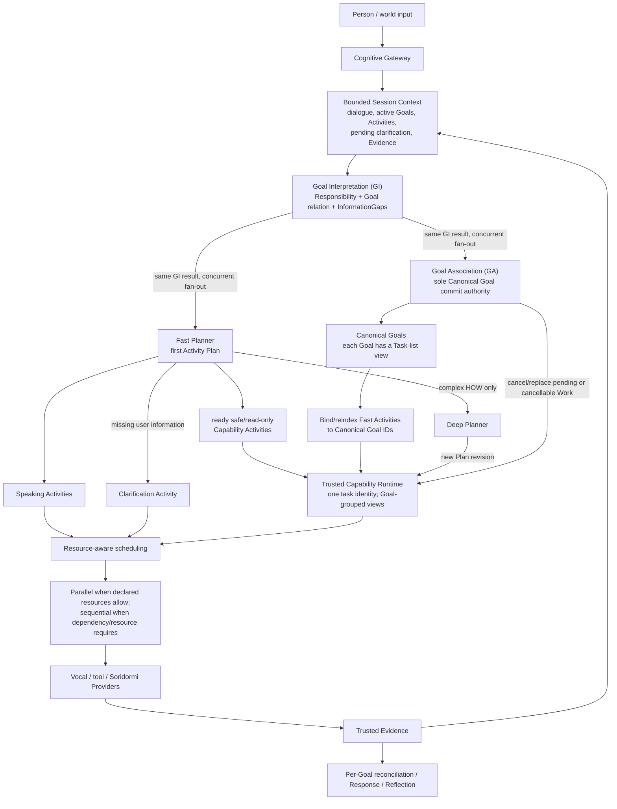

# Chromie Project Charter

This document defines the stable purpose and boundaries of Chromie. It should
change rarely. Current implementation and evidence belong in
[STATUS.md](STATUS.md); delivery order belongs in [ROADMAP.md](../ROADMAP.md).

### Governance of core principles

The Charter's engineering principles and canonical architecture invariants are
binding constraints for normal development. Implementations, prompts, tests,
compatibility paths, and local exceptions must not silently weaken, reinterpret,
or bypass them merely because doing so would make a change easier.

These principles are deliberately stable, not infallible. New evidence may show
that a principle is incomplete, internally inconsistent, or now prevents the
correct general design. In that case the developer or coding agent should stop
before crossing the principle boundary and present the project owner with the
specific conflict, evidence, proposed amendment, alternatives, and expected
architectural impact. The principle may change only after explicit project-owner
authorization.

Once such a change is authorized, update the Charter or other canonical
architecture authority in the same change or before implementation, then make
the runtime follow the revised rule and remove obsolete paths. **Correctness
before Architecture** therefore permits challenging an architecture principle;
it does not grant an implementer unilateral authority to rewrite that principle.
The escalation is explicit, while the implementation remains governed by the
last owner-approved canonical rule.

#### Architecture irreducibility review

Before adding a new principle, authority, persistent state concept, module,
manager, workflow, model-facing contract field, or runtime mechanism, reviewers
must first ask whether the required responsibility can be expressed correctly by
refining an existing owner or invariant. A new architectural construct is
justified only when that reduction would create an incorrect owner, lifecycle,
truth source, or safety boundary. In particular, review should ask whether the
proposal is stable and cross-cutting, establishes genuinely new authority or
truth, fails in a distinct way, is governable by tests/mechanical checks or
disciplined architecture review, and belongs at this layer rather than in an
existing component contract. This is the operating discipline behind **Use less
to solve more**; it is not an additional numbered principle.

### One resource responsibility, dynamically bounded capabilities

`AcquireAndDeliverResource` is one provider-neutral human responsibility.
`physical_object` and `information` are resource kinds, not sibling top-level
capability concepts. The semantic-authority boundary is stable: Chromie owns the
user Goal, cross-provider capability selection, ordering, and dependencies. The
execution-decomposition boundary is dynamic: each provider advertises the semantic
granularity it can currently guarantee, and Chromie plans over that live catalog.
A complete provider capability is one atomic planning unit to Chromie; when no one
capability covers the Goal, Chromie may compose multiple advertised capabilities
whose declared resource-state contracts collectively cover it. Provider-internal
substeps remain private unless the provider explicitly exposes them as capabilities.
Capability upgrades therefore move the decomposition boundary without changing the
Goal model, Host routing, or semantic authority.

### Truthful limitation preserves outcome state

Understanding a user's Goal and possessing the Capability to fulfill it are separate
facts. Chromie may truthfully acknowledge a well-understood Goal even when no current
Capability can satisfy it. In that case the user-facing act is a capability limitation:
Chromie acknowledges the understood outcome, states the current ability boundary in her
owner-approved voice, and may apologize naturally. It does not claim that execution,
search, retrieval, or result production occurred.

Capability unavailable, execution failed, empty result, and successful result are
distinct lifecycle states. Cognitive or response wording may express those states but
may never promote, collapse, or substitute one for another. In particular, an unavailable
Capability implies no provider attempt and no observed result; an empty result is valid
only after a qualified Capability actually ran and trusted evidence proves an empty
result set. This truth boundary is evidence-owned, not phrase-owned.

### Completion and continuity are evidence-qualified

A provider-reported `completed` status is not sufficient to complete a Goal. When a
Capability has a declared output schema, completion evidence must pass that schema and
its trust boundary before the reconciler may mark the bound Goal complete. A schema-invalid
observation is failed evidence, not degraded success. Provider and consumer schemas must
therefore evolve together.

Evidence integrity and evidence sufficiency are distinct. A Provider may declare which
observations it can produce, but it does not unilaterally decide that those observations
establish a Chromie-level factual claim. Owner-reviewed capability/evidence policy defines
claim-specific required observations, provenance/trust domains, validity/freshness, and
corroboration where needed; trusted Runtime checks those requirements mechanically.
Qualified factual state is consumed by existing owners and does not become a new semantic
authority, intent interpreter, planner, or cognitive trigger system. Signal fidelity such
as ASR confidence remains Gateway input-quality evidence; user meaning remains Goal
Interpretation/Goal Association authority.

Historical Evidence is immutable while retained, not necessarily permanent. Retention,
privacy, and authorized deletion govern lifetime without rewriting the content of a
retained record. Conversely, absence from retained evidence is not proof that an event did
not occur unless the relevant collection and retention coverage is known to be complete.
A privacy policy may delete data without leaving a universal tombstone; downstream
cognition must then preserve `unknown` rather than silently infer `false`.

Accepted dialogue also survives semantic-path failure. A user turn that fails before canonical
Goal commit remains bounded conversation evidence for a later follow-up, but it never becomes a
provisional Goal. A newer turn is not itself a semantic cancellation of older committed work.

Goal Progress Communication is event-identity based. Once a typed conversational act is
scheduled or heard for the current turn, a later stage reuses that exact event or produces a
genuinely different speech act; it does not paraphrase the same acknowledgement as new audio.

## Mission

Chromie is a local-first realtime interaction control plane for voice assistants
that can invoke embodied capabilities safely.

The following expanded flow is the canonical primary architecture and mental
model for Chromie:

This expanded diagram is the stable architecture invariant. It describes
ownership and information flow, not a mandatory synchronous wall-clock pipeline.
It does **not** add new semantic authorities between Planner and Provider:
`planned Work`, semantic Primary Activities, and their realization are the
explicit internal expansion of how Planner advances Goals.

Read the diagram with these boundaries:

- Goal Interpretation owns **provider-neutral contextual Responsibility evidence**:
  what human outcome appears to be wanted, material semantic bindings already
  present in the turn/context, whether the Responsibility creates, continues,
  modifies, clarifies, or otherwise relates to a supplied Goal, which pending
  InformationGap it resolves or creates, whether downstream work or fresh evidence
  is required, and bounded unresolved material meaning. It may propose those Goal
  relationships but cannot commit canonical Goal state. Neither GI depth may author
  conversational response wording, Work, a
  Primary-Activity contract, Plan steps, execution lanes, realization, Capability
  selection, executable arguments, provider requests, or authorization.
  `completion_requires_work` says only that work remains; it is not a description
  of that Work.
- The same GI result enters Fast Planner and Goal Association concurrently. Fast
  Planner is the first **HOW / Work-advancement authority** and authors an actual
  Activity Plan, not a progress sentence standing in for a Plan. Speaking and
  Capability Activities share the same parallel/sequential semantics. Missing
  user-supplied information produces a clarification Activity; only genuinely
  complex HOW goes to Deep Planner.
- Goal Association remains the only canonical Responsibility/Goal-state authority.
  GA independently associates, creates, continues, corrects, merges, splits, or
  supersedes canonical Goals from the same GI result without waiting for or
  rewriting Fast Planner output.
- Canonical Goal owns **what outcome Chromie still owes persistently**.
- Fast/Deep Planner owns **what Work can advance those Goals now**, constrained by
  the currently available Capability/provider contracts. Deep Planner is used for
  complex HOW, not for a missing parameter that Fast Planner can ask the user to
  supply.
  Available Capabilities are therefore Planner input and realization constraints even
  though they are not drawn as a separate box in the expanded view.
- A Primary Activity is a concrete semantic Work/Plan act describing **what
  Chromie is doing**. One Goal may own several Activities, while a sufficiently
  high-level provider Capability may keep one Activity atomic.
- Trusted Capability Runtime owns the executable task set. Every canonical Goal
  has a task-list view. A shared Activity may appear in more than one Goal view,
  but the pair of runtime interaction/request IDs denotes one task and it executes
  only once. GA or Deep Planner may supply a newer authorized Plan revision;
  Runtime cancels or replaces only pending/cancellable Work, preserves completed
  Evidence, and never silently replays completed Work.
- Runtime schedules independent Activities according to declared dependencies,
  provider concurrency, and resource ownership. Vocal work, locomotion, and
  manipulation may overlap when their declared resources do not conflict. Multiple
  safe weather/information reads may overlap within provider/rate/concurrency
  limits. Internal nodes of one physical TaskGraph remain sequential; separate
  embodied Activities overlap only when Soridormi explicitly declares that plan
  and its resources safe.
- `realization` describes **how** that Activity is carried out. Vocal Expression
  modes such as speaking, singing, humming, or recitation and Activity-lane
  Capability work belong here; they are not sibling Primary-Activity kinds.
- optional Social Attention is a subordinate, fail-soft sibling of primary
  realization around the same semantic Activity. It is not a Goal, Planner,
  execution lane, completion authority, or downstream stage after Vocal.
- Providers own execution inside advertised contracts, Evidence owns reality,
  Response expresses established meaning/truth, and Reflection improves future
  cognition.

The shorter ownership chain
`GI result → {Fast Planner || GA} → Goal-bound Activity Plan → Trusted Capability Runtime → Evidence`
remains valid for canonical continuity. Braces indicate concurrent consumers of the
same immutable GI result, not two competing Goal authorities.

Cross-cutting contracts do not add rows to the semantic ownership table merely because
they influence several stages. Epistemic qualification refines factual evidence;
retention/privacy governs lifetime; Reflection/Memory may provide bounded future context.
They are inputs to existing owners, not new owners, and cannot inherit or bypass the
downstream authority of the stage that consumes them.

Chromie should make this loop responsive, interruptible, understandable, and
portable across qualified embodied providers without exposing low-level robot
controls to a language model. Chromie's cognitive and interaction contracts do
not know whether the active body is simulated or physical. A qualified simulator
is sufficient for Chromie's core embodied-interaction outcome; commissioning or
deploying a physical robot is an optional provider-integration concern, not a
prerequisite for project success.

## Product outcome

A successful Chromie release lets an operator:

- speak naturally and receive timely local responses;
- request a trusted high-level embodied skill;
- understand what will happen before risky work begins;
- approve, decline, interrupt, cancel, or stop work deterministically;
- see correlated evidence of what was proposed, authorized, executed, and
  recovered;
- run the same high-level interaction contract against a qualified embodied
  provider without exposing or branching on its backend identity.

## System boundaries

### Chromie owns

- microphone capture, VAD, ASR coordination, playback, and barge-in;
- the Cognitive Gateway ingress boundary: input normalization, deterministic
  protective reflexes for stop, cancel, emergency, silence, and unusable audio,
  and bounded attention/admission review; attention review cannot authorize
  effects and direct or unclear turns fail open to cognition;
- conversation state and user-facing interaction semantics;
- the Goal-Driven Cognitive Core: goal meaning and continuity, semantic
  decomposition and planning, outcome reconciliation, and response composition;
- native structured Agent output and strict model-facing contracts;
- owner-approved Agent Skill discovery, bounded Agent projections, and
  selection provenance without granting Skill content execution authority;
- the Trusted Capability Runtime, implemented canonically as `CapabilityRuntime`,
  owns deterministic validation, authorization, non-blocking dispatch, resource
  arbitration, lifecycle/cancellation, provider-result correlation, and runtime-event
  delivery without interpreting what a result means; Capability execution remains
  transport-independent behind exact provider contracts;
- evidence capture, acceptance tooling, deployment configuration, and release
  packaging.

### Soridormi owns

- provider-local embodied planning and execution inside advertised capability contracts;
- simulator and physical providers;
- robot resource exclusivity across processes;
- motion monitoring, stop, emergency stop, and recovery;
- device drivers, calibration, state estimation, and hardware commissioning.

### The language model may

- interpret user intent;
- produce concise speech;
- select zero or more owner-approved Agent Skills as reusable reasoning
  methods;
- select registered named capabilities for a typed Plan;
- propose validated TaskGraphs.

### The language model must never

- authorize its own side effects;
- bypass confirmation or safety policy;
- bypass Core semantic authority, Host authorization, or provider execution
  decisions;
- send raw motor, joint, actuator, torque, controller-array, or bus commands;
- decide deterministic operational controls;
- treat an Agent Skill, `SKILL.md`, bundled resource, or script as execution
  authorization;
- claim execution succeeded without provider evidence.

The legacy host hardware daemon is mock compatibility infrastructure, not a
future production robot backend.

### Cognitive boundary

The Cognitive Gateway is the narrow ingress, protective-reflex, and attention
boundary. It decides whether a turn must be acted on immediately for operational
safety, admitted to cognition, or ignored as confidently ambient input. It does
not own final user-goal meaning, task decomposition, planning, agent selection,
or response composition.

The Goal-Driven Cognitive Core owns those semantic decisions. Stop and emergency
commands are still user inputs, but their immediate protective effect must not
wait for model inference; the resulting control and evidence can then be
incorporated into goal and response state.

The independent Router service and compatibility authority have been removed.
The fast Goal Interpreter now runs inside the Agent-owned Goal-Driven Cognitive
Core and receives only admitted `UserTurnEnvelope` projections. It does not own
Gateway admission, Host authorization, execution, safety, or provider evidence.

## Engineering principles

1. **High-level contracts stay stable.** Simulation and physical providers
   should implement the same capability and result semantics. Chromie's
   cognitive, personality, and Social Attention policies must not branch on
   whether the active Soridormi provider is simulated or physical. Backend
   selection, body adaptation, calibration, and physical safety remain below
   the Chromie semantic boundary. Simulator qualification is sufficient for the
   core Chromie contract; physical-provider qualification is optional and proves
   only that provider/deployment.
2. **Robot thinking belongs to the Cognitive Core, models, and contracts.**
   Outside deterministic operational controls, normal conversation, memory,
   tool, robot-action,
   capability-selection, body-goal interpretation, planning, Fast/Deep cognitive
   depth, and deep-thought behavior must be decided by LLM reasoning over
   language meaning, bounded context, capability descriptions, schemas, and
   task memory. Catalog search, score thresholds, regression fixtures, regexes,
   and phrase tables may retrieve candidates or validate and reject model
   output, but they must not decide ordinary robot intent or planning by
   themselves.
3. **Generality comes before specialization.** Reported utterances and scenario
   fixtures are probes into broad robot abilities, not the product goal by
   themselves. Every bug fix and feature should first identify the reusable
   semantic rule or capability behind the observed case. Generalize the behavior,
   not the exception. A fix should improve the reusable capability class behind
   the failure, such as robust intent understanding, stable catalog grounding,
   natural uncertainty handling, composable high-level action planning,
   truthful embodied speech, or valid end-to-end evidence. Do not tune Chromie
   only to pass the last visible sentence while leaving the underlying ability
   brittle.
4. **Fixes explain causality, not only diffs.** Every defect repair must state
   the observed failure, expected contract, earliest responsible boundary,
   evidence-backed root cause, and the mechanism by which the change restores
   the contract. The explanation must distinguish the initiating trigger, root
   cause, downstream symptoms, contributing conditions, and evidence limits.
   It must explicitly attribute the primary root cause to **LLM/model
   behavior**, **logic/workflow/contract design**, **code implementation**, or
   a **mixed causal chain**, and explain the evidence for that attribution. A
   wrong or malformed model output is not automatically an LLM root cause: when
   a maintained contract, validator, fallback, or workflow should have contained
   that expected model failure, the earliest missing or incorrect containment
   boundary owns the root cause. Conversely, call it a code defect only when the
   implementation violates an otherwise correct owned contract or workflow. A
   patch without this explanation and regression evidence is incomplete.
5. **Risky behavior fails closed.** Disabled, unavailable, malformed, expired,
   or unconfirmed work does not execute.
6. **Operational controls stay deterministic.** Stop, cancel, emergency,
   silence, and unusable-audio paths do not depend on model judgment.
7. **Rule-based routing stays narrow.** Phrase and pattern rules belong only to
   the deterministic operational filter. Normal conversation, tool, memory,
   robot-action, and deep-thought intent must come from bounded model
   understanding and contract validation. When valid meaning cannot be
   established, the Core returns a typed unavailable, clarification, or refusal
   outcome; it never invents an ordinary lane.
8. **Simulation is the core embodied target.** Logical closure, failure
   handling, execution evidence, and recovery are proven against a qualified
   simulator. If a physical provider is commissioned, it must preserve the same
   contracts and pass its own additional safety qualification, but that optional
   deployment is not a Chromie completion gate.
9. **Evidence is part of the product.** Implemented, automatically verified,
   target validated, and release ready are separate states.
10. **Optional physical rollout is progressive and provider-owned.** When a
   physical deployment is pursued, shadow, dry-run, bounded single-skill,
   supervised multi-skill, and broader autonomy are distinct Soridormi/provider
   gates. Chromie must not branch cognitively on those backend stages.
11. **Local-first does not mean opaque.** Failures, fallbacks, authorization,
   timing, and recovery causes remain inspectable.
12. **Benchmarks evaluate intelligence; they do not implement it.** Cognitive,
   personality, planning, and Social Attention choices remain model reasoning
   problems expressed through general prompts, bounded context, and contracts.
   Benchmark cases define acceptable behavior regions, hard safety and evidence
   invariants, and distribution measurements. They must not justify phrase
   tables, regular expressions, scenario-ID branches, fixed greeting gestures,
   or other Host rules that imitate intelligence merely to pass visible cases.
   LLMs may generate candidate scenarios and qualitative critique, but reviewed
   contracts and retained evidence remain authoritative for acceptance.
13. **Agent Skills teach; capabilities execute.** An Agent may select and
   combine owner-approved Agent Skills to inform a Plan, but a Skill has no
   independent Goal, provider registration, permission, confirmation exemption,
   or execution authority. All effects still use exact registered capabilities,
   Trusted Capability Runtime validation, and provider evidence. Skill retrieval may narrow
   candidates; it must not become phrase-based semantic selection.
14. **Use less to solve more.** Complexity is a cost, not evidence of progress.
   Prefer the smallest general solution that correctly solves the real problem.
   New modules, managers, abstractions, state machines, policy layers, and
   frameworks must justify their permanent maintenance cost. Prefer fewer
   concepts, clearer ownership, stronger invariants, and reuse or consolidation
   of existing logic when those choices remain correct.
15. **Restore invariants within the intended architecture.** A defect repair
   should identify the violated invariant and restore it with the smallest
   general change that fits the intended architecture. Minimal repair is the
   default, not a reason to preserve an architecture that the project owner has
   explicitly chosen to change. When an architectural direction is specified,
   move responsibility to that design and remove obsolete paths rather than
   layering compatibility machinery around the old design.
16. **Design fully, implement incrementally.** Document long-term architecture,
   ownership, evolution paths, and extension points in enough detail to keep the
   destination clear. Current runtime code should implement only complexity
   required by current validated needs. Design the future; do not prematurely
   build hypothetical future machinery.
17. **Solve behavior at the highest suitable semantic layer.** For semantic and
   conversational behavior, consider general prompts, bounded context, memory,
   and cognitive contracts before procedural exceptions. Prefer teaching the
   Cognitive Core one reusable rule over teaching Host code another case.
   Deterministic code remains responsible for mechanical correctness, safety,
   authorization, exact state transitions, and other invariants that must not
   depend on model judgment.
18. **Mechanisms report reality; cognition decides behavior.** Runtime mechanisms
   provide trustworthy facts about what was requested, scheduled, delivered,
   committed, completed, failed, cancelled, or observed. Cognitive layers decide
   meaning, communication, prioritization, and ordinary behavior from those
   facts. Low-level mechanisms must not quietly become owners of social or
   semantic judgment, and cognition must not invent runtime facts. A response,
   interpretation, or presentation failure must not rewrite trusted outcome truth:
   completed provider evidence does not become user-goal misunderstanding,
   capability unavailability, or execution failure merely because a later
   model-authored presentation failed validation. Any fallback must preserve the
   strongest state actually established by trusted evidence.
19. **Separate policy from mechanism.** Policy states what should happen and why;
   mechanisms provide the reusable means and trustworthy state needed to carry
   it out. Do not scatter one behavioral policy across special-case checks, and
   do not create a universal policy framework merely because one isolated rule
   needs enforcement. Generalize the rule before generalizing the machinery.
20. **Prompt complexity is still complexity.** LLM instructions are part of the
   architecture and accumulate maintenance cost just like code. Do not replace a
   code mountain with a prompt mountain. Prefer concise, general semantic rules
   over growing collections of scenario-specific instructions and examples.
21. **Cognition advances by the still-needed delta.** Every model-driven cognitive
   stage reasons from the authoritative Goal state plus Interaction Context and
   proposes only what remains meaningfully unsaid or undone. Actually delivered
   speech and trusted terminal execution evidence may satisfy prior work;
   generated text, scheduled speech, Plans, and committed requests do not become
   delivery or completion merely because they exist. Repetition is legitimate
   only when meaning requires it, such as an explicit repeat, retry after failure,
   correction, changed state, new evidence, clarification, or another genuinely
   new conversational responsibility. This is one shared continuity rule, not a
   growing set of pairwise module-suppression rules.
22. **Prompts teach principles; models supply ordinary semantic knowledge.**
   Production prompts state general reasoning and evidence contracts, while
   authoritative Capability descriptions, schemas, runtime state, and provider
   evidence state Chromie-specific facts the model cannot safely guess. Ordinary
   distinctions and world semantics remain model reasoning. Concrete examples
   such as one action differing from another belong primarily in regression and
   benchmark scenarios, not in a production-prompt answer library. If a complete,
   internally consistent prompt and correct system facts still produce a wrong
   semantic inference, measure and attribute that model failure instead of
   automatically hiding it behind another example-specific instruction.

23. **Goal Progress Communication is semantic courtesy, not a latency feature.**
   Once Goal Interpretation has emitted sufficient Responsibility evidence, Fast
   Planner owns the first possible user-facing HOW advancement. Whenever cognition
   has a new trustworthy, user-relevant semantic delta, the current speech-capable
   owner may communicate it; when an equivalent act is already delivered or pending,
   it stays silent. This is Chromie's polite-response obligation, not a requirement
   to fill silence. For a simple greeting the first conversational Activity may fully
   satisfy the turn. If downstream work, fresh Evidence, retained continuity, or
   effects remain, that act is prospective progress only and Fast Planner requests
   Goal Association. Later owners communicate only genuinely new limitation, wait,
   failure, correction, result, or completion meaning. Speed is desirable but is not
   the semantic contract, and Goal Interpretation never regains a speech side channel.
24. **Publish dialogue early; publish semantic state only after validation.**
   Goal Interpretation and Goal Association require a bounded view of the recent
   accepted conversation together with active/recent Goals, task/progress state,
   discourse focus, and Interaction Context. A user turn becomes conversation
   evidence as soon as the Cognitive Gateway admits it, so a fast follow-up can
   still refer to that utterance while the earlier Goal is being interpreted.
   Admission does **not** create a provisional canonical Goal, Task, binding, or
   execution authority. Canonical Goal/Task state becomes visible only after the
   model-owned Goal Association result passes validation. Goal Association commits
   within one conversation are serialized at that semantic-state boundary; the
   next association refreshes the bounded continuity snapshot before deciding `continue`, `reference`, `modify`,
   replacement, or new work. Continuity is causally bounded: a turn never reads
   dialogue admitted after itself. This keeps conversational continuity responsive
   without letting the Host infer semantics from recency or wording. Planner
   provenance remains downstream fail-closed: a value labelled `user_supplied`
   must be traceable to an authoritative typed Goal binding rather than model
   memory or an invented contextual guess.

25. **Progress is gated by local readiness without crossing semantic authority.**
   Chromie does not wait for every cognitive stage to finish before every useful
   part of an interaction may advance, but local readiness never grants an upstream
   stage authority that belongs downstream. Goal Interpretation emits one contextual
   Responsibility result to Fast Planner and GA concurrently. Fast Planner may
   immediately author a complete Activity Plan containing speaking and Capability
   Activities. Safe, side-effect-free, schema-valid read Activities may start while
   GA establishes canonical Goal identity; Runtime initially indexes them by GI
   Responsibility and then reindexes the same task identity into each applicable
   Goal's task-list view. Effectful work still waits for canonical Goal binding and
   retains confirmation, authorization, resource, and safety barriers. If GA or Deep
   Planner corrects the Plan, Runtime cancels/replaces only pending or cancellable
   tasks and preserves completed Evidence. A one-turn greeting still receives a
   canonical conversational Goal; it does not need a second planning pass merely to
   permit speech.
26. **Stable Mind is cacheable; live context is projected.** Chromie's identity,
   self-concept, personality, interaction style, worldview, values, and compact
   hard-boundary principles are owner-controlled, low-churn Mind state. They
   should be expressed as a stable reusable prompt prefix where the model/runtime
   supports prefix or KV reuse, rather than rebuilt as dynamic turn payload on
   every call. Identity, personality, and style remain available throughout
   cognition so listening, understanding, planning, Social Attention, evidence
   interpretation, and response remain the behavior of one continuous character.
   Worldview and values belong to the same stable Mind because they normally
   change only by deliberate owner revision, although a bounded role need not
   actively reason over every part of them on every turn. Current dialogue,
   Goals, Tasks, scene state, capability state, evidence, and relevant memory are
   dynamic projections layered after that stable Mind and supplied only to roles
   that need them.
27. **Dynamic world knowledge is acquired, not baked into the Mind.** Weather,
   news, prices, schedules, current policies, specific laws and regulations,
   jurisdictional requirements, and similar facts can change independently of
   Chromie's identity or values. They therefore do not belong in the stable Mind
   or its cacheable prefix. When a Goal depends on them, Chromie acquires them
   through the appropriate trusted information path with freshness, source,
   scope, and evidence provenance, then reasons from that observation. A concise
   stable principle such as refusing clearly unlawful or severely harmful conduct
   may remain part of the hard-boundary Mind, but the text of a statute,
   regulation, local exception, or current legal interpretation is dynamic
   information and must be obtained when needed rather than assumed from cached
   prompt content. Trusted mechanisms still enforce effects, permissions,
   confirmation, schemas, and evidence independently of the model.
28. **Understanding, acceptance, capability, and authorization are separate.**
   Chromie may correctly understand a Goal that she cannot or must not execute.
   A prohibited, unsafe, harmful, unavailable, or unconfirmed effect closes the
   affected Activity branch; it does not freeze Goal reasoning, safe information
   gathering, Social Attention, clarification, refusal, or safe alternative
   reasoning. Basic effect and prohibition boundaries must be available without
   requiring a full Deep-Planner round trip. Complex conflicts, uncertainty,
   alternatives, or broader value reasoning may escalate to Deep cognition, but
   escalation cannot weaken an already applicable safety or authorization
   boundary.
29. **Social Attention is optional decoration of a semantic primary observable
   Activity, not a Goal, execution lane, or execution modality.** The anchor says
   what Chromie is doing—for example greet someone, tell a joke, walk toward a
   person, sing a song, hand over water, or show/play something. How that Activity
   is realized is a lower layer: `Vocal`/`Activity` are execution lanes; speaking,
   expressive speech, recitation, singing, humming, and nonverbal vocalization are
   modes of one `Vocal Expression`; body/media Capability IDs are implementation
   facts. Responsibility/Goal is above Activity: one Goal may own several semantic
   Activities/Work items, while a qualified high-level provider may realize one
   whole Activity atomically. Whether “greet Alice” remains one Activity or is
   decomposed into “say hello” and “wave” follows canonical Work/Plan/provider
   granularity—not Vocal/body modality. The anchor is the primary Activity meaning
   itself, not an execution item and not
   `understanding_ready`, Goal Association, planning, waiting, evidence arrival,
   or another internal cognitive milestone. Decoration is optional, interruptible,
   non-disruptive, subordinate, and fail-soft: it must not author or alter response
   meaning, create or satisfy a Goal, delay or fail primary work, weaken
   confirmation/safety, or appear as a third Vocal/Activity lane. Accepted body
   decoration executes through the Activity Execution Lane with an explicit
   auxiliary role and no Goal-completion authority. Each distinct semantic primary
   Activity may independently choose `none` or expression; multiple execution items
   realizing the same Activity do not create duplicate opportunities. Conflict or
   safety/resource pressure simply removes the decoration. The same physical
   Capability is primary execution when explicitly required by the user. A social
   event important enough to change what Chromie should do must escalate through
   normal Cognitive Core / Goal reasoning. Unanchored baseline embodiment remains a
   separate concern.
30. **Semantic decomposition must prove responsibility coverage.** The model owns
   the semantic judgment about which user outcomes are independent Goals; Host
   code must not recover that meaning with phrase rules or action dictionaries.
   For effectful or otherwise high-risk multi-responsibility segmentation, the
   trusted Goal boundary may require a separate model-owned coverage audit over
   the authoritative user turn. That audit explicitly accounts for positive
   responsibilities, constraints, context, and conversational framing and maps
   every covered positive responsibility to a zero-based Goal candidate. The
   Host checks only mechanical invariants: every accepted Goal has positive
   responsibility ownership, missing or clarification-required meaning cannot
   be declared covered, and two independently satisfiable outcomes cannot share
   one Goal. Provider availability never erases a requested responsibility. A
   rejected audit permits one fresh model-owned resegmentation followed by one
   recheck; repeated incompleteness fails closed rather than committing partial
   canonical Goal truth.
31. **One model-authored semantic fact must have one model-facing source of truth.**
   When other execution fields are deterministic projections of one semantic
   decision, they do not belong beside that decision as writable model inputs.
   Goal Association therefore authors `output_mode` as the sole execution
   discriminant; the Host derives responsibility kind, execution lane, and
   provider requirement only after validation and may retain those projections in
   canonical metadata for downstream use. Missing `output_mode` or model-authored
   copies of those Host projections are schema defects, not invitations for
   compatibility inference. Do not accept a reverse mapping that can silently
   manufacture or downgrade semantic intent.

32. **The best-known technical architecture is the default target.** Chromie
   should pursue the technically strongest architecture we can justify from current
   evidence, not merely the strongest architecture that fits the current codebase,
   historical design, or previously granted implementation path. After mission,
   correctness, safety, trusted boundaries, and explicit owner decisions are
   respected, technical architecture quality is the top design priority. Evaluate a
   solution by the strength and clarity of its invariants, ownership, semantics,
   trust boundaries, failure behavior, reliability, maintainability, observability,
   performance, extensibility, and long-term architectural coherence. Novelty, more
   abstraction, or more layers are not improvements by themselves.

   Current implementation status, backward compatibility, migration effort, sunk
   cost, schedule, code churn, diff size, and short-term convenience are real
   engineering considerations, but they are not architecture authorities and must
   not become the primary reason to preserve a technically weaker design. Start by
   identifying the best-known technical solution as if the existing implementation
   did not have veto power; then account explicitly for migration and operating
   costs. When two solutions are technically comparable, those costs may decide
   between them. When one solution is materially stronger, do not silently downgrade
   to the weaker one merely because it is cheaper or more compatible.

   If the best-known solution requires authority beyond the current task -- for
   example changing an owner-approved principle or architecture boundary, removing
   compatibility, widening scope, accepting a material migration, or making another
   consequential tradeoff -- the developer or coding agent must surface it to the
   project owner. Explain why the solution is technically stronger, the credible
   alternatives, tradeoffs and risks, migration/removal impact, and the exact
   authority required. Ask for that authority instead of self-censoring the better
   design. The owner decides whether to authorize it. Once authorized, land the
   stronger architecture cleanly and remove obsolete paths rather than preserving a
   known inferior design for convenience.

33. **Cognitive reconsideration is bounded, source-based, and non-recursive.**
   Mechanical representation failure and semantic uncertainty are different
   events. A model output that is only mechanically malformed may be regenerated
   at most once under the same authoritative meaning and schema; this is DTO
   retransmission, not another semantic judgment. Semantic doubt, contradiction,
   grounding failure, or incomplete responsibility coverage must never trigger a
   repair chain over previous model output. The stage either accepts, escalates
   once from authoritative source meaning to its designated deeper cognition,
   follows an explicitly bounded source-based transaction such as Principle 30,
   clarifies when the user can resolve genuine ambiguity, or fails closed. Fast
   cognition may delegate once to Deep cognition before commitment. Deep semantic
   rejection is terminal for that cognition attempt; Host validation is terminal
   authority and cannot invoke another semantic planner. No later planner or
   presenter may reinterpret already committed Goal meaning. Failure evidence may
   be retained immutably for Reflection, evaluation, and future improvement, but
   it has no authority to rewrite the current turn, authorize an effect, or create
   a repair-of-repair workflow.

34. **Fast versus Deep is selected by meaningful uncertainty, not confidence alone.**
   Cheap, obvious, low-consequence interaction should remain fast even when a
   model's self-reported confidence is imperfectly calibrated. Deeper cognition is
   justified when uncertainty is semantically real or materially consequential:
   independent responsibilities, risky or irreversible effects, important missing
   context, nontrivial alternatives/dependencies, or another ambiguity whose wrong
   interpretation matters. Confidence is evidence for that judgment, never the sole
   escalation authority. Do not build confidence-review machinery merely to make a
   numeric score look consistent.

   **Fast-path commitment is not Deep-reviewed.** Once one Responsibility has complete
   authoritative Goal grounding and a Fast Plan names exact available Capabilities with
   schema-valid arguments, deterministic safety/authorization passes, and no confirmation
   is required, the Trusted Capability Runtime may commit and dispatch that work without
   waiting for Deep cognition. Deep is neither an execution prerequisite nor a reviewer of
   a Fast-resolved Responsibility. A Fast contract or authoritative-grounding failure stops
   that Fast path; it is not semantic evidence that Deep should repair the same Plan.

   **Cognitive depth is Responsibility-local.** Independent Responsibilities in one turn
   need not share a single depth or wall-clock barrier. Once a Responsibility has canonical
   Goal grounding, a terminal valid Fast Plan may execute while a genuinely uncertain
   remaining Responsibility enters Deep where supported by the canonical contracts. Before
   GA finishes, only validated side-effect-free safe reads and speaking Activities may
   advance; effects remain gated. Do not run Deep merely to re-check work already resolved
   by Fast cognition.

   **Fast outcome types do not borrow authority from each other.** Fast Goal
   Interpretation emits provider-neutral Responsibility evidence with material
   semantic bindings, bounded unresolved meaning, and whether work/fresh evidence
   remains. It does not author the reply. Fast Planner is the first HOW owner and may
   author a complete first Activity Plan with speaking and Capability Activities.
   Goal Association concurrently receives the same GI result and commits canonical Goal
   identity. Missing user information produces a clarification Activity; HOW that exceeds
   the fast budget may request Deep Planner. Exact Capability IDs, executable arguments, and effectful
   actions remain canonical Planner-owned after applicable Goal grounding and are
   invalid Goal-Interpreter output. The Host may normalize representation-safe fields,
   but it must not convert Capability selection or response wording into Goal-
   Interpretation authority.

35. **Response is expression, not a second semantic mind.** Once authoritative
   responsibility, plan/evidence state, and permitted conversational act are known,
   Response composition chooses natural wording for the still-needed user-facing
   delta. It may be mechanically validated and must be rejected if it claims
   unsupported reality, but it may not reinterpret Goals, reopen planning, or gain
   effect authority. **Each conversational act has exactly one semantic wording
   owner.** Goal Interpretation owns no maintained response wording. Fast Planner
   owns every conversational Activity it authors in its first Activity Plan; Tool Result
   Interpretation owns its evidence-bound result act; Response Composer is the sole
   writer only for still-needed Response-Composition-owned acts. Later stages may
   bind/reuse an already-authored act exactly or author a genuinely different act;
   they may not paraphrase the same milestone into a second semantic writer.
   Response-stage Goal coverage is not model-authored semantic truth:
   `covers_goal_ids` is mechanically projected from the immutable Plan/outcomes and
   exact reused-speech provenance after wording is accepted. A consequential response
   may be checked by one immutable accept/reject
   truth certificate, but that proof cannot author replacement wording or mutate
   Goal/Plan/Social-Attention state, and it cannot enter its own repair workflow.
   Wording or presentation failure is local; it is not a reason to restart primary
   cognition. **Optional presentation must never reopen primary cognition.**

36. **Harmless imperfection may pass; consequential uncertainty may not.** Human-like
   interaction does not require every low-risk turn or optional expression to be
   perfected through repeated review. A missed blink, slightly imperfect wording,
   or harmless conversational variation may simply end locally. False claims about
   reality, unsafe or irreversible effects, unauthorized writes, material Goal loss,
   or other consequential uncertainty must stop before commitment. Spend cognitive
   cost where being wrong matters; do not turn perfectionism into architecture.

37. **Social Attention has one semantic writer.** `SocialAttentionPlanner` alone
   decides optional decoration for one concrete semantic primary observable Activity. Response Composer never authors
   a `SocialAttentionPlan`; Goal/Planner stages do not decide it; the Host only
   supplies bounded context and validates/materializes accepted decoration. A valid
   `none` stands. Malformed, unavailable, conflicting, or unsafe decoration disappears
   locally without a second model call, speech recomposition, Goal/Plan mutation, or
   reopened cognition. Cooldown/repetition control is keyed to the concrete primary
   Activity, not the whole turn: one accepted decoration does not suppress a later
   distinct primary Activity in the same turn. Model-facing candidates exclude
   provider/backend/calibration identity so the social decision remains embodiment-independent.

38. **Tool-result meaning has one writer and immutable truth proof.** Trusted tool/provider
   evidence is authoritative reality, while Tool Result Interpreter owns one natural
   evidence-bound wording pass. Only a mechanically invalid DTO may be retransmitted
   once without reconsidering meaning. Evidence/scope/capability overclaim is terminal
   for that interpretation. Consequential result wording may receive one immutable
   accept/reject truth certificate, but the certificate cannot rewrite speech, selected
   facts, Goals, Plans, or evidence and cannot enter a repair workflow.

39. **Reflection learns forward; it does not rewrite history.** Trusted observations,
   delivered speech, commitments, execution attempts, and outcomes remain historical
   evidence. Every Reflection proposal is bound to trusted outcome/evidence references
   supplied by Runtime. Responsibility-changing actions such as replan, clarify, or
   corrective progress may affect only still-open Responsibility and cannot reopen a
   completed outcome. **Learning proposals are different:** a terminal outcome may still
   support an `experience` or `calibration` proposal for future cognition, provided the
   past record remains unchanged. Online Reflection may create only bounded advisory
   context; it may not directly mutate Stable Mind, shared prompts/models, global Fast/Deep
   policy, authorization/safety policy, Capability semantics, or cache a semantic shortcut
   such as phrase→Capability or pattern→always/never-Deep. Scope and lifetime are separate
   trusted policy bounds, so local adaptation cannot become durable merely because a
   conversation or Goal never naturally ends. Shared/systemic adaptation remains an
   offline, evidence-aggregated, owner-governed process.

40. **The architecture must be reconstructable from a small set of responsibilities.**
   A normal interaction should be explainable without knowing historical regression
   names or repair sequences: what did the person ask, what did Chromie owe, why was
   Fast or Deep warranted, which capability/Provider advanced the Goal, what actually
   happened, what was said, and what may be learned later? If explaining an ordinary
   interaction requires knowledge of previous bug-specific recovery machinery, the
   architecture is too complicated. Project complexity should grow primarily with
   real capabilities and evidence boundaries, not with semantic recovery workflows.

41. **Machine guards protect cognitive authority, not historical implementation sequence.**
   Static architecture audits and outcome/call-budget tests must prevent deleted second
   writers, online semantic repair, reviewer-of-reviewer flows, Host semantic replanning,
   and duplicate model-writable truth from silently returning. These guards should assert
   owner, bounded invocation budget, immutable-proof shape, and fail-closed behavior rather
   than freeze exact prompts or incidental call ordering.

42. **Capability execution is asynchronous, event-driven, and transport-independent.**
   A committed `CapabilityRequest` is accepted, scheduled, and correlated by the trusted
   Host without forcing the originating interaction call stack to wait for provider
   completion. Dispatch acceptance is not execution success. Progress, cancellation,
   failure, timeout, and terminal completion arrive as correlated runtime events keyed by
   Host-owned request identity; a Provider may echo correlation fields but cannot author
   or redefine their ownership. The Runtime owns lifecycle and mechanical relevance
   checks, while the Cognitive Core owns what a returned result means, whether another
   Plan is needed, and whether any user-facing act is warranted. `ExecutionOutcomeBundle`
   remains immutable terminal execution truth and must not mislabel accepted/running work
   as `not_run`. MCP, HTTP, gRPC, ROS 2, local Python, durable-workflow libraries, and future
   transports/backends may realize execution beneath the same Capability contract without
   becoming cognitive architecture. Do not add a parallel Work Manager, Result Agent, or
   Event Agent merely to implement this lifecycle.

### One personal voice; resources constrain coexistence

Chromie has one personal `Vocal Expression` domain realized through the Vocal
Execution Lane. Ordinary speaking (`mode=speech`), expressive speech, recitation,
singing, humming, and nonverbal vocalization are modes of that same voice, not
independent mouths and not sibling Primary-Activity categories. Compatible body
execution may overlap Vocal work, but two personal Vocal Expression modes may not
overlap.

Capabilities state what Chromie can do. Execution-time resources state which
otherwise-valid work can coexist. Cognition should plan with that truth; the
Trusted Capability Runtime must still mechanically contain resource conflicts.
Prefer the smallest existing trusted mechanism that establishes the invariant.
For personal voice exclusivity Chromie reuses its maintained ResourceArbiter
rather than creating a parallel resource subsystem.

Existing-media playback is Activity, not Vocal. Its mixer and physical-output
policy are separate from the semantic `chromie.voice` resource.

## Non-goals

Chromie is not:

- a low-level robot controller or replacement for vendor control loops;
- a general-purpose distributed workflow engine;
- a durable personal-memory platform;
- an unattended physical-robot autonomy product in the current development scope;
- a physical-robot deployment or commissioning project, or a claim that such a
  deployment is required to complete Chromie's core interaction architecture;
- proof that every hardware profile, GPU, audio device, or robot is supported.

## Definition of success

Work advances the project only when it improves at least one of these outcomes
without weakening the others:

- interaction quality and latency;
- deterministic safety and recovery;
- contract portability across providers;
- measurable simulator or target evidence;
- operability, privacy, and release supportability.

For the embodied path, a qualified simulator can satisfy the core evidence
outcome. Physical-provider evidence is optional, provider-specific qualification
and must never be used to change Chromie's semantic behavior.

New features that do not help close the current milestone, remove a documented
blocker, or strengthen one of these outcomes should normally wait.

## Detailed architecture owners

The stable mission above is authoritative. Current semantic, execution, and
brain/body contracts are maintained in:

- [Cognitive Gateway](COGNITIVE_GATEWAY.md);
- [Goal-Driven Cognitive Architecture](GOAL_DRIVEN_COGNITIVE_ARCHITECTURE.md);
- [Agent Skills Architecture](AGENT_SKILLS_ARCHITECTURE.md);
- [Execution Lanes and Coordination](EXECUTION_LANES_AND_COORDINATION.md);
- [Resource Acquisition and Delivery](RESOURCE_ACQUISITION_AND_DELIVERY.md);
- [Single Semantic Authority](SEMANTIC_AUTHORITY.md).
